author: Becky O'Connor, Piotr Paczewski, Oleksii Bielov
id: oss-install-openrouteservice-native-app
categories: snowflake-site:taxonomy/solution-center/certification/quickstart, snowflake-site:taxonomy/product/ai, snowflake-site:taxonomy/product/applications-and-collaboration, snowflake-site:taxonomy/snowflake-feature/native-apps, snowflake-site:taxonomy/snowflake-feature/snowpark-container-services, snowflake-site:taxonomy/snowflake-feature/geospatial, snowflake-site:taxonomy/snowflake-feature/cortex-llm-functions
language: en
summary: Install a self-contained OpenRouteService Native App in Snowflake using Cortex Code AI-powered skills. Deploy routing functions (Directions, Optimization, Isochrones) via Snowpark Container Services with no external APIs - customize for any city worldwide.
environments: web
status: Published
feedback link: https://github.com/Snowflake-Labs/sfguides/issues
fork repo link: https://github.com/Snowflake-Labs/sfguide-create-a-route-optimisation-and-vehicle-route-plan-simulator

# Install OpenRouteService Native App with Cortex Code

> 🚀 **Install. Customize. Optimize.** Use natural language to deploy a complete route optimization solution in Snowflake - no code, no external APIs, just results.

<!-- ------------------------ -->
## Overview 


**Deploy a complete route optimization platform in minutes using just natural language commands.**

This solution installs an [Open Route Service](https://openrouteservice.org/) Native App directly in your Snowflake account using **Cortex Code** - Snowflake's AI-powered CLI. No complex setup, no external APIs, no data leaving Snowflake.

### What You'll Build

🔧 **OpenRouteService Native App** - A self-contained routing engine running in Snowpark Container Services with SQL-callable functions.

📍 **Three Powerful Routing Functions:**
- **Directions** - Calculate optimal routes between multiple waypoints
- **Optimization** - Match delivery jobs to vehicles based on time windows, capacity, and skills
- **Isochrones** - Generate catchment polygons showing reachable areas within a given drive time

🗺️ **Any Location** - Customize to Paris, London, New York, or anywhere in the world with downloadable OpenStreetMap data.

🧪 **Function Tester** - An interactive Streamlit app to test the routing functions with sample addresses.

### Why This Matters

| Traditional Approach | This Solution |
|---------------------|---------------|
| External API dependencies | Self-contained Native App |
| Data leaves your environment | Everything stays in Snowflake |
| Complex integration work | Deploy with natural language commands |
| Pay-per-call API limits | Unlimited calls, you control compute |
| Hours of setup | Minutes to deploy |

### Prerequisites

> **_NOTE:_** Cortex Code is currently in **Private Preview**. Contact your Snowflake account team for access.

**This is what you will need**:

-   **ACCOUNTADMIN** access to your Snowflake account
    
-   [Snowpark Container Services Activated](https://docs.snowflake.com/en/developer-guide/snowpark-container-services/overview)

> **_NOTE:_** This is enabled by default with the exception of Free Trials where you would need to contact your snowflake representative to activate it.  

-   [External Access Integration Activated](https://docs.snowflake.com/en/sql-reference/sql/create-external-access-integration) - Required to download map files from provider account

-   **Cortex Code CLI** installed and configured
    - Installation: Once you have access, install via the provided instructions
    - Add to your PATH: `export PATH="$HOME/.local/bin:$PATH"` (add to `~/.zshrc` or `~/.bashrc`)
    - Verify: `cortex --version`

> **_TODO:_** 📝 This section requires update once the official Cortex Code installation method is publicly available. The current instructions are for Private Preview access only.

-   **Container Runtime** - One of the following:
    - [Podman](https://podman.io/) (recommended): `brew install podman` (macOS) 
    - [Docker Desktop](https://www.docker.com/products/docker-desktop/)

-   [VSCode](https://code.visualstudio.com/download) recommended for running Cortex Code commands

### Route Planning And Optimization Architecture

The architecture below shows the solution which uses a native app and container services to power sophisticated routing and optimisation functions. 


This is a self-contained service which is managed by you. There are no API calls outside of Snowflake and no API limitations. This solution uses a medium CPU pool which is capable of running unlimited service calls within **San Francisco** (the default map). If you wish to use a larger map such as Europe or the World, you can increase the size of the compute.


### What You'll Learn 

- Deploy a Snowflake Native App using **Cortex Code** AI-powered CLI with natural language commands
- Use **Snowpark Container Services** to run OpenRouteService as a self-managed routing engine
- Understand **Geospatial** data in Snowflake and how it integrates with routing functions
- Work with 3 routing functions deployed via the Native App:
  - **Directions** - Simple and multi-waypoint routing based on road network and vehicle profile
  - **Optimization** - Route optimization matching demands with vehicle availability
  - **Isochrones** - Catchment area analysis based on travel time
- Customize map regions and vehicle profiles for your specific use case

<!-- ------------------------ -->
## Deploy the Route Optimizer


Use Cortex Code, Snowflake's AI-powered CLI, to deploy the Native App using natural language commands and automated skills.

### Setup Cortex Code

1. **Clone the repository**:
     ```bash
   git clone https://github.com/Snowflake-Labs/sfguide-create-a-route-optimisation-and-vehicle-route-plan-simulator
     cd sfguide-create-a-route-optimisation-and-vehicle-route-plan-simulator
     ```
   
   **Without Git**: Download the ZIP from the repository and extract it, then navigate to the folder in VS Code

   After cloning, open the folder in VS Code. You should see the following structure in your Explorer:

   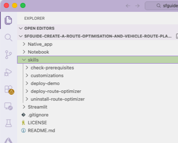

2. **Launch Cortex Code CLI** in the VS Code terminal:
   ```bash
   cortex
   ```

3. **Connect to Snowflake** - Cortex Code will prompt you to select or create a connection.  once a connection has ben created using one of the authentication methods, you will now be able to start cortex code in the terminal by using the **cortex** command which will give you a similar screen as below.

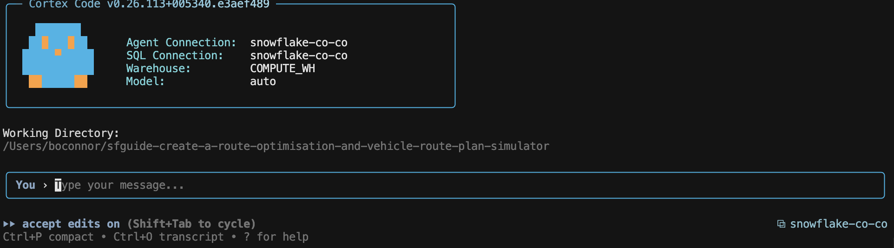

### Understanding Cortex Code Skills

Before running any commands, it's helpful to understand what **skills** are and how they power this solution.

**What are Skills?**

Skills are structured specifications that instruct Cortex Code how to perform a procedure. Think of them as detailed recipes - they define the exact steps, parameters, and verification checks needed to accomplish a task. Each skill is a markdown file that describes:

- **What the skill does** - A clear description of the outcome
- **Step-by-step instructions** - The exact sequence of actions to perform
- **Stopping points** - Where to pause for user input or verification
- **Success criteria** - How to verify the task completed correctly

**Benefits of Using Skills**

| Benefit | Description |
|---------|-------------|
| **Consistency** | Skills ensure the same steps are followed every time, reducing human error |
| **Reusability** | Once created, skills can be shared and reused across projects and teams |
| **Transparency** | You can read the skill file to understand exactly what will happen before running it |
| **Customizability** | Skills can be modified to fit your specific requirements |
| **AI-Assisted Creation** | Cortex Code can help you create new skills from natural language descriptions |

**How This Solution Uses Skills**

This repository demonstrates how skills can manage the **complete lifecycle** of an end-to-end Snowflake analytical solution - from installation through customization to uninstallation. The 6 pre-built skills in the `skills/` folder cover every stage:

| Stage | Skills | What They Do |
|-------|--------|--------------|
| **🔍 Prerequisites** | `check-prerequisites` | Verify dependencies, container runtime, and Snowflake access |
| **📦 Install** | `deploy-route-optimizer` | Deploy Native App and container services |
| **⚙️ Customize** | `customizations` (with 2 sub-skills) | Change map region and vehicle types |
| **🗑️ Uninstall** | `uninstall-route-optimizer` | Cleanly remove all resources from your Snowflake account |

To run any skill, simply tell Cortex Code:
```
use the local skill from skills/<skill-name>
```

For example:
```
use the local skill from oss-install-openrouteservice-native-app/skills/deploy-route-optimizer
```

Cortex Code reads the skill's markdown file and executes each step, asking for input when needed and verifying success before moving on.

> **_TIP:_** Want to see what a skill does before running it? Open the skill's `.md` file in the `skills/` folder to review the exact steps.

### Verify Prerequisites (Optional)

Run the prerequisites check skill to ensure all dependencies are installed:
   ```
   use the local skill from oss-install-openrouteservice-native-app/skills/check-prerequisites
   ```

### Deploy the Native App

Simply type the following command in Cortex Code:

```
use the local skill from oss-install-openrouteservice-native-app/skills/deploy-route-optimizer
```

Cortex Code will automatically:
- Create the required database, stages, and image repository
- Upload configuration files
- Detect your container runtime (Docker or Podman)
- Build and push all 4 container images
- Deploy the Native App

The skill will guide you through any required steps, including:
- Selecting your preferred container runtime if both are available
- Authenticating with the Snowflake image registry
- Monitoring the build progress

The skill uses interactive prompting to gather required information:

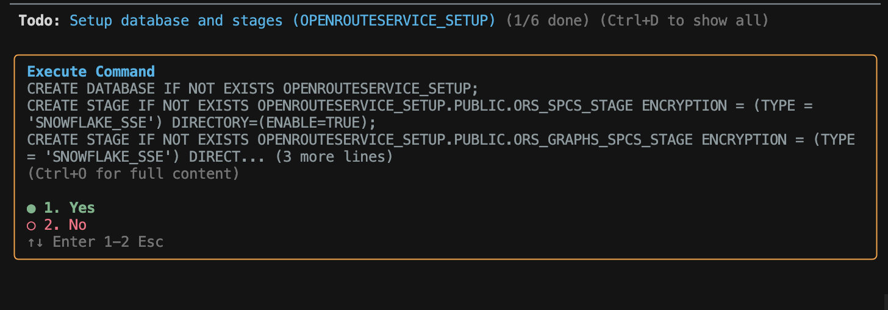

> **_TIP:_** Use your keyboard arrow keys to toggle through the options, then press **Enter** to confirm your selection.

**What gets installed:**

| Component | Name | Description |
|-----------|------|-------------|
| Database | `OPENROUTESERVICE_SETUP` | Setup database with stages and image repository |
| Stage | `ORS_SPCS_STAGE` | Configuration files and map data |
| Stage | `ORS_GRAPHS_SPCS_STAGE` | Generated routing graphs |
| Stage | `ORS_ELEVATION_CACHE_SPCS_STAGE` | Elevation data cache |
| Image Repository | `IMAGE_REPOSITORY` | Container images for services |
| Application Package | `OPENROUTESERVICE_NATIVE_APP_PKG` | Native App package |
| Application | `OPENROUTESERVICE_NATIVE_APP` | Deployed Native App with routing functions |

Simply confirm each prompt as the skill progresses. The skill handles all the complex setup automatically - creating databases, uploading files, building containers, and deploying the Native App.

Once complete, you'll see a success message with a direct link to your app:

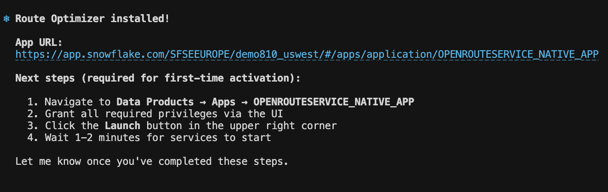

<!-- ------------------------ -->
## Activate the App

Once deployment completes, Cortex Code will provide a link to your app. You need to:

1. Navigate to **Data Products > Apps > OPENROUTESERVICE_NATIVE_APP** in Snowsight

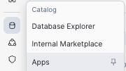

2. Click on the **OPENROUTESERVICE_NATIVE_APP** to open it

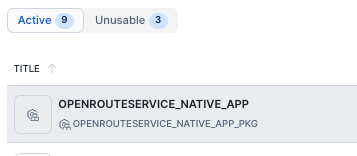

3. Grant the required privileges and review external access

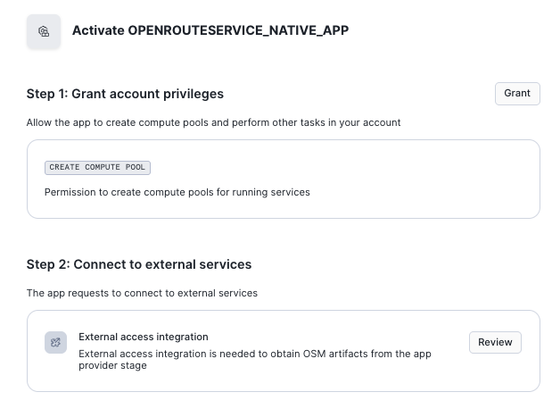

The app requires these permissions to function:
- **CREATE COMPUTE POOL**: Allows the app to create compute pools for running the OpenRouteService containers via Snowpark Container Services
- **External access integration**: Required to download OpenStreetMap (OSM) data files from external sources during the initial setup

Click **Grant** for Step 1. For Step 2, click **Review** to see the external endpoints, then click **Connect** to allow the connection.

4. Once all privileges are granted, click **Activate** and wait a few minutes for the routing functions to install and the graphs to build

> **_NOTE:_** The activation time depends on your configuration:
> - **Map size**: Larger country or state maps take longer than city maps
> - **Vehicle profiles**: Each enabled profile (driving-car, cycling, walking, etc.) generates its own routing graph
> - **Resource scaling**: The compute pool size affects build speed
>
> The combination of map size and vehicle options determines the total number of graphs to build. A city map with 2 profiles will complete quickly, while a country map with 5+ profiles will take significantly longer.

Once activated, you'll see a **Launch app** button appear. Click it to open the Service Manager.

### Service Manager

The Launch app button takes you to the **Service Manager** dashboard, which displays the status of each of the four services running:


The Service Manager shows:
- **Service Status Dashboard** - Overview of all running, stopped, and error states
- **Individual Service Management** - Start/Stop controls for each service:
  - **Data Downloader** - Downloads and updates map data
  - **Open Route Service** - Core routing and directions engine
  - **Routing Gateway** - API gateway for routing requests
  - **VROOM Service** - Route optimization engine

Use the **Start All** / **Stop All** buttons for bulk operations, or manage services individually. Click **Refresh Status** to update the dashboard.

> **_TIP:_** All 4 services should show ✅ RUNNING status before using the routing functions.

<!-- ------------------------ -->
## ORS Configuration

The Native App is configured via the `ors-config.yml` file which controls:

**Map Source File**
```yml
ors:
  engine:
    profile_default:
      build:  
        source_file: /home/ors/files/SanFrancisco.osm.pbf
```
The default deployment uses San Francisco. When you customize the map region, this path is updated automatically.

**Routing Profiles**

The configuration defines which vehicle types are available for routing:

| Profile | Description | Default |
|---------|-------------|---------|
| `driving-car` | Standard passenger vehicle | ✅ Enabled |
| `driving-hgv` | Heavy goods vehicle (trucks) | ✅ Enabled |
| `cycling-road` | Road bicycle | ✅ Enabled |
| `cycling-regular` | Regular bicycle | ❌ Disabled |
| `cycling-mountain` | Mountain bicycle | ❌ Disabled |
| `cycling-electric` | Electric bicycle | ❌ Disabled |
| `foot-walking` | Pedestrian walking | ❌ Disabled |
| `foot-hiking` | Hiking trails | ❌ Disabled |
| `wheelchair` | Wheelchair accessible | ❌ Disabled |

> **_NOTE:_** Enabling more profiles increases graph build time and compute resource usage. The default configuration covers most delivery and logistics use cases.

**Optimization Limits**

The config also controls route optimization capacity:
```yml
    matrix:
      maximum_visited_nodes: 100000000
      maximum_routes: 250000
```
These settings support complex route optimizations with many vehicles and delivery points.

<!-- ------------------------ -->
## Function Tester

The Native App includes a built-in **Function Tester** Streamlit application for testing the routing functions interactively.

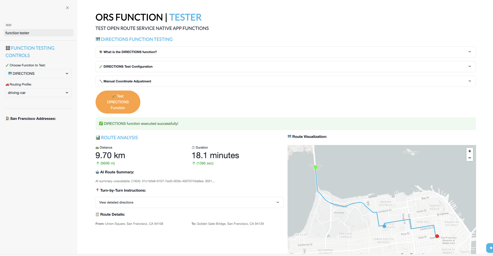

To access the Function Tester:
1. Open **Data Products > Apps > OPENROUTESERVICE_NATIVE_APP** in Snowsight
2. Navigate to the **Function Tester** page in the app

The Function Tester allows you to test all three routing functions:

**🗺️ DIRECTIONS**
- Select start and end locations from preset addresses
- Choose a routing profile (car, truck, bicycle)
- View the calculated route on an interactive map
- See step-by-step directions and distance/duration

**🚚 OPTIMIZATION**
- Configure multiple vehicles with different:
  - Time windows (start/end hours)
  - Capacity limits
  - Skill sets (refrigeration, hazardous goods, etc.)
- Add delivery jobs with:
  - Locations
  - Time windows
  - Required skills
- Run the optimization to see assigned routes per vehicle
- View detailed itinerary for each vehicle

**⏰ ISOCHRONES**
- Select a center point location
- Choose travel time in minutes
- Generate a catchment polygon showing how far you can travel
- Useful for delivery zone planning and coverage analysis

> **_TIP:_** The Function Tester comes pre-configured with San Francisco addresses and default vehicle profiles (car, HGV, road bicycle). When you customize the deployment, the Function Tester is automatically updated with region-specific addresses and your enabled vehicle profiles.

<!-- ------------------------ -->
## Customize Your Deployment

The default deployment uses San Francisco with standard vehicle types. You can customize **two key areas** for the ORS Native App:

| Customization | Default | Example Custom |
|---------------|---------|----------------|
| 🗺️ **Map Region** | San Francisco | Paris, London, Tokyo, etc. |
| 🚚 **Vehicle Types** | Car, HGV, Road Bicycle | Add walking, wheelchair, electric bicycle |

> **_NOTE:_** This step is optional. If you skip customization, the Native App will use the San Francisco defaults.

To customize, run:

```
use the local skill from oss-install-openrouteservice-native-app/skills/customizations
```

### ORS Customization Skills

```
oss-install-openrouteservice-native-app/skills/customizations/
├── customizations.md    ← Main orchestrator (entry point)
├── location.md          ← Download new map, rebuild graphs
└── vehicles.md          ← Configure routing profiles  
```

### How the Customization Works

The main `customizations` skill orchestrates the process by asking **two yes/no questions**, then runs only the relevant sub-skills:

1. **"Do you want to customize the LOCATION (map region)?"**
   - If YES → Runs `location.md` → `vehicles.md`
   - If NO → Skips map download entirely

2. **"Do you want to customize VEHICLE TYPES (routing profiles)?"**
   - If YES → Runs `vehicles.md`
   - If NO → Keeps default profiles (car, HGV, road bicycle)

### Which Sub-Skills Run Based on Your Choices

| Your Choices | Sub-Skills Executed | What Gets Updated |
|--------------|---------------------|-------------------|
| **Location = YES** | `location` → `vehicles` → **deploy-route-optimizer** | Map downloaded, graphs rebuilt, Native App updated |
| **Vehicles = YES** | `vehicles` → **deploy-route-optimizer** | Routing profiles modified, Native App updated |
| **Location + Vehicles** | `location` → `vehicles` → **deploy-route-optimizer** | Everything updated |
| **Nothing** | None | Exit (no changes) |

### Running Individual Sub-Skills

You can also run specific customizations directly:

```bash
# Just change the map region
use the local skill from oss-install-openrouteservice-native-app/skills/customizations/location

# Just modify vehicle profiles
use the local skill from oss-install-openrouteservice-native-app/skills/customizations/vehicles
```

> **_IMPORTANT:_** When running sub-skills independently, be aware of dependencies:
> - After running `location`, you should also run `vehicles` → **deploy-route-optimizer**
> - After running `vehicles`, you should also run **deploy-route-optimizer**

### Example: Customizing to Paris

Let's try changing the location to Paris. In Cortex Code, simply type:

```
change the location to paris
```

Cortex Code will find the appropriate skill and guide you through the process:

**Step 1: Location Change**
- Cortex Code downloads the Paris (or Île-de-France) map from Geofabrik
- Uploads the OpenStreetMap data to Snowflake
- Updates `ors-config.yml` with the new map path

**Step 2: Vehicle Profiles**
- Choose which routing profiles to enable for Paris:
  - `driving-car` - Standard passenger vehicle ✅
  - `driving-hgv` - Heavy goods vehicle (trucks) ✅
  - `cycling-road` - Road bicycles ✅
  - `foot-walking` - Pedestrian (optional)
  - `wheelchair` - Wheelchair accessible (optional)

**Step 3: Function Tester Update**
- Updates Function Tester with Paris addresses
- Updates available vehicle profiles dropdown to match your configuration

**Step 4: Rebuild Graphs**
- Services restart to rebuild routing graphs for Paris
- Changes are applied directly to your local files

Once the customization completes, Cortex Code shows a summary of everything that was updated:

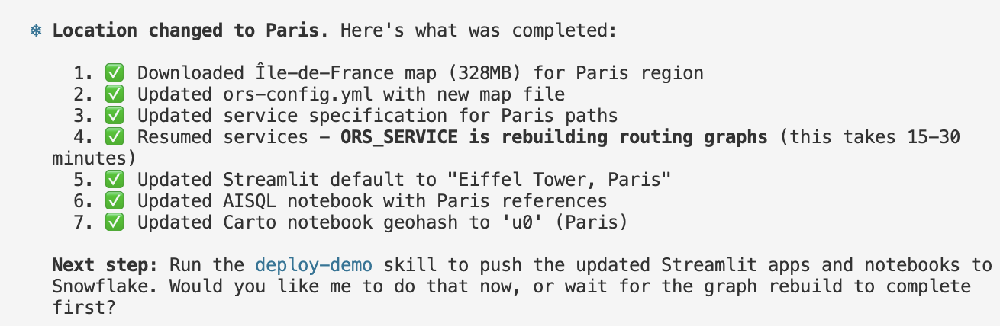

The summary confirms:
1. ✅ **Map downloaded** - The Île-de-France map for the Paris region
2. ✅ **Config updated** - `ors-config.yml` now points to the new map file
3. ✅ **Service spec updated** - Volume paths configured for Paris
4. ✅ **Services resumed** - ORS_SERVICE is rebuilding routing graphs (this takes 15-30 minutes depending on map size)
5. ✅ **Streamlit updated** - Default location changed to "Eiffel Tower, Paris"
6. ✅ **AISQL notebook updated** - AI prompts now reference Paris
7. ✅ **Carto notebook updated** - Geohash filter set for Paris region

> **_NOTE:_** If the demo is installed, Cortex Code will ask if you want to run `deploy-demo` to push the updated Streamlit and notebooks to Snowflake. If the demo is not yet installed, these updates will be applied automatically when you deploy the demo later.

> **_NOTE:_** Demo-related customizations (industries, notebooks, Simulator) are handled by the **[Deploy Route Optimization Demo](../oss-deploy-route-optimization-demo/)** quickstart after installing ORS.

**⏳ Wait for Services to Restart**

After the map is uploaded (if location was changed) or profiles were modified (if vehicles were changed), the services need to rebuild the routing graphs. You can monitor progress in the Service Manager:

1. Navigate to **Data Products > Apps > OPENROUTESERVICE_NATIVE_APP**
2. Check the **Service Manager** - all 4 services should show ✅ RUNNING
3. The **Open Route Service** will take the longest as it builds the graph files

Once services are running, the Function Tester will show **Paris addresses** instead of San Francisco!

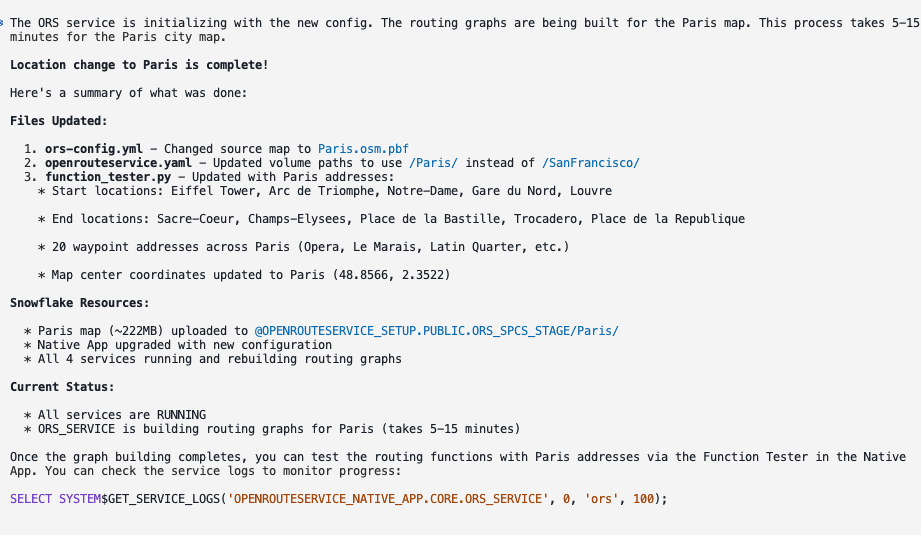

You can now test the routing functions with Paris addresses. Here's an example of testing the **ISOCHRONES** function to calculate a 15-minute driving catchment area from the Eiffel Tower:

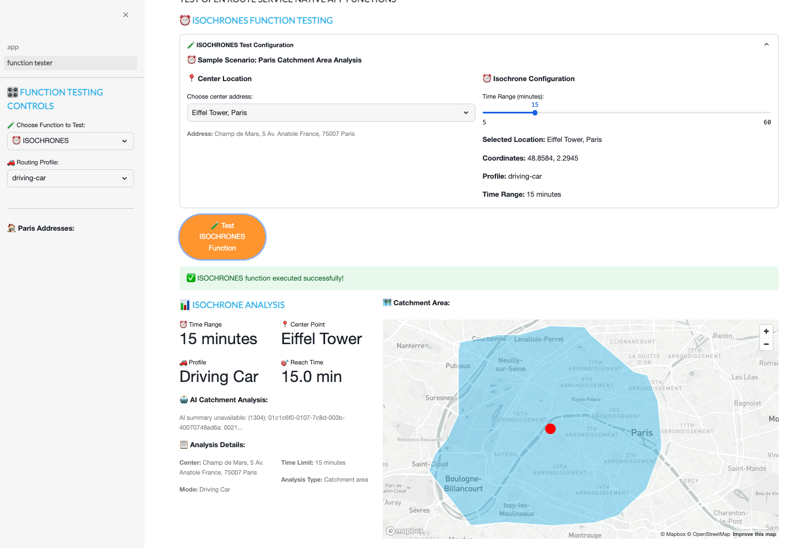

> **_TIP:_** If you only want to enable additional vehicle profiles (and keep San Francisco), answer NO to location. This skips map download entirely - making it much faster!

### Map Download & Resource Scaling (Location Changes Only)

If you selected YES to location customization, the skill downloads OpenStreetMap data from Geofabrik or BBBike. The bigger the map file, the longer it takes to:
- **Download** the OSM data from the source
- **Upload** to the Snowflake stage
- **Generate graph files** for route calculations

| Map Size | Example Regions | Download Time | Graph Build Time | 
|----------|-----------------|---------------|------------------|
| < 100MB | San Francisco, Zurich | Minutes | 5-15 minutes |
| 100MB - 1GB | New York State, Switzerland | 10-30 minutes | 30-60 minutes |
| 1-5GB | Germany, France, California | 30-60 minutes | 1-3 hours |
| > 5GB | Great Britain, entire countries | 1-2 hours | 3-8+ hours |

> **_IMPORTANT:_** For country-wide or large region maps, graph generation can take **several hours**. The services will show as "running" while building graphs in the background.

**Automatic Compute Scaling**

Cortex Code will detect the map size after download and offer to **resize the compute pool** to speed up graph generation:

| Map Size | Suggested Compute | Auto-Suspend Extension |
|----------|-------------------|------------------------|
| < 1GB | CPU_X64_S (default) | 1 hour |
| 1-5GB | HIGHMEM_X64_M | 8 hours |
| > 5GB | HIGHMEM_X64_M | 24 hours |

When prompted, you can accept the scaling recommendation to ensure graphs are computed as quickly as possible. The extended auto-suspend time prevents the service from shutting down mid-build.

> **_TIP:_** For quickest results, use the smallest map that covers your use case. A city-level map (e.g., New York) builds much faster than a country map (e.g., USA).

**Routing Profile Configuration**

The skill presents available routing profiles and lets you enable/disable them:

| Profile | Category | Description |
|---------|----------|-------------|
| `driving-car` | Driving | Standard passenger vehicle |
| `driving-hgv` | Driving | Heavy goods vehicles (trucks) |
| `cycling-regular` | Cycling | Standard bicycles |
| `cycling-road` | Cycling | Road bicycles |
| `cycling-mountain` | Cycling | Mountain bicycles |
| `cycling-electric` | Cycling | Electric bicycles |
| `foot-walking` | Foot | Pedestrian walking |
| `foot-hiking` | Foot | Hiking trails |
| `wheelchair` | Wheelchair | Wheelchair accessible routes |

> **_NOTE:_** Enabling more profiles increases graph build time. The default (driving-car, driving-hgv, cycling-road) covers most logistics use cases.

**Function Tester Customization**

The skill automatically updates the **Function Tester Streamlit** with:

**Region-specific sample addresses:**
   - Start locations (5 landmarks/city centers)
   - End locations (5 different destinations)
   - Waypoints (20 locations across the region)

**Vehicle profiles dropdown:**
- Updated to show only your enabled profiles
- Matches the profiles configured in `ors-config.yml`

This ensures test addresses are valid for your map region and vehicle options match your configuration.

> **_NOTE:_** Demo-related customizations (AISQL notebooks, industry categories) are covered in the **[Deploy Route Optimization Demo](../oss-deploy-route-optimization-demo/)** quickstart.

> **_TIP:_** Customizations modify your local files directly. If you want to preserve the original San Francisco configuration, make a backup before customizing.

Once your services are running with the new map (or if you skipped customization), you're ready to deploy the demo!

<!-- ------------------------ -->
## Next Steps: Deploy the Demo

🎉 **Congratulations!** Your OpenRouteService Native App is now installed and configured.

To deploy the Route Optimization Simulator demo with real-world POI data and interactive notebooks, continue to the next quickstart:

👉 **[Deploy Route Optimization Demo](../oss-deploy-route-optimization-demo/)**

The demo quickstart will:
- Acquire the **Carto Overture Maps Places** dataset with 50+ million POIs worldwide
- Deploy interactive **AISQL notebooks** to explore routing functions
- Create the **Route Optimization Simulator** Streamlit app

All demo content will use your configured map region (San Francisco by default, or your customized region like Paris).

<!-- ------------------------ -->
## Available Cortex Code Skills

For reference, here are the Cortex Code skills for the OpenRouteService Native App:

### OpenRouteService Skills

| Skill | Description | Command |
|-------|-------------|---------|
| `check-prerequisites` | Verify and install dependencies | `use the local skill from oss-install-openrouteservice-native-app/skills/check-prerequisites` |
| `deploy-route-optimizer` | Deploy the ORS Native App | `use the local skill from oss-install-openrouteservice-native-app/skills/deploy-route-optimizer` |
| `uninstall-route-optimizer` | Remove app and all dependencies | `use the local skill from oss-install-openrouteservice-native-app/skills/uninstall-route-optimizer` |

### Customization Sub-Skills

These can be run individually for targeted updates to the Native App:

| Sub-Skill | Description | Command |
|-----------|-------------|---------|
| `location` | Download new map, rebuild graphs | `use the local skill from oss-install-openrouteservice-native-app/skills/customizations/location` |
| `vehicles` | Configure routing profiles | `use the local skill from oss-install-openrouteservice-native-app/skills/customizations/vehicles` |

> **_TIP:_** Use the main `customizations` skill to let Cortex Code orchestrate the process: `use the local skill from oss-install-openrouteservice-native-app/skills/customizations`

### Demo Skills

For demo-related skills (deploying notebooks, Streamlit simulator, and demo customizations), see the **[Deploy Route Optimization Demo](../oss-deploy-route-optimization-demo/)** quickstart.

<!-- ------------------------ -->
## Uninstall the Route Optimizer

Cortex Code makes uninstallation simple with natural language commands.

### Uninstall ORS Only

To remove the OpenRouteService Native App and ORS resources:

```
uninstall route optimizer
```

This will:
- Remove the Native App (`OPENROUTESERVICE_NATIVE_APP`)
- Drop the Application Package (`OPENROUTESERVICE_NATIVE_APP_PKG`)
- Delete the setup database (`OPENROUTESERVICE_SETUP`) including all stages and image repository
- Optionally remove local container images

> **_NOTE:_** This only removes ORS components. Demo content (notebooks, Streamlit simulator) will remain if deployed.

### Uninstall Everything

If you also deployed the demo and want to remove everything:

```
uninstall demo and optimizer
```

Cortex Code will run both uninstall skills, removing all demo and ORS resources from your Snowflake account.

> **_TIP:_** You can also use the full skill path if preferred:
> `use the local skill from oss-install-openrouteservice-native-app/skills/uninstall-route-optimizer`

> **_NOTE:_** The uninstall skill will ask for confirmation before removing resources. This is a destructive operation that cannot be undone.

<!-- ------------------------ -->
## Conclusion and Resources
### Conclusion

You've just deployed a **self-contained routing engine** in Snowflake using natural language commands - no complex configuration files, no external API dependencies, and no data leaving your Snowflake environment.

This solution demonstrates the power of combining:
- **Cortex Code** - AI-powered CLI that turns natural language into automated workflows
- **Snowpark Container Services** - Running OpenRouteService as a self-managed Native App
- **Native App Functions** - SQL-callable routing functions for directions, optimization, and isochrones

The key advantage of this approach is **flexibility without complexity**. Want to switch from San Francisco to Paris? Just run the location customization skill. Need to add walking or cycling routes? Enable additional routing profiles. The skill-based approach means you only run the steps you need.

### What You Learned

- **Deploy Native Apps with Cortex Code** - Use natural language skills to automate complex Snowflake deployments including container services, stages, and compute pools

- **Self-Managed Route Optimization** - Run OpenRouteService entirely within Snowflake with no external API calls, giving you unlimited routing requests and complete data privacy

- **Flexible Customization** - Use skills to customize location (any city in the world) and vehicle types (car, HGV, bicycle, walking)

- **Three Routing Functions:**
    - **Directions** - Point-to-point and multi-waypoint routing
    - **Optimization** - Match delivery jobs to vehicles based on time windows, capacity, and skills
    - **Isochrones** - Generate catchment polygons showing reachable areas

### Next Steps

Deploy the demo to see the routing functions in action with real-world POI data:

👉 **[Deploy Route Optimization Demo](../oss-deploy-route-optimization-demo/)**


### Related Resources


#### Source code

- [Source Code on Github](https://github.com/Snowflake-Labs/sfguide-Create-a-Route-Optimisation-and-Vehicle-Route-Plan-Simulator)


#### Continue Your Journey

- [Deploy a Route Optimization Demo](/guide/oss-deploy-route-optimization-demo/) - Build a complete vehicle routing simulator with AI-generated sample data using the Native App you just installed

#### OpenRouteService Resources

- [OpenRouteService Official Website](https://openrouteservice.org/) - Documentation, API reference, and community resources
- [OpenRouteService on GitHub](https://github.com/GIScience/openrouteservice) - Source code and technical documentation
- [VROOM Project](https://github.com/VROOM-Project/vroom) - Vehicle Routing Open-source Optimization Machine powering route optimization

#### Cortex Code

- [Snowflake Cortex](https://docs.snowflake.com/en/user-guide/snowflake-cortex/overview) - AI-powered features in Snowflake
- [Snowflake Native Apps](https://docs.snowflake.com/en/developer-guide/native-apps/native-apps-about) - Build and distribute applications within Snowflake

#### Map Data Sources

- [Geofabrik Downloads](https://download.geofabrik.de/) - Country and region OpenStreetMap extracts
- [BBBike Extracts](https://extract.bbbike.org/) - City-specific OpenStreetMap extracts for faster processing


