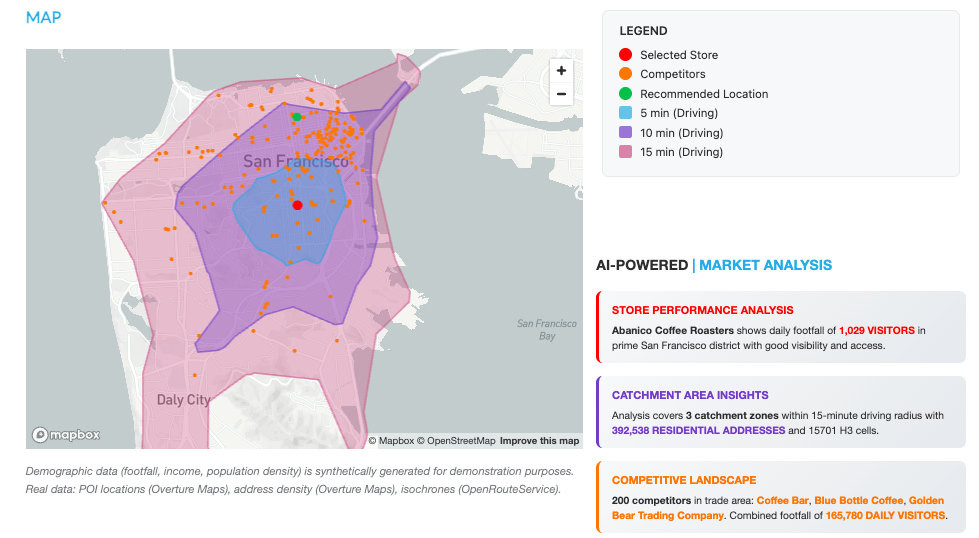
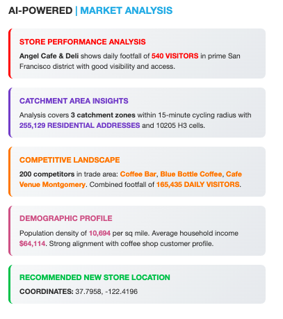
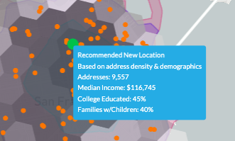

author: Becky O'Connor, Piotr Paczewski, Oleksii Bielov
id: oss-retail-catchment-analysis
categories: snowflake-site:taxonomy/solution-center/certification/quickstart, snowflake-site:taxonomy/solution-center/certification/certified-solution, snowflake-site:taxonomy/product/ai, snowflake-site:taxonomy/product/applications-and-collaboration, snowflake-site:taxonomy/snowflake-feature/native-apps, snowflake-site:taxonomy/snowflake-feature/snowpark-container-services, snowflake-site:taxonomy/snowflake-feature/geospatial, snowflake-site:taxonomy/snowflake-feature/cortex-llm-functions
language: en
summary: Build a Retail Catchment Analysis application using OpenRouteService and Carto Overture Maps. Deploy a Streamlit app that analyzes store catchment zones with isochrones, identifies competitors, and visualizes address density using H3 hexagons.
environments: web
status: Published
feedback link: https://github.com/Snowflake-Labs/sfguides/issues
fork repo link: https://github.com/Snowflake-Labs/sfguide-create-a-route-optimisation-and-vehicle-route-plan-simulator

# Retail Catchment Analysis with Overture Maps

> 🏪 **Select. Analyze. Compete.** Build an interactive retail catchment analysis tool using real-world POI data - powered by OpenRouteService in Snowflake.

<!-- ------------------------ -->
## Overview 



**Build a fully interactive Retail Catchment Analysis application using the OpenRouteService Native App and Carto Overture Maps data.**

This quickstart deploys a Streamlit application that performs catchment zone analysis for retail locations. Select any store from real-world POI data, generate isochrone-based catchment areas, identify competitors within the zone, and visualize address density using H3 hexagonal grids.

### What You'll Build

🏪 **Retail Catchment Analyzer** - A Streamlit app that:
- Searches real-world retail locations from Carto Overture Maps (72M+ POIs worldwide)
- Generates travel-time based catchment zones using isochrones
- Identifies competitor stores within the catchment area
- Visualizes address density using H3 hexagonal aggregation
- Supports multiple travel modes (walking and driving)

📊 **Catchment Analytics** - Real-time insights including:
- Multi-ring catchment zones (configurable 1-5 rings, up to 60 minutes)
- Competitor breakdown by retail category
- Address density heat maps for market potential analysis
- Interactive maps with color-coded catchment boundaries

### Prerequisites

> **_IMPORTANT:_** This demo requires the **OpenRouteService Native App** to be installed and running. If you haven't installed it yet, complete the [Install OpenRouteService Native App](../oss-install-openrouteservice-native-app/) quickstart first.

**Required:**
- OpenRouteService Native App deployed and activated
- [Cortex Code CLI](https://docs.snowflake.com/en/user-guide/cortex-code/cortex-code-cli) installed and configured
- Active Snowflake connection with ACCOUNTADMIN access

### What You'll Learn 

- Deploy retail analytics applications using Cortex Code skills
- Work with **Carto Overture Maps** datasets (Places and Addresses) for real-world location data
- Use **isochrone functions** to calculate travel-time based catchment zones
- Build **H3 hexagonal** visualizations for address density analysis
- Perform competitor analysis using spatial queries
- Create multi-layer geospatial visualizations with Pydeck

<!-- ------------------------ -->
## Deploy the Retail Catchment Demo

Use Cortex Code to deploy the Retail Catchment Analysis solution including Marketplace data and the Streamlit application.

### Run the Deploy Skill

In the Cortex Code CLI, type:

```
use the local skill from oss-retail-catchment-analysis/skills/deploy-demo
```

> **_NOTE:_** The skill will first verify that the OpenRouteService Native App is installed. If it's not found, it will provide instructions to install it first.

The skill uses interactive prompting to gather required information:

- **Region**: San Francisco (default), New York, or custom coordinates
- **Retail Categories**: Pre-configured set of 17 retail categories

Cortex Code will automatically:
- **Verify** OpenRouteService Native App is installed and running
- **Acquire Marketplace Data** - Gets Carto Overture Maps Places and Addresses datasets
- **Create Demo Database** - Sets up `RETAIL_CATCHMENT_DEMO` with required schemas
- **Prepare POI Data** - Filters and indexes retail locations for fast querying
- **Deploy Streamlit App** - Creates the Retail Catchment Analysis application

### What Gets Installed

The deploy skill creates the following Snowflake objects:

**Marketplace Data**
| Component | Name | Description |
|-----------|------|-------------|
| Database | `OVERTURE_MAPS__PLACES` | Carto Overture Maps Places with 72M+ POIs worldwide |
| Database | `OVERTURE_MAPS__ADDRESSES` | Carto Overture Maps Addresses with 121M+ US addresses |

**Demo Database & Infrastructure**
| Component | Name | Description |
|-----------|------|-------------|
| Database | `RETAIL_CATCHMENT_DEMO` | Main demo database |
| Schema | `RETAIL_CATCHMENT_DEMO.PUBLIC` | POI data and analytics tables |
| Warehouse | `ROUTING_ANALYTICS` | Compute warehouse (auto-suspend 60s) |
| Stage | `STREAMLIT_STAGE` | Stage for Streamlit application files |

**Data Tables**
| Table | Description |
|-------|-------------|
| `RETAIL_POIS` | Filtered retail POIs with categories, addresses, and geometry |
| `REGIONAL_ADDRESSES` | Address data for H3 density visualization |
| `CITIES_BY_STATE` | City lookup for region filtering |

**Streamlit Application**
| Component | Name | Description |
|-----------|------|-------------|
| Streamlit | `RETAIL_CATCHMENT_APP` | Interactive catchment analysis application |

<!-- ------------------------ -->
## Explore the Catchment Analyzer

Once deployment completes, navigate to the Retail Catchment application:

1. Go to **Projects > Streamlits** in Snowsight
2. Click on **RETAIL_CATCHMENT_APP**

### Configure Your Analysis

Use the sidebar to configure your analysis:

**Retail Category**
- Select from 17 pre-configured categories:
  - Coffee Shop, Fast Food Restaurant, Restaurant, Casual Eatery
  - Grocery Store, Convenience Store, Supermarket
  - Gas Station, Pharmacy
  - Clothing Store, Electronics Store, Specialty Store
  - Gym/Fitness, Beauty Salon, Hair Salon, Bakery, Bar

**Store Selection**
- Filter by city (based on ORS coverage)
- Search by store name with real-time filtering
- View store address and coordinates

**Travel Mode**
- **Walking** - Pedestrian catchment analysis
- **Driving** - Vehicle-based catchment zones

**Catchment Zones**
- Number of rings (1-5 concentric zones)
- Maximum travel time (5-60 minutes)

**Display Options**
- Show/hide catchment boundaries
- Show/hide competitor POIs
- Show/hide address density (H3 hexagons)
- Adjust H3 resolution (7-10)

### Analyze Catchment Zones

Click **Analyze Catchment** to generate the analysis:

1. **Catchment Boundaries** - Color-coded isochrone polygons showing travel-time zones
2. **Selected Store** - Red marker indicating the analysis center point
3. **Competitor Locations** - Color-coded markers for competing retail locations
4. **Address Density** - H3 hexagons showing residential/commercial address concentration

### View Analytics

The analysis provides key metrics:
- **Selected Store** - Name and address of the analyzed location
- **Travel Time** - Maximum catchment zone travel time
- **Competitors** - Total number of competing POIs within the catchment
- **Addresses in Zone** - Total address count for market potential estimation

### Competitor Breakdown

View competitor analysis by category:
- Breakdown of competitors by retail type
- Count of each category within the catchment zone
- Sorted by frequency for quick competitive insights

<!-- ------------------------ -->
## Understanding the Data

### Carto Overture Maps Places

The demo uses the **Carto Overture Maps Places** dataset from Snowflake Marketplace:

| Dataset | Records | Coverage |
|---------|---------|----------|
| Places | 72M+ | Worldwide POIs with categories |
| Addresses | 121M+ | US addresses with geocoding |

### Retail Categories

POIs are filtered using the Overture Maps category taxonomy:

| Category Code | Display Name | Examples |
|---------------|--------------|----------|
| `coffee_shop` | Coffee Shop | Starbucks, Peet's Coffee |
| `fast_food_restaurant` | Fast Food | McDonald's, Subway |
| `grocery_store` | Grocery Store | Trader Joe's, Whole Foods |
| `convenience_store` | Convenience Store | 7-Eleven, CVS |
| `pharmacy` | Pharmacy | Walgreens, Rite Aid |
| `gas_station` | Gas Station | Shell, Chevron |
| `gym` | Gym / Fitness | 24 Hour Fitness, Planet Fitness |

### Isochrone Analysis

Isochrones are generated using the OpenRouteService Native App:

| Profile | Use Case | Speed Assumptions |
|---------|----------|-------------------|
| `foot-walking` | Pedestrian catchment | ~5 km/h walking speed |
| `driving-car` | Vehicle catchment | Variable based on road network |

### H3 Hexagonal Grid

Address density is visualized using Uber's H3 spatial indexing:

| Resolution | Hex Edge | Coverage Area | Best For |
|------------|----------|---------------|----------|
| 7 | ~1.2 km | ~5 km² | Regional overview |
| 8 | ~460 m | ~0.7 km² | Neighborhood analysis |
| 9 | ~174 m | ~0.1 km² | Block-level detail |
| 10 | ~65 m | ~15,000 m² | Building-level precision |

<!-- ------------------------ -->
## Customize the Demo

### Change Retail Categories

Edit the `RETAIL_CATEGORIES` list in the Streamlit app to focus on specific POI types:

```python
RETAIL_CATEGORIES = [
    'coffee_shop', 'fast_food_restaurant', 'restaurant', 'casual_eatery',
    'grocery_store', 'convenience_store', 'gas_station', 'pharmacy',
    'clothing_store', 'electronics_store', 'specialty_store', 'gym',
    'beauty_salon', 'hair_salon', 'bakery', 'bar', 'supermarket'
]
```

### Add New Regions

To support additional cities:

1. **Update OpenRouteService** with the appropriate map region using:
   ```
   use the local skill from oss-install-openrouteservice-native-app/skills/deploy-route-optimizer
   ```

2. **Filter POI data** for the new region in the database setup script

3. **Update the city selector** in the Streamlit app sidebar

### Adjust H3 Resolution

The H3 resolution affects visualization granularity:

| Resolution | Use When |
|------------|----------|
| 7-8 | City-wide catchment analysis |
| 9 | Neighborhood competitive analysis |
| 10 | Site selection at specific locations |

<!-- ------------------------ -->
## Uninstall the Demo

To remove the Retail Catchment demo:

```
uninstall retail catchment demo
```

This will:
- Remove the `RETAIL_CATCHMENT_DEMO` database and Streamlit app
- Optionally remove Carto Overture Maps marketplace data
- Optionally remove the warehouse

> **_NOTE:_** The OpenRouteService Native App remains installed. You can uninstall it separately using:
> `use the local skill from oss-install-openrouteservice-native-app/skills/uninstall-route-optimizer`

<!-- ------------------------ -->
## Available Cortex Code Skills

| Skill | Description | Command |
|-------|-------------|---------|
| `deploy-demo` | Deploy the full Retail Catchment solution | `use the local skill from oss-retail-catchment-analysis/skills/deploy-demo` |
| `uninstall-demo` | Remove the demo and optionally marketplace data | `use the local skill from oss-retail-catchment-analysis/skills/uninstall-demo` |

<!-- ------------------------ -->
## Conclusion and Resources

### Conclusion

You've deployed a complete Retail Catchment Analysis application that demonstrates:
- **OpenRouteService Native App** - Isochrone-based catchment zone generation
- **Carto Overture Maps** - Real-world POI and address data for authentic analysis
- **H3 Hexagonal Indexing** - Address density visualization for market potential
- **Pydeck Visualization** - Interactive multi-layer maps with tooltips
- **Spatial Analytics** - ST_WITHIN queries for competitor identification

### What You Learned

- Deploy retail analytics applications using Cortex Code skills
- Work with Carto Overture Maps datasets for POI and address data
- Generate isochrone-based catchment zones with multiple travel modes
- Visualize address density using H3 hexagonal aggregation
- Perform competitor analysis within geographic boundaries
- Build interactive Streamlit apps with geospatial visualizations

### AI-Powered Market Analysis



The application includes an AI-powered market analysis feature that uses Snowflake Cortex LLM functions to generate comprehensive insights:

**Store Performance Analysis**
- Daily visitor estimates based on location data
- Assessment of store visibility and accessibility
- Performance benchmarking against competitors

**Catchment Area Insights**
- Analysis of distinct catchment zones by travel time
- Total addressable market (residential addresses count)
- H3 cell analysis for geographic coverage assessment

**Competitive Landscape**
- Identification of major competitors in the trade area
- Combined competitor footfall estimates
- Market saturation analysis

**Demographic Profile**
- Population density metrics
- Household income estimates
- Customer profile alignment with retail category

### AI-Recommended Store Locations



The AI analysis also provides **optimal store location recommendations**:

- Generates coordinates for recommended new store placement
- Considers competitor proximity and gaps in coverage
- Visualizes the recommendation on an interactive map
- Provides rationale based on catchment analysis data

### Related Quickstarts

- [Install OpenRouteService Native App](/guide/oss-install-openrouteservice-native-app/) - Install the routing engine (prerequisite)
- [Deploy Route Optimization Demo](/guide/oss-deploy-route-optimization-demo/) - Build a delivery route optimization simulator
- [Deploy Fleet Intelligence Solution for Taxis](/guide/oss-deploy-a-fleet-intelligence-solution-for-taxis/) - Build a taxi fleet control center

### Source Code

- [Source Code on GitHub](https://github.com/Snowflake-Labs/sfguide-Create-a-Route-Optimisation-and-Vehicle-Route-Plan-Simulator) - Skills, scripts, and Streamlit apps

### OpenRouteService Resources

- [OpenRouteService Official Website](https://openrouteservice.org/) - Documentation and API reference
- [Isochrones Documentation](https://openrouteservice.org/dev/#/api-docs/v2/isochrones) - Travel-time polygon generation

### Cortex Code & Snowflake

- [Snowflake Cortex](https://docs.snowflake.com/en/user-guide/snowflake-cortex/overview) - AI-powered features in Snowflake
- [Carto Overture Maps Places](https://www.carto.com/blog/overture-maps-data-in-snowflake) - POI data for retail analysis
- [H3 in Snowflake](https://docs.snowflake.com/en/sql-reference/functions/h3_latlng_to_cell) - Hexagonal hierarchical geospatial indexing
- [Streamlit](https://streamlit.io/) - Interactive data apps
