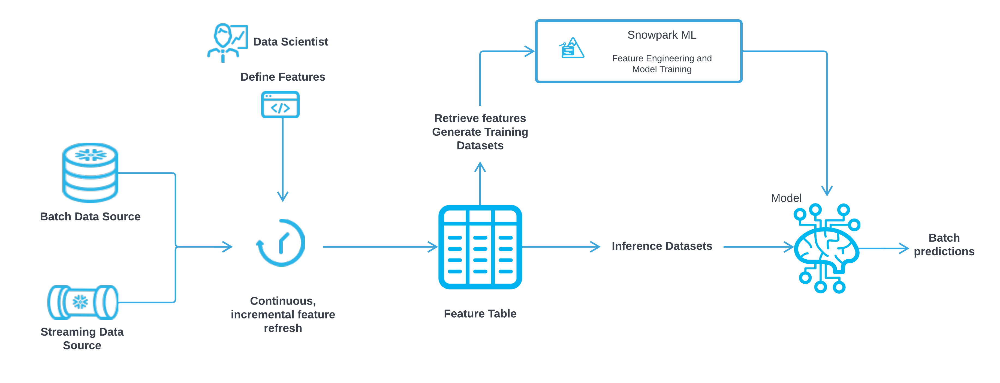
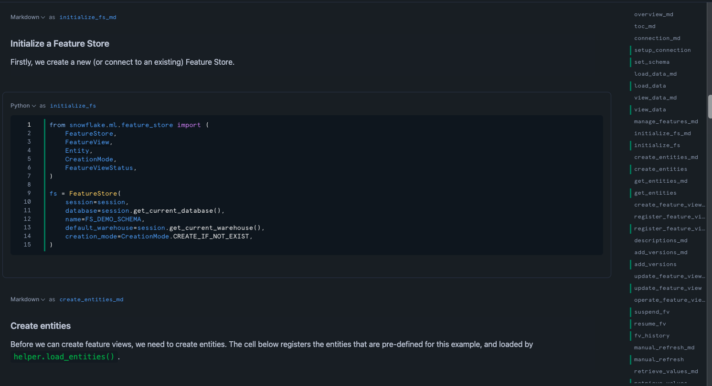

author: Charlie Hammond
id: overview-of-feature-store-api
categories: snowflake-site:taxonomy/solution-center/certification/quickstart, snowflake-site:taxonomy/product/platform
language: en
summary: This guide goes through different features of the Snowflake feature Store API. 
environments: web
status: Published 
feedback link: https://github.com/Snowflake-Labs/sfguides/issues

# Getting Started with Snowflake Feature Store API
<!-- ------------------------ -->
## Overview 

The Snowflake Feature Store is a native solution that data scientists and ML engineers can use to create, maintain, and use features in [Snowflake ML](/en/data-cloud/snowflake-ml/).

A Feature Store lets you standardize ML features in a single managed and governed repository. Having commonly-used features defined centrally in a Feature Store can help reduce redundancy and duplication of data and effort, improving the productivity of data science teams. By improving consistency in how features are extracted from raw data, a Feature Store can also help improve the robustness of production ML pipelines.

This is part 2 of a 3-part introduction quickstart series to Snowflake Feature Store (check out part 1 [here](/en/developers/guides/intro-to-feature-store/) and part 3 [here](/en/developers/guides/develop-and-manage-ml-models-with-feature-store-and-model-registry/)). This quickstart provides an overview of Feature Store APIs. It demonstrates how to manage Feature Store, Feature Views, Feature Entities and how to retrieve features and generate training datasets etc. The goal is to provide a quick walkthrough of the most common APIs. For a full list of APIs, please refer to API Reference page.



### What You Will Learn 
- How to create features with Feature Store
- How to update and operate Feature Views
- How to generate training data using Feature Store API

### What You’ll Need 
- A [Snowflake](https://app.snowflake.com/) Account

### What You’ll Build 
- An ML model using Snowflake Feature Store and Model Registry

<!-- ------------------------ -->
## Setup Your Account

Complete the following steps to setup your account:
- Navigate to Worksheets, click "+" in the top-right corner to create a new Worksheet, and choose "SQL Worksheet".
- Paste and the following SQL in the worksheet 
- Adjust <YOUR_USER> to your user
- Run all commands to create Snowflake objects

```sql
USE ROLE ACCOUNTADMIN;

-- Using ACCOUNTADMIN, create a new role for this exercise and grant to applicable users
CREATE OR REPLACE ROLE FS_API_ROLE;
GRANT ROLE FS_API_ROLE to USER <YOUR_USER>;

-- create our virtual warehouse
CREATE OR REPLACE WAREHOUSE FS_API_WH AUTO_SUSPEND = 60;

GRANT ALL ON WAREHOUSE FS_API_WH TO ROLE FS_API_ROLE;

-- Next create a new database and schema,
CREATE OR REPLACE DATABASE FS_API_DATABASE;
CREATE OR REPLACE SCHEMA FS_API_SCHEMA;

GRANT OWNERSHIP ON DATABASE FS_API_DATABASE TO ROLE FS_API_ROLE COPY CURRENT GRANTS;
GRANT OWNERSHIP ON ALL SCHEMAS IN DATABASE FS_API_DATABASE TO ROLE FS_API_ROLE COPY CURRENT GRANTS;
```

<!-- ------------------------ -->
## Run the Notebook

- Download the notebook from this [link](https://github.com/Snowflake-Labs/sfguide-overview-of-feature-store-api/blob/main/notebooks/0_start_here.ipynb)
- Change role to FS_API_ROLE
- Navigate to Projects > Notebooks in Snowsight
- Click Import .ipynb from the + Notebook dropdown
- Create a new notebok with the following settings
  - Notebook Location: FS_API_DATABASE, FS_API_SCHEMA
  - Run on Warehouse
  - Warehouse: FS_API_WH
- Create Notebook
- Click Packages in the top right, add `snowflake-ml-python`
- Run cells in the notebook!



<!-- ------------------------ -->
## Conclusion And Resources

The Snowflake Feature Store is a native tool that empowers data scientists and ML engineers to efficiently create, manage, and utilize ML features in their workflows. By centralizing commonly-used features in a governed repository, the Feature Store reduces redundancy and duplication, enhancing the productivity of data science teams. This centralization also improves consistency in feature extraction, leading to more robust production ML pipelines.

This Quickstart offered a hands-on introduction to the Feature Store APIs, covering how to manage Feature Stores, Feature Views, and Feature Entities, as well as how to retrieve features and generate training datasets. To deepen your understanding, start exploring these APIs now, and refer to the [API Reference page](https://docs.snowflake.com/en/developer-guide/snowpark-ml/reference/latest/feature_store) for a comprehensive list of available functionalities.

### What You Learned
- How to create features with Feature Store
- How to update and operate Feature Views
- How to generate training data using Feature Store API

### Related Quickstarts
- Part 1: [Introduction to Snowflake Feature Store with Snowflake Notebooks](/en/developers/guides/intro-to-feature-store/)
- Part 3: [Develop and Manage ML Models with Feature Store and Model Registry](/en/developers/guides/develop-and-manage-ml-models-with-feature-store-and-model-registry/)

### Related Resources
- [Snowflake Feature Store](https://docs.snowflake.com/en/developer-guide/snowflake-ml/feature-store/overview)
- [Entities](https://docs.snowflake.com/en/developer-guide/snowflake-ml/feature-store/entities)
- [Feature Views](https://docs.snowflake.com/en/developer-guide/snowflake-ml/feature-store/feature-views)
- [Datasets](https://docs.snowflake.com/en/developer-guide/snowflake-ml/feature-store/modeling#generating-datasets-for-training)
- [Snowflake ML Webpage](/en/data-cloud/snowflake-ml/)
