author: Christina Jimenez
id: parsing_semi_structured_data_with_coalesce
summary: Parsing Semi-Structured Data (JSON / XML) with Coalesce
categories: data-engineering
environments: web
status: public
feedback link: https://github.com/Snowflake-Labs/sfguides/issues
tags: Getting Started, Data Engineering

# Parsing Semi-Structured Data with Coalesce
<!-- ------------------------ -->
## Overview  

In Coalesce, you can parse semi-structured data in Snowflake using a handful of clicks. Coalesce's parsers analyze the structure of entries within a variant column and automatically generate columns and a JOIN that captures the different attributes within them. 

Read on for a step-by-step guide on how to parse JSON and XML data in Snowflake with Coalesce.

### Prerequisites
- Familiarity with Snowflake
- Basic knowledge of SQL, database concepts, and objects
- Completion of the foundational Coalesce Quickstart [Accelerating Transformations with Coalesce and Snowflake](https://quickstarts.snowflake.com/guide/transform_your_data_with_coalesce/index.html?index=..%2F..index#0)

### What You’ll Need 
- A Snowflake account (either a [trial account](https://signup.snowflake.com) or access to an existing account)
- A Coalesce account (either a trial account created via [Snowflake Partner Connect](https://coalesce.io/product-technology/launch-coalesce-from-snowflake-partner-connect/), or access to an existing account)
- Google Chrome browser (recommended)

### What You’ll Learn 
- How to load raw data from Snowflake into Coalesce 
- How to parse semi-structured data (JSON / XML) in a matter of clicks in Coalesce 

### What You’ll Build 
- Source Nodes
- Staging Nodes 


<!-- -------------------------->
## Setting Up Your Snowflake Account

Duration: 2 

1. Navigate to your Snowflake account and create a new Worksheet. Rename it “JSON Coalesce Sample.” 

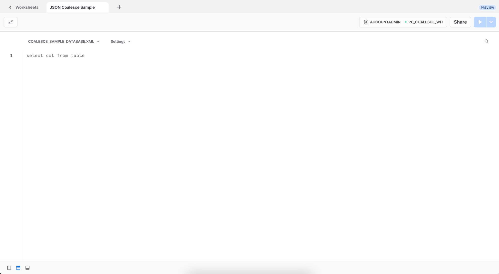

2. Copy [this code](https://docs.google.com/document/d/1vG3eQ20FGfeQ9mAN0Sh_fZ6buAG_C9n766QTnHUMGkw/edit) and paste it into your Worksheet:

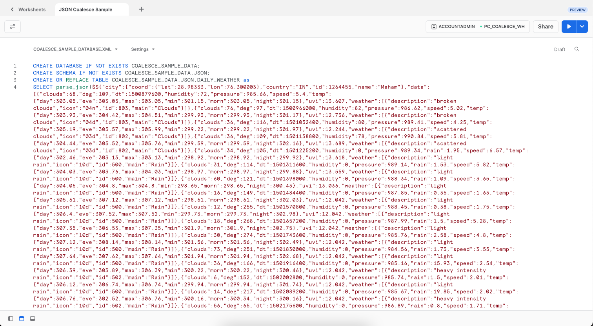

3. Select and run the code to create a new table `DAILY_WEATHER` in the `COALESCE_SAMPLE_DATA` database and `COALESCE_SAMPLE_DATA_JSON` schema.

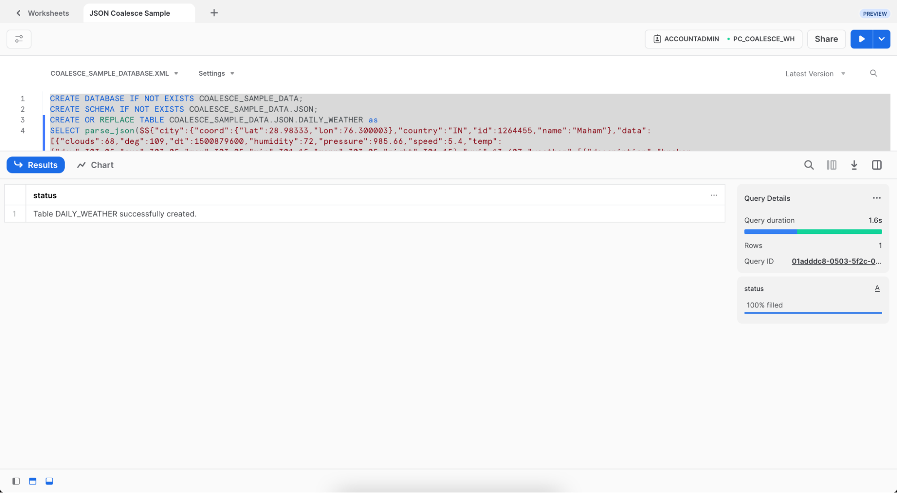

<!-- -------------------------->
## Setting Up Your Coalesce Account

Duration: 2

1. Switch over to your Coalesce account and open your **Development Workspace** in your default Project.

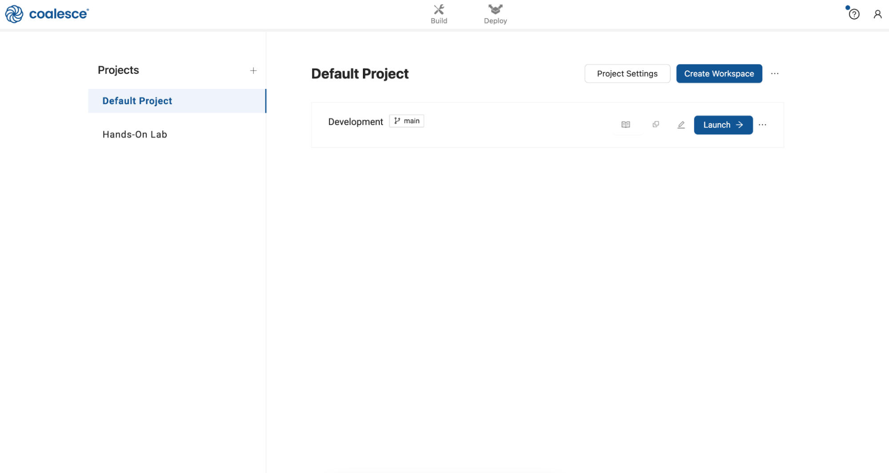

2. Once in your **Development Workspace**, click the gear icon in the sidebar in the lower left-hand corner to open up your **Build Settings**. 

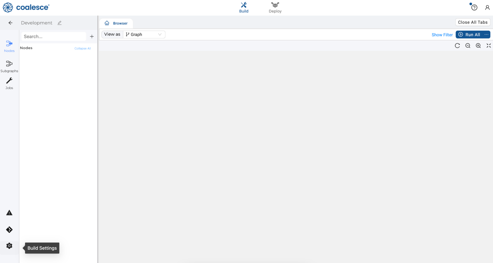

3. Click **New Storage Location** and name your new storage location **JSON**. 

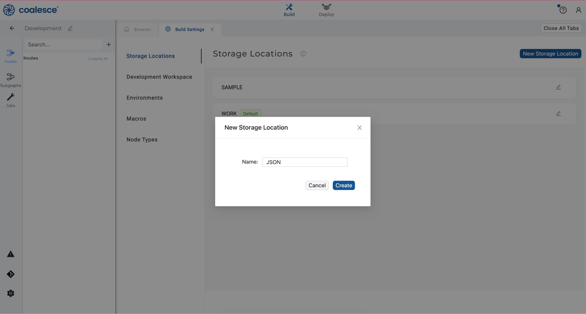

4. Click the **Create** button to create your new **Storage Location**. 

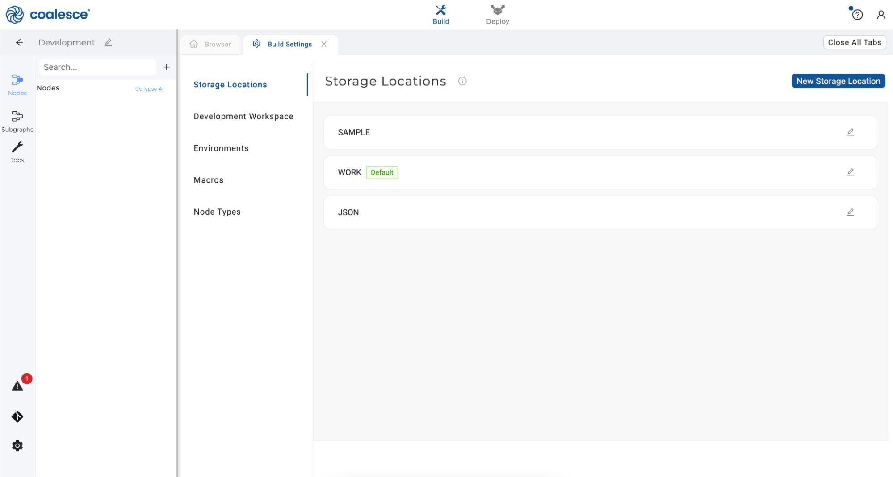

5. Click on the pencil icon in the upper left-hand corner of your screen (next to the name of your Workspace). This will open your **Workspace Settings**. 

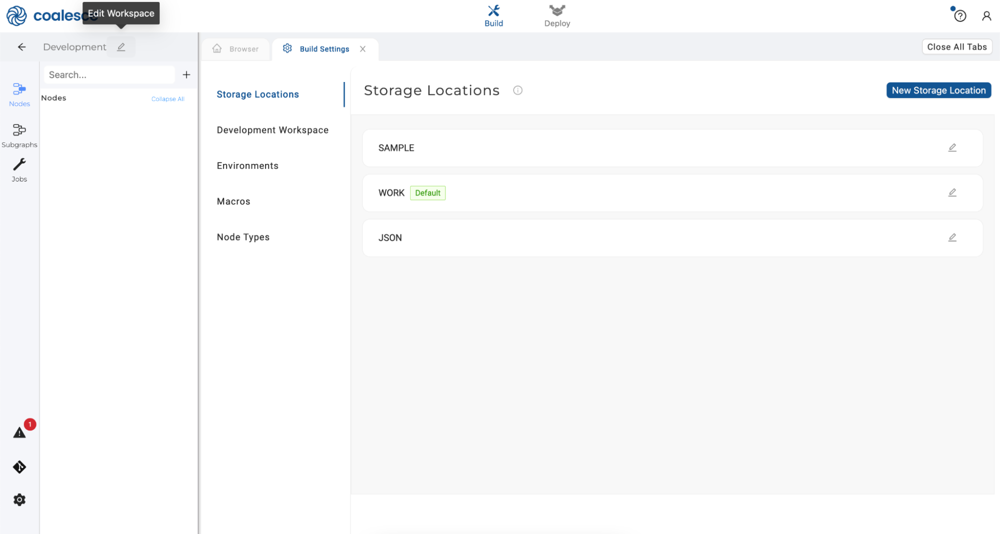

6. Under **Storage Mappings**, select the `COALESCE_SAMPLE_DATABASE` next to your JSON **Storage Location**. Select `WEATHER` as your schema from the dropdown menu, then click “Save” and close your **Workspace Settings**. 

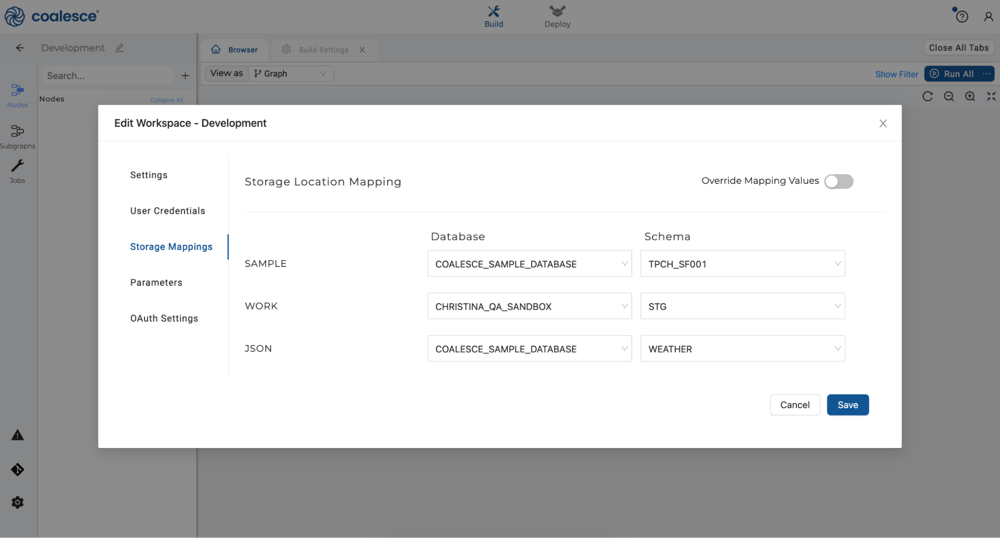

<!-- -------------------------->
## Adding Source Nodes

Duration: 2

1. Click back to your Browser tab and click the Nodes icon in the left sidebar. Click the + icon that appears next to the Search bar. Click **Add Sources** from the dropdown menu.

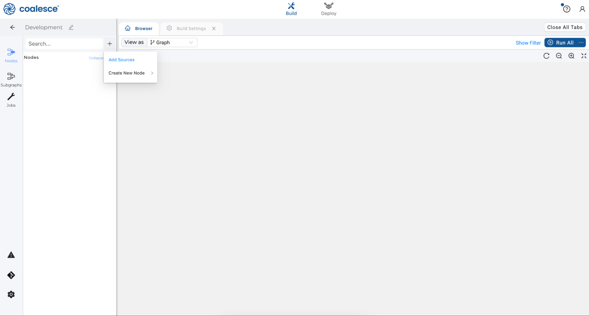

2. Select the JSON **Storage Location** and the `DAILY_14_TOTAL_SHORT` table, then click **Add 1 source** at the bottom right of the window. 

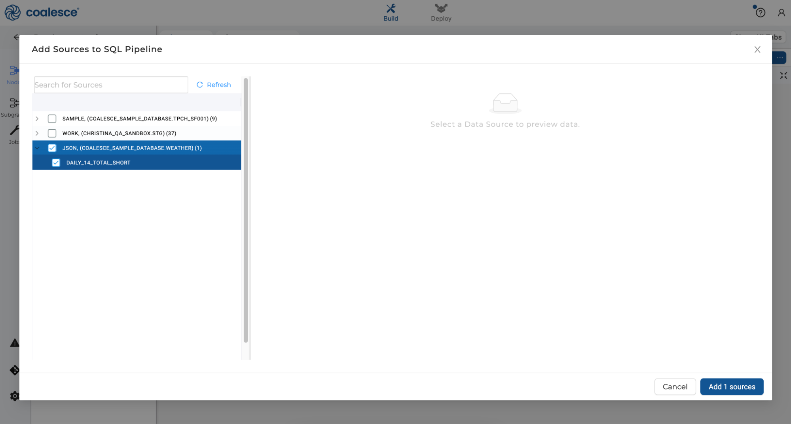

3. You’ll see that a source node has been added to your graph. Click **Fetch Data** at the bottom right corner of the screen to preview the raw data. 

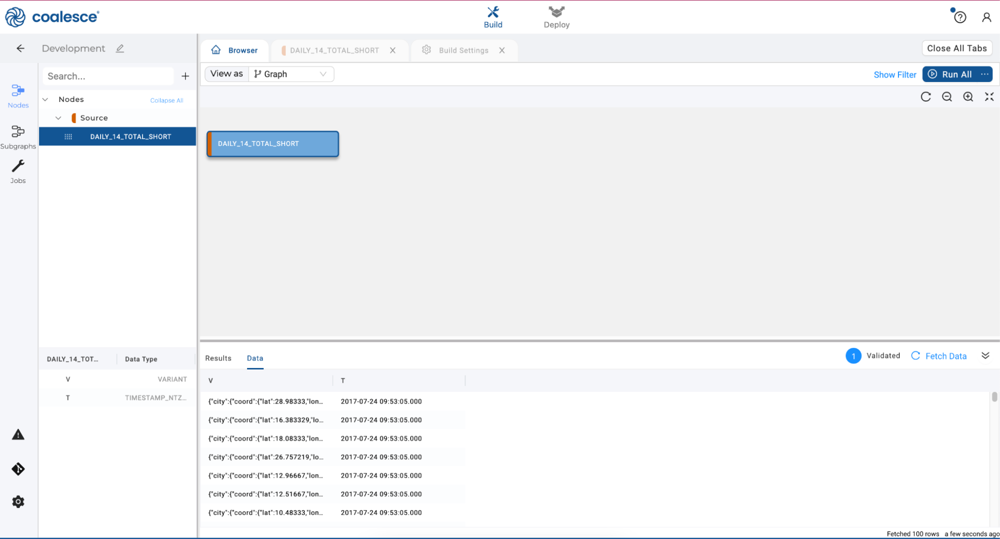


<!-- -------------------------->
## Deriving JSON Mappings

Duration: 2

1. Right click on your source node and hover over **Add Node** to open the dropdown menu. Click on **Stage** to create a stage node on top of your source node. 

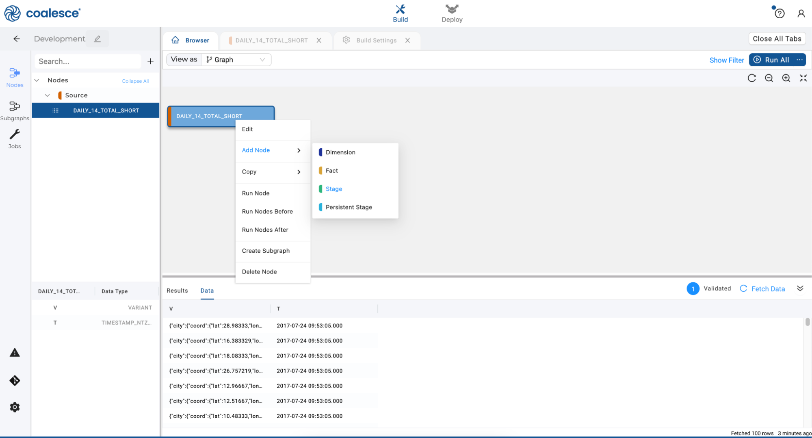

2. In your stage node, right click on the first column named “V” and hover over **Derive Mappings** in the dropdown menu. Click on **From JSON**. 

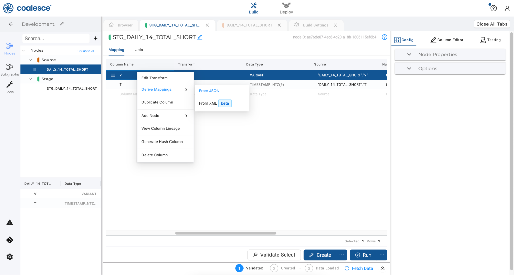

3. You will see your first single column parsed into multiple columns. By deriving JSON mappings, you have created a column in the [mapping grid](https://docs.coalesce.io/docs/mapping-grid) for every primitive type (string, number, boolean, and null) within the object, with the appropriate transform to parse that value. Deriving JSON Mappings also recursively flattens every JSON array using a table function in the [Join Tab](https://docs.coalesce.io/docs/join-tab). 

Click the **Create** button to create your stage node, and then click the **Run** button to populate it.

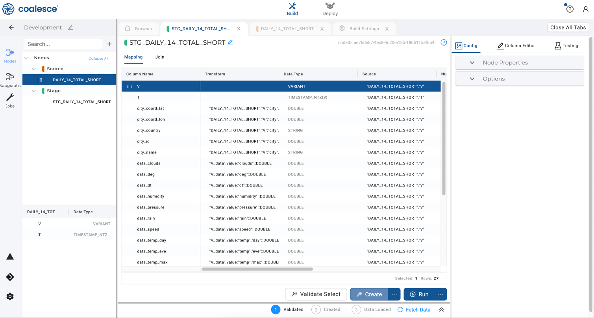

4. Congratulations! You have easily parsed JSON in just a few clicks. 

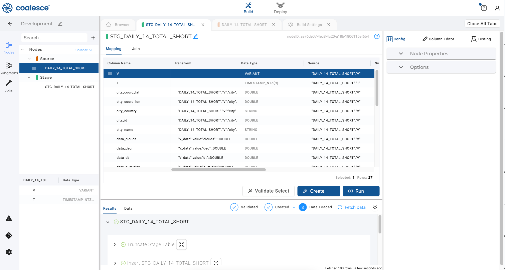

You can explore the DDL and DML statements used to create your stage node under **Results**: 

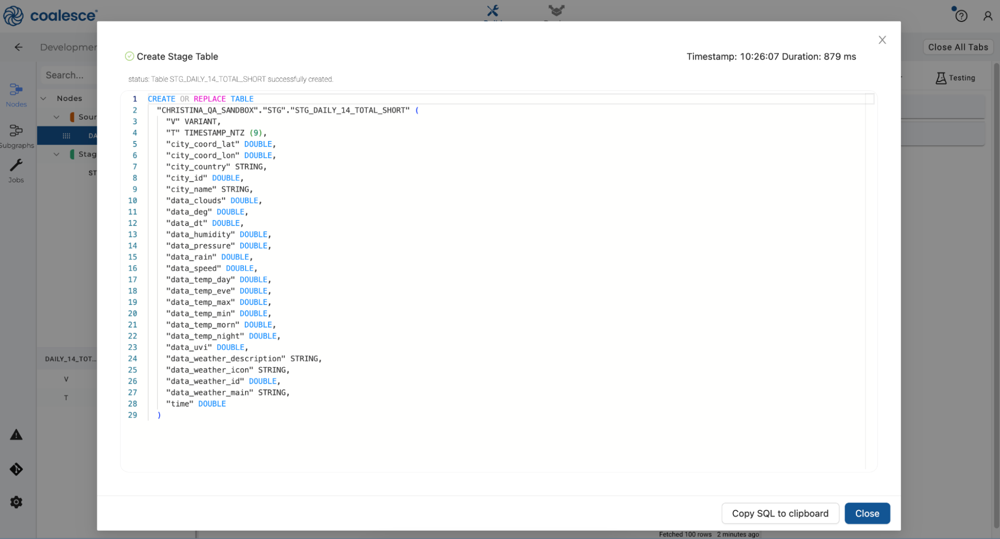

Or you can preview the data within your stage node:

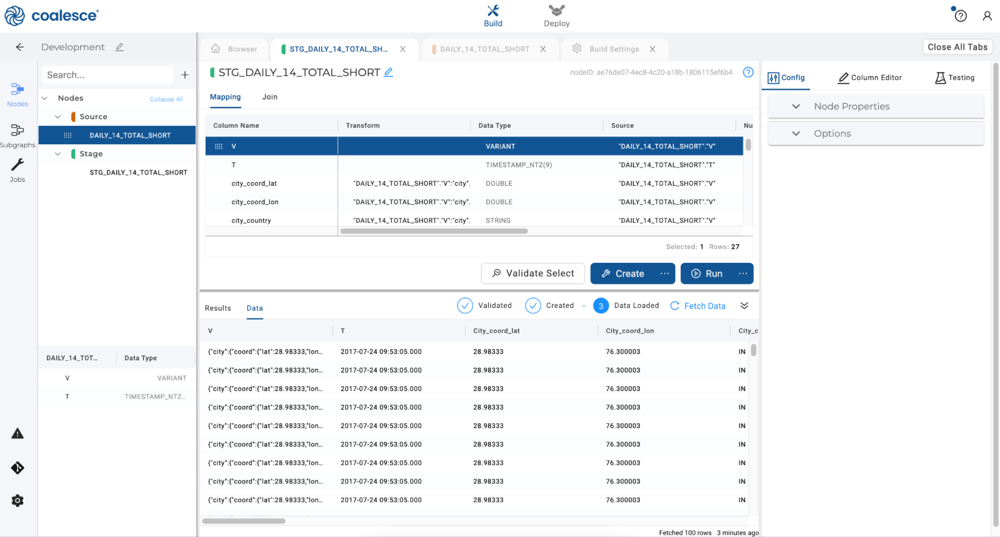

<!---------------------------->
## Parsing XML

Duration: 5

Coalesce offers XML parsing capabilities (currently in beta). This process functions similarly to the JSON example that is previously covered in this guide. 

1. Navigate back to your Snowflake account and create a new Worksheet. Name it **Coalesce XML Sample**. Copy the following SQL and paste it into your XML Worksheet in Snowflake, then highlight and run the code: 

```sql
CREATE DATABASE IF NOT EXISTS COALESCE_SAMPLE_DATABASE;
CREATE SCHEMA IF NOT EXISTS COALESCE_SAMPLE_DATABASE.XML;
CREATE OR REPLACE TABLE COALESCE_SAMPLE_DATABASE.XML.MUSIC(src variant)
as
select parse_xml('<catalog issue="spring" date="2015-04-15">
<cd id="cd105">
<title>XML Music</title>
<genre>Emo</genre>
<artist>Microsoft</artist>
<publish_date>1111-11-11</publish_date>
<price>1.00</price>
<description>This music sux!</description>
</cd>
<cd id="cd106">
<title>Greg\'s Song</title>
<genre>Funk</genre>
<artist>Greg Henkhaus</artist>
<publish_date>2023-01-01</publish_date>
<price>200.00</price>
<description>BUY IT</description>
</cd>
</catalog>')
```

2. You’ll see that a table `MUSIC` was created: 

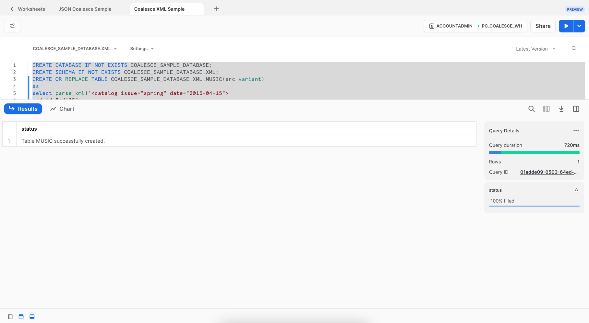

3. Navigate back to your Coalesce account and click on the gear icon in the sidebar in the lower left-hand corner to open up your **Build Settings**. 

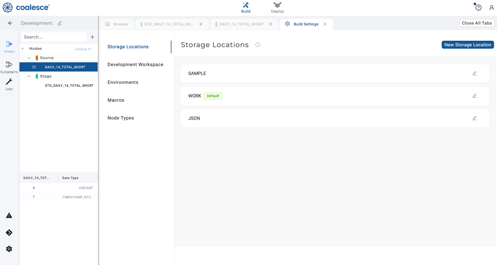

4. Click on **New Storage Location** to create a location named XML. Then click the **Create** button. 

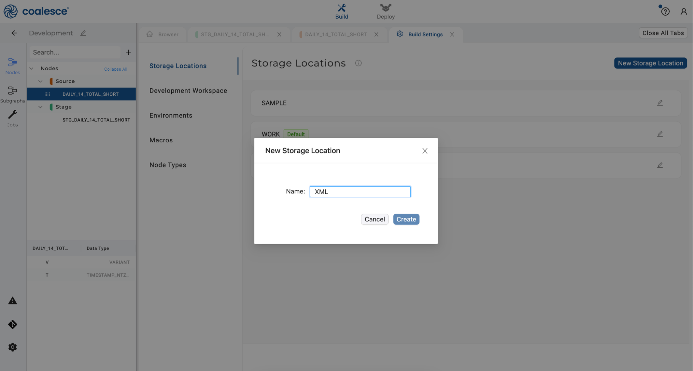

5. Click the pencil icon in the upper right corner to open up your **Workspace Settings**.

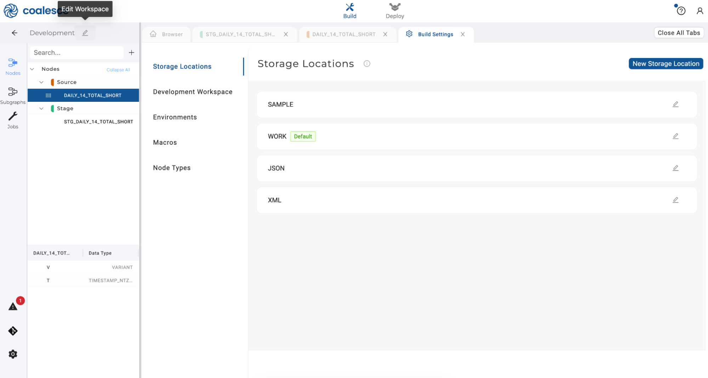

6. Under **Storage Mappings**, set your XML Storage Mappings as `COALESCE_SAMPLE_DATABASE` and XML schema. Then click the Save button and close your **Workspace Settings**. 

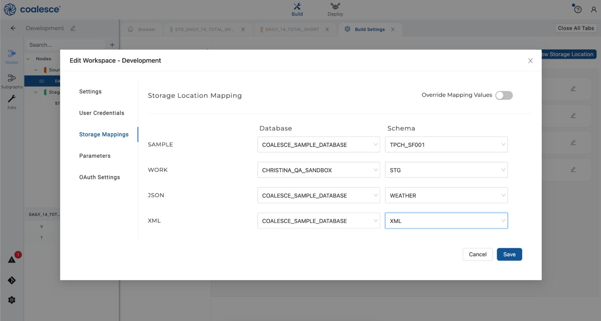

7. Navigate back to your Browser tab and click the + icon. Click **Add Sources** and select the XML source and `MUSIC` table. Click **Add 1 source** to add the raw data to your graph as a source node.


8. Right click your XML source node and hover over **Add Node**. Click **Stage** to create a new stage node.

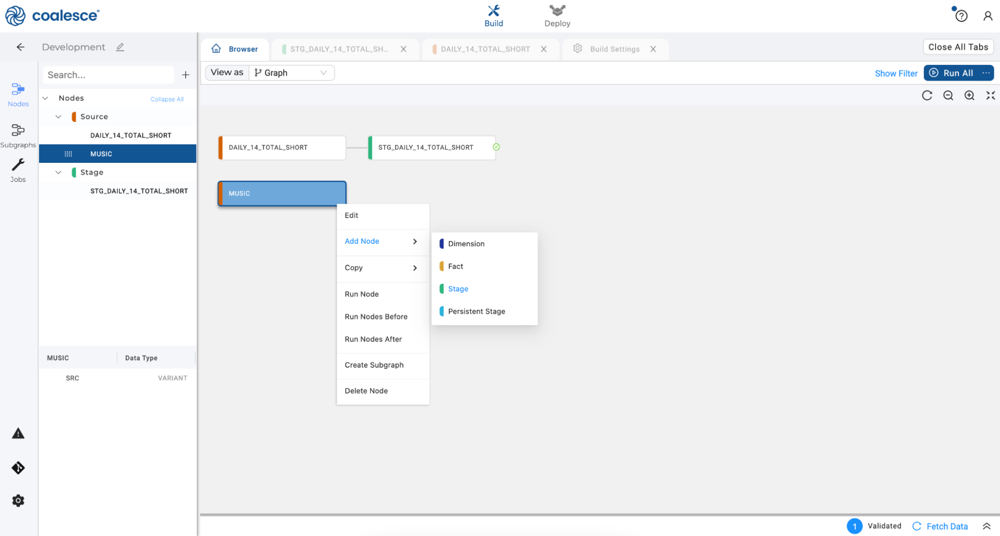

9. In your Stage node, right click the first column and hover over **Derive Mappings**. Click “From XML.” 

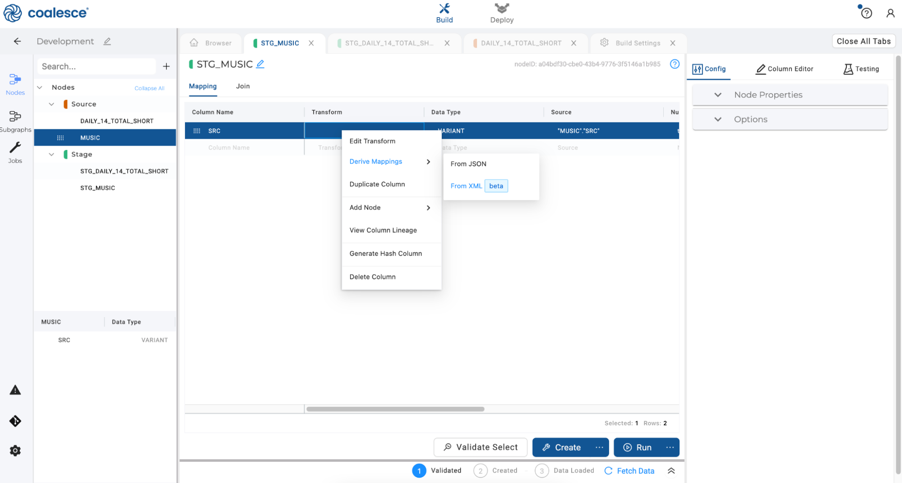

10. You’ll see the contents of your single column parsed into multiple columns. Click the **Create** and **Run** buttons to create and populate your stage node. Preview the data by clicking on **Data:**

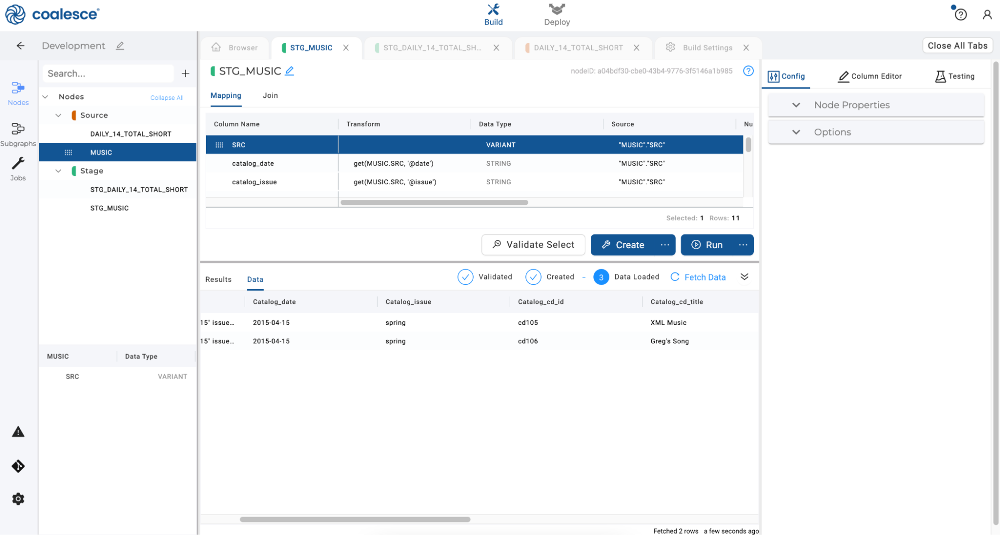

<!---------------------------->
## Conclusion
Duration: 1 

Congratulations, you’ve completed this guide and experienced how easy it is to parse semi-structured data in Snowflake with Coalesce! To learn more about Coalesce’s JSON parsing capabilities, please visit our [documentation](https://docs.coalesce.io/docs/parsers). 

Happy transforming!

### What We've Covered
- How to load raw data from Snowflake into Coalesce 
- How to parse semi-structured data (JSON / XML) in a matter of clicks in Coalesce 