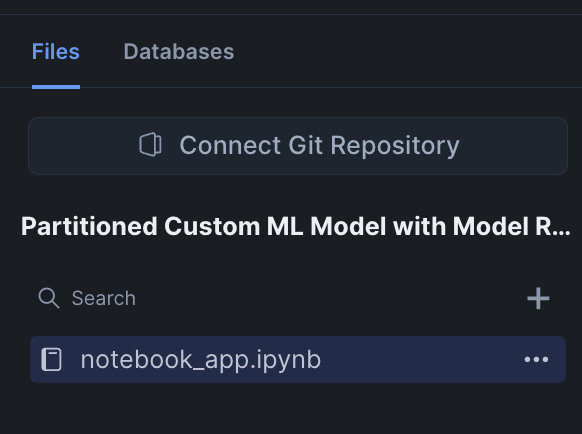
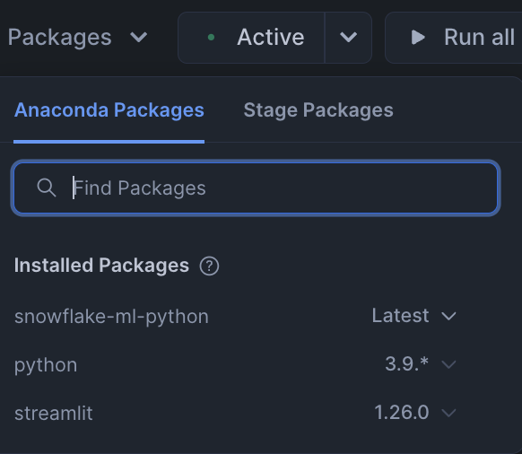
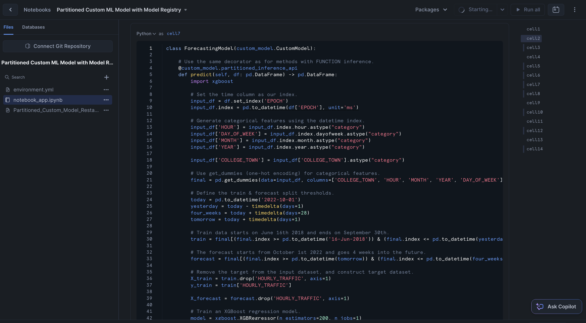

author: Charlie Hammond
id: partitioned-ml-model
summary: This is a sample Snowflake Guide
categories: data-science, data-science-&-ml, Getting-Started, Notebooks
environments: web
status: Published 
feedback link: https://github.com/Snowflake-Labs/sfguides/issues
tags: Getting Started, Data Science

# Getting Started with Partitioned Models in Snowflake Model Registry
<!-- ------------------------ -->
## Overview 
Duration: 1

Many datasets can be easily partitioned into multiple independent subsets. For example, a dataset containing sales data for a chain of stores can be partitioned by store number. A separate model can then be trained for each partition. Training and inference operations on the partitions can be parallelized, reducing the wall-clock time for these operations. Furthermore, since individual stores likely differ somewhat in how their features affect their sales, this approach can actually lead to more accurate inference at the store level.

In this quickstart, you will use the [Snowflake Model Registry](https://docs.snowflake.com/en/developer-guide/snowpark-ml/model-registry/overview) to implement [partitioned](https://docs.snowflake.com/en/developer-guide/snowpark-ml/model-registry/partitioned-custom-models) training and inference using custom models. When using the model, the registry partitions the dataset, fits and predicts the partitions in parallel using all the nodes and cores in your warehouse, and combines the results into a single dataset afterward.

### Prerequisites
- Access to a Snowflake account with Accountadmin. 
- Access to run Notebooks in Snowflake
- Foundational knowledge of Data Science workflows

### What You Will Learn 
- How to use Snowflake Model Registry to implement paritioned model training and inference

### What You’ll Need 
- A [Snowflake](https://app.snowflake.com/) Account

### What You’ll Build 
- A partitioned ML model

<!-- ------------------------ -->
## Setup Your Account
Duration: 2

Complete the following steps to setup your account:
- Navigate to Worksheets, click "+" in the top-right corner to create a new Worksheet, and choose "SQL Worksheet".
- Paste and the following SQL in the worksheet 
- Adjust <YOUR_USER> to your user
- Run all commands to create Snowflake objects

```sql
USE ROLE ACCOUNTADMIN;

-- Using ACCOUNTADMIN, create a new role for this exercise and grant to applicable users
CREATE OR REPLACE ROLE PARTITIONED_LAB_USER;
GRANT ROLE PARTITIONED_LAB_USER to USER <YOUR_USER>;

-- create our virtual warehouse
CREATE OR REPLACE WAREHOUSE PARTITIONED_WH AUTO_SUSPEND = 60;

GRANT ALL ON WAREHOUSE PARTITIONED_WH TO ROLE PARTITIONED_LAB_USER;

-- Next create a new database and schema,
CREATE OR REPLACE DATABASE PARTITIONED_DATABASE;
CREATE OR REPLACE SCHEMA PARTITIONED_SCHEMA;

GRANT OWNERSHIP ON DATABASE PARTITIONED_DATABASE TO ROLE PARTITIONED_LAB_USER COPY CURRENT GRANTS;
GRANT OWNERSHIP ON ALL SCHEMAS IN DATABASE PARTITIONED_DATABASE  TO ROLE PARTITIONED_LAB_USER COPY CURRENT GRANTS;

```
<!-- ------------------------ -->
## Run the Notebook
Duration: 30

- Download the notebook from this [link](https://github.com/Snowflake-Labs/sfguide-getting-started-with-partitioned-models-snowflake-model-registry/blob/main/partitioned-custom-model-with-model-registry.ipynb)
- Change role to PARTITIONED_LAB_USER
- Navigate to Projects > Notebooks in Snowsight
- Click Import .ipynb from the + Notebook dropdown
- Create a new notebok with the following settings
  - Notebook Location: PARTITIONED_DATABASE, PARTITIONED_SCHEMA
  - Warehouse: PARTITIONED_WH
- Download Partitioned_Custom_Model_Restaurant_Traffic_Data.csv
- Click Packages in the top right, add `snowflake-ml-python`
- Download the csv file from this [link](https://github.com/Snowflake-Labs/sfguide-getting-started-with-partitioned-models-snowflake-model-registry/blob/main/Partitioned_Custom_Model_Restaurant_Traffic_Data.csv)
- Click the plus on the file explorer in the new notebook and upload the csv file



- Click the packages drop down in the top right and add the Snowflake-ml-python package



- Run cells in the notebook!



<!-- ------------------------ -->
## Conclusion And Resources
Duration: 1

Partitioning datasets can significantly optimize the training and inference process. In this quickstart, we saw how you could partition traffic data by store, allowing for individual models to be trained on each subset. This not only speeds up operations through parallelization but also enhances model accuracy by tailoring predictions to specific store characteristics.

Now, it's your turn to implement this approach. Use the Snowflake Model Registry to perform partitioned training and inference with custom models!

### What You Learned
- How to use Snowflake Model Registry to implement paritioned model training and inference

### Related Resources
- [Snowflake Model Registry](https://docs.snowflake.com/en/developer-guide/snowpark-ml/model-registry/overview)
- [partitioned](https://docs.snowflake.com/en/developer-guide/snowpark-ml/model-registry/partitioned-custom-models)
