author: Fran Britschgi
id: partner-snowflake-predictive-model-using-sigma
categories: snowflake-site:taxonomy/solution-center/certification/quickstart, snowflake-site:taxonomy/product/ai, snowflake-site:taxonomy/snowflake-feature/external-collaboration, snowflake-site:taxonomy/snowflake-feature/model-development
language: en
summary: Building predictive modeling in Snowflake and Sigma 
environments: web
status: Published
feedback link: https://github.com/Snowflake-Labs/sfguides/issues

lastUpdated: 2024-07-09


# Develop a Predictive Model using Snowflake and Sigma
<!-- The above name is what appears on the website and is searchable. -->

## Overview 

This QuickStart will guide you through an end-to-end example of utilizing Snowflake's new machine learning features. 

Our focus will be on creating a machine learning-driven price prediction tool, integrating the perspectives of both a business analyst and a data scientist using Snowflake and Sigma.

We will demonstrate how Sigma enables the execution of complex commands in Snowflake, and displays results in a format similar to a spreadsheet interface. 

This approach not only maintains data security within Snowflake, but also broadens accessibility to users without SQL expertise.

In our example, we'll analyze historic food truck sales data. We aim to develop a model identifying key drivers of high sales in the past and explore how a business analyst can leverage this model for informed decision-making. The analyst will be able to collaborate with the data scientist all from a sigma workbook.

### Target Audience
Anyone who is interested in learning how to easily leverage the power of Snowflakes machine learning features, by using Sigma.

### What You Will Build
In this lab you will be creating a machine learning-driven price prediction tool, integrating the perspectives of both a business analyst and a data scientist using Snowflake and Sigma.

### What You Will Learn

- How to explore and build a dataset for training a model
- How to build a machine learning model using Snowpark ML
- How to register a model in the Snowpark Model Registry
- How to expose the model to business users in Sigma

### Prerequisites
Thanks for signing up for Snowflake & Sigma’s Hands-On Lab, “Develop a Predictive Model Using Snowflake and Sigma”. To ensure that you can follow along during the lab, please complete the work outlined below prior to the start of the lab. 

1: Sign up for a Snowflake Trial - You can sign up for a 30-day free trial of Snowflake [here.](https://signup.snowflake.com/?utm_source=snowflake-devrel&utm_medium=developer-guides&utm_cta=developer-guides) Even if you have a login on an existing Snowflake account, you should still create a new Snowflake account, as you’ll be asked to utilize the ACCOUNTADMIN role for some steps below.


2: Accept Anaconda Terms - Follow [these instructions](https://docs.snowflake.com/en/user-guide/ui-snowsight/notebooks-setup#label-notebooks-anaconda-terms) to accept the Anaconda Terms to import Python libraries in Snowflake. (For this lab, you will need to import the [snowflake-ml-python](https://pypi.org/project/snowflake-ml-python/) package in a Snowflake Notebook.)


3: Sign Up for a Sigma Trial - From Snowflake, in Snowsight, navigate to `Data Product`s >> `Partner Connect`, then search for `Sigma` and follow the instructions to sign up for a free trial. When signing up for a Sigma trial via Partner Connect, relevant Snowflake objects, such as a database (PC_SIGMA_DB), a compute warehouse (PC_SIGMA_WH), a role (PC_SIGMA_ROLE), and a user (PC_SIGMA_USER) for working with Snowflake data in Sigma. Furthermore, Partner Connect will automatically create a Snowflake connection for you in Sigma. (Snowflake PC_SIGMA_WH).

Once you are done configuring partner connect, or if you already have a Sigma account (or [created a Sigma trial manually](https://www.sigmacomputing.com/free-trial)), and did not use Partner Connect to create these Snowflake objects, you can run the following commands in a [Snowsight Worksheet](https://docs.snowflake.com/en/user-guide/ui-snowsight-worksheets-gs#create-worksheets-in-sf-web-interface) to configure your HOL environment:

```code
USE ROLE SYSADMIN;
CREATE DATABASE IF NOT EXISTS PC_SIGMA_DB;
CREATE WAREHOUSE IF NOT EXISTS PC_SIGMA_WH

    WAREHOUSE_SIZE='XSMALL'
    INITIALLY_SUSPENDED=TRUE
    AUTO_SUSPEND=120;

USE ROLE SECURITYADMIN;

CREATE ROLE IF NOT EXISTS PC_SIGMA_ROLE;

GRANT ALL ON DATABASE PC_SIGMA_DB TO ROLE PC_SIGMA_ROLE;
GRANT USAGE ON WAREHOUSE PC_SIGMA_WH TO ROLE PC_SIGMA_ROLE;

GRANT ROLE PC_SIGMA_ROLE TO ROLE SYSADMIN;
GRANT ROLE PC_SIGMA_ROLE TO USER <your-snowflake-user>;


USE ROLE SYSADMIN;
CREATE DATABASE IF NOT EXISTS SIGMA_INTERNAL;
CREATE SCHEMA IF NOT EXISTS SIGMA_INTERNAL.WRITEBACK;


USE ROLE SECURITYADMIN;
GRANT ALL ON DATABASE SIGMA_INTERNAL TO ROLE PC_SIGMA_ROLE;
GRANT ALL ON SCHEMA SIGMA_INTERNAL.WRITEBACK TO ROLE PC_SIGMA_ROLE;
```

4: The following notebook has been provided for you to load into your Snowflake interface.

<button>[Download Snowflake Notebook](https://sigma-quickstarts-main.s3.us-west-1.amazonaws.com/notebooks/notebook_app.ipynb)</button>

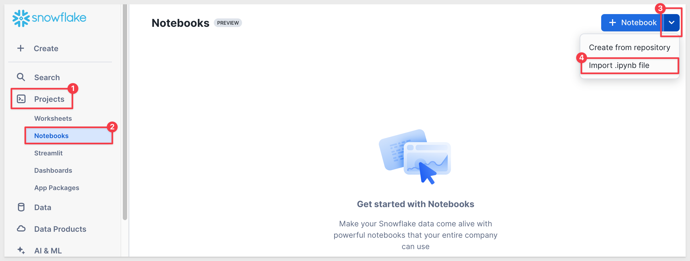

Upon import, Snowflake will prompt you for a database and schema to be used in the notebook. You can use any database/schema that the Sigma Service Role has access to.

<ul>
  <li>A Sigma instance that has a connection established to your own Snowflake instance.</li>
  <li>Sigma Write-back is enabled to your Snowflake environment</li>
  <li>A snowflake role with Usage rights on a Snowflake schema that the Sigma Service Role has access to, as well as to the writeback location.</li>
</ul>


<!-- END OF SECTION-->

## Setup

We're starting from scratch with a blank Sigma workbook. I'll first load our sales data from Snowflake. If you have sales data in Snowflake, we can directly connect to it from Sigma. In this case, we don’t have that data in Snowflake, so we’ll need to upload it. Fortunately, that’s easy to do in Sigma. Let's upload a CSV file of shift sales from the city of Seattle.

<button>[Download required CSV file](https://sigma-quickstarts-main.s3.us-west-1.amazonaws.com/csv/SHIFT_SALES.csv)</button>

1: Download the CSV file from this [Sigma hosted location:](https://sigma-quickstarts-main.s3.us-west-1.amazonaws.com/csv/SHIFT_SALES.csv)


2: From the Sigma home page click the "Create New" button in the top left corner and select "Workbook". 

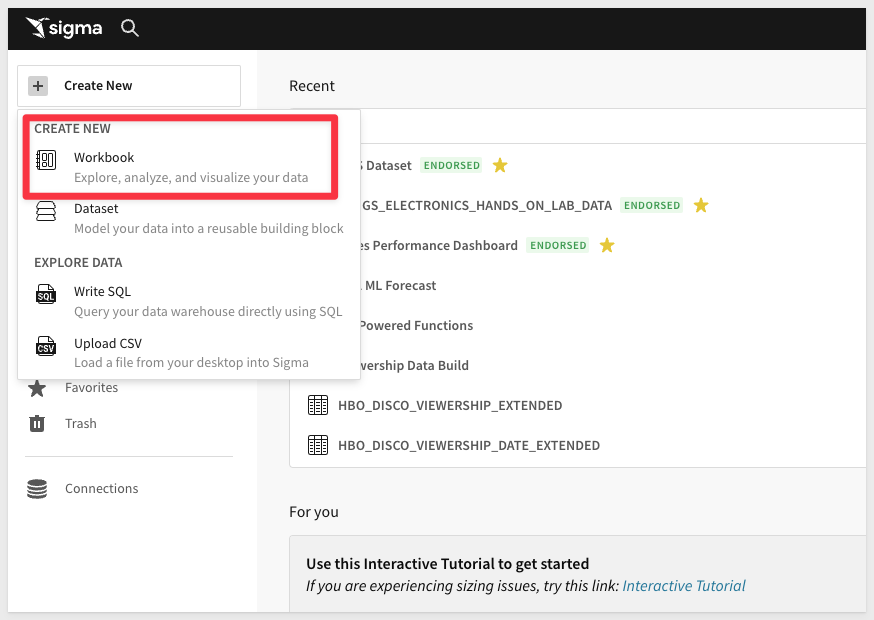

3: Now that you are in the Workbook, let's start by saving it with the name "ML Shift Sales" by clicking "Save As" in the top right. 

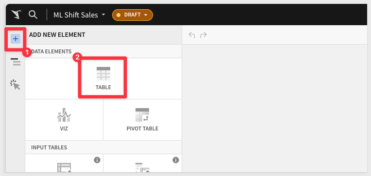

4: Add a new table, and then select Upload CSV as an option  

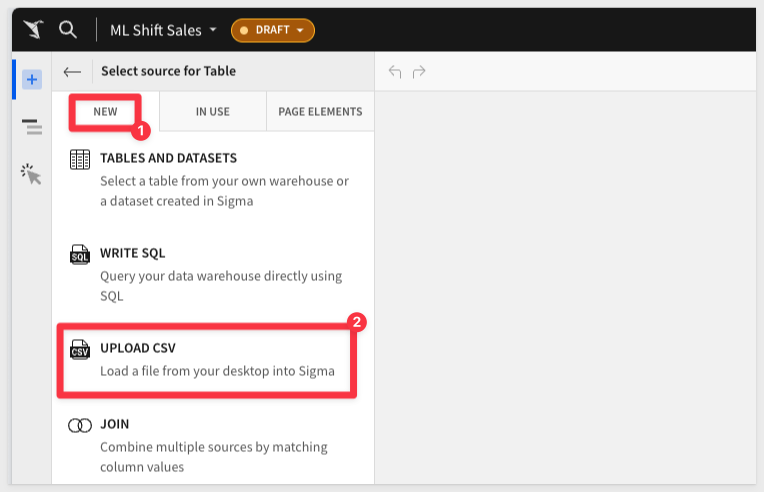

5: Make sure your instance is selected in the connection dropdown (NOT the Sigma Sample Database), and then drag your downloaded file into the upload area and then press save in the upper right to upload the table to your Snowflake instance and view the table in your sigma workbook. 


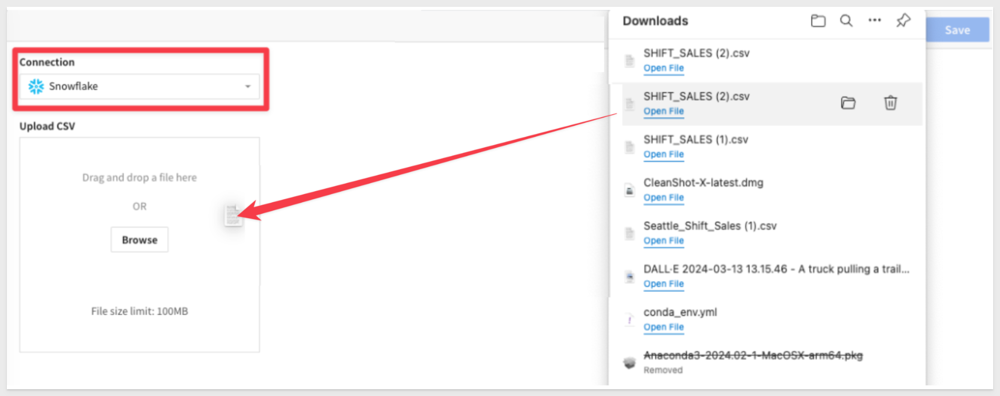


<!-- END OF SECTION-->

## Sigma Data Exploration

1: Shift sales will be of primary importance for this QuickStart, so let’s adjust adjust its format to `currency` at the start of our analysis. Select the `Shift Sales` column, and use the buttons next to the formula bar to adjust the format:

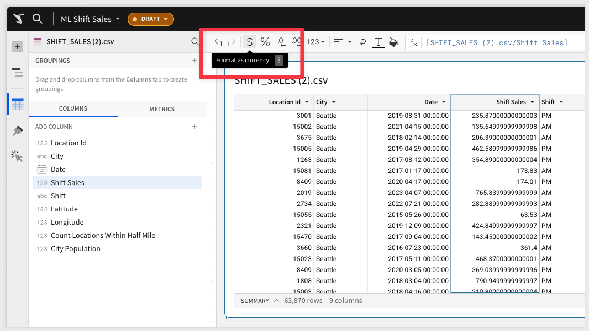

2: We don’t know what variables impact sales, but it’s a safe bet to start with time having some kind of impact. Let’s make a visual to explore this. Create a `Child element` visual: 

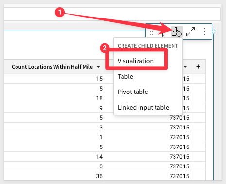

Drag `Date` and `Shift Sales` columns to the `X` and `Y axis`, respectively:

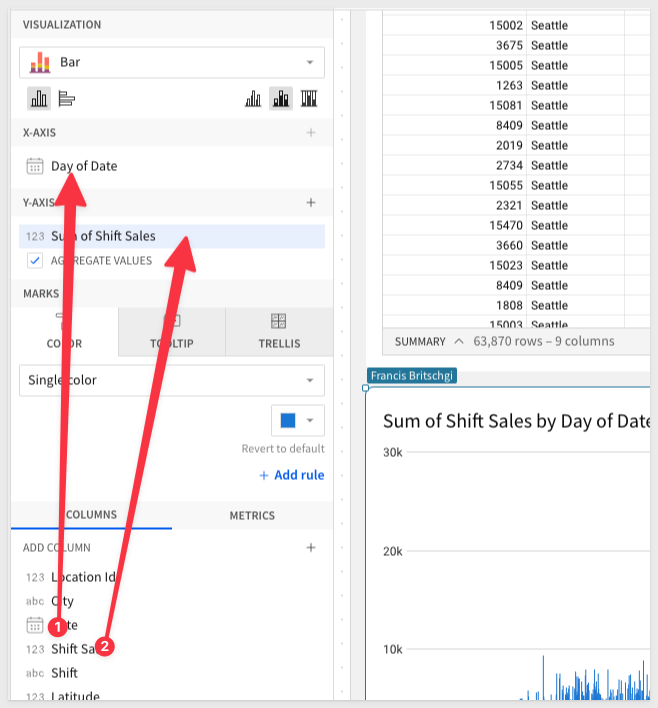


3: We can see that Sigma automatically aggregates our data to the `Day level` and applies a `Sum`. 

Lets adjust this to a monthly aggregation to "quiet out" some of the noise. 

You can adjust the formula directly in the formula bar:

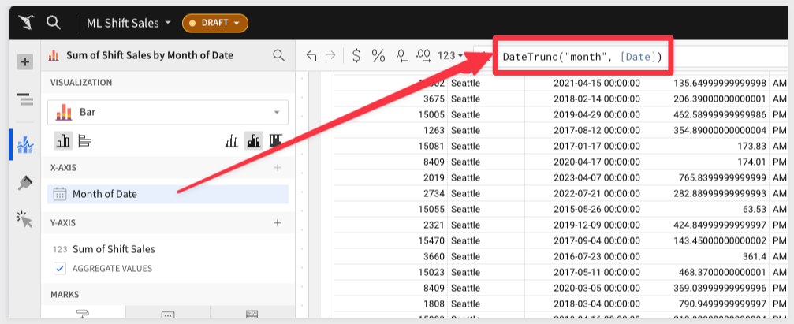


4: We can see the seasonality of the sales around each January, and we can isolate this further to confirm that suspicion. 


We will switch the formula to a [datepart() function](https://help.sigmacomputing.com/docs/datepart), and see that the first 3 months do indeed have the highest sales:

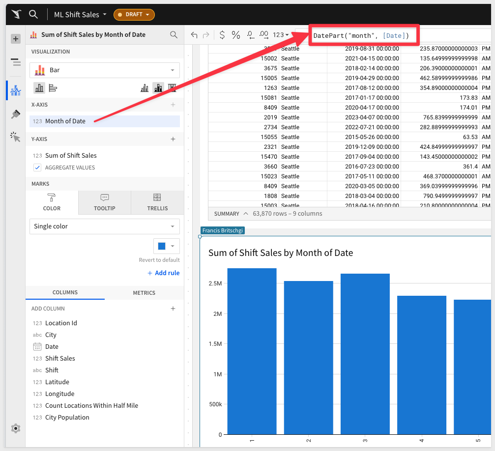


5: The second factor that we think may play a role in the sales is the shift that the sales took place in. 


We can easily add that to our visual, and then switch to a “No Stacking” bar chart, to see the differences between AM and PM shifts:

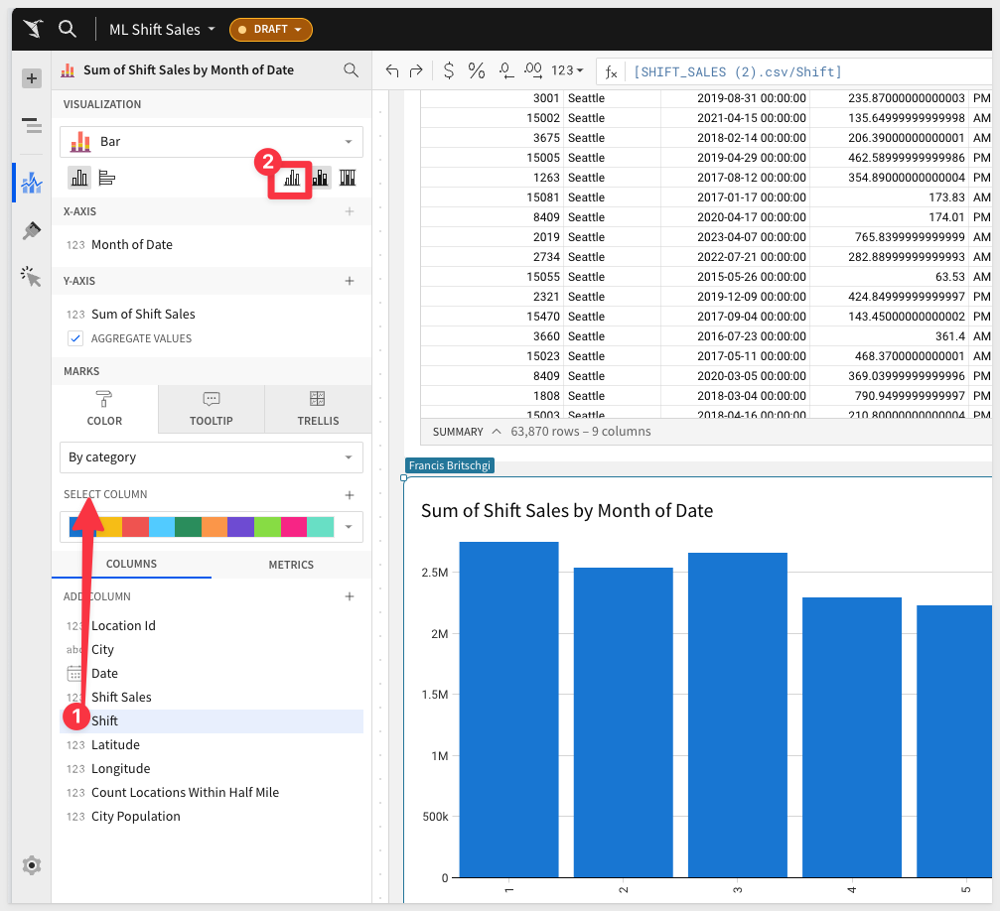


6: The third factor that we think may play a role is the weekday that the sales took place on. This is a very similar question to our monthly analysis. 


We can duplicate the table:

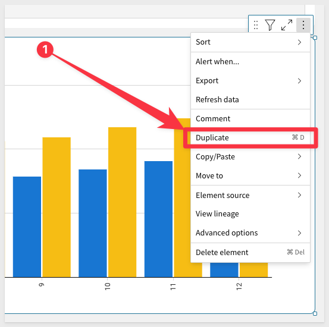

Drag it next to our first chart: 
 
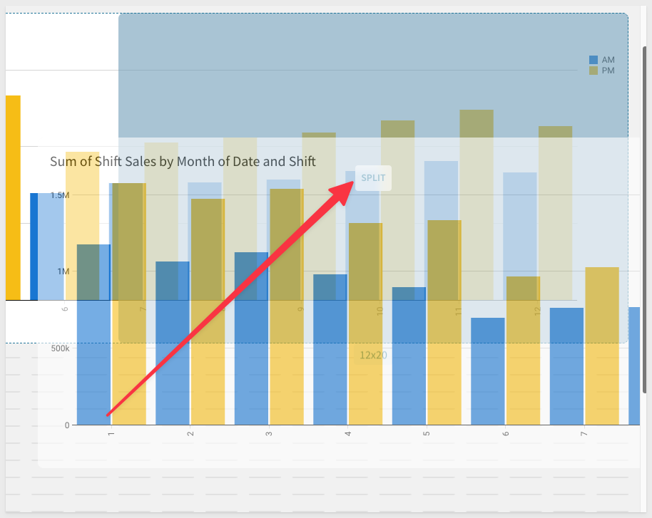

And then adjust the `DatePart() function` to use `weekday`.

Just like in the months, we can see that certain weekdays definitely return greater sales:

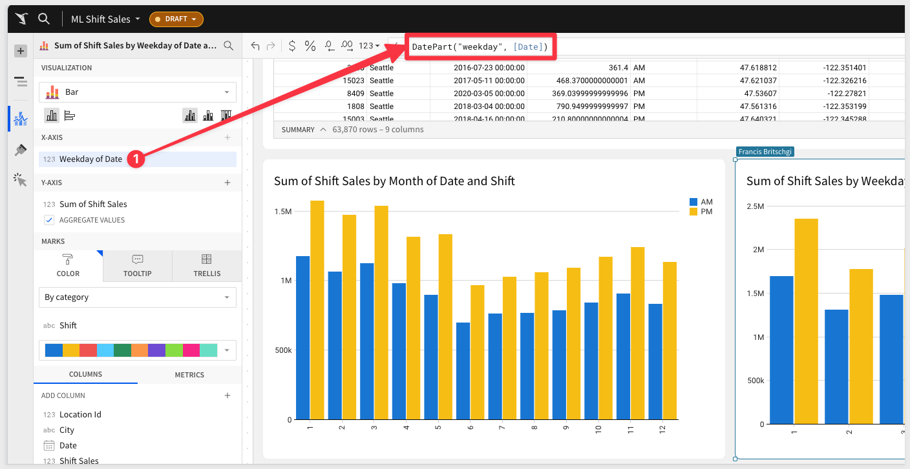


<!-- END OF SECTION-->

## Create a Dataset for Modeling


Now that we have identified Month Number, Weekday, and Shift as potential predictors for shift sales, let’s prepare a dataset with these variables for our data scientist. In Sigma, this may be something that a data scientist does in the existing workbook, or the analyst can prepare it with guidance. There is lots of room for collaboration through [live edit](https://help.sigmacomputing.com/docs/workbook-collaboration-with-live-edit) and our [comment feature.](https://help.sigmacomputing.com/docs/workbook-comments)

1: Create a child table of our shift sales table and drag it to the bottom of our workbook:

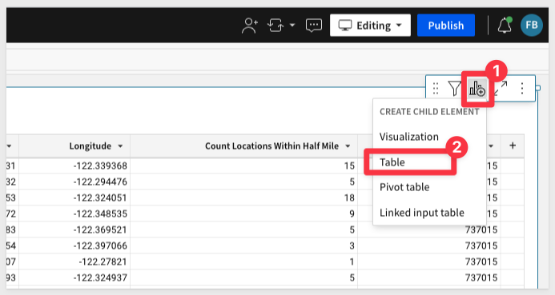

2: For our training set, we want the data to be filtered before a certain date so that we can then assess shifts after that date in the test set. 


We right click the `Date` column, and then `filter`:

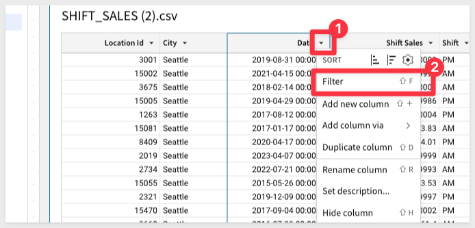

Set the filter to `Between` the dates `1/1/2020 and 12/31/2022`, to get 3 years of training data:

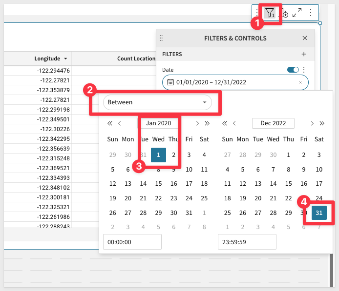

Then, rename this table to `Train` by double-clicking the title, to edit it.


3: Now we need to create the columns that we found to drive Sales. 


Add a column: 

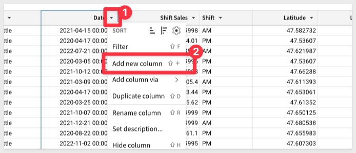

Define it as `DatePart(“month”, [Date])`, so that we get the month number.


4: We can easily duplicate this column to make a weekday column as well. 


`Duplicate` the column and then change `month` to `weekday` in the formula:

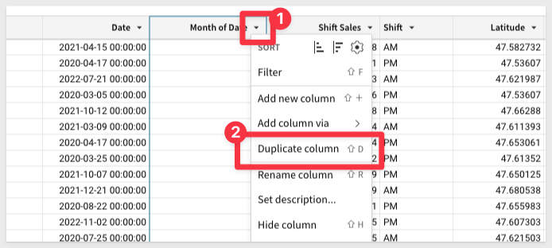


5: Finally, your data scientist may want you to encode categorical data into numerical values. 

We can easily do this with Sigma using a formula definition. 


Add a new column, define it's function as `If([Shift] = "AM", 1, 0)`, and then rename it to `Encoded Shift`.: 

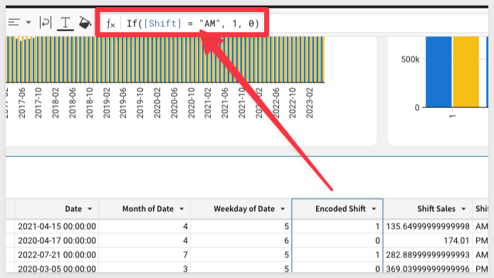


6: Now, we need to repeat all the steps to make a Test table....**Just kidding!!**


All we need to do is `duplicate` the table: 

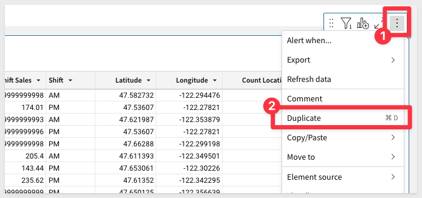

Adjust the `date filter` so that it gives us values `on or after 1/1/2023`, and then rename the new table to `Test`:

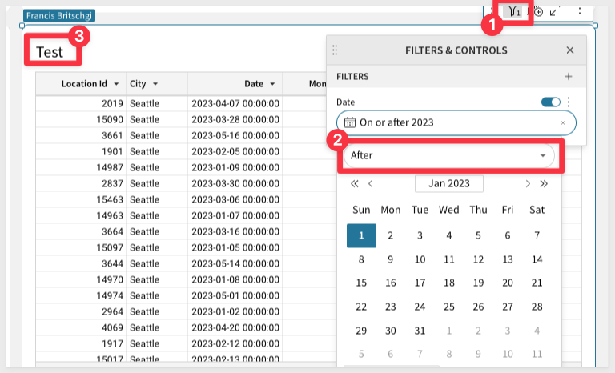

7: Finally, we can make all this work available in your Snowflake Write-back schema by creating a warehouse view from the Train table. 

We recommend calling it `Train`, but you can name it anything you’d like:

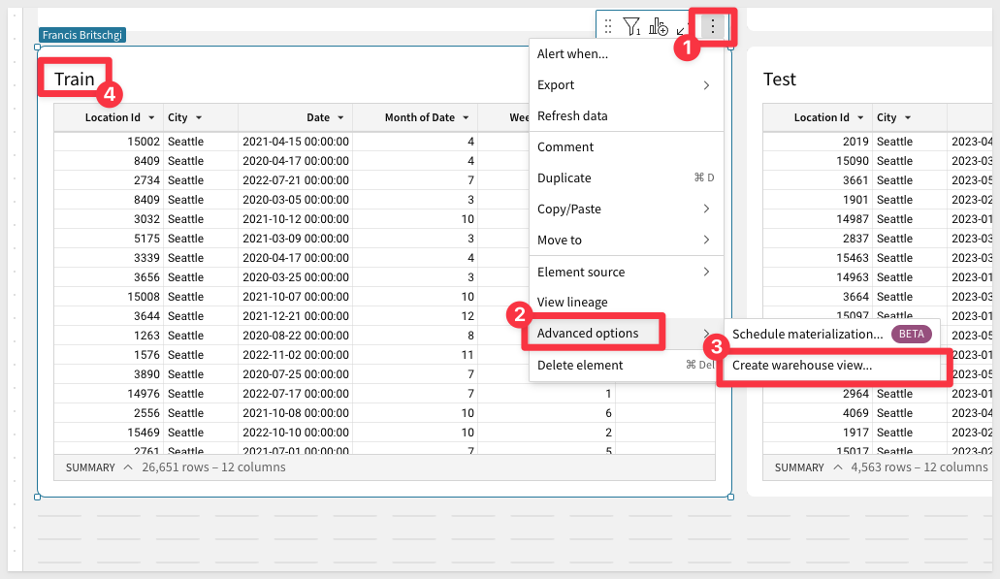<br>

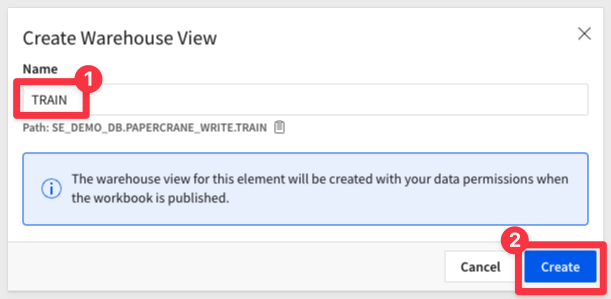
 
<aside class="negative">
<strong>NOTE:</strong><br> Note that this will get us a fully qualified name that our data scientist can use in their programming.
</aside>

8: Repeat this for `Test` to create a warehouse view for the Test table.

9: Publish the workbook to create the warehouse views!


<!-- END OF SECTION-->

## Snowflake Programming

We can now let our data scientist know that TASTY_BITES_TRAIN is ready for them to train their model on Month, Weekday, and Shift. The Data Scientist can now begin their work in the Snowflake Notebook that was downloaded in the beginning section of this hands on lab.

You can run those chunks one at a time and read their notations in the notebook, as well as see the general steps outlined below:

### 1: Create a Model Registry

This is created in your database that you will use to store this and future models.

```python
from snowflake.ml.registry import Registry

session.sql("CREATE SCHEMA IF NOT EXISTS ML_REGISTRY").collect()

reg = Registry(session, database_name="SE_DEMO_DB", schema_name="ML_REGISTRY")
```

### 2: Snowpark ML Functions

The new Snowpark ML functions make it super easy to train open-source models on optimized and scalable Snowflake compute. We can set up a code block that allows us to easily train a decision tree regression model with just a few lines. You will use the warehouse view locations that you generated in your sigma workbook in the session table calls below:

```python
from snowflake.ml.modeling.tree import DecisionTreeRegressor

# Specify inputs
training_table = session.table("[USE WAREHOUSE VIEW LOCATION FOR TRAIN]")
testing_table = session.table("[USE WAREHOUSE VIEW LOCATION FOR TEST]")

# Input my Analyst's ideas for features
feature_cols = [
    "MONTH_OF_DATE",
    "WEEKDAY_OF_DATE",
    "ENCODED_SHIFT",
]
target_col = "SHIFT_SALES"

my_model = DecisionTreeRegressor()
my_model.set_input_cols(feature_cols)
my_model.set_label_cols(target_col)
my_model.set_output_cols("PRED_" + target_col)

my_model.fit(training_table)
```

### 3: Create Governed Metrics

Snowflake also offers a large library of metrics that allow us to record the quality of a given model.

```python
from snowflake.ml.modeling.metrics import mean_absolute_error

predictions = my_model.predict(testing_table)
mae_score = mean_absolute_error(
    df=predictions, y_true_col_names="SHIFT_SALES", y_pred_col_names="PRED_SHIFT_SALES"
)
mae_score
```


### 4: Log the Model

Finally, we can log this model, and its version, comments, and metrics into the registry that we created above. The final line of this code prints the results, where we see that this model is now deployed to our registry where we can review, improve, and call the model.

```python
# Log the model
model_ver = reg.log_model(
    model_name="SHIFT_SALES_MODEL", version_name="Version_1", model=my_model
)

# Add a description to the model -
model_ver.set_metric(metric_name="MAE Score", value=mae_score)
model_ver.comment = "This linear regression model predicts the Shift Sales for a given Location, using Features discovered through Sigma"

reg.get_model("SHIFT_SALES_MODEL").show_versions()
```

### 5: Give Permissions to Sigma

Thanks to Sigma’s direct to CDW connection, all we have to do is give the Sigma Role access, and the model will be automatically available to Sigma! 

<aside class="positive">
<strong>IMPORTANT:</strong><br> Make sure to update this to your registry and your Sigma role.
</aside>

```python
session.sql("GRANT USAGE ON ALL MODELS IN SCHEMA SE_DEMO_DB.ML_REGISTRY TO ROLE PAPERCRANE").collect()
```


<!-- END OF SECTION-->

## Using the Model in Sigma

We’ll now show how we can apply that trained model in sigma, and look at an example application of that method. 

1: Create a child table from our `Test` table, and call it `Deploy Model.` We’ll be calling our model here. 

2: Create a new column, and use the following syntax and your own model location to define a function like this:
```code 
CallVariant(“SE_DEMO_DB.ML_REGISTRY.SHIFT_SALES_MODEL!Predict”) 
```

You should see an error about argument types, as we haven’t provided any input yet. If you get an error about the UDF not existing, there is likely a permissions error. 

<aside class="positive">
<strong>IMPORTANT:</strong><br> Make sure you have given usage to the model as described in Section 5. Visual Studio Code Programming, Step 6.
</aside>

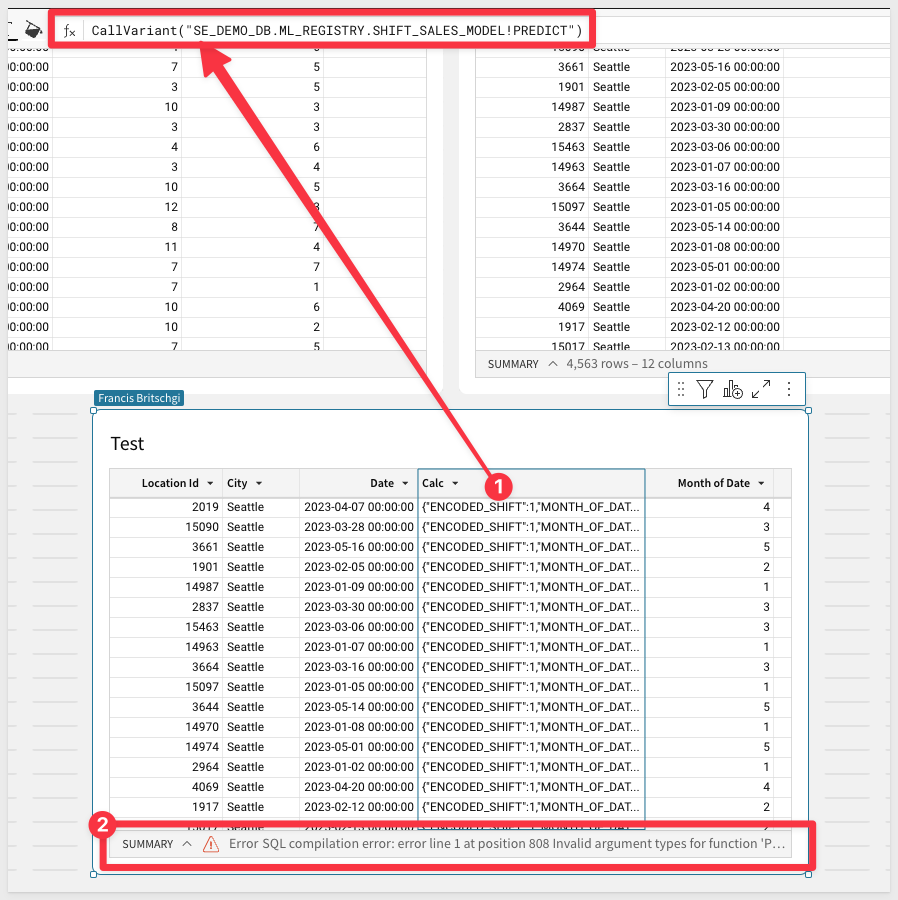

3: Now let’s add the arguments. These should be provided in the same order as in your code: 
`MONTH_OF_DATE`, `WEEKDAY_OF_DATE`, `ENCODED_SHIFT`. 

Voila, you should now see a JSON output in this column. 

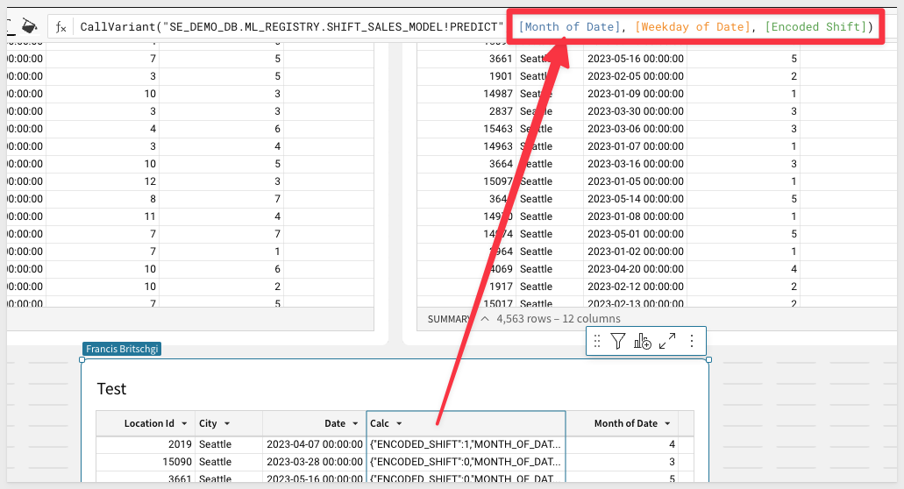

4: Finally, we can now extract the prediction from the column. Sigma [reads JSON right out of the box](https://help.sigmacomputing.com/docs/json), so we can just right click and extract the columns. 

For linear regression, there is only one output, `PRED_SHIFT_SALES`, that we care about, but we could imagine other models that would have multiple outputs here. 

Confirm your selection, and we have our final prediction that directly runs the model we defined in Snowflake:


<br>

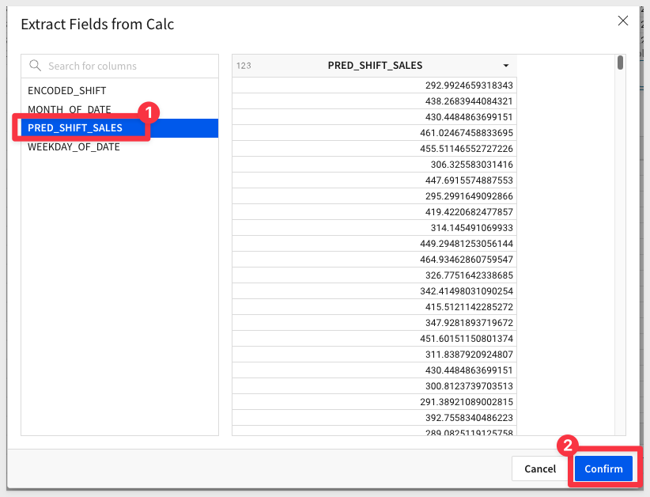

5: Now, if we combine the steps of the prediction above, we end up with a final syntax that looks something like this:
```code
Number(CallVariant("SE_DEMO_DB.ML_REGISTRY.SHIFT_SALES_MODEL!PREDICT", [Month of Date], [Weekday of Date], [Encoded Shift]).PRED_SHIFT_SALES)
```

That’s quite a mouthful, and it is clearly unrealistic to expect later business users to invoke the model in this way. Luckily, we can use a [Sigma Custom Function](https://help.sigmacomputing.com/docs/custom-functions) to encode this for future use in a friendlier syntax. 

Open up your `Admin Panel` to access the custom functions:

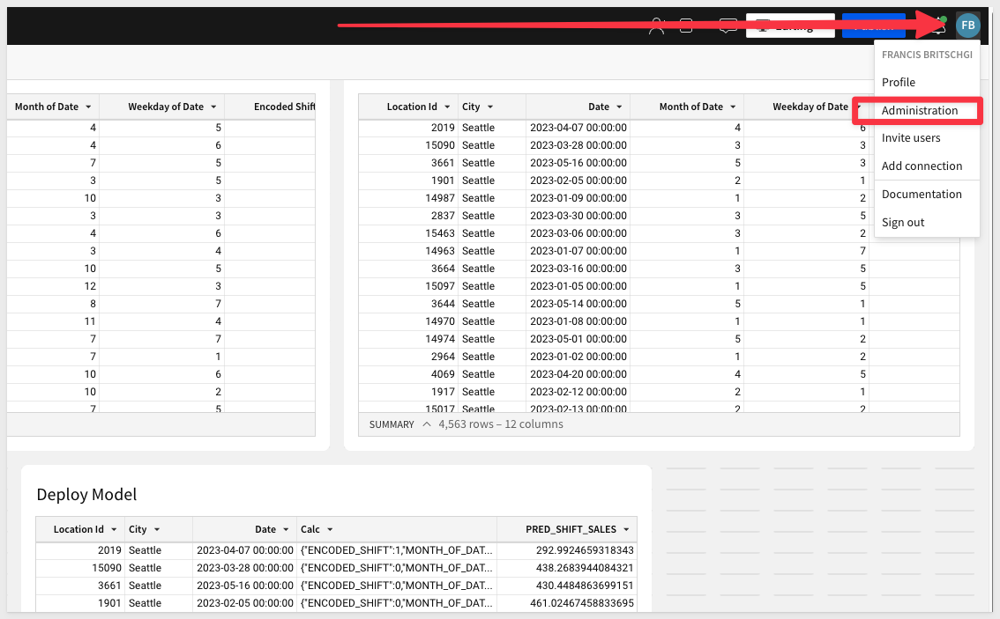

6: Currently, `Custom Functions` are located on the bottom of our `Admin Panel`. 

Scroll down to the bottom of the page, and then select `Add`:

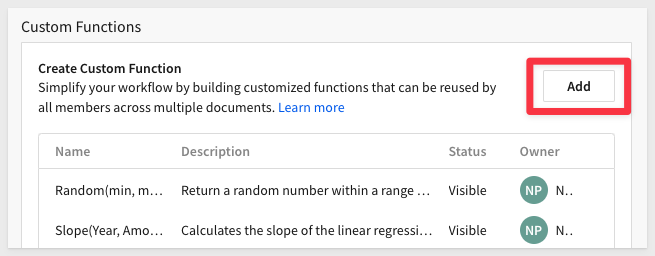

7: We can paste the formula from Step 5 into the formula box, and then update to your own model location. 

We can then give the Custom Function an easy-to-find name, `PredictShiftSales` - and let our users know what it does:

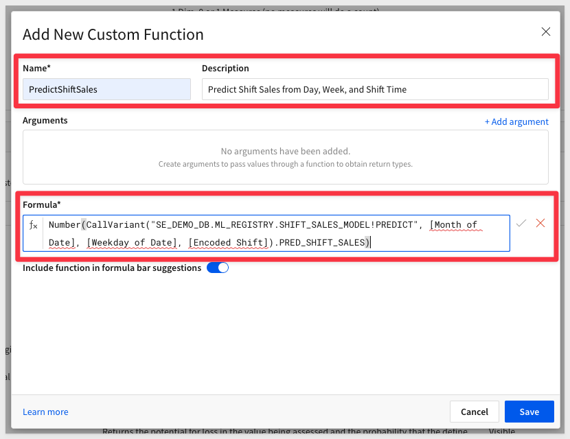

8: Now, we can define the arguments, again using User-Friendly variable names and descriptions. You don’t need the descriptions, but they are a great way to explain and specify what users should enter here. 

For this QuickStart, you can just use the names `Month Number`, `Weekday Number` and `Shift Number` and save the descriptions for later:

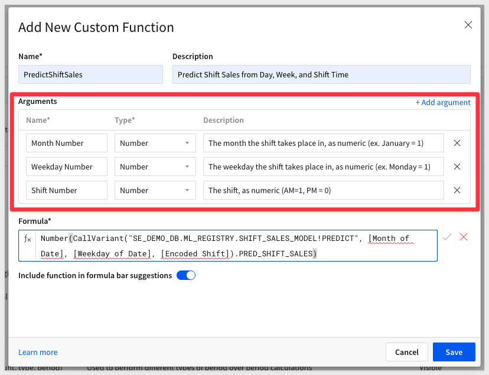

9: Once we update the formula bar to use these new friendly names, making sure to maintain the order of the arguments, we can save the Custom Function and it will now be available in our workbook:

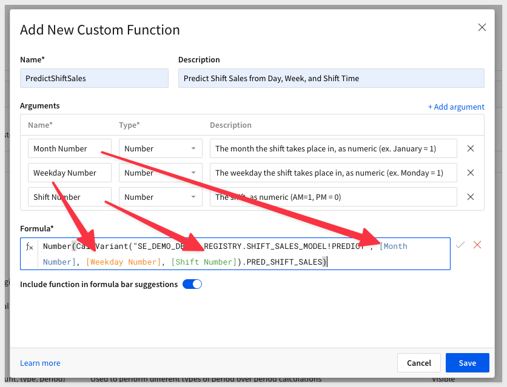

10: Go back to the `ML Shift Sales` workbook and add a `new column` to our `Deploy Model` table. 

You’ll be able to now run the exact same ML model by entering in `PredictShiftSales` and filling in the arguments! 

This simple format for calling the model will make your Model far more accessible to the end users who stand to benefit from it:

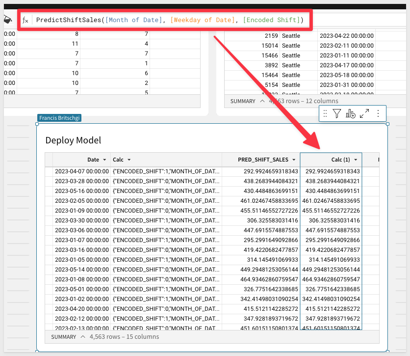


<!-- END OF SECTION-->

## Extended Applications

This section documents examples of how different personas can benefit from deployed ML functions.


**1: Business Ops: Scoring new data through Input tables:**<br>
It’s very common for organizations to have operational steps outside the CDW, in the format of Excel or Google Sheets files. Incorporating those files into a Machine Learning framework has historically involved a fair amount of friction. In Sigma, we can do it very simply using an input table. The input table allows us to paste the values from a Google Sheets table, and then transform the variables for the model, and apply the model all in one step:

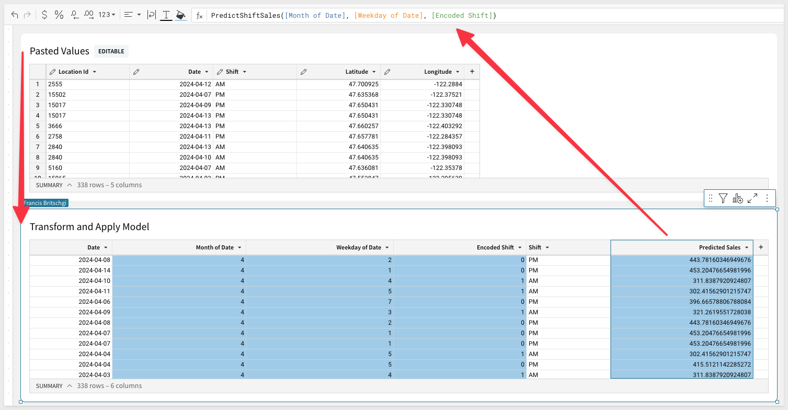

Our Business Op persona can then quickly identify the shifts with the most predicted earnings and allocate more resources to those shifts! In this example, we use a RankPercentile function to find the top and bottom 10% predicted shifts, and mark those for Boosting and Dropping, respectively ml36.png

**2: Data Apps: Scoring a specific shift:**<br>
Suppose you want to build your manager a tool that allows them to know whether a specific shift is expected to perform well or not. We can build that Data App in seconds in Sigma. In our example, we create two controls for the date and the shift. We can then handle the transformation within a Dynamic Text Element, such that the control is properly formatted for the Model Call. As a result, we get a ready-made Scoring App, where any business user can tweak what day or shift they want to get the prediction for:

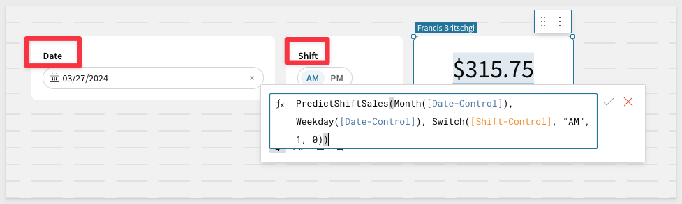

**3: Data Science: Reviewing the quality of a model:**<br>
Sigma can also be an excellent place to check the accuracy and performance of an ML model. In this example, we run the Custom Function against our Test Set and compare the output against the actual observed shift sales we saw for that day. We can create a new column, `Residual`, that measures the difference between the observed and predicted value.

Then, the residuals can be plotted to see if the predictive power of our model is sufficient for our use case, or if further refinements in Snowpark or EDA are needed. Because Sigma is so flexible in the calculations and groupings we can apply, customers use Sigma for all sorts of statistical applications, including Power Analyses, Confusion Matrices, and Lift, ROC, and Gain charts:

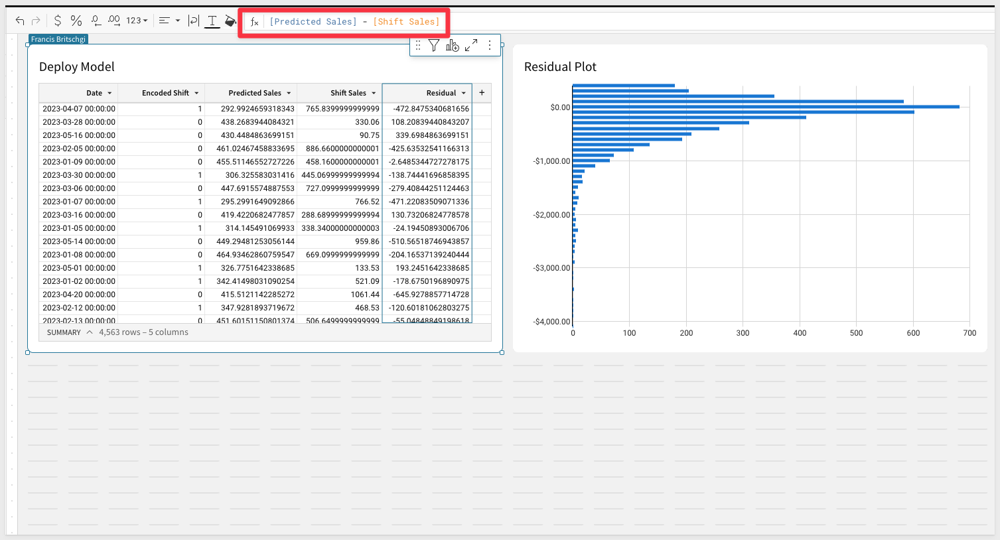


<!-- END OF SECTION-->

<!-- ------------------------ -->
## Conclusion And Resources


Congratulations! You've successfully built a training dataset, trained a model, and exposed it in a easy to use medium through a Sigma front end. This exercise is just scratching the surface of what is possible with Snowflake, Snowpark, and Sigma.


### What You Learned

- How to explore and build a dataset for training a model
- How to build a machine learning model using Snowpark ML
- How to register a model in the Snowpark Model Registry
- How to expose the model to business users in Sigma

### Related Resources

[Blog](https://www.sigmacomputing.com/blog/)<br>
[Community](https://community.sigmacomputing.com/)<br>
[Help Center](https://help.sigmacomputing.com/hc/en-us)<br>
[QuickStarts](https://quickstarts.sigmacomputing.com/)<br>

Be sure to check out all the latest developments at [Sigma's First Friday Feature page!](https://quickstarts.sigmacomputing.com/firstfridayfeatures/)
<br>

[](https://twitter.com/sigmacomputing)&emsp;
[](https://www.linkedin.com/company/sigmacomputing)&emsp;
[](https://www.facebook.com/sigmacomputing)


<!-- END OF WHAT WE COVERED -->
<!-- END OF QUICKSTART -->
