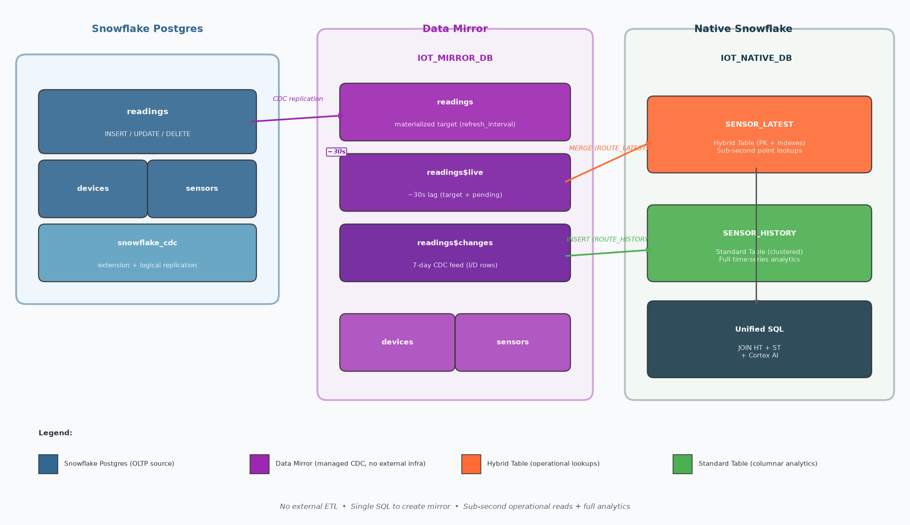

author: Adam Timm
id: postgres-to-native-snowflake
categories: snowflake-site:taxonomy/solution-center/certification/quickstart, snowflake-site:taxonomy/product/data-engineering, snowflake-site:taxonomy/snowflake-feature/postgres, snowflake-site:taxonomy/snowflake-feature/hybrid-tables
language: en
summary: Mirror data from Snowflake Postgres into a native Snowflake architecture using Hybrid Tables for operational reads and Standard Tables for analytics — with no external ETL pipelines.
environments: web
status: Hidden
feedback link: https://github.com/Snowflake-Labs/sfguides/issues

<!--
keywords: snowflake postgres, data mirroring, hybrid tables, standard tables, CDC, IoT, OLTP, zero-ETL, pg_lake, $live, $changes, unified SQL
skill_level: intermediate
prerequisite_guides: getting-started-with-snowflake-postgres, getting-started-with-hybrid-tables
-->

# From Postgres to Native Snowflake: Smart Data Landing with Hybrid and Standard Tables
<!-- ------------------------ -->
## Overview
Duration: 5

You have operational data in Snowflake Postgres. You want to run analytics on it, power sub-second dashboards, and layer in AI — all without building or operating an ETL pipeline. This guide shows you how.

**Snowflake Postgres data mirroring** continuously replicates tables from a Postgres instance into your Snowflake account in a single SQL call. Once the mirror is running, you route that data into the right native architecture:

- **Hybrid Tables** for sub-second point lookups and operational reads (e.g. latest sensor reading per device)
- **Standard Tables** for bulk analytics, time-series aggregates, and Cortex AI

The result is a fully unified architecture: one platform, one SQL interface, no external connectors.

> aside positive
> **Data mirroring vs Postgres for your data lake (pg_lake):** Snowflake offers two ways to connect Postgres and Snowflake. This guide uses **data mirroring** — continuous, automatic sync with seconds of latency and zero infrastructure. If you need more control over *when* and *how* data moves, or want to work with shared open-format Iceberg tables, see the [pg_lake quickstart](https://snowflake.com/en/developers/guides/sync-data-from-postgres-to-snowflake-with-iceberg-and-pg-lake/) instead.

> aside positive
> **Do you even need native tables?** If your workload is simple reads against mirrored data — small tables, low query volume, no custom indexes needed — you can skip the routing layer and just query `$live` views directly (~30s freshness). This guide adds native HT + ST when you need: (1) sub-millisecond indexed lookups, (2) secondary indexes on non-PG-indexed columns, (3) clustered analytics with partition pruning, (4) Streams or Dynamic Tables, (5) custom denormalized schemas, or (6) data retention beyond the 7-day `$changes` window.



### What You Will Build

- A Snowflake Postgres instance seeded with IoT sensor data (devices, sensors, readings)
- A **Data Mirror** that continuously replicates those tables into Snowflake
- A native Snowflake database with a **Hybrid Table** (latest sensor state) and a **Standard Table** (full time-series history)
- Two **Tasks** that route data from the mirror into the native tables using `$live` and `$changes`
- Unified SQL queries joining the operational HT and the analytic ST in a single statement
- An optional **Cortex AI** anomaly detection query

### What You Will Learn

- How Snowflake Postgres Data Mirroring works and what `$live` and `$changes` provide
- When to use Hybrid Tables vs Standard Tables for mirrored data
- How to build a low-latency routing layer from mirror output to native tables
- How to query across HT and ST with standard SQL

### Prerequisites

- A Snowflake account with **ACCOUNTADMIN** role
- **Snowflake Postgres Data Mirroring** enabled on your account (Public Preview; contact your Snowflake representative if not yet available)
- A Snowflake Postgres instance on the **STANDARD** or **HIGH MEMORY** tier (BURSTABLE is not supported for mirroring)
- `psql` or a compatible Postgres client to connect to the Postgres instance
- Familiarity with basic SQL and Snowflake worksheets

> aside negative
> **Public Preview Feature:** Snowflake Postgres data mirroring is available in Public Preview. Availability depends on your account and region. Confirm with your Snowflake contact that the feature is enabled on your account before proceeding. **Known Issues:** Mirror names must be lowercase. Role names with dashes (e.g. `data-eng`) fail on `CREATE_MIRROR` — switch to a role whose name uses only underscores before running mirror procedures.

<!-- ------------------------ -->
## Setup
Duration: 10

### Create Infrastructure

Run the following in a Snowflake worksheet as **ACCOUNTADMIN**. This creates a dedicated role, warehouse, and database for the quickstart, and grants the `postgres_mirror_admin` application role needed to manage mirrors.

```sql
USE ROLE ACCOUNTADMIN;

-- Role and warehouse
CREATE OR REPLACE ROLE PG_NATIVE_QS_ROLE;
GRANT ROLE PG_NATIVE_QS_ROLE TO ROLE ACCOUNTADMIN;

CREATE OR REPLACE WAREHOUSE PG_NATIVE_QS_WH
  WAREHOUSE_SIZE = XSMALL
  AUTO_SUSPEND   = 300
  AUTO_RESUME    = TRUE;
GRANT OWNERSHIP ON WAREHOUSE PG_NATIVE_QS_WH TO ROLE PG_NATIVE_QS_ROLE;

-- Grant mirror admin permissions (required for CREATE_MIRROR)
GRANT APPLICATION ROLE snowflake.postgres_mirror_admin TO ROLE ACCOUNTADMIN;
```

### Create or Prepare a Snowflake Postgres Instance

If you do not already have a Postgres instance, follow [Getting Started with Snowflake Postgres](https://quickstarts.snowflake.com/guide/getting-started-with-snowflake-postgres) to create one. The instance **must** use the STANDARD or HIGH MEMORY tier — BURSTABLE does not support mirroring.

Once your instance is running, grant the `snowflake` application usage on it:

```sql
-- Replace 'iot_pg_instance' with the name of your Postgres instance
GRANT USAGE ON POSTGRES INSTANCE "iot_pg_instance" TO APPLICATION snowflake;
```

### Install the CDC Extension in Postgres

Connect to your Postgres instance using `psql` or a compatible client and install the `snowflake_cdc` extension. This also installs `pg_lake` as a dependency:

```sql
-- Run in your Postgres instance
CREATE EXTENSION snowflake_cdc CASCADE;
```

> aside positive
> **Tip:** Run `\dx` in psql after the install to confirm both `snowflake_cdc` and `pg_lake` appear in the extension list.

### Seed Demo Data

Create and populate the demo IoT tables in your Postgres instance. These tables represent industrial sensor telemetry: devices in the field, the sensors attached to them, and a continuous stream of readings.

```sql
-- Run in your Postgres instance

-- Devices: physical equipment in the field
CREATE TABLE IF NOT EXISTS devices (
  device_id   TEXT        PRIMARY KEY,
  location    TEXT        NOT NULL,
  device_type TEXT        NOT NULL,
  install_date DATE       NOT NULL
);

-- Sensors: instruments attached to each device
CREATE TABLE IF NOT EXISTS sensors (
  sensor_id   TEXT        PRIMARY KEY,
  device_id   TEXT        NOT NULL REFERENCES devices(device_id),
  sensor_type TEXT        NOT NULL,
  unit        TEXT        NOT NULL
);

-- Readings: continuous time-series telemetry
CREATE TABLE IF NOT EXISTS readings (
  reading_id  BIGSERIAL   PRIMARY KEY,
  sensor_id   TEXT        NOT NULL REFERENCES sensors(sensor_id),
  recorded_at TIMESTAMPTZ NOT NULL DEFAULT NOW(),
  value       DOUBLE PRECISION NOT NULL
);

-- Seed devices
INSERT INTO devices VALUES
  ('DEV-001', 'Well Pad A', 'pressure_skid',   '2023-01-15'),
  ('DEV-002', 'Well Pad A', 'flow_meter',       '2023-01-15'),
  ('DEV-003', 'Well Pad B', 'pressure_skid',   '2023-06-01'),
  ('DEV-004', 'Well Pad B', 'temperature_unit', '2023-06-01'),
  ('DEV-005', 'Pipeline C', 'flow_meter',       '2024-02-20');

-- Seed sensors
INSERT INTO sensors VALUES
  ('SEN-001', 'DEV-001', 'pressure',    'PSI'),
  ('SEN-002', 'DEV-001', 'temperature', 'C'),
  ('SEN-003', 'DEV-002', 'flow_rate',   'bbl/day'),
  ('SEN-004', 'DEV-003', 'pressure',    'PSI'),
  ('SEN-005', 'DEV-004', 'temperature', 'C'),
  ('SEN-006', 'DEV-005', 'flow_rate',   'bbl/day');

-- Seed 500 historical readings (last 7 days, randomised)
INSERT INTO readings (sensor_id, recorded_at, value)
SELECT
  s.sensor_id,
  NOW() - (random() * interval '7 days'),
  CASE s.sensor_type
    WHEN 'pressure'    THEN 800 + (random() * 400)
    WHEN 'temperature' THEN 60  + (random() * 30)
    WHEN 'flow_rate'   THEN 200 + (random() * 100)
  END
FROM sensors s,
     generate_series(1, 80) g;
```

<!-- ------------------------ -->
## Create the Mirror
Duration: 10

### How Data Mirroring Works

When you call `SNOWFLAKE.POSTGRES.CREATE_MIRROR`, Snowflake:

1. Installs a logical replication publication on the source Postgres instance
2. Starts a CDC worker (managed by the `snowflake_cdc` extension) that captures every insert, update, and delete
3. Creates a **target database** in Snowflake with three objects per mirrored table:

| Object | Description |
|--------|-------------|
| `<table>` | Materialized copy of the source, updated on `refresh_interval` |
| `<table>$live` | View combining the target table with not-yet-merged changes — ~30s lag regardless of `refresh_interval` |
| `<table>$changes` | Rolling 7-day CDC feed: every insert, update, and delete as queryable rows |

The mirror runs entirely inside Snowflake — no external connectors, no separate infrastructure to operate.

### Create the Mirror

Back in a Snowflake worksheet, run as **ACCOUNTADMIN**:

```sql
USE ROLE ACCOUNTADMIN;
USE WAREHOUSE PG_NATIVE_QS_WH;

CALL SNOWFLAKE.POSTGRES.CREATE_MIRROR(
  mirror_name       => 'iot_mirror',
  postgres_instance => 'iot_pg_instance',   -- replace with your instance name
  postgres_database => 'postgres',
  target_database   => 'IOT_MIRROR_DB',
  postgres_tables   => ['public.devices', 'public.sensors', 'public.readings'],
  refresh_interval  => '1 minute'
);
```

> aside positive
> **`refresh_interval` trade-off:** A shorter interval keeps the materialized target table more current but increases apply task costs. The `$live` view always reflects changes within ~30 seconds regardless of this setting — so you can set a longer interval to reduce cost while still getting sub-minute lag from `$live`.

### Verify Mirror Status

After creation, Snowflake performs an initial snapshot of each table. Check progress:

```sql
CALL SNOWFLAKE.POSTGRES.LIST_MIRRORED_TABLES('iot_mirror');
```

Each table shows one of two states:

- `SNAPSHOTTING` — initial copy in progress
- `REPLICATING` — initial sync complete, ongoing CDC active

Wait until all three tables show `REPLICATING` before proceeding.

You can also inspect mirror configuration:

```sql
CALL SNOWFLAKE.POSTGRES.DESCRIBE_MIRROR('iot_mirror');
```

<!-- ------------------------ -->
## Explore the Mirror Output
Duration: 10

Once all tables show `REPLICATING`, the `IOT_MIRROR_DB` database contains your data. Let's explore what the mirror provides.

### Query the Materialized Target Tables

These are standard Snowflake tables, updated on the `refresh_interval`:

```sql
USE DATABASE IOT_MIRROR_DB;
USE SCHEMA PUBLIC;

SELECT COUNT(*) AS total_readings FROM readings;
SELECT * FROM devices ORDER BY device_id;
SELECT * FROM sensors ORDER BY sensor_id;
```

### Query $live for Sub-Minute Freshness

The `$live` view combines the target table with changes not yet merged, giving you ~30-second lag:

```sql
-- Latest 10 readings via $live
SELECT sensor_id, recorded_at, value
FROM IOT_MIRROR_DB.PUBLIC."readings$live"
ORDER BY recorded_at DESC
LIMIT 10;
```

Now insert a new reading in Postgres and observe it appear in `$live` within ~30 seconds, even before the next `refresh_interval` fires:

```sql
-- Run in your Postgres instance
INSERT INTO readings (sensor_id, recorded_at, value)
VALUES ('SEN-001', NOW(), 1050.5);
```

```sql
-- Run in Snowflake ~30 seconds later
SELECT sensor_id, recorded_at, value
FROM IOT_MIRROR_DB.PUBLIC."readings$live"
ORDER BY recorded_at DESC
LIMIT 5;
```

### Query $changes for the CDC Feed

The `$changes` table exposes every insert, update, and delete as a row with system metadata columns:

| Column | Description |
|--------|-------------|
| `_change_type` | `I` = insert, `D` = delete (updates appear as a D/I pair) |
| `_is_update` | `TRUE` on the `I` half of an UPDATE |
| `_commit_lsn` | Log sequence number of the source commit |
| `_commit_time` | Timestamp of the source commit |
| `_data_version` | Increments on TRUNCATE or primary key changes |

```sql
-- Most recent changes
SELECT _change_type, _commit_time, _is_update, sensor_id, value
FROM IOT_MIRROR_DB.PUBLIC."readings$changes"
ORDER BY _commit_lsn DESC
LIMIT 20;

-- Count inserts vs deletes in the last hour
SELECT _change_type, COUNT(*) AS n
FROM IOT_MIRROR_DB.PUBLIC."readings$changes"
WHERE _commit_time >= DATEADD('hour', -1, CURRENT_TIMESTAMP())
GROUP BY _change_type;
```

> aside positive
> **Using `$changes` as a watermark:** The `_commit_lsn` and `_commit_time` columns make it easy to build an incremental pipeline that processes only rows newer than the last run — which is exactly how the routing tasks in the next step work.

<!-- ------------------------ -->
## Build the Native Snowflake Architecture
Duration: 15

The mirror gives you a continuously refreshed copy of Postgres data in Snowflake. Now build the target architecture: a **Hybrid Table** for operational reads and a **Standard Table** for analytics.

### Why Two Table Types?

| | Hybrid Table | Standard Table |
|---|---|---|
| **Optimized for** | Point lookups by primary key or index | Columnar scans, aggregates |
| **Use case here** | Current state: latest reading per sensor | History: full time-series for trend analysis |
| **Indexes** | Yes (PK + secondary) | Micro-partition pruning + clustering |
| **Streams / Dynamic Tables** | Not supported | Supported |
| **Bulk ingest** | Anti-pattern (high WAF) | Optimal |

The key insight: Hybrid Tables shine when the access pattern is "give me one row by a known key." Storing the full history of millions of readings in a HT would trigger write amplification on every MERGE. Instead, put only the **latest state** in the HT and land all history in a Standard Table.

### Create the Native Database

```sql
USE ROLE ACCOUNTADMIN;
GRANT OWNERSHIP ON DATABASE IOT_NATIVE_DB TO ROLE PG_NATIVE_QS_ROLE;

USE ROLE PG_NATIVE_QS_ROLE;
USE WAREHOUSE PG_NATIVE_QS_WH;

CREATE OR REPLACE DATABASE IOT_NATIVE_DB;
USE DATABASE IOT_NATIVE_DB;
CREATE OR REPLACE SCHEMA IOT;
USE SCHEMA IOT;
```

### Hybrid Table: Latest Sensor State

This table holds exactly one row per sensor — the most recent reading. It is the operational lookup target: "what is sensor SEN-001 reading right now?"

```sql
CREATE OR REPLACE HYBRID TABLE IOT_NATIVE_DB.IOT.SENSOR_LATEST (
  sensor_id       TEXT             NOT NULL PRIMARY KEY,
  device_id       TEXT             NOT NULL,
  location        TEXT             NOT NULL,
  sensor_type     TEXT             NOT NULL,
  unit            TEXT             NOT NULL,
  latest_value    DOUBLE PRECISION NOT NULL,
  latest_recorded_at TIMESTAMPTZ   NOT NULL,
  updated_at      TIMESTAMPTZ      NOT NULL DEFAULT CURRENT_TIMESTAMP(),
  INDEX idx_device_id (device_id),
  INDEX idx_location  (location)
);
```

The secondary indexes on `device_id` and `location` support queries like "all sensors at Well Pad A" — returning results with the same sub-second latency as the PK lookup.

### Standard Table: Full Time-Series History

This table holds every reading ever captured. It is the analytics target: trend analysis, aggregations, anomaly detection.

```sql
CREATE OR REPLACE TABLE IOT_NATIVE_DB.IOT.SENSOR_HISTORY (
  reading_id      BIGINT           NOT NULL,
  sensor_id       TEXT             NOT NULL,
  device_id       TEXT             NOT NULL,
  location        TEXT             NOT NULL,
  sensor_type     TEXT             NOT NULL,
  unit            TEXT             NOT NULL,
  recorded_at     TIMESTAMPTZ      NOT NULL,
  value           DOUBLE PRECISION NOT NULL,
  ingested_at     TIMESTAMPTZ      NOT NULL DEFAULT CURRENT_TIMESTAMP()
)
CLUSTER BY (DATE_TRUNC('day', recorded_at));
```

Clustering by day enables partition pruning on date-range queries, which are the dominant analytics pattern for time-series data.

### Dimension Tables

Mirror the device and sensor metadata directly as Standard Tables for join enrichment:

```sql
CREATE OR REPLACE TABLE IOT_NATIVE_DB.IOT.DEVICES AS
SELECT
  device_id,
  location,
  device_type,
  install_date::DATE AS install_date
FROM IOT_MIRROR_DB.PUBLIC.devices;

CREATE OR REPLACE TABLE IOT_NATIVE_DB.IOT.SENSORS AS
SELECT
  sensor_id,
  device_id,
  sensor_type,
  unit
FROM IOT_MIRROR_DB.PUBLIC.sensors;
```

> aside positive
> **Keeping dimensions current:** For slowly changing dimension tables like `devices` and `sensors`, you can schedule a simple `CREATE OR REPLACE TABLE ... AS SELECT` task to refresh them on a daily or hourly cadence rather than building a full MERGE pipeline.

<!-- ------------------------ -->
## Route Mirror Data into Native Tables
Duration: 15

Two tasks handle the routing: one for the Hybrid Table (latest state), one for the Standard Table (incremental history).

### Task 1: Route Latest State into the Hybrid Table

This task reads the most recent reading per sensor from `$live` — ensuring sub-30-second freshness — and upserts it into `SENSOR_LATEST`.

```sql
USE ROLE PG_NATIVE_QS_ROLE;
USE WAREHOUSE PG_NATIVE_QS_WH;
USE DATABASE IOT_NATIVE_DB;
USE SCHEMA IOT;

CREATE OR REPLACE TASK IOT_NATIVE_DB.IOT.ROUTE_LATEST
  WAREHOUSE   = PG_NATIVE_QS_WH
  SCHEDULE    = '1 minute'
AS
MERGE INTO IOT_NATIVE_DB.IOT.SENSOR_LATEST t
USING (
  SELECT
    r.sensor_id,
    s.device_id,
    d.location,
    s.sensor_type,
    s.unit,
    r.value           AS latest_value,
    r.recorded_at     AS latest_recorded_at
  FROM IOT_MIRROR_DB.PUBLIC."readings$live" r
  JOIN IOT_MIRROR_DB.PUBLIC.sensors s ON r.sensor_id = s.sensor_id
  JOIN IOT_MIRROR_DB.PUBLIC.devices d ON s.device_id = d.device_id
  QUALIFY ROW_NUMBER() OVER (PARTITION BY r.sensor_id ORDER BY r.recorded_at DESC) = 1
) s ON t.sensor_id = s.sensor_id
WHEN MATCHED THEN UPDATE SET
  device_id          = s.device_id,
  location           = s.location,
  sensor_type        = s.sensor_type,
  unit               = s.unit,
  latest_value       = s.latest_value,
  latest_recorded_at = s.latest_recorded_at,
  updated_at         = CURRENT_TIMESTAMP()
WHEN NOT MATCHED THEN INSERT (
  sensor_id, device_id, location, sensor_type, unit,
  latest_value, latest_recorded_at, updated_at
) VALUES (
  s.sensor_id, s.device_id, s.location, s.sensor_type, s.unit,
  s.latest_value, s.latest_recorded_at, CURRENT_TIMESTAMP()
);

ALTER TASK IOT_NATIVE_DB.IOT.ROUTE_LATEST RESUME;
```

### Task 2: Route Incremental History into the Standard Table

This task reads only new rows from `$changes` — rows that were inserted since the last run — using `_commit_time` as a watermark. This avoids scanning the full `$changes` table on every run.

```sql
CREATE OR REPLACE TASK IOT_NATIVE_DB.IOT.ROUTE_HISTORY
  WAREHOUSE   = PG_NATIVE_QS_WH
  SCHEDULE    = '5 minutes'
AS
INSERT INTO IOT_NATIVE_DB.IOT.SENSOR_HISTORY (
  reading_id, sensor_id, device_id, location, sensor_type, unit, recorded_at, value
)
SELECT
  c.reading_id,
  c.sensor_id,
  s.device_id,
  d.location,
  s.sensor_type,
  s.unit,
  c.recorded_at,
  c.value
FROM IOT_MIRROR_DB.PUBLIC."readings$changes" c
JOIN IOT_MIRROR_DB.PUBLIC.sensors s ON c.sensor_id = s.sensor_id
JOIN IOT_MIRROR_DB.PUBLIC.devices d ON s.device_id = d.device_id
WHERE c._change_type = 'I'
  AND c._is_update   = FALSE
  AND c._commit_time > (
    SELECT COALESCE(MAX(ingested_at), '1970-01-01'::TIMESTAMPTZ)
    FROM IOT_NATIVE_DB.IOT.SENSOR_HISTORY
  );

ALTER TASK IOT_NATIVE_DB.IOT.ROUTE_HISTORY RESUME;
```

> aside positive
> **Why `$changes` for history, `$live` for latest state?** `$live` always reflects the most current committed value (~30s lag) — perfect for a MERGE that needs the current winner per sensor. `$changes` exposes every individual change event as a row with a `_commit_time` watermark, making incremental appends efficient even at high ingest rates.

### Perform an Initial Load

Before the tasks begin their regular cadence, backfill existing data with a one-time load:

```sql
-- Initial load: SENSOR_LATEST (all sensors, latest reading each)
INSERT INTO IOT_NATIVE_DB.IOT.SENSOR_LATEST (
  sensor_id, device_id, location, sensor_type, unit,
  latest_value, latest_recorded_at, updated_at
)
SELECT
  r.sensor_id,
  s.device_id,
  d.location,
  s.sensor_type,
  s.unit,
  r.value,
  r.recorded_at,
  CURRENT_TIMESTAMP()
FROM IOT_MIRROR_DB.PUBLIC.readings r
JOIN IOT_MIRROR_DB.PUBLIC.sensors s ON r.sensor_id = s.sensor_id
JOIN IOT_MIRROR_DB.PUBLIC.devices d ON s.device_id = d.device_id
QUALIFY ROW_NUMBER() OVER (PARTITION BY r.sensor_id ORDER BY r.recorded_at DESC) = 1;

-- Initial load: SENSOR_HISTORY (all historical readings)
INSERT INTO IOT_NATIVE_DB.IOT.SENSOR_HISTORY (
  reading_id, sensor_id, device_id, location, sensor_type, unit, recorded_at, value
)
SELECT
  r.reading_id,
  r.sensor_id,
  s.device_id,
  d.location,
  s.sensor_type,
  s.unit,
  r.recorded_at,
  r.value
FROM IOT_MIRROR_DB.PUBLIC.readings r
JOIN IOT_MIRROR_DB.PUBLIC.sensors s ON r.sensor_id = s.sensor_id
JOIN IOT_MIRROR_DB.PUBLIC.devices d ON s.device_id = d.device_id;
```

Verify the loads completed:

```sql
SELECT COUNT(*) FROM IOT_NATIVE_DB.IOT.SENSOR_LATEST;   -- should equal number of sensors (6)
SELECT COUNT(*) FROM IOT_NATIVE_DB.IOT.SENSOR_HISTORY;   -- should equal seeded readings (~500+)
```

<!-- ------------------------ -->
## Query the Native Architecture
Duration: 10

With data flowing into both tables, explore the capabilities of the native architecture.

### Sub-Second Point Lookup on the Hybrid Table

The most common operational query: fetch the current state for a single sensor by primary key.

```sql
-- Sub-second PK lookup
SELECT
  sensor_id,
  location,
  sensor_type,
  latest_value,
  unit,
  latest_recorded_at,
  DATEDIFF('second', latest_recorded_at, CURRENT_TIMESTAMP()) AS seconds_since_reading
FROM IOT_NATIVE_DB.IOT.SENSOR_LATEST
WHERE sensor_id = 'SEN-001';
```

```sql
-- All sensors at a location (secondary index on location)
SELECT sensor_id, sensor_type, latest_value, unit, latest_recorded_at
FROM IOT_NATIVE_DB.IOT.SENSOR_LATEST
WHERE location = 'Well Pad A'
ORDER BY sensor_type;
```

### Time-Series Analytics on the Standard Table

```sql
-- 24-hour average and max per sensor
SELECT
  sensor_id,
  sensor_type,
  location,
  unit,
  ROUND(AVG(value), 2)  AS avg_24h,
  ROUND(MAX(value), 2)  AS max_24h,
  ROUND(MIN(value), 2)  AS min_24h,
  COUNT(*)              AS reading_count
FROM IOT_NATIVE_DB.IOT.SENSOR_HISTORY
WHERE recorded_at >= DATEADD('hour', -24, CURRENT_TIMESTAMP())
GROUP BY sensor_id, sensor_type, location, unit
ORDER BY sensor_id;
```

```sql
-- Hourly reading counts over the last 7 days (time-series trend)
SELECT
  DATE_TRUNC('hour', recorded_at) AS hour,
  location,
  COUNT(*) AS readings
FROM IOT_NATIVE_DB.IOT.SENSOR_HISTORY
WHERE recorded_at >= DATEADD('day', -7, CURRENT_TIMESTAMP())
GROUP BY hour, location
ORDER BY hour DESC, location;
```

### Unified Query: HT + ST in One Statement

This query joins the Hybrid Table (current reading) with the Standard Table (24-hour stats) to produce an enriched operational view — the payoff of the unified architecture.

```sql
SELECT
  l.sensor_id,
  l.location,
  l.sensor_type,
  l.unit,
  l.latest_value                                      AS current_value,
  l.latest_recorded_at,
  ROUND(h.avg_24h, 2)                                 AS avg_24h,
  ROUND(h.max_24h, 2)                                 AS max_24h,
  ROUND(l.latest_value - h.avg_24h, 2)                AS deviation_from_24h_avg,
  CASE
    WHEN ABS(l.latest_value - h.avg_24h) > 2 * h.stddev_24h THEN 'ANOMALY'
    WHEN ABS(l.latest_value - h.avg_24h) > h.stddev_24h     THEN 'ELEVATED'
    ELSE 'NORMAL'
  END                                                 AS status
FROM IOT_NATIVE_DB.IOT.SENSOR_LATEST l
JOIN (
  SELECT
    sensor_id,
    AVG(value)    AS avg_24h,
    MAX(value)    AS max_24h,
    STDDEV(value) AS stddev_24h
  FROM IOT_NATIVE_DB.IOT.SENSOR_HISTORY
  WHERE recorded_at >= DATEADD('hour', -24, CURRENT_TIMESTAMP())
  GROUP BY sensor_id
) h ON l.sensor_id = h.sensor_id
ORDER BY l.location, l.sensor_type;
```

This query returns in sub-second time: the HT point lookups are index-accelerated and the ST aggregate uses partition pruning on the clustered `recorded_at` column.

<!-- ------------------------ -->
## (Optional) Cortex AI: Anomaly Narrative
Duration: 10

Because all data now lives natively in Snowflake, Cortex AI functions work directly on the tables — no export, no external model serving.

### Generate Plain-Language Anomaly Summaries

```sql
SELECT
  sensor_id,
  location,
  sensor_type,
  current_value,
  avg_24h,
  deviation_from_24h_avg,
  status,
  SNOWFLAKE.CORTEX.COMPLETE(
    'mistral-large2',
    CONCAT(
      'You are an industrial IoT monitoring assistant. Summarize this sensor reading in one sentence for an operations engineer. ',
      'Sensor: ', sensor_id, ' (', sensor_type, ') at ', location, '. ',
      'Current reading: ', current_value::TEXT, ' ', unit, '. ',
      '24-hour average: ', avg_24h::TEXT, ' ', unit, '. ',
      'Deviation from average: ', deviation_from_24h_avg::TEXT, '. ',
      'Status: ', status, '.'
    )
  ) AS summary
FROM (
  SELECT
    l.sensor_id,
    l.location,
    l.sensor_type,
    l.unit,
    l.latest_value                                      AS current_value,
    ROUND(h.avg_24h, 2)                                 AS avg_24h,
    ROUND(l.latest_value - h.avg_24h, 2)                AS deviation_from_24h_avg,
    CASE
      WHEN ABS(l.latest_value - h.avg_24h) > 2 * h.stddev_24h THEN 'ANOMALY'
      WHEN ABS(l.latest_value - h.avg_24h) > h.stddev_24h     THEN 'ELEVATED'
      ELSE 'NORMAL'
    END                                                 AS status
  FROM IOT_NATIVE_DB.IOT.SENSOR_LATEST l
  JOIN (
    SELECT
      sensor_id,
      AVG(value)    AS avg_24h,
      STDDEV(value) AS stddev_24h
    FROM IOT_NATIVE_DB.IOT.SENSOR_HISTORY
    WHERE recorded_at >= DATEADD('hour', -24, CURRENT_TIMESTAMP())
    GROUP BY sensor_id
  ) h ON l.sensor_id = h.sensor_id
  WHERE status != 'NORMAL'
)
ORDER BY ABS(deviation_from_24h_avg) DESC;
```

This query only invokes Cortex for anomalous or elevated sensors — minimising AI token cost while providing actionable natural-language summaries for the operations team.

> aside positive
> **Next steps with Cortex:** The same `SENSOR_HISTORY` table can feed `SNOWFLAKE.CORTEX.FORECAST` for predictive maintenance, or `SNOWFLAKE.CORTEX.COMPLETE` with a larger context window to analyse multi-day trends across correlated sensors.

<!-- ------------------------ -->
## How It All Fits Together
Duration: 5

Here is the full data flow you have built:

```
Snowflake Postgres Instance
  └── readings (INSERT/UPDATE/DELETE)
        │
        ▼  (snowflake_cdc extension, logical replication)
  IOT_MIRROR_DB (mirror target database)
        ├── readings             ← materialized, updated on refresh_interval
        ├── readings$live        ← target + pending changes, ~30s lag
        └── readings$changes     ← 7-day CDC feed, every change as a row
              │                         │
              │ (ROUTE_LATEST task,      │ (ROUTE_HISTORY task,
              │  every 1 minute,         │  every 5 minutes,
              │  MERGE from $live)        │  INSERT from $changes)
              ▼                         ▼
  IOT_NATIVE_DB.IOT.SENSOR_LATEST    IOT_NATIVE_DB.IOT.SENSOR_HISTORY
  (Hybrid Table)                     (Standard Table)
  ├── PK lookup: <1ms               ├── Columnar scans + pruning
  ├── Secondary index: location     ├── Clustered by day
  └── 1 row per sensor              └── Full time-series

                    Unified SQL query
                    (join HT + ST, Cortex AI)
```

**The key architectural choices:**

- **Mirror replaces ETL.** No Fivetran, Airbyte, or custom pipeline. One SQL call creates a fully managed, continuously refreshing copy.
- **`$live` for the HT routing.** Sub-30-second freshness for the operational "latest state" MERGE, independent of `refresh_interval`.
- **`$changes` for the ST routing.** Efficient watermark-based incremental append — processes only new rows on every task run.
- **HT for latest state only.** Storing millions of readings in a Hybrid Table would cause write amplification on every MERGE. Only one row per sensor lives in the HT; all history stays in the ST.
- **Unified SQL.** Because both tables live in the same Snowflake account, joins between HT and ST work with standard SQL, in a single query, with no federation overhead.

<!-- ------------------------ -->
## Cleanup
Duration: 5

To remove all resources created in this quickstart:

### Stop the Routing Tasks

```sql
USE ROLE PG_NATIVE_QS_ROLE;

ALTER TASK IF EXISTS IOT_NATIVE_DB.IOT.ROUTE_LATEST  SUSPEND;
ALTER TASK IF EXISTS IOT_NATIVE_DB.IOT.ROUTE_HISTORY SUSPEND;
```

### Drop the Mirror

```sql
USE ROLE ACCOUNTADMIN;

CALL SNOWFLAKE.POSTGRES.DROP_MIRROR('iot_mirror');
```

The mirror's target database (`IOT_MIRROR_DB`) is owned by the `snowflake` application after creation. Transfer ownership before dropping it:

```sql
GRANT OWNERSHIP ON DATABASE IOT_MIRROR_DB TO ROLE ACCOUNTADMIN;
DROP DATABASE IF EXISTS IOT_MIRROR_DB;
```

### Drop Native Databases and Role

```sql
DROP DATABASE  IF EXISTS IOT_NATIVE_DB;
DROP WAREHOUSE IF EXISTS PG_NATIVE_QS_WH;
DROP ROLE      IF EXISTS PG_NATIVE_QS_ROLE;
```

### Remove CDC Extension from Postgres (Optional)

If you no longer need the CDC extension on your Postgres instance:

```sql
-- Run in your Postgres instance
DROP EXTENSION IF EXISTS snowflake_cdc CASCADE;
```

> aside negative
> **Note:** Dropping `snowflake_cdc` also removes `pg_lake` and all associated publication and replication slot objects. Only do this if you are no longer using Data Mirroring on this instance.

<!-- ------------------------ -->
## Conclusion
Duration: 2

You have built a fully native Snowflake data architecture powered by a continuously mirrored Postgres instance — with no external ETL tools, no data duplication across clouds, and no operational overhead.

### What You Built

- A **Data Mirror** that continuously replicates IoT sensor data from Snowflake Postgres into Snowflake with ~30-second lag via `$live`
- A **Hybrid Table** holding the latest sensor state, delivering sub-second point lookups and index-accelerated filtered reads
- A **Standard Table** holding the full time-series history, optimised for columnar analytics and partition pruning
- Two **Tasks** that route data from the mirror into the native tables using `$live` and `$changes` as the correct source for each pattern
- Unified SQL queries joining both table types, and an optional Cortex AI layer for anomaly narratives

### Related Resources

- [Getting Started with Snowflake Postgres](https://quickstarts.snowflake.com/guide/getting-started-with-snowflake-postgres)
- [Getting Started with Hybrid Tables](https://quickstarts.snowflake.com/guide/getting-started-with-hybrid-tables)
- [Sync Data from Postgres to Snowflake with Iceberg and pg_lake](https://snowflake.com/en/developers/guides/sync-data-from-postgres-to-snowflake-with-iceberg-and-pg-lake/) *(alternative: flexible, on-demand data movement via open formats)*
- [Build a Lakehouse with Snowflake Postgres and pg_lake](https://quickstarts.snowflake.com/guide/build-a-lakehouse-with-snowflake-postgres-and-pg-lake) *(alternative: lakehouse architecture with shared Iceberg tables)*
- [Snowflake Postgres Data Mirroring Documentation](https://docs.snowflake.com/en/LIMITEDACCESS/postgres-mirroring)
- [Blog: Snowflake Postgres Unifies Your Apps, Analytics and AI](https://www.snowflake.com/en/blog/postgres-data-mirroring/)
- [Hybrid Tables Architectural Patterns](https://quickstarts.snowflake.com/guide/hybrid-tables-architectural-patterns)
