author: Akash Bhatt
id: power-your-uipath-agentic-workflows-with-snowflake-mcp
language: en
summary: Learn how to connect UiPath Orchestrator and Studio to a Snowflake MCP Server to build agentic workflows that query your data using natural language.
categories: snowflake-site:taxonomy/solution-center/certification/quickstart,snowflake-site:taxonomy/product/ai,snowflake-site:taxonomy/snowflake-feature/cortex-analyst,snowflake-site:taxonomy/snowflake-feature/cortex-search,snowflake-site:taxonomy/snowflake-feature/connectors,snowflake-site:taxonomy/snowflake-feature/ingestion/conversational-assistants
environments: web
status: Published
feedback link: https://github.com/Snowflake-Labs/sfguides/issues

# Power Your UiPath Agentic Workflows with Snowflake MCP
<!-- ------------------------ -->
## Overview

The Model Context Protocol (MCP) provides a standardized way for AI applications to connect to external data sources. Snowflake's MCP Server exposes your data through tools like Cortex Analyst (structured queries), Cortex Search (unstructured retrieval), and Cortex Agent (hybrid reasoning) — all accessible to any MCP-compatible client.

UiPath is an enterprise automation platform that enables organizations to build, deploy, and manage AI-powered agents and robotic process automation (RPA) workflows. UiPath Orchestrator supports Remote MCP connections, allowing you to register external MCP servers and make their tools available to conversational agents built in UiPath Studio.

In this quickstart, you will connect UiPath Orchestrator to a Snowflake MCP Server, build a Conversation Agent in UiPath Studio, and ask natural language questions across structured and unstructured data.

### Prerequisites
- A Snowflake account with ACCOUNTADMIN privileges (or a role with access to MCP Server objects)
- A Programmatic Access Token (PAT) created for a user/role that has access to the MCP Server, its underlying Semantic Views, Cortex Search Services, and Cortex Agents
- A Snowflake MCP Server already created and operational (with Analyst, Search, and/or Agent tools configured)
- A UiPath Automation Cloud account with access to Orchestrator and Studio
- Basic familiarity with Snowflake and SQL

> **New to Snowflake MCP?** If you haven't set up a Snowflake MCP Server yet, follow [Getting Started with Snowflake MCP Server](https://www.snowflake.com/en/developers/guides/getting-started-with-snowflake-mcp-server/) to create one with Cortex Analyst and Search tools. For guidance on building Cortex Agents, see [Best Practices to Building Cortex Agents](https://www.snowflake.com/en/developers/guides/best-practices-to-building-cortex-agents/).

### What You'll Learn
- How to retrieve your Snowflake MCP Server connection details
- How to verify network connectivity between UiPath and Snowflake
- How to register a Remote MCP Server in UiPath Orchestrator
- How to build a Conversation Agent in UiPath Studio with MCP tools
- How to query structured, unstructured, and hybrid data through natural language

### What You'll Need
- A Snowflake account (with MCP Server already deployed)
- A Programmatic Access Token (PAT) for authentication
- A UiPath Automation Cloud account (Orchestrator + Studio access)
- A modern web browser

### What You'll Build
- An end-to-end integration between UiPath and Snowflake MCP, with a Conversation Agent that can query your structured and unstructured data using natural language

<!-- ------------------------ -->
## Snowflake Prerequisites

Before proceeding, confirm the following are already in place in your Snowflake account.

> **Want to build this from scratch?** If you don't have the demo environment set up yet, use the scripts below in order:
> 1. **[setup_ddl.sql](https://github.com/sfc-gh-abhatt/sfquickstarts_abhatt/blob/f45da1db613a84420d58a3d860c31e66a7694cb8/site/sfguides/src/power-your-uipath-agentic-workflows-with-snowflake-mcp/assets/setup_ddl.sql)** — Creates the database, schema, and all tables
> 2. **[load_sample_data.sql](https://github.com/sfc-gh-abhatt/sfquickstarts_abhatt/blob/f45da1db613a84420d58a3d860c31e66a7694cb8/site/sfguides/src/power-your-uipath-agentic-workflows-with-snowflake-mcp/assets/load_sample_data.sql)** — Loads sample data (uses CSV data files in **Sample Data Files** Section)
> 3. **[cortex_setup.sql](https://github.com/sfc-gh-abhatt/sfquickstarts_abhatt/blob/f45da1db613a84420d58a3d860c31e66a7694cb8/site/sfguides/src/power-your-uipath-agentic-workflows-with-snowflake-mcp/assets/cortex_setup.sql)** — Creates Cortex Search, Semantic View, Agent, and MCP Server

### MCP Server

You should have a Snowflake MCP Server created and running. For this quickstart, the example MCP Server is:

```
LOGISTICS_C.SHIPPING_MARTS.SHIPPING_MCP_SERVER
```

This MCP Server is configured with the following tools:
- **Cortex Analyst** — for structured data queries via a Semantic View
- **Cortex Search** — for unstructured data retrieval from documents
- **Cortex Agent** — for hybrid reasoning across both structured and unstructured sources

> **Note:** Replace the MCP Server name above with your own throughout this guide.

### Role & Permissions

The user connecting via MCP needs a role with access to the MCP Server and all underlying objects (Semantic View, Cortex Search Service, Cortex Agent, and source tables).

If you haven't set this up yet, download and run the role setup script:
- **[setup_role_and_permissions.sql](https://github.com/sfc-gh-abhatt/sfquickstarts_abhatt/blob/f45da1db613a84420d58a3d860c31e66a7694cb8/site/sfguides/src/power-your-uipath-agentic-workflows-with-snowflake-mcp/assets/setup_role_and_permissions.sql)** — Creates a dedicated `MCP_USER_ROLE` with minimum required grants

This script grants:
- `USAGE` on the database, schema, warehouse, MCP Server, Agent, and Search Service
- `SELECT` on the Semantic View and all source tables
- The role to your user

### Programmatic Access Token (PAT)

You should have a PAT generated for a user whose active role has the necessary privileges listed above.

If you haven't created a PAT yet, download and run:
- **[create_pat.sql](https://github.com/sfc-gh-abhatt/sfquickstarts_abhatt/blob/f45da1db613a84420d58a3d860c31e66a7694cb8/site/sfguides/src/power-your-uipath-agentic-workflows-with-snowflake-mcp/assets/create_pat.sql)** — Creates a PAT scoped to the MCP access role

> **Important:** The PAT value is shown only once at creation time. Copy and store it securely — you will need it when configuring the UiPath MCP connection.

### Verify Your Setup

Run the following to confirm your MCP Server exists and is accessible:

```sql
SHOW MCP SERVERS IN SCHEMA LOGISTICS_C.SHIPPING_MARTS;
```

You should see your MCP Server listed with a `status` of `ACTIVE`.

<!-- ------------------------ -->
## Data Overview

Before diving into the integration, here is a brief look at the data landscape that powers this MCP Server. Understanding the schema helps contextualize the questions you can ask.

### Database Structure

The data lives in `LOGISTICS_C.SHIPPING_MARTS` and consists of:

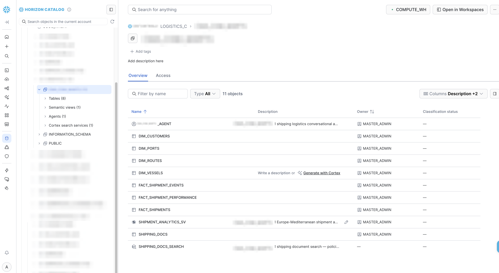

**Structured Data (Dimension + Fact Tables):**

| Table | Description |
|-------|-------------|
| `DIM_CUSTOMERS` | Customer master — name, industry, country, contract tier (Gold/Silver/Bronze/Standard) |
| `DIM_VESSELS` | Fleet data — vessel name, type, capacity in TEU |
| `DIM_PORTS` | Port reference — name, country, region, terminal |
| `DIM_ROUTES` | Shipping routes — origin/destination ports, trade lane, standard transit days |
| `FACT_SHIPMENTS` | Core shipment fact — booking, departure, arrival, freight charge, container details |
| `FACT_SHIPMENT_EVENTS` | Tracking events — departure, arrival, transshipment, customs |
| `FACT_SHIPMENT_PERFORMANCE` | Performance metrics — planned vs actual transit, delay days, on-time flag |

**Unstructured Data:**

| Table | Description |
|-------|-------------|
| `SHIPPING_DOCS` | Policies, bulletins, SOPs — demurrage rules, customs procedures, port advisories, hazmat handling |

### Cortex Objects

| Object | Type | Purpose |
|--------|------|--------|
| `SHIPMENT_ANALYTICS_SV` | Semantic View | Maps natural language to SQL across all 7 tables above |
| `SHIPPING_DOCS_SEARCH` | Cortex Search Service | Full-text semantic search over shipping documents |
| `SHIPPING_LOGISTICS_AGENT` | Cortex Agent | Hybrid reasoning — routes questions to Analyst or Search (or both) |
| `SHIPPING_MCP_SERVER` | MCP Server (SQL only) | Exposes all three tools above to external MCP clients |

> **Note:** MCP Servers are not visible in the Snowsight UI at this time. Use `SHOW MCP SERVERS` or `DESCRIBE MCP SERVER` via SQL to inspect them.

This structure enables three types of questions:
- **Structured** — "Top 5 customers by revenue" → Analyst queries the fact/dim tables via the Semantic View
- **Unstructured** — "What is the demurrage policy?" → Search retrieves from SHIPPING_DOCS
- **Hybrid** — "My shipment is delayed, what are my options?" → Agent combines both

<!-- ------------------------ -->
## Get MCP Connection Details

To connect UiPath Orchestrator to your Snowflake MCP Server, you need two things: the server's endpoint URL and your PAT token.

### Construct the Endpoint URL

The MCP Server endpoint URL follows this pattern:

```
https://<account_identifier>.snowflakecomputing.com/api/v2/databases/<DATABASE>/schemas/<SCHEMA>/mcp-servers/<MCP_SERVER_NAME>
```

For this quickstart:

```
https://<account_identifier>.snowflakecomputing.com/api/v2/databases/LOGISTICS_C/schemas/SHIPPING_MARTS/mcp-servers/SHIPPING_MCP_SERVER
```

Replace `<account_identifier>` with your Snowflake account identifier (e.g., `myorg-myaccount`).

> **Important:** If your account URL contains underscores (`_`), replace them with hyphens (`-`) in the hostname. MCP servers have connection issues with underscores in hostnames ([see docs](https://docs.snowflake.com/en/user-guide/snowflake-cortex/cortex-agents-mcp#mcp-server-security-recommendations)). For example, use `myorg-my-account.snowflakecomputing.com` instead of `myorg-my_account.snowflakecomputing.com`. This applies only to the hostname — database, schema, and server names in the path retain their original underscores.

> **Tip:** Your account identifier is the portion of your Snowsight URL before `.snowflakecomputing.com`.

### Verify the MCP Server Spec

Run `DESCRIBE MCP SERVER` to confirm the server exists and see its configured tools:

```sql
DESCRIBE MCP SERVER LOGISTICS_C.SHIPPING_MARTS.SHIPPING_MCP_SERVER;
```

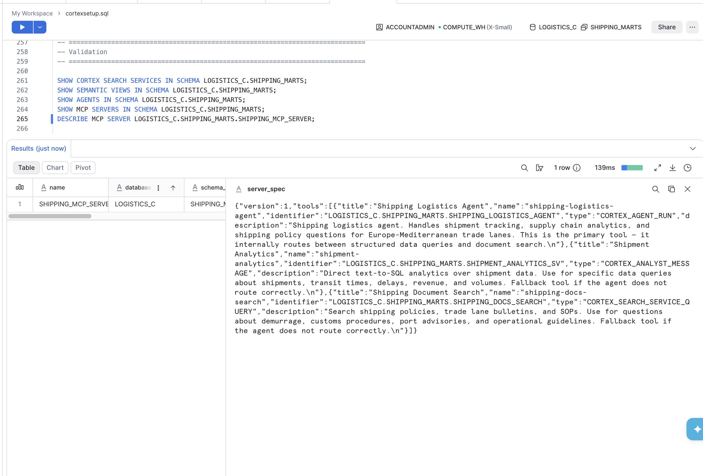

The output shows the `server_spec` JSON with all tool definitions. You should see 3 tools listed:
- `shipping-logistics-agent` (CORTEX_AGENT_RUN)
- `shipment-analytics` (CORTEX_ANALYST_MESSAGE)
- `shipping-docs-search` (CORTEX_SEARCH_SERVICE_QUERY)

### Authentication Headers

When calling the MCP endpoint, you need two headers:

| Header | Value |
|--------|-------|
| `Authorization` | `Bearer <YOUR_PAT_TOKEN>` |
| `X-Snowflake-Authorization-Token-Type` | `PROGRAMMATIC_ACCESS_TOKEN` |

Keep both the endpoint URL and your PAT handy — you will use them in the UiPath Orchestrator configuration.

<!-- ------------------------ -->
## Verify Network Connectivity

This step is critical but often invisible — if network connectivity is not properly configured, the UiPath MCP connection will fail silently or return timeout errors.

Snowflake MCP Server endpoints are accessed over HTTPS. Whether UiPath Orchestrator can reach your endpoint depends on your Snowflake account's **network policy** configuration.

### Case 1: No Network Policy Exists

If your Snowflake account does **not** have a network policy applied, the MCP Server endpoint is reachable from any external IP address by default. In this case, UiPath Orchestrator will be able to connect without additional configuration.

You can check whether a network policy is active on your account:

```sql
SHOW NETWORK POLICIES;
```

If the result is empty or the value is blank, no network policy is restricting access — you can proceed to the next step.

### Case 2: A Network Policy Exists

If your account has an active network policy, it restricts which IP addresses can connect to Snowflake. Since UiPath Orchestrator will be making inbound HTTPS requests to your MCP Server endpoint, their IP ranges must be explicitly allowed.

**What happens if this is not configured:**
- The UiPath MCP connection will appear to save successfully but fail when invoked
- You may see timeout errors or "connection refused" messages
- Tools will appear available but return no results

**How to fix it:**

Use the provided network setup script to create a network rule with UiPath's egress IPs and apply it to your policy:
- **[setup_network.sql](https://github.com/sfc-gh-abhatt/sfquickstarts_abhatt/blob/f45da1db613a84420d58a3d860c31e66a7694cb8/site/sfguides/src/power-your-uipath-agentic-workflows-with-snowflake-mcp/assets/setup_network.sql)** — Creates a network rule and policy for UiPath access

> **Important:** The script includes UiPath Orchestrator outbound IPs for the **US region**. If your UiPath Automation Cloud is in a different region (EU, Japan, Australia, etc.), replace the IPs with the correct values from the [UiPath Orchestrator Outbound IP Addresses documentation](https://docs.uipath.com/orchestrator/automation-cloud/latest/user-guide/orchestrator-outbound-ip-addresses).

The script handles both scenarios:
- **No existing policy** — Creates a new network policy with the UiPath rule
- **Existing policy** — Shows how to add the UiPath rule to your current policy

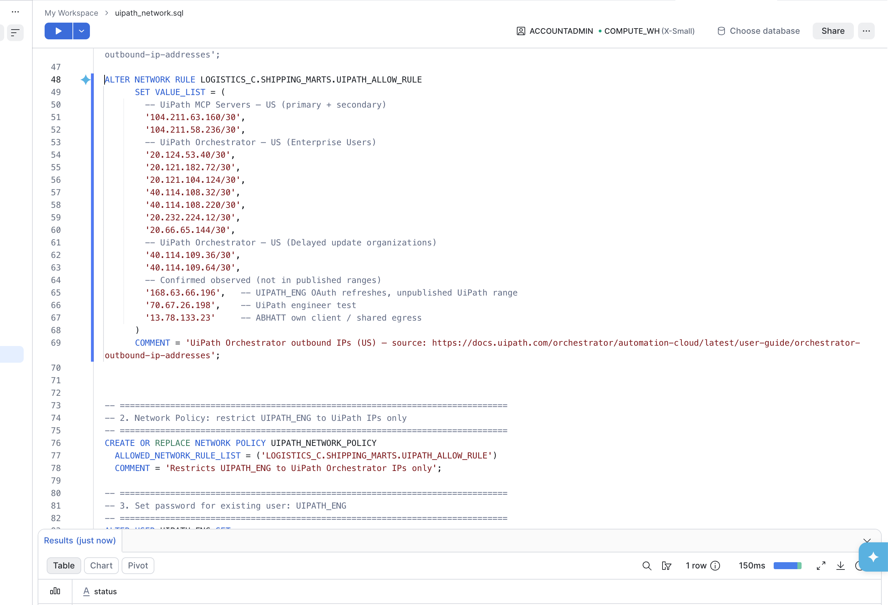

You can verify the policy is applied:

```sql
SHOW NETWORK POLICIES;
DESCRIBE NETWORK RULE LOGISTICS_C.SHIPPING_MARTS.UIPATH_ALLOW_RULE;
```

### Quick Connectivity Test

After verifying network settings, confirm the MCP endpoint is reachable by calling it directly before configuring UiPath.

**Option A: Using the test script (curl)**

Download and run the provided test script:
- **[test-mcp-connectivity.sh](https://github.com/sfc-gh-abhatt/sfquickstarts_abhatt/blob/f45da1db613a84420d58a3d860c31e66a7694cb8/site/sfguides/src/power-your-uipath-agentic-workflows-with-snowflake-mcp/assets/test-mcp-connectivity.sh)**

```bash
chmod +x test-mcp-connectivity.sh
./test-mcp-connectivity.sh "<MCP_ENDPOINT_URL>" "<PAT_TOKEN>"
```

The script will:
1. Call `tools/list` to verify the endpoint responds and list available tools
2. Invoke the agent tool with a sample question to confirm end-to-end connectivity

A successful run shows HTTP 200 and the names of your 3 tools (agent, analyst, search).

**Option B: Using Postman**

You can also test connectivity using Postman:

1. Create a new **POST** request to your MCP Server endpoint URL
2. Under **Headers**, add:
   - `Content-Type`: `application/json`
   - `Accept`: `application/json`
   - `Authorization`: `Bearer <YOUR_PAT_TOKEN>`
   - `X-Snowflake-Authorization-Token-Type`: `PROGRAMMATIC_ACCESS_TOKEN`
3. Under **Body** (raw JSON), enter:
```json
{"jsonrpc":"2.0","id":1,"method":"tools/list"}
```
4. Click **Send** — you should receive a 200 response with the list of tools

> **Tip:** If either test fails with a timeout or connection error, revisit Case 2 above to check your network policy. If you get HTTP 401/403, verify your PAT is valid and the role has access to the MCP Server.

<!-- ------------------------ -->
## Configure MCP Server in UiPath Orchestrator

Now that you have your Snowflake MCP Server endpoint and have verified network access, head over to UiPath Orchestrator to register the MCP Server.

### Step 1: Open Orchestrator

Log in to your UiPath Automation Cloud and open **Orchestrator**.

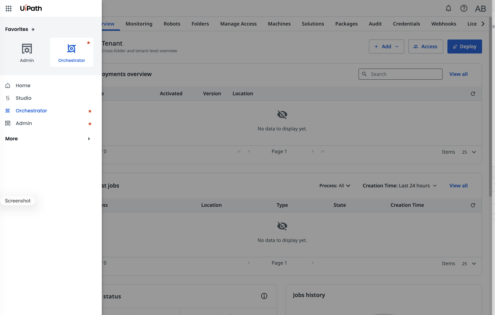

### Step 2: Navigate to MCP Servers

From the left navigation menu, select **MCP Servers**.

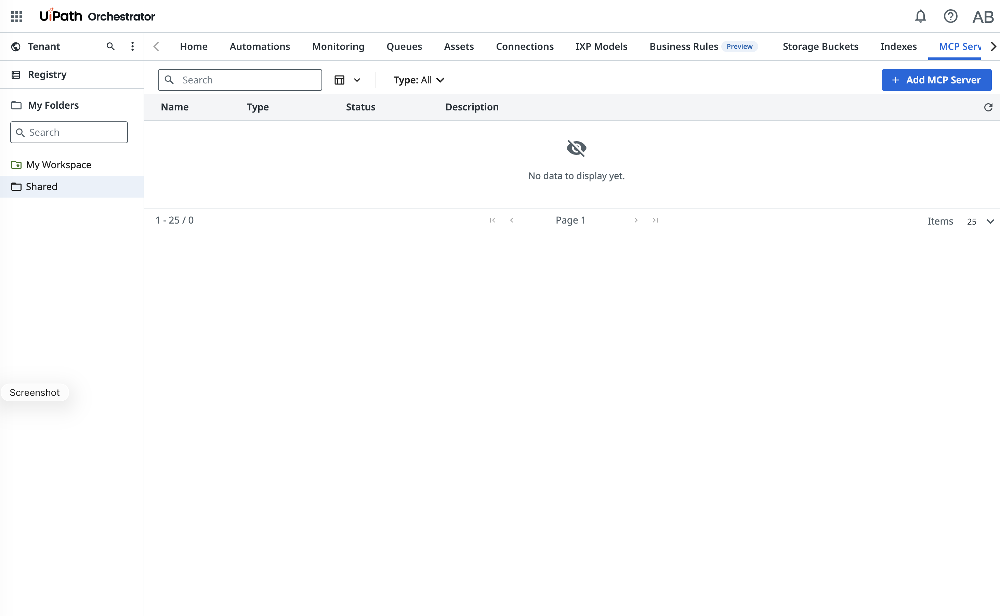

### Step 3: Add a Remote MCP Server and Enter Connection Details

Click **Add MCP Server**, choose **Remote MCP** as the server type, and fill in the connection details:

| Field | Value |
|-------|-------|
| **Name** | Snowflake MCP Server (or a descriptive name of your choice) |
| **URL** | The MCP endpoint URL from the previous step |
| **Authentication** | Bearer Token |
| **Token** | Your Snowflake PAT |

You will also need to include the custom header for Snowflake PAT authentication:

| Header | Value |
|--------|-------|
| `X-Snowflake-Authorization-Token-Type` | `PROGRAMMATIC_ACCESS_TOKEN` |

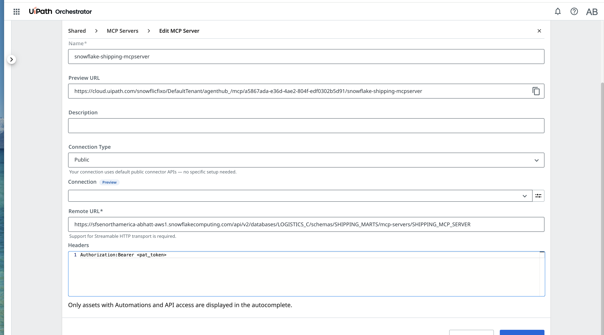

### Step 4: Connect and Verify Tools

Click **Connect** (or Save). UiPath Orchestrator will reach out to the Snowflake MCP endpoint and discover the available tools. Once connected, you should see the tools refresh and list all 3 tools exposed by your MCP Server:

- **Shipping Logistics Agent** — hybrid tool that combines structured and unstructured reasoning
- **Shipment Analytics** — query structured data via Semantic Views
- **Shipping Document Search** — retrieve information from unstructured documents

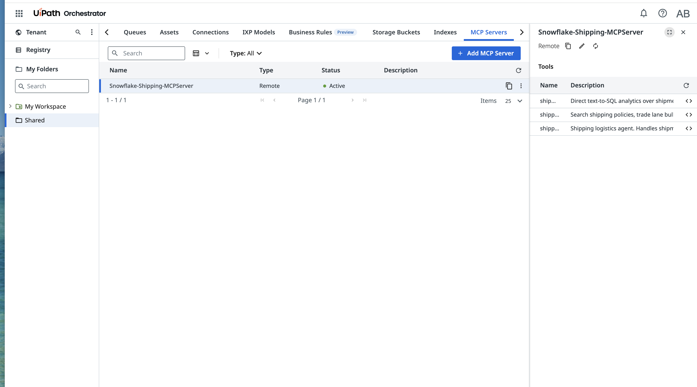

> **Troubleshooting:** If the connection fails or tools don't appear:
> - Verify the endpoint URL is correct (check for underscore/hyphen issues in the hostname)
> - Confirm your PAT is valid and not expired
> - Check that UiPath's outbound IPs are allowed by your Snowflake network policy
> - Ensure the `X-Snowflake-Authorization-Token-Type` header is set correctly (Optional)

<!-- ------------------------ -->
## Build a Conversation Agent in UiPath Studio

With the MCP Server registered in Orchestrator, you can now build a Conversation Agent in UiPath Studio that uses the Snowflake MCP tools to answer questions about your data.

### Step 1: Create a New Conversation Agent

Open **UiPath Studio** and create a new project. Select **Conversation Agent** as the project type.

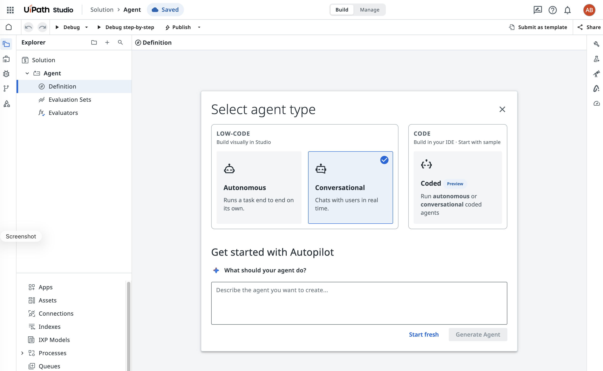

### Step 2: Attach MCP Tools

In the agent configuration, attach the MCP tools from Orchestrator. You should see the Snowflake MCP Server you registered in the previous step. Select the tools you want the agent to have access to:

- **Shipping Logistics Agent** — for hybrid queries
- **Shipment Analytics** — for structured data queries
- **Shipping Document Search** — for unstructured document retrieval

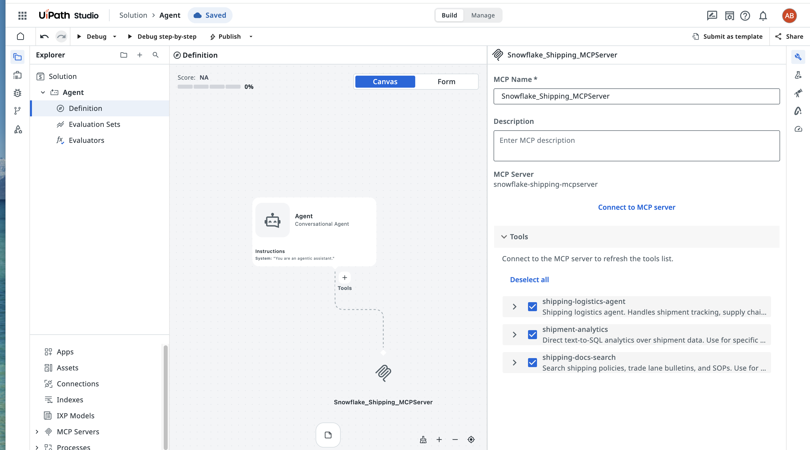

### Step 3: Configure Agent Instructions

Provide the agent with instructions (system prompt) that guide it on how to use the tools effectively. For example:

```
You are a shipping logistics assistant with access to Snowflake data tools.

Use the available tools to answer user questions:
- For questions about shipment metrics, revenue, transit times, or customer data, use the Shipment Analytics tool.
- For questions about policies, procedures, regulations, or documentation, use the Shipping Document Search tool.
- For complex questions that span both structured data and documents, or when unsure which tool to use, use the Shipping Logistics Agent tool.

Always provide clear, concise answers grounded in the data returned by the tools. If a tool returns no results, let the user know and suggest rephrasing their question.
```

### Step 4: Select the LLM

Configure the agent's underlying language model. UiPath Studio uses `anthropic.claude-sonnet-4-6` by default for Conversation Agents. This model interprets user messages, decides which tools to call, and synthesizes responses.

### Step 5: Debug and Publish

1. **Debug** — Use the Debug mode in UiPath Studio to test the agent locally. Send sample questions and verify that the agent correctly invokes the Snowflake MCP tools and returns meaningful answers.

2. **Publish** — Once satisfied with the agent's behavior, publish it to UiPath Orchestrator so it can be accessed by users or integrated into larger automation workflows.

<!-- ------------------------ -->
## Power Your Workflows

Now for the exciting part — test your published Conversation Agent by asking natural language questions grounded in your Snowflake data.

### Start a Conversation

Open the published agent (via UiPath Assistant, Orchestrator, or Studio's test interface) and begin asking questions.

### Structured Data Queries (Cortex Analyst)

These questions are answered by translating natural language into SQL against your Semantic View:

**Example:** *"Show me the top 5 customers by freight revenue"*

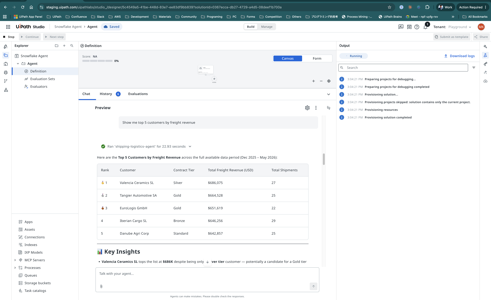

**Example:** *"What is the average transit time from Rotterdam to Piraeus?"*

### Unstructured Data Retrieval (Cortex Search)

These questions search across documents, policies, and advisories:

**Example:** *"What is the demurrage policy for reefer containers in Marseille?"*

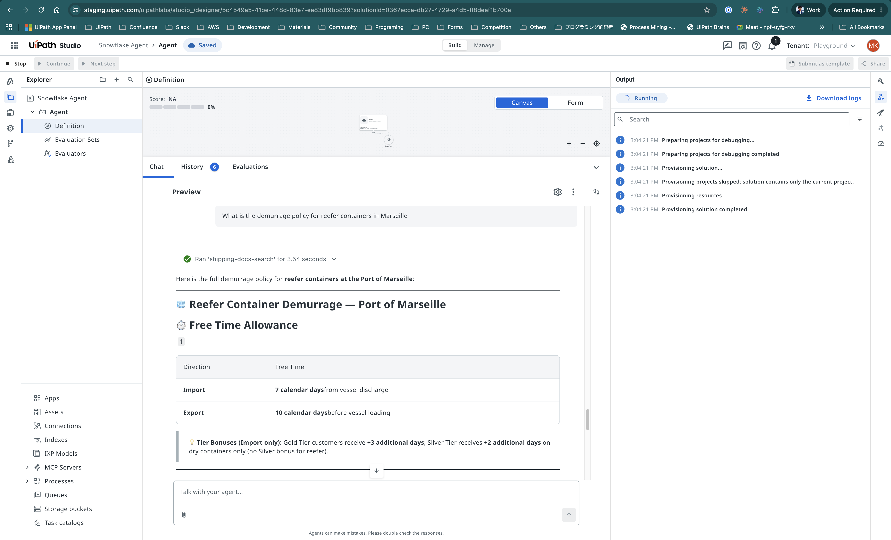

**Example:** *"What are the customs requirements for importing to Turkey?"*

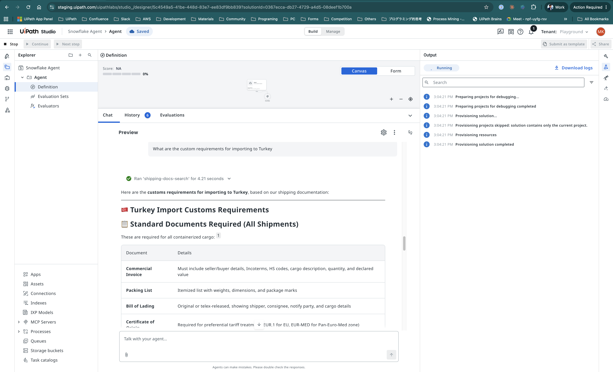

### Hybrid Queries (Cortex Agent)

These questions require reasoning across both structured records and unstructured documents:

**Example:** *"My shipment SH-00088 is delayed. What are my options?"*

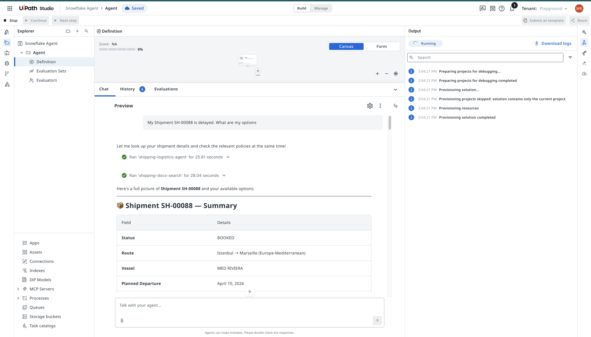

**Example:** *"What's the SLA for Gold tier customers and how is our on-time rate?"*

> **Note:** The Agent tool automatically decides which combination of Analyst and Search to use based on the question.

<!-- ------------------------ -->
## Monitor Access in Snowflake

After running queries through UiPath, you can monitor the activity back in Snowflake.

### View Query History

Navigate to **Activity → Query History** in Snowsight. Filter by the user associated with your PAT to see queries executed via the MCP Server.

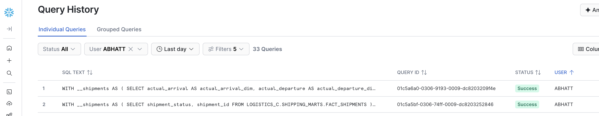

You will see SQL statements generated by **Cortex Analyst** — these are the text-to-SQL queries that ran against your tables.

> **Note:** Only Analyst-generated SQL appears in query history. Cortex Search (vector retrieval) and Cortex Agent orchestration calls do not produce SQL queries and are not visible here.

This gives you visibility into:
- What SQL was generated and executed by Analyst
- Which tables and views were accessed
- Query performance and resource consumption

> **Tip:** Use this to audit external access patterns and ensure the integration is working as expected.

<!-- ------------------------ -->
## Conclusion And Resources

Congratulations! You have successfully connected UiPath to your Snowflake data through MCP. You can now build agentic workflows that ask natural language questions across structured databases, unstructured documents, and hybrid scenarios — all without writing SQL.

### What You Learned
- How to retrieve Snowflake MCP Server connection details using `DESCRIBE MCP SERVER`
- How to verify and configure network connectivity for UiPath Orchestrator
- How to register a Remote MCP Server in UiPath Orchestrator
- How to build a Conversation Agent in UiPath Studio with MCP tools
- How to test the agent with structured, unstructured, and hybrid queries
- How to monitor MCP access via Snowflake query history

### Cleanup

When you are done with this quickstart, run the teardown script to remove all Snowflake objects created during the demo:
- **[teardown.sql](https://github.com/sfc-gh-abhatt/sfquickstarts_abhatt/blob/f45da1db613a84420d58a3d860c31e66a7694cb8/site/sfguides/src/power-your-uipath-agentic-workflows-with-snowflake-mcp/assets/teardown.sql)** — Drops the MCP Server, Agent, Semantic View, Search Service, tables, stage, and file format

### Related Resources
- [Getting Started with Snowflake MCP Server](https://www.snowflake.com/en/developers/guides/getting-started-with-snowflake-mcp-server/)
- [Best Practices to Building Cortex Agents](https://www.snowflake.com/en/developers/guides/best-practices-to-building-cortex-agents/)
- [Snowflake MCP Server Documentation](https://docs.snowflake.com/en/user-guide/snowflake-cortex/cortex-agents-mcp)
- [Network Policies](https://docs.snowflake.com/en/user-guide/network-policies)
- [Snowflake Cortex Analyst](https://docs.snowflake.com/en/user-guide/snowflake-cortex/cortex-analyst)
- [Snowflake Cortex Search](https://docs.snowflake.com/en/user-guide/snowflake-cortex/cortex-search/cortex-search-overview)
- [UiPath Automation Cloud Documentation](https://docs.uipath.com/automation-cloud/automation-cloud/latest)
- [UiPath Orchestrator - MCP Servers](https://docs.uipath.com/orchestrator/automation-cloud/latest)
- [UiPath Orchestrator Outbound IP Addresses](https://docs.uipath.com/orchestrator/automation-cloud/latest/user-guide/orchestrator-outbound-ip-addresses)
- [Model Context Protocol Specification](https://modelcontextprotocol.io/)

### Sample Data Files
- [fact_shipments.csv](https://github.com/sfc-gh-abhatt/sfquickstarts_abhatt/blob/f45da1db613a84420d58a3d860c31e66a7694cb8/site/sfguides/src/power-your-uipath-agentic-workflows-with-snowflake-mcp/assets/fact_shipments.csv) — 1000 shipment records
- [fact_performance.csv](https://github.com/sfc-gh-abhatt/sfquickstarts_abhatt/blob/f45da1db613a84420d58a3d860c31e66a7694cb8/site/sfguides/src/power-your-uipath-agentic-workflows-with-snowflake-mcp/assets/fact_performance.csv) — 1000 performance records
- [fact_events.csv](https://github.com/sfc-gh-abhatt/sfquickstarts_abhatt/blob/f45da1db613a84420d58a3d860c31e66a7694cb8/site/sfguides/src/power-your-uipath-agentic-workflows-with-snowflake-mcp/assets/fact_events.csv) — 2426 shipment events
- [shipping_docs.csv](https://github.com/sfc-gh-abhatt/sfquickstarts_abhatt/blob/f45da1db613a84420d58a3d860c31e66a7694cb8/site/sfguides/src/power-your-uipath-agentic-workflows-with-snowflake-mcp/assets/shipping_docs.csv) — 42 policy and bulletin documents
