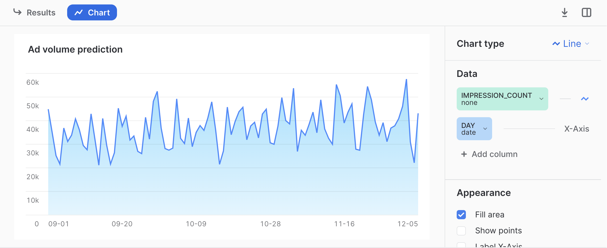
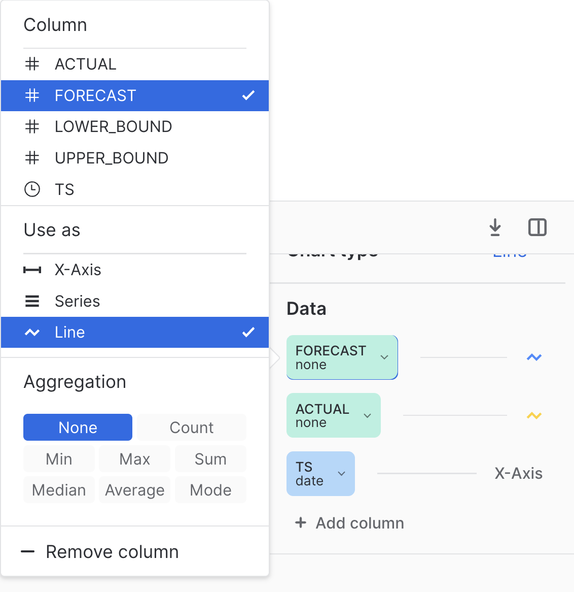
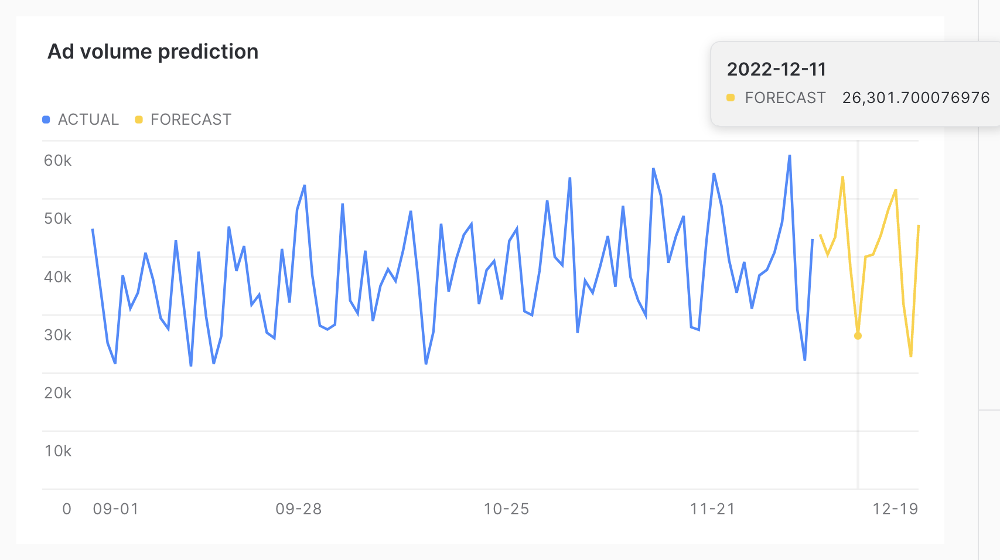

author: Jim Warner
id: predict_ad_impressions_with_ml_powered_analysis
summary: Shows how advertisers can predict ad impressions using ML-powered analysis in Snowflake
categories: data-science-&-ml,solution-examples
environments: web
status: Published
feedback link: https://github.com/Snowflake-Labs/sfguides/issues
tags: Getting Started, AdTech, Machine Learning

# Predict Ad Impressions with ML-Powered Analysis
<!-- ------------------------ -->
## Overview 
Duration: 1

The pacing of ad campaigns can be unpredictable. Consider an advertiser with a cross-channel campaign.  Some channels may not be able to fulfill the level of inventory desired, leading to advertisers needing to increase spending on other channels to make up the gap.  On the sell side, a media publisher might want to show how a campaign is likely to pace over the remaining period of the campaign.

This unpredictability can also lead to problems being going unnoticed.  When making an optimization, a media buyer could make a mistake when setting campaign parameters.  They could add one more zero, or one too few, when typing target impressions or spend and buy a very different number than intended.

Fortunately, for those advertisers or ad platforms who are bringing their data into Snowflake, Snowflake's [ML-Powered Analysis](https://docs.snowflake.com/en/guides-overview-analysis) makes solving these types of problems very easy.  In this Quickstart, we will start with example time series impression data for several months. We will use Snowflake's Forecasting feature to project what the impression volume will be in the two weeks following the training period.  We will also show how data from new incoming days can be checked with Snowflake's Anomaly Detection capability, to see if there might have been an error in delivery.

### Prerequisites
- Access to a Snowflake account or use of the [Snowflake free 30-day trial](https://trial.snowflake.com)
- Basic knowledge of SQL, database concepts, and objects

### What You’ll Learn 
- How to generate example impression data
- How to build models using Snowflake's ML-Powered Analysis capabilities
- How to use Snowsight to visualize the forecast results

### What You’ll Build 
- SQL scripts to build the relevant models
- Visualizations of the results

<!-- ------------------------ -->
## Prepare Your Environment
Duration: 8

If you do not have a Snowflake account, you can register for a [Snowflake free 30-day trial](https://trial.snowflake.com). The cloud provider (AWS, Azure, Google Cloud), and Region (US East, EU, e.g.) do _not_ matter for this lab. However, we suggest you select the region which is physically closest to you.

To easily follow the instructions, resize your browser windows so you can view this Quickstart and your Snowflake environment side-by-side. If possible, even better is to use a secondary display dedicated to the Quickstart.

### Create a Warehouse, Database, Schemas
Create a warehouse, database, and schema that will be used for loading, storing, processing, and querying data for this Quickstart. We will use the UI within the Worksheets tab to run the DDL that creates these objects.

Copy the commands below into your trial environment. To execute a single statement, just position the cursor anywhere within the statement and click the Run button. To execute several statements, they must be highlighted through the final semi-colon prior to clicking the Run button.

```sql
-- setup warehouse, database and schema
USE ROLE ACCOUNTADMIN;
CREATE WAREHOUSE AD_FORECAST_DEMO_WH WITH WAREHOUSE_SIZE='XSmall'  STATEMENT_TIMEOUT_IN_SECONDS=600 STATEMENT_QUEUED_TIMEOUT_IN_SECONDS=15;
USE WAREHOUSE AD_FORECAST_DEMO_WH;
CREATE DATABASE AD_FORECAST_DEMO;
CREATE SCHEMA AD_FORECAST_DEMO.DEMO;
```

### Set up an analyst role
The [Snowflake documentation recommends creating a role](https://docs.snowflake.com/en/user-guide/analysis-forecasting#granting-privileges-to-create-forecast-objects) for people who need to create forecasts.  As such, we run the following SQL to set up a role and grant the necessary privileges.

```sql
-- set up analyst role
CREATE ROLE analyst;
GRANT USAGE ON DATABASE AD_FORECAST_DEMO TO ROLE analyst;
GRANT USAGE ON SCHEMA AD_FORECAST_DEMO.DEMO TO ROLE analyst;
GRANT USAGE ON WAREHOUSE AD_FORECAST_DEMO_WH TO ROLE analyst;
GRANT CREATE TABLE ON SCHEMA AD_FORECAST_DEMO.DEMO TO ROLE analyst;
GRANT CREATE VIEW ON SCHEMA AD_FORECAST_DEMO.DEMO TO ROLE analyst;
GRANT CREATE SNOWFLAKE.ML.FORECAST ON SCHEMA AD_FORECAST_DEMO.DEMO TO ROLE analyst;
GRANT CREATE SNOWFLAKE.ML.ANOMALY_DETECTION ON SCHEMA AD_FORECAST_DEMO.DEMO TO ROLE analyst;
GRANT ROLE analyst TO USER <your_user_here>;
```

### Create the table and generate test data
The table we create for example data will store just a timestamp representing the day, and a number of impressions.  In a real-world situation, we would likely get raw logs from a DSP (such as [The Trade Desk REDS](https://app.snowflake.com/marketplace/listing/GZSNZ4ARCR/the-trade-desk-raw-event-data-stream-reds)) or ad server. Then, the data would be aggregated into hourly or daily buckets.  Then, the aggregated data would be fed to the model for forecasting.

For this demo, however, we will directly generate aggregated data. This makes it easier to generate data that is interesting from a forecasting perspective. Data that is purely random would not make for an interesting forecast, as the forecast would just be the mean of the distribution.  We start by making a table to hold the data.

```sql
-- create table to hold the generated data
create table daily_impressions(day timestamp, impression_count integer);
```

Next, we fill the table with just over three months of data, with impression counts that are random.

```sql
-- generate random data to fill the table
insert into daily_impressions
 select dateadd(day, seq2(1), ('2022-09-01'::timestamp)) as day,
 abs(round(normal(35000, 7000, random(4)))) as impression_count
 from table(generator(rowcount=>96));
```

Here the data is completely random, so as mentioned, it does not make for an interesting forecast.  So next, we will massage the data to add two effects.  One, we will add a slightly upward trend, so that on average more impressions are delivered later in the campaign than were delivered earlier in the campaign.  Second, we add a day of week effect, so that weekends have lower numbers of impressions delivered than weekdays.

```sql
-- change data to give a slight upward trend and a day of week effect
update daily_impressions
set impression_count=((CASE WHEN dayname(day) IN ('Sat', 'Sun') THEN 0.7
                            WHEN dayname(day)='Fri' THEN 0.9
                            ELSE 1
                        END)*
                     (impression_count+(DATEDIFF(day, '2022-09-01'::timestamp, 
                      day)*120)));
```

### Verify the data

We can run the following statement to verify our data.

```sql
-- verify data
select * from daily_impressions;
```

It is easiest to visual the data by clicking _Chart_.  You should see a graph like the following.



## Create and visualize a forecast
Duration: 4

Now we have data that could represent the number of impressions delivered over the first several months of a campaign. An analyst might want to understand how many impressions are likely to be delivered if no changes are made to the campaign.  To do this, we will show how to forecast the number of impressions over the next two weeks, and show how the analyst can visualize the forecast.

### Create the model
The first step is to write a query that calculates the cumulative impressions served by day.

```sql
-- create the forecast
CREATE OR REPLACE SNOWFLAKE.ML.FORECAST impressions_forecast(INPUT_DATA =>
    SYSTEM$REFERENCE('TABLE', 'daily_impressions'),
                    TIMESTAMP_COLNAME => 'day',
                    TARGET_COLNAME => 'impression_count'
    );
```

Here we are building the machine learning model that will be used to forecast future impressions.  It should take less than about 20 seconds to build the model.  You will see a message that says `Instance IMPRESSIONS_FORECAST successfully created.` when the model training is complete.

### Make a forecast
Next, we use the model to forecast the 14 days following the timeframe covered by the test data.

```sql
-- get the forecast values
CALL impressions_forecast!FORECAST(FORECASTING_PERIODS => 14);
```

The output will contain the timestamp for the next 14 days, the forecast, and an upper and lower bound of the prediction interval.  Note that this interval is configurable using the `prediction_interval` configuration.

### Visualize the results

It can be easier to visualize these results by viewing them alongside the actual data.  You can do that as follows.

```sql
-- select actual data and forecast
SELECT day AS ts, impression_count AS actual, NULL AS forecast, NULL AS lower_bound, NULL AS upper_bound
  FROM daily_impressions
UNION ALL
SELECT ts, NULL AS actual, forecast, lower_bound, upper_bound
  FROM TABLE(RESULT_SCAN(-1));
```

Here we use `UNION ALL` to combine the results of the forecast with the actual data on which the model was trained.  To visualize, we can click on _Chart_ then click _Add column_ so that both _Forecast_ and _Actual_ are added to the chart. For both, under _Aggregation_ select _None_ as follows.



Once that is configured, you should see the results as follows.



As you can see, the forecast was able to successfully capture the day of week effect, as the dips in the chart correspond to weekends.

## Anomaly detection
Duration: 4

Many ad campaigns are still manually set up, with people typing impression volumes or budgets into ad platforms. With that comes the possibility of human error. The same data used to train the forecasting model can be used to train an anomaly detection model. This model could be used when data for a new time period comes into the system to detect if the new time period is an outlier. If it is an outlier, that could trigger an alert, where analysts could check to make sure that the change was intentional. This would enable those running the campaign to detect possible human error as soon as possible.

### Build the model

To build the anomaly detection model, we run the following SQL.

```sql
-- build model to detect anomalies
CREATE OR REPLACE SNOWFLAKE.ML.ANOMALY_DETECTION impression_anomaly_detector(
  INPUT_DATA => SYSTEM$REFERENCE('TABLE', 'daily_impressions'),
  TIMESTAMP_COLNAME => 'day',
  TARGET_COLNAME => 'impression_count',
  LABEL_COLNAME => '');
```

This model takes approximately 20 seconds to train.  You will see `Instance IMPRESSION_ANOMALY_DETECTOR successfully created.` when the model is trained.

### Run the model on data

We can test how the model would react to new time periods with different quantities of impressions as follows. We will start with a test of a low value of impressions.

```sql
-- see if a potential new day would be an outlier
  CALL impression_anomaly_detector!DETECT_ANOMALIES(
  INPUT_DATA => SYSTEM$QUERY_REFERENCE('select \'2022-12-06\'::timestamp as day, 12000 as impressions'),
  TIMESTAMP_COLNAME =>'day',
  TARGET_COLNAME => 'impressions');
```

Here we see that this is an outlier, with a percentile of `0.0009950594591`.  Next, we try a high number of impressions.

```sql
-- check a way too high row
CALL impression_anomaly_detector!DETECT_ANOMALIES(
  INPUT_DATA => SYSTEM$QUERY_REFERENCE('select \'2022-12-06\'::timestamp as day, 120000 as impressions'),
  TIMESTAMP_COLNAME =>'day',
  TARGET_COLNAME => 'impressions');
```

Here again, this is an outlier. Note that the `prediction_interval` configuration can be used to control the percentile of possible values that would be considered an outlier.

Finally, we can try a more reasonable value.

```sql
-- try a reasonable value
CALL impression_anomaly_detector!DETECT_ANOMALIES(
  INPUT_DATA => SYSTEM$QUERY_REFERENCE('select \'2022-12-06\'::timestamp as day, 60000 as impressions'),
  TIMESTAMP_COLNAME =>'day',
  TARGET_COLNAME => 'impressions');
```

This value is still fairly high, well above the forecast of almost 44,000.  However, because it is below the upper bound, this does not qualify as an outlier.

<!-- ------------------------ -->
## Conclusion
Duration: 2

Congratulations, you have completed this Quickstart for a quick overview of using ML-Powered Analysis to make predictions about ad impression data in Snowflake.

### What We've Covered
- How to create test impression data.
- How to build a model to forecast future values.
- How to build a model to detect anomalies in incoming data.

### Related Resources
- [Snowflake Documentation: ML-Powered Analysis](https://docs.snowflake.com/en/guides-overview-analysis)
