summary: End-to-end Predictive Maintenance Solution with Snowflake
id: predictive-maintenance-with-snowflake-cortex
categories: snowflake-site:taxonomy/product/ai, snowflake-site:taxonomy/industry/manufacturing, snowflake-site:taxonomy/snowflake-feature/snowflake-intelligence, snowflake-site:taxonomy/solution-center/certification/certified-solution
language: en
environments: web
status: Published
author: Tripp Smith, Charlie Hammond
feedback link: https://github.com/Snowflake-Labs/sfguides/issues
fork repo link: https://github.com/Snowflake-Labs/-getting-started-with-predictive-maintenance/tree/main

# AI-Powered Predictive Maintenance on Snowflake

## Overview

Manufacturing leaders, from plant strategists to reliability analysts, are finding that expensive predictive maintenance initiatives often fail to deliver ROI because they lack operational context. When financial risk data, OEE metrics, and real-time sensor telemetry exist in silos, teams are forced into a cycle of reactive "firefighting" rather than proactive optimization. This operational blindness leads to high rates of false positives, wasted maintenance budgets, and an inability to accurately predict the remaining useful life of critical assets.

The Snowflake predictive maintenance solution addresses this by moving beyond simple prediction-first models to build a robust, enterprise-grade data foundation using Snowflake's Medallion Architecture along with powerful AI. By centralizing data from assets across multiple facilities, organizations can unify real-time monitoring with financial analysis. This intelligence is delivered through a deployed Streamlit application, serving as a real-time command center for fleet operations, alert triage, and executive insights. Furthermore, by leveraging Snowflake Intelligence, teams can interact with a custom AI agent to uncover root causes and predict failures through natural language, transforming maintenance from a cost center into a strategic advantage that maximizes uptime.

### Predictive Maintenance Challenge

Traditionally, predictive maintenance utilizes condition-monitoring tools to predict asset failure before it occurs, aiming to balance maintenance costs with uptime.

* **The "Prediction-First" Pitfall:** The industry-wide "Billion-Dollar Misconception" is the rush to implement complex algorithms (prediction) before establishing a stable data foundation (perception). Implementing models in a **data vacuum** often leads to high rates of "false positives."
* **The False Positive Trap:** An algorithm may achieve 85% accuracy, but a 10% false-positive rate can trigger thousands of unnecessary service events, consuming expensive parts and labor.
* **Erosion of Trust:** These inaccuracies create "alert fatigue," causing experienced engineers to ignore valid warnings and effectively erasing the projected ROI of the program.

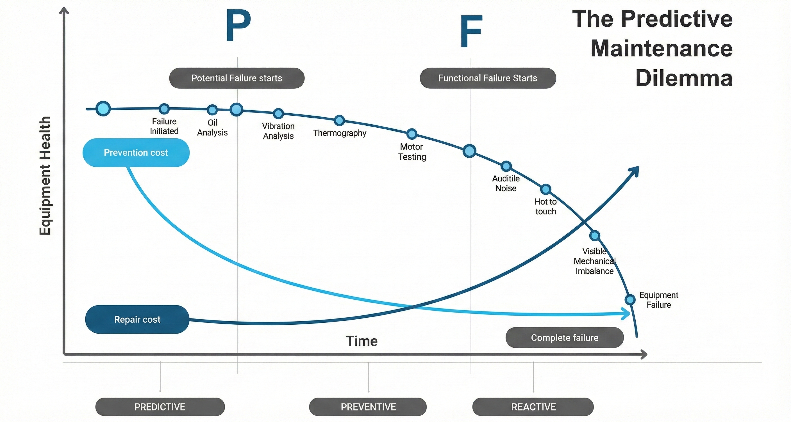

* **The Strategic Shift:** The solution is to move away from "black-box" models and follow a **Maintenance Maturity Curve**. This means establishing a stable data foundation first, ensuring that the quality of **"perception"** (data availability and context) is high before attempting complex predictions.

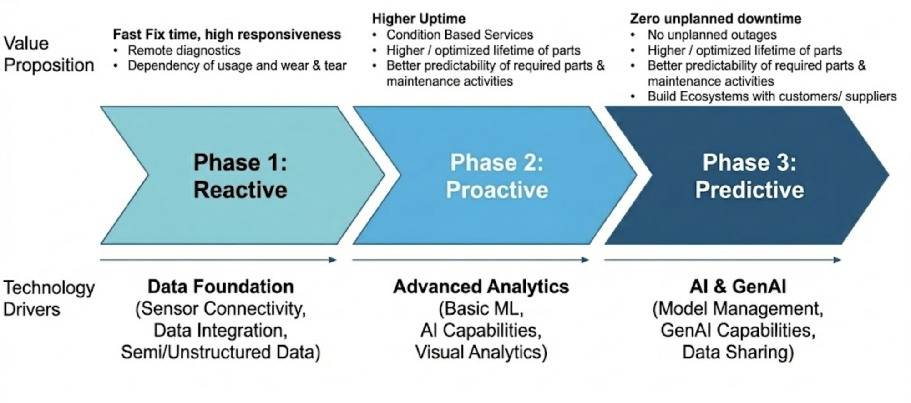

**The Bridge to Trust**: To achieve the required shift from a prediction-first approach to a perception-first approach, organizations must break down the traditional data silos separating sensors, business systems, and human knowledge. The only way to move beyond frustrating false positives is by uniting IT, OT, and AI within a single, contextual data layer.

---

### The Solution: 3-Stage IT/OT/AI Fusion

Effective predictive maintenance requires more than just sensor data; it demands the fusion of **OT data** (real-time sensors), **IT data** (ERP, maintenance logs), and **"Dark Data"** (unstructured manuals). This fusion is the basis of the 3-Stage Framework:

#### Stage 1: Unlocking "Dark Data"
* A major part of the solution is accessing the **"dark data"** trapped in PDF repair manuals, schematics, and logs.
* By using AI (like **Snowflake Cortex**) to search this unstructured data, engineers can instantly cross-reference failure alerts with OEM repair procedures, significantly reducing **Mean Time To Repair (MTTR)**.

#### Stage 2: Contextualizing Alerts
* A sensor alert (e.g., high vibration) is meaningless without **business context**.
* The data fusion allows a system to check if a machine is running a specific material batch (from ERP data) or if maintenance was just performed (from CMMS data). This context differentiates a benign anomaly from a genuine failure, **restoring trust** in the system.

#### Stage 3: Financial Optimization
* The ultimate goal of this fusion is not just prediction but **financial decision-making**.
* By joining failure probabilities with financial data (cost of downtime vs. cost of planned maintenance), the system recommends interventions only when they are **financially advantageous**, transforming maintenance from a cost center into a **profit-optimizing unit**.

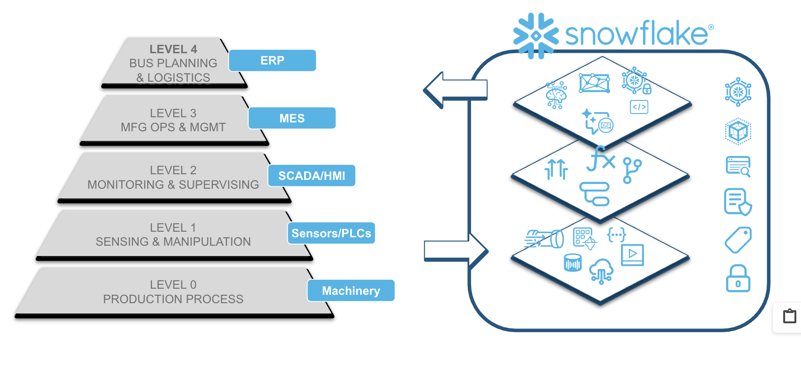

## What the Solution Will Achieve

In this solution, we will move beyond the common industry pitfall of "prediction-first" modeling to build a comprehensive IT/OT/AI Fusion system. By unifying sensor telemetry with business context and AI, we will achieve three specific categories of business value:

1. Financial Optimization: From Cost Center to Profit Driver
We will shift maintenance from a schedule-based expense to a risk-based financial strategy. Instead of simply predicting if a machine will fail, we will determine if it is profitable to intervene.

    * Eliminate "Over-Maintenance": Stop replacing healthy parts based on arbitrary calendar schedules.
    * Reduce the "False Positive Tax": By adding business context (e.g., "Is this machine actually running?"), we reduce false alarms that waste expensive labor hours and erode engineer trust.
    * Optimize Intervention Timing: Calculate the Cost of Unplanned Downtime vs. the Cost of Planned Maintenance to recommend repairs only when they deliver positive ROI.

2. Operational Efficiency: Slashing Mean Time To Repair (MTTR)
We will tackle the "Dark Data" problem—the fact that critical diagnostic history is often buried in unstructured maintenance logs and work order comments—to speed up resolution.

    * Unlock Historical Context: We will implement GenAI to instantly search and summarize years of historical service records. This allows technicians to identify recurring issues and previous successful fixes (e.g., "How did we resolve the vibration issue on Pump A last year?") without manually sifting through thousands of rows of text.
    * Institutionalize Tribal Knowledge: By making free-text technician notes accessible via natural language, we ensure that the expertise of senior engineers is captured and made available to the entire fleet, standardizing repair quality across the organization.

3. Strategic Asset Health: Maximizing OEE
We will improve Overall Equipment Effectiveness (OEE) by treating asset health as a data product rather than a siloed sensor reading.

    * Maximize Availability: Catch genuine failures early (Predictive) while ignoring benign anomalies (Contextual), ensuring assets run at peak capacity for longer.
    * Unified "Single Pane of Glass": We will deploy a command center that fuses IT data (ERP/Work Orders) with OT data (Sensors), giving leadership a trusted, holistic view of fleet health without the need to toggle between disparate systems.

## Why Snowflake

Snowflake delivers a single, unified platform where your data and AI converge. Instead of moving sensitive data to disparate AI tools, Snowflake brings AI directly to your data, ensuring that every model and insight is built on a secure, governed foundation. This approach seamlessly integrates IT business records with high-velocity OT sensor streams, providing the trusted context necessary for enterprise-grade AI. With built-in capabilities like Snowflake Intelligence and Streamlit in Snowflake, users across your business can query asset health and unlock complex insights using natural language. This is all supported by an elastic architecture that scales effortlessly to handle massive IoT volumes.

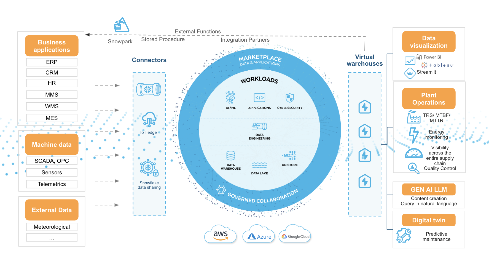

Crucially, Snowflake acts as the definitive bridge between the typically siloed worlds of IT and OT. By ingesting high-volume sensor telemetry (from historians or IoT hubs) alongside transactional business data (from ERPs, CMMS, and supply chain systems), Snowflake creates a comprehensive "Manufacturing Data Cloud." This allows you to effortlessly correlate a vibration spike with a specific production batch, a maintenance schedule, or a spare parts inventory list. This unification eliminates data silos, providing a single source of truth that empowers teams to make decisions based on the complete operational and financial picture of every asset.

## The Data Foundation

This solution unifies high-velocity **IoT sensor telemetry** (vibration, temperature, pressure) with transactional data from **maintenance logs, work orders**, and equipment master specifications. This raw data flows through a medallion architecture in Snowflake, leading to a presentation layer with the Streamlit app and Snowflake Intelligence.

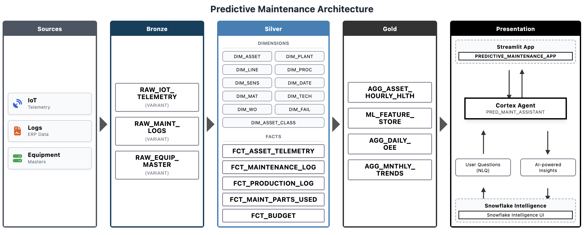

## Solution Overview

### 1. 🏗️ Robust, Scalable Data Foundation (Medallion Architecture)

Built on Snowflake's proven architecture, the solution ensures your data is unified, clean, and ready for analytics.

* **Raw Ingestion (Bronze):** Capture high-velocity IoT sensor telemetry, maintenance logs, and unstructured manuals.
* **Curated Models (Silver):** Cleanse, validate, and connect isolated sensor readings to specific assets, work orders, and facilities.
* **Analytics-Ready (Gold):** Create specialized views specifically tailored for machine learning models and business intelligence dashboards.

### 2. 🖥️ Interactive Command Center (Streamlit)

This application serves as the "Single Pane of Glass" for the entire manufacturing operation, moving users from reactive firefighting to proactive, data-driven strategy.

* **Executive Summary**: The Pulse of the Enterprise
This high-level dashboard bridges the gap between the plant floor and the boardroom. Instead of reporting on abstract "vibration levels," it translates asset health directly into business metrics.

    * Key Value: Immediate visibility into Production at Risk. By quantifying the is current exposure to potential downtime, leadership can prioritize resources based on financial impact rather than just mechanical severity.
    *OEE Integration: It tracks Overall Equipment Effectiveness (OEE) in real-time, allowing executives to correlate asset health trends directly with drops in availability or quality.

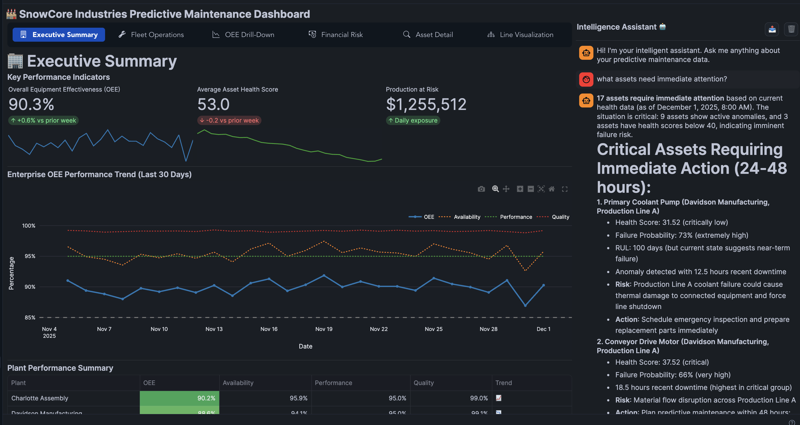

* **Fleet Operations Center**: Proactive Triage & Dispatch
This is the command deck for reliability engineers. It aggregates thousands of sensor signals into a sortable "Risk Triage List."

    * Key Value: Eliminates Alert Fatigue. Instead of flooding engineers with raw alarms, the system calculates a composite Health Score (e.g., 31/100) and predicts the specific Failure Mode (e.g., "Bearing Failure").
    * Actionable RUL: It provides a Remaining Useful Life (RUL) estimation (e.g., "100 Days"), empowering teams to schedule maintenance during planned outages rather than reacting to emergency breakdowns.

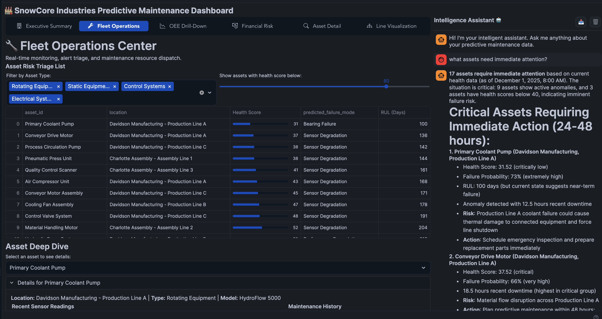

* **OEE Drill-Down**: Root Cause Performance Analysis
When top-level metrics drop, this view allows users to investigate why. It decomposes efficiency into its three core components: Availability, Performance, and Quality.

    * Key Value: Uncovers the "Hidden Factory." It helps distinguish between downtime (Availability issues) and slow cycles (Performance issues). For instance, seeing that "Production Line C" has high availability but lower quality helps target the right fix—adjusting process parameters rather than replacing motors.

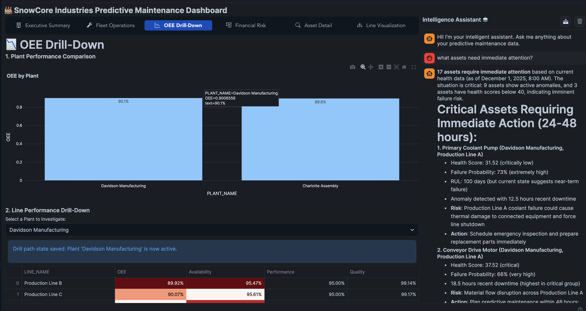

* **Financial Risk Analysis**: Cost-Based Decision Making
This view is the strategic differentiator of the solution. It utilizes a Risk Matrix and Treemap to visualize where financial exposure is concentrated across asset classes (e.g., Rotating Equipment vs. Control Systems).

    * Key Value: Optimizes Capital Allocation. It answers the question, "If I only have budget to fix three things today, which ones save the company the most money?" By focusing on the "Red" zones in the heat map, maintenance leaders ensure their budget is deployed for maximum ROI.

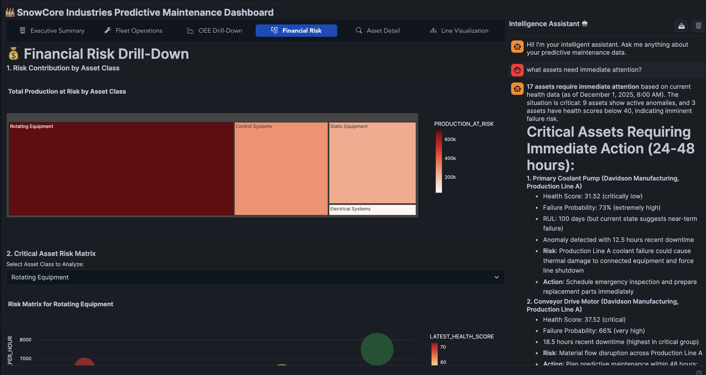

* **Asset Detail View**: The Engineer’s Workbench
This is where the IT/OT Fusion becomes tangible. When an engineer selects a specific asset (e.g., "Assembly Robot Arm"), they see a unified view of real-time telemetry alongside historical context.

    * Key Value: Reduces Mean Time To Resolution (MTTR). By displaying "Recent Sensor Readings" (OT) next to "Maintenance History" (IT) and "OEM Models" (Engineering data), an engineer can instantly verify if a vibration spike correlates with a recent repair or a known model defect, without toggling between SAP and SCADA systems.

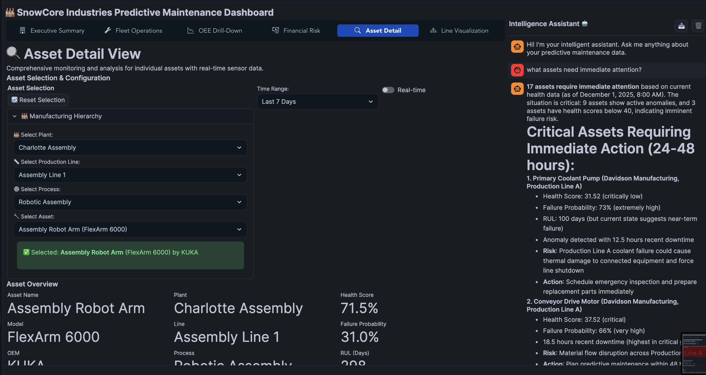

* **Line Visualization**: Digital Twin & Spatial Context
This interactive 3D visualization provides spatial context to the data, mapping health scores directly to the physical layout of the factory floor.

    * Key Value: Improves Situational Awareness. A red indicator on a specific section of the "Assembly Line 1" allows floor supervisors to physically locate and address issues faster. It serves as an intuitive interface for non-technical users to understand the operational status of the line at a glance.

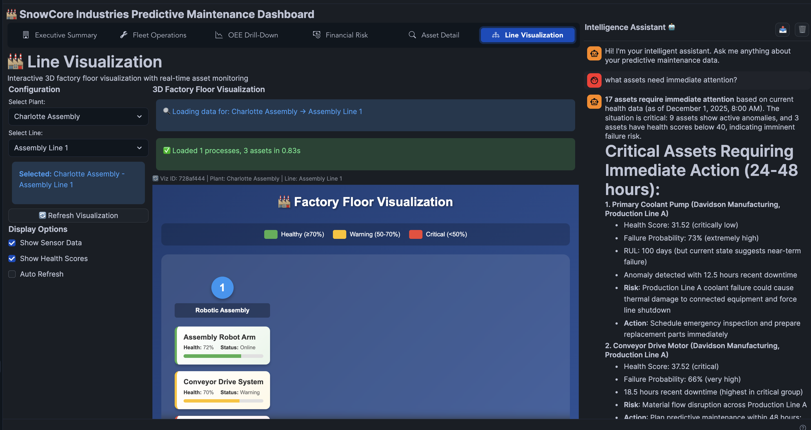

* **Intelligence Assistant**: The Always-On Expert
(Visible in the right-hand sidebar of all screenshots) Available across every page of the application, this embedded AI agent travels with the user, serving as an on-demand subject matter expert. It is powered by Snowflake Intelligence, allowing users to converse with their data using natural language.

    * Key Value: Democratizing Data Access. It bridges the gap between complex database schemas and frontline workers. A technician can ask, "What maintenance procedures do you have access to?" or "Show me the failure history for this pump," without needing to know SQL or navigate complex menus.
    * Unified Context: As seen in the sidebar, the agent has access to a comprehensive semantic view that combines Maintenance Work Order Types (Preventive, Predictive, Emergency), Activity Data (downtime hours, labor costs), and Planning Inputs (Health Scores, RUL). This allows it to answer complex questions that require cross-referencing live sensor data with historical maintenance logs and financial constraints.

### 3. 🗣️ Talk to Your Data with AI (Snowflake Intelligence)

Here is the expanded description for the Snowflake Intelligence section. It adds the high-level definition and connects it directly to the predictive maintenance workflow.

3. 🗣️ Talk to Your Data with AI (Snowflake Intelligence)
Forget complex SQL queries. Use natural language to ask questions that span your structured operational data and unstructured documents. [Snowflake Intelligence](https://www.snowflake.com/en/product/snowflake-intelligence/) acts as a secure orchestration layer that understands your specific business semantics, enabling governed agents to reason across your entire data estate.

* **Maintenance Application**: In this solution, it serves as an "always-on" reliability expert that fuses IT and OT contexts. When an engineer asks a question, the agent autonomously correlates real-time sensor readings (structured data) with historical work orders and OEM PDF manuals (unstructured data) to diagnose issues faster and more accurately.
* **Example Query**: "Show me all past bearing failures on P-500 pumps and the relevant repair procedures from the OEM manual." 
* **Strategic Value**: This effectively democratizes data access, allowing frontline staff to make decisions based on the complete history of an asset without needing to know database schemas or switch between disparate software tools.

## Get Started Today

Head to the linked repo to build in your Snowflake account today!