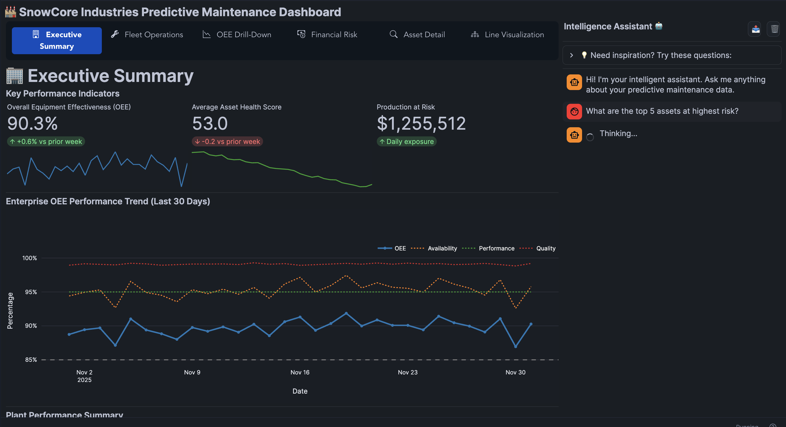

summary: End-to-end Predictive Maintenance Solution with Snowflake
id: predictive-maintenance-with-snowflake-cortex
categories: snowflake-site:taxonomy/product/ai, snowflake-site:taxonomy/industry/manufacturing, snowflake-site:taxonomy/snowflake-feature/snowflake-intelligence, snowflake-site:taxonomy/solution-center/certification/certified-solution
language: en
environments: web
status: Published
author: Tripp Smith, Charlie Hammond
feedback link: https://github.com/Snowflake-Labs/sfguides/issues
fork repo link: https://github.com/Snowflake-Labs/-getting-started-with-predictive-maintenance/tree/main

# AI-Powered Predictive Maintenance on Snowflake

**Transform your manufacturing operations from reactive firefighting to proactive optimization by building a unified data foundation.**

Many predictive maintenance (PdM) programs, intended to reduce costs, ironically increase downtime and expense due to high rates of "false positive" alerts. This solution on the Snowflake Data Cloud addresses this by moving beyond simple prediction-first models to a pragmatic, data-driven strategy. By centralizing your asset data—both structured and unstructured—and applying context-aware AI, you can optimize maintenance schedules, maximize uptime, and drastically reduce operational costs.

## The Business Imperative: Moving Beyond "Prediction-First"

A common pitfall in PdM is chasing prediction before establishing clear operational perception. Standalone AI models that analyze sensor data in a vacuum, isolated from the context of maintenance logs, ERP data, and operator notes, cannot distinguish between genuine failure precursors and benign anomalies. This leads to false positives that erode trust and waste resources.

**The billion-dollar misconception is that a complex algorithm alone is the solution.** An accurate prediction without context is merely a guess. A model with 85% accuracy can still generate enough false positives to erase millions in projected savings and increase total asset downtime by triggering unnecessary service events.

The solution is a fundamental shift in strategy: building a unified data foundation that enables a pragmatic journey from basic troubleshooting to financially-optimized asset health.

## A Pragmatic, 3-Stage Framework for Asset Health

This solution is designed to guide you through a disciplined, low-risk roadmap that delivers compounding value at each stage, building the capabilities for truly intelligent operations.

### Stage 1: Recoup Lost Time by Unlocking Your "Dark Data"

Your most critical operational knowledge often resides in inaccessible "dark data"—unstructured PDF manuals, maintenance logs, and schematics. Searching for this information drains productivity and leads to slow repairs.

* **What You Achieve:** Instantly search and retrieve insights from thousands of pages of unstructured documents.
* **The Value:** Drastically reduce Mean Time To Repair (MTTR) by institutionalizing tribal knowledge and upskilling new team members. Engineers can use natural language to query your entire corporate memory, turning data retrieval from an obstacle into an asset.

### Stage 2: Reduce In-Shift Failures with IT/OT Unification

An alert from a sensor (OT data) is operationally meaningless without business context from IT systems (ERP, MES, CMMS). A vibration alert, for example, needs context: Is the machine running a new material? Was maintenance just performed?

* **What You Achieve:** Create a single source of truth by correlating real-time OT sensor streams with IT business data.
* **The Value:** Move from ambiguous alerts to context-rich insights, reducing alert fatigue and enabling proactive, condition-based interventions. This directly improves Availability and Quality components of Overall Equipment Effectiveness (OEE).

### Stage 3: Make Financially-Optimal Decisions, Not Just Predictions

Even an accurate prediction of failure is not a business recommendation. The decision to intervene is financial, not statistical.

* **What You Achieve:** Trigger the most financially advantageous action based on a real-time risk calculation.
* **The Value:** Transform maintenance from a cost center to a strategic unit by intervening only when the financial risk justifies it (e.g., when the cost of unplanned downtime times the probability of failure exceeds the cost of planned maintenance). This maximizes asset uptime while minimizing total spend.

## Key Solution Capabilities

This solution delivers three core capabilities to empower your maintenance and operations teams to execute this strategy.

### 1. 🗣️ Talk to Your Data with AI (Snowflake Intelligence)
Forget complex SQL queries. Use natural language to ask questions that span your structured operational data and unstructured documents.

* *"Show me all past bearing failures on P-500 pumps and the relevant repair procedures from the OEM manual."*
* *"Which assets are predicted to fail in the next 30 days, and what is the estimated cost of downtime?"*

### 2. 🖥️ Interactive Command Center (Streamlit)
Deploy powerful dashboards that provide a real-time "single pane of glass" view of your unified operations.

* **Built in Agent:** Ask natural language questions to your data while using the app.
* **Fleet Monitoring:** Track the real-time status and health score of assets across multiple facilities.
* **AI Alerts & Triage:** Visualize failure probabilities and receive prioritized recommendations based on machine learning.
* **Financial & OEE Impact:** Drill down into maintenance costs, OEE metrics, and production line status.

### 3. 🏗️ Robust, Scalable Data Foundation (Medallion Architecture)
Built on Snowflake's proven architecture, the solution ensures your data is unified, clean, and ready for analytics.

* **Raw Ingestion (Bronze):** Capture high-velocity IoT sensor telemetry, maintenance logs, and unstructured manuals.
* **Curated Models (Silver):** Cleanse, validate, and connect isolated sensor readings to specific assets, work orders, and facilities.
* **Analytics-Ready (Gold):** Create specialized views specifically tailored for machine learning models and business intelligence dashboards.

---

## Business Value Delivered

By implementing this pragmatic, data-first approach to predictive maintenance, your organization can realize significant, defensible benefits:

| Outcome | Description |
| :--- | :--- |
| **📉 Reduce Unplanned Downtime** | Anticipate failures with high accuracy by providing AI models with complete operational context. |
| **💰 Lower Maintenance Costs** | Eliminate unnecessary calendar-based maintenance and costly false-positive interventions. |
| **⚡ Improve OEE** | Maximize Overall Equipment Effectiveness by addressing the root causes of micro-stoppages and performance loss. |
| **🧠 Build Trust & Upskill Teams** | Empower engineers with tools that make their jobs easier, institutionalizing knowledge and augmenting their expertise with data-driven insights. |

Interested in learning more? Head to the linked repo to build in your Snowflake account today!
