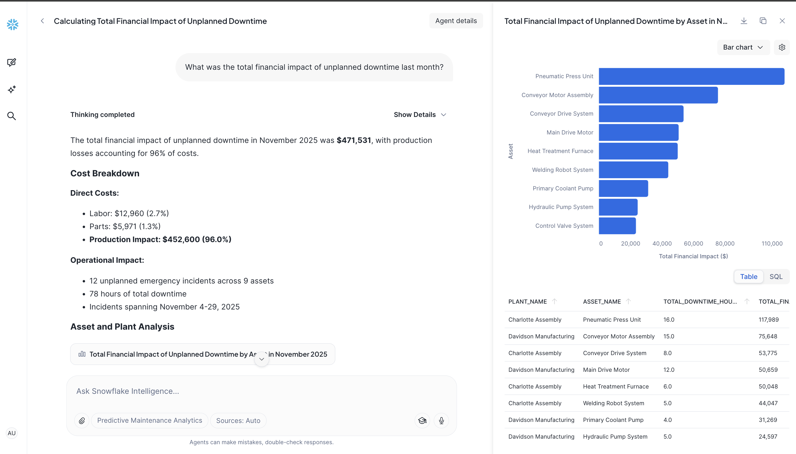

summary: End-to-end Predictive Maintenance Solution with Snowflake
id: predictive_maintenance_with_snowflake_cortex
categories: snowflake-site:taxonomy/product/ai, snowflake-site:taxonomy/industry/manufacturing, snowflake-site:taxonomy/snowflake-feature/snowflake-intelligence, snowflake-site:taxonomy/solution-center/certification/certified-solution
language: en
environments: web
status: Published
author: Tripp Smith, Charlie Hammond
feedback link: https://github.com/Snowflake-Labs/sfguides/issues
fork repo link: https://github.com/Snowflake-Labs/-getting-started-with-predictive-maintenance/tree/main

# Predictive Maintenance with Snowflake Cortex

## Overview

This solution is a blueprint for transforming a manufacturing operation from a **reactive** stance (fixing things when they break) to a **predictive** stance (fixing things before they break) using the Snowflake Data Cloud.

At a high level, it acts as a central nervous system for your manufacturing facilities, connecting the physical reality of your machines with the analytical power of the cloud. The solution constructs a comprehensive data ecosystem that turns raw sensor telemetry into a deployed Streamlit in Snowflake application for real-time fleet monitoring with a [Cortex Agent](https://docs.snowflake.com/en/user-guide/snowflake-cortex/cortex-agents) chat for deep natural language insights. Furthermore, you will configure a custom [Snowflake Intelligence](https://docs.snowflake.com/en/user-guide/snowflake-cortex/snowflake-intelligence) agent that empowers staff to query equipment health and predict failures using simple natural language.

## The Business Outcomes

Before diving into the mechanics, are some high level business outcomes the solution can help solve:

* **Elimination of Unplanned Downtime:** By predicting failures before they happen, the solution prevents costly production stoppages.
* **Optimization of Maintenance Spend:** It moves you away from calendar-based maintenance (fixing things whether they need it or not) to condition-based maintenance, saving on parts and labor.
* **Operational Transparency:** It provides a real-time "single pane of glass" view into the health of 18+ assets across multiple facilities.
* **Democratization of Data:** It allows non-technical floor managers to ask complex questions about machine health in plain English, removing the bottleneck of waiting for data analysts.

---
## How It Works: The 3-Step Solution Flow

The solution achieves these outcomes by orchestrating a specific flow of data, from the factory floor to the boardroom.

### 1. Building the Data Foundation (Ingestion & Medallion Architecture)
The core of the solution is a robust data foundation that ingests the "pulse" of the factory and refines it into a usable format.

* **Ingestion (Bronze Layer):** The system acts as a landing zone for high-volume, raw data. It captures continuous **IoT telemetry** (vibration, temperature, pressure) alongside operational data like **maintenance logs** and work orders directly from CMMS/ERP systems.
* **Curation (Silver Layer):** Raw sensor data is often messy. The solution creates a curated layer that cleanses and normalizes this data into a standard Star Schema. It connects isolated sensor readings to specific assets, technicians, and facilities, establishing a single source of truth.
* **Analytics Preparation (Gold Layer):** Finally, business logic is applied to aggregate data. This layer calculates key metrics like **OEE (Overall Equipment Effectiveness)**, generates feature stores for Machine Learning, and prepares data for high-speed querying.

### 2. Visualizing Operations (Streamlit in Snowflake)
Once the data is refined, the solution presents it through a deployed **Streamlit application**. This replaces static spreadsheets with interactive applications:
* **Built in Agent:** Ask natural language questions to your data while using the app.
* **Fleet Operations Center:** A command center view for dispatchers to triage alerts in real-time.
* **Line Visualization:** Interactive maps showing the status of production lines physically.
* **Financial & OEE Analysis:** Dedicated views to track the dollar cost of maintenance against the effectiveness of the equipment.

### 3. The "Brain" of the Operation (Snowflake Intelligence)
Finally, the solution layers **Artificial Intelligence** on top of the data. Instead of just looking at charts, users can engage with the **Predictive Maintenance Agent**.

* **Natural Language Querying:** A plant manager can ask, *"Which assets are predicted to fail in the next 30 days?"* or *"Compare production output across facilities."*
* **AI-Driven Context:** The system uses **Cortex Analyst** to understand the intent behind the question, generate the necessary SQL code automatically, and return the answer or visualization without the user writing a single line of code.

### Summary of What You Build
The predictive maintenace solution leverages a core data foundation with Streamlit and AI to streamline your maintenance operations. You ingest the physical data, refine it for accuracy, visualize it for human decision-making, and wrap it in AI to predict the future state of your assets.