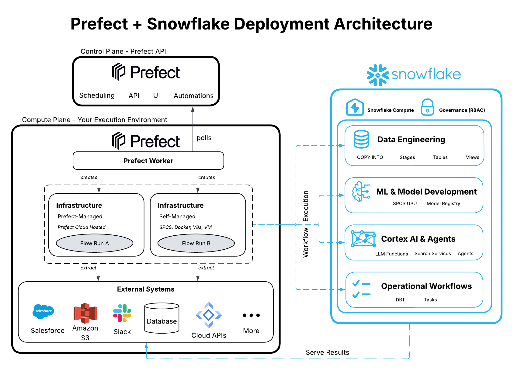

author: Akhil Ramasagaram
id: prefect-spcs-fraud-detection-mlops
language: en
summary: Run a Prefect worker on Snowpark Container Services — no Kubernetes, no separate infrastructure. Deploy a fraud detection retraining pipeline with drift monitoring and human approval gates, executing where your data lives.
categories: snowflake-site:taxonomy/solution-center/certification/partner-solution,snowflake-site:taxonomy/product/ai,snowflake-site:taxonomy/snowflake-feature/snowpark,snowflake-site:taxonomy/snowflake-feature/snowpark-container-services
environments: web
status: Published
feedback link: https://github.com/Snowflake-Labs/sfguides/issues
fork repo link: https://github.com/sfc-gh-aramasagaram/sfguide-prefect-spcs-fraud-detection

# Run Prefect Workers on Snowpark Container Services
<!-- ------------------------ -->
## Overview

Every Prefect deployment needs an execution environment. Traditionally, that execution layer lives outside of Snowflake on infrastructure such as Kubernetes, Amazon ECS, or virtual machines. While these approaches are common and effective, they introduce additional operational responsibilities. Teams must provision and maintain compute resources, configure networking, manage credentials, and operate a separate platform alongside their data environment.

Snowpark Container Services (SPCS) offers a different approach. Instead of deploying Prefect workers on external infrastructure, organizations can run them directly within Snowflake. In this model, Prefect Cloud continues to provide orchestration, scheduling, observability, and automation, while Snowflake becomes the managed execution environment where workflows actually run.

This architecture is particularly appealing for teams that already rely on Snowflake as the center of their data platform. By colocating workflow execution with data, organizations can simplify infrastructure management while benefiting from Snowflake-native security, governance, and authentication capabilities.

In this guide, we will deploy a Prefect worker on Snowpark Container Services, connect it to Prefect Cloud, and execute a production-style workflow to demonstrate the pattern in practice. While the example workflow focuses on fraud detection and model retraining, the broader architecture applies equally well to data pipelines, operational automation, agent orchestration, and other workflow-driven use cases.

<!-- ------------------------ -->
## Architecture

At a high level, Prefect Cloud remains the orchestration control plane. It is responsible for scheduling deployments, tracking flow state, managing automations, and providing visibility into workflow execution. The Prefect worker, however, runs inside Snowflake on Snowpark Container Services.

The worker continuously polls Prefect Cloud for work. When a deployment is triggered, the worker executes the corresponding flow within Snowflake's managed infrastructure. From there, the workflow can interact with Snowflake resources such as tables, stages, and Cortex services, while also communicating with approved external systems through Snowflake's networking controls.



This separation of responsibilities creates a clean operating model. Prefect Cloud handles orchestration and workflow management, while Snowpark Container Services provides the execution environment. The result is a familiar Prefect experience without the need to maintain a separate container platform or orchestration infrastructure.

<!-- ------------------------ -->
## Why Run Workers on SPCS?

Running Prefect workers on Snowpark Container Services offers several practical advantages beyond simply changing where containers run.

The first benefit is operational simplicity. Rather than managing Kubernetes clusters, virtual machines, or container services outside of Snowflake, teams can deploy workers using Snowflake-native infrastructure. This reduces the number of platforms that must be operated and monitored while keeping workflow execution close to the data it depends on.

Another advantage is authentication. Containers running on SPCS can receive Snowflake OAuth credentials automatically, eliminating the need to distribute passwords, rotate keys, or manage additional secrets for accessing Snowflake resources. This simplifies both development and ongoing operations while aligning with Snowflake's security model.

Network access is also tightly controlled. Through External Access Integrations, administrators can explicitly define which external services a worker is allowed to communicate with. This provides a clear governance model for workflows that need to interact with APIs, messaging platforms, or other external systems.

Finally, there is the concept of data gravity. Many workflows spend most of their time reading from and writing to Snowflake. Running workers inside Snowflake reduces the need to move data into external execution environments and allows workflows to operate closer to the systems they depend on.

<!-- ------------------------ -->
## Deploying a Prefect Worker

Deploying a Prefect worker on Snowpark Container Services follows the same general pattern as deploying any containerized application on Snowflake.

The process begins by provisioning the required Snowflake infrastructure, including a compute pool to provide container resources and an image repository to store container images. Because the worker must communicate with Prefect Cloud, an External Access Integration is also configured to allow outbound connectivity to approved endpoints.

### Create a Compute Pool

The compute pool provides the container resources used by the Prefect worker.

```sql
CREATE COMPUTE POOL prefect_pool
  MIN_NODES = 1
  MAX_NODES = 1
  INSTANCE_FAMILY = CPU_X64_XS;
```

### Create an Image Repository

Snowflake image repositories store container images used by SPCS services.

```sql
CREATE IMAGE REPOSITORY prefect_repo;
```

Retrieve the repository URL:

```sql
SHOW IMAGE REPOSITORIES;
```

### Configure External Access

The worker must communicate with Prefect Cloud. Create a network rule and External Access Integration to allow outbound connectivity.

```sql
CREATE OR REPLACE NETWORK RULE prefect_cloud_rule
  MODE = EGRESS
  TYPE = HOST_PORT
  VALUE_LIST = ('api.prefect.cloud');

CREATE OR REPLACE EXTERNAL ACCESS INTEGRATION prefect_eai
  ALLOWED_NETWORK_RULES = (prefect_cloud_rule)
  ENABLED = TRUE;
```

### Build and Push the Worker Image

Create a simple Docker image containing Prefect and the worker process.

```dockerfile
FROM python:3.11-slim

RUN pip install prefect

CMD ["prefect", "worker", "start", "--pool", "spcs-pool"]
```

Authenticate Docker with Snowflake and push the image:

```bash
snow spcs image-registry login

docker build -t prefect-worker .

docker tag prefect-worker \
<account>.registry.snowflakecomputing.com/<database>/<schema>/prefect_repo/prefect-worker:latest

docker push \
<account>.registry.snowflakecomputing.com/<database>/<schema>/prefect_repo/prefect-worker:latest
```

### Deploy the Worker as a Service

Create an SPCS service that runs the Prefect worker.

```sql
CREATE SERVICE prefect_worker
  IN COMPUTE POOL prefect_pool
  EXTERNAL_ACCESS_INTEGRATIONS = (prefect_eai)
  FROM SPECIFICATION $$
spec:
  containers:
  - name: worker
    image: <account>.registry.snowflakecomputing.com/<database>/<schema>/prefect_repo/prefect-worker:latest
    env:
      PREFECT_API_URL: "https://api.prefect.cloud/api/accounts/<account-id>/workspaces/<workspace-id>"
      PREFECT_API_KEY: "<prefect-api-key>"
  endpoints:
  - name: worker
    port: 8080
$$;
```

After deployment, the worker registers with Prefect Cloud and begins polling for work. From Prefect's perspective, it behaves like any other worker. The difference is that execution now occurs entirely within Snowflake's managed container environment.

At this point, Snowpark Container Services has effectively become a managed execution layer for Prefect workflows.

<!-- ------------------------ -->
## Executing a Workflow

To validate the deployment, this guide uses a fraud detection retraining workflow as an example. The workflow itself is not the primary focus of the guide; rather, it serves as a realistic workload that exercises several important orchestration capabilities.

The workflow begins by performing batch scoring against incoming transactions. It then evaluates model performance and checks for signs of drift. If drift is detected, a retraining process is initiated, producing a challenger model that is compared against the current production model. Depending on the outcome, the workflow may pause for human approval before promoting the new model into production.

At a high level, the workflow looks like this:

```python
from prefect import flow

@flow
def fraud_pipeline():
    score_transactions()

    if detect_drift():
        retrain_model()

        if challenger_beats_champion():
            request_approval()

            if approved():
                promote_model()
```

This sequence demonstrates several capabilities that are commonly required in production workflows, including retries, long-running execution, durable state management, human-in-the-loop approvals, and pause-and-resume behavior. These features are provided by Prefect, while the execution itself occurs on the worker running inside Snowpark Container Services.

Although fraud detection is the example used here, the same pattern applies to a wide range of workloads. Data engineering pipelines, reverse ETL processes, monitoring jobs, AI agents, and operational workflows can all be executed using the same architecture.

<!-- ------------------------ -->
## Observing Execution

Once the workflow is triggered, execution can be observed through both Prefect Cloud and Snowflake.

Within Prefect Cloud, operators can monitor flow runs, inspect task states, review retries, and track approval pauses or other workflow events. The Prefect interface provides a complete view of orchestration state and execution history, making it easy to understand how a workflow is progressing.

At the same time, Snowflake provides visibility into the underlying service through container logs and operational monitoring tools.

View running services:

```sql
SHOW SERVICES;
```

Inspect service status:

```sql
DESCRIBE SERVICE prefect_worker;
```

Retrieve service logs:

```sql
CALL SYSTEM$GET_SERVICE_LOGS(
  'PREFECT_WORKER',
  '0',
  'worker'
);
```

Together, Prefect Cloud and Snowpark Container Services provide visibility across both layers of the system: orchestration and execution.

<!-- ------------------------ -->
## Conclusion

Prefect Cloud and Snowpark Container Services complement each other naturally. Prefect provides the orchestration layer, including scheduling, state management, retries, automations, and observability. Snowpark Container Services provides the execution layer, allowing workflows to run within Snowflake's managed infrastructure while benefiting from Snowflake-native security, authentication, and governance.

The fraud detection workflow used in this guide is only one example of what can be built with this architecture. The same approach can support data pipelines, agent orchestration, reverse ETL workloads, monitoring systems, and a wide variety of operational workflows.

The key takeaway is straightforward: by running Prefect workers on Snowpark Container Services, organizations can keep their workflow execution layer inside Snowflake while continuing to leverage Prefect Cloud as their orchestration control plane.

For a complete, working example of the architecture described in this guide — including the Prefect worker configuration, deployment assets, and sample fraud detection workflow — see the [companion repository](https://github.com/sfc-gh-aramasagaram/sfguide-prefect-spcs-fraud-detection). It contains the full implementation and can be used as a starting point for adapting the pattern to your own workloads.
