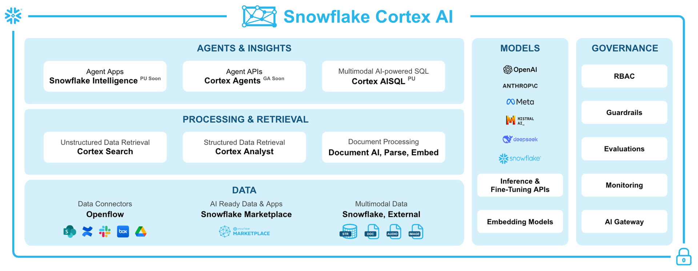
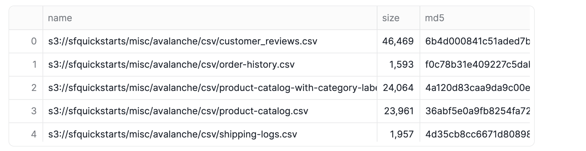
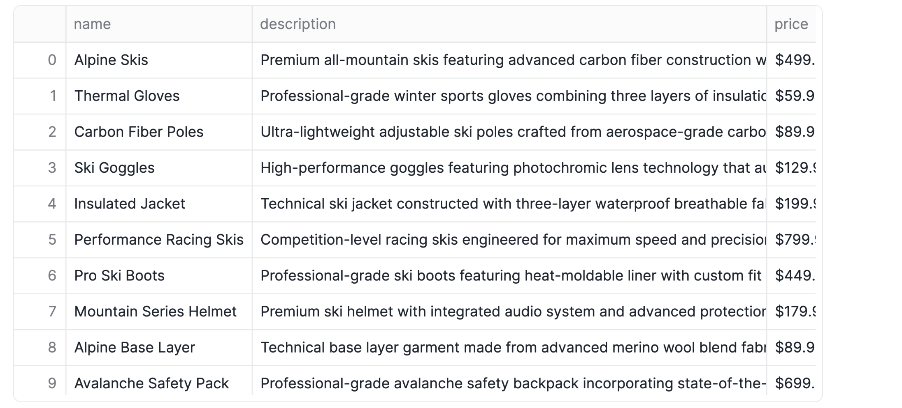
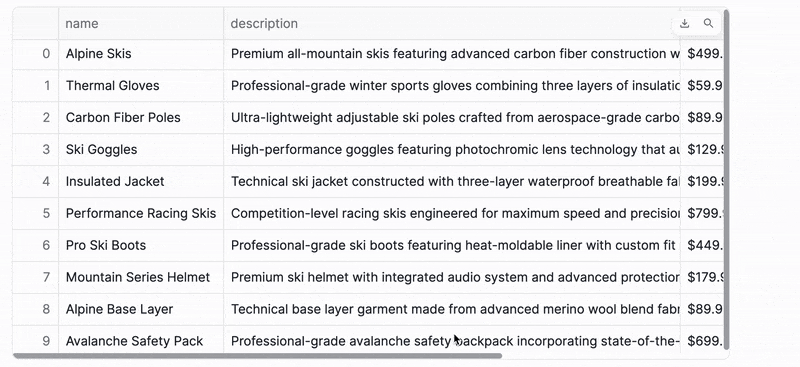
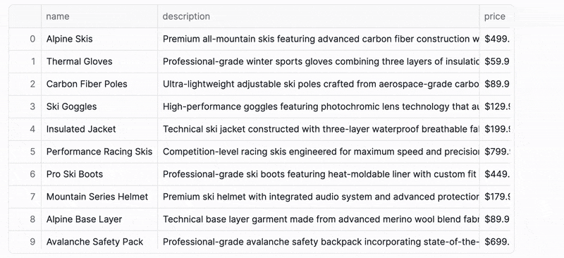
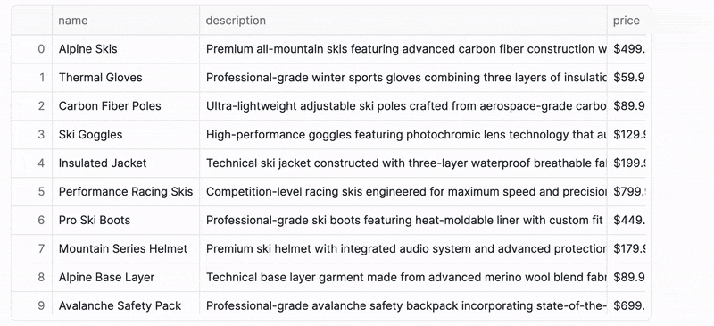
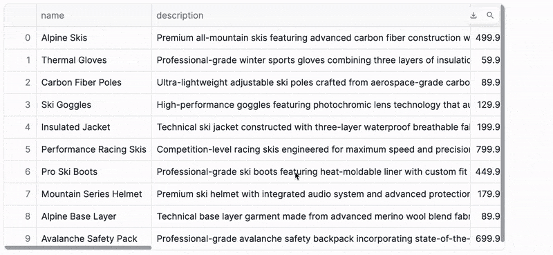
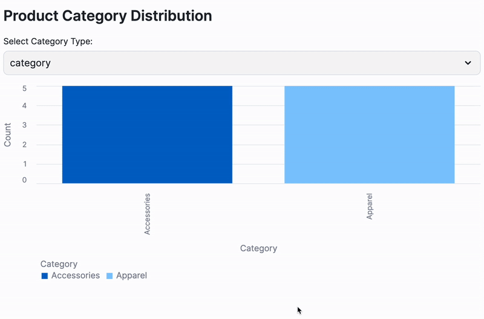
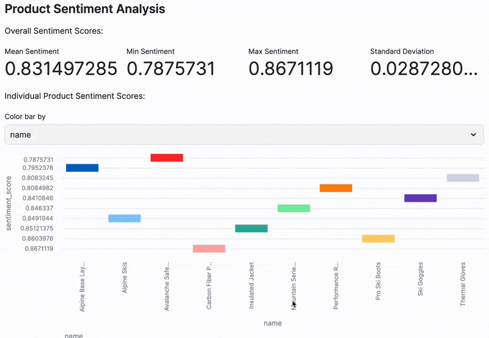

author: Chanin Nantasenamat
id: process-modin-dataframe-with-cortex
categories: snowflake-site:taxonomy/solution-center/certification/quickstart, snowflake-site:taxonomy/product/ai, snowflake-site:taxonomy/snowflake-feature/cortex-llm-functions
language: en
summary: Learn how to process data using Modin DataFrames with Snowflake Cortex AI capabilities for text classification, translation, sentiment analysis, and more. 
environments: web
status: Published
feedback link: https://github.com/Snowflake-Labs/sfguides/issues


# Build an AI-Powered Data Processing Pipeline with Modin and Snowflake Cortex
<!-- ------------------------ -->
## Overview

Ready to supercharge your data processing with AI, all while working in the familiar environment of pandas.

This quickstart reveals how you can effortlessly integrate powerful Snowflake Cortex AI capabilities directly into your Modin DataFrames. Get ready to transform, analyze, and visualize your data with unprecedented ease and scale, all within the unified Snowflake ecosystem.

You'll embark on a journey to build an end-to-end data processing pipeline that loads product catalog data, applies various AI transformations using Cortex, and visualizes the results with Streamlit. The best part? It all happens effortlessly within the unified Snowflake ecosystem.

Before we dive deeper into specific AI functions, let's take a moment to appreciate the comprehensive power of Snowflake Cortex AI. It's not just a collection of functions; it's a fully integrated ecosystem designed to bring advanced AI capabilities directly to your data, without the complexity of moving it.

This diagram illustrates the key components that make up Snowflake Cortex AI, showing how it supports everything from data ingestion and processing to model deployment and governance.



### What You'll Learn
- **Seamless Data Ingestion:** Learn to load data from an S3 bucket directly into a Snowflake stage.
- **Pandas, Supercharged:** Discover how to read CSV data into a Modin DataFrame, scaling your operations with ease.
- **AI at Your Fingertips:** Apply powerful Cortex LLM functions for tasks like text classification, translation, sentiment analysis, and more, directly on your data.
- **Data Persistence:** Master writing your newly processed, AI-enriched data back to Snowflake.
- **Interactive Insights:** Craft a simple, yet impactful, interactive visualization with Streamlit to showcase your results.

### What You'll Build
A complete data processing pipeline that transforms product catalog data using AI capabilities and presents insights through an interactive dashboard.

### What You'll Need
- Access to a [Snowflake account](https://signup.snowflake.com/?utm_source=snowflake-devrel&utm_medium=developer-guides&utm_cta=developer-guides)
- Basic familiarity with Python and pandas

<!-- ------------------------ -->
## Setup

### Retrieve the Notebook

Ready to dive in? To follow along with every step of this quickstart, you can click on [Process-DataFrame-with-Modin-and-Cortex.ipynb](https://github.com/Snowflake-Labs/snowflake-demo-notebooks/blob/main/Process-Modin-DataFrame-with-Cortex/Process-DataFrame-with-Modin-and-Cortex.ipynb) to download the companion Notebook from GitHub.

### Required Packages

Snowflake Notebooks comes pre-loaded with a fantastic array of common Python libraries for data science and machine learning, including `numpy`, `pandas`, and `matplotlib`. However, for this particular journey into AI-powered data processing, we'll need to bring in a few specialized tools:

- `modin`: Your secret weapon for scaling those familiar pandas operations to handle larger datasets with ease.
- `snowflake-ml-python`: This is your gateway to unlocking the powerful Cortex LLM functions directly within your Python environment.
- `snowflake-snowpark-python`: Essential for seamless interaction with Snowpark functionality, bridging your Python code with Snowflake's robust capabilities.

Adding these packages is a breeze! Just head over to the **Packages** dropdown, located in the top right corner of your Snowflake Notebook interface, and add them there.

### Import Prerequisite Libraries

Let's start by importing the necessary libraries and establishing a connection to Snowflake:

```python
# Import Python packages
import modin.pandas as pd
import snowflake.snowpark.modin.plugin

# Connecting to Snowflake
from snowflake.snowpark.context import get_active_session
session = get_active_session()
```

This code imports Modin's pandas implementation and connects to your active Snowflake session.

<!-- ------------------------ -->
## Load Data

### Store Data into a Snowflake Stage

Before we can unleash the power of AI on our data, we need a place for it to live within Snowflake. Think of a stage as a secure, internal landing zone for your external data. 

We'll create one to seamlessly bring in our product catalog data from an S3 bucket:

```sql
CREATE OR REPLACE STAGE AVALANCHE
    URL = 's3://sfquickstarts/misc/avalanche/csv/';
```

You should see the following status message the stage is created successfully:


### List Stage Contents

Just to be sure our data has landed safely and is ready for action, let's quickly list the contents of our newly created stage. This helps us verify that everything is accessible before we proceed:

```sql
ls @avalanche/
```

This command should display the files available in the stage, including our target file `product-catalog.csv`.




### Read CSV Data

Now for the exciting part! We'll read that CSV data directly into a Modin DataFrame. This is where your familiar pandas operations get a significant performance boost, thanks to Modin's scalability.

```python
df = pd.read_csv("@avalanche/product-catalog.csv")

df
```




Once loaded, your DataFrame will feature three key columns, ready for the forthcoming AI magic:
- `name`: Product name
- `description`: Product description
- `price`: Product price

> 
> IMPORTANT:
> - Make sure your Snowflake role has the necessary permissions to create stages and access external data
> - The path to the CSV file is relative to the stage you created

<!-- ------------------------ -->
## Classify Text

### Classify Text with Cortex

This is where Snowflake Cortex truly shines! It offers powerful AI capabilities that you can apply directly to your data, transforming raw text into structured insights. 

Let's use the `ClassifyText` function to categorize our products:

```python
from snowflake.cortex import ClassifyText

df["label"] = df["name"].apply(ClassifyText, categories=["Apparel","Accessories"])
df["label2"] = df["description"].apply(ClassifyText, categories=["Apparel","Accessories"])

df
```



Did you notice something interesting? We're classifying products in two distinct ways: once based on the concise product name, and again using the more detailed product description. 

This is a fantastic way to see how different inputs can lead to nuanced classification results, giving you a richer understanding of your data.

### Extract Classification Labels

Cortex's `ClassifyText` function returns its results as dictionaries, which is great for comprehensive output. But for our analysis, we just need the clean category values without the `label` keys. Let's quickly extract those values and then tidy up our DataFrame by dropping the intermediate columns:

```python
df["category"] = df["label"].apply(lambda x: x.get('label'))
df["category2"] = df["label2"].apply(lambda x: x.get('label'))

df.drop(["label", "label2"], axis=1, inplace=True)

df
```




And just like that, we have beautifully clean category columns, perfectly ready for deeper analysis and visualization. No more manual sorting or tagging!

<!-- ------------------------ -->
## Translate Text

Snowflake Cortex makes language translation incredibly simple. Let's leverage Cortex's powerful `Translate` function to instantly localize our product information from English into German:

```python
from snowflake.cortex import Translate

df["name_de"] = df["name"].apply(Translate, from_language="en", to_language="de")
df["description_de"] = df["description"].apply(Translate, from_language="en", to_language="de")
df["category_de"] = df["category"].apply(Translate, from_language="en", to_language="de")
df["category2_de"] = df["category2"].apply(Translate, from_language="en", to_language="de")

df
```




With just a few lines of code, you can localize your entire product catalog, opening doors to new markets and ensuring your data speaks every language your business needs.

<!-- ------------------------ -->
## Process Text

### Analyze Sentiment

Beyond classification and translation, Cortex offers even more sophisticated text capabilities. Let's unlock deeper insights from our product descriptions, starting with understanding the emotions they convey.

Ever wondered how your product descriptions are perceived? Are they overwhelmingly positive, or do they carry a hint of negativity? Let's use Cortex's `Sentiment` function to assign a numerical score to each description, instantly revealing its emotional tone:

```python
from snowflake.cortex import Sentiment

df["sentiment_score"] = df["description"].apply(Sentiment)

df
```


This sentiment score provides a powerful numerical value, giving you an immediate indication of the positivity or negativity embedded within each description. Imagine using this to quickly identify descriptions that might need a rewrite!

### Summarize Text

Long descriptions can be overwhelming. What if you could get the gist of a product description in a single, concise sentence? 
Cortex's `Summarize` function makes this a reality, helping you distill lengthy text into digestible summaries:

```python
from snowflake.cortex import Summarize

df["description_summary"] = df["description"].apply(Summarize)

df
```


This is incredibly useful for quick reviews or for generating short snippets for other applications.

### Extract Specific Information

Sometimes, you need to pull out very specific pieces of information from unstructured text. Cortex's `ExtractAnswer` function acts like a smart assistant, answering questions directly from your text. Let's use it to identify the exact product mentioned in each name:

```python
from snowflake.cortex import ExtractAnswer

df["product"] = df["name"].apply(ExtractAnswer, question="What product is being mentioned?")
df["product"] = [x[0]["answer"] for x in df['product']]

df
```


This demonstrates how you can use Cortex to extract structured information from unstructured text.

<!-- ------------------------ -->
## Post-Process Data

Our data has been enriched with powerful AI insights, but before we finalize it, a little post-processing goes a long way to ensure accurate and reliable subsequent data analysis and visualization.

### Clean Price Data

Our `price` column currently contains dollar signs, which isn't ideal for numerical calculations. Let's quickly clean this up by removing the '$' symbol and then converting the column to a proper numeric type. This ensures our financial data is ready for any mathematical operations or aggregations.

```python
# For the price column, remove $ symbol and convert to numeric
df["price"] = df["price"].str.replace("$", "", regex=False)
df["price"] = pd.to_numeric(df["price"])

df
```



### Convert Column Types

To maintain data integrity and ensure compatibility with various tools (especially when writing back to Snowflake), it's good practice to standardize our column types. Let's make sure all our text-based columns are explicitly set as string types, while leaving our numerical columns (like `price` and `sentiment_score`) as they are.

```python
# Convert all other columns to the string type
for col_name in df.columns:
    if col_name != "price" and col_name != "sentiment_score":
        df[col_name] = df[col_name].astype(str)

df
```


With these quick clean-up steps, our DataFrame is now perfectly structured and ready for its final destination!

<!-- ------------------------ -->
## Data Operations

Now that our data is transformed, enriched, and polished, it's time to persist these valuable insights. The beauty of working within the Snowflake ecosystem is the seamless ability to write your processed data directly back into a Snowflake table, making it available for countless other applications and analyses.

### Write to a Snowflake Table

Let's write our processed DataFrame to a Snowflake table:

```python
df.to_snowflake("avalanche_products", if_exists="replace", index=False)
```

### Read Data with SQL

Let's quickly confirm your data is there and looks as expected. We can query our new table using the following SQL query:

```sql
SELECT * FROM CHANINN_DEMO_DATA.PUBLIC.AVALANCHE_PRODUCTS
```

### Read Data with Python

And of course, if you ever need to pull this data back into a DataFrame for further Python-based analysis or application development, it's just as straightforward:

```python
pd.read_snowflake("avalanche_products")
```

<!-- ------------------------ -->
## Build a Streamlit Dashboard

What's the point of all this incredible AI-powered data processing if you can't easily share and interact with the insights? This is where Streamlit steps in, allowing you to transform your data into a beautiful, interactive web application with just a few lines of Python code. Let's build a simple yet powerful dashboard to visualize our newly enriched product data!

```python
import streamlit as st

df = pd.read_snowflake("avalanche_products")

st.header("Product Category Distribution")

# Selectbox for choosing the category column
selected_category_column = st.selectbox(
    "Select Category Type:",
    ("category", "category2")
)

# Count the occurrences of each category based on the selected column
category_counts = df[selected_category_column].value_counts().reset_index()
category_counts.columns = ['Category', 'Count']

st.bar_chart(category_counts, x='Category', y='Count', color='Category')

st.header("Product Sentiment Analysis")

# Calculate metrics
st.write("Overall Sentiment Scores:")

cols = st.columns(4)

with cols[0]:
    st.metric("Mean Sentiment", df['sentiment_score'].mean() )
with cols[1]:
    st.metric("Min Sentiment", df['sentiment_score'].min() )
with cols[2]:
    st.metric("Max Sentiment", df['sentiment_score'].max() )
with cols[3]:
    st.metric("Standard Deviation", df['sentiment_score'].std() )

# Create a bar chart showing sentiment scores for all products
st.write("Individual Product Sentiment Scores:")
option = st.selectbox("Color bar by", ("name", "sentiment_score"))
st.bar_chart(df[['name', 'sentiment_score']], x='name', y='sentiment_score', color=option)
```

And there you have it! This intuitive Streamlit app instantly provides:
1. **Dynamic Category Insights:** A clear bar chart showcasing the distribution of product categories, with the flexibility to switch between classification methods.



2. **At-a-Glance Sentiment Metrics:** Key statistical metrics that summarize the overall sentiment across your product descriptions.
3. **Granular Sentiment Visualization:** A bar chart that lets you explore the sentiment score for each individual product, helping you pinpoint outliers or trends.



This isn't just a visualization; it's an interactive AI-powered data app that empower users to perform self-serve analytics!

## Conclusion And Resources

Congratulations! You've not just followed a tutorial; you've successfully engineered a powerful, end-to-end data processing pipeline. You've harnessed the scalability of Modin DataFrames and the cutting-edge AI capabilities of Snowflake Cortex to transform raw data into actionable intelligence. From loading external data to applying sophisticated AI transformations like classification, translation, sentiment analysis, and text summarization, you've done it all. And to top it off, you've brought your insights to life with a dynamic, interactive Streamlit dashboard!

This quickstart truly showcases the immense power and seamless integration of the Snowflake ecosystem. You've seen firsthand how you can perform sophisticated data processing and advanced AI operations without ever needing to move your data outside the platform. This isn't just about convenience; it's about unlocking unparalleled performance, robust security, and a streamlined workflow for your data projects.

### What You Learned
- Loaded data from an S3 bucket into a Snowflake stage
- Processed data using Modin DataFrames for improved performance
- Applied Cortex AI functions for text classification, translation, and sentiment analysis
- Extracted structured information from unstructured text
- Created an interactive dashboard with Streamlit
- Wrote and read data within the Snowflake ecosystem

### Related Resources

Want to dive deeper or explore related topics? Check out these valuable resources:

**Articles:**
- [pandas on Snowflake](https://docs.snowflake.com/en/developer-guide/snowpark/python/pandas-on-snowflake)
- [Using Snowflake Cortex LLM functions with Snowpark pandas](https://docs.snowflake.com/en/developer-guide/snowpark/python/pandas-on-snowflake#using-snowflake-cortex-llm-functions-with-snowpark-pandas)
- [Snowflake Cortex AI](/en/product/features/cortex/)

**Documentation:**
- [Snowflake Documentation](https://docs.snowflake.com/)
- [Streamlit Documentation](https://docs.streamlit.io/)
- [Modin Documentation](https://modin.readthedocs.io/)
