author: Adrian Gonzalez, Dan Murphy
id: processing_hl7_fhir_messages_with_snowflake
summary: This is a guide to get familiarized with how to ingest and process HL7 FHIR JSON messages using Snowflake native features.
categories: architecture-patterns,solution-examples
environments: web
status: Published 
feedback link: https://github.com/Snowflake-Labs/sfguides/issues
tags: Getting Started, Data Science, Data Engineering, Data Lake, Health & Life Sciences, HL7, FHIRpwd

# Getting Started - Processing HL7 FHIR Messages with Snowflake
<!-- ------------------------ -->
## Overview 
Duration: 5

This Quickstart is designed to help you understand the capabilities included in Snowflake’s support for processing Healthcare HL7 FHIR messages. The lab will give you a view into how you can leverage Snowflake’s features to ingest semistructured data and use other native features to parse HL7 FHIR messages in JSON format and analyze them using Snowsight.

Sign up for a free 30-day trial of Snowflake and follow along with this lab exercise. After completing the labs, you’ll be ready to start processing and managing your own HL7 JSON FHIR messages in Snowflake.

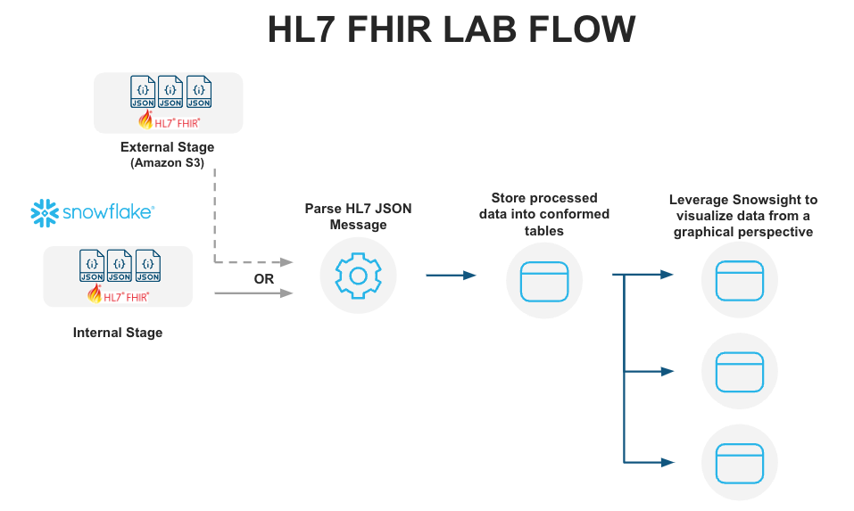


### Prerequisites
- Snowflake account
- Basic knowledge of SQL, database concepts, and objects
- Recommend to get familiarized with the [Snowflake User Interface](https://github.com/Snowflake-Labs/sfquickstarts/blob/master/site/sfguides/src/getting_started_with_snowflake/getting_started_with_snowflake.md)
- Recommended to also complete [Getting Started with SnowSQL](https://quickstarts.snowflake.com/guide/getting_started_with_snowsql/index.html?index=..%2F..index)


### What You’ll Learn
- How to ingest and process HL7 FHIR JSON messages
- How to display the ingested data using Snowsight in Snowflake


### What You'll Build
- A snowflake stage (internal) for storing and accessing HL7 FHIR files in Snowflake.
- A Snowsight dashboard for analyzing the data ingested and processed.


<!-- ------------------------ -->
## Notice and Terms of Use
Duration: 5

The data provided for this lab is an provided by the Synthea Data Generator on github ([Synthea Github](https://github.com/synthetichealth/synthea)). More details about Synthea and general terms of use can be found dirently in their [website](https://synthetichealth.github.io/synthea/).

We will provide the ready-to-use data in this quickstart,  but if in the future you would like to create your own customized datasets and experiment further, you can accomplish this by leveraging the versatility of the **Synthea's Data Generator**, following the instructions specified [here](https://github.com/synthetichealth/synthea/wiki/Basic-Setup-and-Running).

Use of the data provided is limited to this quickstart in connection with the Snowflake service and is subject to any additional terms and conditions on the Synthea github repository.


By accessing this data, you acknowledge and agree to the limits and terms related to the use of the HL7 FIRE datasets.

### **Note:**
*The implementations provided here are at best MVP/Prototype versions, they are not of production quality. You are free to extend the functionality and improve the code as it fits your functionality.*

<!-- ------------------------ -->
## Prepare your lab environment
Duration: 10

If you haven't already, register for a [Snowflake free 30-day trial](https://trial.snowflake.com/). The Snowflake edition (Standard, Enterprise, Business Critical, e.g.), cloud provider (AWS, Azure, e.g.), and Region (US East, EU, e.g.) do not matter for this lab. We suggest you select the region which is physically closest to you and the Enterprise Edition, our most popular offering. After registering, you will receive an email with an activation link and your Snowflake account URL.


### Navigating to Snowflake User Interface
For this lab, you will use the latest Snowflake web interface.
1. Open a browser window and enter the URL of your Snowflake 30-day trial environment that was sent with your registration email.Log into your Snowflake trial account
2. Click on __Worksheets__ tab in the left-hand navigation bar. The ​Worksheets​ tab provides an interface for submitting SQL queries, performing DDL and DML operations, and viewing results as your queries or operations complete. 
3. A new worksheet is created by clicking __+ Worksheet__ on the top right.


### Download Data and Scripts
All the files used in this lab can be found directly in Synthea's [website](https://synthetichealth.github.io/synthea/).

We need to first download these files to the local workstation by clicking on the hyperlink below. 

&nbsp;

#### Sample HL7 FHIR JSON messages data file. 

[synthea_sample_data_fhir_stu3_nov2021.zip](<https://synthetichealth.github.io/synthea-sample-data/downloads/synthea_sample_data_fhir_stu3_nov2021.zip>) - Sample HL7 FHIR messages data files.

&nbsp;

After downloading the zip file to your preferred location, please unzip the contents of the file. The result will be a folder named **fhir_stu3** with several hundred **HL7 FHIR JSON** files.


**Local Files**

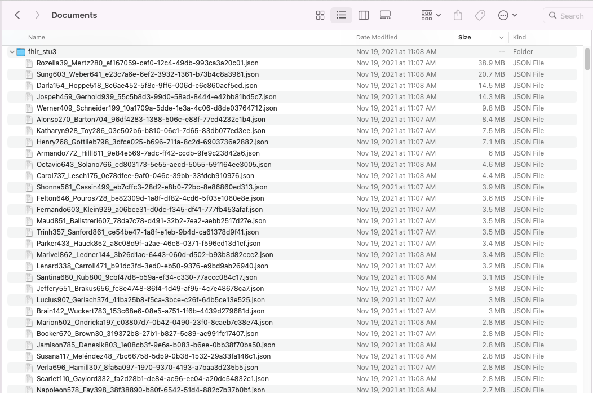

 &nbsp;

 The subsequent steps in the next section require [SnowSQL CLI](https://docs.snowflake.com/en/user-guide/snowsql.html), installed on the local workstation where the lab is ran.

 &nbsp;

<!-- ------------------------ -->
## Store & Access HL7 FHIR Messages
Duration: 15

Let’s start by preparing to load the HL7 FHIR messages into Snowflake. Snowflake supports two types of stages for storing data files used for loading and unloading:
- [Internal stages](https://docs.snowflake.com/en/user-guide/data-load-overview.html#internal-stages) store the files internally within Snowflake.
- [External stages](https://docs.snowflake.com/en/user-guide/data-load-overview.html#external-stages) store the files in an external location (i.e. S3 bucket) that is referenced by the stage. An external stage specifies location and credential information, if required, for the bucket.


### Create a Database, Schema, and Warehouse
Before creating any stages, let's create a database and a schema that will be used for loading the semistructured data. We will use the UI within the Worksheets tab to run the DDL that creates the database and schema. Copy the commands below into your trial environment, and execute each individually.


```sql
USE ROLE SYSADMIN;

CREATE OR REPLACE DATABASE HL7_FHIR COMMENT = 'HL7 FHIR DATABASE';
CREATE OR REPLACE SCHEMA HL7_FHIR_V1;
CREATE OR REPLACE WAREHOUSE "HL7_FHIR_WH"
    WAREHOUSE_SIZE = 'SMALL'
    INITIALLY_SUSPENDED = FALSE
    AUTO_SUSPEND=600
    AUTO_RESUME=TRUE
    MIN_CLUSTER_COUNT=1
    MAX_CLUSTER_COUNT=1
    SCALING_POLICY='STANDARD'
    COMMENT='';
```

In this statement we are also creating a compute warehouse named `HL7_FHIR_WH` that will be the main compute resource to load files into Snowflake and perform analytical queries.

### Create Snowflake Stages to Ingest and Store HL7 FHIR Messages
Stages in Snowflake are locations used to store data. If the data that needs to be loaded into Snowflake is stored in other cloud regions like AWS S3 or Azure or GCP then these are called External stages whereas if the data is stored inside Snowflake then these are called Internal stages.

**Note:** For the purpose of this lab we are using Internal stage. You could accomplish the same result with an External Stage.


### Store HL7 FHIR messages in an Internal Stage
You can store data and files directly in Snowflake with internal stages. Now, we want to create an internal stage and upload the files using SnowSQL CLI.

#### Create an Internal Stage
Run this command in the **Worksheets** interface to create an internal stage called `HL7_FHIR_STAGE_INTERNAL` as follows.


```sql
USE SCHEMA HL7_FHIR_V1;
-- Directory tables store a catalog of staged files in cloud storage.
CREATE OR REPLACE STAGE HL7_FHIR_STAGE_INTERNAL
   DIRECTORY = ( ENABLE = TRUE )
   COMMENT = 'Used For Staging Data';
```

#### Upload Files using SnowSQL to Internal Stage

Let's now upload the files downloaded to your workstation to Snowflake internal stage `HL7_FHIR_STAGE_INTERNAL`. We will use **SnowSQL CLI** and the **PUT** command to load all files. Before opening terminal, find out your account identifier which for the trial account will be.


For example, if the URL to access the trial account is `https://xx74264.ca-central-1.aws.snowflakecomputing.com/`. These are the values for the account identifier:


- Account identifier: `xx74264`

There may be additional segments if you are using your own account part of an organization. You can find those from the URL of your Snowflake account. Please check the [Snowflake Documentation](https://docs.snowflake.com/en/user-guide/admin-account-identifier.html#account-identifiers) for additional details on this topic.

For your convenience, use the below query in the **Worksheets** interface to retrieve account identifier.

```sql
-- Retrieve your Snowflake account identifier 
SELECT REPLACE(T.VALUE:host::VARCHAR,'.snowflakecomputing.com') AS ACCOUNT_IDENTIFIER 
FROM TABLE(FLATTEN(INPUT => PARSE_JSON(system$allowlist()))) AS T
WHERE T.VALUE:type::VARCHAR = 'SNOWFLAKE_DEPLOYMENT_REGIONLESS';

```

**Internal Stage Files**

Using Snowsql upload the files.

```sql
-- Using a terminal window invoke snowsql.

snowsql -a <account-identifier> -u <username>

-- set the database/schema/warehouse context
USE DATABASE HL7_FHIR;
USE SCHEMA HL7_FHIR_V1;
USE WAREHOUSE HL7_FHIR_WH;

-- Load sample HL7 FHIR data
put 'file:////<downloaded files folder path>/*.json' @HL7_FHIR_STAGE_INTERNAL;

```
**Note:** The URI formatting differs depending on your client operating system. For additional details check [Snowflake Documentation](https://docs.snowflake.com/en/sql-reference/sql/put.html#required-parameters)

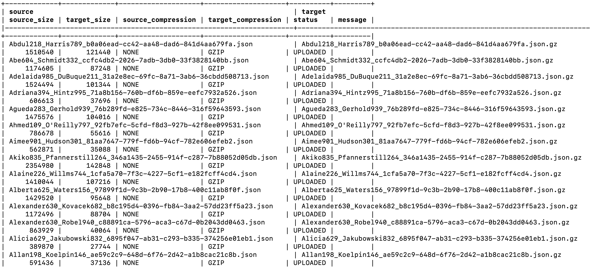


It should take around 30 seconds to import the files into the internal stage.

**Refresh Stage**

Back in the **Worksheets** interface, let's make sure we can see the files we just brought over by executing this refresh command:

```sql
-- Ensure to refresh the stage
ALTER STAGE HL7_FHIR_STAGE_INTERNAL REFRESH;
```


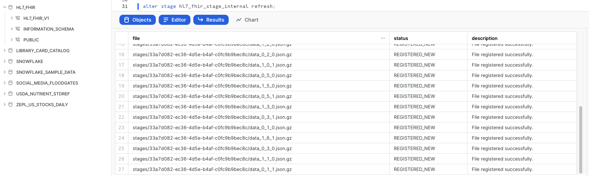


**List Files**


```sql
-- Run this to verify the files shows up in the list
SELECT *
FROM DIRECTORY(@HL7_FHIR_STAGE_INTERNAL);
```


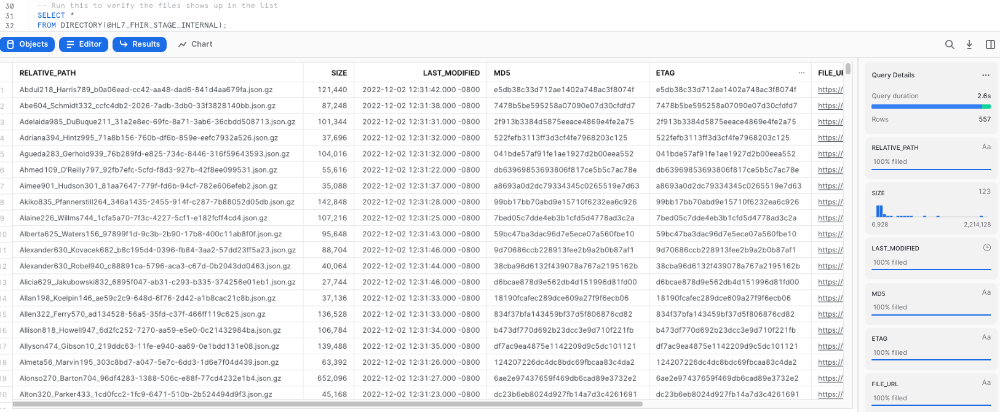


<!-- ------------------------ -->
## Loading HL7 FHIR messages into Snowflake Tables
Duration: 10


### Create Table

This creates the PATIENT landing table for the HL7 data:

```sql
--Create PATIENT table for HL7 data via JSON
CREATE TABLE HL7_FHIR.HL7_FHIR_V1.PATIENT
    (JSON_STRING VARIANT);
 ```

### Create File Format

After creating the table, we need to create a [file format](https://docs.snowflake.com/en/sql-reference/sql/create-file-format.html) to ingest JSON data according to the specific characteristics of the data structure in the staged files.

In the worksheet, run the following command to create the file format:

```sql
--Create file format for json
CREATE FILE FORMAT HL7_FHIR.HL7_FHIR_V1.JSON
  TYPE = 'JSON'
  COMPRESSION = 'AUTO'
  ENABLE_OCTAL = FALSE
  ALLOW_DUPLICATE = FALSE
  STRIP_OUTER_ARRAY = FALSE
  STRIP_NULL_VALUES = FALSE
  IGNORE_UTF8_ERRORS = FALSE;
 ```


After running this statement, we verify that the file format has been created with the correct settings by executing the following command:
```sql
--Verify file format is created
SHOW FILE FORMATS IN DATABASE HL7_FHIR;
 ```

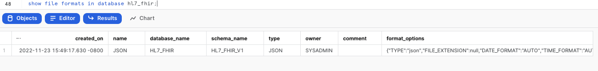

### Load Files

Once that the file format and the table have been created, we can run a COPY command to load the data into the PATIENT landing table we created earlier:

```sql
--Copy data from HL7_FHIR_STAGE_INTERNAL stage
    COPY INTO HL7_FHIR.HL7_FHIR_V1.PATIENT
    FROM @HL7_FHIR_STAGE_INTERNAL
    FILE_FORMAT = (FORMAT_NAME = 'JSON')
    ON_ERROR = 'SKIP_FILE';
```

This operation should take a few seconds, and the output of the previous statement should looks similar to this:

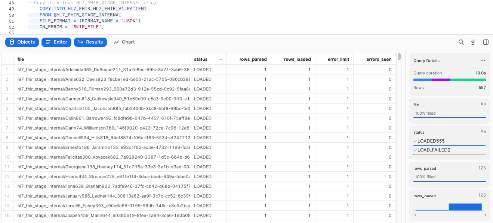

Now, let's take a look at the data that was loaded:

```sql
--Select raw JSON 
SELECT *
    FROM HL7_FHIR.HL7_FHIR_V1.PATIENT
    LIMIT 5;
```

Click any of the rows to display the formated JSON in the right panel. You should see a message that says that the value is to large to be displayed. 

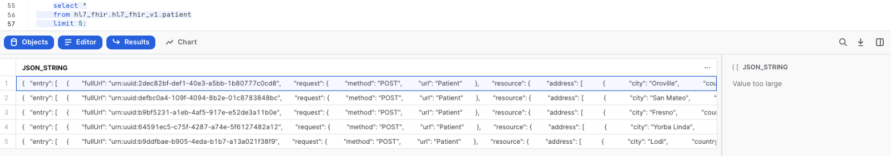


This lead us to demonstrate the value of the native capabilities of Snowflake to ingest this raw data and parse it into an structured array. We can do exactly that by creating a view of the table `PATIENTS` we have been using, with a statement that will create a view called `PATIENTS_VIEW` and flatten the structure to provide us with a clear reflection of the data that we have ingested:


```sql
--Create PATIENTS_VW view
CREATE OR REPLACE VIEW HL7_FHIR.HL7_FHIR_V1.PATIENTS_VW AS
    SELECT
        JSON_STRING:entry[0].fullUrl::string PATIENT_ID,
        MIN(DECODE(IDENTIFIER.VALUE:type.text,'Medical Record Number',IDENTIFIER.VALUE:value::string)) PATIENT_MRN,
        MIN(DECODE(IDENTIFIER.VALUE:type.text,'Social Security Number',IDENTIFIER.VALUE:value::string)) PATIENT_SSN,
        MIN(DECODE(IDENTIFIER.VALUE:type.text,'Driver\'s License',IDENTIFIER.VALUE:value::string)) PATIENT_DRIVERS_LICENSE_NUM,
        MIN(DECODE(IDENTIFIER.VALUE:type.text,'Passport Number',IDENTIFIER.VALUE:value::string)) PATIENT_PASSPORT_NUM,
        UPPER(ANY_VALUE(UPPER(PATIENT_FLAT.VALUE:resource:name[0].family::string))) PATIENT_LAST_NM,
        UPPER(ANY_VALUE(UPPER(PATIENT_FLAT.VALUE:resource:name[0].given[0]::string))) PATIENT_FIRST_NM,
        UPPER(ANY_VALUE(UPPER(PATIENT_FLAT.VALUE:resource:name[0].prefix[0]::string))) PATIENT_NM_PREFIX,
        ANY_VALUE(UPPER(PATIENT_FLAT.VALUE:resource:gender::string)) PATIENT_SEX,
        UPPER(DECODE(MIN(DECODE(EXTENSION.VALUE:url,'http://hl7.org/fhir/us/core/StructureDefinition/us-core-birthsex',EXTENSION.VALUE:valueCode::string)),'M','Male',
        'F','Female',
        'Unknown')) PATIENT_BIRTH_SEX,
        UPPER(MIN(DECODE(EXTENSION.VALUE:url,'http://hl7.org/fhir/us/core/StructureDefinition/us-core-race',EXTENSION.VALUE:extension[0]:valueCoding.display::string))) PATIENT_CORE_RACE,
        UPPER(MIN(DECODE(EXTENSION.VALUE:url,'http://hl7.org/fhir/us/core/StructureDefinition/us-core-ethnicity',EXTENSION.VALUE:extension[0]:valueCoding.display::string))) PATIENT_CORE_ETHNICITY,
        UPPER(DECODE(ANY_VALUE(PATIENT_FLAT.VALUE:resource:maritalStatus.text::string),'M','Married',
        'S','Single',
        ANY_VALUE(PATIENT_FLAT.VALUE:resource:maritalStatus.text::string))) PATIENT_MARITAL_STATUS,
        TRUNC(ANY_VALUE(PATIENT_FLAT.VALUE:resource:birthDate::date),'D') PATIENT_BIRTH_DT,
        UPPER(COALESCE(ANY_VALUE(PATIENT_FLAT.VALUE:resource:multipleBirthBoolean::string),'Unknown')) PATIENT_MULTIPLE_BIRTH_IND,
        UPPER(MIN(DECODE(EXTENSION.VALUE:url,'http://hl7.org/fhir/StructureDefinition/birthPlace',EXTENSION.VALUE:valueAddress:city::string))) PATIENT_BIRTH_CITY,
        UPPER(MIN(DECODE(EXTENSION.VALUE:url,'http://hl7.org/fhir/StructureDefinition/birthPlace',EXTENSION.VALUE:valueAddress:country::string))) PATIENT_BIRTH_COUNTRY,
        UPPER(MIN(DECODE(EXTENSION.VALUE:url,'http://hl7.org/fhir/StructureDefinition/birthPlace',EXTENSION.VALUE:valueAddress:state::string))) PATIENT_BIRTH_STATE,
        TRUNC(ANY_VALUE(PATIENT_FLAT.VALUE:resource:deceasedDateTime::date),'D') PATIENT_DEATH_DT,
        UPPER(ANY_VALUE(DECODE(PATIENT_FLAT.VALUE:resource:deceasedDateTime::date,NULL,'Unknown','true'))) PATIENT_DECEASED_IND,
        UPPER(MIN(DECODE(EXTENSION.VALUE:url,'http://hl7.org/fhir/StructureDefinition/patient-mothersMaidenName',EXTENSION.VALUE:valueString::string))) PATIENT_MOTHERS_MAIDEN_NAME,
        UPPER(ANY_VALUE(ADDRESS.VALUE:line[0]::string)) PATIENT_ADDR_LINE1,
        UPPER(ANY_VALUE(ADDRESS.VALUE:line[1]::string)) PATIENT_ADDR_LINE2,
        UPPER(ANY_VALUE(ADDRESS.VALUE:line[2]::string)) PATIENT_ADDR_LINE3,
        UPPER(ANY_VALUE(ADDRESS.VALUE:city::string)) PATIENT_CITY,
        UPPER(ANY_VALUE(ADDRESS.VALUE:state::string)) PATIENT_STATE,
        UPPER(ANY_VALUE(ADDRESS.VALUE:country::string)) PATIENT_COUNTRY,
        ANY_VALUE(ADDRESS.VALUE:postalCode::string) PATIENT_POSTAL_CD,
        ANY_VALUE(COALESCE(DECODE(ADDRESS.VALUE:extension[0]:extension[0].url::string,'latitude',ADDRESS.VALUE:extension[0]:extension[0].valueDecimal::float),DECODE(ADDRESS.VALUE:extension[0]:extension[1].url::string,'latitude',ADDRESS.VALUE:extension[0]:extension[1].valueDecimal::float))) PATIENT_LATITUDE,
        ANY_VALUE(COALESCE(DECODE(ADDRESS.VALUE:extension[0]:extension[0].url::string,'longitude',ADDRESS.VALUE:extension[0]:extension[0].valueDecimal::float),DECODE(ADDRESS.VALUE:extension[0]:extension[1].url::string,'longitude',ADDRESS.VALUE:extension[0]:extension[1].valueDecimal::float))) PATIENT_LONGITUDE,
        MIN(DECODE(EXTENSION.VALUE:url,'http://synthetichealth.github.io/synthea/disability-adjusted-life-years',EXTENSION.VALUE:valueDecimal::string)) PATIENT_DISABILITY_ADJUSTED_LIFE_YEARS,
        MIN(DECODE(EXTENSION.VALUE:url,'http://synthetichealth.github.io/synthea/quality-adjusted-life-years',EXTENSION.VALUE:valueDecimal::string)) PATIENT_QUALITY_ADJUSTED_LIFE_YEARS,
        1 PATIENT_CNT
         FROM hl7_fhir.hl7_fhir_v1.PATIENT
        , LATERAL FLATTEN(INPUT => JSON_STRING:entry) PATIENT_FLAT
        , LATERAL FLATTEN(INPUT => PATIENT_FLAT.VALUE:resource:identifier) IDENTIFIER
        , LATERAL FLATTEN(INPUT => PATIENT_FLAT.VALUE:resource:extension) EXTENSION
        , LATERAL FLATTEN(INPUT => PATIENT_FLAT.VALUE:resource:address) ADDRESS
    WHERE UPPER(PATIENT_FLAT.VALUE:resource:resourceType::string) = 'PATIENT'
    GROUP BY
    PATIENT_ID;
```

We will also create another view called `CONDITIONS`

```sql
--Create CONDITIONS_VW view
 CREATE OR REPLACE VIEW HL7_FHIR.HL7_FHIR_V1.CONDITIONS_VW AS
    SELECT
        CONDITION_FLAT.value:fullUrl::string condition_id,
        JSON_STRING:entry[0].fullUrl::string PATIENT_ID,
        CODING.VALUE:code::string CONDITION_CD,
        UPPER(CODING.VALUE:display::string) CONDITION_DESC,
        UPPER(CONDITION_FLAT.VALUE:resource.code.text::string) CONDITION_TXT,
        CONDITION_FLAT.VALUE:resource.assertedDate::date ASSERTED_DTTM,
        CONDITION_FLAT.VALUE:resource.onsetDateTime::date ONSET_DTTM,
        CONDITION_FLAT.VALUE:resource.abatementDateTime::date ABATEMENT_DTTM,
        UPPER(CONDITION_FLAT.VALUE:resource.verificationStatus::string) VERIFICATION_STATUS,
        UPPER(CONDITION_FLAT.VALUE:resource.clinicalStatus::string) CLINICAL_STATUS,
        1 CONDITION_CNT
    FROM HL7_FHIR.HL7_FHIR_V1.PATIENT
        , LATERAL FLATTEN(INPUT => JSON_STRING:entry) CONDITION_FLAT
        , LATERAL FLATTEN(INPUT => CONDITION_FLAT.VALUE:resource.code.coding) CODING
    WHERE UPPER(CONDITION_FLAT.VALUE:request.url::string) = 'CONDITION';
```

Now that we have created these flattened views, we can query them to take a look at the HL7 FHIR data in a tabular format:

```sql
--Select from view to show data from raw json ordered up by patients
SELECT * FROM HL7_FHIR.HL7_FHIR_V1.PATIENTS_VW;
```

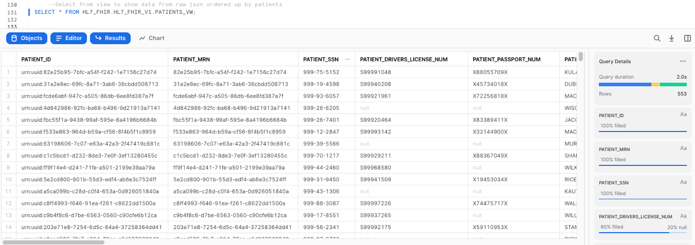

<!-- ------------------------ -->
## Use Masking Policies to Protect Confidential Data
Duration: 10

Now let's demostrate how you can leverage [Dynamic Data Masking](https://docs.snowflake.com/en/user-guide/security-column-ddm.html) to protect PII or HIPPA data by selecting different functional roles. To learn more about roles, please click [here](https://docs.snowflake.com/en/user-guide/security-access-control-overview.html).

Create one masking policy to protect PII and another one to protect HIPPA data by executing these two statements:

```sql
--Create masking policy for PII
CREATE OR REPLACE MASKING POLICY SIMPLE_MASK_PII_CHAR AS
  (VAL CHAR) RETURNS CHAR ->
  CASE
    WHEN CURRENT_ROLE() IN ('SYSADMIN') THEN VAL
      ELSE '***PII MASKED***'
    END;

 --Create masking policy for HIPPA    
 CREATE OR REPLACE MASKING POLICY SIMPLE_MASK_HIPAA_CHAR AS
  (VAL CHAR) RETURNS CHAR ->
  CASE
    WHEN CURRENT_ROLE() IN ('SYSADMIN') THEN VAL
      ELSE '***HIPAA***'
    END;
```
Now let's apply these policies to specific columns in our view to protect our data. These statements will apply the PII policy to our `PATIENTS_SSN` column, and the HIPPA policy to the `PATIENT_BIRTH_SEX` and `PATIENT_BIRTH_CITY` columns:

```sql
--Apply policies to specific columns
ALTER VIEW PATIENTS_VW MODIFY COLUMN PATIENT_SSN SET MASKING POLICY SIMPLE_MASK_PII_CHAR;
ALTER VIEW PATIENTS_VW MODIFY COLUMN PATIENT_BIRTH_SEX SET MASKING POLICY SIMPLE_MASK_HIPAA_CHAR;
ALTER VIEW PATIENTS_VW MODIFY COLUMN PATIENT_BIRTH_CITY SET MASKING POLICY SIMPLE_MASK_HIPAA_CHAR;
```

Our policies specify that if I query data from `PATIENTS_VW` using the SYS_ADMIN role, I should be able to see the unrestricted data. Let's see if this is accurate:

```sql
--Verify masking policy using SYSADMIN
USE ROLE SYSADMIN;

SELECT PATIENT_ID, PATIENT_MRN, PATIENT_SSN, PATIENT_DRIVERS_LICENSE_NUM, PATIENT_BIRTH_SEX, PATIENT_BIRTH_CITY FROM HL7_FHIR.HL7_FHIR_V1.PATIENTS_VW
LIMIT 100;
```
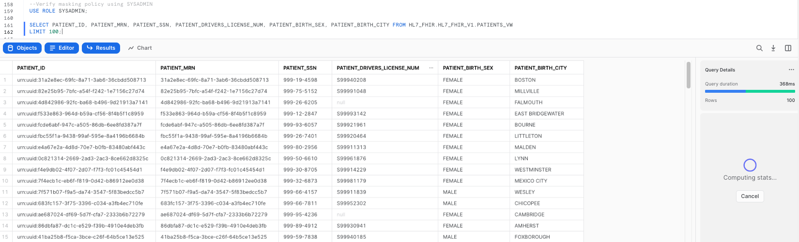

Our policies also specify that if I use ANY other role to query data from `PATIENTS_VW`, I should hit the masking policies. Let's make sure that's the case:

```sql
--Verify masking policy is applied and data is protected while a different role such as ACCOUNTADMIN
USE ROLE ACCOUNTADMIN;

SELECT PATIENT_ID, PATIENT_MRN, PATIENT_SSN, PATIENT_DRIVERS_LICENSE_NUM, PATIENT_BIRTH_SEX, PATIENT_BIRTH_CITY FROM HL7_FHIR.HL7_FHIR_V1.PATIENTS_VW
LIMIT 100;
```
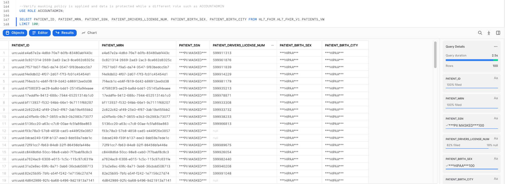

<!-- ------------------------ -->
## Analyze FHIR messages using Snowsight
Duration: 15

Once we have this data ready for analysis, let's create a couple of dashboards leveraging __Snowsight__, the exploratory visualization feature within Snowflake.

As a first step, let's create a new **Dashboard** in the Snowflake GUI. First we need to go to the __Dashboards__ section:

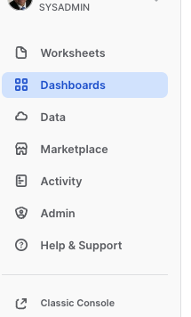

The following step is to create a new __Dashboard__ using the icon placed in the upper right corner:


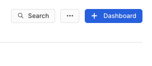

Please name the dashboard in any way you prefer. 

As a next step, let's make sure the right context is set to run the queries to populate the visualizations. We need to assign a role (SYSADMIN) and a compute warehouse (You can use the one you created earlier in the workshop):

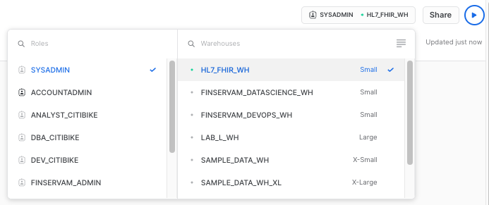 

Now click in the __+New Tile__ button to create our first visualization:

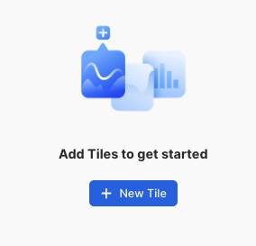

At this step, we also need to specify the __database__ and __schema__ that we will be using. Please select the ones we have been using in the workshop:

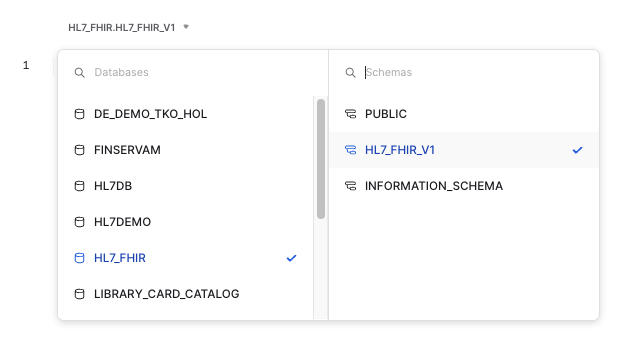 

To retrieve our initial dataset, please copy and paste the following query, which will give us a breakdown of patient conditions by gender:

```sql
--Patients by Condition by Gender
SELECT PATIENTS_VW.PATIENT_SEX, CONDITIONS_VW.CONDITION_DESC, COUNT(*) AS PATIENT_COUNT
FROM PATIENTS_VW
JOIN CONDITIONS_VW ON PATIENTS_VW.PATIENT_ID=CONDITIONS_VW.PATIENT_ID
GROUP BY PATIENT_SEX, CONDITION_DESC
ORDER BY PATIENT_COUNT DESC;
```

As we execute the query, we will get our results as a table:

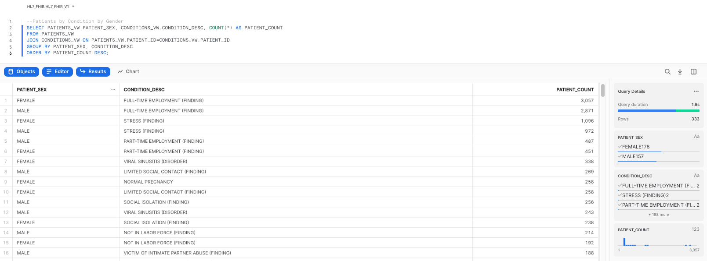 

As a next step, click on the __Chart__ button next to __Results__:

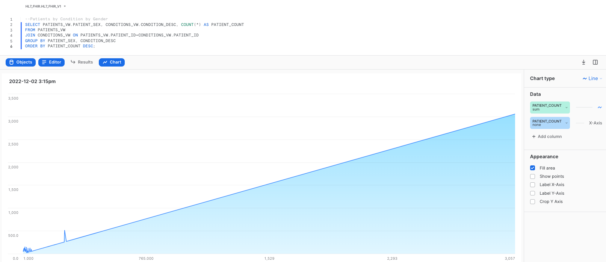 

In the right-hand side of the screen we see the chart properties. Please change the options to match the following settings:

__Chart Type__: Heatgrid   

__Cell Value__: PATIENT_COUNT

__Rows__: CONDITION_DESC

__Columns__: PATIENT_SEX

We encourage you to play around with the different settings and graphs to get familiar with the feature. Once done with the exploration, leave the settings/fields as displayed.

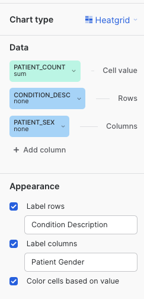 

&nbsp;  

Also, please rename the tile to `Patient Conditions by Gender`. This should give you a heatgrid visualizations as follows:

&nbsp;  

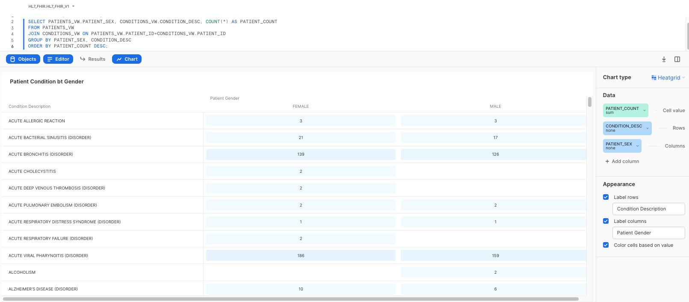 

&nbsp; 

Once completed, click on __Return to Dashboard__ in the upper left corner, to take a look at your dashboard. Once in the dashboard view, click on the __+__ button to add additional graphs to the dashboard, by clicking on __New Tile from Worksheet__:

&nbsp; 

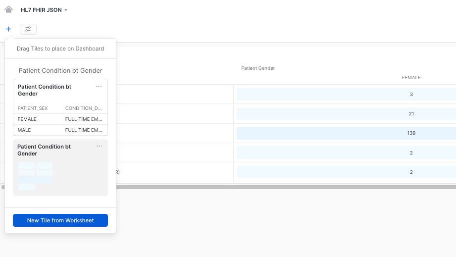 

&nbsp;

This will give us the option to repeat the process and configure additional graphs for our dashboard. Please use any other query of your preference to do this. Here we provide you a couple of query examples in case you need them:

&nbsp;

```sql
--Patients by Core Race
SELECT PATIENT_CORE_RACE, COUNT(*) AS PATIENT_COUNT
FROM PATIENTS_VW
GROUP BY PATIENT_CORE_RACE
ORDER BY PATIENT_COUNT DESC;
```

```sql
--Total Number of Patients
SELECT COUNT(*) AS TOTAL_NUMBER_OF_PATIENTS FROM PATIENTS_VW;

```

&nbsp;

Once you finish creating additional visualizations, you could have a dashboard like this, providing you graphic insights of your data:

&nbsp;

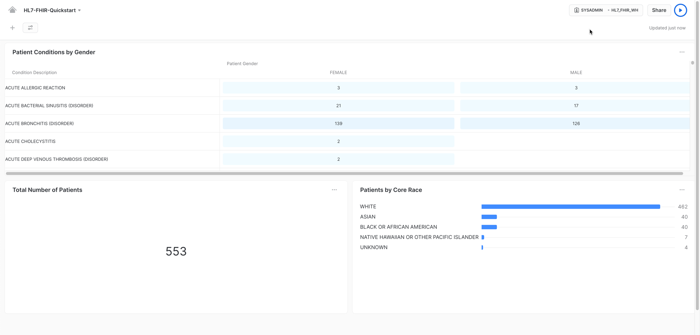 


<!-- ------------------------ -->
## Conclusion
Duration: 1


Congratulations! You used Snowflake to trasform your HL7 FHIR JSON messages using Snowflake native capabilities and gather valuable insights by using Snowsight's exploratory features.


### What we've covered
- Storing HL7 FHIR JSON messages with an __Internal Stage__ and __SnowSQL__
- Ingesting HL7 FHIR JSON messages with semi-structured data support
- Processing HL7 FHIR messages with Snowflake native capabilities 
- Displaying HL7 FHIR data with Snowsight


### Related Resources
- [Snowsight](https://docs.snowflake.com/en/user-guide/ui-snowsight.html)
- [Dynamic Data Masking](https://docs.snowflake.com/en/user-guide/security-column-ddm.html)
- [Flatten Function](https://docs.snowflake.com/en/sql-reference/functions/flatten.html)


