author: Sreedhar Bolneni, Venkatesh Sekar, Tushar Sarde
id: processing_hl7_v2_messages_with_snowflake
summary: This is a guide to get familiarised with how to ingest and process HL7 V2.x messages using Snowflake Data Programmability features.
categories: data-engineering,architecture-patterns,solution-examples
environments: web
status: Published 
feedback link: https://github.com/Snowflake-Labs/sfguides/issues
tags: Getting Started, Data Science, Data Engineering, Data Lake, Unstructured Data, Health & Life Sciences, HL7, FHIR 

# Getting Started - Processing HL7 V2 Messages with Snowflake
<!-- ------------------------ -->
## Overview 
Duration: 10

This Quickstart is designed to help you understand the capabilities included in Snowflake’s support for processing Healthcare HL7 V2.x messages. The labs will give you a view into how you can leverage Snowflake’s data programmability features to parse HL7 V2.x messages using Java UDTF, Java UDF, and Python UDF.

Sign up for a free 30-day trial of Snowflake and follow along with this lab exercise. After completing the labs, you’ll be ready to start processing and managing your own HL7 V2.x messages in Snowflake.

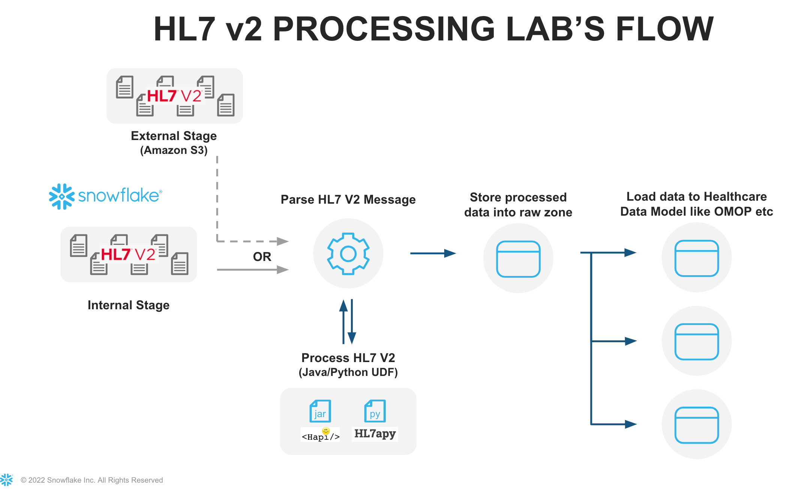


### Prerequisites
- Snowflake account
- Basic knowledge of SQL, database concepts, and objects
- Basic Python and Java knowledge
- Recommend to get familiarized with the [Snowflake User Interface](https://github.com/Snowflake-Labs/sfquickstarts/blob/master/site/sfguides/src/getting_started_with_snowflake/getting_started_with_snowflake.md)
- Recommended to also complete [Getting Started with SnowSQL](https://quickstarts.snowflake.com/guide/getting_started_with_snowsql/index.html?index=..%2F..index)


### What You’ll Learn
- How to ingest and process HL7 V2.x messages
- How to process HL7 V2.x messages using Java UDF's and UDTF's, Python UDF's. 


### What You'll Build
- A snowflake stage (internal) for storing and accessing HL7 V2.x in Snowflake.
- A user-defined function (UDF) and user-defined table functions (UDTF) using Snowflake's engine to process files.


<!-- ------------------------ -->
## Notice and Terms of Use
Duration: 1

The data provided for this lab is an extract from the Simhospital repository on github ([Simhospital dataset](https://github.com/google/simhospital/blob/master/docs/artifacts/messages.out)).


Use of the data provided is limited to this quickstart in connection with the Snowflake service and is subject to any additional terms and conditions on the Simhospital github repository.


By accessing this data, you acknowledge and agree to the limits and terms related to the use of the HL7 V2.x dataset.

### **Note:**
*The implementations provided here are at best MVP/Prototype versions, they are not of production quality. You are free to extend the functionality and improve the code as it fits your functionality.*

<!-- ------------------------ -->
## Prepare your lab environment
Duration: 10

If you haven't already, register for a [Snowflake free 30-day trial](https://trial.snowflake.com/). The Snowflake edition (Standard, Enterprise, Business Critical, e.g.), cloud provider (AWS, Azure, e.g.), and Region (US East, EU, e.g.) do not matter for this lab. We suggest you select the region which is physically closest to you and the Enterprise Edition, our most popular offering. After registering, you will receive an email with an activation link and your Snowflake account URL.


### Navigating to Snowflake User Interface
For this lab, you will use the latest Snowflake web interface.
1. Open a browser window and enter the URL of your Snowflake 30-day trial environment that was sent with your registration email.Log into your Snowflake trial account
2. Click on __Worksheets__ tab in the left-hand navigation bar. The ​Worksheets​ tab provides an interface for submitting SQL queries, performing DDL and DML operations, and viewing results as your queries or operations complete. 
3. A new worksheet is created by clicking __+ Worksheet__ on the top right.


### Download Data and Scripts
All source code for this guide can be found on [Snowflake Labs Github](<https://github.com/Snowflake-Labs/Snowflake-HL7V2-Parsing/>) 

We need to first download the following files to the local workstation by clicking on the hyperlinks below. The subsequent steps in the next section require [SnowSQL CLI](https://docs.snowflake.com/en/user-guide/snowsql.html) installed on the local workstation where the lab is ran.

#### Sample HL7 V2.x messages data file.
- [hl7_2-3_samples.txt](<https://github.com/Snowflake-Labs/Snowflake-HL7V2-Parsing/blob/main/src/test/data/hl7/hl7_2-3_samples.txt>)    - Sample HL7 V2.x messages data file.


#### Java UDF/UDTF related files and scripts
- [sf-hl7v2-parser-1.0-SNAPSHOT-jar-with-dependencies.jar](https://github.com/Snowflake-Labs/Snowflake-HL7V2-Parsing/blob/main/target/sf-hl7v2-parser-1.0-SNAPSHOT-jar-with-dependencies.jar)  - This implementation uses the [HL7 HAPI parser](https://hapifhir.github.io/hapi-hl7v2/) to parse the HL7 V2.x messages. Jar file includes all the dependencies.


#### Python UDF related files and scripts
- [hl7apy-1.3.4.tar.gz](<https://files.pythonhosted.org/packages/28/85/09438fc4b5d9598192010d04347de98dc9f4676661ccbba2695707c217f0/hl7apy-1.3.4.tar.gz>)  - This implementation uses the HL7APY python library, to parse the message into JSON format. The HL7APY v1.3.4 was used for this implementation.


- [hl7pyparserUDF.py](<https://github.com/Snowflake-Labs/Snowflake-HL7V2-Parsing/blob/main/src/main/python/hl7pyparserUDF.py>) - Snowflake HL7 Python UDF data processing code


Download all the files locally to your workstation.

**Local Files**

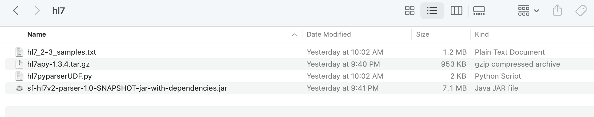


<!-- ------------------------ -->
## Store & Access HL V2.x Messages
Duration: 15

Let’s start by preparing to load the HL7 V2.x messages into Snowflake. Snowflake supports two types of stages for storing data files used for loading and unloading:
- [Internal stages](https://docs.snowflake.com/en/user-guide/data-load-overview.html#internal-stages) store the files internally within Snowflake.
- [External stages](https://docs.snowflake.com/en/user-guide/data-load-overview.html#external-stages) store the files in an external location (i.e. S3 bucket) that is referenced by the stage. An external stage specifies location and credential information, if required, for the bucket.


### Create a Database, Schema, and Warehouse
Before creating any stages, let’s create a database and a schema that will be used for loading the unstructured data. We will use the UI within the Worksheets tab to run the DDL that creates the database and schema. Copy the commands below into your trial environment, and execute each individually.


```sql
use role sysadmin;

create or replace database hl7db comment = 'HL7 Database';
create or replace schema hl7db.hl7v2demo;
create or replace warehouse quickstart warehouse_size = 'SMALL' initially_suspended = TRUE auto_suspend=60;


use database hl7db;
use schema hl7v2demo;
use warehouse quickstart;
```


<!-- ------------------------ -->
### Create Snowflake Stages to Ingest and Store HL7 V2.x Messages
Stages in Snowflake are locations used to store data. If the data that needs to be loaded into Snowflake is stored in other cloud regions like AWS S3 or Azure or GCP then these are called External stages whereas if the data is stored inside Snowflake then these are called Internal stages.

**Note:** For the purpose of this lab we are using Internal stage. You can do the same with External Stage.


### Store HL7 V2.x messages in an Internal Stage
You can store data and files directly in Snowflake with internal stages. Now, we want to create an internal stage and upload the files using SnowSQL CLI.

#### Create an Internal Stage
Run this command to create an internal stage called `hl7_stage_internal` as follows.


```sql
use schema hl7db.hl7v2demo;
-- Directory tables store a catalog of staged files in cloud storage.
create or replace stage hl7_stage_internal
   directory = ( enable = TRUE )
   comment = 'used for staging data & libraries';
```

#### Upload Files using SnowSQL to Internal Stage

Let's now upload the files downloaded to your workstation to Snowflake internal stage `hl7_stage_internal`. We will use **SnowSQL CLI** and **PUT** command to load all files. Before opening terminal, find out your account identifier which for the trial account will be.


For example, if the URL to access the trial account is `https://xx74264.ca-central-1.aws.snowflakecomputing.com/`. These are the values for the account identifier:


- Account identifier: `xx74264`

There may be additional segments if you are using your own account part of an organization. You can find those from the URL of your Snowflake account. Please check the [Snowflake Documentation](https://docs.snowflake.com/en/user-guide/admin-account-identifier.html#account-identifiers) for additional details on this topic.

For your convenience, use the below query to retrieve account identifier.

```sql
-- retrieve your Snowflake account identifier 
select replace(t.value:host::varchar,'.snowflakecomputing.com') as account_identifier 
from table(flatten(input => parse_json(system$allowlist()))) as t
where t.value:type::varchar = 'SNOWFLAKE_DEPLOYMENT_REGIONLESS';

```

Let's first prepare the snowflake internal stage structure. stage name is `hl7_stage_internal` and we have three sub directories in it `dataset`, `java_stage` and `python_stage`


- `dataset`   - contains sample HL7 data files.
- `java_stage`  - contains Java UDF/UDTF related code/dependencies jar file.
- `python_stage`  - contains external HL7apy lib tar file and UDF code.


**Internal Stage Files**

Using Snowsql upload the files.

```sql
-- Using a terminal window invoke snowsql.

snowsql -a <account-identifier> -u <username>

-- set the database/schema/warehouse context
use database hl7db;
use schema hl7v2demo;
use warehouse quickstart;

-- load sample hl7 data
put file:////<downloaded files folder path>/hl7_2-3_samples.txt @hl7_stage_internal/dataset/ auto_compress=false;

-- load java related code/dependencies jar
put file:////<downloaded files folder path>/sf-hl7v2-parser-1.0-SNAPSHOT-jar-with-dependencies.jar @hl7_stage_internal/java_stage/ auto_compress=false;

-- load external dependency python lib
put file:////<downloaded files folder path>/hl7apy-1.3.4.tar.gz @hl7_stage_internal/python_stage/ auto_compress=false;


-- load python UDF code
put file:////<downloaded files folder path>/hl7pyparserUDF.py @hl7_stage_internal/python_stage/ auto_compress=false;

```

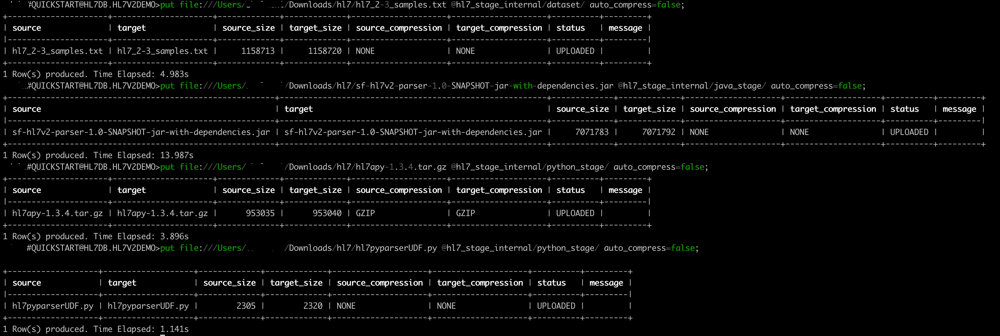


**Refresh Stage**

```sql
-- ensure to refresh the stage
alter stage hl7_stage_internal refresh;
```


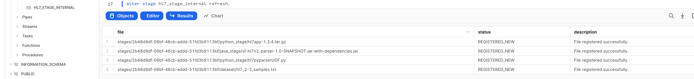


**List Files**


```sql
-- run this to verify the files shows up in the list
select *
from directory(@hl7_stage_internal);
```


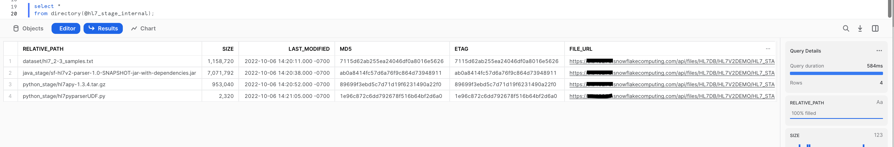


<!-- ------------------------ -->
## Processing HL7 messages using Java UDF & UDTF
Duration: 20

Java UDFs and UDTFs allow workloads expressed in Java to execute in Snowflake and therefore benefit from the virtually unlimited performance and scalability of the Data Cloud.   


**Create Java UDTF function**

A UDTF is a user-defined function (UDF) that returns tabular results. A Java UDTF specifies the Java data types of the output columns by defining an output row class. Each row returned from the UDTF is returned as an instance of the output row class. Each instance of the output row class contains one public field for each output column. Snowflake reads the values of the public fields from each instance of the output row class, converts the Java values to SQL values, and constructs a SQL output row containing those values.


#### Creating the Java UDTF
Now lets create the Java UDTF, this function will refer a HAPI library for parsing raw HL7 V2.x messages. The Java UDTF can be defined in Snowflake as below:

```sql
create or replace function hl7_hapi_parser(hl7_fl_url varchar ,validate_message boolean)
   returns table ( 
        parsed_status boolean, 
        raw_msg varchar, 
        hl7_xml varchar,  
        hl7_json variant,  
        message_type varchar, 
        message_version varchar, 
        message_sequence_num integer, 
        error_msg varchar 
    )
  language JAVA
  imports = ('@hl7_stage_internal/java_stage/sf-hl7v2-parser-1.0-SNAPSHOT-jar-with-dependencies.jar')
  handler = 'com.snowflake.labs.hl7.HL7UDTF'
  comment = 'Java based UDTF for parsing HL7v2 files.';
```
***Note: The above 'Create Java UDTF' function is implemented using snowflake internal stage, the same definition can be used for external stage by replacing the stage name <hl7_stage_internal>***

#### Parsing the HL7 data

```sql
-- Parse the file and store in a local table

create or replace table hl7v2parsed as 
  select * from (
  with base as (
      select 
          relative_path as data_filepath,
          build_scoped_file_url('@hl7_stage_internal/', data_filepath) as full_path
      from directory( @hl7_stage_internal )
      where relative_path like 'dataset/%'
  )
  select 
      full_path, p.* 
  from base as b
      ,table(hl7_hapi_parser(b.full_path, false) ) as p
);

-- verify the data inside the table
select * from hl7v2parsed;
```

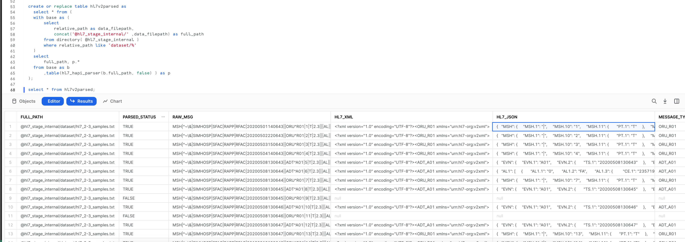

Lets run additional queries to analyze the data parsed.

```sql
-- Flatten the JSON Field to pull OBSERVATION (OBR) segment fields for one of the ORU messages

with base as (
    select hl7_json as msg
    from hl7v2parsed
  where message_sequence_num=1 and message_type='ORU_R01'
), oru_response_sgmt as (
    select 
        msg:"ORU_R01.RESPONSE" as oru_response
    from base
)
 select
    oru_response,
    oru_response:"ORU_R01.ORDER_OBSERVATION":"OBR":"OBR.4" as ob4,
    ob4:"CE.1" as ce_1,
    ob4:"CE.2"::string as ce_2,
    ob4:"CE.3"::string as ce_3
 from oru_response_sgmt as b;
```

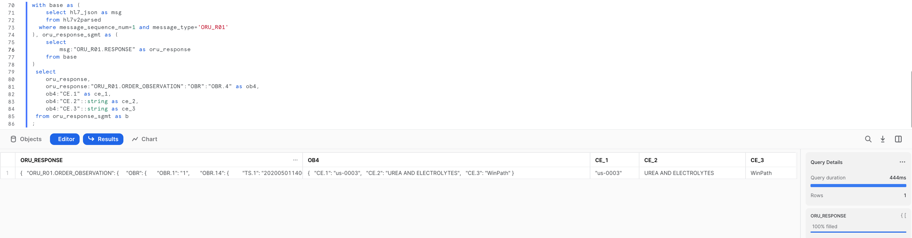

```sql
-- Flatten the JSON to pull OBSERVATION - Patient Report Text fields
with base as (
    select hl7_json as msg
    from hl7v2parsed
  where full_path like '%hl7_2-3_samples.txt' and message_type='ORU_R01'
)
 select
    msg,
    msg:"ORU_R01.RESPONSE":"ORU_R01.ORDER_OBSERVATION":"ORU_R01.OBSERVATION" as OBSERVATIONS,
    obx.value:"OBX":"OBX.5" as PATIENT_REPORT_TEXT
 from base,table(flatten(msg:"ORU_R01.RESPONSE":"ORU_R01.ORDER_OBSERVATION":"ORU_R01.OBSERVATION")) obx ;
```
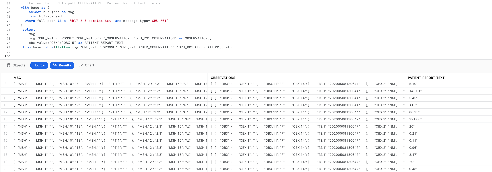

```sql
-- List out patient and physician interactions

with base as (
    select hl7_json 
    from hl7v2parsed
    where message_type = 'ORU_R01'
)
,patient_physician as (
    select 
        concat(
            f.value:"ORU_R01.PATIENT":"ORU_R01.VISIT":"PV1":"PV1.7":"XCN.2"::string, ' '
            ,f.value:"ORU_R01.PATIENT":"ORU_R01.VISIT":"PV1":"PV1.7":"XCN.3"::string) as physician
        ,concat(
            f.value:"ORU_R01.PATIENT":"PID":"PID.5":"XPN.1"::string, ' '
            ,f.value:"ORU_R01.PATIENT":"PID":"PID.5":"XPN.2"::string, ' '
            ,f.value:"ORU_R01.PATIENT":"PID":"PID.5":"XPN.3"::string, ' '
        ) as patient
    from base as b
        ,lateral flatten(input => hl7_json) as f
    where key like 'ORU_R01.RESPONSE'
    and patient is not null
)
select
    patient, physician
    ,count(*) as number_of_visits
from patient_physician
group by patient, physician
order by number_of_visits desc;
```

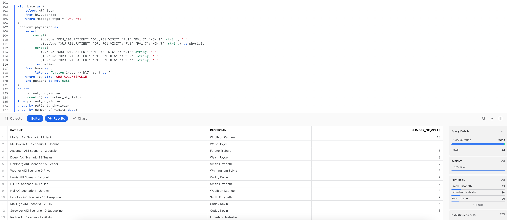

**Create Java UDF function**

A UDF (user-defined function) is a user-written function that can be called from Snowflake in the same way that a built-in function can be called.When a user calls a UDF, the user passes the name of the UDF and the parameters of the UDF to Snowflake. If the UDF is a Java UDF, Snowflake calls the appropriate Java code (called a handler method) in a JAR file. The handler method then returns the output to Snowflake, which passes it back to the client.

#### Creating the Java UDF
Ideally you would be using a Kafka connector, Snowpipe or other mechanisms to load the HL7 V2.x messages to Snowflake and then execute Java UDF for each raw HL7 V2.x message. For this lab we will simulate this by leveraging the HL7 V2.x raw messages loaded into the raw_msg column of hl7v2parsed table created in the previous section.

Now lets create the Java UDF, this function will refer a HAPI library for parsing raw HL7 V2.x messages. The Java UDF can be defined in Snowflake as below:

```sql
create or replace function hl7_hapi_udf_parser(hl7_msg varchar ,validate_message boolean)
returns variant
language java
imports = ('@hl7_stage_internal/java_stage/sf-hl7v2-parser-1.0-SNAPSHOT-jar-with-dependencies.jar')
handler = 'com.snowflake.labs.hl7.HL7UDF.process'
comment = 'Java based UDF for parsing HL7v2 messages.';
``` 

***Note: The above 'Create Java UDF' function is implemented using snowflake internal stage, the same definition can be used for external stage by replacing the stage name <hl7_stage_internal>***

#### Parsing the HL7 data

The previously loaded raw_hl7_table has each record as a single hl7v2 message in the raw_msg column.
The following query invokes the function, to parse the HL7 message file :

```sql
with base as (
    select
        raw_msg, -- column holding the HL7v2.x message in pipe delimited format
        hl7_hapi_udf_parser(raw_msg, false) as parsed
    from hl7v2parsed
    limit 10
)
select
    parse_json(parsed:"hl7_json") as hl7_json
from base;
```

The above query examples clearly demonstrates the beauty and simplicity of Snowflake's capabilities to parse and analyze the HL7 V2.x messages.


<!-- ------------------------ -->
## Processing HL7 messages using Python UDF 

User-defined functions (UDFs) let you extend the system to perform operations that are not available through the built-in, system-defined functions provided by Snowflake. Python UDFs (user-defined functions) allow you to write Python code and call it as though it were a SQL function


**Create Python UDF function**

Let's create a Python UDF function, this function will refer a hl7apy library for parsing raw messages. Using `imports` we can pass external library and python code. After executing `hl7pyparser` it will return a JSON messages and here in this example snowflake `variant` data type has been used to store JSON message.


```sql
create or replace function hl7pyparser(hl7_raw string)
returns variant
language python
runtime_version = 3.8
imports=('@hl7_stage_internal/python_stage/hl7apy-1.3.4.tar.gz', '@hl7_stage_internal/python_stage/hl7pyparserUDF.py')
handler = 'hl7pyparserUDF.udf'
comment = 'python based hl7v2 message parser';
```
***Note: The above 'Create Python UDF' function is implemented using snowflake internal stage, the same definition can be used for external stage by replacing the stage name <hl7_stage_internal>***

**File Format**

We will create a Snowflake FILE FORMAT to read the RAW data directly from the stage, more details about snowflake file format can be found here - [FILE FORMAT](https://docs.snowflake.com/en/sql-reference/sql/create-file-format.html#create-file-format)


```sql
CREATE FILE FORMAT "HL7DB"."HL7V2DEMO"."RAW_HL7_FILE_FORMAT"
   TYPE = 'CSV'
   COMPRESSION = 'NONE'
   FIELD_DELIMITER = 'NONE'
   RECORD_DELIMITER = '\n'
   SKIP_HEADER = 0
   FIELD_OPTIONALLY_ENCLOSED_BY = 'NONE'
   TRIM_SPACE = FALSE
   ERROR_ON_COLUMN_COUNT_MISMATCH = TRUE
   ESCAPE = 'NONE'
   ESCAPE_UNENCLOSED_FIELD = '\134'
   DATE_FORMAT = 'AUTO'
   TIMESTAMP_FORMAT = 'AUTO' NULL_IF = ('\\N');
```


Let's verify that our FILE FORMAT is correct and we are able to read files from stage. For now we will read raw message into single Column `RAW_MSG`.


Remember our data is stored inside dataset sub directory and we will aslo add pattern for reading only text files.


**Reading from stage**

```sql
select t.$1 as RAW_MSG from @hl7_stage_internal/dataset
   (file_format => 'RAW_HL7_FILE_FORMAT', pattern=>'.*.*[.]txt') t
   where RAW_MSG is not NULL;
```


Let's create a separate temporary table to store this raw data `raw`


```sql
CREATE TEMPORARY TABLE raw
AS SELECT t.$1 AS RAW_MSG FROM @hl7_stage_internal/dataset
   (file_format => 'RAW_HL7_FILE_FORMAT', pattern=>'.*.*[.]txt') t
   WHERE RAW_MSG IS NOT NULL;


-- verify data inside raw table
select * from raw;
```
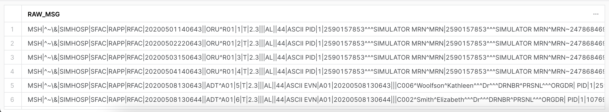


**Use UDF function**


Finally, let's use our UDF function `hl7pyparser` that we created  earlier.


```sql
select
   raw_msg,
   parse_json(hl7pyparser(raw_msg)) as JSON_MSG,
   parse_json(hl7pyparser(raw_msg)):msh:message_type:message_type:id as SRC
from raw
where src = 'ORU';
```


`raw_msg`


- Column contains RAW HL7 messages which we read earlier from the stage and from `raw` table


`parse_json(hl7pyparser(raw_msg)) as JSON_MSG`


- **parse_json** function will read the RAW HL7 messages from RAW_MSG column and it will convert it to JSON


`parse_json(hl7pyparser(raw_msg)):msh:message_type:message_type:id as SRC`


- To further flatten or parse the json column, we will use colon (`:`) between keys.


For example - `msh` is a root element in json string and `message_type` and `id` are nested keys (Inner elements in json)


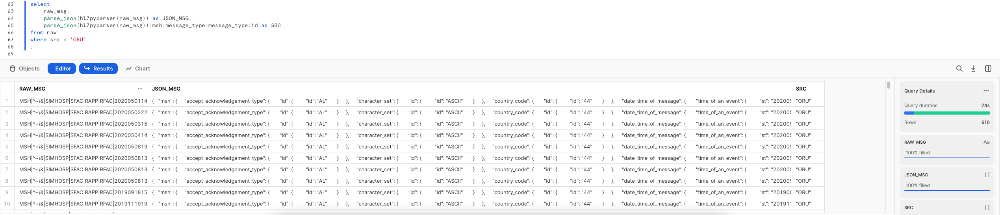


<!-- ------------------------ -->
## Conclusion
Duration: 1


Congratulations! You used Snowflake to trasform your HL7 V2.x messages using Snowflake Java UDFs/UDTFs and Python UDFs.


### What we've covered
- Storing HL7 V2.x messages with an __Internal Stage__ and __SnowSQL__
- Catalog HL7 V2.x messages data with __Directory Tables__
- Processing HL7 V2.x messages with a __Java UDF__ and __Java UDTF__
- Processing HL7 V2.x messages with a __Python UDF__ 
- Processing JSON HL7 data with __parse_json__ function


### Related Resources
- [Unstructured Data Docs](https://docs.snowflake.com/en/user-guide/unstructured.html)
- [Java UDF Docs](https://docs.snowflake.com/en/developer-guide/udf/java/udf-java.html)
- [Java UDTF Docs](https://docs.snowflake.com/en/developer-guide/udf/java/udf-java-tabular-functions.html#tabular-java-udfs-udtfs)
- [Python UDF Docs](https://docs.snowflake.com/en/developer-guide/udf/python/udf-python-introduction.html#introduction-to-python-udfs)
- [Python UDTF Docs](https://docs.snowflake.com/en/developer-guide/udf/python/udf-python-tabular-functions.html#implementing-user-defined-table-functions-udtfs-in-python)
- [Snowpark Docs](https://docs.snowflake.com/en/developer-guide/snowpark/index.html)
