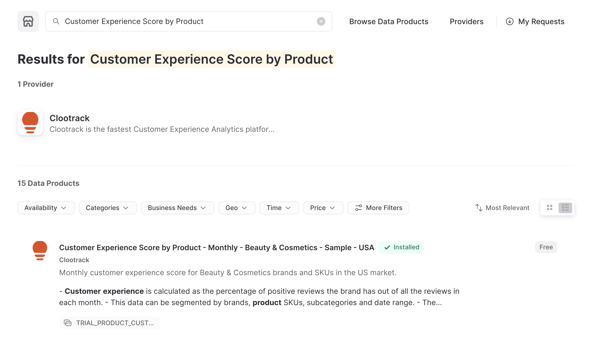
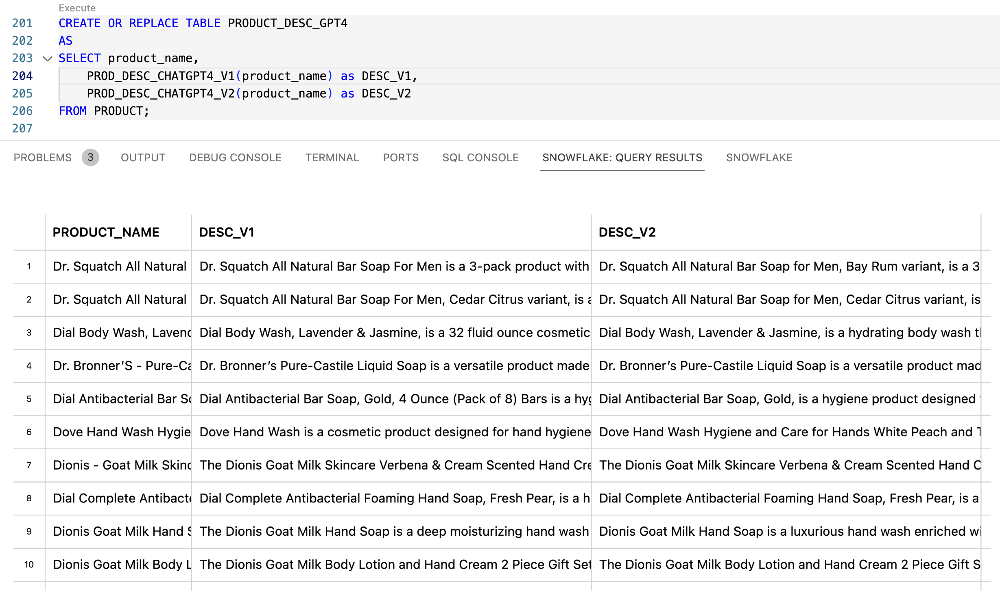
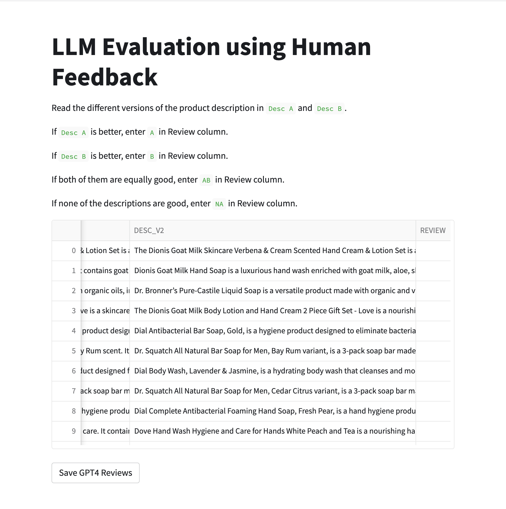

author: Vino Duraisamy
id: prompt_engineering_and_llm_evaluation
summary: This guide provides instructions to perform prompt engineering on your LLM models and to build a streamlit app for evaluating LLM responses using human feedback
categories: data-science-&-ml, app-development
environments: web
status: Hidden
feedback link: https://github.com/Snowflake-Labs/sfguides/issues
tags: Getting Started, Data Science, Generative AI, Snowflake External Access, OpenAI, LLMs, Streamlit, Snowflake Marketplace

# Prompt Engineering and Evaluation of LLM responses
<!-- ------------------------ -->
## Overview 

Duration: 5

This quickstart will cover the basics of prompt engineering on your Large Language Models (LLMs) and how to evaluate the responses of different LLMs through human feedback.

By completing this guide, you will learn how to run AI experimentation with different LLMs for your use case. First part of the quickstart focusses on using prompt engineering to generate different model responses by tweaking your prompts. The second part focusses on evaluating different LLM model responses through human feedback.

Here is a summary of what you will be able to learn in each step following this quickstart:

- **Setup Environment**: Setup your Snowflake Free Trial environment
- **Snowflake Marketplace**: Download the data you need from Snowflake Marketplace and use it in your analysis
- **Snowflake External Access**: Integrate LLMs such as GPT-3.5 and GPT4 to Snowflake using External Access
- **Prompt Engineering**: Use different prompts on an LLM and capture the responses into a Snowflake table
- **LLM Evaluation with Human Feedback**: Build a Streamlit App to compare and rate the LLM responses and capture the ratings in a Snowflake table
- **What's next?**: What other applications can you build for your industry and data, inspired from this quickstart?

Let's dive into the key features and technologies used in the demo, for better understanding.

### Key features & technology

- Large language models (LLMs)
- Prompt Engineering
- LLM Evaluation
- Snowflake External Access
- Snowflake Marketplace
- Streamlit

### What is a large language model (LLM)?

A large language model, or LLM, is a deep learning algorithm that can recognize, summarize, translate, predict and generate text and other content based on knowledge gained from massive datasets. Some examples of popular LLMs are [GPT-4](https://openai.com/research/gpt-4), [GPT-3](https://openai.com/blog/gpt-3-apps), [BERT](https://cloud.google.com/ai-platform/training/docs/algorithms/bert-start), [LLaMA](https://ai.facebook.com/blog/large-language-model-llama-meta-ai/), and [LaMDA](https://blog.google/technology/ai/lamda/).

### What is OpenAI?

OpenAI is the AI research and deployment company behind ChatGPT, GPT-4 (and its predecessors), DALL-E, and other notable offerings. Learn more about [OpenAI](https://openai.com/). We use OpenAI in this guide, but you are welcome to use the large language model of your choice in its place.

### What is Prompt Engineering?

A prompt is a natural language text that requests the Generative AI model to perform a specific task. Prompt Engineering is the process of guiding the AI model to generate a specific response by tweaking the prompt text. Prompt Engineering uses a mix of creativity and experimentation to identify the right set of prompts that ensures the AI model will return the desired response.

### What is LLM Evaluation?

Since Large Language Model outputs free form texts that may not have the ground truth, it can be difficult to evaluate the LLMs using traditional model metrics such as Accuracy, Precision, Recall, F1-Score, etc. There are multiple frameworks in development to evaluate the bias, toxicity and hallucination in LLM responses. However, the most popular and efficient method has been human-in-the-loop evaluation. That is, letting humans rate the model responses as helpful and right.

### What is Snowflake External Access?

[External Access](https://docs.snowflake.com/en/developer-guide/external-network-access/external-network-access-overview) helps to securely connect to the OpenAI API from [Snowpark](https://docs.snowflake.com/en/developer-guide/snowpark/index), the set of libraries and runtimes in Snowflake that run non-SQL code, including Python, Java and Scala. External Access provides flexibility to reach public internet endpoints from the Snowpark sandbox without any additional infrastructure setup.

### What is the Snowflake Marketplace?

The [Snowflake Marketplace](https://www.snowflake.com/en/data-cloud/marketplace/) provides users with access to a wide range of datasets from third-party data stewards, expanding the data available for transforming business processes and making decisions. Data providers can publish datasets and offer data analytics services to Snowflake customers. Customers can securely access shared datasets directly from their Snowflake accounts and receive automatic real-time updates.

### What is Streamlit?

Streamlit enables data scientists and Python developers to combine Streamlit's component-rich, open-source Python library with the scale, performance, and security of the Snowflake platform. Learn more about [Streamlit](https://streamlit.io/).

### What You Will Learn

- How to access data from Snowflake Marketplace and use it for your analysis
- How to use External Access to securely connect to the OpenAI API from Snowpark
- How to use different prompts on a Large Language Model and capture model responses in a Snowflake table
- How to build a Streamlit App to compare the model responses and capture the review in a Snowflake table

### Prerequisites

- A **Snowflake account** with ACCOUNTADMIN role access - [Sign-in or create a free trial account](https://signup.snowflake.com/)
- **Anaconda Terms & Conditions accepted**. See Getting Started section in [Third-Party Packages](https://docs.snowflake.com/en/developer-guide/udf/python/udf-python-packages.html#getting-started).
- **GitHub account** - If you don't already have a GitHub account you can create one for free. Visit the [Join GitHub](https://github.com/signup) page to get started.
- A **OpenAI account** or API key to another language model - [Sign-in or create an account](https://openai.com/)
  - [OpenAI API Key](https://platform.openai.com/account/api-keys)

<!-- ------------------------ -->

## Set up Snowflake

Duration: 5

Sign up for [Snowflake Free Trial](https://signup.snowflake.com/) and create an account. Log into [Snowsight](https://docs.snowflake.com/en/user-guide/ui-snowsight.html#) using your credentials to create tables, streamlit app and more.

> aside positive
> IMPORTANT:
>
> - If you use different names for objects created in this section, be sure to update scripts and code in the following sections accordingly.
>
> - For each SQL script block below, select all the statements in the block and execute them top to bottom.

### Create Databases, Tables and Warehouses

Run the following SQL commands to create the [warehouse](https://docs.snowflake.com/en/sql-reference/sql/create-warehouse.html), [database](https://docs.snowflake.com/en/sql-reference/sql/create-database.html) and [schema](https://docs.snowflake.com/en/sql-reference/sql/create-schema.html).

```sql
CREATE OR REPLACE DATABASE CUSTOMER_EXP_DB;
CREATE OR REPLACE SCHEMA CUSTOMER_EXP_SCHEMA;
CREATE OR REPLACE WAREHOUSE VINO_CUSTOMER_EXP_WH_M WAREHOUSE_SIZE='MEDIUM';
```

Run the following commands to change the scope to the database, schema and warehouse created above.

```sql
USE DATABASE CUSTOMER_EXP_DB;
USE SCHEMA CUSTOMER_EXP_SCHEMA;
USE WAREHOUSE VINO_CUSTOMER_EXP_WH_M;
```

<!-- ------------------------ -->

## Snowflake Marketplace

During this step, we will be loading customer experience data to Snowflake. But "loading" is really the wrong word here. Because we're using Snowflake's unique data sharing capability we don't actually need to copy the data to our Snowflake account with a custom ETL process. Instead we can directly access the weather data shared by Weather Source in the Snowflake Marketplace.

### Customer Experience data from Snowflake Marketplace

Let's connect to the data from Snowflake Marketplace by following these steps:

- Log into Snowsight
- Click on the `Marketplace` tab in the left navigation bar
- Enter `Customer Experience Score by Product` in the search box and click return
- Click on the `Sample - USA` listing title
- Click the blue `Get` button
  - Expand the `Options` dialog
  - Change the database name to read `CUSTOMER_EXP` (all capital letters)
  - Select the `ACCOUNTADMIN` role to have access to the new database
  - Click the blue `Get` button

---



---

That's it... we have the dataset to work with.

### Query the Marketplace data

Run the following queries to peek into the data we got from the Marketplace.

```sql
SELECT COUNT(*) as row_count 
FROM CUSTOMER_EXP.PUBLIC.TRIAL_PRODUCT_CUSTOMER_EXPERIENCE_VIEW;

SELECT * 
FROM CUSTOMER_EXP.PUBLIC.TRIAL_PRODUCT_CUSTOMER_EXPERIENCE_VIEW
LIMIT 5;
```

You can also view the shared database `CUSTOMER_EXP.PUBLIC.TRIAL_PRODUCT_CUSTOMER_EXPERIENCE_VIEW` by navigating to the Snowsight UI -> Data -> Databases.

### Copy the Marketplace data into our Database

The database and the view we got from the Marketplace are read-only. In order to be able to write data into the table, we need to copy `CUSTOMER_EXP.PUBLIC.TRIAL_PRODUCT_CUSTOMER_EXPERIENCE_VIEW` view into another table.

Run the following SQL command to create a new table and copy data into the new table

```sql
CREATE OR REPLACE TABLE CUSTOMER_EXP_REVIEWS (
    brand_name VARCHAR(100),
    product_name VARCHAR(1000),
    sub_category VARCHAR(100),
    positive_customer_exp NUMBER(10,2),
    sentence_count NUMBER(10),
    month STRING(15),
    year NUMBER(4),
    start_date DATE,
    end_date DATE
);

INSERT INTO CUSTOMER_EXP_REVIEWS
SELECT * 
FROM CUSTOMER_EXP.PUBLIC.TRIAL_PRODUCT_CUSTOMER_EXPERIENCE_VIEW;
```

Let us quickly review the data from the newly created table

```sql
SELECT COUNT(*) 
FROM CUSTOMER_EXP_REVIEWS;

SELECT *
FROM CUSTOMER_EXP_REVIEWS
LIMIT 5;
```

The table has several columns but the `product_name` column will be of interest to us. What if we used the LLMs to create a detailed product description from the product_name column? Let's do it.

Let us create a new table called `PRODUCT` to store the unique product names from the CUSTOMER_EXP_REVIEWS table.

```sql
CREATE OR REPLACE TABLE PRODUCT 
AS
SELECT DISTINCT product_name
FROM CUSTOMER_EXP_REVIEWS
LIMIT 10;

SELECT COUNT(*)
FROM PRODUCT;

SELECT * 
FROM PRODUCT;
```

> aside positive
> IMPORTANT:
>
> - If you used a different name for the database while getting weather data from the marketplace, be sure to update scripts and code in the following sections accordingly.

<!-- ------------------------ -->

## Use External Access

Duration: 10

In this implementation, we will use External Access to securely connect to the OpenAI API from Snowpark Python.

### Step 1

Create a [Secret](https://docs.snowflake.com/en/sql-reference/sql/create-secret) object in Snowflake to securely store your OpenAI API key.

```sql
CREATE OR REPLACE SECRET vino_open_ai_api
 TYPE = GENERIC_STRING
 SECRET_STRING = 'YOUR-OPENAI-API-KEY';
```

### Step 2

Create a [Network Rule](https://docs.snowflake.com/en/sql-reference/sql/create-network-rule) object in Snowflake.

```sql
CREATE OR REPLACE NETWORK RULE vino_apis_network_rule
 MODE = EGRESS
 TYPE = HOST_PORT
 VALUE_LIST = ('api.openai.com');
```

### Step 3

Create a [External Access Integration](https://docs.snowflake.com/en/sql-reference/sql/create-external-access-integration) object in Snowflake.

```sql
CREATE OR REPLACE EXTERNAL ACCESS INTEGRATION vino_external_access_int
 ALLOWED_NETWORK_RULES = (vino_apis_network_rule)
 ALLOWED_AUTHENTICATION_SECRETS = (vino_open_ai_api)
 ENABLED = true;
```

### Step 4

Create Snowpark Python function in Snowflake. Let us understand what this SQL query does:

- It uses Python 3.9 runtime
- It uses the package `openai`
- It uses the external access integration we created in the above step
- `complete_me()` function takes the query we pass, the prompt we have defined and invokes ChatCompletion API of OpenAI's `gpt-3.5-turbo` model
- It returns the model response in the end

```sql
CREATE OR REPLACE FUNCTION PROD_DESC_CHATGPT35_V1(query varchar)
RETURNS STRING
LANGUAGE PYTHON
RUNTIME_VERSION = 3.9
HANDLER = 'complete_me'
EXTERNAL_ACCESS_INTEGRATIONS = (vino_external_access_int)
SECRETS = ('openai_key' = vino_open_ai_api)
PACKAGES = ('openai')
AS
$$
import _snowflake
import openai
openai.api_key = _snowflake.get_generic_secret_string('openai_key')
model="gpt-3.5-turbo"
prompt="Explain in details what the ingredients and capabilities of this cosmetic product are. Limit the response to 150 words only. Here is the product:"
def complete_me(QUERY):
    messages=[
    {'role': 'user', 'content':f"{prompt} {QUERY}"}
    ]
    response = openai.ChatCompletion.create(model=model,messages=messages,temperature=0)    
    return response.choices[0].message["content"]
$$;
```

### **Call Function in Snowflake**

Assuming you have completed all the prerequites, calling the function is as simple as follow:

```sql
SELECT PROD_DESC_CHATGPT35_V1('Magnesium Lotion With Aloe Vera, Shea Butter, Coconut Oil & Magnesium Oil For Muscle Pain & Leg Cramps – Rich In Magnesium Chloride And Vitamin E Oil') as response;
```

***Sample response:*** *"This cosmetic product, the Magnesium Lotion with Aloe Vera, Shea Butter, Coconut Oil, and Magnesium Oil, is specifically designed to alleviate muscle pain and leg cramps. It contains a combination of key ingredients that work synergistically to provide relief and nourishment to the skin.The lotion is rich in Magnesium Chloride, a mineral known for its muscle relaxing properties. Magnesium Chloride helps to reduce muscle tension, ease cramps, and promote relaxation. Additionally, it aids in the absorption of magnesium into the body, which is essential for maintaining healthy muscle function.Aloe Vera is included in the formula for its soothing and moisturizing properties. It helps to calm irritated skin, reduce inflammation, and provide hydration.Shea Butter and Coconut Oil are both deeply moisturizing ingredients that help to nourish and soften the skin. They create a protective barrier that locks in moisture, leaving the skin feeling smooth and supple.Vitamin E Oil is added for its antioxidant properties, which help to protect the skin from free radicals and environmental damage.Overall, this Magnesium Lotion combines the benefits of Magnesium Chloride, Aloe Vera, Shea Butter, Coconut Oil, and Vitamin E Oil to provide relief from muscle pain and leg cramps while simultaneously nourishing and hydrating the skin."*

```sql
SELECT PROD_DESC_CHATGPT35_V1('Tandoori Mixed Grill') as response;
```

***Sample response:*** *"Tandoori Mixed Grill is not a cosmetic product, but rather a popular Indian dish consisting of a variety of marinated meats and vegetables cooked in a traditional clay oven called a tandoor. It typically includes ingredients such as chicken, lamb, fish, or shrimp, along with a blend of spices and yogurt-based marinade. The marinade is made using a combination of ingredients like ginger, garlic, turmeric, cumin, coriander, paprika, garam masala, and yogurt, which help to tenderize the meat and infuse it with rich flavors. The capabilities of Tandoori Mixed Grill lie in its ability to provide a delicious and aromatic culinary experience. The combination of spices and yogurt-based marinade not only enhances the taste of the meats and vegetables but also helps to tenderize and moisten them during the cooking process. The high heat of the tandoor oven imparts a smoky and charred flavor to the dish, giving it a unique and authentic taste. Tandoori Mixed Grill is often served with naan bread, rice, or a side salad, making it a satisfying and flavorful meal option."*

Very cool. Isn't it? Now we are able to call gpt-3.5-turbo model APIs from Snowflake. You can also use `GPT` model on your Snowflake data.

Now that we are able to access OpenAI's gpt model from Snowflake, let's go ahead and try out the Snowpark `PROD_DESC_CHATGPT35_V1` function on our Snowflake data.

<!-- ------------------------ -->
## Prompt Engineering

So far, we created a snowpark function to invoke the OpenAI's ChatCompletion APIs. We got access to the Customer Experience data from Marketplace. In this step, let us use the OpenAI APIs to generate detailed product descriptions for the products in our table.

### Prompt Engineering with GPT-3.5 model

Let us start with defining the `PROD_DESC_CHATGPT35_V1` function:

```sql
CREATE OR REPLACE FUNCTION PROD_DESC_CHATGPT35_V1(query varchar)
RETURNS STRING
LANGUAGE PYTHON
RUNTIME_VERSION = 3.9
HANDLER = 'complete_me'
EXTERNAL_ACCESS_INTEGRATIONS = (vino_external_access_int)
SECRETS = ('openai_key' = vino_open_ai_api)
PACKAGES = ('openai')
AS
$$
import _snowflake
import openai
openai.api_key = _snowflake.get_generic_secret_string('openai_key')
model="gpt-3.5-turbo"
prompt="Explain in details what the ingredients and capabilities of this cosmetic product are. Limit the response to 150 words only. Here is the product:"
def complete_me(QUERY):
    messages=[
    {'role': 'user', 'content':f"{prompt} {QUERY}"}
    ]
    response = openai.ChatCompletion.create(model=model,messages=messages,temperature=0)    
    return response.choices[0].message["content"]
$$;
```

Let's call this function with a sample query:

```sql
SELECT PROD_DESC_CHATGPT35_V1('Magnesium Lotion With Aloe Vera, Shea Butter, Coconut Oil & Magnesium Oil For Muscle Pain & Leg Cramps – Rich In Magnesium Chloride And Vitamin E Oil') as response;
```

***Sample response:*** *"This cosmetic product, the Magnesium Lotion with Aloe Vera, Shea Butter, Coconut Oil, and Magnesium Oil, is specifically designed to alleviate muscle pain and leg cramps. It contains a combination of key ingredients that work synergistically to provide relief and nourishment to the skin. The lotion is rich in Magnesium Chloride, a mineral known for its muscle relaxing properties. Magnesium Chloride helps to reduce muscle tension, ease cramps, and promote relaxation. Additionally, it aids in the absorption of magnesium into the body, which is essential for maintaining healthy muscle function. Aloe Vera is included in the formula for its soothing and moisturizing properties. It helps to calm irritated skin, reduce inflammation, and provide hydration. Shea Butter and Coconut Oil are both deeply moisturizing ingredients that help to nourish and soften the skin. They create a protective barrier that locks in moisture, leaving the skin feeling smooth and supple. Vitamin E Oil is added for its antioxidant properties, which help to protect the skin from free radicals and environmental damage. Overall, this Magnesium Lotion combines the benefits of Magnesium Chloride, Aloe Vera, Shea Butter, Coconut Oil, and Vitamin E Oil to provide relief from muscle pain and leg cramps while simultaneously nourishing and hydrating the skin."*

```sql
SELECT PROD_DESC_CHATGPT35_V1('Tandoori Mixed Grill') as response;
```

***Sample response:*** *"Tandoori Mixed Grill is not a cosmetic product, but rather a popular Indian dish consisting of a variety of marinated meats and vegetables cooked in a traditional clay oven called a tandoor. It typically includes ingredients such as chicken, lamb, fish, or shrimp, along with a blend of spices and yogurt-based marinade. The marinade is made using a combination of ingredients like ginger, garlic, turmeric, cumin, coriander, paprika, garam masala, and yogurt, which help to tenderize the meat and infuse it with rich flavors. The capabilities of Tandoori Mixed Grill lie in its ability to provide a delicious and aromatic culinary experience. The combination of spices and yogurt-based marinade not only enhances the taste of the meats and vegetables but also helps to tenderize and moisten them during the cooking process. The high heat of the tandoor oven imparts a smoky and charred flavor to the dish, giving it a unique and authentic taste. Tandoori Mixed Grill is often served with naan bread, rice, or a side salad, making it a satisfying and flavorful meal option."*

Our dataset contains only cosmetic products. So we want the LLM to generate descriptions for cosmetic products only. So let us tweak our prompt to achieve this.

After tweaking the prompt, let's create a new function `PROD_DESC_CHATGPT35_V2`.

```sql
CREATE OR REPLACE FUNCTION PROD_DESC_CHATGPT35_V2(query varchar)
RETURNS STRING
LANGUAGE PYTHON
RUNTIME_VERSION = 3.9
HANDLER = 'complete_me'
EXTERNAL_ACCESS_INTEGRATIONS = (vino_external_access_int)
SECRETS = ('openai_key' = vino_open_ai_api)
PACKAGES = ('openai')
AS
$$
import _snowflake
import openai

openai.api_key = _snowflake.get_generic_secret_string('openai_key')
model="gpt-3.5-turbo"
prompt="Explain in detail what the ingredients and capabilities of this cosmetic product are. Limit the response to 150 words only. Respond with OOPS!! it is not a beauty product if the product in question is not a cosmetic or a beauty product. Here is the product:"

def complete_me(QUERY):
    messages=[
    {'role': 'user', 'content':f"{prompt} {QUERY}"}
    ]
    response = openai.ChatCompletion.create(model=model,messages=messages,temperature=0)    
    return response.choices[0].message["content"]
$$;
```

Let's call this function with the same sample queries again:

```sql
SELECT PROD_DESC_CHATGPT35_V2('Magnesium Lotion With Aloe Vera, Shea Butter, Coconut Oil & Magnesium Oil For Muscle Pain & Leg Cramps – Rich In Magnesium Chloride And Vitamin E Oil') as response;
```

***Sample response:*** *"The Magnesium Lotion with Aloe Vera, Shea Butter, Coconut Oil, and Magnesium Oil is a beauty product designed to alleviate muscle pain and leg cramps. It contains a combination of ingredients that work synergistically to provide relief and nourishment to the skin.

Magnesium chloride is a key ingredient in this lotion, known for its ability to relax muscles and reduce muscle pain. It is easily absorbed through the skin, making it an effective topical treatment. Aloe Vera is included for its soothing and moisturizing properties, helping to calm irritated skin and promote healing. Shea butter and coconut oil are both rich in essential fatty acids and vitamins, providing deep hydration and nourishment to the skin. These ingredients help to improve skin elasticity and promote a healthy, youthful appearance. Vitamin E oil is added for its antioxidant properties, protecting the skin from free radicals and environmental damage. It also aids in reducing inflammation and promoting skin healing. Overall, this Magnesium Lotion combines the benefits of magnesium chloride, aloe vera, shea butter, coconut oil, and vitamin E oil to provide relief from muscle pain and leg cramps while nourishing and rejuvenating the skin."*

```sql
SELECT PROD_DESC_CHATGPT35_V2('Tandoori Mixed Grill') as response;
```

***Sample response:*** *"OOPS!! it is not a beauty product. The Tandoori Mixed Grill is not a cosmetic or beauty product. It is a popular Indian dish that consists of a variety of marinated and grilled meats and vegetables. The ingredients typically include chicken, lamb, and/or shrimp, along with a mixture of spices and yogurt-based marinade.The capabilities of the Tandoori Mixed Grill are centered around its delicious taste and flavor. The meats and vegetables are marinated in a blend of spices, such as cumin, coriander, turmeric, paprika, and garam masala, which gives them a rich and aromatic profile. The yogurt-based marinade helps to tenderize the meats and adds a creamy texture to the dish. When cooked in a tandoor oven or on a grill, the Tandoori Mixed Grill develops a smoky and charred flavor, while still retaining its juicy and tender texture. It is often served with naan bread, rice, and a side of mint chutney or raita. Overall, the Tandoori Mixed Grill is a flavorful and satisfying dish that showcases the vibrant and aromatic flavors of Indian cuisine."*

Interesting! For non-cosmetic products, the response is not right. Now let's generate product descriptions for all the products in our products table.

We have played around with only 2 versions of the prompts. You can iterate on the prompts as many times as you want until the model produces desired output.

### Prompt Engineering with GPT-4 model

Now, let us repeat the experiment but using GPT-4 model instead.

Let us start with defining the `PROD_DESC_CHATGPT4_V1` function:

```sql
CREATE OR REPLACE FUNCTION PROD_DESC_CHATGPT4_V1(query varchar)
RETURNS STRING
LANGUAGE PYTHON
RUNTIME_VERSION = 3.9
HANDLER = 'complete_me'
EXTERNAL_ACCESS_INTEGRATIONS = (vino_external_access_int)
SECRETS = ('openai_key' = vino_open_ai_api)
PACKAGES = ('openai')
AS
$$
import _snowflake
import openai
def complete_me(QUERY):
    openai.api_key = _snowflake.get_generic_secret_string('openai_key')
    messages = [{"role": "system", "content": "Explain in details what the ingredients and capabilities of this cosmetic product are. Limit the response to 150 words only. Here is the product: "}, {"role": "user", "content": QUERY}]
    model="gpt-4"
    response = openai.ChatCompletion.create(model=model,messages=messages,temperature=0,)    
    return response.choices[0].message["content"]
$$;
```

Let's call this function with the same sample queries again:

```sql
SELECT PROD_DESC_CHATGPT4_V1('Magnesium Lotion With Aloe Vera, Shea Butter, Coconut Oil & Magnesium Oil For Muscle Pain & Leg Cramps – Rich In Magnesium Chloride And Vitamin E Oil') as response;
```

***Sample response:*** *"This cosmetic product is a magnesium lotion enriched with Aloe Vera, Shea Butter, Coconut Oil, Magnesium Oil, Magnesium Chloride, and Vitamin E Oil. Magnesium Oil and Magnesium Chloride are known for their muscle relaxation properties, helping to alleviate muscle pain and leg cramps. Aloe Vera is renowned for its soothing and moisturizing capabilities, making the skin soft and supple. Shea Butter is a natural emollient that nourishes the skin deeply, while Coconut Oil provides hydration and prevents dryness. Vitamin E Oil is a powerful antioxidant that protects the skin from environmental damage and promotes healing. Together, these ingredients work synergistically to provide relief from muscle discomfort while enhancing the skin's overall health and appearance."*

```sql
SELECT PROD_DESC_CHATGPT4_V1('Tandoori Mixed Grill') as response;
```

***Sample response:*** *"It seems there's been a misunderstanding. Tandoori Mixed Grill is not a cosmetic product. It's a popular Indian dish that includes a variety of marinated meats like chicken, lamb, and shrimp, typically cooked in a tandoor, a traditional clay oven. The marinade usually contains yogurt and spices like turmeric, cumin, and coriander. However, if you have a cosmetic product you'd like information on, feel free to provide its details."*

The responses look appropriate. How can we tune the prompts even better?

Let's run the experiment again with an updated prompt, and define the `PROD_DESC_CHATGPT4_V2` function:

```sql
CREATE OR REPLACE FUNCTION PROD_DESC_CHATGPT4_V2(query varchar)
RETURNS STRING
LANGUAGE PYTHON
RUNTIME_VERSION = 3.9
HANDLER = 'complete_me'
EXTERNAL_ACCESS_INTEGRATIONS = (vino_external_access_int)
SECRETS = ('openai_key' = vino_open_ai_api)
PACKAGES = ('openai')
AS
$$
import _snowflake
import openai
def complete_me(QUERY):
    openai.api_key = _snowflake.get_generic_secret_string('openai_key')
    messages = [{"role": "system", "content": "You are an AI assistant who only knows about different cosmetic products and can explain in detail what the ingredients and capabilities of the product are. Limit the response to 150 words only. Here is the product: "}, {"role": "user", "content": QUERY}]
    model="gpt-4"
    response = openai.ChatCompletion.create(model=model,messages=messages,temperature=0,)    
    return response.choices[0].message["content"]
$$;
```

Let's call this function with the same sample queries again:

```sql
SELECT PROD_DESC_CHATGPT4_V2('Magnesium Lotion With Aloe Vera, Shea Butter, Coconut Oil & Magnesium Oil For Muscle Pain & Leg Cramps – Rich In Magnesium Chloride And Vitamin E Oil') as response;
```

***Sample response:*** *"Magnesium Lotion with Aloe Vera, Shea Butter, Coconut Oil & Magnesium Oil is a multi-functional cosmetic product. Magnesium Chloride, its key ingredient, is known for relieving muscle pain and leg cramps. Aloe Vera, a natural moisturizer, soothes and hydrates the skin. Shea Butter, rich in vitamins A and E, provides deep nourishment and promotes skin elasticity. Coconut Oil, packed with fatty acids, offers intense hydration and has anti-inflammatory properties. Magnesium Oil aids in muscle relaxation and helps improve skin health. Vitamin E Oil, a powerful antioxidant, protects the skin from damage and promotes healing. This lotion is a blend of natural ingredients designed to provide relief from muscle discomfort while enhancing skin health and vitality."*

```sql
SELECT PROD_DESC_CHATGPT4_V2('Tandoori Mixed Grill') as response;
```

***Sample response:*** *"I'm sorry for the confusion, but as an AI assistant specializing in cosmetic products, I can't provide detailed information about food items like Tandoori Mixed Grill. My expertise lies in explaining the ingredients and capabilities of cosmetic products such as skincare, makeup, haircare, and more. If you have any questions about a specific cosmetic product, feel free to ask!"*

### Comparing GPT-4 model responses from prompt engineering

After we experiment with different variation of prompts, we need a human in the loop to evaluate the LLM responses for each prompt.

So let's save the product names and the product descriptions generated by different model prompts in a Snowflake table. Copy, Paste and run the following query in your SQL worksheet to create the `PRODUCT_DESC_GPT4` table.

```sql
CREATE OR REPLACE TABLE PRODUCT_DESC_GPT4
AS
SELECT product_name, 
    PROD_DESC_CHATGPT4_V1(product_name) as DESC_V1,
    PROD_DESC_CHATGPT4_V2(product_name) as DESC_V2
FROM PRODUCT;

SELECT * 
FROM PRODUCT_DESC_GPT4;
```

---



---

Let us also add a `review` column to the table to store the human reviews of model responses.

```sql
ALTER TABLE PRODUCT_DESC_GPT4 ADD REVIEW STRING(2);
```

Fun part is you can work with Snowflake data and OpenAI models together using Snowflake External Access functionality.

<!-- ------------------------ -->

## LLM Evaluation with Human Feedback

Duration: 10

Follow these steps to build a Streamlit application in Snowsight.

**Step 1.** Click on **Streamlit** on the left navigation menu

**Step 2.** Click on **+ Streamlit App** on the top right

**Step 3.** Enter **App name**

**Step 4.** Select **Warehouse** (VINO_CUSTOMER_EXP_WH_M) and **App location** (Database as CUSTOMER_EXP_DB and Schema as CUSTOMER_EXP_SCHEMA)

**Step 5.** Click on **Create**

- At this point, you will be provided code for an example Streamlit application

*Step 6.** Replace sample application code displayed in the code editor on the left with the code provided in [llm_eval.py](link)

**Step 7.** Click on **Run** on the top right

If all goes well, you should see the application in Snowsight as shown below.

---



---

**Step 8.** In the Streamlit application, you can see the product name along with two different model responses. You can click on the description to read the entire text and write your feedback in the `review` column.

**Step 9.** Once you are done reviewing the responses, you could click on `Update Reviews` button to save the reviews in the `PRODUCT_DESC_GPT4` table.

Voila. It's done!

<!-- ------------------------ -->

## Conclusion and Resources

Duration: 3

Congratulations! You have successfully learnt the basics of prompt engineering on your Large Language Models (LLMs) and to evaluate the responses of different LLMs through human feedback by building an interative Streamlit Application.

### What you learned

- How to access data from Snowflake Marketplace and use it for your analysis
- How to use External Access to securely connect to the OpenAI API from Snowpark
- How to use different prompts on a Large Language Model and capture model responses in a Snowflake table
- How to build a Streamlit App to compare the model responses and capture the review in a Snowflake table

### Related Resources

Want to learn more about the tools and technologies used by your app? Check out the following resources:

- [Source Code on GitHub](https://github.com/Snowflake-Labs/sfguide-prompt-engineering-and-llm-evaluation)
- [External Access in Snowflake](https://docs.snowflake.com/en/developer-guide/external-network-access/external-network-access-overview)
- [OpenAI's Completions API](https://platform.openai.com/docs/api-reference/completions)
- [Demo on Snowflake Demo Hub](https://developers.snowflake.com/demos/generative-ai-llm-snowflake/)
- [Build powerful generative AI apps with Streamlit](https://streamlit.io/generative-ai)
