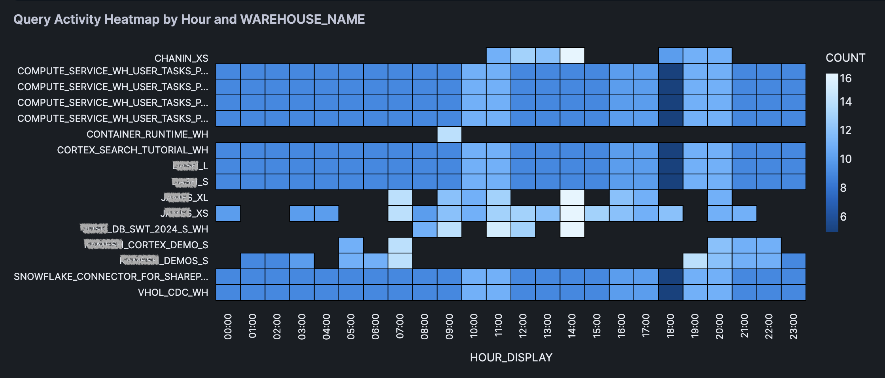

author: Chanin Nantasenamat
id: query-cost-monitoring
categories: snowflake-site:taxonomy/solution-center/certification/quickstart, snowflake-site:taxonomy/product/platform
language: en
summary: Learn how to build a Query Cost Monitoring tool using Snowflake, Streamlit, Pandas and Altair to analyze and visualize compute costs by individual queries. 
environments: web
status: Published
feedback link: https://github.com/Snowflake-Labs/sfguides/issues


# Build a Query Cost Monitoring Tool with Snowflake and Streamlit
<!-- ------------------------ -->
## Overview

Managing compute costs is crucial for optimizing database performance and budgeting effectively. In this tutorial, you'll build a Query Cost Monitoring tool that breaks down compute costs by individual queries using Snowflake's account usage data. This tool will help your team identify high-cost operations and gain valuable insights through interactive visualizations.

### What You'll Learn
- Retrieve and merge query cost data from Snowflake
- Convert SQL data to a Pandas DataFrame for analysis
- Implement interactive filtering with Streamlit widgets
- Create insightful visualizations using Altair

### What You'll Build
You'll create an interactive dashboard that displays compute costs per query, allowing users to filter data based on time duration, variables like warehouse name or user, and metrics such as query count or total credits used. The dashboard includes heatmaps, stacked bar charts, and bubble plots for comprehensive data exploration.

### Prerequisites
- Access to a [Snowflake account](https://signup.snowflake.com/?utm_source=snowflake-devrel&utm_medium=developer-guides&utm_cta=developer-guides)
- Basic knowledge of SQL and Python
- Familiarity with Pandas and Streamlit
- Internet connection to access GitHub and documentation resources

<!-- ------------------------ -->
## Setup

Firstly, to follow along with this quickstart, you can click on [query_cost_monitoring.ipynb](https://github.com/Snowflake-Labs/snowflake-demo-notebooks/blob/main/Query_Cost_Monitoring/Query_Cost_Monitoring.ipynb) to download the Notebook from GitHub.

Ensure that your notebook environment has access to the necessary Python libraries. Notebooks come pre-installed with common Python libraries for data science and machine learning, such as numpy, pandas, matplotlib, and more! If you are looking to use other packages, click on the Packages dropdown on the top right to add additional packages to your notebook.

<!-- ------------------------ -->
## Retrieve Query Cost Data

### Write the SQL Query

To gain insights into query costs, we'll write a SQL query to retrieve the `credits_used` data from the `snowflake.account_usage.metering_history` table and merge it with associated user, database, schema, and warehouse information from the `snowflake.account_usage.query_history` table.

Note that the following SQL cell name is `sql_data`, which we'll use shortly for the data app.

```sql
SELECT
  query_history.query_id,
  query_history.query_text,
  query_history.start_time,
  query_history.end_time,
  query_history.user_name,
  query_history.database_name,
  query_history.schema_name,
  query_history.warehouse_name,
  query_history.warehouse_size,
  metering_history.credits_used,
  execution_time/1000 as execution_time_s
FROM
  snowflake.account_usage.query_history
  JOIN snowflake.account_usage.metering_history ON query_history.start_time >= metering_history.start_time
  AND query_history.end_time <= metering_history.end_time
WHERE
  query_history.start_time >= DATEADD(DAY, -7, CURRENT_TIMESTAMP())
ORDER BY
  query_history.query_id;
```

This query merges the `query_history` with `metering_history` to obtain detailed information about each query, including the credits used and execution time over the past week.

The returned output looks like the following:


### Convert Table to a DataFrame

Next, we'll convert the retrieved SQL table to a Pandas DataFrame for easier manipulation and analysis.

```python
sql_data.to_pandas()
```

<!-- ------------------------ -->
## Create App & Data Preparation

Here, we'll create an interactive slider using Streamlit to dynamically select the number of days to analyze. 

This input will trigger the filtering of the DataFrame. Additionally, we'll reshape the data by calculating the frequency count by hour and selected variable, preparing it for visualization.

Finally, we'll make use of expandable boxes to display the DataFrames.

```python
import pandas as pd
import streamlit as st
import altair as alt

# Get data
df = py_dataframe.copy()

# Create date filter slider
st.subheader("Select time duration")

col = st.columns(3)

with col[0]:
    days = st.slider('Select number of days to analyze', 
                     min_value=1, 
                     max_value=7, 
                     value=7, 
                     step=1)
with col[1]:
    var = st.selectbox("Select a variable", ['WAREHOUSE_NAME', 'USER_NAME', 'WAREHOUSE_SIZE'])
with col[2]:
    metric = st.selectbox("Select a metric", ["COUNT", "TOTAL_CREDITS_USED"])

# Filter data according to day duration
df['START_TIME'] = pd.to_datetime(df['START_TIME'])
latest_date = df['START_TIME'].max()
cutoff_date = latest_date - pd.Timedelta(days=days)
filtered_df = df[df['START_TIME'] > cutoff_date].copy()
    
# Prepare data for heatmap
filtered_df['HOUR_OF_DAY'] = filtered_df['START_TIME'].dt.hour
filtered_df['HOUR_DISPLAY'] = filtered_df['HOUR_OF_DAY'].apply(lambda x: f"{x:02d}:00")
    
# Calculate frequency count and sum of credits by hour and query
agg_df = (filtered_df.groupby(['QUERY_ID', 'HOUR_DISPLAY', var])
          .agg(
              COUNT=('QUERY_ID', 'size'),
              TOTAL_CREDITS_USED=('CREDITS_USED', 'sum')
          )
          .reset_index()
)

st.warning(f"Analyzing {var} data for the last {days} days!")

# Initialize the button state in session state
if 'expanded_btn' not in st.session_state:
    st.session_state.expanded_btn = False

# Callback function to toggle the state
def toggle_expand():
    st.session_state.expanded_btn = not st.session_state.expanded_btn

# Create button with callback
st.button(
    '⊕ Expand DataFrames' if not st.session_state.expanded_btn else '⊖ Collapse DataFrames',
    on_click=toggle_expand,
    type='secondary' if st.session_state.expanded_btn else 'primary'
)

# State conditional
if st.session_state.expanded_btn:
    expand_value = True
else:
    expand_value = False

with st.expander("See Filtered DataFrame", expanded=expand_value):
    st.dataframe(filtered_df.head(100))
with st.expander("See Heatmap DataFrame", expanded=expand_value):
    st.dataframe(agg_df)
```

The above code snippet, yields the following data app:


<!-- ------------------------ -->
## Add Data Visualizations

Here, we'll generate a heatmap using Altair to visualize query activity by hour and the selected variable. Additional visualizations include a stacked bar chart and a bubble plot to provide multiple perspectives on the data.


### Heatmap
First, let's start with creating the heatmap: 

```python
## Heatmap
heatmap = alt.Chart(agg_df).mark_rect(stroke='black', strokeWidth=1).encode(
    x='HOUR_DISPLAY:O',
    y=alt.Y(f'{var}:N', 
            title='',
            axis=alt.Axis(
                labels=True,
                labelLimit=250,
                tickMinStep=1,
                labelOverlap=False,
                labelPadding=10
            )),
    color=f'{metric}:Q',
    tooltip=['HOUR_DISPLAY', var, metric]
).properties(
    title=f'Query Activity Heatmap by Hour and {var}'
)

st.altair_chart(heatmap, use_container_width=True)
```

The generated heatmap is shown below:



### Stacked Bar Chart
Next, on to creating the stacked bar chart:

```python
## Stacked bar chart with time series
bar_time = alt.Chart(agg_df).mark_bar().encode(
    x='HOUR_DISPLAY:O',
    y=f'{metric}:Q',
    color=alt.Color(f'{var}:N', legend=alt.Legend(orient='bottom')),
    tooltip=['HOUR_DISPLAY', var, metric]
).properties(
    title=f'Query Activity by Hour and {var}',
    height=400
)

st.altair_chart(bar_time, use_container_width=True)
```

The generated stacked bar chart is shown below:


### Bubble plot
Finally, we'll create the bubble plot and sizes are representing the metric magnitude:

```python
## Bubble plot with size representing the metric
bubble = alt.Chart(agg_df).mark_circle().encode(
    x='HOUR_DISPLAY:O',
    y=alt.Y(f'{var}:N', title=''),
    size=alt.Size(f'{metric}:Q', legend=alt.Legend(title='Query Count')),
    color=alt.Color(f'{var}:N', legend=None),
    tooltip=['HOUR_DISPLAY', var, metric]
).properties(
    title=f'Query Distribution by Hour and {var}',
    height=550
)

st.altair_chart(bubble, use_container_width=True)
```

The generated bubble plot is shown below:


<!-- ------------------------ -->
## Conclusion And Resources

Congratulations! You've successfully built a Query Cost Monitoring tool that allows you to analyze and visualize compute costs by individual queries. This dashboard empowers your team to identify high-cost operations and optimize database performance effectively.

### What You Learned
- Retrieved and merged query cost data from Snowflake's account usage views
- Converted SQL data into a Pandas DataFrame for analysis
- Implemented interactive filtering using Streamlit widgets
- Created heatmaps, stacked bar charts, and bubble plots with Altair for data visualization

### Related Resources

**Articles:**
- [Snowflake Account Usage Documentation](https://docs.snowflake.com/en/sql-reference/account-usage)
- [Snowflake Notebooks Guide](https://docs.snowflake.com/en/user-guide/ui-snowsight/notebooks-use-with-snowflake)

**Documentation:**
- [Snowflake Documentation](https://docs.snowflake.com/)
- [Streamlit Documentation](https://docs.streamlit.io/)

**Additional Reading:**
- [Altair User Guide](https://altair-viz.github.io/user_guide/data.html)

Happy coding!
