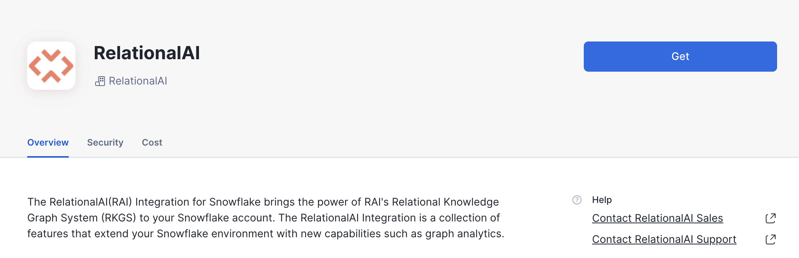
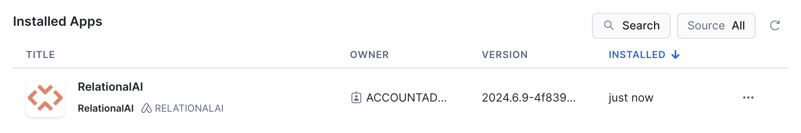
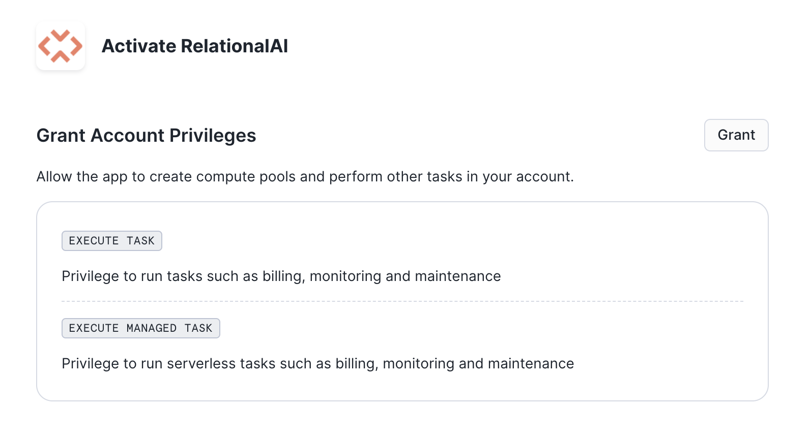
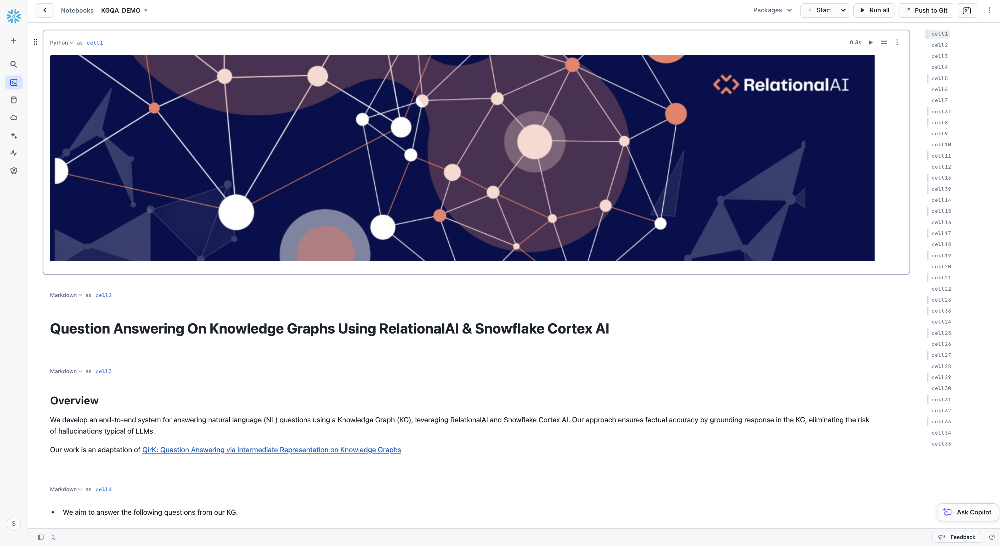

author: RelationalAI
id: kgqa_using_relationalai
summary: This guide shows how to use RelationalAI and Snowflake to create a system that lets a user ask and answer natural language questions on a custom knowledge graph.
categories: data-science, graph-analysis, relationalai, generativeai
environments: web
status: Published 
feedback link: https://github.com/RelationalAI/QuestionAnsweringKG/issues
tags: Getting Started, Data Science, Data Engineering, Twitter


# KGQA: Question Answering on Knowledge Graphs Using RelationalAI and Snowflake Cortex AI

<!-- ------------------------ -->
## Overview 
Duration: 1

Knowledge graphs are a useful structure to use to encode information about a particular domain. They allow for explicit inspection of the data encoded and the ability to reason over the relations. However, writing a query against a knowledge graph can be more challenging than other systems given that they generally lack a natural language interface. In order to query over a knowledge graph such as the one created by Wikidata, the user must know the specialized syntax of SPARQL as well as the knowledge graph representation of the entities and relations. For example, the concept of a hospital in wikidata is represented internally as Q16917.

In this quickstart, we will create a Snowflake service using Snowpark Container Services ( SPCS ), Snowflake's LLM service provided by their Cortex AI product and RelationalAI, a Knowledge Graph Coprocessor embedded inside of Snowflake, to allow a user to ask the following questions on a subset of Wikidata:

- List movies directed by John Krasinski?
- Name a movie directed by Quentin Tarantino or Martin Scorsese that has De Niro as a cast member
- Which movie's director was born in the same city as one of the cast members?

*This work is a partial reimplementation of the [QirK: Question Answering via Intermediate Representation on Knowledge Graphs paper](https://arxiv.org/abs/2408.07494). The implementation of the paper can be found [here](https://github.com/jlscheerer/kgqa/tree/main).*

### What Is RelationalAI?

RelationalAI is a cloud-native platform that enables organizations to streamline and enhance decisions with intelligence. RelationalAI extends Snowflake with native support for an expanding set of AI workloads (e.g., graph analytics, rule-based reasoning, and optimization), all within your Snowflake account, offering the same ease of use, scalability, security, and governance.

Users can build a knowledge graph using Python and materialize it on top of their Snowflake data, which are shared with the RelationalAI app through Snowflake Streams. Insights can be written to Snowflake tables and shared across the organization.

In our case, we will utilize RelationalAI’s Native App to construct an executable Knowledge graph over a subset of Wikidata to answer natural language queries. 


### What You will Learn

- Loading data from Snowflake into RelationalAI Model
- Interact with Snowpark Container Service using External Functions
- Utilize RelationalAI Python Library to execute queries
- Create a docker image and host it on Snowpark Container Service


### What You will Need
- A [Snowflake](https://www.snowflake.com/) Account
- An IDE (such as [Visual Studio Code](https://code.visualstudio.com/))
- A [Snowflake account](https://trial.snowflake.com/) with `ACCOUNTADMIN` and `KGQA_PUBLIC` access
    - Role "kgqa_public" in their snowflake account, which has ownership and usage access similar to "accountadmin". Follows ths steps mentioned [here](https://docs.snowflake.com/en/user-guide/security-access-control-configure#create-a-role) to create a new role. 
- Basic knowledge of using a Snowflake SQL Worksheet and Jupyter Notebook
- [Snowflake privileges on your user to install a Native Application](https://other-docs.snowflake.com/en/native-apps/consumer-installing#set-up-required-privileges)
- The [RelationalAI CLI](https://relational.ai/docs/reference/cli/)
- The [RAI KGQA Jupyter notebook](https://github.com/RelationalAI/QuestionAnsweringKG/blob/dev_v1/kgqa_demo_setup/kgqa_demo_nb/kgqa_demo.ipynb) used in this quickstart 
- [Docker Setup](https://docs.docker.com/desktop/install/mac-install/)


### What You will Build
- A Question Answering System on Knowledge Graphs using RelationalAI and Snowflake Cortex AI


<!-- ------------------------ -->

## Installing the RelationalAI Native App
Duration: 15

### Getting the native application

In the Snowflake Marketplace, search for the ‘RelationalAI' Native App and request it by clicking the 'Request' button. When your request is approved by the RelationalAI team, you'll see the RelationalAI app under 'Data Products' > 'Apps'. Click the 'Buy' button to install the app in your Snowflake account.



When the installation process is complete, you'll see RelationalAI in your list of installed apps:



Click on the RelationalAI app to open it. The first screen prompts you to grant the necessary privileges for the app to run:



The *Activate* button prompts you to activate the app:


Navigate back to the Data Products > Apps page and wait for the spinner in the INSTALLED column to stop running. When it’s done you’ll see “1 minute ago” in that column.

Congratulations! The RelationalAI app is now available in your Snowflake account.

### Setup

> aside negative
>
> Go to https://app.snowflake.com and select + Create Projects > Notebook > Click on "+ Notebook" to create a new notebook
> We recommend **running each cell separately** instead of using the "Run All" feature.

#### Step 1 - Share Continuous Telemetry Data

To receive support from RelationalAI, you must opt-in to share continuous telemetry data. Telemetry is written to your account’s active [event table](https://docs.snowflake.com/en/developer-guide/logging-tracing/logging-tracing-overview). This telemetry contains operational information such as internal system logs or engine sizes and usage data such as model attributes or obfuscated query plan information. Customer data and personally identifiable information are not included in continuous telemetry data.


> aside positive
>
> Note that the `ACCOUNTADMIN` role is used in this guide. This role is needed only for the event-table related operations in Step 1 and the network rule in Step 4. To manage roles specific the RelationalAI Native App, see Appendix 3 at the bottom of this notebook.

```sql
USE ROLE ACCOUNTADMIN;
```

##### Step 1A - Set Up an Event Table

The following code block checks whether you have an event table already set up on your account. If you don't have one, it will set one up for you.


```python
# python cell

session = get_active_session()

event_table_query = "SHOW PARAMETERS LIKE 'event_table' in ACCOUNT;"

event_tables = session.sql(event_table_query).collect()

def set_up_event_table():
    event_db_name = "TELEMETRY"
    event_schema_name = "PUBLIC"
    event_table_name = "EVENTS"

    event_db_schema = f"{event_db_name}.{event_schema_name}"
    event_db_schema_table = f"{event_db_schema}.{event_table_name}"

    for command in [
        f"CREATE DATABASE IF NOT EXISTS {event_db_name};",
        f"CREATE SCHEMA IF NOT EXISTS {event_db_schema};",
        f"CREATE EVENT TABLE IF NOT EXISTS {event_db_schema_table};",
        f"ALTER ACCOUNT SET EVENT_TABLE = {event_db_schema_table};",
    ]:
        session.sql(command).collect()

if len(event_tables) == 0 or event_tables[0].value == "":
    set_up_event_table()
```

Now that you've set up an event table, you can enable telemetry sharing.

By running the next code block, you consent to and enable sharing continuous telemetry data with RelationalAI.

```sql
-- SQL cell

ALTER APPLICATION relationalai SET SHARE_EVENTS_WITH_PROVIDER = TRUE;
```

#### Step 2 - Create the RAI service

The *Grant* button under *Data Products > Apps > RelationalAI* in Snowsight runs the following SQL command to grant the necessary permissions to the app. If you haven't clicked that button yet, you can run the code here instead. It doesn't hurt to run it again if you're not sure.

```sql
-- SQL cell

GRANT EXECUTE TASK, 
      EXECUTE MANAGED TASK, 
      CREATE COMPUTE POOL, 
      CREATE WAREHOUSE 
      ON ACCOUNT TO APPLICATION RELATIONALAI;
```

Now execute the following cell to create the RAI service (this usually takes between 5 and 15 minutes):

```python
# python cell

import sys
import time
import json
import itertools

def poll(f):

    last_message = ""
    dots = itertools.cycle(["⠧", "⠏", "⠛", "⠹", "⠼", "⠶"])

    def status(message):
        spaces = " " * (len("⠿ " + last_message) - len(message))
        sys.stdout.write("\r" + message + spaces)
        sys.stdout.flush()
    
    for ctr in itertools.count():
        if ctr % 10 == 0:
            result = f()
            if isinstance(result, str):
                message = next(dots) + " " + result
                status(message)
                last_message = result
            if result is True:
                status("⠿ Done!")
                return
        else:
            message = next(dots) + " " + last_message
            status(message)
        time.sleep(0.5)
```

```python
# python cell

def create_service():
    try:
        session.sql("CALL RELATIONALAI.APP.CREATE_SERVICE();").collect()
        return True
    except Exception as e:
        if "Unknown user-defined function" in str(e):
            return "Waiting for app installation to complete..."
        else:
            raise e

poll(create_service)
```

```python
# python cell

def check():
    result = session.sql("CALL RELATIONALAI.APP.SERVICE_STATUS();").collect()
    status = json.loads(result[0]["SERVICE_STATUS"])[0]["message"]
    if status.startswith("Readiness probe"):
        status = "Almost done"
    if status == "Running":
        return True
    else:
        return status + "..."

poll(check)
```
> aside negative
>
> **IMPORTANT**
> While RelationalAI is in preview mode, you must upgrade the application weekly after RAI releases an updated native app. Please review the [Upgrades](https://relational.ai/docs/native_app/upgrades) section of the RelationalAI Native App documentation and subscribe to the release notes to receive notifications about new versions.

#### Step 3 - Setting up Change Data Capture

Streams share Snowflake data with the RAI Native App using change data capture (CDC) to capture source table and view changes once every minute.

To enable CDC, an engine needs to be configured to be the CDC engine.

We start by creating an engine of size `HIGHMEM_X64_S` that we call `demo_engine`. This step usually takes between 1 and 5 minutes.

```sql
-- SQL cell

CALL RELATIONALAI.API.CREATE_ENGINE('demo_engine', 'HIGHMEM_X64_S');
```

Once the engine creation has finished, we set this engine to be the CDC engine:


```sql
-- SQL cell

CALL RELATIONALAI.APP.SETUP_CDC('demo_engine');
```

#### Step 4 - Setting up Snowflake Notebooks

To use RelationalAI in Snowflake Notebooks, run the cell below to set up a network rule that will allow the app to pass query results back to the notebook.

To enable users who aren't account administrators to run RelationalAI in Snowflake Notebooks, see Appendix 3 for how to create a `rai_user` role and grant access to this integration.

```python
# python cell

session = get_active_session()

system_allowlist = session.sql("""
SELECT value:host AS URL
FROM TABLE(FLATTEN(input=>parse_json(SYSTEM$ALLOWLIST())))
WHERE value:type = 'STAGE'
""").collect()

if system_allowlist:
    urls = ", ".join(row.URL.replace('"', "'") for row in system_allowlist)
    egress_rule_commands = [
        f"""
        CREATE OR REPLACE NETWORK RULE S3_RAI_INTERNAL_BUCKET_EGRESS
        MODE = EGRESS
        TYPE = HOST_PORT
        VALUE_LIST = ({urls});
        """,
        """
        CREATE OR REPLACE EXTERNAL ACCESS INTEGRATION S3_RAI_INTERNAL_BUCKET_EGRESS_INTEGRATION
        ALLOWED_NETWORK_RULES = (S3_RAI_INTERNAL_BUCKET_EGRESS)
        ENABLED = true;
        """
    ]

    for command in egress_rule_commands:
        session.sql(command).collect()

    print("Network rule set up successfully.")
```

Congratulations! Your RelationalAI app is ready to use.

#### Next Steps

To get up and running with RelationalAI in Snowflake Notebooks, download the [Simple Start Snowflake Notebook](https://relational.ai/notebooks/simple-start-snowflake.ipynb), upload it to your Snowflake account (https://app.snowflake.com > + icon in left sidebar > Notebooks > Import .ipynb file), and follow the instructions in the notebook.

To use a local Python installation instead, download the [Simple Start Jupyter notebook](https://relational.ai/notebooks/simple-start.ipynb) and follow the [instructions for running the notebook](https://relational.ai/docs/example_notebooks#instructions).

For a more detailed example and more information about the RelationalAI Python library, check out the [Getting Started guide](https://relational.ai/docs/getting_started).

Links:

- Simple Start Notebook: https://relational.ai/notebooks/simple-start.ipynb
- Example Notebooks: https://relational.ai/docs/example_notebooks
- Docs: https://relational.ai/docs

##### APPENDIX 1 - Drop the RAI Service and delete all engines

To reduce costs when you are not using the RAI Native App, suspend CDC, delete all engines, and drop the service.


> aside negative
>
> Note that this task requires the `app_admin` application role.


```python
# python cell

session = get_active_session()
# note: the use of `skip_appendix` in the Appendices makes the "Run All"
# feature skip these cells
skip_appendix = True
```

```python
# python cell

# Suspend CDC
if not skip_appendix:
    session.sql("CALL RELATIONALAI.APP.SUSPEND_CDC();").collect()

```

```python
# python cell

# Delete all engines
if not skip_appendix:
    for engine in session.sql("SELECT * FROM RELATIONALAI.API.ENGINES;").collect():
        engine_name = engine.NAME
        print(f"Deleting engine: {engine_name}")
        session.sql(f"CALL RELATIONALAI.API.DELETE_ENGINE('{engine_name}', TRUE);")
        print("Done")
```

```python
# python cell

# Drop the service
if not skip_appendix:
    session.sql("CALL RELATIONALAI.APP.DROP_SERVICE();").collect()
```

##### APPENDIX 2 - Resume Service and Re-create Engine

```python
# python cell

# Recreate service after dropping it
if not skip_appendix:
    session.sql("CALL RELATIONALAI.APP.CREATE_SERVICE();").collect()
```

```python
# python cell

if not skip_appendix:
    session.sql("CALL RELATIONALAI.API.CREATE_ENGINE('demo_engine', 'HIGHMEM_X64_S');").collect()
    session.sql("CALL RELATIONALAI.APP.RESUME_CDC();").collect()
```

##### APPENDIX 3 - Defining a RelationalAI User Role

- We start by creating a new role that can be granted to any users permitted to use this application.
- We then link the application's user role to this new role. Note that it is possible to create more fine-grained roles at a later stage.
- Finally, we grant `MONITOR` permissions on the role to allow users to see engine compute pools. This is needed for the relationalai Python library to manage engines.

```python
# python cell

if not skip_appendix:
    # Create a role for accessing the app
    session.sql("CREATE ROLE rai_user;").collect()
    
    # Link the app's user role to the created role.
    session.sql("GRANT APPLICATION ROLE relationalai.all_admin TO ROLE rai_user;").collect()

    # Grant USAGE on the egress integration to the role
    # This is necessary for users with the `rai_user` role to be able to
    # run the app in Snowflake Notebooks
    session.sql("GRANT USAGE ON INTEGRATION S3_RAI_INTERNAL_BUCKET_EGRESS_INTEGRATION TO ROLE rai_user;").collect()
```

> aside positive
> 
> Further information
>
> Refer to the [documentation](https://relational.ai/docs/native_app/installation) for full instructions and more details about how to use the RelationalAI Native App.

<!-- ------------------------ -->

## Architecture Diagram


Users may already have  their data in Snowflake. RelationalAI runs within the user's Snowflake account, creating a graph index over the Snowflake tables.  This allows a user to create a RelationalAI model in python. This model can be interpreted as an executable Knowledge Graph. When a user asks a natural language question, the system generates a RelationalAI Python query that is then executed and retrieves the relevant answers to the user. Our system is hosted on a Snowpark Container, and uses  Snowflake’s Cortex AI.  In summary, our solution leverages data in Snowflake tables, CortexAI to translate natural language to queries, and RelationalAI’s Native App to construct  an executable Knowledge graph that answers  these queries.

 
<!-- ------------------------ -->

## Example Walkthrough
Duration: 2


- The end-to-end pipeline begins with a natural language question set by the end user. For instance, consider the question: “List the movies directed by John Krasinski.” The goal is to answer this question by using the information in the Wikidata Knowledge Graph. 
- Our system transforms the question into a structured language called Intermediate Representation ( IR ).  The IR identifies and represents the relevant entities and their relationships. We use Snowflake Cortex AI to generate the Intermediate Representation. IR’s syntax resembles first order logic: the natural language question will be translated to  (m such that John Krasinski is the director of m ) : “m : director(m, ‘John Krasinski’)”. Note, this presumes there exists an entry in our dataset that contains all of the directors by name. We resolve this in the next step.
- IR represents the keywords in the framed question logically. Here the keywords are “director” and “John krasinski”. We use similarity search ( Facebook AI Similarity - FAISS ) to match these keywords to their closest equivalent  entities and relationships in the underlying Wikidata Knowledge Graph. 
    - In this example, we retrieve the top two most similar results for each keyword. 
    - For each match, there is a corresponding ID, which is the Wikidata ID assigned to each property and entity.
    - So here :
        - “director” is mapped to [ “director” (P57) and “director of photography” (P344)]
        - “John Krasinski” is mapped to [“John Krasinski” (Q313039) and “John Carpenter” (Q95008) ]
    - As we can see, Similarity Search returns the top 2 potential matches for each keyword. These matches are then checked against the Knowledge Graph, and the match that satisfies all the query criteria and exists in the underlying Knowledge Graph is presented as the probable answer - in this case, “director” and “John Krasinski” which are the desired outputs. 
    - Note that we began with a natural language question, and the system was able to map it to the corresponding Wikidata IDs on its own.
- The natural language question, Intermediate Representation, and similarity search results are then fed as input to Snowflake Cortex AI which outputs the RelationalAI Python query. 
- This query is then directly executed on RelationalAI’s Model and the result is returned to the user.  Based on the current Wikidata snapshot, "A Quiet Place" is the expected answer for this question.

Note that everything runs securely in the user’s  Snowflake account on snowpark container services. Given that at the end we are executing a query on a Knowledge Graph, the answer is guaranteed to exist in our dataset, otherwise nothing will be returned.


<!-- ------------------------ -->

## Demo Setup
Duration: 25

Follow the below steps to launch End-to-End Demo Setup.

> **_NOTE:_** User's Role permissions <br>
> Users should have access to role "kgqa_public" in their snowflake account, which has ownership and usage access similar to "accountadmin". Follows ths steps mentioned [here](https://docs.snowflake.com/en/user-guide/security-access-control-configure#create-a-role) to create a new role. 
 
#### SETTING THE ENVIRONMENT VARIABLES

**Here, <your_project_repository> is the path to the local directory where <git_repo> has been cloned.**

```sh
export SETUP_PATH="<your_project_directory>/KGQA_DEMO/kgqa_demo_setup"
```


#### STEP 1 : Navigate to the KGQA_SETUP FOLDER
```sh
cd $SETUP_PATH
```

#### STEP 2 : Populate all Snowflake config parameters 

- Update the config parameters in the config file ['config.json'](https://github.com/RelationalAI/QuestionAnsweringKG/blob/main/KGQA_DEMO/kgqa_demo_setup/config.json)

> **_NOTE:_** Anything prefixed with 'temp_' can be customized by the user, along with Snowflake 'account' and 'sf_login_email'. 

**Everything else should remain unchanged.**

#### STEP 3 : Initializing database in Snowflake - *Copy Paste Output to SF Worksheet and Run*

*Execute the below sf_db_initialization script to produce SQL File to load and populate the Database and Tables in Snowflake ( copy-paste on Snowflake SQL Worksheet and Run)*

```sh
python3 $SETUP_PATH/setup.py --config $SETUP_PATH/config.json --output_dir $SETUP_PATH/ sf_db_initialization
```

This step will automatically download [triplets](https://kgqa-wikidata.s3.us-east-2.amazonaws.com/wiki_sample_snapshot/claims.csv) and [labels](https://kgqa-wikidata.s3.us-east-2.amazonaws.com/wiki_sample_snapshot/labels.csv) files from AWS S3 Bucket and load the data in Snowflake.

> **_NOTE:_** To execute SQL commands in Snowflake Worksheet, you first need to select a database. Initially, this could be any database. Later in the script, you will create a custom database and switch to it for subsequent commands.

#### STEP 4 : Image Repository Creation - *Copy Paste Output to SF Worksheet and Run*

An Image Repository in Snowflake is a storage location where you can store and manage container images. These images are like snapshots of applications and their environments, which can be run on Snowflake's platform.

*Execute the below create_image_repo script to produce SQL File to create Image Repository on Snowflake ( copy-paste on Snowflake SQL Worksheet and Run)*

```sh
python3 $SETUP_PATH/setup.py --config $SETUP_PATH/config.json --output_dir $SETUP_PATH/ create_image_repo
```

#### STEP 5 : Push Image to Snowflake Image Repository

*Execute the below build_push_docker_image script to push docker image to Snowflake's Image Repository.*

```sh
python3 $SETUP_PATH/setup.py --config $SETUP_PATH/config.json --output_dir $SETUP_PATH/ build_push_docker_image --option push_only=True
```

- push_only parameter ensures that we don't re-execute the docker commands to build a new image. We download the existing pre-built image, and push it to our Snowflake Image Repository defined in the previous step. 


#### STEP 6 : Launch a Snowflake service - *Copy Paste Output to SF Worksheet and Run*

*Execute the below create_service script to produce SQL File to create Snowflake Service ( copy-paste on Snowflake SQL Worksheet and RUN)*

```sh
python3 $SETUP_PATH/setup.py --config $SETUP_PATH/config.json --output_dir $SETUP_PATH/ create_service
```
> **_NOTE:_** After running the "*CREATE SERVICE ..*" command in SF Worksheet, wait for the service to get **Status="READY"** ( takes around 3-4 minutes ) before creating the UDFs and testing them in the below Worksheet. 


Now, we are all set to run the Demo notebook!

<!-- ------------------------ -->


## Demo Notebook 
Duration: 5


- Open a SQL Worksheet and execute the following command on your defined database and schema. 

```sql
USE ROLE ACCOUNTADMIN; 

CREATE OR REPLACE API INTEGRATION git_api_integration
  API_PROVIDER = git_https_api
  API_ALLOWED_PREFIXES = ('https://github.com/RelationalAI')
  ENABLED = TRUE;
```

- Then, follow the instructions [here](https://docs.snowflake.com/en/developer-guide/git/git-setting-up#label-integrating-git-repository-api-integration) to create a git repository stage in Snowflake. *NOTE - No secret is needed, since it is a public repository.*
    - Remote Repository URL - https://github.com/RelationalAI/QuestionAnsweringKG.git


- Go to https://app.snowflake.com and select + Create Projects > Notebook Dropdown > Create from Repository. Navigate to the Git repository created in previous step, and select [KGQA_DEMO->notebook_app.ipynb]((./KGQA_DEMO/notebook_app.ipynb)).

- Run the **KGQA Demo Snowflake Notebook** to play with our pipeline




<!-- ------------------------ -->


## Launch a SF Service on a Custom Database
Duration: 25

Follow the below steps to launch End-to-End pipeline as a Service on Snowflake and interact with it.


#### SETTING THE ENVIRONMENT VARIABLES

**Here, <your_project_repository> is the path to the local directory where <git_repo> has been cloned.**


```sh
export SETUP_PATH="<your_project_directory>/KGQA_DEMO/kgqa_demo_setup"
```


#### STEP 1 : Navigate to the KGQA_DOCKER FOLDER
```sh
cd <your_project_directory>/kgqa_docker/
```

#### STEP 2 : Populate all SF config parameters

- Update the config parameters in the config file ['config.json'](https://github.com/RelationalAI/QuestionAnsweringKG/blob/dev_v1/kgqa_demo_setup/kgqa_setup/config.json)

> **_NOTE:_** Anything prefixed with 'temp_' can be customized by the user, along with Snowflake 'account' and 'sf_login_email'. 

**Everything else should remain unchanged.**

#### STEP 3 : Initializing database in Snowflake - *Copy Paste Output to SF Worksheet and Run*

*Execute the below sf_db_initialization script to produce SQL File to load and populate the Database and Tables in Snowflake ( copy-paste on Snowflake SQL Worksheet and Run)*

> **_NOTE:_** 
- To execute SQL commands in Snowflake Worksheet, you first need to select a database. Initially, this could be any database. Later in the script, you will create a custom database and switch to it for subsequent commands. <br>
- You may already have your custom data in Snowflake, as outlined in the [DB Initialization File](https://github.com/RelationalAI/QuestionAnsweringKG/blob/main/KGQA_DEMO/kgqa_demo_setup/sf_db_initialization.py). The setup requires four tables. For the schema details, refer to the "CREATE OR REPLACE TABLE..." commands in the file.

```sh
python3 $SETUP_PATH/setup.py --config $SETUP_PATH/config.json --output_dir $SETUP_PATH/ sf_db_initialization
```

#### STEP 4 : Image Repository Creation - *Copy Paste Output to SF Worksheet and Run*

An Image Repository in Snowflake is a storage location where you can store and manage container images. These images are like snapshots of applications and their environments, which can be run on Snowflake's platform.

*Execute the below create_image_repo script to produce SQL File to create Image Repository on Snowflake ( copy-paste on Snowflake SQL Worksheet and Run)*

```sh
python3 $SETUP_PATH/setup.py --config $SETUP_PATH/config.json --output_dir $SETUP_PATH/ create_image_repo
```


#### STEP 5 : Generate FAISS Index Files

The Similarity Search using FAISS relies on index files to find the best matching results. These index files must be included in the container image for the search to function properly.

*Execute the below generate_embeddings script to create the index files*

```sh
python3 $SETUP_PATH/setup.py --config $SETUP_PATH/config.json --output_dir $SETUP_PATH/ generate_embeddings --option model="e5-base-v2"
```

#### STEP 6 : Push Image to Snowflake Image Repository

*Execute the below build_push_docker_image script to push docker image to Snowflake's Image Repository.*

```sh
python3 $SETUP_PATH/setup.py --config $SETUP_PATH/config.json --output_dir $SETUP_PATH/ build_push_docker_image
```


#### STEP 7 : Launch a Snowflake service - *Copy Paste Output to SF Worksheet and Run*

*Execute the below create_service script to produce SQL File to create Snowflake Service ( copy-paste on Snowflake SQL Worksheet and RUN)*

```sh
python3 $SETUP_PATH/setup.py --config $SETUP_PATH/config.json --output_dir $SETUP_PATH/ create_service
```

> **_NOTE:_** After running the "*CREATE SERVICE ..*" command in SF Worksheet, wait for the service to get **Status="READY"** ( takes around 3-4 minutes ) before creating the UDFs and testing them in the below Worksheet.


<!-- ------------------------ -->

## Troubleshooting
Duration: 1

In case you encounter any of the following issues, please follow the recommended steps:

1. **Server Overload Error**
   If the Snowflake server becomes unresponsive and shows a 'Server overloaded' error:
   - To resolve the issue, run the script generated from **[Step 6 - Launch a Snowflake Service]** under heading **Demo Setup** from Line that says *"DROP SERVICE IF EXISTS..."*


2. **Model Unavailable Error**
    The default models during development are lama3.1-70b for Snowflake Complete Task and e5-base-v2 for Snowflake Text Embedding Task. In case these models are not ['available in the region'](https://docs.snowflake.com/en/user-guide/snowflake-cortex/llm-functions#availability), run the script generated **[Step 6 - Launch a Snowflake Service]** under heading **Demo Setup** from Line that says   *"-- test the UDFs with sample inputs"*  with chosen model name, available in your region.<br><br>

    **2.1** IF the text embedding model is changed from e5-base-v2 to something else, follow the **Steps [5-7]** under heading **[Launch a SF Service on Custom Database]**. <br>
        - **Since the Dockerfile is present inside *kgqa_docker* folder, remember to  Switch to *kgqa_docker* folder to follow them.**

<!-- ------------------------ -->


## Conclusion & Resources
Duration: 1

Congratulations on completing the our Question and Answering on Knowledge Graphs using RelationalAI and Snowflake guide! In this Quickstart you learned

- How to install the RelationalAI Native App from the Snowflake Marketplace
- How to build a knowledge graph on top of your Snowflake data without having to export your data from Snowflake
- How to run utilize data in your knowledge graph to answer Natural Language Questions

### Resources
- To learn about more about RelationalAI and view full documentation, visit [https://relational.ai](https://relational.ai)
- [Snowflake Marketplace](https://app.snowflake.com/marketplace)
- More info on [Snowflake Native Apps](https://docs.snowflake.com/en/developer-guide/native-apps/native-apps-about)

<!-- ------------------------ -->

### APPENDIX

#### A : Extra Commands for Docker - 

--  To see all images 
```sh 
docker images 
```

-- To drop an image using image_id ( the *docker images* command will give the image ID )
```sh 
docker rmi -f <image_id>
```

-- To drop an image using repository name ( the *docker images* command will give the Repository Name )
```sh 
docker rmi <repo_name>
```

-- Login to the container and run through container terminal 

```sh
docker run --platform linux/amd64 -p 8000:8000 <account_name>.registry.snowflakecomputing.com/<db_name>/<schema_name>/<image_repo_name>/<image_name> 
```

-- Login to the container and Run from inside the container 
```sh
docker run -it <account_name>.registry.snowflakecomputing.com/<db_name>/<schema_name>/<image_repo_name>/<image_name> /bin/bash 
```


#### B : SQL Commands to delete Snowflake Objects

```sh
-- delete a compute pool from Snowflake
drop compute pool <cp_name>;

-- delete warehouse
drop warehouse <wh_name>;

-- delete database
drop database <db_name>;

--delete service
drop service <service_name>

-- list all compute pools
drop compute pool <cp_name>
```

<!-- ------------------------ -->