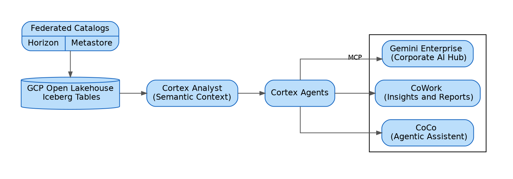

# AI-Ready Iceberg The Open Lakehouse Story with Snowflake and Google Cloud

## Iceberg: From Silo To Interoperability

Every database used to own its data, which worked when organizations had one analytics engine—but they don't anymore. Today's data teams run Spark for ETL, BigQuery for ad-hoc analytics, Snowflake for governed reporting, and Gemini for model training and agentic workflows, often within the same pipeline.

This created a dichotomy—choose flexibility or consistency:

- Let every team use their preferred engine, and you must replicate data across systems. That means redundancy, inconsistency, and endless reconciliation.
- Force everyone through one engine, and you sacrifice the specialization and autonomy that multi-engine architectures provide.

The industry needed a third option, and it emerged from a fundamental insight known as the **Data Locality** principle: it is cheaper, faster, and more secure to move a small piece of executable code to where data already lives than to move massive volumes of data across a network.

> As data grows, it hurts to move it. Data has gravity—it pulls applications and throughput closer to it. — Dave McCrory, *Data Gravity*

> Moving computation is cheaper than moving data. — Jim Gray, *Distributed Computing Economics*

> The fastest way to move data is to not move it at all. — The Zero-Copy Principle

These ideas converge on a single pattern: instead of copying data to each engine, bring each engine's compute to the data. All data sits in the customer's own storage bucket, and all engines agree on how it is physically laid out so each can read and write directly. **No copies. No ETL. One source of truth. Many engines.**

This requires an agreed-upon open table format—a shared language all engines understand. The industry converged on [Apache Iceberg](https://iceberg.apache.org/) as that format. Developed at Netflix for petabyte-scale table management and later donated to the Apache Software Foundation, Iceberg is supported by Spark, Trino, Flink, BigQuery, Snowflake, and dozens more engines. With Iceberg as the shared language, every engine participates without proprietary adapters. **No translation layer. No vendor lock-in.**


## Catalog: From Iceberg To Lakehouse

An open format solves interoperability, but it introduces a new question: who is in charge? When multiple engines can read and write the same files, someone must manage table metadata, enforce access policies, coordinate concurrent writers, and ensure no engine sees stale or inconsistent state. That role belongs to the **catalog**—the governance layer of a lakehouse. It is the single authority that knows which tables exist, what their schemas look like, who can access them, and where data files physically reside. Without it, open data is ungoverned data. 

The catalog also controls storage access through **vended credentials**—when an engine requests table data, the catalog returns short-lived, narrowly scoped storage tokens rather than standing bucket credentials. No engine needs persistent access to the underlying storage.

Together, the catalog and vended credentials provide a single-authority governance layer—**security enforced, access controlled, audit centralized.**

For the catalog to serve engines built by different vendors, it needs a standardized protocol—otherwise every engine would require a custom integration with every catalog. The **Iceberg REST Catalog (IRC)** is the open API specification that solves this: it defines how clients discover namespaces, load table metadata, and commit updates. Every catalog exposes an IRC endpoint, every engine connects as a client, and you can swap catalog implementations without changing any client code.

The key architectural question becomes: who manages the catalog? Customers can self-manage by deploying [Apache Polaris](https://polaris.apache.org/)—the most popular open-source IRC implementation, donated by Snowflake to the Apache Foundation. This gives full control, but it also means full operational responsibility: infrastructure, scaling, patching, and availability all fall on the customer's team.

In practice, most organizations choose a managed IRC so they can focus on data rather than catalog operations. On GCP there are two natural options:

- **Lakehouse runtime catalog** (Google Cloud's managed Iceberg catalog, part of Lakehouse for Apache Iceberg) stores tables and metadata in customer GCS buckets while handling catalog operations, access control, and BigQuery integration natively. It is a natural fit when the workload is GCP-centric and BigQuery is the primary query surface.

- **Snowflake Horizon Catalog** integrates Apache Polaris and exposes a standards-compliant IRC endpoint—every Snowflake account gets this with no additional setup. Beyond basic catalog operations, Horizon layers on enterprise governance: RBAC, column-level masking, row access policies, data lineage, and audit logging. It is a natural fit when Snowflake is the primary analytics engine and governance must extend across all connected services.


```
digraph lakehouse {
    rankdir=TD;
    splines=curved;
    
    graph [fontname="Helvetica", bgcolor="transparent", pad=0.4]
    node  [fontname="Helvetica", fontsize=11, style="filled,rounded", shape=box,
           fillcolor="#ddeeff", color="#1565C0"]
    edge  [fontname="Helvetica", fontsize=9, color="#555555", arrowsize=0.7]

    // Catalog
    CAT [label="Catalog\n(IRC-Compliant)"]

    // Storage
    GCS [label="Customer GCS Bucket\nIceberg Data & Metadata", shape=cylinder]

    // Engines
    SF    [label="Snowflake"]
    BQ    [label="BigQuery"]
    Spark [label="Spark / Dataproc"]
    Other [label="Trino / Flink / ..."]

    // Catalog -> Engines
    CAT -> {SF BQ Spark Other} [label="IRC"]

    // Engines -> Storage
    {SF BQ Spark Other} -> GCS [label="Read/Write", style=dashed]
}
```

These options are not mutually exclusive—both can coexist in the same organization through catalog federation, and organizations can start with a single catalog and federate incrementally as needs evolve.


## Federation: From Lakehouse to Open Lakehouse

These managed catalog options are not mutually exclusive—in fact, **catalog federation** is the recommended pattern. Multiple catalogs coexist, each managing its own tables, while all engines query across them through IRC.

When GCP manages the catalog via the Lakehouse runtime catalog, Snowflake connects through a **Catalog-Linked Database (CLD)** that automatically discovers and syncs tables from the remote IRC endpoint. Snowflake users interact with those GCP-managed Iceberg tables using standard SQL—SELECT, INSERT, UPDATE, DELETE—as if they were native tables, with Snowflake governance (RBAC, masking, lineage) layered on top. 

In the other direction, when Snowflake manages the catalog via Horizon, GCP services reach those tables through the Lakehouse **external catalog connection**—BigQuery, Dataproc, and other GCP services connect to Horizon's IRC endpoint and read/write Snowflake-managed Iceberg tables directly.

```
digraph catalog_federation {
    rankdir=TD
    nodesep=1
    splines=true;
    graph [fontname="Helvetica", bgcolor="transparent", pad=0.4, compound=true]
    node  [fontname="Helvetica", fontsize=11, style="filled,rounded", shape=box,
           fillcolor="#ddeeff", color="#1565C0"]
    edge  [fontname="Helvetica", fontsize=9, color="#555555", arrowsize=0.7]
    
    

    // Snowflake side
    subgraph cluster_snowflake {
        label="Snowflake"
        style=dashed
        color="#999999"
        fontname="Helvetica"
        fontsize=12

        HZ [label="Horizon Catalog"]
        SF [label="Snowflake Engine"]
    }

    // GCP side
    subgraph cluster_gcp {
        label="GCP Open Lakehouse"
        style=dashed
        color="#999999"
        fontname="Helvetica"
        fontsize=12

        BLM [label="BigLake Metastore"]
        BQ  [label="BigQuery Engine"]
    }

    // Storage
    GCS [label="Customer GCS\nIceberg Files", shape=cylinder]

    // Catalog sync (bidirectional via CLD/IRC)
    //HZ  -> BLM [label="CLD", dir=both]

    // Engines read/write to storage
    SF -> GCS [style=dashed, label="Read/Write"]
    BQ -> GCS [style=dashed, label="Read/Write"]
    
    HZ -> BLM [headlabel="Snowflake CLD" constraint=false labeldistance=8 labelangle=5]
    BLM -> HZ [label="GCP External Catalog" constraint=false]
    
    HZ -> SF
    BLM -> BQ
}```

The result is a fully open, interoperable data platform: all engines read and write directly from customer GCS with no ETL between systems, each team picks the best tool for the job—Spark for ETL, BigQuery for ad-hoc, Snowflake for governed analytics, Gemini for AI—and the catalog layer enforces unified governance across all of them. **No data movement. No vendor lock-in. One copy of data, many engines, unified governance, enforced security.**

This is a modern open lakehouse. But it is not yet AI-ready.


## Semantic Context: From Open Lakehouse to AI Ready

A well-architected lakehouse solves data interoperability, but interoperability alone does not make data useful to AI. Between "data is accessible" and "AI produces accurate, trusted answers and actions" lie three gaps:
- programmatic access, 
- semantic grounding, 
- and contextual intelligence.

The first gap is **programmatic access**. Human analysts query tables through their preferred engine, but AI agents—the systems that will increasingly do the querying—need their own channels. Snowflake exposes **MCP (Model Context Protocol)** servers that allow any MCP-compatible client to discover, query, and reason over lakehouse data. MCP is an open standard (created by Anthropic, now governed by the Linux Foundation) that provides a universal interface between AI applications and data sources—meaning Gemini, IDE assistants, and custom agent frameworks all connect through the same protocol rather than requiring bespoke integrations.

For applications that need direct programmatic control—orchestration frameworks, custom pipelines, or embedded analytics—Cortex Agents are also accessible via **REST API**. Together, MCP and REST give AI agents the same governed, authenticated access to Iceberg tables that human analysts have, regardless of which catalog manages them.

The second gap is **meaning**. AI systems hallucinate when they don't understand what data represents—hundreds of tables, thousands of columns, complex join paths. **Semantic models** bridge this by defining business logic on top of physical tables: metrics with calculation rules, dimensions with hierarchies, relationships between entities, and verified query patterns that encode institutional knowledge. The critical insight is that business logic belongs in the data layer, not in AI prompts. When definitions live in a semantic model atop the data, every AI system inherits the same correct logic—no drift, no inconsistency, no guesswork.

**Snowflake Autopilot** makes this sustainable at scale. Rather than requiring analysts to manually define hundreds of semantic models, Autopilot automatically discovers and maintains them by learning from query patterns, user behavior, table relationships, and report usage. As data evolves—new tables, renamed columns, changed business rules—semantic models stay current so AI accuracy doesn't degrade over time. **The result is less hallucination, higher accuracy, and the business logic grounded in the actual data.**

The third gap is **context**—the surrounding knowledge that tells an AI system not just what the data is, but how to interpret it correctly. **Snowflake Cortex Context** creates and applies this contextual layer: table and column descriptions in business terms, data quality signals (freshness, completeness, caveats), usage patterns (which tables are authoritative for which questions), and domain relationships across the lakehouse. This context applies to any Iceberg table—Snowflake-native, CLD-linked, or federated from GCP. The AI receives data along with the context needed to interpret it correctly, which is what separates a generic LLM answer ("revenue might be...") from a grounded response ("Q4 revenue was $47.2M from the authoritative finance.revenue table, filtered by fiscal quarter definition").

With semantic models and context in place, AI assistants operate across the entire federated lakehouse with high accuracy. **Snowflake CoWork** is an AI data analyst that explores and analyzes data across all catalog sources, generates accurate SQL grounded in semantic models, and produces governed visualizations and insights—without users knowing or caring which catalog manages the underlying data. 

**Cortex Code** extends this into the development workflow: an AI-powered IDE that authors pipelines, builds Cortex Agents and Streamlit apps, and generates validated SQL and Python grounded in actual catalog metadata. Both business users and engineers benefit from the same semantic grounding.

Because the lakehouse runs on GCP, **Gemini** is natively available across the stack. Gemini's multimodal understanding (text, images, video, code in a single context) means lakehouse data isn't limited to structured tables—documents in GCS, images, and unstructured content all participate in the AI workflow. Its long context windows ingest extensive schemas, semantic model definitions, and query histories simultaneously, improving accuracy on complex analytical questions.

Gemini connects to the lakehouse through MCP (via Snowflake's MCP servers) and through native GCP integrations with Lakehouse for Apache Iceberg. Employees using **Gemini Enterprise** ask natural-language questions answered with governed data from Iceberg tables—queries route through Cortex Agents and semantic models to ensure grounded responses. Whether a user interacts through CoWork, Cortex Code, Gemini Enterprise, or a custom REST agent—the same semantic layer, the same context, and the same governance apply. **AI that understands your data, not just your question.**


The result is not just an open lakehouse—it is an AI-ready open lakehouse where data is interoperable, governed, semantically rich, and accessible to both humans and AI agents through standardized protocols. 

> Business logic lives in the data layer. Context travels with the data. Every AI interaction produces grounded, accurate, governed answers.





## Getting Started

The following resources provide hands-on implementations of the architectures described in this post:

- **Snowflake-Managed Iceberg on GCP** — Create Iceberg tables in Snowflake Horizon with BigQuery and Spark reading/writing via IRC  
- **GCP Open Lakehouse with Snowflake CLD** — Configure Lakehouse runtime catalog tables and access them from Snowflake via Catalog-Linked Database  
- **AI on Iceberg: Gemini + Cortex** — Connect Gemini Enterprise to Snowflake Cortex Agents with semantic models over federated Iceberg tables

---

*Apache Iceberg is a trademark of the Apache Software Foundation. Apache Polaris is a trademark of the Apache Software Foundation.*
