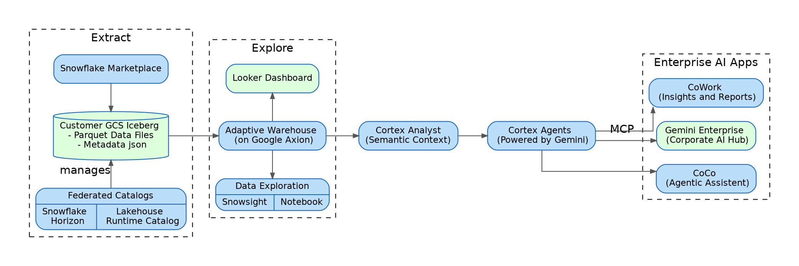

# Diagrams

All diagram-related code for the notebook.


## Architecture Diagram (Graphviz DOT)





## Spotlight Display Snippet (Python)

Used in the notebook to show the architecture diagram with a spotlight region highlighting the current section. The SVG is pre-rendered from the DOT above and stored at `input/arch-diagram.svg`.

```python
from IPython.display import display, HTML
import base64, pathlib

def spotlight(image_path, left=0, top=0, right=100, bottom=100):
    """Display an image with a dark overlay and a bright cutout region (percentages)."""
    svg_data = pathlib.Path(image_path).read_text()
    b64 = base64.b64encode(svg_data.encode()).decode()
    img_src = f"data:image/svg+xml;base64,{b64}"
    display(HTML(f'''
    <div style="position:relative; width:100%; line-height:0;">
      
      <svg style="position:absolute; top:0; left:0; width:100%; height:100%;" viewBox="0 0 100 100" preserveAspectRatio="none">
        <defs>
          <mask id="spotlight">
            <rect x="0" y="0" width="100" height="100" fill="white" />
            <rect x="{left}" y="{top}" width="{right-left}" height="{bottom-top}" fill="black" />
          </mask>
        </defs>
        <rect x="0" y="0" width="100" height="100" fill="black" fill-opacity="0.55" mask="url(#spotlight)" />
      </svg>
    </div>
    '''))
```


## Spotlight Calls Per Section

Each section shows the diagram with a different region highlighted:

```python
# Marketplace + Iceberg (left side)
spotlight("input/arch-diagram.svg", left=3, top=10, right=23, bottom=90)

# GCS Bucket + Iceberg Table (center-left)
spotlight("input/arch-diagram.svg", left=23, top=10, right=42, bottom=90)

# Cortex: Semantic View + Agent (center-right)
spotlight("input/arch-diagram.svg", left=42, top=10, right=75, bottom=90)

# MCP + Gemini Enterprise (right side)
spotlight("input/arch-diagram.svg", left=57, top=45, right=100, bottom=60)
```
