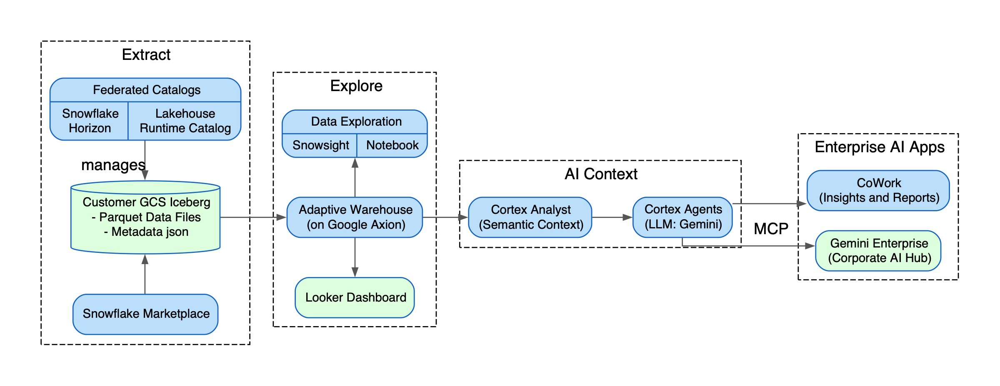

author: Ali Khosro (Snowflake), Bruce Sandell (Google)
id: quickstart-iceberg-cortex-gemini
language: en
summary: Build an AI agent on Iceberg data with Snowflake Cortex and Gemini Enterprise via MCP
categories: Getting-Started, Data-Engineering, AI-ML
environments: web
status: Published
feedback link: https://github.com/Snowflake-Labs/sfguides/issues
tags: Getting Started, Iceberg, Cortex, Gemini, MCP, Semantic View, Agents, GCP, Google Cloud

# Agentic AI for Your Lakehouse: Snowflake Cortex and Gemini Enterprise on Iceberg
<!-- ------------------------ -->
## Overview
Duration: 2

We're going to build an AI agent that answers economic questions about the wellbeing of Americans — and make it available to anyone in the organization. The agent will live in Snowflake, but employees will talk to it from Gemini Enterprise, their everyday corporate AI assistant.

We start from raw public data. We land it in an [Apache Iceberg](https://iceberg.apache.org/) table on your own GCS bucket. We teach an AI model what the data means through a Semantic View. And we wrap it all in a Cortex Agent powered by Gemini.

The key idea: define your business logic once, in the data layer, not in prompts. That way every consumer — a chat interface, a BI dashboard, an external AI assistant — gets the same correct answer from the same governed data.

> aside positive
> 
> This quickstart is also available as a [Snowflake Notebook](https://github.com/sfc-gh-akhosro/gcp-snowflake-solutions/tree/main/hands-on-lab-cortex-gemini) that you can run directly in Snowsight Workspaces. [Readme](./assets/readme.md) more info.



### What You Will Learn 
- How to create Snowflake-managed Iceberg tables on GCS
- How to build a Semantic View that grounds AI on business logic
- How to create a Cortex Agent powered by Gemini
- How to expose the agent via MCP (Model Context Protocol)
- How to connect Gemini Enterprise to Snowflake through MCP

### What You Will Build
- An Apache Iceberg table on your GCS bucket with US economic indicators
- A Semantic View defining dimensions, facts, and metrics
- A Cortex Agent accessible from Snowflake CoWork and Gemini Enterprise
- An MCP server with OAuth for secure cross-platform access

### Prerequisites
- A [Snowflake account](https://signup.snowflake.com/) on GCP with `ACCOUNTADMIN` privileges
- A [Google Cloud](https://console.cloud.google.com/) project with permissions to create GCS buckets
- Gemini Enterprise enabled in your Google Workspace (for the MCP connection step)

<!-- ------------------------ -->
## Setup
Duration: 5

We need three environments for this lab:

| # | Environment | Used for |
|---|-------------|----------|
| 1 | **Google Cloud Console** | Create a GCS bucket for Iceberg storage. Later, register the MCP connector in Gemini Enterprise. |
| 2 | **Snowflake (Snowsight)** | Build everything: Iceberg tables, Semantic Views, Cortex Agents, and the MCP server. |
| 3 | **Gemini Enterprise** | Talk to the agent from the corporate AI assistant. |

> aside positive
> 
> Tip: Open each environment in a separate browser tab for easy switching.

### Workspace

Snowflake Workspaces give you a full developer environment in the browser. We'll use a Snowflake Notebook that walks through the course with mixed SQL and Python cells.

**In Snowsight**: Go to Projects → Workspaces.
- Select or create a workspace connected to your git repo.
- Open `hands-on-lab-cortex-gemini/hol-cortex-gemini.ipynb`.
- Click "Connected" to start the notebook service (takes a few minutes — read ahead while it spins up).

### Role Based Access Control

Throughout this lab we use two roles:
- **`hol_role`** — the developer. Runs the notebook and owns everything we create.
- **`end_user_role`** — simulates a business user who can only ask questions through the agent.

```sql
USE ROLE ACCOUNTADMIN;

-- Create a warehouse for this lab
CREATE WAREHOUSE IF NOT EXISTS hol_wh
  WAREHOUSE_SIZE = 'XSMALL' AUTO_SUSPEND = 60 INITIALLY_SUSPENDED = TRUE;
USE WAREHOUSE hol_wh;

-- Builder role: owns all workshop objects
CREATE ROLE IF NOT EXISTS hol_role;

-- Consumer role: can only use the agent (CoWork, Gemini Enterprise)
CREATE ROLE IF NOT EXISTS end_user_role;

-- Grant both roles to whoever is running this notebook
BEGIN
  LET usr := CURRENT_USER();
  EXECUTE IMMEDIATE 'GRANT ROLE hol_role TO USER ' || :usr;
  EXECUTE IMMEDIATE 'GRANT ROLE end_user_role TO USER ' || :usr;
END;

-- Builder privileges
GRANT CREATE DATABASE        ON ACCOUNT TO ROLE hol_role;
GRANT CREATE WAREHOUSE       ON ACCOUNT TO ROLE hol_role;
GRANT CREATE INTEGRATION     ON ACCOUNT TO ROLE hol_role;
GRANT CREATE EXTERNAL VOLUME ON ACCOUNT TO ROLE hol_role;
GRANT OWNERSHIP ON WAREHOUSE hol_wh TO ROLE hol_role COPY CURRENT GRANTS;

-- Cortex access for both roles
GRANT DATABASE ROLE SNOWFLAKE.CORTEX_USER TO ROLE hol_role;
GRANT DATABASE ROLE SNOWFLAKE.CORTEX_USER TO ROLE end_user_role;

-- Switch to hol_role to build
USE ROLE hol_role;
USE WAREHOUSE hol_wh;

CREATE DATABASE IF NOT EXISTS hol_db;
USE SCHEMA hol_db.public;

-- Schema-level privileges (must come after database/schema exist)
USE ROLE ACCOUNTADMIN;
GRANT CREATE SEMANTIC VIEW ON SCHEMA hol_db.public TO ROLE hol_role;
USE ROLE hol_role;
USE WAREHOUSE hol_wh;
USE SCHEMA hol_db.public;

-- Grant consumer role usage on warehouse and database
GRANT USAGE ON WAREHOUSE hol_wh TO ROLE end_user_role;
GRANT USAGE ON DATABASE hol_db TO ROLE end_user_role;
GRANT USAGE ON SCHEMA hol_db.public TO ROLE end_user_role;

-- Verify context
SELECT CURRENT_ROLE() AS role, CURRENT_WAREHOUSE() AS wh,
       CURRENT_DATABASE() AS db, CURRENT_SCHEMA() AS schema;
```

<!-- ------------------------ -->
## Marketplace
Duration: 3

We get our source data from Snowflake Marketplace. It lets teams access curated, live datasets instantly — you click "Get" and the data appears in your account. No ETL pipelines, no data copying.

We want to build an economic dataset that tracks the financial wellbeing of Americans at the state level. We need income, inflation, mortgage rates, and unemployment — all on a monthly basis. That means four source tables from public data.

**In Snowsight**: Data Products → Marketplace → search **"Snowflake Public Data"** → **Get** (free).
- Database name: `SNOWFLAKE_PUBLIC_DATA_FREE` (accept default options).

Verify access to all four source tables:

```sql
SELECT 'BLS_PRICE' AS source, COUNT(*) AS row_count
  FROM SNOWFLAKE_PUBLIC_DATA_FREE.PUBLIC_DATA_FREE.BUREAU_OF_LABOR_STATISTICS_PRICE_TIMESERIES
UNION ALL
SELECT 'BLS_EMPLOYMENT', COUNT(*)
  FROM SNOWFLAKE_PUBLIC_DATA_FREE.PUBLIC_DATA_FREE.BUREAU_OF_LABOR_STATISTICS_EMPLOYMENT_TIMESERIES
UNION ALL
SELECT 'FREDDIE_MAC', COUNT(*)
  FROM SNOWFLAKE_PUBLIC_DATA_FREE.PUBLIC_DATA_FREE.FREDDIE_MAC_HOUSING_TIMESERIES
UNION ALL
SELECT 'IRS_INCOME', COUNT(*)
  FROM SNOWFLAKE_PUBLIC_DATA_FREE.PUBLIC_DATA_FREE.IRS_INDIVIDUAL_INCOME_TIMESERIES;
```

<!-- ------------------------ -->
## Iceberg
Duration: 10

[Apache Iceberg](https://iceberg.apache.org/) is an open table format. Parquet data files and metadata sit in your own GCS bucket — you own them. Any engine that speaks Iceberg can read them directly: Snowflake, BigQuery, Managed Spark, or any Iceberg REST Catalog–compliant runtime. No copying between systems.

We use `CATALOG = 'SNOWFLAKE'`, which means Snowflake manages the table through Snowflake Horizon, handling governance, access control, and discoverability. But the actual data never leaves your bucket.

### Create GCS Bucket

**In Google Cloud Console**: Cloud Storage → **Create Bucket**.
- Name: choose a unique name (e.g. `yourname_hol_iceberg`)
- Location: `Multi-region`
- Leave everything else as default.

### Create External Volume

```sql
-- Create an external volume pointing to your GCS bucket
CREATE EXTERNAL VOLUME IF NOT EXISTS hol_gcs_vol
  STORAGE_LOCATIONS = ((
    NAME = 'hol-gcs'
    STORAGE_PROVIDER = 'GCS'
    STORAGE_BASE_URL = 'gcs://<YOUR_BUCKET_NAME>/iceberg/'
  ));

-- Describe to get the service account
DESCRIBE EXTERNAL VOLUME hol_gcs_vol;
SET desc_qid = LAST_QUERY_ID();

-- Extract the GCS service account to grant on the bucket
SELECT
  PARSE_JSON("property_value"):STORAGE_GCP_SERVICE_ACCOUNT::STRING
    AS gcs_service_account_to_grant
FROM TABLE(RESULT_SCAN($desc_qid))
WHERE "property" = 'STORAGE_LOCATION_1';
```

Copy the service account printed above.

**In Google Cloud Console**: Your bucket → **Permissions** tab → **Grant Access**.
- Paste the service account.
- Role: **Storage Admin** → Save.

### Create Iceberg Table

Join four marketplace sources into one wide-format economic indicators table:

```sql
CREATE OR REPLACE ICEBERG TABLE hol_db.public.economic_indicators
  CATALOG = 'SNOWFLAKE'
  EXTERNAL_VOLUME = 'hol_gcs_vol'
  BASE_LOCATION = 'economic_indicators'
  AS
WITH cpi AS (
  SELECT
    DATE_TRUNC('month', date) AS month,
    AVG(value) AS cpi_index
  FROM SNOWFLAKE_PUBLIC_DATA_FREE.PUBLIC_DATA_FREE.BUREAU_OF_LABOR_STATISTICS_PRICE_TIMESERIES
  WHERE variable_name = 'CPI: All items, Not seasonally adjusted, Monthly'
    AND geo_id = 'country/USA'
  GROUP BY 1
),
mortgage_30yr AS (
  SELECT
    DATE_TRUNC('month', date) AS month,
    ROUND(AVG(value) * 100, 2) AS mortgage_rate_30yr_pct
  FROM SNOWFLAKE_PUBLIC_DATA_FREE.PUBLIC_DATA_FREE.FREDDIE_MAC_HOUSING_TIMESERIES
  WHERE variable_name = '30-Year Fixed Rate Mortgage Rate, National Average'
    AND geo_id = 'country/USA'
  GROUP BY 1
),
mortgage_15yr AS (
  SELECT
    DATE_TRUNC('month', date) AS month,
    ROUND(AVG(value) * 100, 2) AS mortgage_rate_15yr_pct
  FROM SNOWFLAKE_PUBLIC_DATA_FREE.PUBLIC_DATA_FREE.FREDDIE_MAC_HOUSING_TIMESERIES
  WHERE variable_name = '15-Year Fixed Rate Mortgage Rate, National Average'
    AND geo_id = 'country/USA'
  GROUP BY 1
),
unemployment AS (
  SELECT
    DATE_TRUNC('month', date) AS month,
    geo_id,
    AVG(value) AS unemployment_rate_pct
  FROM SNOWFLAKE_PUBLIC_DATA_FREE.PUBLIC_DATA_FREE.BUREAU_OF_LABOR_STATISTICS_EMPLOYMENT_TIMESERIES
  WHERE variable_name = 'Local Area Unemployment: Unemployment Rate, Not seasonally adjusted, Monthly'
    AND LENGTH(geo_id) = 8
  GROUP BY 1, 2
),
national_unemployment AS (
  SELECT month, ROUND(AVG(unemployment_rate_pct), 2) AS unemployment_rate_pct
  FROM unemployment
  GROUP BY 1
),
income_raw AS (
  SELECT
    agi.geo_id,
    YEAR(agi.date) AS yr,
    ROUND(agi.value / NULLIF(ret.value, 0), 0) AS avg_income_per_return
  FROM SNOWFLAKE_PUBLIC_DATA_FREE.PUBLIC_DATA_FREE.IRS_INDIVIDUAL_INCOME_TIMESERIES agi
  JOIN SNOWFLAKE_PUBLIC_DATA_FREE.PUBLIC_DATA_FREE.IRS_INDIVIDUAL_INCOME_TIMESERIES ret
    ON agi.geo_id = ret.geo_id AND agi.date = ret.date
  WHERE agi.variable_name = 'Adjusted gross income (AGI), AGI bin: Total'
    AND ret.variable_name = 'Number of returns, AGI bin: Total'
    AND LENGTH(agi.geo_id) = 8
),
income_indexed AS (
  SELECT
    geo_id,
    yr,
    avg_income_per_return,
    ROUND((avg_income_per_return / FIRST_VALUE(avg_income_per_return)
      OVER (PARTITION BY geo_id ORDER BY yr)) * 100, 1) AS income_index
  FROM income_raw
),
national_income AS (
  SELECT yr, ROUND(AVG(income_index), 1) AS income_index
  FROM income_indexed
  GROUP BY 1
),
geo AS (
  SELECT geo_id, geo_name
  FROM SNOWFLAKE_PUBLIC_DATA_FREE.PUBLIC_DATA_FREE.GEOGRAPHY_INDEX
  WHERE level = 'State'
),
national AS (
  SELECT
    c.month AS date,
    'country/USA' AS geo_id,
    'United States' AS geo_name,
    ROUND(c.cpi_index, 2) AS cpi_index,
    ROUND(((c.cpi_index - LAG(c.cpi_index, 12) OVER (ORDER BY c.month))
      / NULLIF(LAG(c.cpi_index, 12) OVER (ORDER BY c.month), 0)) * 100, 2) AS inflation_pct,
    m30.mortgage_rate_30yr_pct,
    m15.mortgage_rate_15yr_pct,
    nu.unemployment_rate_pct,
    ni.income_index
  FROM cpi c
  LEFT JOIN mortgage_30yr m30 ON c.month = m30.month
  LEFT JOIN mortgage_15yr m15 ON c.month = m15.month
  LEFT JOIN national_unemployment nu ON c.month = nu.month
  LEFT JOIN national_income ni ON YEAR(c.month) = ni.yr
),
states AS (
  SELECT
    u.month AS date,
    u.geo_id,
    g.geo_name,
    NULL::FLOAT AS cpi_index,
    NULL::FLOAT AS inflation_pct,
    NULL::FLOAT AS mortgage_rate_30yr_pct,
    NULL::FLOAT AS mortgage_rate_15yr_pct,
    u.unemployment_rate_pct,
    ii.income_index
  FROM unemployment u
  JOIN geo g ON u.geo_id = g.geo_id
  LEFT JOIN income_indexed ii ON u.geo_id = ii.geo_id AND YEAR(u.month) = ii.yr
)
SELECT * FROM national
UNION ALL
SELECT * FROM states
ORDER BY date, geo_id;
```

### Explore Iceberg Data

**In Google Cloud Console**: Your bucket → explore the files.
- You'll see Parquet data files and a metadata folder with JSON files.

The Iceberg table uses `CATALOG = 'SNOWFLAKE'` — all data and metadata is in your own bucket. Every engine reads and writes directly while the catalog (Snowflake Horizon) provides governance and security.

<!-- ------------------------ -->
## Data Profiling
Duration: 2

Query the Iceberg table to see national economic indicators:

```sql
SELECT
  date,
  cpi_index,
  income_index,
  inflation_pct,
  mortgage_rate_30yr_pct,
  unemployment_rate_pct
FROM hol_db.public.economic_indicators
WHERE geo_id = 'country/USA'
  AND date >= '2015-01-01'
  AND inflation_pct IS NOT NULL
ORDER BY date;
```

> aside positive
> 
> In Snowsight, click the **Chart** tab to visualize trends over time, or click column headers for quick profiling stats (min, max, distribution).

<!-- ------------------------ -->
## Cortex Agent
Duration: 10

We have a clean Iceberg table. Any analyst can query it with SQL. But that doesn't make it AI-ready.

When an LLM sees column names like `CPI_INDEX` or `GEO_ID`, it guesses what they mean — and guesses wrong. We need to define which columns are dimensions, which are facts, how metrics are calculated, and what questions this table can answer.

That's what a **Semantic View** does. You define your business logic once — in the data layer, not scattered across prompts — and every AI consumer inherits the same correct definitions.

### Semantic View

The Semantic View is the grounding layer for our agent. We define dimensions (date, geography), facts (CPI, mortgage rate, unemployment, income), and metrics (year-over-year inflation, average mortgage rate by state).

> aside positive
> 
> **UI Alternative**: In Snowsight, go to AI & ML → Cortex Analyst → **Create Semantic View** → select your table → click **Autopilot** to auto-generate the YAML.

```sql
CALL SYSTEM$CREATE_SEMANTIC_VIEW_FROM_YAML(
  'hol_db.public',
  $$
name: economic_semantic_view
tables:
  - name: economic_indicators
    base_table:
      database: HOL_DB
      schema: PUBLIC
      table: ECONOMIC_INDICATORS
    dimensions:
      - name: DATE
        description: "Date of the observation"
        expr: economic_indicators.DATE
        data_type: DATE
      - name: GEO_ID
        description: "Geographic area identifier"
        expr: economic_indicators.GEO_ID
        data_type: TEXT
      - name: GEO_NAME
        description: "Geographic area — United States for national, or state name (e.g. California)"
        expr: economic_indicators.GEO_NAME
        data_type: TEXT
    facts:
      - name: CPI_INDEX
        description: "Consumer Price Index, base period 1982-84 = 100 (national only)"
        expr: economic_indicators.CPI_INDEX
        data_type: NUMBER
      - name: INFLATION_PCT
        description: "Year-over-year inflation rate as percent (national only)"
        expr: economic_indicators.INFLATION_PCT
        data_type: NUMBER
      - name: MORTGAGE_RATE_30YR_PCT
        description: "30-year fixed mortgage rate, national average, percent (national only)"
        expr: economic_indicators.MORTGAGE_RATE_30YR_PCT
        data_type: NUMBER
      - name: MORTGAGE_RATE_15YR_PCT
        description: "15-year fixed mortgage rate, national average, percent (national only)"
        expr: economic_indicators.MORTGAGE_RATE_15YR_PCT
        data_type: NUMBER
      - name: UNEMPLOYMENT_RATE_PCT
        description: "Unemployment rate as percent (available national and by state)"
        expr: economic_indicators.UNEMPLOYMENT_RATE_PCT
        data_type: NUMBER
      - name: INCOME_INDEX
        description: "Average income per tax return, indexed to earliest available year = 100. Compare to CPI_INDEX to assess purchasing power. (available national and by state, annual grain)"
        expr: economic_indicators.INCOME_INDEX
        data_type: NUMBER
    metrics:
      - name: AVG_CPI_INDEX
        description: "Average Consumer Price Index"
        expr: AVG(economic_indicators.CPI_INDEX)
      - name: AVG_INFLATION_PCT
        description: "Average year-over-year inflation rate"
        expr: AVG(economic_indicators.INFLATION_PCT)
      - name: AVG_MORTGAGE_RATE_30YR
        description: "Average 30-year fixed mortgage rate"
        expr: AVG(economic_indicators.MORTGAGE_RATE_30YR_PCT)
      - name: AVG_UNEMPLOYMENT_RATE
        description: "Average unemployment rate"
        expr: AVG(economic_indicators.UNEMPLOYMENT_RATE_PCT)
      - name: AVG_INCOME_INDEX
        description: "Average income index"
        expr: AVG(economic_indicators.INCOME_INDEX)
$$
);

-- Verify
SHOW SEMANTIC VIEWS IN SCHEMA hol_db.public;
```

### Create Cortex Agent

A Cortex Agent takes a natural-language question and passes it to Cortex Analyst. Cortex Analyst uses the Semantic View to generate correct SQL, executes it, and returns a grounded answer with supporting data. We use Gemini as the reasoning model.

> aside positive
> 
> **UI Alternative**: In Snowsight, go to AI & ML → Cortex Agents → **+ Create** → select your semantic view → choose Gemini as the model.

```sql
-- Create a Cortex Agent backed by the economic indicators semantic view
CREATE OR REPLACE AGENT hol_db.public.hol_economic_agent
  FROM SPECIFICATION $$
  tools:
    - tool_spec:
        type: cortex_analyst_text_to_sql
        name: economic_analyst
        description: "Answers questions about US economic indicators: CPI/inflation, mortgage interest rates (30-year, 15-year), unemployment rate (national and by state), and income index."

  tool_resources:
    economic_analyst:
      semantic_view: HOL_DB.PUBLIC.ECONOMIC_SEMANTIC_VIEW
      execution_environment:
        type: warehouse
        warehouse: HOL_WH
  $$;

-- Grant consumer role usage on the agent
GRANT USAGE ON AGENT hol_db.public.hol_economic_agent TO ROLE end_user_role;
GRANT SELECT ON SEMANTIC VIEW hol_db.public.economic_semantic_view TO ROLE end_user_role;
GRANT SELECT ON TABLE hol_db.public.economic_indicators TO ROLE end_user_role;

-- Verify
SHOW AGENTS IN SCHEMA hol_db.public;
```

### Test with CoWork

Snowflake CoWork is the chat surface for business users — no SQL knowledge needed.

**In Snowsight**: AI & ML → Open Snowflake CoWork.
- In CoWork, go to bottom left profile, click setting, and switch role to `end_user_role`, warehouse: `hol_wh`. Done.
- You should be able to see **hol_economic_agent** in the agent list (control buttons of the CoWork chat).
- Ask: *"How has the 30-year mortgage rate changed relative to inflation since 2020?"*

The response includes the generated SQL so you can see exactly what query was executed. Same agent, same data, different role — a chat-based surface instead of a notebook.

<!-- ------------------------ -->
## MCP Server
Duration: 8

So far our agent lives inside Snowflake. But what if employees want to ask it questions from Gemini Enterprise, or from another AI tool?

[Model Context Protocol (MCP)](https://modelcontextprotocol.io/) is an open standard that gives AI applications a universal way to connect to data tools. We declare our agent as an MCP tool and add OAuth for secure access. Any MCP-compatible client can then connect.

```sql
-- MCP server exposing the Cortex Agent as a tool
USE ROLE hol_role;
USE WAREHOUSE hol_wh;
USE SCHEMA hol_db.public;

CREATE OR REPLACE MCP SERVER hol_db.public.hol_mcp
  FROM SPECIFICATION $$
  tools:
    - name: "hol-economic-agent"
      type: "CORTEX_AGENT_RUN"
      identifier: "HOL_DB.PUBLIC.HOL_ECONOMIC_AGENT"
      description: "US economic indicators agent — answers questions about inflation (CPI), mortgage rates, unemployment, and income."
      title: "Economic Indicators Agent"
  $$;

-- Grant MCP server usage to the consumer role
USE ROLE ACCOUNTADMIN;

GRANT USAGE ON MCP SERVER hol_db.public.hol_mcp TO ROLE end_user_role;

-- OAuth integration for external MCP clients
CREATE OR REPLACE SECURITY INTEGRATION hol_mcp_oauth
  TYPE = OAUTH
  OAUTH_CLIENT = CUSTOM
  OAUTH_CLIENT_TYPE = 'CONFIDENTIAL'
  OAUTH_REDIRECT_URI = 'https://vertexaisearch.cloud.google.com/oauth-redirect'
  ALLOWED_ROLES_LIST = ('END_USER_ROLE')
  ENABLED = TRUE;

-- Get MCP server metadata
DESCRIBE MCP SERVER hol_db.public.hol_mcp;
SET mcp_qid = LAST_QUERY_ID();

-- Get OAuth integration metadata
DESCRIBE SECURITY INTEGRATION hol_mcp_oauth;
SET int_qid = LAST_QUERY_ID();

USE ROLE hol_role;
USE WAREHOUSE hol_wh;
USE SCHEMA hol_db.public;

-- Retrieve all credentials for Gemini Enterprise MCP connection
WITH mcp_meta AS (
  SELECT "database_name", "schema_name", "name"
  FROM TABLE(RESULT_SCAN($mcp_qid))
),
oauth_meta AS (
  SELECT
    MAX(CASE WHEN "property" = 'OAUTH_AUTHORIZATION_ENDPOINT' THEN "property_value" END) AS auth_endpoint,
    MAX(CASE WHEN "property" = 'OAUTH_TOKEN_ENDPOINT' THEN "property_value" END) AS token_endpoint,
    MAX(CASE WHEN "property" = 'OAUTH_CLIENT_ID' THEN "property_value" END) AS client_id
  FROM TABLE(RESULT_SCAN($int_qid))
),
secrets AS (
  SELECT PARSE_JSON(SYSTEM$SHOW_OAUTH_CLIENT_SECRETS('HOL_MCP_OAUTH')) AS s
),
account_base AS (
  SELECT 'https://' || CURRENT_ORGANIZATION_NAME() || '-' || CURRENT_ACCOUNT_NAME()
         || '.snowflakecomputing.com' AS url
)
SELECT field_name, value
FROM (
  SELECT 1 AS ord, 'MCP Server URL' AS field_name,
    ab.url || '/api/v2/databases/' || m."database_name" || '/schemas/' || m."schema_name"
    || '/mcp-servers/' || m."name" AS value
    FROM account_base ab, mcp_meta m
  UNION ALL
  SELECT 2, 'Auth URL', o.auth_endpoint FROM oauth_meta o
  UNION ALL
  SELECT 3, 'Auth URL Params', '' FROM oauth_meta o
  UNION ALL
  SELECT 4, 'Token URL', o.token_endpoint FROM oauth_meta o
  UNION ALL
  SELECT 5, 'Client ID', o.client_id FROM oauth_meta o
  UNION ALL
  SELECT 6, 'Client Secret', s.s:OAUTH_CLIENT_SECRET::STRING FROM secrets s
  UNION ALL
  SELECT 7, 'Scopes', 'session:role:end_user_role' FROM secrets s
  UNION ALL
  SELECT 8, 'MCP Server Description',
    'Snowflake Cortex Agent for US economic indicators (CPI, mortgage rates, unemployment, income)'
    FROM secrets s
  UNION ALL
  SELECT 9, 'Agent Instructions',
    'Use the hol-economic-agent tool to answer questions about US economic data including inflation, mortgage rates, unemployment by state, and income trends.'
    FROM secrets s
  UNION ALL
  SELECT 10, 'Data Connector Name', 'hol_cortex_gemini_economic_agent' FROM secrets s
)
ORDER BY ord;
```

> aside negative
> 
> Save the output — you'll need these values to register the connector in Gemini Enterprise.

<!-- ------------------------ -->
## Gemini Enterprise
Duration: 5

Gemini Enterprise is Google Cloud's corporate AI assistant — the chat interface employees across the organization already use daily.

By registering our Snowflake MCP server as a data connector, the Cortex Agent becomes a tool that Gemini calls when it needs economic data. Employees ask questions in Gemini and get grounded answers from governed Iceberg data.

**In Google Cloud Console**: Search "Gemini Enterprise" → Data stores → **+Create data store** → Add MCP Server.
- Fill in the fields using values from the MCP output above (server URL, client ID, client secret, scopes, etc.).
- Complete the OAuth authorization flow when prompted.
- Click **Actions** → "Reload Custom Actions" and log in.
- Select the tool "hol-economic-agent" → "Enable Actions" → confirm.

Now open [Gemini Enterprise](https://gemini.google.com) and ask:

*"How has the 30-year mortgage rate changed relative to inflation since 2020?"*

Same question we asked in Snowflake CoWork, same correct answer — just a different surface.

### Troubleshooting

**Network Policy** — If Gemini can't reach Snowflake (OAuth errors, timeouts), a network policy may be blocking external IPs:

```sql
USE ROLE ACCOUNTADMIN;
ALTER ACCOUNT UNSET NETWORK_POLICY;
-- To re-enable later: ALTER ACCOUNT SET NETWORK_POLICY = <your_policy_name>;
```

**Google Cloud Org Policy** — If you see `constraints/discoveryengine.managed.disableCustomMcpServerConnector`:

**In Google Cloud Console**: IAM & Admin → Organization Policies → search `disableCustomMcpServerConnector` → Enforcement: **Off** → Save. Retry connector setup.

<!-- ------------------------ -->
## Conclusion And Resources
Duration: 1

Let's step back and look at what we built.

One copy of data on open Iceberg in your GCS bucket. A Semantic View that teaches AI what the data means. A Cortex Agent powered by Gemini that turns questions into governed SQL. And we consume it from Snowflake CoWork, Gemini Enterprise, and any MCP client — all pointing at the same source of truth.

No data copies between systems. No custom integrations for each surface. No hallucination from ungrounded prompts. Build it once, consume it everywhere.

### What You Learned
- How to create Snowflake-managed Iceberg tables on your own GCS bucket
- How to use Snowflake Marketplace for instant data access
- How to define business logic in a Semantic View
- How to build a Cortex Agent with Gemini as the reasoning model
- How to expose an agent via MCP with OAuth security
- How to connect Gemini Enterprise to Snowflake through MCP

### Related Resources
- [Snowflake Cortex Agents Documentation](https://docs.snowflake.com/en/user-guide/snowflake-cortex/cortex-agents)
- [Apache Iceberg on Snowflake](https://docs.snowflake.com/en/user-guide/tables-iceberg)
- [Semantic Views](https://docs.snowflake.com/en/user-guide/snowflake-cortex/cortex-analyst/semantic-view)
- [MCP Servers in Snowflake](https://docs.snowflake.com/en/user-guide/snowflake-cortex/mcp-server)
- [Source Notebook on GitHub](https://github.com/sfc-gh-akhosro/gcp-snowflake-solutions/tree/main/hands-on-lab-cortex-gemini)

### Cleanup

When you're done, run this to remove all lab objects:

```sql
USE ROLE ACCOUNTADMIN;
DROP DATABASE IF EXISTS hol_db;
DROP WAREHOUSE IF EXISTS hol_wh;
DROP INTEGRATION IF EXISTS hol_mcp_oauth;
DROP ROLE IF EXISTS hol_role;
DROP ROLE IF EXISTS end_user_role;
-- External volume kept (GCS permissions take time to set up):
-- DROP EXTERNAL VOLUME IF EXISTS hol_gcs_vol;
```
