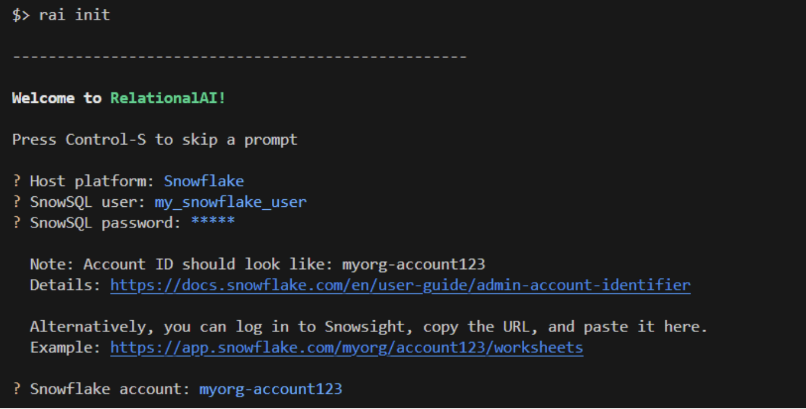

author: Patrick Lee, Steve Bertolani
id: rai-communities
summary: This guide shows how to use RelationalAI and Snowflake to create a social graph and detect customer communities from retail transaction data.
categories: data-science, graph-analysis, relationalai, community-detection
environments: web, summit
status: Published 
feedback link: https://github.com/RelationalAI/rai-samples/issues
tags: Data Science, Community Detection, Graph Analysis, RelationalAI 

# Snowflake Guide Template
<!-- ------------------------ -->
## Overview 

In this quickstart, we will review how to use RelationalAI, a Native App available in the Snowflake Marketplace, to run community detection algorithms in order to identify communities of customers that eat together.

### Prerequisites
- Familiarity with Markdown syntax

### What You’ll Learn 
-- How to run all sorts of graph algorithms on your data, where it already lives, to discover new insights.
-- How to visualize graphs.
-- How, thanks to native applications with Snowpark Container Services, we can do all of this within the Data Cloud!

### What You’ll Need 
- A [Snowflake](https://signup.snowflake.com/) Account
- Basic knowledge of using a Snowflake SQL Worksheet
- Snowflake privileges on your user to [Install a Native Application](https://other-docs.snowflake.com/en/native-apps/consumer-installing#set-up-required-privileges)
- A Database named `FROSTBYTE_TASTY_BYTES` with the "TastyBytes" demo data set, which can be installed using these [instructions](https://quickstarts.snowflake.com/guide/tasty_bytes_introduction/index.html#1)
- The [RAI Community Detection Jupyter notebook](https://github.com/RelationalAI/rai-samples/blob/main/samples/tastybytes-communities/community_detection_RelationalAI_V1.ipynb) used in this quickstart

### What You’ll Build 
- A community detection algorithm to find which food truck customers frequently eat together
- A visualization of this data

<!-- ------------------------ -->
## Build a Harmonized View 
Duration: 5

The base TastyBytes data contains POS data. Before forming a graph on the data we're interested in, we
will create a harmonized view that gives us individual customer loyalty data for each order. 

```sql
CREATE OR REPLACE TABLE FROSTBYTE_TASTY_BYTES.HARMONIZED.LOYALTY_ORDERS
	AS
SELECT
	oh.order_id,
	oh.truck_id,
	oh.order_ts,
	DATEDIFF(SECOND, TIMESTAMP '1970-01-01', oh.order_ts) AS ORDER_TS_SECONDS,
	od.order_detail_id,
	od.line_number,
	m.truck_brand_name,
	m.menu_type,
	t.primary_city,
	t.region,
	t.country,
	t.franchise_flag,
	t.franchise_id,
	f.first_name AS franchisee_first_name,
	f.last_name AS franchisee_last_name,
	l.location_id,
	cl.customer_id,
	cl.first_name,
	cl.last_name,
	cl.e_mail,
	cl.phone_number,
	cl.children_count,
	cl.gender,
	cl.marital_status,
	od.menu_item_id,
	m.menu_item_name,
	od.quantity,
	od.unit_price,
	od.price,
	oh.order_amount,
	oh.order_tax_amount,
	oh.order_discount_amount,
	oh.order_total
FROM frostbyte_tasty_bytes.raw_pos.order_detail od
JOIN frostbyte_tasty_bytes.raw_pos.order_header oh
	ON od.order_id = oh.order_id
JOIN frostbyte_tasty_bytes.raw_pos.truck t
	ON oh.truck_id = t.truck_id
JOIN frostbyte_tasty_bytes.raw_pos.menu m
	ON od.menu_item_id = m.menu_item_id
JOIN frostbyte_tasty_bytes.raw_pos.franchise f
	ON t.franchise_id = f.franchise_id
JOIN frostbyte_tasty_bytes.raw_pos.location l
	ON oh.location_id = l.location_id
LEFT JOIN frostbyte_tasty_bytes.raw_customer.customer_loyalty cl
	ON oh.customer_id = cl.customer_id;
```

Now we'll create a subset view for the California-based orders in which we're interested. 

```sql
CREATE OR REPLACE TABLE LOYALTY_ORDERS_REGION_CALIFORNIA AS
SELECT *
FROM LOYALTY_ORDERS
WHERE REGION='California';
```

## Install the RelationalAI Native App In Your Account
`Duration: 5`

In the [Snowflake Marketplace](https://app.snowflake.com/marketplace), search for the ‘RelationalAI’ Native App and install it in your account by clicking the “Get” button.  After installation, follow the [initial setup](https://github.com/RelationalAI/rai-sf-app-docs/wiki/Guide-%E2%80%90-Initial-Setup) instructions.

## Setup Your Environment
`Duration: 5`

Now with your Snowflake account is ready to go, to build a knowledge graph using RelationalAI from within your Snowflake account, we need to setup the local environment with Jupyter Lab and the RelationalAI Python library.  The easiest way to do this is using the miniconda installer:
Download the miniconda installer from https://conda.io/miniconda.html. (OR, you may use any other Python environment with Python 3.12).


From the app folder, create conda environment. Then activate conda environment and install JupyterLab and RelationalAI package
```console
> conda create -n rai_communities python=3.12
> conda activate rai_communities    
> pip install jupyterlab 
> pip install relationalai  
```

### RelationalAI Config File
After installing the `relationalai` package, you will need to setup an initial RAI configuration with the Snowflake credentials you want to use (similar to the configuration for Snowflake CLI):



## Run the Notebook in Jupyter Lab
Duration: 15

1) Copy the [RAI Community Detection Jupyter notebook](https://github.com/RelationalAI/rai-samples/blob/main/samples/tastybytes-communities/community_detection_RelationalAI_V1.ipynb) to your app directory
2) Start Jupyter Lab with the following command:
```console
> jupyter lab
```
and visit the url (something like 'locationhost:8888/lab?token=XXXX) printed in the console output in your browser

3) Open the `community_detection_RelationalAI_V1.ipynb` file in Jupyter lab and follow the instructions

## Conclusion
Duration: 1

Congratulations on completing the our Community Detection using RelationalAI guide! To learn about more about RelationalAI and 
view full documentation, visit [https://relational.ai](https://relational.ai)
