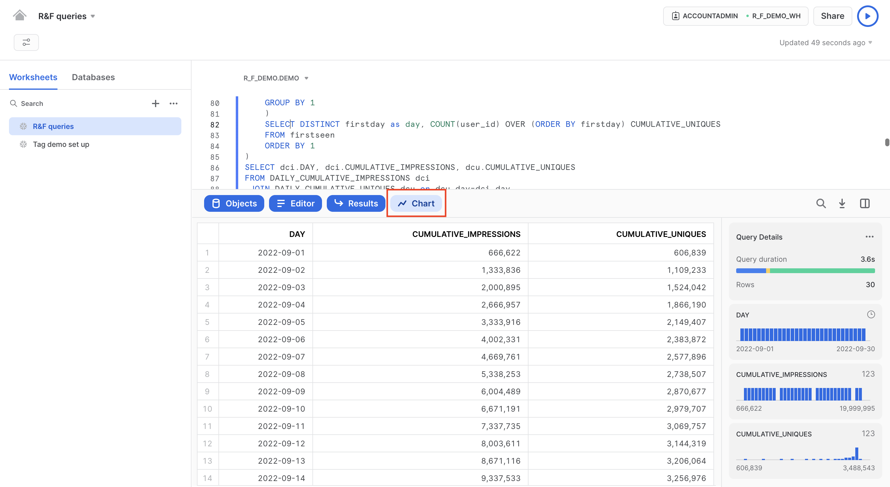
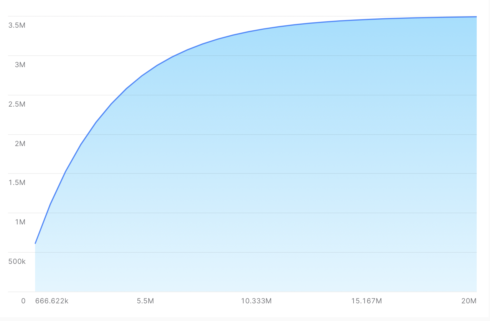
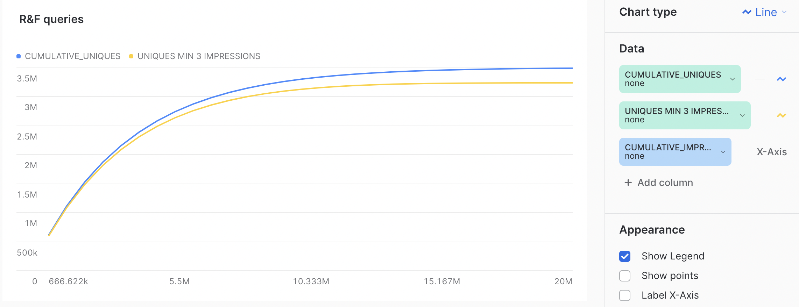
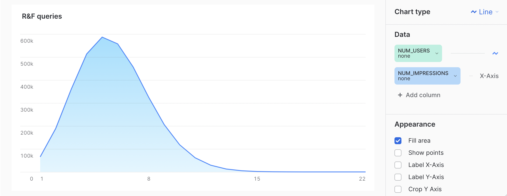

author: Jim Warner
id: reach_and_frequency_queries
summary: Shows common reach and frequency queries for advertising measurement
categories: data-science-&-ml,solution-examples
environments: web
status: Published
feedback link: https://github.com/Snowflake-Labs/sfguides/issues
tags: Getting Started, AdTech

# Reach and Frequency queries for advertising measurement
<!-- ------------------------ -->
## Overview 
Duration: 1

Reach and Frequency are two of the most simple, but also most important, measures for an advertising campaign. Advertisers typically pay for *impressions*, which is simply the number of times your ad is shown. Reach, on the other hand, tells you the total number of *people* who see your ad, while *frequency* refers to the number of times people see your ad.

As such:
```math
impressions = reach * frequency
```

Because of the speed and scale of Snowflake, many companies store ad impression data in Snowflake. This Quickstart will show you how to do common types of Reach and Frequency queries in Snowflake.

### Prerequisites
- Access to a Snowflake account or use of the [Snowflake free 30-day trial](https://trial.snowflake.com)
- Basic knowledge of SQL, database concepts, and objects

### What You’ll Learn 
- How to generate example impression data
- How to query the data to give important reach and frequency results
- How to use Snowsight to visualize some of the data

### What You’ll Build 
- SQL functions used to generate Reach and Frequency measures
- Visualizations of the results

<!-- ------------------------ -->
## Prepare Your Environment
Duration: 8

If you do not have a Snowflake account, you can register for a [Snowflake free 30-day trial](https://trial.snowflake.com). The cloud provider (AWS, Azure, Google Cloud), and Region (US East, EU, e.g.) do _not_ matter for this lab. However, we suggest you select the region which is physically closest to you.

To easily follow the instructions, resize your browser windows so you can view this Quickstart and your Snowflake environment side-by-side. If possible, even better is to use a secondary display dedicated to the Quickstart.

While commands from this Quickstart can be copy/pasted to a worksheet in your Snowflake account, you can optionally [download the script as a SQL file to your local machine from Github](https://github.com/Snowflake-Labs/sf-samples).

### Navigating to Snowsight
For this lab, you will use the latest Snowflake web interface, Snowsight.  If you have not enabled Snowsight previously, please do the following.
1. Log into your Snowflake account
2. Click on __Snowsight__ Worksheets tab. The new web interface opens in a separate tab or window.
3. Click __Worksheets__ in the left-hand navigation bar. The __Ready to Start Using Worksheets and Dashboards__ dialog opens.
4. Click the __Enable Worksheets and Dashboards button__.


### Create a Warehouse, Database, Schemas
Create a warehouse, database, and schema that will be used for loading, storing, processing, and querying data for this Quickstart. We will use the UI within the Worksheets tab to run the DDL that creates these objects.

Copy the commands below into your trial environment. To execute a single statement, just position the cursor anywhere within the statement and click the Run button. To execute several statements, they must be highlighted through the final semi-colon prior to clicking the Run button.

```sql
-- setup warehouse, database and schema
USE ROLE ACCOUNTADMIN;
CREATE WAREHOUSE R_F_DEMO_WH WITH WAREHOUSE_SIZE='XSmall'  STATEMENT_TIMEOUT_IN_SECONDS=15 STATEMENT_QUEUED_TIMEOUT_IN_SECONDS=15;
USE WAREHOUSE R_F_DEMO_WH;
CREATE DATABASE R_F_DEMO;
CREATE SCHEMA R_F_DEMO.DEMO;
```

### Create the table and generate test data
We create a table to store our impression data.  Here, we use a campaign ID, a placement ID, and a creative ID.  However, in reality, we may have things like site, line item, etc.  Also, we use a generic User ID column here for illustration purposes.  This could hold any form of identity, including email, cookie ID, Mobile Advertising Identifier (MAID), or identity provided by a 3rd party identity provider.

```sql
-- create table to hold impressions
use R_F_DEMO.DEMO;
create or replace table IMPRESSIONS(event_time TIMESTAMP_TZ,
                                    campaign_id VARCHAR(10),
                                    placement_id VARCHAR(10),
                                    creative_id VARCHAR(10),
                                    user_id VARCHAR(40));
```

Now we run SQL to populate the table with realistic-looking data.

```sql
-- generate test data
insert into IMPRESSIONS
select 
   dateadd(second, uniform(1, 2592000, random(1)), ('2022-09-01'::timestamp)) as event_time,
   '174631' as campaign_id
  ,uniform(200001,202000,random(2))::varchar(10) as placement_id
  ,uniform(300001,301000,random(3))::varchar(10) as creative_id
  ,sha1(uniform(1, 3500000, random(4)))::varchar(40) as user_id
from table(generator(rowcount=>20000000));
```

Here we generate data for a single example campaign that runs for one month from September 1st, 2022. The campaign has 20,000,000 impressions across 2,000 placements and 1,000 creatives.  The impressions are spread over up to 3,500,000 people.

### Verify the data

```sql
select count(1) from IMPRESSIONS where campaign_id='174631';
select count(distinct(placement_id)) from IMPRESSIONS where campaign_id='174631';
select count(distinct(user_id)) from IMPRESSIONS where campaign_id='174631';
```

The first shows that 20,000,000 were, in fact, generated.  The second shows that these rows contain 2,000 distinct placement IDs.  The final shows 3,488,543 distinct user IDs.

## Calculating reach
Duration: 2

When a campaign first starts, it reaches almost entirely new people. As it goes on, however, it reaches more people who have seen the campaign already. It gets harder and harder for the campaign to reach people the longer it goes on.

In advertising, this is often visualized as a "reach curve."  In the reach curve, the X axis is the number of impressions shown, and the Y axis is the reach of the campaign.  This shows the shape of the reach curve, so the advertiser can determine when the point of diminishing returns has been reached.

### Calculating cumulative impressions
The first step is to write a query that calculates the cumulative impressions served by day.

```sql
-- calculate cumulative impressions by day
WITH DAILY_IMPRESSIONS AS
(
SELECT TO_DATE(event_time) as day,
       COUNT(1) as day_impressions
FROM 
  IMPRESSIONS
WHERE campaign_id='174631'
GROUP BY 1
)
select
  day,
  sum(day_impressions) over (order by day asc rows between unbounded preceding and current row) as CUMULATIVE_IMPRESSIONS
from DAILY_IMPRESSIONS
order by 1;
```

The first step (in the with clause), is to get the impressions on each day.  Then, we query over this and sum over a window function to get the cumulative number of impressions.

Running this, you see each day of the campaign in order.  We serve 666,622 impressions on the first day of the campaign, and on 2022-10-01 we reach the total of 20m impressions for the campaign.

### Calculating cumulative uniques per day
The next step is to calculative uniques per day.  What is tricky here is that uniques, unlike impressions, do not sum.  If I have 10 impressions on the first day, and 10 impressions on the second day, then I had 20 impressions across those two days combined.  However, if I had 10 *uniques* on the first day, and 10 *uniques* on the second day, then I **did not necessarily** have 20 uniques across the two days combined.

On day one, we would expect nearly all of our impressions to go to unique people.  On the second day, we reach some new people, but some of them were people who saw the ad on day one.  And so forth, and so on.  So let's see what this looks like.

```sql
-- calculate cumulative uniques by day
WITH firstseen AS (
  SELECT user_id, MIN(TO_DATE(event_time)) firstday
  FROM IMPRESSIONS
  WHERE campaign_id='174631'
  GROUP BY 1
)
SELECT DISTINCT firstday as day, COUNT(user_id) OVER (ORDER BY firstday) daily_cumulative_uniques
FROM firstseen
ORDER BY 1;
```

First, inside the WITH clause, we select the first date on which each user gets an impression.  This is the only day on which they would be considered to be a unique.  Then, we count the number of new uniques per day, using the window function.

When we run this, we see that on day one, we reach 606,839 unique users.  On the last day of the campaign, this is up to the full 3,488,543 unique users reached by the campaign.

### Combining to one query and visualizing the result

To make it easy to visualize these together, we can query the two WITH clauses used in previous sections and join them together.

```sql
-- show cumulativer impressions and uniques side-by-side to understand diminishing returns
WITH DAILY_CUMULATIVE_IMPRESSIONS AS (
    WITH DAILY_IMPRESSIONS AS
    (
    SELECT TO_DATE(event_time) as day,
       COUNT(1) as day_impressions
    FROM IMPRESSIONS
    WHERE campaign_id='174631'
    GROUP BY 1
    )
    select
      day,
      sum(day_impressions) over (order by day asc rows between unbounded preceding and current row) as CUMULATIVE_IMPRESSIONS
    from DAILY_IMPRESSIONS
),
DAILY_CUMULATIVE_UNIQUES AS
(
    WITH firstseen AS
    (
    SELECT user_id, MIN(TO_DATE(event_time)) firstday
    FROM IMPRESSIONS
    WHERE campaign_id='174631'
    GROUP BY 1
    )
    SELECT DISTINCT firstday as day, COUNT(user_id) OVER (ORDER BY firstday) CUMULATIVE_UNIQUES
    FROM firstseen
    ORDER BY 1
)
SELECT dci.DAY, dci.CUMULATIVE_IMPRESSIONS, dcu.CUMULATIVE_UNIQUES
FROM DAILY_CUMULATIVE_IMPRESSIONS dci
 JOIN DAILY_CUMULATIVE_UNIQUES dcu on dcu.day=dci.day
ORDER BY 1;
```

Where this gets really interesting is when we can visualize the results as a classic "reach curve."  Click the "Chart" option in Snowsight.



Next, for the X-Axis, select "CUMULATIVE_IMPRESSIONS" and for the Y-Axis (above) select "CUMULATIVE_UNIQUES" and select "None" for aggregation.  Now you have the classic reach curve you want to see.



### Reach curve given minimum frequency

You might not think that a single impression is impactful enough to drive the outcomes you are looking for with your advertising.  So your reach curve is misleading - your uniques are flattening out, but many of those consumers may have only seen the ad once.  You are willing to spend more money to reach consumers up to what you consider to be the minimum effective frequency.  To implement this, we can change our uniques query to only consider unique consumers who have had 3 or more impressions.

```sql
-- show cumulative impressions and uniques side-by-side to understand diminishing returns, with minimum of 3 impressions
WITH DAILY_CUMULATIVE_IMPRESSIONS AS (
    WITH DAILY_IMPRESSIONS AS
    (
    SELECT TO_DATE(event_time) as day,
       COUNT(1) as day_impressions
    FROM IMPRESSIONS
    WHERE campaign_id='174631'
    GROUP BY 1
    )
    select
      day,
      sum(day_impressions) over (order by day asc rows between unbounded preceding and current row) as CUMULATIVE_IMPRESSIONS
    from DAILY_IMPRESSIONS
),
DAILY_CUMULATIVE_UNIQUES_MIN_3 AS
(
    WITH firstseen AS
    (
    SELECT user_id, MIN(TO_DATE(event_time)) firstday
    FROM IMPRESSIONS
    WHERE campaign_id='174631'
    GROUP BY 1
    HAVING count(1) > 2
    )
    SELECT DISTINCT firstday as day, COUNT(user_id) OVER (ORDER BY firstday) CUMULATIVE_UNIQUES
    FROM firstseen
    ORDER BY 1
)
SELECT dci.DAY, dci.CUMULATIVE_IMPRESSIONS, dcu.CUMULATIVE_UNIQUES
FROM DAILY_CUMULATIVE_IMPRESSIONS dci
 JOIN DAILY_CUMULATIVE_UNIQUES_MIN_3 dcu on dcu.day=dci.day
ORDER BY 1;
```

If you want to compare the slopes of these curves, you can view it all together.

```sql
-- show cumulative impressions and uniques, comparing to minimum of 3 impressions
WITH DAILY_CUMULATIVE_IMPRESSIONS AS (
    WITH DAILY_IMPRESSIONS AS
    (
    SELECT TO_DATE(event_time) as day,
       COUNT(1) as day_impressions
    FROM IMPRESSIONS
    WHERE campaign_id='174631'
    GROUP BY 1
    )
    select
      day,
      sum(day_impressions) over (order by day asc rows between unbounded preceding and current row) as CUMULATIVE_IMPRESSIONS
    from DAILY_IMPRESSIONS
),
DAILY_CUMULATIVE_UNIQUES_MIN_3 AS
(
    WITH firstseen AS
    (
    SELECT user_id, MIN(TO_DATE(event_time)) firstday
    FROM IMPRESSIONS
    WHERE campaign_id='174631'
    GROUP BY 1
    HAVING count(1) > 2
    )
    SELECT DISTINCT firstday as day, COUNT(user_id) OVER (ORDER BY firstday) CUMULATIVE_UNIQUES
    FROM firstseen
    ORDER BY 1
),
DAILY_CUMULATIVE_UNIQUES AS
(
    WITH firstseen AS
    (
    SELECT user_id, MIN(TO_DATE(event_time)) firstday
    FROM IMPRESSIONS
    WHERE campaign_id='174631'
    GROUP BY 1
    )
    SELECT DISTINCT firstday as day, COUNT(user_id) OVER (ORDER BY firstday) CUMULATIVE_UNIQUES
    FROM firstseen
    ORDER BY 1
)
SELECT dci.DAY, dci.CUMULATIVE_IMPRESSIONS, dcu.CUMULATIVE_UNIQUES, dcu3.CUMULATIVE_UNIQUES as "UNIQUES MIN 3 IMPRESSIONS"
FROM DAILY_CUMULATIVE_IMPRESSIONS dci
 JOIN DAILY_CUMULATIVE_UNIQUES dcu on dcu.day=dci.day
 JOIN DAILY_CUMULATIVE_UNIQUES_MIN_3 dcu3 on dcu3.day=dci.day
ORDER BY 1;
```

Viewing the chart, and adding a second line, you can see the following.



## Calculating frequency
Duration: 2

Frequency management is very important in advertising.  On the one hand, a single impression may not be enough to drive effectiveness.  On the other hand, deliver too many impressions to the same people, and they can get "creative wear-out" and KPIs will likely decline.  In addition, although it is common to look at average frequency, frequency is often not normally distributed, so looking at the distribution of frequency is also important.  For more detail on why distribution of ad frequency is important, see [this AdExchanger article](https://www.adexchanger.com/data-driven-thinking/the-seventh-deadly-sin-of-digital-reach-and-frequency/).

### Basic frequency

To get the average frequency of the campaign, run the following statement.

```sql
-- basic frequency query
WITH impressions_by_user AS
 (SELECT user_id, count(1) as num_impressions
  FROM IMPRESSIONS
  WHERE campaign_id='174631'
  GROUP BY 1)
select avg(num_impressions)
from impressions_by_user;
```

Note that the inner query in the WITH clause selects the count of impressions for each user, and the outer averages those to get average frequency.

### Frequency distribution

To get the distribtuion of frequency, we start with the same inner query, but then we group on the frequency per user and count the number of consumers with that frequency to build a histogram.  Run the following SQL.

```sql
-- see distributions of frequency
WITH impressions_by_user AS
 (SELECT user_id, count(1) AS num_impressions
  FROM IMPRESSIONS
  WHERE campaign_id='174631'
  GROUP BY 1)
SELECT num_impressions, count(1) AS num_users
FROM impressions_by_user
GROUP BY 1
ORDER BY 1;
```

To visualize this data as a histogram, click "Chart" as before.  Choose "NUM_IMPRESSIONS" for the X-Axis, and "NUM_USERS" with no aggregate for the Y-Axis.  The "Appearance" should be "Fill area." This generates the following.



Notice that this histogram looks ideal - this is because the data is generated randomly.  With real data, it may not be so clean.

<!-- ------------------------ -->
## Incremental reach
Duration: 15

Understanding how many people your campaign reached is important, but when planning the next campaign, it is common to think about *incremental reach*. Incremental reach tells you how many unique people a site, publisher, platform or placement reached that could not be reached elsewhere.

### Queries for overlaps
Imagine I am analyzing two placements, placement ID 201571 and placement ID 200420.  I want to understand how many people each placement reaches, but I want to understand how many people are reached by *both* placements.

```sql
-- only only both
select count(1), count(distinct user_id) from impressions where campaign_id='174631' and placement_id='201571';
select count(1), count(distinct user_id) from impressions where campaign_id='174631' and placement_id='200420';
select count(1), count(distinct user_id) from impressions where campaign_id='174631' and placement_id in ('200420','201571');
```

Running the first query, we see that placement 201571 reached 9,939 unique users, across 9,953 impressions.  Plaement 200420 reached 10,143 unique users across 10,167 impressions.  Running the third, we see that 20,056 users were reached across 20,120 impressions.  The impressions is just the sum of the two placements.  However, the uniques is not - summing the uniques of each placement gives 20,082, but the actual number of uniques is 20,056.

### Simple incremental reach
Continuing with the two placements of interest above, we can run the following query to understand the number of users reached by placement 201571 which are not reached by placement 200420.

```sql
-- how many people does this placement have that the other doesnt
select count(distinct i.user_id)
from impressions i
where i.campaign_id='174631' and i.placement_id='201571'
 AND i.user_id not in (select user_id from impressions i2 where i2.campaign_id='174631' and i2.placement_id='200420');
 ```

 So we see that there are 9,913 such users.  However, if we are trying to judge the overlap importance of this placement to our media plan, we may want to understand how many users this placement reaches that *no other* placement in the campaign reaches.

 ```sql
 -- how many users does this placement have that no other placement does?
select count(distinct i.user_id)
from impressions i
where i.campaign_id='174631' and i.placement_id='201571'
 AND i.user_id not in (select user_id from impressions i2 where i2.campaign_id='174631' and i2.placement_id<>'201571');
 ```

So we see that this placement reaches 35 unique users that no other placement reaches. So, if we had removed this placement from the media plan, the campaign would have reached 35 fewer users.

### Incremental reach for all placements
When planning my next campaign, I may want to reduce the number of placements in order to trim my overall campaign size and spend.  To do this, I may want to cut the placement that reaches the fewest unique users, so I can reduce impressions while reducing uniques as little as possible.  We can run this query to get an ordered list.

```sql
-- ordered placements with least unique people
select i.placement_id, count(distinct i.user_id)
from impressions i
where i.campaign_id='174631'
 AND i.user_id not in (select user_id from impressions i2 where i2.campaign_id='174631' and i2.placement_id<>i.placement_id)
group by 1
order by 2 asc;
```

<!-- ------------------------ -->
## Conclusion
Duration: 2

Congratulations, you have completed this Quickstart for a quick overview of writing queries for Reach and Frequency on Snowflake and visualizing the results in Snowsight.

### What We've Covered
- How to create test impression data.
- How to write reach queries and visualize reach curves.
- How to query for both average frequency and frequency distribution.
- How to query for incremental reach.

### Related Resources
- [Quickstart: Build an Ad Tag in Python on AWS](https://quickstarts.snowflake.com/guide/build_an_ad_tag_in_python_on_aws/index.html)
