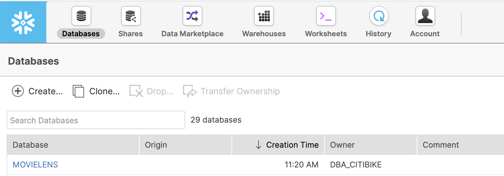
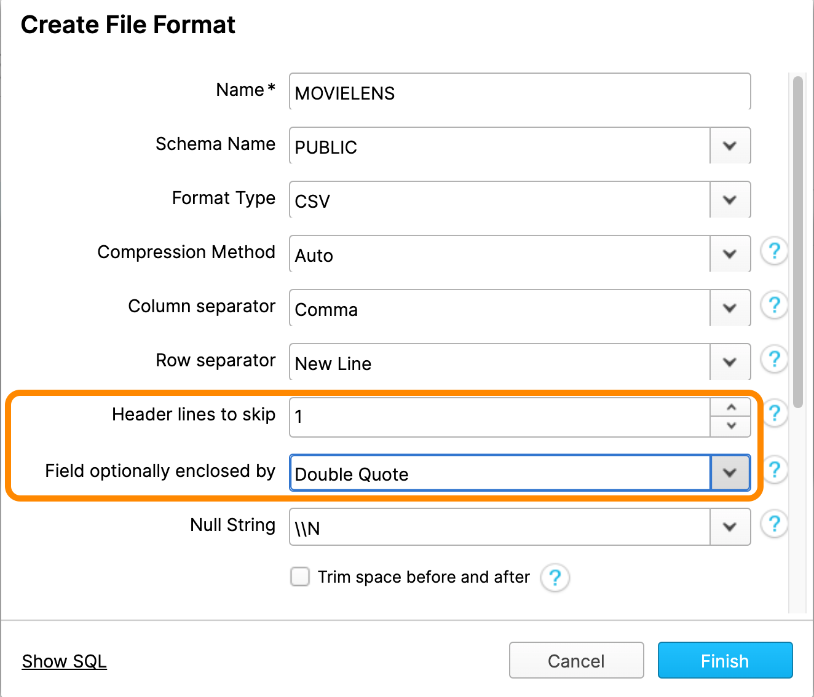
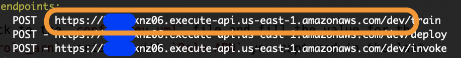
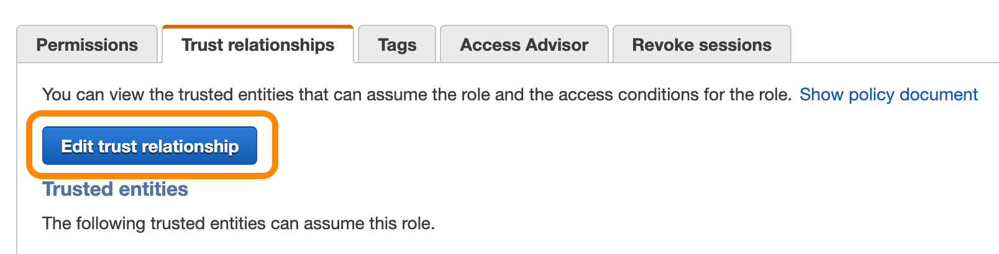
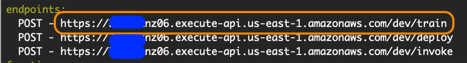
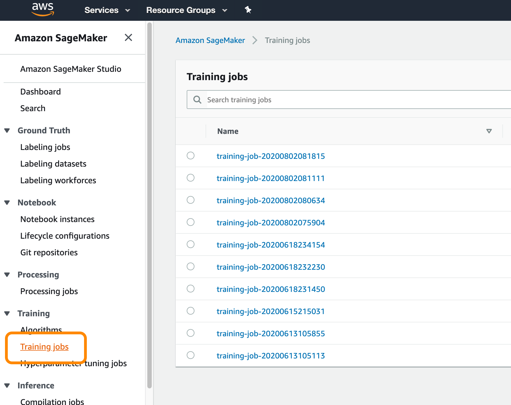
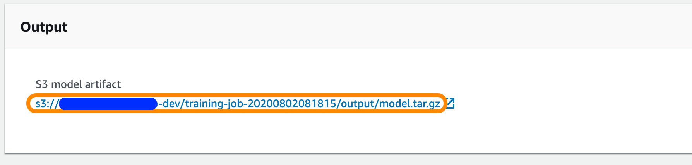

summary: Build a Recommendation Engine with AWS SageMaker and Snowflake
id: recommendation_engine_aws_sagemaker
categories: data-science-&-ml,solution-examples,partner-integrations
status: Published
Feedback Link: https://github.com/Snowflake-Labs/sfguides/issues
tags: SageMaker, AWS, Machine Learning
# Build a Recommendation Engine with Amazon SageMaker

<!-- ------------------------ -->

## Overview
Duration: 1

This guide will walk you through how to train a recommendation system using Amazon SageMaker with data stored in Snowflake. Along the way, we'll introduce you to the power of External Functions in Snowflake, showing you how we can use them to call external API endpoints.  The lessons found within will serve as an excellent introduction to bringing extensibility to your data pipelines.

We'll be using the [MovieLens dataset](https://grouplens.org/datasets/movielens/) to build a movie recommendation system. We'll use Snowflake as the dataset repository and Amazon SageMaker to train and deploy our Machine Learning model. The recommendations are powered by the SVD algorithm provided by the [Surprise](http://surpriselib.com/) python library.

You can view all source code of this guide on [GitHub](https://github.com/Snowflake-Labs/sfguide-recommender-pipeline).

### Prerequisites
- Familiarity with command-line navigation

### What You’ll Learn
- Load datasets into Snowflake
- Prepare Amazon SageMaker for training and model deployment
- Deploy AWS Lambda Functions & API Gateway Using Serverless Framework
- Model Training, Deployment, and Inference Using Snowflake External Functions

### What You’ll Need
- A [Snowflake](https://www.snowflake.com/) Account
- An IDE (such as [Visual Studio Code](https://code.visualstudio.com/))
- A [Snowflake account](https://trial.snowflake.com/) with `ACCOUNTADMIN` access.
- An AWS account with administrator access (or scoped IAM user with access to Lambda, API Gateway, SageMaker, AWS Systems Manager
- [Docker Desktop](https://www.docker.com/products/docker-desktop)
- [Serverless Framework](https://www.serverless.com/) - Please note the Serverless version (2.43.0) does not satisfy the "frameworkVersion" (>=1.2.0 <2.0.0) in serverless.yml
- Make sure you have the [AWS CLI version 2 installed](https://docs.aws.amazon.com/cli/latest/userguide/install-cliv2.html) and [configured](https://docs.aws.amazon.com/cli/latest/userguide/cli-chap-configure.html) with credentials
### What You’ll Build
- A custom training and inference docker image for SageMaker
- A serverless app to connect Snowflake and SageMaker using AWS Lambda and API Gateway
- SageMaker training, deployment, and inference instances

<!-- ------------------------ -->

## Load the data into Snowflake
Duration: 5

The first thing you'll need to do is download a small version of the dataset. Once downloaded, unzip the folder.

<button>

  [Download Dataset](https://files.grouplens.org/datasets/movielens/ml-latest-small.zip)
</button>

We're going to take that data and load it into some tables on Snowflake. First, you'll want to sign in to Snowflake. Then run the following block of code to set the context, create a compute warehouse, and create the tables:

```sql
use role sysadmin;
create database MOVIELENS;
use schema movielens.public;

CREATE OR REPLACE WAREHOUSE COMPUTE_WH WITH WAREHOUSE_SIZE = 'XSMALL' 
AUTO_SUSPEND = 60 AUTO_RESUME = TRUE;

create table movies  (
    movieid int,
    title varchar,
    genres varchar
);

create or replace table ratings (
    userid int,
    movieid int,
    rating float,
    timestamp timestamp_ntz
);
```

Let's break down what this code is doing. Remember that data in Snowflake needs three things: a database, a schema, and compute. First, we `create` a database called "MOVIELENS"  using the public schema "movielens.”

Then we `create` a warehouse called `COMPUTE_WH` and then, we `create` a table called "movies". The table has three columns: "movieid", "title", and "genres". We then `create` a second table called "ratings". This table has four columns: "userid", "movieid", "rating", and "timestamp_ntz".

Next, using the Snowflake UI menu bar, switch over to the Databases tab and select the `MOVIELENS` database you've just created.



**Note:** Since this is a small dataset, we can use the Snowflake UI to load this dataset into Snowflake. We recommend using the Snowflake Snowpipe service, the `copy` command, or partner ETL tools to load data for larger datasets and automated loads.

Now let's get some data into those empty tables. Navigate into the `MOVIES` table within the database. Now that you're inside a table, you can load data by clicking the `Load Data` button. You'll want to select an `XS` sized warehouse and hit `Next.`

Navigate to the files you downloaded earlier. You should see a file named `movies.csv`; that’s what we'll be using. Select it, and hit `next.`

Snowflake needs additional information to parse CSV files. CSV files vary slightly in how they're organized, such as what character they use to separate data pieces.

For this file, we'll be creating a new file format. Click the `+` button. Give it a name (such as "MOVIELENS"), and change the value of `Header lines to skip` to `1` and the `Field optionally enclosed by` to `Double Quote.` Click `Finish` and hit `Load` to load the `MOVIES` table.



Great! We've loaded data into the `MOVIES` table. Now it's time to do the same for the `RATINGS` table. Navigate into the empty `RATINGS` table, and click the `Load Data` button, just like before. This time, however, you'll want to select the `ratings.csv` file. Luckily, you don't need to create another file format; this file is formatted just like the previous one, so you can reuse your `MOVIELENS` File Format.

## Create tables for local testing
Duration: 5

We've got both tables of data into Snowflake! Now we can view our data. While we're at it, we can create some small testing tables when we test our SageMaker algorithm on our local machine:

```sql
use warehouse COMPUTE_WH;
select * from ratings limit 10;

-- INPUT TABLE: small dataset for local testing
create table ratings_train_data_local_test as
(select USERID, MOVIEID, RATING from ratings limit 1000);

-- OUTPUT TABLE: top 10 recommendations for local_testing
create or replace table user_movie_recommendations_local_test
(USERID int, TOP_10_RECOMMENDATIONS variant);
```

Fantastic! Now we can start dabbling in some machine learning code.

<!-- ------------------------ -->
## Setup Snowflake and AWS credentials
Duration: 10

In Amazon SageMaker, you have the option of using "built-in" algorithms or creating your own custom algorithm using Docker images. This lab will be using a single Docker image to package up our training and model inference code. Let’s get started!

Open a terminal session and clone this repository:

```plaintext
git clone https://github.com/Snowflake-Labs/sfguide-recommender-pipeline.git
```

Then navigate into the downloaded repository:

```plaintext
cd sfguide-recommender-pipeline/
```

Within this directory, you will see two subdirectories: `sagemaker` and `sls`. The `sagemaker` directory contains all of our training and deployment code. The `sls` directory contains code & definitions for serverless lambda functions that we can call from within Snowflake to automate our pipeline.

Next, open this file in an IDE: `/sfguide-recommender-pipeline/sagemaker/container/recommendation_engine/train`. This is the Python script containing all our training code.

Amazon SageMaker will run this `train` script when we tell it to begin training. Feel free to explore the `train()` method within this script to see what is going on. At a high level, the `train()` method performs the following steps:

- Retrieves a password from our credentials store (SSM).
- Connects to our Snowflake account and loads up a Pandas dataframe from an input table.
- Trains a collaborative filtering recommendation model using the Surprise library.
- Does bulk inference and stores the recommendation in an output table to calculate each user’s top 10 recommendations.
- Saves the model artifact in S3 so SageMaker can deploy it at a later time.

Go ahead and configure your Snowflake account’s connection settings, found in lines 23-24, and save the changes.

```python
### SNOWFLAKE CONFIGURATION ###
SF_ACCOUNT = '<your_snowflake_account>'
SF_WH = '<your_snowflake_warehouse_name>'
SF_USER = '<your_snowflake_username>'
###############################
```

Notice that the Snowflake account password is missing from the configuration. We should never store any password in code. This way, if the code is ever exposed to the public, access to your account isn't compromised. This is a great use case for environment variables.

In our case, we'll use AWS SSM to store our Snowflake password securely. We can do so with the following command; just fill in your Snowflake password in the `value` field. After making that change, run the command in the terminal:

```bash
aws ssm put-parameter \
    --name "snf_password" \
    --type "String" \
    --value "<your_snowflake_password>" \
```
If successful, you’ll get an output like this below, you could have versions greatere than 1 if you have used the ssm settings before:

```
{
    "Version": 1,
    "Tier": "Standard"
}
```

Next, let's package this code up in a Docker image. Get the docker daemon running by opening Docker Desktop. Then in the terminal, switch to the `/sagemaker/container` directory and run:

```plaintext
docker build -t snf-recommender-lab:latest .
```

**Note:** it might take a few minutes to finish when you build this image for the first time. You’ll see it performing tasks throughout the process, though.

<!-- ------------------------ -->

## Test the models locally
duration: 10

In a real-world development cycle, you'll generally want to test code locally to make sure it runs error-free before sending it off to SageMaker. The code we're using is already developed (and error-free), but let's test it locally anyway.

For local testing, SageMaker provides us with a testing framework located within the `/sagemaker/container/local_test` directory. Switch to this directory and test the training code locally:

```plaintext
./train_local.sh snf-recommender-lab
```

You should see the results of the training in terms of RMSE and other metrics:

```plaintext
                  Fold 1  Fold 2  Fold 3  Fold 4  Fold 5  Mean    Std     
RMSE (testset)    1.1164  1.0699  1.1076  1.1342  1.0849  1.1026  0.0228  
MAE (testset)     0.9153  0.8675  0.8945  0.9485  0.8969  0.9045  0.0268  
Fit time          0.05    0.05    0.05    0.05    0.05    0.05    0.00    
Test time         0.00    0.00    0.00    0.00    0.00    0.00    0.00    
Top 10 predictions for all users saved to Snowflake table named:  user_movie_recommendations_local_test
Training complete.
```

At the end of the above output, the output table’s name storing the bulk predictions’ results (the top 10 movie recommendations for each user) is printed. You can run the following SQL to see these results in Snowflake:

```sql
select * from user_movie_recommendations_local_test limit 10;
```

The top 10 movie recommendations are stored in a `VARIANT` type that can hold any arbitraryJSON object. In this case, it’s an array of movie IDs.

Now let's talk about those metrics that measure the accuracy of the training. RMSE is short for Root Mean Square Error. It basically tells you how closely the data is to the line of best fit. The lower the error the better, so naturally, we want a low RMSE.

In a little bit, we'll use the power of Amazon SageMaker to train over a more extensive training set and improve the RMSE.

But first, let's test the inference code (implemented in `predictor.py`). We'll do this using another script in the `/sagemaker/container/local_test` directory called `serve_local.sh`. Run the following command:

```
./serve_local.sh snf-recommender-lab
```

That command will start a test web server on your local machine. Go ahead and open a new terminal window, navigate back into that same directory, and run:

```
./predict.sh payload.csv
```

The `payload.csv` has a few `userid` and `movieid` pairs to test the trained model. You should see the predicted ratings in the output:

```plaintext
4.35892262701514
4.35892262701514
3.9207989638053626
4.242178682153201
```
Notice we get four predicted ratings for four user/movie pairs in the `payload.csv` file. Our inference code works - nice!

Both training and inference work on our local machine. Again, that was to be expected here, but getting it to work on your local machine first is a good practice in the real world.

<!-- ------------------------ -->
## Upload the Docker image
Duration: 10

Now we can push the Docker image up to [ECR](https://aws.amazon.com/ecr/), so SageMaker can use it for training and deployment. Go ahead and switch to `sfguide-recommender-pipeline/sagemaker/container` and run:

```
./build_and_push.sh snf-recommender-lab
```

**Note:** this will take a while the first time you run this since the whole Docker image needs to be uploaded to ECR.

Once this has been run, we can move on to the next step in our journey to using SageMaker. Before we do so though, you'll need to grab the image name in the output. You'll set it as `training_image_ecr_path` in a file later on.

```plaintext
This push refers to repository <image_name>
```

With that grabbed, we're on our way to using SageMaker!

<!-- ------------------------ -->

## Set up IAM role for Sagemaker

Duration: 5

Okay, so we're not *quite* to using SageMaker yet. First, we need to provision an Amazon API Gateway and the AWS Lambda functions that will help integrate Snowflake with SageMaker. We'll use the [Serverless Framework](https://serverless.com) to help us programmatically define and provision this infrastructure.

First, let's get some AWS settings squared away. We need to create an AWS IAM role to allow SageMaker training jobs to access needed services such as S3 and ECR.

You can manage IAM roles by going to the AWS Management Console and opening the [IAM console](https://console.aws.amazon.com/iam/). From there, select `Roles` from the left navigation pane. Then click `Create role`. The role type is `AWS Service`. Then select `SageMaker`, which will allow you to select `SageMaker - Execution` under "Select your use case".

Great! Now move on to the permissions page. You need to choose these managed policies: `AmazonSageMakerFullAccess` and `AmazonSSMReadOnlyAccess`. NOTE: we will add `AmazonSageMakerFullAccess` policy first.

Click through, give the role a specific name, and click create. After the role is created, go to the permissions tab and click on Attach Policy, search for `ssm` and pick `AmazonSSMReadOnlyAccess` and click apply. While in that role, find it and copy the `Role ARN value`. It's right at the top of the role's summary page. You'll need to copy it into `/sls/config.dev.yml`. Open the file in an IDE and set it as the `sagemaker_role_arn` variable.

Remember that value we told you to remember so you could set it `training_image_ecr_path` in a file? Well, this is also that file! Go ahead and do so now.

And finally, make sure you set the `region` value to the correct region. Checking if there are any `region` values to adjust is a good habit to get into. And be sure to save the file after all this!

<!-- ------------------------ -->

## Set up IAM role Snowflake External Functions
Duration: 5

Now, we need to create a role in your AWS account that Snowflake can assume and invoke the API Gateway. To do so, we'll need to make another AWS IAM role.

We'll start in the same place as before, the [IAM console](https://console.aws.amazon.com/iam/). But now, when asked to select the type of trusted entity, choose “Another AWS account.” Then, under “Specify accounts that can use this role,” paste in your AWS account ID. Your AWS account ID is the number embedded in any of the ARNs you noted down in the previous steps. Remember, It's in your `config.dev.yml` file.

```plaintext
arn:aws:iam::<account_id>/role/SageMakerRoleTest
```

Click on “Next: Permissions.” No permissions are needed right now, so just proceed to the next step. After you name and create the role, make note of the `Role ARN` once more. You'll place it in a file next.

The file in question is once again the `config.dev.yml` file. Change the value for unique_id to your unique username. This is required to make sure the S3 bucket name is unique for your deployment.Fill the value for the `snf_ef_role_arn` variable with the `Role ARN`.

Finally, fill out the `snf_ef_role_principal` with a value using this format:

```plaintext
arn:aws:sts::<account-number>:assumed-role/<external_function_role>/snowflake
```

Your `config.dev.yml` file should now look something like this:

```
unique_id: <username>
region: us-east-1
sagemaker_role_arn: arn:aws:iam::<account>:role/SageMakerRoleTest
training_image_ecr_path: <account>.dkr.ecr.us-west-2.amazonaws.com/snf-recommender-lab
snf_ef_role_arn: arn:aws:iam::<account>:role/Snowflake_External_Function_Role_Name
snf_ef_role_principal: arn:aws:sts::<account>:assumed-role/snf-ef-role-test/snowflake
```

And with that, we can move on to deploying the serverless app.

<!-- ------------------------ -->

#### Deploy the Serverless App with AWS Lambda and API Gateway

Duration: 3

With the blanks filled out in the `config.dev.yml` file, let's turn our attention to deploying the API Gateway and Lambda Functions.

Navigate into the `sls` directory inside a terminal and issue the following command to deploy the infrastructure:

```
sls deploy
```

If everything goes smoothly, you should see an output summary listing out the resources created by the Serverless Framework in your AWS account.

Straightforward, right? Now let's start incorporating Snowflake.

<!-- ------------------------ -->

## Connect the API Gateway with Snowflake
Duration: 5

Now that we have our Serverless infrastructure deployed let’s move over to the Snowflake UI and work some SQL magic! 🧙🏼‍♀️

Log into the Snowflake UI. We need to create API Integrations, so we need to work as an `ACCOUNTADMIN`:

```sql
use role ACCOUNTADMIN;
```

After setting your role, select a database and schema:

```sql
USE SCHEMA MOVIELENS.PUBLIC;
```

Now that we're in the right spot, we need to `create` the API integration object within Snowflake to point to the external API Gateway resource. You'll need to go back into `config.dev.yml` to grab the value you set `snf_ef_role_arn` to and set it as `api_aws_role_arn`.  You also need to get the endpoint URL from the Serverless output screen to set as the value for the `api_allowed_prefixes` field as highlighted in the screenshot below:



All together, the SQL command will look like this:

```sql
create or replace api integration snf_recommender_api_integration
api_provider = aws_api_gateway
api_aws_role_arn = '<snf_ef_role_arn>'
enabled = true
api_allowed_prefixes = ('<https://api_endpoint_url>');
```

By running that, you create the API integration object.

Now we need to set up trust between Snowflake and the new AWS IAM role we created earlier. Go ahead and run:

```sql
describe integration snf_recommender_api_integration
```

We'll need the values in the next step.

In a separate tab, open the AWS console and navigate to find the IAM role you created earlier. Under the `Trust relationships` click on `Edit trust relationship`.



Replace the JSON document with this snippet:

```json
{
    "Version": "2012-10-17",
    "Statement": [
        {
        "Effect": "Allow",
        "Principal": {
            "AWS": "<API_AWS_IAM_USER_ARN>"
        },
        "Action": "sts:AssumeRole",
        "Condition": {"StringEquals": { "sts:ExternalId": "<API_AWS_EXTERNAL_ID>" }}
        }
    ]
}
```

And then, replace the values of `API_AWS_IAM_USER_ARN` and `API_AWS_EXTERNAL_ID` with the corresponding values shown in the result of the `describe integration snf_recommender_api_integration` command in the last step. With those replaced, you're good to go! Just click `Update Trust Policy` and get ready to work with SageMaker!

<!-- ------------------------ -->
## Create the External Functions within Snowflake
Duration: 3

We'll create three External Functions: the first for training and bulk prediction, the second for deploying the model, and the third for invoking the model.

First up is one we'll use for training. To do so, you'll need to grab three URLs from the serverless output. First, we'll use the URL ending in `/train` for the training model function, then the URL ending in `/deploy` for the deploying model function, and the URL ending in `/invoke` for the invoking model function. Other than specifying which of the three, the URLs are the same:



`Create` the `train_and_get_recommendations` external function, replacing `<TRAIN_ENDPOINT_URL>` with that grabbed URL from the serverless output:

```sql
create or replace external function train_and_get_recommendations(input_table_name varchar, output_table_name varchar)
    returns variant
    api_integration = snf_recommender_api_integration
    as '<TRAIN_ENDPOINT_URL>';
```

Now we need to deploy the model. `Create` the `deploy_model` external function, replacing `<DEPLOY_ENDPOINT_URL>` with that `/deploy` URL you grabbed from the serverless output:

```sql
create or replace external function deploy_model(model_name varchar, model_url varchar)
returns variant
api_integration = snf_recommender_api_integration
as '<DEPLOY_ENDPOINT_URL>';
```

Finally let's invoke that model. `Create` the `invoke_model` external function, replacing `<INVOKE_ENDPOINT_URL>` with, you guessed it, the `/invoke` URL from the serverleess output:

```sql
create or replace external function invoke_model(model_name varchar, user_id varchar, item_id varchar)
returns variant
api_integration = snf_recommender_api_integration
as '<INVOKE_ENDPOINT_URL>';
```

Great! Now that we’ve created all the functions, we need to grant the ability to use them. To do so, we need to grant usage to the `sysadmin` role like so:

```sql
grant usage on function train_and_get_recommendations(varchar, varchar) to role sysadmin;
grant usage on function deploy_model(varchar, varchar) to role sysadmin;
grant usage on function invoke_model(varchar, varchar, varchar) to role sysadmin;
```

And with usage granted, we can now test the functions out!

<!-- ------------------------ -->

## Test the External Functions
Duration: 15

Now that our Snowflake External Functions are deployed, and the right permissions are in place, it’s time to test the functions and see how we can trigger the training and deployment of models right from Snowflake.

In the Snowflake UI, switch over to using the `sysadmin` role:

```sql
use role sysadmin;
```

Let's make sure the External Functions are correct and accessible:

```sql
show external functions;
```

Let's create training data sets with `ratings_train_data` similar to `ratings` table with sample values and an empty `user_movie_recommendations` table to store the predictions per user 

```sql
create or replace table ratings_train_data as 
    (select USERID, MOVIEID, RATING 
    from ratings limit 10000);

create or replace table user_movie_recommendations 
(USERID float, 
TOP_10_RECOMMENDATIONS variant);
```
Now let's trigger SaegeMaker training! `select` the `train_and_get_recommendations` model to get the top 10 ratings for each user in our target table.

You'll need to specify two parameters. First, `MOVIELENS.PUBLIC.ratings_train_data` is the *input* table containing the training data. Second, `MOVIELENS.PUBLIC.user_movie_recommendations`, is the *output* table where the top 10 predictions will be stored.

```sql
select train_and_get_recommendations('MOVIELENS.PUBLIC.ratings_train_data','MOVIELENS.PUBLIC.user_movie_recommendations');
```

The training will about 5 to 10 minutes to complete. You can check the status of the training by clicking on `Training Jobs` from the SageMaker console:



Remember, this function not only trained a new model using the SVD algorithm, but also made some predictions as well. They're in that output table we specified when running the function. We can view the top 10 movie recommendations for each user like so:

```sql
select * from user_movie_recommendations limit 10;
```

Great! Now let's look at how to make this magic possible in *real-time*!

<!-- ------------------------ -->
## Enable real-time predictions
Duration: 20

When a user pulls up details for a movie, how do we get the predicted rating for this user/movie pair? We'll have to use a *real-time* prediction endpoint. We can create this endpoint by using the model artifact produced by the training step above.

From the SageMaker console, click on the training job name to view details. Scroll down to find and copy the value of the model artifact. It'll look something like this:



Now, copy the S3 model artifact path into the SQL below and run it to deploy the model as an API, using the `deploy_model` function you created earlier.

```sql
select deploy_model('movielens-model-v1', '<S3_MODEL_ARTIFACT>');
```

Deploying an endpoint will take some time as well, perhaps 15 minutes or so. You can check the `Endpoints` tab within the SageMaker console to view the endpoint’s status.

While the endpoint is deploying, let's create some dummy data to test out the inference API:

```sql
-- create a table to hold pairs of users and movies where we DO NOT have a rating
create or replace table no_ratings (USERID float, MOVIEID float);

insert into no_ratings (USERID, MOVIEID) values
    ('1', '610'),
    ('10', '313'),
    ('10', '297'),
    ('5', '18'),
    ('5', '19');
```

The endpoint will be fully deployed when its status is "In Service.” When that happens, we can call the deployed model using the `invoke-model` function you created earlier. The format for making a real-time prediction follows this SQL:

```sql
--real-time prediction for an individual movie for a particular user
select nr.USERID, nr.MOVIEID, m.title, invoke_model('movielens-model-v1', nr.USERID, nr.MOVIEID) as rating_prediction 
from no_ratings nr, movies m
where nr.movieid = m.movieid;
```

Amazing! Feel free to test it out with some examples. From here, you have now have the ability to make real-time predictions for user/movie combinations.

<!-- ------------------------ -->

## Next Steps: Automating the ML Pipeline
Duration: 1

Alright, so what's next? Well, that's the end of this guide, but that's not the end of SageMaker's potential! Try looking into automating this ML workflow. As new users and movies are added, you can automate the ML training, bulk prediction, and model deployment.

Not sure where to start? Check out Snowflake's [Continuous Data Pipelines](https://docs.snowflake.com/en/user-guide/data-pipelines.html) to automate `Tasks`. The tasks in question will be the External Functions you created above. Happy automating!

### What We've Covered
- Load datasets into Snowflake
- Prepare Amazon SageMaker for training and model deployment
- Deploy AWS Lambda Functions & API Gateway Using Serverless Framework
- Model Training, Deployment, and Inference Using Snowflake External Functions
