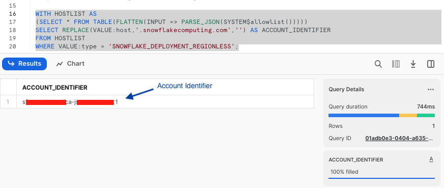
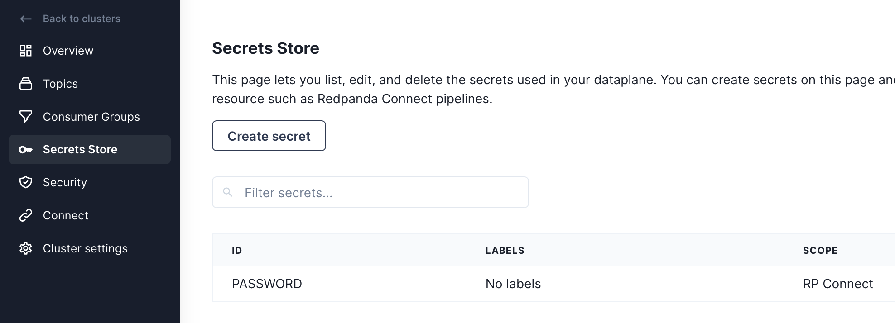

author: Tyler Rockwood
id: redpanda-connect-ingestion-with-snowpipe-streaming
categories: snowflake-site:taxonomy/solution-center/certification/quickstart, snowflake-site:taxonomy/product/data-engineering
language: en
summary: How to use Redpanda Connect and Snowpipe Streaming to ingest data into Snowflake. 
environments: web
status: Published 
feedback link: https://github.com/Snowflake-Labs/sfguides/issues

# Ingesting data with Snowpipe Streaming using Redpanda Connect
<!-- ------------------------ -->
## Overview 

Snowflake's Snowpipe streaming capabilities are designed for rowsets with variable arrival frequency.
It focuses on lower latency and cost for smaller data sets. This helps data workers stream rows into Snowflake
without requiring files with a more attractive cost/latency profile.

Here are some of the use cases that can benefit from Snowpipe streaming:
- IoT time-series data ingestion
- CDC streams from OLTP systems
- Log ingestion from SIEM systems
- Ingestion into ML feature stores

Redpanda Connect leverages Snowpipe streaming to make loading data from dozens of different inputs simple and efficent.
This guide will show how to use any Apache Kafka® compatible message broker like Redpanda to ingest data into Snowflake
in a few lines of YAML. This same approach works for the dozens of [input sources](https://docs.redpanda.com/redpanda-connect/components/inputs/about/#categories)
supported by Redpanda Connect, such as [a MQTT server](https://docs.redpanda.com/redpanda-connect/components/inputs/mqtt/),
 [Google PubSub](https://docs.redpanda.com/redpanda-connect/components/inputs/gcp_pubsub/), or [Postgres CDC](https://docs.redpanda.com/redpanda-connect/components/inputs/postgres_cdc/).

### What You’ll Learn 
- Produce data into a topic using Redpanda Cloud
- How to use Redpanda Connect to stream data into Snowflake
- Using Snowflake to query realtime data

### What You’ll Need 
- A [Snowflake account](https://trial.snowflake.com/).
- A [Redpanda Cloud account](https://cloud.redpanda.com/sign-up)

### What You’ll Build 
- Create a Redpanda Cloud Serverless cluster.
- Generate data into a Redpanda topic using Redpanda Connect.
- Realtime ingestion pipeline into Snowflake using Redpanda Connect.

<!-- ------------------------ -->
## Prepare Snowflake Account for streaming

#### 1. Creating user, role, and database
First login to your Snowflake account as a power user with ACCOUNTADMIN role. 
Then run the following SQL commands in a worksheet to create a user, database and the role that we will use in the lab.

```
-- Set default value for multiple variables
-- For purpose of this workshop, it is recommended to use these defaults during the exercise to avoid errors
-- You should change them after the workshop
SET PWD = 'Test1234567';
SET USER = 'STREAMING_USER';
SET DB = 'STREAMING_DB';
SET ROLE = 'REDPANDA_CONNECT';
SET WH = 'STREAMING_WH';

USE ROLE ACCOUNTADMIN;

-- CREATE USERS
CREATE USER IF NOT EXISTS IDENTIFIER($USER) PASSWORD=$PWD  COMMENT='STREAMING USER FOR REDPANDA CONNECT';

-- CREATE ROLES
CREATE OR REPLACE ROLE IDENTIFIER($ROLE);

-- CREATE DATABASE AND WAREHOUSE
CREATE DATABASE IF NOT EXISTS IDENTIFIER($DB);
USE IDENTIFIER($DB);
CREATE OR REPLACE WAREHOUSE IDENTIFIER($WH) WITH WAREHOUSE_SIZE = 'SMALL';

-- GRANTS
GRANT CREATE WAREHOUSE ON ACCOUNT TO ROLE IDENTIFIER($ROLE);
GRANT ROLE IDENTIFIER($ROLE) TO USER IDENTIFIER($USER);
GRANT OWNERSHIP ON DATABASE IDENTIFIER($DB) TO ROLE IDENTIFIER($ROLE);
GRANT USAGE ON WAREHOUSE IDENTIFIER($WH) TO ROLE IDENTIFIER($ROLE);

-- SET DEFAULTS
ALTER USER IDENTIFIER($USER) SET DEFAULT_ROLE=$ROLE;
ALTER USER IDENTIFIER($USER) SET DEFAULT_WAREHOUSE=$WH;


-- RUN FOLLOWING COMMANDS TO FIND YOUR ACCOUNT IDENTIFIER, COPY IT DOWN FOR USE LATER
-- IT WILL BE SOMETHING LIKE <organization_name>-<account_name>
-- e.g. ykmxgak-wyb52636

WITH HOSTLIST AS 
(SELECT * FROM TABLE(FLATTEN(INPUT => PARSE_JSON(SYSTEM$allowlist()))))
SELECT REPLACE(VALUE:host,'.snowflakecomputing.com','') AS ACCOUNT_IDENTIFIER
FROM HOSTLIST
WHERE VALUE:type = 'SNOWFLAKE_DEPLOYMENT_REGIONLESS';

```
Please write down the Account Identifier, we will need it later.


Next we need to configure the public key for the streaming user to access Snowflake programmatically.

#### 2. Create a key-pair to be used for authenticating with Snowflake
Create a [key pair](https://docs.snowflake.com/user-guide/key-pair-auth) in your local terminal by executing the following commands. You will be prompted to give an encryption password, remember this phrase, you will need it later.

```commandline
cd $HOME
openssl genrsa 2048 | openssl pkcs8 -topk8 -inform PEM -out rsa_key.p8
```
See below example screenshot:


Next we will create a public key by running following commands. You will be prompted to type in the phrase you used in the above step.
```
openssl rsa -in rsa_key.p8 -pubout -out rsa_key.pub
```
see below example screenshot:


First, in the Snowflake worksheet, replace < pubKey > with the content of the file `rsa_key.pub` without the public key delimiters in the following SQL command and execute.

```commandline
use role accountadmin;
alter user streaming_user set rsa_public_key='< pubKey >';
```
See below example screenshot:


#### 2. Create a schema using `streaming_user`

Now logout of Snowflake, sign back in as the default user `streaming_user` we just created with the associated password (default: Test1234567).
Run the following SQL commands in a worksheet to create a schema (e.g. `STREAMING_SCHEMA`) in the default database (e.g. `STREAMING_DB`):

```commandline
SET DB = 'STREAMING_DB';
SET SCHEMA = 'STREAMING_SCHEMA';

USE IDENTIFIER($DB);
CREATE OR REPLACE SCHEMA IDENTIFIER($SCHEMA);
```

<!-- ------------------------ -->
## Setup Redpanda

### Create a Redpanda Serverless Cluster

Create a serverless cluster in Redpanda Cloud by navigating to [https://cloud.redpanda.com/clusters/create](https://cloud.redpanda.com/clusters/create) while signed into a Redpanda Cloud account.


### Create a topic in Redpanda Console

Once the cluster is created, we can navigate to the topics tab of the console. We can then create a topic called `demo_topic` by clicking on the "Create topic" button, and accepting the default topic configuration.


### Create a user and ACLs in Redpanda Console

Now that we have a cluster and a topic setup, we need to create a user that Redpanda Connect will use to access the cluster. Navigate to the Security page, click the "Create user" button and create a user named `MyRedpandaUser`. Make sure to copy the autogenerated password before clicking "Create".


Next you'll need to create ACLs for the user to give it access to our cluster and `demo_topic`. You can edit ACLs for the user we just created by going to the "ACLs" tab and clicking on the user `MyRedpandaUser`. We'll give our Redpanda Connect user the minimal permissions needed to interact with our `demo_topic` we created. We'll allow read/write access to the `demo_topic`, and grant full permissions on any consumer group with the prefix `redpanda_connect_`. Your ACLs modal should look like the following before clicking "OK".


### Add password as secret in Redpanda Connect

Before we start creating pipelines with Redpanda Connect, we're going to add the password for our `MyRedpandaUser` as a secret, so it can be used in pipelines without hardcoding the value inside
the configuration file. First navigate to the Secrets Store page, then click on the "Create secret" button. Using the password for `MyRedpandaUser` created in the previous step, add that as a secret by clicking on the "Create secret" button.



<!-- ------------------------ -->
## Generating load into Redpanda

Now that Redpanda is all setup, we can now create our first Redpanda Connect pipeline. 

Redpanda Connect pipelines consist of an input, a series of processors, and an output - all defined in a simple configuration file.
Redpanda Connect is a full stream processor and it's possible to do various sorts of fan-in, fan-out or other patterns. For this first pipeline, we're going to generate some JSON data into our topic using
Redpanda Connect's [`generate`](https://docs.redpanda.com/redpanda-cloud/develop/connect/components/inputs/generate/) input, and send that data to Redpanda using the [`kafka_franz`](https://docs.redpanda.com/redpanda-cloud/develop/connect/components/outputs/kafka_franz/) output.

To create our pipeline, we'll navigate to the Connect page, click on the "Pipeline" tab and click "Create pipeline".

On the pipeline creation page we'll name the pipeline "LoadGenerator" and give it a description of "Produce JSON data into `demo_topic`". Then we'll use the following YAML configuration as our pipeline definition.

```yaml
input:
  # Generate a batch of 100 JSON records every second
  generate:
    mapping: |
      root = {
        "id": snowflake_id(),
        "name": fake("name"),
        "email": fake("email")
      }
    interval: 10ms
    count: 0
    batch_size: 100
pipeline:
  # No transformations or enrichment is needed for this.
  processors: []
output:
  # We're going to output data to our Redpanda broker
  # using the `kafka_franz` output.
  kafka_franz:
    # This context variable will be replaced at runtime with the
    # broker address.
    seed_brokers: ["${REDPANDA_BROKERS}"]
    topic: "demo_topic"
    tls: {enabled: true}
    sasl:
      - mechanism: SCRAM-SHA-256
        username: MyRedpandaUser
        # Inject our secret we created in the previous step.
        password: "${secrets.PASSWORD}"
    max_in_flight: 4
```

Here is what the screen should look like before launching your pipeline and kicking off the load generation into `demo_topic`.


Once the pipeline is created and running, we can navigate back to the Topics page and click on our
`demo_topic` to see the records being produced and flowing through the broker.


<!-- ------------------------ -->
## Stream data into Snowflake using Redpanda Connect

Now that we have data in Redpanda, we can stream it into Snowflake using Redpanda Connect's
[Snowpipe Steaming](https://docs.redpanda.com/redpanda-connect/components/outputs/snowflake_streaming/) output. This output expects JSON like data as input, and will map each field in the top level object to
a column in Snowflake. The connector is also able to manage the schema in the output table, autocreating
tables, and altering the schema when new columns appear in the pipeline.

### Create a secret for the private key 

Before we create the new pipeline, we'll need to add the private key we created in 
step 2 as a secret for Redpanda Connect. Head to the Secrets store page and click on the "Create secret" button,
this time creating a secret called `SNOWFLAKE_KEY` with the entire contents of `rsa_key.p8`, replacing the
newlines with escaped newlines. The following `awk` command can output the RSA key in the correct format to paste as a secret:

```commandline
awk '{printf "%s\\n", $0}' rsa_key.p8
```


Now we will create one more secret for the passphrase of the RSA key. Click again on the "Create secret" button to make a `SNOWFLAKE_KEY_PASS` secret with the password for the RSA key.


### Create the pipeline

With our secrets in place, we can now proceed to create our pipeline. Navigate to the "Pipelines" tab,
click "Create pipeline", then give the pipeline a name "SinkToSnowflake" with a description of "Send batches of records to Snowflake from `demo_topic`". For the configuration file, copy and paste the YAML below, and don't forget to replace the account identifier with the value you queried for in step 1

```yaml
input:
  # Read data from our `demo_topic`
  kafka_franz:
    seed_brokers: ["${REDPANDA_BROKERS}"]
    topics: ["demo_topic"]
    consumer_group: "redpanda_connect_to_snowflake"
    tls: {enabled: true}
    sasl:
      - mechanism: SCRAM-SHA-256
        username: MyRedpandaUser
        password: "${secrets.PASSWORD}"
pipeline:
  # No transforms are needed
  processors: []
output:
  # Write data to snowflake in batches to get bigger files
  snowflake_streaming:
    # Make sure to replace this with your account identifier
    # from step #2
    account: "ACCOUNT-IDENTIFIER-FROM-STEP-2"
    user: STREAMING_USER
    role: REDPANDA_CONNECT
    database: STREAMING_DB
    schema: STREAMING_SCHEMA
    table: STREAMING_TABLE
    # Inject our private key and password
    private_key: "${secrets.SNOWFLAKE_KEY}"
    private_key_pass: "${secrets.SNOWFLAKE_KEY_PASS}"
    # Automatically create tables and add new columns
    schema_evolution:
      enabled: true
    max_in_flight: 1
    batching:
      byte_size: 50_000_000 # Collect 50MB of JSON data before flushing
      period: 120s # or after 120 seconds, which ever comes first
```

This should look like the following once you are done, and at this point you can create the pipeline.


Now that the pipeline is running, we can query the data being streamed in to Snowflake. Switch back to
the Snowflake worksheet and run the following SQL statements to see the auto created table, and its schema:

```
SELECT * FROM STREAMING_DB.STREAMING_SCHEMA.STREAMING_DATA LIMIT 50;
```

You'll see results that look something like the below screenshot.


<!-- ------------------------ -->
## Cleanup

When you are done with the demo, to tear down the Redpanda Cluster, simply go to the Cluster settings page and click "Delete cluster".

For Snowflake cleanup, execute the following SQL commands.

```
USE ROLE ACCOUNTADMIN;

DROP DATABASE STREAMING_DB;
DROP WAREHOUSE STREAMING_WH;
DROP ROLE REDPANDA_CONNECT;

-- Drop the streaming user
DROP USER IF EXISTS STREAMING_USER;
```

<!-- ------------------------ -->
## Conclusion And Resources

In this lab, we built a demo to show how to ingest data using Snowpipe streaming and Redpanda with low latency.
We demonstrated this using Redpanda Connect's Snowflake output, and showed how in a few lines of YAML you can
create a production ready ingestion pipeline.

### What You Learned
- How to produce data into a topic using Redpanda Cloud
- How to use Redpanda Connect to stream data into Snowflake
- How to using Snowflake to query realtime data

### Related Resources
- [Getting started with Snowflake](/en/developers/guides/)
- [Snowpipe Streaming](https://docs.snowflake.com/en/user-guide/data-load-snowpipe-streaming-overview)
- [Snowpipe Demystified](https://medium.com/snowflake/snowpipe-streaming-demystified-e1ee385c6d9c)
- [Redpanda Serverless](https://www.redpanda.com/redpanda-cloud/serverless)
- [Redpanda Connect Documentation](https://docs.redpanda.com/redpanda-connect/home/)
- [Redpanda Connect Snowflake Connector](https://docs.redpanda.com/redpanda-connect/components/outputs/snowflake_streaming/)

