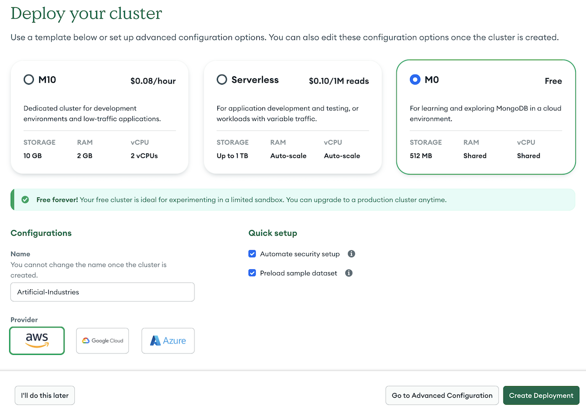
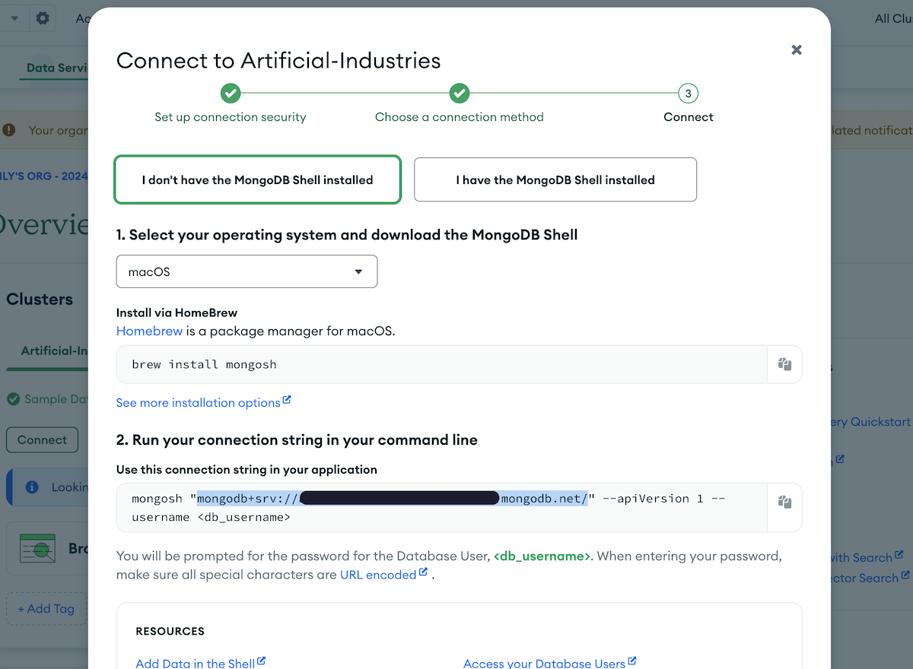
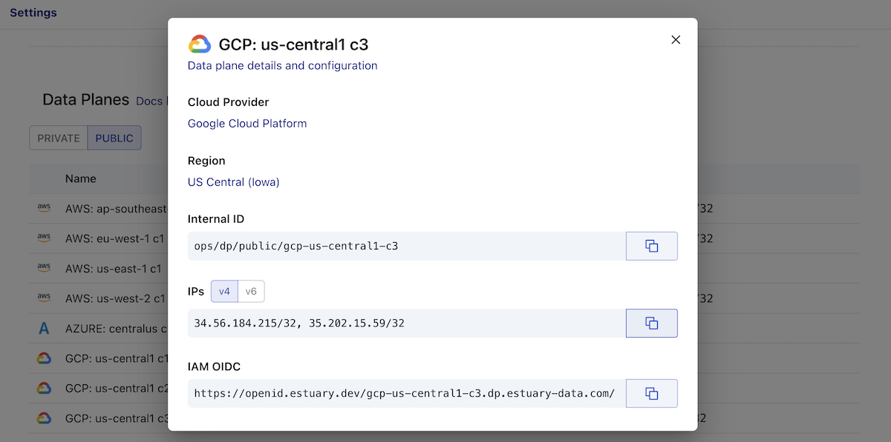
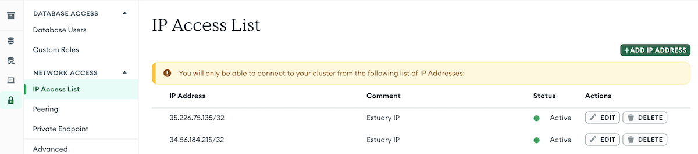
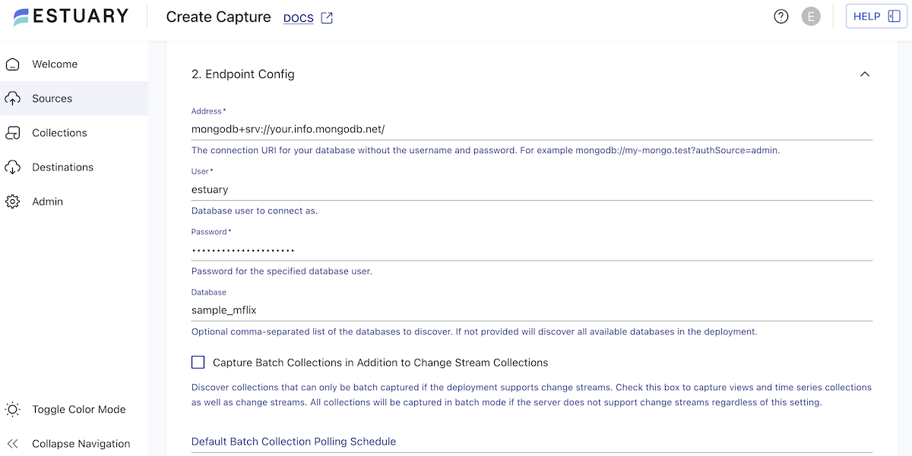
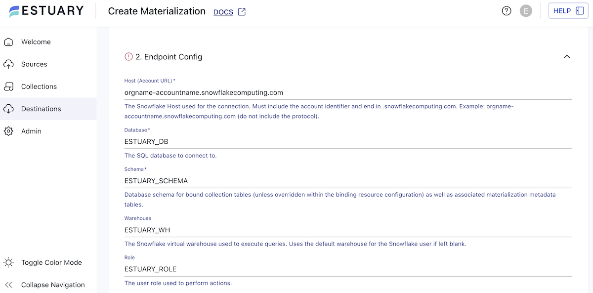
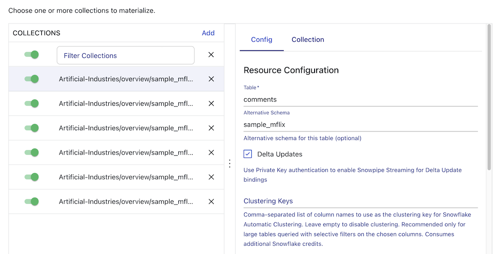

author: Emily Lucek
id: replicate-mongodb-data-to-snowflake-with-estuary
language: en
summary: Learn how to create a data pipeline from MongoDB to Snowflake with Estuary to ingest data in real time.
categories: snowflake-site:taxonomy/solution-center/certification/quickstart, snowflake-site:taxonomy/solution-center/certification/partner-solution, snowflake-site:taxonomy/product/data-engineering, snowflake-site:taxonomy/snowflake-feature/ingestion, snowflake-site:taxonomy/snowflake-feature/snowpipe-streaming
environments: web
status: Published 
feedback link: https://github.com/Snowflake-Labs/sfguides/issues

# Replicate MongoDB Data to Snowflake with Estuary
<!-- ------------------------ -->
## Overview

[MongoDB](https://www.mongodb.com/) is one of the most popular document stores, or NoSQL databases, available today.
It can flexibly handle schemas and its JSON document format matches many web developers' needs, so it's a frequent choice for a web application backend.

However, any one database solution can't be everything for everyone. When it's time for analytics, many engineers turn to [Snowflake](https://www.snowflake.com/).

A data warehouse built with speed and scalability in mind, Snowflake allows users to run queries across vast datasets without impacting production servers.
Snowflake can unify data, combining and allowing querying on structured and unstructured data.

Moving data from one place to another is one of those common engineering tasks that has been solved and solved again.
Instead of reinventing the wheel with custom pipelines each time the need arises, engineers can choose from a host of data pipeline tools, like Estuary.

[Estuary](https://estuary.dev/) provides connectors for low- and no-code pipelines, so engineers can start moving data in a matter of minutes.
It's a flexible product with the ability to retrieve data in real-time or in batch workflows (or both in the same pipeline) and allows for detailed data transformation.

In this guide, we'll use Estuary to build a full pipeline from MongoDB to Snowflake, exploring aspects of the different systems along the way.

### Prerequisites
* Familiarity with working with databases

### What You'll Learn 
* How to set up a MongoDB cluster
* How to configure source and destination connectors in Estuary
* How CDC and Snowpipe Streaming combine for real-time data flows

### What You'll Need 
* An [Estuary](https://dashboard.estuary.dev/register) account
* A [MongoDB](https://www.mongodb.com/cloud/atlas/register) account
* A [Snowflake](https://signup.snowflake.com/) account

Free trial versions are available for all resources. We'll explore specific setup in depth later in this guide.

### What You'll Build 
* A complete pipeline from MongoDB to Snowflake, with the option for real-time data

<!-- ------------------------ -->
## Initial MongoDB Setup

For this tutorial, we'll set up a new MongoDB cluster in Atlas and prepare it for connection with Estuary.
If you already have a MongoDB database you'd like to use, you can skip cluster creation steps, but note that you will still need to provision configurations like IP allowlisting.

### Create a Cluster

To start, [log in to your MongoDB](https://account.mongodb.com/account/login) account.

Select the **Create Cluster** button. You will see a configuration screen:



On this screen:

* Select the free M0 cluster.
   * Note that you can only have one free Atlas M0 cluster. If you already have a cluster and don't wish to rack up charges, you may use your existing cluster for this tutorial.
* Ensure that the **Preload sample dataset** option is checked.
   * This will give us some starting data to transfer to Snowflake.
* Optionally update your provider or region.
   * MongoDB's pre-selected options should be sufficient for most cases.

Once everything is configured, select **Create Deployment**.

You will then move on to a screen with connection options. Here:

1. Select the **Shell** connection option.
   * We will not use the `mongosh` CLI itself, so you can skip the steps listed on the connection screen.
2. Find the example CLI command that includes your MongoDB server address.
   * This should be something like `mongodb+srv://your-cluster-name.abc.mongodb.net/`.
3. Copy the server address and save it for later.
   * We'll use this information in the next step, "Create a Capture in Estuary."
4. You can then close the overlay.



It may take a few minutes to finish loading the sample dataset. After that, your database will be all set up!
Feel free to browse your MongoDB collections to become familiar with the generated data structure.

### Add a Database User

While we're still in the MongoDB dashboard, let's set up a couple more items so that creating a capture with Estuary later will be smooth sailing.

First on the list is to create a service account for Estuary access.

1. On the lefthand sidebar, find the **Security** section and select **Database & Network Access**.
2. Click the **Add new database user** button.
3. Provide a username and password under **Password Authentication**.
   * Make sure to save these details for later.
4. Under **Database User Privileges**, add a role to confer at least Read privileges to your user.
5. Click **Add user**.

### Configure Network Access

By default, MongoDB restricts access to your cluster to certain known IPs.
So, besides a user for Estuary, we'll also need to allow incoming traffic from Estuary's IP addresses.

For that, we'll first need to retrieve our IP addresses from Estuary.
Estuary's architecture uses separate control and data planes to facilitate data isolation.
This also means that each data plane has its own set of IP addresses.

We can look up the relevant IPs from the Estuary dashboard:

1. [Log in to your Estuary account](https://dashboard.estuary.dev/).
2. Navigate to the [Admin Settings page](https://dashboard.estuary.dev/admin/settings) (select **Admin** from the sidebar and then the **Settings** tab).
3. Scroll down to the **Data Planes** table.
   * This table lists all available data planes for your account. The best choice is often the data plane whose cloud provider and region most closely match your Snowflake and MongoDB selections.
4. Select the data plane you intend to use for your pipeline. This opens a modal with additional details.
5. Copy the provided IP addresses for that data plane. These addresses are stable.



Back in the MongoDB dashboard, add these IPs to your access list:

1. Find the **IP Access List** page.
   * This will be under the **Database & Network Access** section, same as **Database Users**.
2. Click the **Add IP address** button.
3. Add the desired IP to the **Access List Entry** field.
4. Optionally add a comment (such as "estuary") and **Confirm**.
5. Repeat for multiple data plane IPs.



With all of that configured, we're done with the MongoDB dashboard for now.
Let's move back to the Estuary dashboard to capture our MongoDB data and start our pipeline.

<!-- ------------------------ -->
## Create a Capture in Estuary

Now that we actually have data to replicate, we can begin our Estuary pipeline.

Estuary's MongoDB connector uses CDC, or Change Data Capture, to stay up-to-date with your database's data.
CDC captures a stream of changes as they occur, including insertions, updates, and deletions.

In MongoDB, CDC is often implemented using [change streams](https://estuary.dev/blog/mongodb-change-data-capture/).
This is what Estuary will use, on a preferential basis, to follow along with change events.

CDC on your source in turn allows you to keep downstream systems updated in real time with a complete history of records.

To set up your MongoDB source connector in Estuary:

1. Begin from the [Estuary dashboard](https://dashboard.estuary.dev/).
2. On the lefthand sidebar, select **Sources**.
3. Click the **New Capture** button.
4. Search for "MongoDB" and select **Capture**.

This will open a configuration screen for the capture.
Here, make sure to fill out the following required fields in the **Capture Details** and **Endpoint Config** sections:

* **Name:** a unique name for your capture.
* **Data Plane:** make sure you select the data plane whose IPs you allowlisted in MongoDB.
* **Address:** the server address you retrieved from MongoDB's connection options screen in the last section.
* **User:** the username for the MongoDB database user you created in the last section.
* **Password:** the password for the MongoDB database user you created in the last section.



For this demo, the required fields are all we need.
To customize your experience further, you can optionally configure other settings.
See [Estuary's documentation](https://docs.estuary.dev/reference/Connectors/capture-connectors/MongoDB/) for more on these additional MongoDB capture options.

When your configuration is ready, press the blue **Next** button.

Estuary will automatically discover available databases and tables in your cluster.
You can select from any, or all, of these schemas to replicate.
Choose one or more you'd like to transfer to Snowflake and then click **Save and Publish**.

Your selected datasets will start to populate associated Estuary *collections*.
This is an intermediate step between sources and destinations that allows you to easily replay or backfill data, or combine multiple sources and destinations in your pipeline.
You can also select a collection to preview the data it's received so far from your capture.

While this guide won't go into much depth on collections, this would be where you could apply SQL, TypeScript, or Python transformations on your data before storage in your destination.

In the next step, we'll finally get to work with Snowflake as we finalize our data pipeline.

<!-- ------------------------ -->
## Create a Snowflake Materialization

It's time for Snowflake to take center stage.
Connector setup for our materialization will be similar to our capture: we'll first perform some prep on Snowflake's end before completing the connection in Estuary.

### Set up Snowflake resources

On the Snowflake side:

1. Open up your Snowflake console.
2. Create a new SQL worksheet: click the **+** button and select to create a new SQL file.
3. Copy the following script and paste it into the SQL console. This will set up some resources for your integration, including a service user for Estuary.

  ```SQL
  set database_name = 'ESTUARY_DB';
  set warehouse_name = 'ESTUARY_WH';
  set estuary_role = 'ESTUARY_ROLE';
  set estuary_user = 'ESTUARY_USER';
  set estuary_schema = 'ESTUARY_SCHEMA';
  -- create role and schema for Estuary
  create role if not exists identifier($estuary_role);
  grant role identifier($estuary_role) to role SYSADMIN;
  -- Create snowflake DB
  create database if not exists identifier($database_name);
  use database identifier($database_name);
  create schema if not exists identifier($estuary_schema);
  -- create a user for Estuary
  create user if not exists identifier($estuary_user)
    type = service
    default_role = $estuary_role
    default_warehouse = $warehouse_name;
  grant role identifier($estuary_role) to user identifier($estuary_user);
  -- Estuary requires case-sensitive quoted identifiers (e.g. "_meta/op").
  alter user identifier($estuary_user) set QUOTED_IDENTIFIERS_IGNORE_CASE = FALSE;
  grant all on schema identifier($estuary_schema) to identifier($estuary_role);
  -- create a warehouse for Estuary
  create warehouse if not exists identifier($warehouse_name)
    warehouse_size = xsmall
    warehouse_type = standard
    auto_suspend = 60
    auto_resume = true
    initially_suspended = true;
  -- grant Estuary role access to warehouse
  grant USAGE
    on warehouse identifier($warehouse_name)
    to role identifier($estuary_role);
  -- grant Estuary access to database
  grant CREATE SCHEMA, MONITOR, USAGE on database identifier($database_name) to role identifier($estuary_role);
  -- change role to ACCOUNTADMIN for STORAGE INTEGRATION support to Estuary (only needed for Snowflake on GCP)
  use role ACCOUNTADMIN;
  grant CREATE INTEGRATION on account to role identifier($estuary_role);
  use role sysadmin;
  COMMIT;
  ```

4. Select the drop-down arrow next to the **Run** button and choose to **Run All**.

Snowflake will execute the queries, creating a user, schema, database, and warehouse, and granting the proper permissions.

We'll then need to set up JWT authentication for our service user.
For that, we need to generate a public-private [key-pair](https://docs.snowflake.com/en/user-guide/key-pair-auth).
The public key will be attached to the Snowflake user while Estuary will hold the private key.

You can generate your keys in a terminal using `openssl`:

```shell
# generate a private key
openssl genrsa 2048 | openssl pkcs8 -topk8 -inform PEM -out rsa_key.p8 -nocrypt
# generate a public key
openssl rsa -in rsa_key.p8 -pubout -out rsa_key.pub
# read the public key and copy it to clipboard
cat rsa_key.pub
```

Paste your public key into an `ALTER USER` statement in Snowflake and run the command:

```SQL
ALTER USER identifier($estuary_user) SET RSA_PUBLIC_KEY='MIIBIjANBgkqh...';
```

### Materialization creation

With all of our Snowflake resources set up, we can then move back to the Estuary dashboard to create the materialization.

1. In the Estuary dashboard, select the **Destinations** page.
2. Click the **New Materialization** button.
3. Search for "Snowflake" and select **Materialization**.
4. Add a name and data plane for the materialization and fill out required fields in the **Endpoint Config**.
   * The majority of these details will be based on the SQL script you executed. The default values would therefore be:
      * Database: `ESTUARY_DB`
      * Schema: `ESTUARY_SCHEMA`
      * Warehouse: `ESTUARY_WH`
      * Role: `ESTUARY_ROLE`
      * User: `ESTUARY_USER`
   * You can find your Snowflake Host URL by retrieving your Snowflake [account identifier](https://docs.snowflake.com/en/user-guide/admin-account-identifier). Your full URL will look something like `orgname-accountname.snowflakecomputing.com`.
   * Make sure to provide the private key you generated under **Authentication**.
   * You will also need to select a **Snowflake Timestamp Type**. Unless you've explicitly set a `TIMESTAMP_TYPE_MAPPING` in Snowflake, you can choose whatever option you'd prefer in Estuary. As a default for this demo, we can go with [`TIMESTAMP_LTZ`](https://docs.estuary.dev/reference/Connectors/materialization-connectors/Snowflake/#timestamp-data-type-mapping).

   

5. Under the **Source Collections** section, find **Link Capture** and click **Modify**.
6. Select your MongoDB capture and click **Continue**.
7. You will then be prompted to decide what you want your **Destination Layout** to look like. This gives you control over how your schema and tables should appear in Snowflake. Try out one of the different options or stick with the **Match source structure** setting to use your MongoDB schema and table names.
8. Finalize your choice with **Set source capture**.

With the basic configuration set, there are numerous ways to customize the integration further.
See [Estuary's documentation](https://docs.estuary.dev/reference/Connectors/materialization-connectors/Snowflake/) for a full list of options.

While we're here, though, let's take a look at one of the most popular configuration options: using Snowpipe Streaming.

### Using Snowpipe Streaming

On the capture side, Estuary is using MongoDB's change streams to enable real-time data movement.
But our pipeline isn't going to be real-time unless our destination can ingest that data in real time as well.

Snowflake's answer to this is Snowpipe Streaming, which offers much lower latency than standard warehouse `COPY INTO` commands.
Estuary can use Snowpipe Streaming to load data into Snowflake; we just need to modify some settings to do so.

First up is the **Sync Schedule**.

Back under the **Endpoint Config**, the Sync Schedule section lets you choose how often you want to load data into your destination.
By default, Estuary sets this to 30 minutes to follow a standard batch warehouse cadence.
To sync data as fast as possible for real-time data flows, set the **Sync Frequency** to 0 seconds (`0s`) instead.

By itself, this still uses Estuary's default **merge updates**.
Merge updates reduce documents based on the collection key; with Snowflake, they use `COPY INTO` behind the scenes.

To change this setting, we'll use **delta updates** instead.

In delta updates mode, changes stream as append-only updates.
And with the Snowflake connector, this streaming mode uses Snowpipe Streaming on the back end.

Return to the **Source Collections** section in your materialization.

We can set delta updates as the default for newly-added collections or select it on a case-by-case basis if we only want specific tables to use it.
To use delta updates for all of our MongoDB collections, we can:

1. Toggle on delta updates as a **Default collection setting**.
2. Remove your linked capture and click **X** in the collections table to remove all associated collections. Delta updates will only be set for _newly added_ collections.
3. Link your MongoDB capture again to repopulate your collections.



Each of your collections should show the **Delta Updates** checkbox as checked.

With that, you're all set to stream your updates to Snowflake in real time using Snowpipe Streaming.
Review your settings and scroll back to the top of the configuration page to save and publish your materialization.

Check back in on Snowflake to start exploring your MongoDB data!
Try making a change in MongoDB and follow its journey; the change should land in Snowflake near-instantaneously.

<!-- ------------------------ -->
## Conclusion and Resources

Congratulations! You set up a data pipeline to transfer MongoDB data directly to your Snowflake warehouse.
You learned a bit about the systems involved, including Estuary, and you got some practice configuring data connectors.

In this guide, we mainly focused on default configurations, with some notes on enabling real-time data flows.
This sped up our process, but it also means we ended up skipping a lot of the possibilities opened up by advanced configuration.

See the related resources below for options on more advanced use cases and information on configuring your pipeline.

### What You Learned
- How to move your MongoDB data to Snowflake
- Enabling real-time data by combining CDC and Snowpipe Streaming
- How to set up connectors to create your own pipeline in Estuary

### Related Resources
- [MongoDB docs](https://www.mongodb.com/docs/)
- [MongoDB Estuary connector reference](https://docs.estuary.dev/reference/Connectors/capture-connectors/mongodb/)
- [Snowflake docs](https://docs.snowflake.com/)
- [Snowflake Estuary connector reference](https://docs.estuary.dev/reference/Connectors/materialization-connectors/Snowflake/)
- [Estuary docs](https://docs.estuary.dev/)
