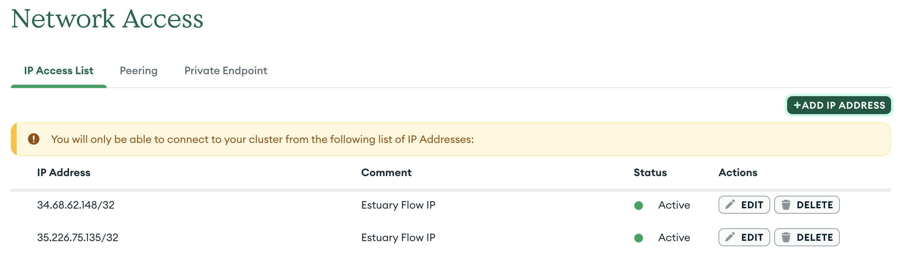
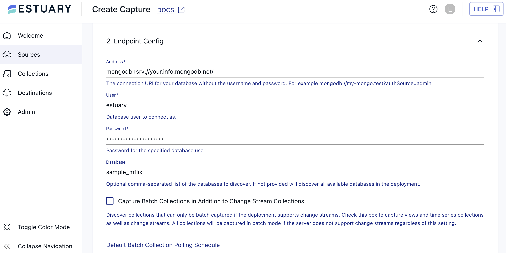

author: aeluce
id: replicate-mongodb-data-to-snowflake-with-estuary
summary: Learn how to create a data pipeline from MongoDB to Snowflake with Estuary Flow.
categories: Connectors, Cdc, Data-Engineering, Data-Sharing, Estuary-Flow
environments: web
status: Published 
feedback link: https://github.com/Snowflake-Labs/sfguides/issues
tags: Getting Started, Data Engineering, Data Pipeline, Estuary Flow

# Replicate MongoDB Data to Snowflake with Estuary Flow
<!-- ------------------------ -->
## Overview 
Duration: 1

[MongoDB](https://www.mongodb.com/) is one of the most popular document stores, or NoSQL databases, available today. It can flexibly handle schemas and its JSON document format matches many web developers' needs perfectly. It's a great choice for a web application backend.

However, any one database solution can't be everything for everyone. When it's time for analytics, many engineers turn to [Snowflake](https://www.snowflake.com/).

A data warehouse built with speed and scalability in mind, Snowflake allows users to run queries across vast datasets without impacting production servers. Snowflake can unify data, combining and allowing querying on structured and unstructured data.

Moving data from one place to another is one of those common engineering tasks that has been solved and solved again. Instead of reinventing the wheel with custom pipelines each time the need arises, engineers can choose from a host of data pipeline tools, like Estuary Flow.

[Estuary Flow](https://estuary.dev/) provides connectors for low- and no-code pipelines, so engineers can start moving data in a matter of minutes. It's a flexible product with the ability to retrieve data in real-time or in batch workflows (or both in the same pipeline) and allows for detailed data transformation.

In this guide, we'll use Estuary Flow to build a full pipeline from MongoDB to Snowflake, exploring aspects of the different systems along the way.

### Prerequisites
* Familiarity with working with databases

### What You'll Learn 
* Data pipeline and CDC usage
* How to set up a MongoDB cluster
* How to configure source and destination connectors in Estuary Flow

### What You'll Need 
* An [Estuary Flow](https://dashboard.estuary.dev/register) account
* A [MongoDB](https://www.mongodb.com/cloud/atlas/register) account
* A [Snowflake](https://signup.snowflake.com/) account

Free trial versions are available for all resources. We'll explore specific setup in depth later in this guide.

### What You'll Build 
* A complete pipeline from MongoDB to Snowflake

<!-- ------------------------ -->
## Initial MongoDB Setup
Duration: 7

<video id="kpF-YCxtArk"></video>

For this tutorial, we'll set up a new MongoDB cluster in Atlas and prepare it for connection with Estuary. If you already have a MongoDB database you'd like to use, you can skip cluster creation steps, but note that you will still need to provision configurations like IP allowlisting.

### Create a Cluster

To start, [log in to your MongoDB](https://account.mongodb.com/account/login) account.

Select the **Create Cluster** button. You will see a configuration screen:


On this screen:

* Select the free M0 cluster.
   * Note that you can only have one free Atlas M0 cluster. If you already have a cluster and don't wish to rack up charges, you may use your existing cluster for this tutorial.
* Ensure that the **Preload sample dataset** option is checked.
   * This will give us some starting data to transfer to Snowflake.
* Optionally update your provider or region.
   * MongoDB's pre-selected options should be sufficient for most cases.

Once everything is configured, select **Create Deployment**.

You will then move on to a screen with connection options. Here:

1. Select the **Shell** connection option.
   * We will not use the `mongosh` CLI itself, so you can skip the steps listed on the connection screen.
2. Find the example CLI command that includes your MongoDB server address.
   * This should be something like `mongodb+srv://your-cluster-name.abc.mongodb.net/`.
3. Copy the server address and save it for later.
   * We'll use this information in the next step, "Create a Capture in Estuary Flow."
4. You can then close the overlay.


It may take a few minutes to finish loading the sample dataset. After that, your database will be all set up! Feel free to browse your MongoDB collections to become familiar with the generated data structure.

### Add a Database User

While we're still in the MongoDB dashboard, let's set up a couple more items so that creating a capture with Estuary Flow later will be smooth sailing.

First on the list is to create a service account for Estuary access.

1. On the lefthand sidebar, find the **Security** section and select **Database Access**.
2. Click the **Add new database user** button.
3. Provide a username and password under **Password Authentication**.
   * Make sure to save these details for later.
4. Under **Database User Privileges**, add a role to confer at least Read privileges to your user.
5. Click **Add user**.

### Configure Network Access

Besides a user for Estuary, we'll also need to allow incoming traffic from Estuary's IP addresses. By default, MongoDB restricts access to your cluster to certain known IPs. You can add to this list using the following steps:

1. Find the **Network Access** page.
   * This will be under the **Security** section, same as **Database Access**.
2. Click the **Add IP address** button.
3. Add the desired IP to the **Access List Entry** field.
   * Estuary's list of IP addresses currently includes:
      * `34.121.207.128`
      * `35.226.75.135`
      * `34.68.62.148`
4. Optionally add a comment (such as "estuary") and **Confirm**.



Perform this process to allowlist all of Estuary's IP addresses. You can find a full list in [Estuary's docs](https://docs.estuary.dev/reference/allow-ip-addresses/).

With all of that configured, we're done with the MongoDB dashboard for now. Let's move on to the Estuary dashboard to capture our MongoDB data and start our pipeline.

<!-- ------------------------ -->
## Create a Capture in Estuary Flow
Duration: 2

Now that we actually have data to replicate, we can begin our Estuary pipeline.

Estuary's MongoDB connector uses CDC, or Change Data Capture, to stay up-to-date with your database's data. CDC captures a stream of changes as they occur, including insertions, updates, and deletions. In log-based CDC, changes are read directly from a database's WAL (Write-Ahead Log) or other transaction log. This allows you to keep downstream systems updated in real-time.

To select a MongoDB source connector in Estuary:

1. [Log in to Estuary](https://dashboard.estuary.dev/) to get started.
2. On the lefthand sidebar, select **Sources**.
3. Click the **New Capture** button.
4. Search for "MongoDB" and select **Capture**.

This will open a configuration screen for the capture. Here, make sure to fill out the following required fields in the **Capture Details** and **Endpoint Config** sections:

* **Name:** a unique name for your capture.
* **Address:** the server address you retrieved from MongoDB's connection options screen in the last section.
* **User:** the username for the MongoDB service account you created in the last section.
* **Password:** the password for the MongoDB service account you created in the last section.



Press the blue **Next** button. Estuary will automatically discover available databases and tables in your cluster. You can select from any, or all, of these schemas to replicate. Choose one or more you'd like to transfer to Snowflake and then click **Save and Publish**.

Your selected datasets will start to populate associated Estuary *collections*. This is a sort of intermediate step between sources and destinations. While this guide won't go into much depth on collections, this would be where you could apply SQL or TypeScript transformations on your data before storage in your destination.

You can also select a collection to preview the data it's received so far from your capture.

In the next step, we'll finally get to work with Snowflake as we finalize our data pipeline.

<!-- ------------------------ -->
## Create a Snowflake Materialization
Duration: 5

Snowflake setup is straightforward enough that we can perform our prep in Snowflake and create the Estuary connector all in the same step.

On the Snowflake side:

1. Open up your Snowflake console.
2. Create a new SQL worksheet.
   * This will let you execute some setup queries.
3. Copy the following script and paste it into the SQL console.
   * Make sure you update the `estuary_password` value to a strong password.

  ```SQL
  set database_name = 'ESTUARY_DB';
  set warehouse_name = 'ESTUARY_WH';
  set estuary_role = 'ESTUARY_ROLE';
  set estuary_user = 'ESTUARY_USER';
  set estuary_password = 'secret';
  set estuary_schema = 'ESTUARY_SCHEMA';
  -- create role and schema for Estuary
  create role if not exists identifier($estuary_role);
  grant role identifier($estuary_role) to role SYSADMIN;
  -- Create snowflake DB
  create database if not exists identifier($database_name);
  use database identifier($database_name);
  create schema if not exists identifier($estuary_schema);
  -- create a user for Estuary
  create user if not exists identifier($estuary_user)
  password = $estuary_password
  default_role = $estuary_role
  default_warehouse = $warehouse_name;
  grant role identifier($estuary_role) to user identifier($estuary_user);
  grant all on schema identifier($estuary_schema) to identifier($estuary_role);
  -- create a warehouse for estuary
  create warehouse if not exists identifier($warehouse_name)
  warehouse_size = xsmall
  warehouse_type = standard
  auto_suspend = 60
  auto_resume = true
  initially_suspended = true;
  -- grant Estuary role access to warehouse
  grant USAGE
  on warehouse identifier($warehouse_name)
  to role identifier($estuary_role);
  -- grant Estuary access to database
  grant CREATE SCHEMA, MONITOR, USAGE on database identifier($database_name) to role identifier($estuary_role);
  -- change role to ACCOUNTADMIN for STORAGE INTEGRATION support to Estuary (only needed for Snowflake on GCP)
  use role ACCOUNTADMIN;
  grant CREATE INTEGRATION on account to role identifier($estuary_role);
  use role sysadmin;
  COMMIT;
  ```
4. Select the drop-down arrow next to the **Run** button and choose to **Run All**.

Snowflake will execute the queries, creating a user, schema, database, and warehouse, and granting the proper permissions.

You can then move back to the Estuary dashboard to create your materialization.

1. On the lefthand sidebar, select **Destinations**.
2. Click the **New Materialization** button.
3. Search for "Snowflake" and select **Materialization**.
4. Add a name for the materialization and fill out the **Endpoint Config**.
   * The majority of these details will be based on the SQL script you executed. The default values would therefore be:
      * Database: `ESTUARY_DB`
      * Schema: `ESTUARY_SCHEMA`
      * Warehouse: `ESTUARY_WH`
      * Role: `ESTUARY_ROLE`
      * User: `ESTUARY_USER`
      * Password: `secret` (but you changed this, right? ...Right?)
   * You can find your Snowflake Host URL by retrieving your Snowflake [account identifier](https://docs.snowflake.com/en/user-guide/admin-account-identifier). Your full URL will look something like `orgname-accountname.snowflakecomputing.com`.

   

5. Under the **Source Collections** section, click the **Source from Capture** button.
6. Select your MongoDB collections and click **Continue**.
7. Scroll back up and press **Next**.
8. Select **Save and Publish**.

With that, your pipeline is fully configured and ready to go. Check back in on Snowflake to start exploring your MongoDB data!

<!-- ------------------------ -->
## Conclusion And Resources
Duration: 1

Congratulations! You set up a data pipeline to transfer MongoDB data directly to your Snowflake warehouse. You learned a bit about the systems involved, including Estuary, and you got some practice configuring data connectors.

In this guide, we mainly focused on default configurations. This sped up our process, but it also means we ended up skipping a lot of the possibilities opened up by advanced configuration. For example, Estuary lets you update the **Sync Frequency** for Snowflake. This setting helps you balance your data freshness requirements with your activity cost requirements.

See the related resources below for options on more advanced use cases and information on configuring your pipeline.

### What You Learned
- How and why you might want to move your MongoDB data to Snowflake
- How to set up connectors to create your own pipeline in Estuary Flow

### Related Resources
- [MongoDB docs](https://www.mongodb.com/docs/)
- [MongoDB Estuary connector reference](https://docs.estuary.dev/reference/Connectors/capture-connectors/mongodb/)
- [Snowflake docs](https://docs.snowflake.com/)
- [Snowflake Estuary connector reference](https://docs.estuary.dev/reference/Connectors/materialization-connectors/Snowflake/)
- [Estuary docs](https://docs.estuary.dev/)
- [More Estuary example projects](https://github.com/estuary/examples)
