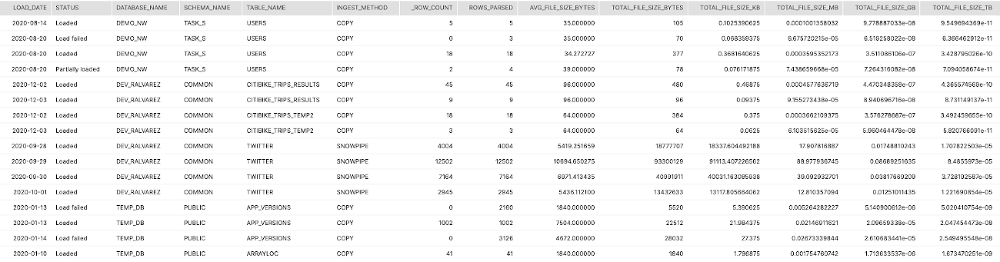
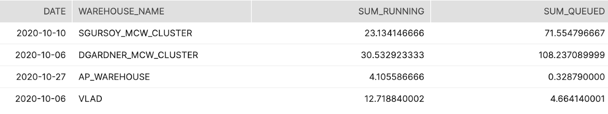
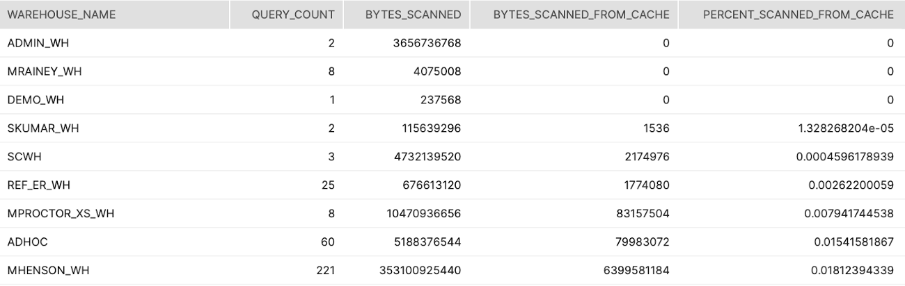

summary: 이 가이드는 고객이 다양한 요인으로 인한 낮은 성능이 과도한 소비를 초래할 수도 있는 영역을 확인하는 것과 관계된 쿼리를 설정 맟 실행하는 데 도움을 주기 위해 사용할 수 있습니다.
id: resource_optimization_performance_optimization_kr
categories: Resource-Optimization
environments: web
status: Hidden
feedback link: https://github.com/Snowflake-Labs/sfguides/issues
tags: 스노우플레이크, 리소스 최적화, 비용 최적화, 성능, 최적화, 성능 최적화, 모니터링, Resource Optimization, Cost Optimization, Monitoring, kr
authors: Matt Meredith

# 리소스 최적화: 성능

<!-- -------------->
## 개요

이 [블로그 포스트](https://www.snowflake.com/blog/understanding-snowflakes-resource-optimization-capabilities/)는 여러분이 Snowflake의 리소스 최적화 기능을 더 잘 이해할 수 있도록 합니다.

### 성능

이 가이드에 제공된 쿼리는 다양한 요인으로 인한 낮은 성능이 과도한 소비를 초래할 수도 있는 영역을 확인하는 것과 관계된 쿼리 설정과 실행에 도움을 주기 위한 것입니다.

### 학습할 내용

- 성능을 개선할 수 있는 영역 확인 방법
- 낮은 성능이 과도한 소비를 초래하는 워크로드 분석 방법
- 스케일 업 또는 스케일 아웃으로 이점을 누릴 수 있는 웨어하우스 식별 방법

### 필요한 것

- [Snowflake](https://www.snowflake.com/) 계정
- [계정 사용량 데이터 공유](https://docs.snowflake.com/ko/sql-reference/account-usage.html#enabling-account-usage-for-other-roles)를 보기 위한 액세스

### 관련 자료

- 리소스 최적화: 설정 및 구성
- 리소스 최적화: 사용량 모니터링
- 리소스 최적화: 청구 메트릭

## 쿼리 계층

리소스 최적화 Snowflake 빠른 시작 내에 있는 각 쿼리 이름의 오른쪽에는 ‘(T*)’로 계층 지정이 있습니다.  다음 계층 설명은 이러한 지정을 더 잘 이해하는 데 도움이 됩니다.

### 계층 1 쿼리

본질적으로 계층 1 쿼리는 Snowflake의 리소스 최적화에 매우 중요합니다. 또한 각 고객이 규모, 업계, 위치 등에 관계없이 자신의 소비 모니터링에 대해 도움을 받기 위해 사용해야 합니다.

### 계층 2 쿼리

계층 2 쿼리는 리소스 최적화에 대한 추가적인 깊이를 제공하는 동시에 프로세스에서 중요한 역할을 수행합니다. 또한 모든 고객과 고객의 워크로드에 필수적이지는 않을지라도 과도한 소비가 확인되었을 수 있는 모든 추가 영역에 대한 추가적인 설명을 제공할 수 있습니다.

### 계층 3 쿼리

마지막으로 계층 3 쿼리는 Snowflake 소비를 최적화하는 데 있어서 모든 부분을 확인하고자 하는 고객이 사용할 수 있도록 설계되었습니다.  이러한 쿼리는 이 프로세스에서 여전히 매우 유용하지만 계층 1 및 2의 쿼리만큼 중요하지는 않습니다.

## Data Ingest with Snowpipe and "Copy" (T1)

###### 계층 1

#### 설명:

이 쿼리는 Snowflake에서 각 테이블을 위해 모든 로드의 집계된 일별 요약을 반환합니다. 이는 평균 파일 크기, 총열, 총볼륨 및 수집 메서드(복사 또는 Snowpipe)를 나타냅니다.

#### 결과 해석 방법:

이러한 개괄적 정보를 통해 파일 크기가 이상적인 수집에 너무 작거나 큰지를 결정할 수 있습니다. 볼륨을 크레딧 소비와 매핑할 수 있다면 어떤 테이블이 로드된 TB당 더 많은 크레딧을 소비하는지 결정할 수 있습니다.

#### 주요 스키마:

Account_Usage

#### SQL

```sql
SELECT 
  TO_DATE(LAST_LOAD_TIME) as LOAD_DATE
  ,STATUS
  ,TABLE_CATALOG_NAME as DATABASE_NAME
  ,TABLE_SCHEMA_NAME as SCHEMA_NAME
  ,TABLE_NAME
  ,CASE WHEN PIPE_NAME IS NULL THEN 'COPY' ELSE 'SNOWPIPE' END AS INGEST_METHOD
  ,SUM(ROW_COUNT) as ROW_COUNT
  ,SUM(ROW_PARSED) as ROWS_PARSED
  ,AVG(FILE_SIZE) as AVG_FILE_SIZE_BYTES
  ,SUM(FILE_SIZE) as TOTAL_FILE_SIZE_BYTES
  ,SUM(FILE_SIZE)/POWER(1024,1) as TOTAL_FILE_SIZE_KB
  ,SUM(FILE_SIZE)/POWER(1024,2) as TOTAL_FILE_SIZE_MB
  ,SUM(FILE_SIZE)/POWER(1024,3) as TOTAL_FILE_SIZE_GB
  ,SUM(FILE_SIZE)/POWER(1024,4) as TOTAL_FILE_SIZE_TB
FROM "SNOWFLAKE"."ACCOUNT_USAGE"."COPY_HISTORY"
GROUP BY 1,2,3,4,5,6
ORDER BY 3,4,5,1,2
;
```

#### 스크린샷



## Scale Up vs. Out (Size vs. Multi-cluster) (T2)

###### 계층 2

#### 설명:

MCW 설정 또는 더 큰 사이즈로 스케일 업하여 이점을 누릴 수 있는 웨어하우스 및 시간을 목록으로 나열하는 별도의 쿼리 2개입니다

#### 결과 해석 방법:

웨어하우스에서 경합을 초래하는 웨어하우스, 시간 또는 사용자 재구성을 결정하기 위해 이 목록을 사용합니다

#### 주요 스키마:

Account_Usage

#### SQL

```sql
--LIST OF WAREHOUSES AND DAYS WHERE MCW COULD HAVE HELPED
SELECT TO_DATE(START_TIME) as DATE
,WAREHOUSE_NAME
,SUM(AVG_RUNNING) AS SUM_RUNNING
,SUM(AVG_QUEUED_LOAD) AS SUM_QUEUED
FROM "SNOWFLAKE"."ACCOUNT_USAGE"."WAREHOUSE_LOAD_HISTORY"
WHERE TO_DATE(START_TIME) >= DATEADD(month,-1,CURRENT_TIMESTAMP())
GROUP BY 1,2
HAVING SUM(AVG_QUEUED_LOAD) >0
;

--LIST OF WAREHOUSES AND QUERIES WHERE A LARGER WAREHOUSE WOULD HAVE HELPED WITH REMOTE SPILLING
SELECT QUERY_ID
,USER_NAME
,WAREHOUSE_NAME
,WAREHOUSE_SIZE
,BYTES_SCANNED
,BYTES_SPILLED_TO_REMOTE_STORAGE
,BYTES_SPILLED_TO_REMOTE_STORAGE / BYTES_SCANNED AS SPILLING_READ_RATIO
FROM "SNOWFLAKE"."ACCOUNT_USAGE"."QUERY_HISTORY"
WHERE BYTES_SPILLED_TO_REMOTE_STORAGE > BYTES_SCANNED * 5  -- Each byte read was spilled 5x on average
ORDER BY SPILLING_READ_RATIO DESC
;
```

#### 스크린샷



## Warehouse Cache Usage (T3)

###### 계층 3

#### 설명:

웨어하우스 캐시에서 스캔한 데이터의 비율을 나타내는 웨어하우스에 의해 분석된 모든 쿼리에 걸쳐 집계합니다.

#### 결과 해석 방법:

쿼리/보고에서 사용되었으며 낮은 비율을 가진 웨어하우스를 찾습니다. 이는 웨어하우스가 너무 빨리 일시 중단됨을 나타냅니다

#### 주요 스키마:

Account_Usage

#### SQL

```sql
SELECT WAREHOUSE_NAME
,COUNT(*) AS QUERY_COUNT
,SUM(BYTES_SCANNED) AS BYTES_SCANNED
,SUM(BYTES_SCANNED*PERCENTAGE_SCANNED_FROM_CACHE) AS BYTES_SCANNED_FROM_CACHE
,SUM(BYTES_SCANNED*PERCENTAGE_SCANNED_FROM_CACHE) / SUM(BYTES_SCANNED) AS PERCENT_SCANNED_FROM_CACHE
FROM "SNOWFLAKE"."ACCOUNT_USAGE"."QUERY_HISTORY"
WHERE START_TIME >= dateadd(month,-1,current_timestamp())
AND BYTES_SCANNED > 0
GROUP BY 1
ORDER BY 5
;
```

#### 스크린샷



## Heavy Scanners (T3)

###### 계층 3

#### 설명:

많은 양의 데이터를 스캔하는 쿼리를 실행하는 순서가 지정된 사용자 목록입니다.

#### 결과 해석 방법:

이는 사용자를 학습시키거나 클러스터링을 활성화할 수 있는 잠재적 기회입니다.

#### 주요 스키마:

Account_Usage

#### SQL

```sql
select 
  User_name
, warehouse_name
, avg(case when partitions_total > 0 then partitions_scanned / partitions_total else 0 end) avg_pct_scanned
from   snowflake.account_usage.query_history
where  start_time::date > dateadd('days', -45, current_date)
group by 1, 2
order by 3 desc
;
```

## Full Table Scans by User (T3)

###### 계층 3

#### 설명:

이러한 쿼리는 거의 모든 테이블 검색을 통해 대부분 쿼리를 실행하는 사용자 목록과 쿼리 자체의 목록입니다.

#### 결과 해석 방법:

이는 사용자를 학습시키거나 클러스터링을 활성화할 수 있는 잠재적 기회입니다.

#### 주요 스키마:

Account_Usage

#### SQL

```sql
--who are the users with the most (near) full table scans
SELECT USER_NAME
,COUNT(*) as COUNT_OF_QUERIES
FROM "SNOWFLAKE"."ACCOUNT_USAGE"."QUERY_HISTORY"
WHERE START_TIME >= dateadd(month,-1,current_timestamp())
AND PARTITIONS_SCANNED > (PARTITIONS_TOTAL*0.95)
AND QUERY_TYPE NOT LIKE 'CREATE%'
group by 1
order by 2 desc;

-- This gives all queries in the last month with nearly a full table scan :) > 95%, ordered by the worst offending
SELECT * 
FROM "SNOWFLAKE"."ACCOUNT_USAGE"."QUERY_HISTORY"
WHERE START_TIME >= dateadd(month,-1,current_timestamp())
AND PARTITIONS_SCANNED > (PARTITIONS_TOTAL*0.95)
AND QUERY_TYPE NOT LIKE 'CREATE%'
ORDER BY PARTITIONS_SCANNED DESC
LIMIT 50  -- Configurable threshold that defines "TOP N=50"
;
```

## Top 10 Spillers Remote (T3)

###### 계층 3

#### 설명:

원격 저장소로 분산되는 바이트 양에 따라 문제를 초래하는 상위 쿼리 10개를 식별합니다.

#### 결과 해석 방법:

이러한 쿼리는 더 많은 로컬 저장소와 메모리를 보유하고 있는 더 큰 웨어하우스에서 실행될 가능성이 매우 높습니다.

#### 주요 스키마:

Account_Usage

#### SQL

```sql
select query_id, substr(query_text, 1, 50) partial_query_text, user_name, warehouse_name, warehouse_size, 
       BYTES_SPILLED_TO_REMOTE_STORAGE, start_time, end_time, total_elapsed_time/1000 total_elapsed_time
from   snowflake.account_usage.query_history
where  BYTES_SPILLED_TO_REMOTE_STORAGE > 0
and start_time::date > dateadd('days', -45, current_date)
order  by BYTES_SPILLED_TO_REMOTE_STORAGE desc
limit 10
;
```

## AutoClustering History \& 7-Day Average (T3)

###### 계층 3

#### 설명:

지난 한 해 동안 주별로 그룹화된 Auto-Clustering에 의해 소비된 일별 평균 크레딧입니다.

#### 결과 해석 방법:

한 해에 걸친 일별 평균에서 변칙을 찾습니다. 소비 급증 또는 변화를 조사할 기회입니다.

#### 주요 스키마:

Account_Usage

#### SQL

```sql
WITH CREDITS_BY_DAY AS (
SELECT TO_DATE(START_TIME) as DATE
,SUM(CREDITS_USED) as CREDITS_USED


FROM "SNOWFLAKE"."ACCOUNT_USAGE"."AUTOMATIC_CLUSTERING_HISTORY"

WHERE START_TIME >= dateadd(year,-1,current_timestamp()) 
GROUP BY 1
ORDER BY 2 DESC 
  )
  
SELECT DATE_TRUNC('week',DATE)
,AVG(CREDITS_USED) as AVG_DAILY_CREDITS
FROM CREDITS_BY_DAY
GROUP BY 1
ORDER BY 1
;
```

## Materialized Views History \& 7-Day Average (T3)

###### 계층 3

#### 설명:

지난 한 해 동안 주별로 그룹화된 Materialized Views에 의해 소비된 일별 평균 크레딧입니다.

#### 결과 해석 방법:

한 해에 걸친 일별 평균에서 변칙을 찾습니다. 소비 급증 또는 변화를 조사할 기회입니다.

#### 주요 스키마:

Account_Usage

#### SQL

```sql
WITH CREDITS_BY_DAY AS (
SELECT TO_DATE(START_TIME) as DATE
,SUM(CREDITS_USED) as CREDITS_USED


FROM "SNOWFLAKE"."ACCOUNT_USAGE"."MATERIALIZED_VIEW_REFRESH_HISTORY"

WHERE START_TIME >= dateadd(year,-1,current_timestamp()) 
GROUP BY 1
ORDER BY 2 DESC 
  )
  
SELECT DATE_TRUNC('week',DATE)
,AVG(CREDITS_USED) as AVG_DAILY_CREDITS
FROM CREDITS_BY_DAY
GROUP BY 1
ORDER BY 1
;
```

## Search Optimization History \& 7-Day Average (T3)

###### 계층 3

#### 설명:

지난 한 해 동안 주별로 그룹화된 Search Optimization에 의해 소비된 일별 평균 크레딧입니다.

#### 결과 해석 방법:

한 해에 걸친 일별 평균에서 변칙을 찾습니다. 소비 급증 또는 변화를 조사할 기회입니다.

#### 주요 스키마:

Account_Usage

#### SQL

```sql
WITH CREDITS_BY_DAY AS (
SELECT TO_DATE(START_TIME) as DATE
,SUM(CREDITS_USED) as CREDITS_USED


FROM "SNOWFLAKE"."ACCOUNT_USAGE"."SEARCH_OPTIMIZATION_HISTORY"

WHERE START_TIME >= dateadd(year,-1,current_timestamp()) 
GROUP BY 1
ORDER BY 2 DESC 
  )
  
SELECT DATE_TRUNC('week',DATE)
,AVG(CREDITS_USED) as AVG_DAILY_CREDITS
FROM CREDITS_BY_DAY
GROUP BY 1
ORDER BY 1
;
```

## Snowpipe History \& 7-Day Average (T3)

###### 계층 3

#### 설명:

지난 한 해 동안 주별로 그룹화된 Snowpipe에 의해 소비된 일별 평균 크레딧입니다.

#### 결과 해석 방법:

한 해에 걸친 일별 평균에서 변칙을 찾습니다. 소비 급증 또는 변화를 조사할 기회입니다.

#### 주요 스키마:

Account_Usage

#### SQL

```sql
WITH CREDITS_BY_DAY AS (
SELECT TO_DATE(START_TIME) as DATE
,SUM(CREDITS_USED) as CREDITS_USED


FROM "SNOWFLAKE"."ACCOUNT_USAGE"."PIPE_USAGE_HISTORY"

WHERE START_TIME >= dateadd(year,-1,current_timestamp()) 
GROUP BY 1
ORDER BY 2 DESC 
  )
  
SELECT DATE_TRUNC('week',DATE)
,AVG(CREDITS_USED) as AVG_DAILY_CREDITS
FROM CREDITS_BY_DAY
GROUP BY 1
ORDER BY 1
;
```

## Replication History \& 7-Day Average (T3)

###### 계층 3

#### 설명:

지난 한 해 동안 주별로 그룹화된 Replication에 의해 소비된 일별 평균 크레딧입니다.

#### 결과 해석 방법:

한 해에 걸친 일별 평균에서 변칙을 찾습니다. 소비 급증 또는 변화를 조사할 기회입니다.

#### 주요 스키마:

Account_Usage

#### SQL

```sql
WITH CREDITS_BY_DAY AS (
SELECT TO_DATE(START_TIME) as DATE
,SUM(CREDITS_USED) as CREDITS_USED


FROM "SNOWFLAKE"."ACCOUNT_USAGE"."REPLICATION_USAGE_HISTORY"

WHERE START_TIME >= dateadd(year,-1,current_timestamp()) 
GROUP BY 1
ORDER BY 2 DESC 
  )
  
SELECT DATE_TRUNC('week',DATE)
,AVG(CREDITS_USED) as AVG_DAILY_CREDITS
FROM CREDITS_BY_DAY
GROUP BY 1
ORDER BY 1
;
```