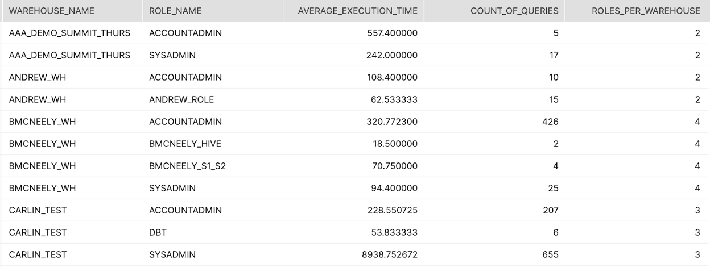

summary: This guide can be used to help customers setup and run queries pertaining to specific setup & configuration items that might be causing over-consumption.
id: resource_optimization_setup
categories: Resource Optimization 
environments: web
status: Published 
feedback link: https://github.com/Snowflake-Labs/sfguides/issues
tags: Resource Optimization, Cost Optimization, Consumption, Setup, Configuration, Administration, Monitoring 
authors: Matt Meredith

# Resource Optimization: Setup & Configuration

<!-- -------------->

## Overview
This resource optimization guide represents one module of the four contained in the series. These guides are meant to help customers better monitor and manage their credit consumption. Helping our customers build confidence that their credits are being used efficiently is key to an ongoing successful partnership. In addition to this set of Snowflake Quickstarts for Resource Optimization, Snowflake also offers community support as well as Training and Professional Services offerings. To learn more about the paid offerings, take a look at upcoming [education and training](https://www.snowflake.com/education-and-training/). 

This [blog post](https://www.snowflake.com/blog/understanding-snowflakes-resource-optimization-capabilities/) can provide you with a better understanding of Snowflake's Resource Optimization capabilities.

Contact our team at [marketing@snowflake.com](mailto:marketing@snowflake.com), we appreciate your feedback. 

### Setup & Configuration
Setup & Configuration queries provide more proactive insight into warehouses that are not utilizing key features that can prevent runaway resource and cost consumption.  Leverage these key queries listed below to identify warehouses which should be re-configured to leverage the appropriate features.

### What You’ll Learn 
- available features and settings to control Snowflake consumption
- the importance of configuring auto-resume and auto-suspend
- how to configure relevant statement timeouts
- the value and configuration of resource monitors
- how to analyze user activity
- how to analyze task behavior

### What You’ll Need 
- A [Snowflake](https://www.snowflake.com/) Account
- Access to view [Account Usage Data Share](https://docs.snowflake.com/en/sql-reference/account-usage.html#enabling-account-usage-for-other-roles)

### Related Materials
- Resource Optimization: Usage Monitoring
- Resource Optimization: Billing Metrics
- Resource Optimization: Performance

## Query Tiers
Each query within the Resource Optimization Snowflake Quickstarts will have a tier designation just to the right of its name as "(T*)".  The following tier descriptions should help to better understand those designations.

### Tier 1 Queries
At its core, Tier 1 queries are essential to Resource Optimization at Snowflake and should be used by each customer to help with their consumption monitoring - regardless of size, industry, location, etc.

### Tier 2 Queries
Tier 2 queries, while still playing a vital role in the process, offer an extra level of depth around Resource Optimization and while they may not be essential to all customers and their workloads, it can offer further explanation as to any additional areas in which over-consumption may be identified.

### Tier 3 Queries
Finally, Tier 3 queries are designed to be used by customers that are looking to leave no stone unturned when it comes to optimizing their consumption of Snowflake.  While these queries are still very helpful in this process, they are not as critical as the queries in Tier 1 & 2.

## Warehouses without Auto-Resume (T1)
###### Tier 1
#### Description:
Identifies all warehouses that do not have auto-resume enabled.  Enabling this feature will automatically resume a warehouse any time a query is submitted against that specific warehouse. By default, all warehouses have auto-resume enabled.
#### How to Interpret Results:
Make sure all warehouses are set to auto resume.  If you are going to implement auto suspend and proper timeout limits, this is a must or users will not be able to query the system.

#### SQL
```sql
SHOW WAREHOUSES
;
SELECT "name" AS WAREHOUSE_NAME
      ,"size" AS WAREHOUSE_SIZE
  FROM TABLE(RESULT_SCAN(LAST_QUERY_ID()))
 WHERE "auto_resume" = 'false'
;
```

## Warehouses without Auto-Suspend (T1)
###### Tier 1
#### Description:
Identifies all warehouses that do not have auto-suspend enabled.  Enabling this feature will ensure that warehouses become suspended after a specific amount of inactive time in order to prevent runaway costs.  By default, all warehouses have auto-suspend enabled.
#### How to Interpret Results:
Make sure all warehouses are set to auto suspend. This way when they are not processing queries your compute footprint will shrink and thus your credit burn.

#### SQL
```sql
SHOW WAREHOUSES
;
SELECT "name" AS WAREHOUSE_NAME
      ,"size" AS WAREHOUSE_SIZE
  FROM TABLE(RESULT_SCAN(LAST_QUERY_ID()))
 WHERE IFNULL("auto_suspend",0) = 0
;
```


## Warehouses with Long Suspension (T1)
###### Tier 1
#### Description:
Identifies warehouses that have the longest setting for automatic suspension after a period of no activity on that warehouse.  
#### How to Interpret Results:
All warehouses should have an appropriate setting for automatic suspension for the workload.

– For Tasks, Loading and ETL/ELT warehouses set to immediate suspension.

– For BI and SELECT query warehouses set to 10 minutes for suspension to keep data caches warm for end users

– For DevOps, DataOps and Data Science warehouses set to 5 minutes for suspension as warm cache is not as important to ad-hoc and highly unique queries.

#### SQL
```sql
SHOW WAREHOUSES
;
SELECT "name" AS WAREHOUSE_NAME
      ,"size" AS WAREHOUSE_SIZE
  FROM TABLE(RESULT_SCAN(LAST_QUERY_ID()))
 WHERE "auto_suspend" >= 3600  // 3600 seconds = 1 hour
;
```

## Warehouses without Resource Monitors (T1)
###### Tier 1
#### Description:
Identifies all warehouses without resource monitors in place.  Resource monitors provide the ability to set limits on credits consumed against a warehouse during a specific time interval or date range.  This can help prevent certain warehouses from unintentionally consuming more credits than typically expected.
#### How to Interpret Results:
Warehouses without resource monitors in place could be prone to excessive costs if a warehouse consumes more credits than anticipated.  Leverage the results of this query to identify the warehouses that should have resource monitors in place to prevent future runaway costs.

#### SQL
```sql
SHOW WAREHOUSES
;
SELECT "name" AS WAREHOUSE_NAME
      ,"size" AS WAREHOUSE_SIZE
  FROM TABLE(RESULT_SCAN(LAST_QUERY_ID()))
 WHERE "resource_monitor" IS NULL
;
```

## User Segmentation (T1)
###### Tier 1
#### Description:
Lists out all warehouses that are used by multiple ROLEs in Snowflake and returns the average execution time  and count of all queries executed by each ROLE in each warehouse.
#### How to Interpret Results:
If execution times or query counts across roles within a single warehouse are wildly different it might be worth segmenting those users into separate warehouses and configuring each warehouse to meet the specific needs of each workload
#### Primary Schema:
Account_Usage
#### SQL
```sql
SELECT *

FROM (
  SELECT 

  WAREHOUSE_NAME
  ,ROLE_NAME
  ,AVG(EXECUTION_TIME) as AVERAGE_EXECUTION_TIME
  ,COUNT(QUERY_ID) as COUNT_OF_QUERIES
  ,COUNT(ROLE_NAME) OVER(PARTITION BY WAREHOUSE_NAME) AS ROLES_PER_WAREHOUSE


  FROM "SNOWFLAKE"."ACCOUNT_USAGE"."QUERY_HISTORY"
  where to_date(start_time) >= dateadd(month,-1,CURRENT_TIMESTAMP())
  group by 1,2
) A
WHERE A.ROLES_PER_WAREHOUSE > 1
order by 5 DESC,1,2
;
```

#### Screenshot


## Idle Users (T2)
###### Tier 2
#### Description:
Users in the Snowflake platform that have not logged in in the last 30 days
#### How to Interpret Results:
Should these users be removed or more formally onboarded?
#### Primary Schema:
Account_Usage
#### SQL
```sql
SELECT 
	*
FROM SNOWFLAKE.ACCOUNT_USAGE.USERS 
WHERE LAST_SUCCESS_LOGIN < DATEADD(month, -1, CURRENT_TIMESTAMP()) 
AND DELETED_ON IS NULL;
```

## Users Never Logged In (T2)
###### Tier 2
#### Description:
Users that have never logged in to Snowflake
#### How to Interpret Results:
Should these users be removed or more formally onboarded?
#### Primary Schema:
Account_Usage
#### SQL
```sql
SELECT 
	*
FROM SNOWFLAKE.ACCOUNT_USAGE.USERS 
WHERE LAST_SUCCESS_LOGIN IS NULL;
```

## Idle Roles (T2)
###### Tier 2
#### Description:
Roles that have not been used in the last 30 days
#### How to Interpret Results:
Are these roles necessary? Should these roles be cleaned up?
#### Primary Schema:
Account_Usage
#### SQL
```sql
SELECT 
	R.*
FROM SNOWFLAKE.ACCOUNT_USAGE.ROLES R
LEFT JOIN (
    SELECT DISTINCT 
        ROLE_NAME 
    FROM SNOWFLAKE.ACCOUNT_USAGE.QUERY_HISTORY 
    WHERE START_TIME > DATEADD(month,-1,CURRENT_TIMESTAMP())
        ) Q 
                ON Q.ROLE_NAME = R.NAME
WHERE Q.ROLE_NAME IS NULL
and DELETED_ON IS NULL;
```

## Idle Warehouses (T2)
###### Tier 2
#### Description:
Warehouses that have not been used in the last 30 days
#### How to Interpret Results:
Should these warehouses be removed? Should the users of these warehouses be enabled/onboarded?

#### SQL
```sql
SHOW WAREHOUSES;

select * 
from table(result_scan(last_query_id())) a
left join (select distinct WAREHOUSE_NAME from SNOWFLAKE.ACCOUNT_USAGE.WAREHOUSE_METERING_HISTORY 
    WHERE START_TIME > DATEADD(month,-1,CURRENT_TIMESTAMP())
) b on b.WAREHOUSE_NAME = a."name"

where b.WAREHOUSE_NAME is null;
```

## Set Statement Timeouts (T2)
###### Tier 2
#### Description:
Statement timeouts provide additional controls around how long a query is able to run before cancelling it. Using this feature will ensure that any queries that get hung up for extended periods of time will not cause excessive consumption of credits.

Show parameter settings at the Account, Warehouse, and User Session levels.
#### SQL
```sql
SHOW PARAMETERS LIKE 'STATEMENT_TIMEOUT_IN_SECONDS' IN ACCOUNT;
SHOW PARAMETERS LIKE 'STATEMENT_TIMEOUT_IN_SECONDS' IN WAREHOUSE <warehouse-name>;
SHOW PARAMETERS LIKE 'STATEMENT_TIMEOUT_IN_SECONDS' IN USER <username>;
```
#### How to Interpret Results:
This parameter is set at the account level by default.  When the parameter is also set for both a warehouse and a user session, the lowest non-zero value is enforced.

## Stale Table Streams (T2)
###### Tier 2
#### Description:
Indicates whether the offset for the stream is positioned at a point earlier than the data retention period for the table (or 14 days, whichever period is longer). Change data capture (CDC) activity cannot be returned for the table. 
#### How to Interpret Results:
To return CDC activity for the table, recreate the stream. To prevent a stream from becoming stale, consume the stream records within a transaction during the retention period for the table.

#### SQL
```sql
SHOW STREAMS;

select * 
from table(result_scan(last_query_id())) 
where "stale" = true;
```

## Failed Tasks (T2)
###### Tier 2
#### Description:
Returns a list of task executions that failed.
#### How to Interpret Results:
Revisit these task executions to resolve the errors.
#### Primary Schema:
Account_Usage
#### SQL
```sql
select *
  from snowflake.account_usage.task_history
  WHERE STATE = 'FAILED'
  and query_start_time >= DATEADD (day, -7, CURRENT_TIMESTAMP())
  order by query_start_time DESC
  ;
```

## Long Running Tasks (T2)
###### Tier 2
#### Description:
Returns an ordered list of the longest running tasks
#### How to Interpret Results:
revisit task execution frequency or the task code for optimization
#### Primary Schema:
Account_Usage
#### SQL
```sql
select DATEDIFF(seconds, QUERY_START_TIME,COMPLETED_TIME) as DURATION_SECONDS
                ,*
from snowflake.account_usage.task_history
WHERE STATE = 'SUCCEEDED'
and query_start_time >= DATEADD (day, -7, CURRENT_TIMESTAMP())
order by DURATION_SECONDS desc
  ;
```