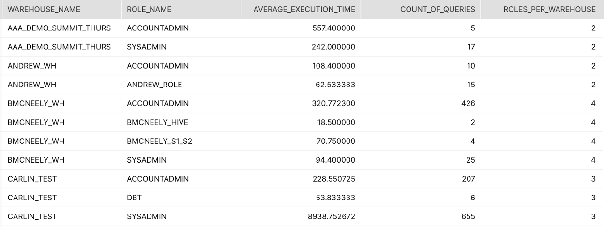

summary: 이 가이드는 고객이 쿼리는 과도한 소비를 초래할 수도 있는 특정 설정 및 구성 항목과 관계된 쿼리를 설정 및 실행하는 데 도움을 주기 위해 사용할 수 있습니다.
id: resource_optimization_setup_kr
categories: Resource Optimization 
environments: web
status: Hidden
feedback link: https://github.com/Snowflake-Labs/sfguides/issues
tags: 스노우플레이크 리소스 최적화, 비용 최적화, 소비, 설정, 구성, 관리, 모니터링, Resource Optimization, Cost Optimization, Monitoring, kr
authors: Matt Meredith

# 리소스 최적화: 설정 및 구성

<!-- -------------->
## 개요

이 리소스 최적화 가이드는 해당 시리즈에 포함되어 있는 4개의 모듈 중 하나를 나타냅니다. 이러한 가이드는 고객이 자신의 크레딧 소비를 더 잘 모니터링하고 관리할 수 있도록 돕는 것을 목적으로 합니다. 고객이 자신의 크레딧이 효율적으로 사용되고 있다는 것을 자신할 수 있도록 돕는 것은 지속적이며 성공적인 파트너십에 중요합니다. 이 리소스 최적화를 위한 Snowflake 빠른 시작 세트와 더불어 Snowflake는 커뮤니티 지원, 교육 및 프로페셔널 서비스를 제공합니다. 유료 서비스에 대한 자세한 내용은 다가오는 [훈련 및 교육](https://www.snowflake.com/education-and-training/)에서 확인하십시오.

이 [블로그 포스트](https://www.snowflake.com/blog/understanding-snowflakes-resource-optimization-capabilities/)는 여러분이 Snowflake의 리소스 최적화 기능을 더 잘 이해할 수 있도록 합니다.

[marketing@snowflake.com](mailto:marketing@snowflake.com)으로 Snowflake 팀에 문의하십시오. Snowflake는 여러분의 피드백을 소중하게 여깁니다.

### 설정 및 구성

설정 및 구성 쿼리는 폭주 리소스 및 비용 소비를 방지할 수 있는 주요 기능을 활용하지 않는 웨어하우스에 대한 더 많은 선제적인 통찰력을 제공합니다.  아래 나열된 주요 쿼리를 활용하여 적절한 기능을 활용하기 위해 재구성할 수 있는 웨어하우스를 확인하십시오.

### 학습할 내용

- Snowflake 소비 제어를 위해 사용 가능한 기능 및 설정
- 자동 일시 중단 및 자동 재개 구성의 중요성
- 관련 있는 문 시간제한 구성 방법
- 리소스 모니터의 값 및 구성
- 사용자 활동 분석 방법
- 작업 동작 분석 방법

### 필요한 것

- [Snowflake](https://www.snowflake.com/) 계정
- [계정 사용량 데이터 공유](https://docs.snowflake.com/ko/sql-reference/account-usage.html#enabling-account-usage-for-other-roles)를 보기 위한 액세스

### 관련 자료

- 리소스 최적화: 사용량 모니터링
- 리소스 최적화: 청구 메트릭
- 리소스 최적화: 성능

## 쿼리 Tiers

리소스 최적화 Snowflake 빠른 시작 내에 있는 각 쿼리 이름의 오른쪽에는 ‘(T*)’로 tier 지정이 있습니다.  다음 tier 설명은 이러한 지정을 더 잘 이해하는 데 도움이 됩니다.

### Tier 1 쿼리

본질적으로 Tier 1 쿼리는 Snowflake의 리소스 최적화에 매우 중요합니다. 또한 각 고객이 규모, 업계, 위치 등에 관계없이 자신의 소비 모니터링에 대해 도움을 받기 위해 사용해야 합니다.

### Tier 2 쿼리

Tier 2 쿼리는 리소스 최적화에 대한 추가적인 깊이를 제공하는 동시에 프로세스에서 중요한 역할을 수행합니다. 또한 모든 고객과 고객의 워크로드에 필수적이지는 않을지라도 과도한 소비가 확인되었을 수 있는 모든 추가 영역에 대한 추가적인 설명을 제공할 수 있습니다.

### Tier 3 쿼리

마지막으로 Tier 3 쿼리는 Snowflake 소비를 최적화하는 데 있어서 모든 부분을 확인하고자 하는 고객이 사용할 수 있도록 설계되었습니다.  이러한 쿼리는 이 프로세스에서 여전히 매우 유용하지만 Tier 1 및 2의 쿼리만큼 중요하지는 않습니다.

## Warehouses without Auto-Resume (T1)

###### Tier 1

#### 설명:

자동 재개가 활성화되어 있지 않은 모든 웨어하우스를 식별합니다.  이 기능을 활성화하면 쿼리가 특정 웨어하우스에 제출될 때마다 웨어하우스를 자동으로 재개합니다. 기본값으로 모든 웨어하우스에는 자동 재개가 활성화되어 있습니다.

#### 결과 해석 방법:

모든 웨어하우스에 자동 재개가 설정되어 있음을 확인하십시오.  자동 일시 중단 및 적절한 시간제한 한도를 적용할 예정이라면 이는 필수적입니다. 이를 수행하지 않으면 사용자는 시스템을 쿼리할 수 없습니다.

#### SQL

```sql
SHOW WAREHOUSES
;
SELECT "name" AS WAREHOUSE_NAME
      ,"size" AS WAREHOUSE_SIZE
  FROM TABLE(RESULT_SCAN(LAST_QUERY_ID()))
 WHERE "auto_resume" = 'false'
;
```

## Warehouses without Auto-Suspend (T1)

###### Tier 1

#### 설명:

자동 일시 중단이 활성화되어 있지 않은 모든 웨어하우스를 식별합니다.  이 기능을 활성화하면 폭주 비용을 방지하기 위해 특정 기간 동안 비활성 시간이 지속된 후 웨어하우스가 일시 중단되는 것이 보장될 것입니다.  기본값으로 모든 웨어하우스에는 자동 일시 중단이 활성화되어 있습니다.

#### 결과 해석 방법:

모든 웨어하우스에 자동 일시 중단이 설정되어 있음을 확인하십시오. 이를 통해 쿼리가 처리되지 않을 때 여러분의 컴퓨팅 공간이 축소되며 크레딧 소비가 줄어듭니다.

#### SQL

```sql
SHOW WAREHOUSES
;
SELECT "name" AS WAREHOUSE_NAME
      ,"size" AS WAREHOUSE_SIZE
  FROM TABLE(RESULT_SCAN(LAST_QUERY_ID()))
 WHERE IFNULL("auto_suspend",0) = 0
;
```

## Warehouses with Long Suspension (T1)

###### Tier 1

#### 설명:

해당 웨어하우스에서 활동이 없는 기간 후 가장 긴 자동 일시 중단 설정을 가진 웨어하우스를 식별합니다.

#### 결과 해석 방법:

모든 웨어하우스에는 워크로드를 위해 자동 일시 중단에 대한 적절한 설정이 있어야 합니다.

– Tasks, Loading 및 ETL/ELT 웨어하우스의 경우 즉각적인 일시 중단을 설정합니다.

– BI 및 SELECT 쿼리 웨어하우스의 경우 최종 사용자를 위해 데이터 캐시를 예열된 상태로 유지할 수 있도록 일시 중단을 10분으로 설정합니다

– DevOps, DataOps 및 Data Science 웨어하우스의 경우 예열된 캐시가 애드혹 및 고유한 쿼리에 그렇게 중요하지 않기에 일시 중단을 5분으로 설정합니다.

#### SQL

```sql
SHOW WAREHOUSES
;
SELECT "name" AS WAREHOUSE_NAME
      ,"size" AS WAREHOUSE_SIZE
  FROM TABLE(RESULT_SCAN(LAST_QUERY_ID()))
 WHERE "auto_suspend" >= 3600  // 3600 seconds = 1 hour
;
```

## Warehouses without Resource Monitors (T1)

###### Tier 1

#### 설명:

리소스 모니터가 배치되어 있지 않은 모든 웨어하우스를 식별합니다.  리소스 모니터는 특정 시간 간격 또는 날짜 범위 동안 웨어하우스에서 소비되는 크레딧의 한도를 지정하는 능력을 제공합니다.  이는 특정 웨어하우스가 의도치 않게 예측한 것보다 더 많은 크레딧을 소비하는 것을 방지하는 데 도움이 될 수 있습니다.

#### 결과 해석 방법:

리소스 모니터가 배치되어 있지 않은 웨어하우스는 예측했던 것보다 더 많은 크레딧을 소비할 때 과도한 비용을 초래할 가능성이 높습니다.  이 쿼리의 결과를 활용하여 추가적인 폭주 비용을 방지하기 위해 리소스 모니터가 배치되어 있어야 하는 웨어하우스를 식별합니다.

#### SQL

```sql
SHOW WAREHOUSES
;
SELECT "name" AS WAREHOUSE_NAME
      ,"size" AS WAREHOUSE_SIZE
  FROM TABLE(RESULT_SCAN(LAST_QUERY_ID()))
 WHERE "resource_monitor" = 'null'
;
```

## User Segmentation (T1)

###### Tier 1

#### 설명:

Snowflake에서 여러 역할에 의해 사용되고 있는 모든 웨어하우스를 목록으로 나열하며 각 웨어하우스에서 각 역할에 의해 실행되는 모든 쿼리의 평균 실행 시간과 카운트를 반환합니다.

#### 결과 해석 방법:

실행 시간 또는 쿼리 카운트가 단일 웨어하우스 내 여러 역할에 걸쳐 크게 다르다면 이러한 사용자를 별도의 웨어하우스로 분할하고 각 워크로드의 특정 요구 사항을 충족하기 위해 각 웨어하우스를 구성하는 것이 가치가 있을지도 모릅니다

#### 주요 스키마:

Account_Usage

#### SQL

```sql
SELECT *

FROM (
  SELECT 

  WAREHOUSE_NAME
  ,ROLE_NAME
  ,AVG(EXECUTION_TIME) as AVERAGE_EXECUTION_TIME
  ,COUNT(QUERY_ID) as COUNT_OF_QUERIES
  ,COUNT(ROLE_NAME) OVER(PARTITION BY WAREHOUSE_NAME) AS ROLES_PER_WAREHOUSE


  FROM "SNOWFLAKE"."ACCOUNT_USAGE"."QUERY_HISTORY"
  where to_date(start_time) >= dateadd(month,-1,CURRENT_TIMESTAMP())
  group by 1,2
) A
WHERE A.ROLES_PER_WAREHOUSE > 1
order by 5 DESC,1,2
;
```

#### 스크린샷



## Idle Users (T2)

###### Tier 2

#### 설명:

지난 30일간 로그인하지 않은 Snowflake 플랫폼에 있는 사용자입니다

#### 결과 해석 방법:

이러한 사용자가 삭제되어야 하나요 아니면 공식적으로 온보딩되어야 하나요?

#### 주요 스키마:

Account_Usage

#### SQL

```sql
SELECT 
	*
FROM SNOWFLAKE.ACCOUNT_USAGE.USERS 
WHERE LAST_SUCCESS_LOGIN < DATEADD(month, -1, CURRENT_TIMESTAMP()) 
AND DELETED_ON IS NULL;
```

## Users Never Logged In (T2)

###### Tier 2

#### 설명:

Snowflake에 한 번도 로그인하지 않은 사용자입니다

#### 결과 해석 방법:

이러한 사용자가 삭제되어야 하나요 아니면 공식적으로 온보딩되어야 하나요?

#### 주요 스키마:

Account_Usage

#### SQL

```sql
SELECT 
	*
FROM SNOWFLAKE.ACCOUNT_USAGE.USERS 
WHERE LAST_SUCCESS_LOGIN IS NULL;
```

## Idle Roles (T2)

###### Tier 2

#### 설명:

지난 30일간 사용되지 않은 역할입니다

#### 결과 해석 방법:

이러한 역할이 필요한가요? 이러한 역할이 정리되어야 하나요?

#### 주요 스키마:

Account_Usage

#### SQL

```sql
SELECT 
	R.*
FROM SNOWFLAKE.ACCOUNT_USAGE.ROLES R
LEFT JOIN (
    SELECT DISTINCT 
        ROLE_NAME 
    FROM SNOWFLAKE.ACCOUNT_USAGE.QUERY_HISTORY 
    WHERE START_TIME > DATEADD(month,-1,CURRENT_TIMESTAMP())
        ) Q 
                ON Q.ROLE_NAME = R.NAME
WHERE Q.ROLE_NAME IS NULL
and DELETED_ON IS NULL;
```

## Idle Warehouses (T2)

###### Tier 2

#### 설명:

지난 30일간 사용되지 않은 웨어하우스입니다

#### 결과 해석 방법:

이러한 웨어하우스가 삭제되어야 하나요? 이러한 웨어하우스의 사용자가 활성화/온보딩되어야 하나요?

#### SQL

```sql
SHOW WAREHOUSES;

select * 
from table(result_scan(last_query_id())) a
left join (select distinct WAREHOUSE_NAME from SNOWFLAKE.ACCOUNT_USAGE.WAREHOUSE_METERING_HISTORY 
    WHERE START_TIME > DATEADD(month,-1,CURRENT_TIMESTAMP())
) b on b.WAREHOUSE_NAME = a."name"

where b.WAREHOUSE_NAME is null;
```

## Set Statement Timeouts (T2)

###### Tier 2

#### 설명:

문 시간제한은 쿼리를 취소하기 전에 실행될 수 있는 시간에 대한 추가 제어를 제공합니다. 이 기능을 사용하면 긴 시간 동안 실행되는 모든 쿼리로 인해 크레딧이 과도하게 소비되지 않는 것이 보장됩니다.

Account, Warehouse 및 User Session 수준의 매개 변수 설정을 보여줍니다.

#### SQL

```sql
SHOW PARAMETERS LIKE 'STATEMENT_TIMEOUT_IN_SECONDS' IN ACCOUNT;
SHOW PARAMETERS LIKE 'STATEMENT_TIMEOUT_IN_SECONDS' IN WAREHOUSE <warehouse-name>;
SHOW PARAMETERS LIKE 'STATEMENT_TIMEOUT_IN_SECONDS' IN USER <username>;
```

#### 결과 해석 방법:

이 매개 변수는 기본값으로 계정 수준으로 설정됩니다.  또한 매개 변수가 웨어하우스와 사용자 세션 모두에 설정되었을 때 가장 낮은 0이 아닌 값이 시행됩니다.

## Stale Table Streams (T2)

###### Tier 2

#### 설명:

스트림을 위한 오프셋이 테이블을 위한 데이터 보존 기간(또는 14일, 더 긴 시간 기준) 이전에 배치되어 있는지를 나타냅니다. 변경 데이터 캡처(CDC) 활동은 테이블을 위해 반환될 수 없습니다.

#### 결과 해석 방법:

테이블을 위해 CDC 활동을 반환하려면 스트림을 재생성합니다. 스트림이 스테일 상태가 되지 않도록 테이블의 보존 기간 동안 트랜잭션 내 스트림 레코드를 소비합니다.

#### SQL

```sql
SHOW STREAMS;

select * 
from table(result_scan(last_query_id())) 
where "stale" = true;
```

## Failed Tasks (T2)

###### Tier 2

#### 설명:

실패한 작성 실행 목록을 반환합니다.

#### 결과 해석 방법:

이러한 실행을 재방문하여 오류를 해결합니다.

#### 주요 스키마:

Account_Usage

#### SQL

```sql
select *
  from snowflake.account_usage.task_history
  WHERE STATE = 'FAILED'
  and query_start_time >= DATEADD (day, -7, CURRENT_TIMESTAMP())
  order by query_start_time DESC
  ;
```

## Long Running Tasks (T2)

###### Tier 2

#### 설명:

가장 길게 실행되는 작업의 순서가 지정된 목록을 반환합니다

#### 결과 해석 방법:

최적화를 위해 작업 실행 빈도나 작업 코드를 재방문합니다

#### 주요 스키마:

Account_Usage

#### SQL

```sql
select DATEDIFF(seconds, QUERY_START_TIME,COMPLETED_TIME) as DURATION_SECONDS
                ,*
from snowflake.account_usage.task_history
WHERE STATE = 'SUCCEEDED'
and query_start_time >= DATEADD (day, -7, CURRENT_TIMESTAMP())
order by DURATION_SECONDS desc
  ;
```