summary: This guide can be used to help customers setup and run queries pertaining to monitoring usage that might be causing over-consumption.
id: resource_optimization_usage_monitoring
categories: Resource-Optimization
environments: web
status: Published 
feedback link: https://github.com/Snowflake-Labs/sfguides/issues
tags: Resource Optimization, Cost Optimization, Consumption, Usage Monitoring, Usage, Monitoring 
authors: Matt Meredith

# Resource Optimization: Usage Monitoring

<!-- -------------->

## Overview
This resource optimization guide represents one module of the four contained in the series. These guides are meant to help customers better monitor and manage their credit consumption. Helping our customers build confidence that their credits are being used efficiently is key to an ongoing successful partnership. In addition to this set of Snowflake Quickstarts for Resource Optimization, Snowflake also offers community support as well as Training and Professional Services offerings. To learn more about the paid offerings, take a look at upcoming [education and training](https://www.snowflake.com/education-and-training/). 

This [blog post](https://www.snowflake.com/blog/understanding-snowflakes-resource-optimization-capabilities/) can provide you with a better understanding of Snowflake's Resource Optimization capabilities.

Contact our team at [marketing@snowflake.com](mailto:marketing@snowflake.com), we appreciate your feedback. 

### Usage Monitoring
Usage Monitoring queries are designed to identify the warehouses, queries, tools, and users that are responsible for consuming the most credits over a specified period of time.  These queries can be used to determine which of those resources are consuming more credits than anticipated and take the necessary steps to reduce their consumption.

### What You’ll Learn 
- how to analyze consumption trends and patterns
- how to identify consumption anomolies
- how to analyze partner tool consumption metrics

### What You’ll Need 
- A [Snowflake](https://www.snowflake.com/) Account 
- Access to view [Account Usage Data Share](https://docs.snowflake.com/en/sql-reference/account-usage.html#enabling-account-usage-for-other-roles)

### Related Materials
- Resource Optimization: Setup & Configuration
- Resource Optimization: Billing Metrics
- Resource Optimization: Performance

## Query Tiers
Each query within the Resource Optimization Snowflake Quickstarts will have a tier designation just to the right of its name as "(T*)".  The following tier descriptions should help to better understand those designations.

### Tier 1 Queries
At its core, Tier 1 queries are essential to Resource Optimization at Snowflake and should be used by each customer to help with their consumption monitoring - regardless of size, industry, location, etc.

### Tier 2 Queries
Tier 2 queries, while still playing a vital role in the process, offer an extra level of depth around Resource Optimization and while they may not be essential to all customers and their workloads, it can offer further explanation as to any additional areas in which over-consumption may be identified.

### Tier 3 Queries
Finally, Tier 3 queries are designed to be used by customers that are looking to leave no stone unturned when it comes to optimizing their consumption of Snowflake.  While these queries are still very helpful in this process, they are not as critical as the queries in Tier 1 & 2.


## Credit Consumption by Warehouse (T1)
###### Tier 1
#### Description:
Shows the total credit consumption for each warehouse over a specific time period.  
#### How to Interpret Results:
Are there specific warehouses that are consuming more credits than the others?  Should they be?  Are there specific warehouses that are consuming more credits than anticipated for that warehouse?
#### Primary Schema:
Account_Usage
#### SQL
```sql
// Credits used (all time = past year)
SELECT WAREHOUSE_NAME
      ,SUM(CREDITS_USED_COMPUTE) AS CREDITS_USED_COMPUTE_SUM
  FROM ACCOUNT_USAGE.WAREHOUSE_METERING_HISTORY
 GROUP BY 1
 ORDER BY 2 DESC
;

// Credits used (past N days/weeks/months)
SELECT WAREHOUSE_NAME
      ,SUM(CREDITS_USED_COMPUTE) AS CREDITS_USED_COMPUTE_SUM
  FROM ACCOUNT_USAGE.WAREHOUSE_METERING_HISTORY
 WHERE START_TIME >= DATEADD(DAY, -7, CURRENT_TIMESTAMP())  // Past 7 days
 GROUP BY 1
 ORDER BY 2 DESC
;
```
#### Screenshot
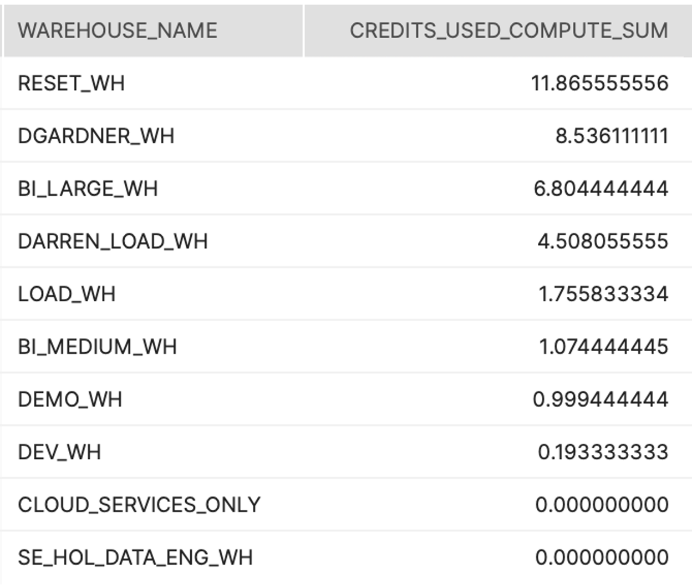

## Average Hour-by-Hour Consumption Over the Past 7 Days (T1)
###### Tier 1
#### Description:
Shows the total credit consumption on an hourly basis to help understand consumption trends (peaks, valleys) over the past 7 days. 
#### How to Interpret Results:
At which points of the day are we seeing spikes in our consumption?  Is that expected?
#### Primary Schema:
Account_Usage
#### SQL (by hour, warehouse)
```sql
// Credits used by [hour, warehouse] (past 7 days)
SELECT START_TIME
      ,WAREHOUSE_NAME
      ,CREDITS_USED_COMPUTE
  FROM SNOWFLAKE.ACCOUNT_USAGE.WAREHOUSE_METERING_HISTORY
 WHERE START_TIME >= DATEADD(DAY, -7, CURRENT_TIMESTAMP())
   AND WAREHOUSE_ID > 0  // Skip pseudo-VWs such as "CLOUD_SERVICES_ONLY"
 ORDER BY 1 DESC,2
;
```
#### Screenshot
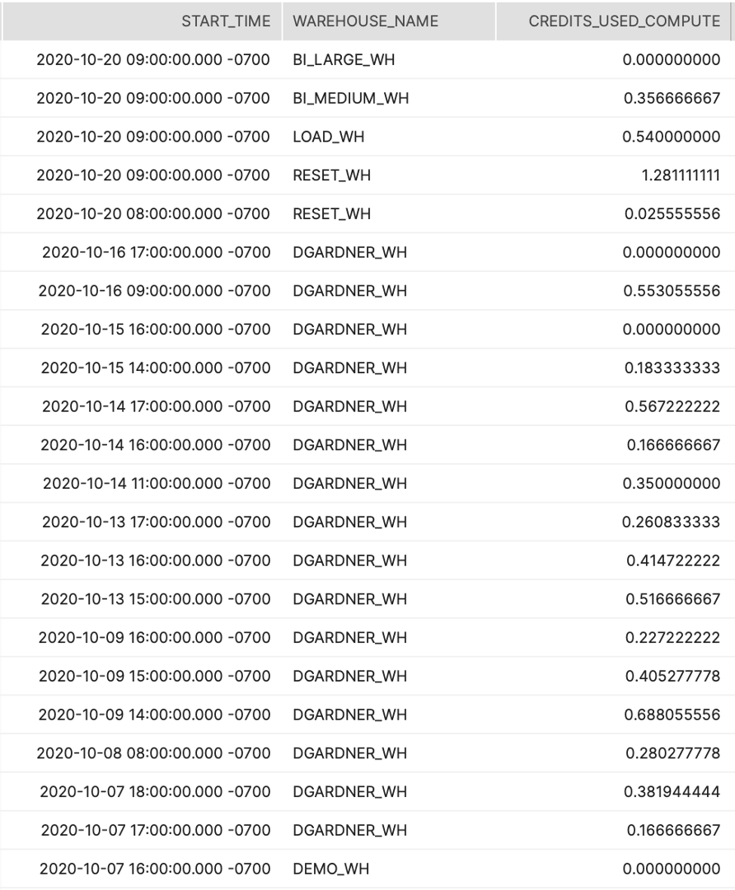
####SQL (by hour)
```sql
SELECT DATE_PART('HOUR', START_TIME) AS START_HOUR
      ,WAREHOUSE_NAME
      ,AVG(CREDITS_USED_COMPUTE) AS CREDITS_USED_COMPUTE_AVG
  FROM SNOWFLAKE.ACCOUNT_USAGE.WAREHOUSE_METERING_HISTORY
 WHERE START_TIME >= DATEADD(DAY, -7, CURRENT_TIMESTAMP())
   AND WAREHOUSE_ID > 0  // Skip pseudo-VWs such as "CLOUD_SERVICES_ONLY"
 GROUP BY 1, 2
 ORDER BY 1, 2
;
```
#### Screenshot
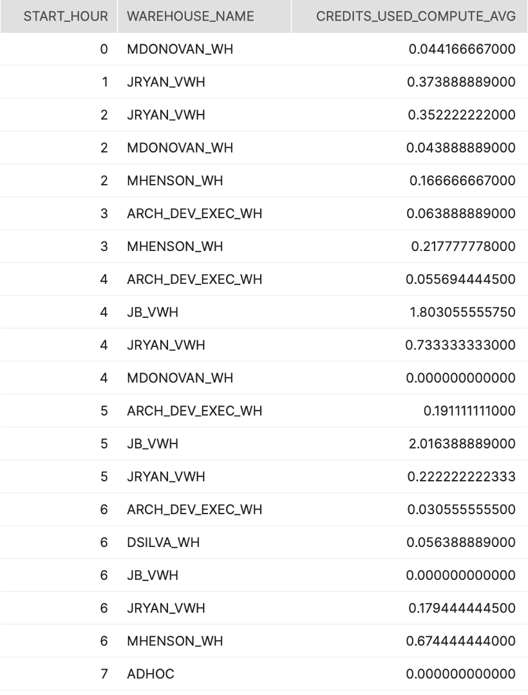

## Average Query Volume by Hour (Past 7 Days) (T1)
###### Tier 1
#### Description:
Shows average number of queries run on an hourly basis to help better understand typical query activity.
#### How to Interpret Results:
How many queries are being run on an hourly basis?  Is this more or less than we anticipated?  What could be causing this?
#### Primary Schema:
Account_Usage
#### SQL
```sql
SELECT DATE_TRUNC('HOUR', START_TIME) AS QUERY_START_HOUR
      ,WAREHOUSE_NAME
      ,COUNT(*) AS NUM_QUERIES
  FROM SNOWFLAKE.ACCOUNT_USAGE.QUERY_HISTORY
 WHERE START_TIME >= DATEADD(DAY, -7, CURRENT_TIMESTAMP())  // Past 7 days
 GROUP BY 1, 2
 ORDER BY 1 DESC, 2
;
```
#### Screenshot
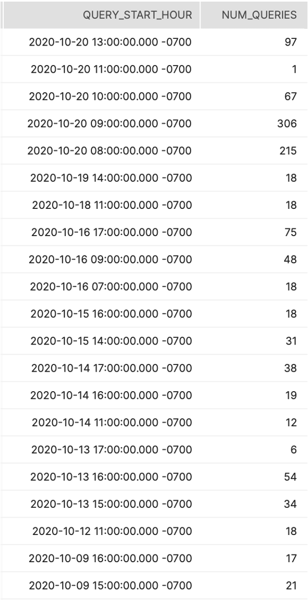

## Warehouse Utilization Over 7 Day Average (T1)
###### Tier 1
#### Description:
This query returns the daily average of credit consumption grouped by week and warehouse.
#### How to Interpret Results:
Use this to identify anomolies in credit consumption for warehouses across weeks from the past year.
#### Primary Schema:
Account_Usage
#### SQL
```sql
WITH CTE_DATE_WH AS(
  SELECT TO_DATE(START_TIME) AS START_DATE
        ,WAREHOUSE_NAME
        ,SUM(CREDITS_USED) AS CREDITS_USED_DATE_WH
    FROM SNOWFLAKE.ACCOUNT_USAGE.WAREHOUSE_METERING_HISTORY
   GROUP BY START_DATE
           ,WAREHOUSE_NAME
)
SELECT START_DATE
      ,WAREHOUSE_NAME
      ,CREDITS_USED_DATE_WH
      ,AVG(CREDITS_USED_DATE_WH) OVER (PARTITION BY WAREHOUSE_NAME ORDER BY START_DATE ROWS 7 PRECEDING) AS CREDITS_USED_7_DAY_AVG
      ,100.0*((CREDITS_USED_DATE_WH / CREDITS_USED_7_DAY_AVG) - 1) AS PCT_OVER_TO_7_DAY_AVERAGE
  FROM CTE_DATE_WH
QUALIFY CREDITS_USED_DATE_WH > 100  // Minimum N=100 credits
    AND PCT_OVER_TO_7_DAY_AVERAGE >= 0.5  // Minimum 50% increase over past 7 day average
 ORDER BY PCT_OVER_TO_7_DAY_AVERAGE DESC
;
```
#### Screenshot
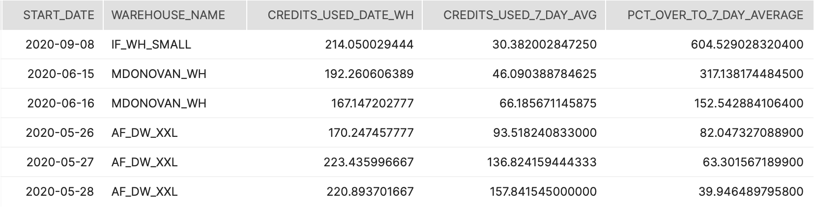

## Forecasting Usage/Billing (T1)
###### Tier 1
#### Description:
This query provides three distinct consumption metrics for each day of the contract term. (1) the contracted consumption is the dollar amount consumed if usage was flat for the entire term. (2) the actual consumption pulls from the various usage views and aggregates dollars at a day level. (3) the forecasted consumption creates a straight line regression from the actuals to project go-forward consumption.
#### How to Interpret Results:
This data should be mapped as line graphs with a running total calculation to estimate future forecast against the contract amount.
#### Primary Schema:
Account_Usage
#### SQL
```sql
SET CREDIT_PRICE = 4.00; --edit this number to reflect credit price
SET TERM_LENGTH = 12; --integer value in months
SET TERM_START_DATE = '2020-01-01';
SET TERM_AMOUNT = 100000.00; --number(10,2) value in dollars
WITH CONTRACT_VALUES AS (
     SELECT
              $CREDIT_PRICE::decimal(10,2) as CREDIT_PRICE
             ,$TERM_AMOUNT::decimal(38,0) as TOTAL_CONTRACT_VALUE
             ,$TERM_START_DATE::timestamp as CONTRACT_START_DATE
             ,DATEADD(day,-1,DATEADD(month,$TERM_LENGTH,$TERM_START_DATE))::timestamp as CONTRACT_END_DATE
),
PROJECTED_USAGE AS (
     SELECT
                CREDIT_PRICE
               ,TOTAL_CONTRACT_VALUE
               ,CONTRACT_START_DATE
               ,CONTRACT_END_DATE
               ,(TOTAL_CONTRACT_VALUE)
                   /
                   DATEDIFF(day,CONTRACT_START_DATE,CONTRACT_END_DATE)  AS DOLLARS_PER_DAY
               , (TOTAL_CONTRACT_VALUE/CREDIT_PRICE)
                   /
               DATEDIFF(day,CONTRACT_START_DATE,CONTRACT_END_DATE) AS CREDITS_PER_DAY
     FROM      CONTRACT_VALUES
),
ACTUAL_USAGE AS (
 SELECT TO_DATE(START_TIME) AS CONSUMPTION_DATE
   ,SUM(DOLLARS_USED) as ACTUAL_DOLLARS_USED
 FROM (
   --COMPUTE FROM WAREHOUSES
   SELECT
            'WH Compute' as WAREHOUSE_GROUP_NAME
           ,WMH.WAREHOUSE_NAME
           ,NULL AS GROUP_CONTACT
           ,NULL AS GROUP_COST_CENTER
           ,NULL AS GROUP_COMMENT
           ,WMH.START_TIME
           ,WMH.END_TIME
           ,WMH.CREDITS_USED
           ,$CREDIT_PRICE
           ,($CREDIT_PRICE*WMH.CREDITS_USED) AS DOLLARS_USED
           ,'ACTUAL COMPUTE' AS MEASURE_TYPE                  
   from    SNOWFLAKE.ACCOUNT_USAGE.WAREHOUSE_METERING_HISTORY WMH
   UNION ALL
   --COMPUTE FROM SNOWPIPE
   SELECT
            'Snowpipe' AS WAREHOUSE_GROUP_NAME
           ,PUH.PIPE_NAME AS WAREHOUSE_NAME
           ,NULL AS GROUP_CONTACT
           ,NULL AS GROUP_COST_CENTER
           ,NULL AS GROUP_COMMENT
           ,PUH.START_TIME
           ,PUH.END_TIME
           ,PUH.CREDITS_USED
           ,$CREDIT_PRICE
           ,($CREDIT_PRICE*PUH.CREDITS_USED) AS DOLLARS_USED
           ,'ACTUAL COMPUTE' AS MEASURE_TYPE
   from    SNOWFLAKE.ACCOUNT_USAGE.PIPE_USAGE_HISTORY PUH
   UNION ALL
   --COMPUTE FROM CLUSTERING
   SELECT
            'Auto Clustering' AS WAREHOUSE_GROUP_NAME
           ,DATABASE_NAME || '.' || SCHEMA_NAME || '.' || TABLE_NAME AS WAREHOUSE_NAME
           ,NULL AS GROUP_CONTACT
           ,NULL AS GROUP_COST_CENTER
           ,NULL AS GROUP_COMMENT
           ,ACH.START_TIME
           ,ACH.END_TIME
           ,ACH.CREDITS_USED
           ,$CREDIT_PRICE
           ,($CREDIT_PRICE*ACH.CREDITS_USED) AS DOLLARS_USED
           ,'ACTUAL COMPUTE' AS MEASURE_TYPE
   from    SNOWFLAKE.ACCOUNT_USAGE.AUTOMATIC_CLUSTERING_HISTORY ACH
   UNION ALL
   --COMPUTE FROM MATERIALIZED VIEWS
   SELECT
            'Materialized Views' AS WAREHOUSE_GROUP_NAME
           ,DATABASE_NAME || '.' || SCHEMA_NAME || '.' || TABLE_NAME AS WAREHOUSE_NAME
           ,NULL AS GROUP_CONTACT
           ,NULL AS GROUP_COST_CENTER
           ,NULL AS GROUP_COMMENT
           ,MVH.START_TIME
           ,MVH.END_TIME
           ,MVH.CREDITS_USED
           ,$CREDIT_PRICE
           ,($CREDIT_PRICE*MVH.CREDITS_USED) AS DOLLARS_USED
           ,'ACTUAL COMPUTE' AS MEASURE_TYPE
   from    SNOWFLAKE.ACCOUNT_USAGE.MATERIALIZED_VIEW_REFRESH_HISTORY MVH
   UNION ALL
   --COMPUTE FROM SEARCH OPTIMIZATION
   SELECT
            'Search Optimization' AS WAREHOUSE_GROUP_NAME
           ,DATABASE_NAME || '.' || SCHEMA_NAME || '.' || TABLE_NAME AS WAREHOUSE_NAME
           ,NULL AS GROUP_CONTACT
           ,NULL AS GROUP_COST_CENTER
           ,NULL AS GROUP_COMMENT
           ,SOH.START_TIME
           ,SOH.END_TIME
           ,SOH.CREDITS_USED
           ,$CREDIT_PRICE
           ,($CREDIT_PRICE*SOH.CREDITS_USED) AS DOLLARS_USED
           ,'ACTUAL COMPUTE' AS MEASURE_TYPE
   from    SNOWFLAKE.ACCOUNT_USAGE.SEARCH_OPTIMIZATION_HISTORY SOH
   UNION ALL
   --COMPUTE FROM REPLICATION
   SELECT
            'Replication' AS WAREHOUSE_GROUP_NAME
           ,DATABASE_NAME AS WAREHOUSE_NAME
           ,NULL AS GROUP_CONTACT
           ,NULL AS GROUP_COST_CENTER
           ,NULL AS GROUP_COMMENT
           ,RUH.START_TIME
           ,RUH.END_TIME
           ,RUH.CREDITS_USED
           ,$CREDIT_PRICE
           ,($CREDIT_PRICE*RUH.CREDITS_USED) AS DOLLARS_USED
           ,'ACTUAL COMPUTE' AS MEASURE_TYPE
   from    SNOWFLAKE.ACCOUNT_USAGE.REPLICATION_USAGE_HISTORY RUH
   UNION ALL

   --STORAGE COSTS
   SELECT
            'Storage' AS WAREHOUSE_GROUP_NAME
           ,'Storage' AS WAREHOUSE_NAME
           ,NULL AS GROUP_CONTACT
           ,NULL AS GROUP_COST_CENTER
           ,NULL AS GROUP_COMMENT
           ,SU.USAGE_DATE
           ,SU.USAGE_DATE
           ,NULL AS CREDITS_USED
           ,$CREDIT_PRICE
           ,((STORAGE_BYTES + STAGE_BYTES + FAILSAFE_BYTES)/(1024*1024*1024*1024)*23)/DA.DAYS_IN_MONTH AS DOLLARS_USED
           ,'ACTUAL COMPUTE' AS MEASURE_TYPE
   from    SNOWFLAKE.ACCOUNT_USAGE.STORAGE_USAGE SU
   JOIN    (SELECT COUNT(*) AS DAYS_IN_MONTH,TO_DATE(DATE_PART('year',D_DATE)||'-'||DATE_PART('month',D_DATE)||'-01') as DATE_MONTH FROM SNOWFLAKE_SAMPLE_DATA.TPCDS_SF10TCL.DATE_DIM GROUP BY TO_DATE(DATE_PART('year',D_DATE)||'-'||DATE_PART('month',D_DATE)||'-01')) DA ON DA.DATE_MONTH = TO_DATE(DATE_PART('year',USAGE_DATE)||'-'||DATE_PART('month',USAGE_DATE)||'-01')
) A
 group by 1
),
FORECASTED_USAGE_SLOPE_INTERCEPT as (
 SELECT
          REGR_SLOPE(AU.ACTUAL_DOLLARS_USED,DATEDIFF(day,CONTRACT_START_DATE,AU.CONSUMPTION_DATE)) as SLOPE
          ,REGR_INTERCEPT(AU.ACTUAL_DOLLARS_USED,DATEDIFF(day,CONTRACT_START_DATE,AU.CONSUMPTION_DATE)) as INTERCEPT
 FROM        PROJECTED_USAGE PU
 JOIN        SNOWFLAKE_SAMPLE_DATA.TPCDS_SF10TCL.DATE_DIM DA ON DA.D_DATE BETWEEN PU.CONTRACT_START_DATE AND PU.CONTRACT_END_DATE
 LEFT JOIN   ACTUAL_USAGE AU ON AU.CONSUMPTION_DATE = TO_DATE(DA.D_DATE)
)
SELECT
        DA.D_DATE::date as CONSUMPTION_DATE
       ,PU.DOLLARS_PER_DAY AS CONTRACTED_DOLLARS_USED
       ,AU.ACTUAL_DOLLARS_USED
       --the below is the mx+b equation to get the forecasted linear slope
       ,DATEDIFF(day,CONTRACT_START_DATE,DA.D_DATE)*FU.SLOPE + FU.INTERCEPT AS FORECASTED_DOLLARS_USED
FROM        PROJECTED_USAGE PU
JOIN        SNOWFLAKE_SAMPLE_DATA.TPCDS_SF10TCL.DATE_DIM    DA ON DA.D_DATE BETWEEN PU.CONTRACT_START_DATE AND PU.CONTRACT_END_DATE
LEFT JOIN   ACTUAL_USAGE                                    AU ON AU.CONSUMPTION_DATE = TO_DATE(DA.D_DATE)
JOIN        FORECASTED_USAGE_SLOPE_INTERCEPT                FU ON 1 = 1
;

```
#### Screenshot
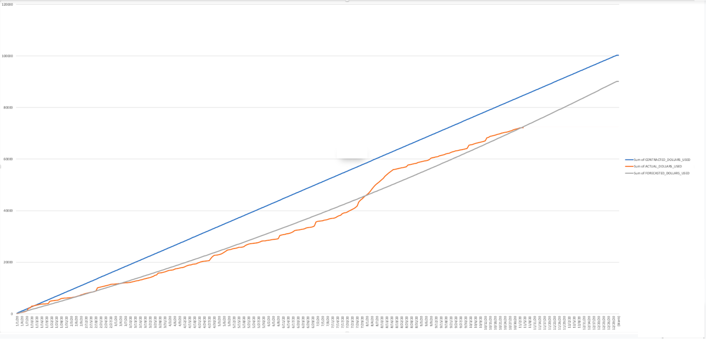

## Partner Tools Consuming Credits (T1)
###### Tier 1
#### Description:
Identifies which of Snowflake's partner tools/solutions (BI, ETL, etc.) are consuming the most credits.
#### How to Interpret Results:
Are there certain partner solutions that are consuming more credits than anticipated?  What is the reasoning for this?
#### Primary Schema:
Account_Usage
#### SQL
```sql
--THIS IS APPROXIMATE CREDIT CONSUMPTION BY CLIENT APPLICATION
WITH CLIENT_HOUR_EXECUTION_CTE AS (
    SELECT  CASE
         WHEN CLIENT_APPLICATION_ID LIKE 'Go %' THEN 'Go'
         WHEN CLIENT_APPLICATION_ID LIKE 'Snowflake UI %' THEN 'Snowflake UI'
         WHEN CLIENT_APPLICATION_ID LIKE 'SnowSQL %' THEN 'SnowSQL'
         WHEN CLIENT_APPLICATION_ID LIKE 'JDBC %' THEN 'JDBC'
         WHEN CLIENT_APPLICATION_ID LIKE 'PythonConnector %' THEN 'Python'
         WHEN CLIENT_APPLICATION_ID LIKE 'ODBC %' THEN 'ODBC'
         ELSE 'NOT YET MAPPED: ' || CLIENT_APPLICATION_ID
       END AS CLIENT_APPLICATION_NAME
    ,WAREHOUSE_NAME
    ,DATE_TRUNC('hour',START_TIME) as START_TIME_HOUR
    ,SUM(EXECUTION_TIME)  as CLIENT_HOUR_EXECUTION_TIME
    FROM "SNOWFLAKE"."ACCOUNT_USAGE"."QUERY_HISTORY" QH
    JOIN "SNOWFLAKE"."ACCOUNT_USAGE"."SESSIONS" SE ON SE.SESSION_ID = QH.SESSION_ID
    WHERE WAREHOUSE_NAME IS NOT NULL
    AND EXECUTION_TIME > 0
  
 --Change the below filter if you want to look at a longer range than the last 1 month 
    AND START_TIME > DATEADD(Month,-1,CURRENT_TIMESTAMP())
    group by 1,2,3
    )
, HOUR_EXECUTION_CTE AS (
    SELECT  START_TIME_HOUR
    ,WAREHOUSE_NAME
    ,SUM(CLIENT_HOUR_EXECUTION_TIME) AS HOUR_EXECUTION_TIME
    FROM CLIENT_HOUR_EXECUTION_CTE
    group by 1,2
)
, APPROXIMATE_CREDITS AS (
    SELECT 
    A.CLIENT_APPLICATION_NAME
    ,C.WAREHOUSE_NAME
    ,(A.CLIENT_HOUR_EXECUTION_TIME/B.HOUR_EXECUTION_TIME)*C.CREDITS_USED AS APPROXIMATE_CREDITS_USED

    FROM CLIENT_HOUR_EXECUTION_CTE A
    JOIN HOUR_EXECUTION_CTE B  ON A.START_TIME_HOUR = B.START_TIME_HOUR and B.WAREHOUSE_NAME = A.WAREHOUSE_NAME
    JOIN "SNOWFLAKE"."ACCOUNT_USAGE"."WAREHOUSE_METERING_HISTORY" C ON C.WAREHOUSE_NAME = A.WAREHOUSE_NAME AND C.START_TIME = A.START_TIME_HOUR
)

SELECT 
 CLIENT_APPLICATION_NAME
,WAREHOUSE_NAME
,SUM(APPROXIMATE_CREDITS_USED) AS APPROXIMATE_CREDITS_USED
FROM APPROXIMATE_CREDITS
GROUP BY 1,2
ORDER BY 3 DESC
;

```
#### Screenshot
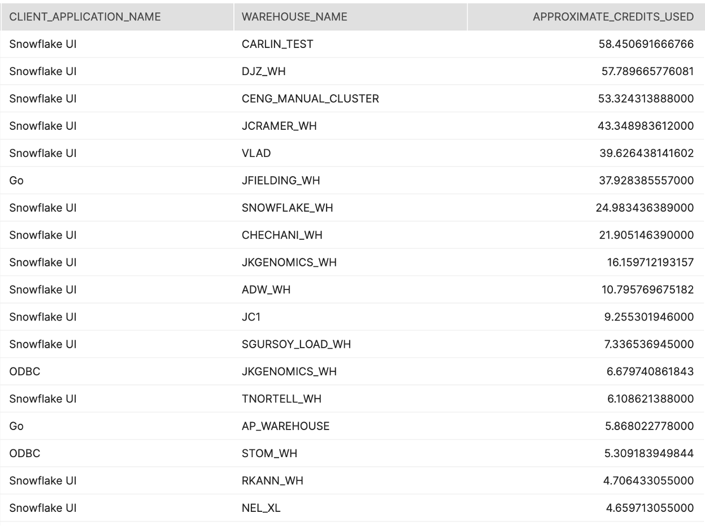

## Credit Consumption by User (T1)
###### Tier 1
#### Description:
Identifies which users are consuming the most credits within your Snowflake environment.  
#### How to Interpret Results:
Are there certain users that are consuming more credits than they should? What is the purpose behind this additional usage?  
#### Primary Schema:
Account_Usage
#### SQL
```sql
--THIS IS APPROXIMATE CREDIT CONSUMPTION BY USER
WITH USER_HOUR_EXECUTION_CTE AS (
    SELECT  USER_NAME
    ,WAREHOUSE_NAME
    ,DATE_TRUNC('hour',START_TIME) as START_TIME_HOUR
    ,SUM(EXECUTION_TIME)  as USER_HOUR_EXECUTION_TIME
    FROM "SNOWFLAKE"."ACCOUNT_USAGE"."QUERY_HISTORY" 
    WHERE WAREHOUSE_NAME IS NOT NULL
    AND EXECUTION_TIME > 0
  
 --Change the below filter if you want to look at a longer range than the last 1 month 
    AND START_TIME > DATEADD(Month,-1,CURRENT_TIMESTAMP())
    group by 1,2,3
    )
, HOUR_EXECUTION_CTE AS (
    SELECT  START_TIME_HOUR
    ,WAREHOUSE_NAME
    ,SUM(USER_HOUR_EXECUTION_TIME) AS HOUR_EXECUTION_TIME
    FROM USER_HOUR_EXECUTION_CTE
    group by 1,2
)
, APPROXIMATE_CREDITS AS (
    SELECT 
    A.USER_NAME
    ,C.WAREHOUSE_NAME
    ,(A.USER_HOUR_EXECUTION_TIME/B.HOUR_EXECUTION_TIME)*C.CREDITS_USED AS APPROXIMATE_CREDITS_USED

    FROM USER_HOUR_EXECUTION_CTE A
    JOIN HOUR_EXECUTION_CTE B  ON A.START_TIME_HOUR = B.START_TIME_HOUR and B.WAREHOUSE_NAME = A.WAREHOUSE_NAME
    JOIN "SNOWFLAKE"."ACCOUNT_USAGE"."WAREHOUSE_METERING_HISTORY" C ON C.WAREHOUSE_NAME = A.WAREHOUSE_NAME AND C.START_TIME = A.START_TIME_HOUR
)

SELECT 
 USER_NAME
,WAREHOUSE_NAME
,SUM(APPROXIMATE_CREDITS_USED) AS APPROXIMATE_CREDITS_USED
FROM APPROXIMATE_CREDITS
GROUP BY 1,2
ORDER BY 3 DESC
;
```
#### Screenshot
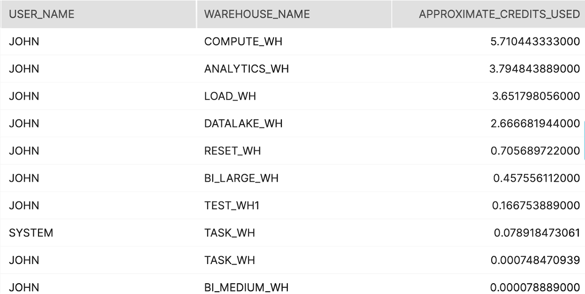

## Queries by # of Times Executed and Execution Time (T2)
###### Tier 2
#### Description:
Are there any queries that get executed a ton?? how much execution time do they take up?
#### How to Interpret Results:
Opportunity to materialize the result set as a table?
#### Primary Schema:
Account_Usage
#### SQL
```sql
SELECT 
QUERY_TEXT
,count(*) as number_of_queries
,sum(TOTAL_ELAPSED_TIME)/1000 as execution_seconds
,sum(TOTAL_ELAPSED_TIME)/(1000*60) as execution_minutes
,sum(TOTAL_ELAPSED_TIME)/(1000*60*60) as execution_hours

  from SNOWFLAKE.ACCOUNT_USAGE.QUERY_HISTORY Q
  where 1=1
  and TO_DATE(Q.START_TIME) >     DATEADD(month,-1,TO_DATE(CURRENT_TIMESTAMP())) 
 and TOTAL_ELAPSED_TIME > 0 --only get queries that actually used compute
  group by 1
  having count(*) >= 10 --configurable/minimal threshold
  order by 2 desc
  limit 100 --configurable upper bound threshold
  ;
```

## Top 50 Longest Running Queries (T2)
###### Tier 2
#### Description:
Looks at the top 50 longest running queries to see if there are patterns
#### How to Interpret Results:
Is there an opportunity to optimize with clustering or upsize the warehouse?
#### Primary Schema:
Account_Usage
#### SQL
```sql
select
          
          QUERY_ID
         --reconfigure the url if your account is not in AWS US-West
         ,'https://'||CURRENT_ACCOUNT()||'.snowflakecomputing.com/console#/monitoring/queries/detail?queryId='||Q.QUERY_ID as QUERY_PROFILE_URL
         ,ROW_NUMBER() OVER(ORDER BY PARTITIONS_SCANNED DESC) as QUERY_ID_INT
         ,QUERY_TEXT
         ,TOTAL_ELAPSED_TIME/1000 AS QUERY_EXECUTION_TIME_SECONDS
         ,PARTITIONS_SCANNED
         ,PARTITIONS_TOTAL

from SNOWFLAKE.ACCOUNT_USAGE.QUERY_HISTORY Q
 where 1=1
  and TO_DATE(Q.START_TIME) >     DATEADD(month,-1,TO_DATE(CURRENT_TIMESTAMP())) 
    and TOTAL_ELAPSED_TIME > 0 --only get queries that actually used compute
    and ERROR_CODE iS NULL
    and PARTITIONS_SCANNED is not null
   
  order by  TOTAL_ELAPSED_TIME desc
   
   LIMIT 50
   ;
```


## Top 50 Queries that Scanned the Most Data (T2)
###### Tier 2
#### Description:
Looks at the top 50 queries that scan the largest number of micro partitions
#### How to Interpret Results:
Is there an opportunity to optimize with clustering or upsize the warehouse?
#### Primary Schema:
Account_Usage
#### SQL
```sql
select
          
          QUERY_ID
          --reconfigure the url if your account is not in AWS US-West
         ,'https://'||CURRENT_ACCOUNT()||'.snowflakecomputing.com/console#/monitoring/queries/detail?queryId='||Q.QUERY_ID as QUERY_PROFILE_URL
         ,ROW_NUMBER() OVER(ORDER BY PARTITIONS_SCANNED DESC) as QUERY_ID_INT
         ,QUERY_TEXT
         ,TOTAL_ELAPSED_TIME/1000 AS QUERY_EXECUTION_TIME_SECONDS
         ,PARTITIONS_SCANNED
         ,PARTITIONS_TOTAL

from SNOWFLAKE.ACCOUNT_USAGE.QUERY_HISTORY Q
 where 1=1
  and TO_DATE(Q.START_TIME) >     DATEADD(month,-1,TO_DATE(CURRENT_TIMESTAMP())) 
    and TOTAL_ELAPSED_TIME > 0 --only get queries that actually used compute
    and ERROR_CODE iS NULL
    and PARTITIONS_SCANNED is not null
   
  order by  PARTITIONS_SCANNED desc
   
   LIMIT 50
   ;
```

## Queries by Execution Buckets over the Past 7 Days (T2)
###### Tier 2
#### Description:
Group the queries for a given warehouse by execution time buckets
#### How to Interpret Results:
This is an opportunity to identify query SLA trends and make a decision to downsize a warehouse, upsize a warehouse, or separate out some queries to another warehouse
#### Primary Schema:
Account_Usage
#### SQL
```sql
WITH BUCKETS AS (

SELECT 'Less than 1 second' as execution_time_bucket, 0 as execution_time_lower_bound, 1000 as execution_time_upper_bound
UNION ALL
SELECT '1-5 seconds' as execution_time_bucket, 1000 as execution_time_lower_bound, 5000 as execution_time_upper_bound
UNION ALL
SELECT '5-10 seconds' as execution_time_bucket, 5000 as execution_time_lower_bound, 10000 as execution_time_upper_bound
UNION ALL
SELECT '10-20 seconds' as execution_time_bucket, 10000 as execution_time_lower_bound, 20000 as execution_time_upper_bound
UNION ALL
SELECT '20-30 seconds' as execution_time_bucket, 20000 as execution_time_lower_bound, 30000 as execution_time_upper_bound
UNION ALL
SELECT '30-60 seconds' as execution_time_bucket, 30000 as execution_time_lower_bound, 60000 as execution_time_upper_bound
UNION ALL
SELECT '1-2 minutes' as execution_time_bucket, 60000 as execution_time_lower_bound, 120000 as execution_time_upper_bound
UNION ALL
SELECT 'more than 2 minutes' as execution_time_bucket, 120000 as execution_time_lower_bound, NULL as execution_time_upper_bound
)

SELECT 
 COALESCE(execution_time_bucket,'more than 2 minutes')
,count(Query_ID) as number_of_queries

from SNOWFLAKE.ACCOUNT_USAGE.QUERY_HISTORY Q
FULL OUTER JOIN BUCKETS B ON (Q.TOTAL_ELAPSED_TIME) >= B.execution_time_lower_bound and (Q.TOTAL_ELAPSED_TIME) < B.execution_time_upper_bound
where Q.Query_ID is null
OR (
TO_DATE(Q.START_TIME) >= DATEADD(week,-1,TO_DATE(CURRENT_TIMESTAMP())) 
and warehouse_name = <WAREHOUSE_NAME>
and TOTAL_ELAPSED_TIME > 0 
  )
group by 1,COALESCE(b.execution_time_lower_bound,120000)
order by COALESCE(b.execution_time_lower_bound,120000)
  ;
```
#### Screenshot
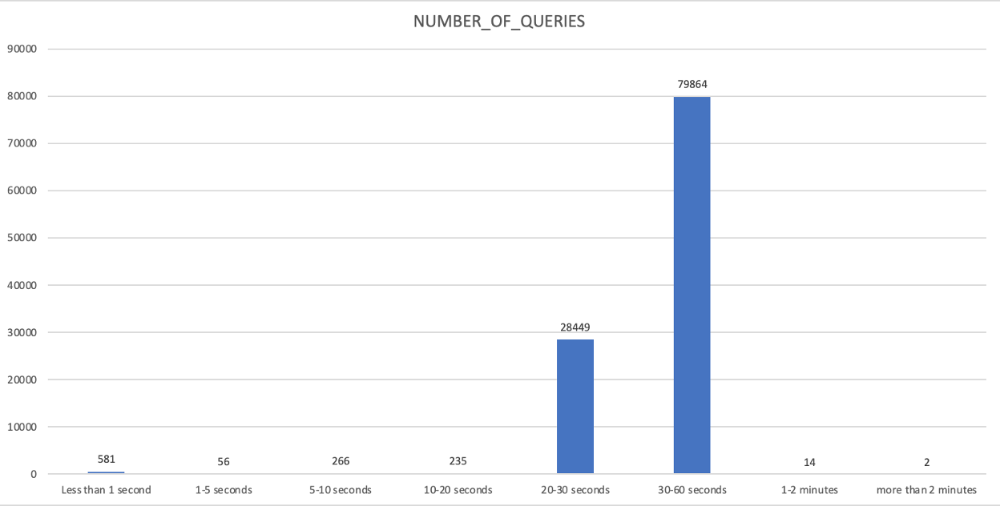

## Warehouses with High Cloud Services Usage (T2)
###### Tier 2
#### Description:
Shows the warehouses that are not using enough compute to cover the cloud services portion of compute, ordered by the ratio of cloud services to total compute
#### How to Interpret Results:
Focus on Warehouses that are using a high volume and ratio of cloud services compute. Investigate why this is the case to reduce overall cost (might be cloning, listing files in S3, partner tools setting session parameters, etc.).  The goal to reduce cloud services credit consumption is to aim for cloud services credit to be less than 10% of overall credits.
####Primary Schema:
Account_Usage
#### SQL
```sql
select 
    WAREHOUSE_NAME
    ,SUM(CREDITS_USED) as CREDITS_USED
    ,SUM(CREDITS_USED_CLOUD_SERVICES) as CREDITS_USED_CLOUD_SERVICES
    ,SUM(CREDITS_USED_CLOUD_SERVICES)/SUM(CREDITS_USED) as PERCENT_CLOUD_SERVICES
from "SNOWFLAKE"."ACCOUNT_USAGE"."WAREHOUSE_METERING_HISTORY"
where TO_DATE(START_TIME) >= DATEADD(month,-1,CURRENT_TIMESTAMP())
and CREDITS_USED_CLOUD_SERVICES > 0
group by 1
order by 4 desc
;
```
#### Screenshot
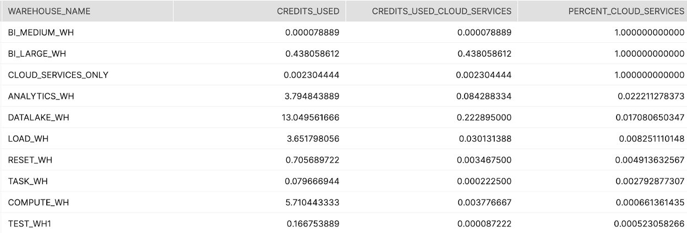

## Warehouse Utilization (T2)
###### Tier 2
#### Description:
This query is designed to give a rough idea of how busy Warehouses are compared to the credit consumption per hour. It will show the end user the number of credits consumed, the number of queries executed and the total execution time of those queries in each hour window.
#### How to Interpret Results:
This data can be used to draw correlations between credit consumption and the #/duration of query executions. The more queries or higher query duration for the fewest number of credits may help drive more value per credit.
#### Primary Schema:
Account_Usage
#### SQL
```sql
SELECT
       WMH.WAREHOUSE_NAME
      ,WMH.START_TIME
      ,WMH.CREDITS_USED
      ,SUM(COALESCE(B.EXECUTION_TIME_SECONDS,0)) as TOTAL_EXECUTION_TIME_SECONDS
      ,SUM(COALESCE(QUERY_COUNT,0)) AS QUERY_COUNT

FROM SNOWFLAKE.ACCOUNT_USAGE.WAREHOUSE_METERING_HISTORY WMH
LEFT JOIN (

      --QUERIES FULLY EXECUTED WITHIN THE HOUR
      SELECT
         WMH.WAREHOUSE_NAME
        ,WMH.START_TIME
        ,SUM(COALESCE(QH.EXECUTION_TIME,0))/(1000) AS EXECUTION_TIME_SECONDS
        ,COUNT(DISTINCT QH.QUERY_ID) AS QUERY_COUNT
      FROM SNOWFLAKE.ACCOUNT_USAGE.WAREHOUSE_METERING_HISTORY     WMH
      JOIN SNOWFLAKE.ACCOUNT_USAGE.QUERY_HISTORY             QH ON QH.WAREHOUSE_NAME = WMH.WAREHOUSE_NAME
                                                                          AND QH.START_TIME BETWEEN WMH.START_TIME AND WMH.END_TIME
                                                                          AND QH.END_TIME BETWEEN WMH.START_TIME AND WMH.END_TIME
      WHERE TO_DATE(WMH.START_TIME) >= DATEADD(week,-1,CURRENT_TIMESTAMP())
      AND TO_DATE(QH.START_TIME) >= DATEADD(week,-1,CURRENT_TIMESTAMP())
      GROUP BY
      WMH.WAREHOUSE_NAME
      ,WMH.START_TIME

      UNION ALL

      --FRONT part OF QUERIES Executed longer than 1 Hour
      SELECT
         WMH.WAREHOUSE_NAME
        ,WMH.START_TIME
        ,SUM(COALESCE(DATEDIFF(seconds,QH.START_TIME,WMH.END_TIME),0)) AS EXECUTION_TIME_SECONDS
        ,COUNT(DISTINCT QUERY_ID) AS QUERY_COUNT
      FROM SNOWFLAKE.ACCOUNT_USAGE.WAREHOUSE_METERING_HISTORY     WMH
      JOIN SNOWFLAKE.ACCOUNT_USAGE.QUERY_HISTORY             QH ON QH.WAREHOUSE_NAME = WMH.WAREHOUSE_NAME
                                                                          AND QH.START_TIME BETWEEN WMH.START_TIME AND WMH.END_TIME
                                                                          AND QH.END_TIME > WMH.END_TIME
      WHERE TO_DATE(WMH.START_TIME) >= DATEADD(week,-1,CURRENT_TIMESTAMP())
      AND TO_DATE(QH.START_TIME) >= DATEADD(week,-1,CURRENT_TIMESTAMP())
      GROUP BY
      WMH.WAREHOUSE_NAME
      ,WMH.START_TIME

      UNION ALL

      --Back part OF QUERIES Executed longer than 1 Hour
      SELECT
         WMH.WAREHOUSE_NAME
        ,WMH.START_TIME
        ,SUM(COALESCE(DATEDIFF(seconds,WMH.START_TIME,QH.END_TIME),0)) AS EXECUTION_TIME_SECONDS
        ,COUNT(DISTINCT QUERY_ID) AS QUERY_COUNT
      FROM SNOWFLAKE.ACCOUNT_USAGE.WAREHOUSE_METERING_HISTORY     WMH
      JOIN SNOWFLAKE.ACCOUNT_USAGE.QUERY_HISTORY             QH ON QH.WAREHOUSE_NAME = WMH.WAREHOUSE_NAME
                                                                          AND QH.END_TIME BETWEEN WMH.START_TIME AND WMH.END_TIME
                                                                          AND QH.START_TIME < WMH.START_TIME
      WHERE TO_DATE(WMH.START_TIME) >= DATEADD(week,-1,CURRENT_TIMESTAMP())
      AND TO_DATE(QH.START_TIME) >= DATEADD(week,-1,CURRENT_TIMESTAMP())
      GROUP BY
      WMH.WAREHOUSE_NAME
      ,WMH.START_TIME

      UNION ALL

      --Middle part OF QUERIES Executed longer than 1 Hour
      SELECT
         WMH.WAREHOUSE_NAME
        ,WMH.START_TIME
        ,SUM(COALESCE(DATEDIFF(seconds,WMH.START_TIME,WMH.END_TIME),0)) AS EXECUTION_TIME_SECONDS
        ,COUNT(DISTINCT QUERY_ID) AS QUERY_COUNT
      FROM SNOWFLAKE.ACCOUNT_USAGE.WAREHOUSE_METERING_HISTORY     WMH
      JOIN SNOWFLAKE.ACCOUNT_USAGE.QUERY_HISTORY             QH ON QH.WAREHOUSE_NAME = WMH.WAREHOUSE_NAME
                                                                          AND WMH.START_TIME > QH.START_TIME
                                                                          AND WMH.END_TIME < QH.END_TIME
      WHERE TO_DATE(WMH.START_TIME) >= DATEADD(week,-1,CURRENT_TIMESTAMP())
      AND TO_DATE(QH.START_TIME) >= DATEADD(week,-1,CURRENT_TIMESTAMP())
      GROUP BY
      WMH.WAREHOUSE_NAME
      ,WMH.START_TIME

) B ON B.WAREHOUSE_NAME = WMH.WAREHOUSE_NAME AND B.START_TIME = WMH.START_TIME

WHERE TO_DATE(WMH.START_TIME) >= DATEADD(week,-1,CURRENT_TIMESTAMP())
GROUP BY

      WMH.WAREHOUSE_NAME
      ,WMH.START_TIME
      ,WMH.CREDITS_USED
;
```
#### Screenshot
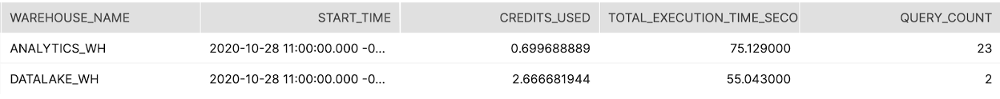