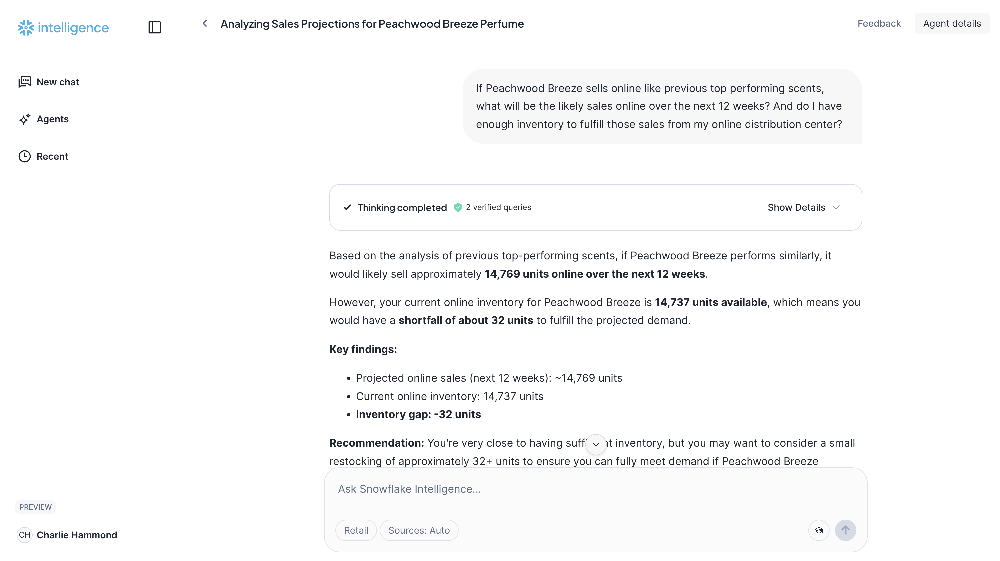

author: Charlie Hammond
id: retail-snowflake-intelligence
categories: snowflake-site:taxonomy/solution-center/certification/quickstart, snowflake-site:taxonomy/industry/retail-and-cpg, snowflake-site:taxonomy/product/platform
language: en
summary: This solution goes through Snowflake Intelligence with retail data. 
environments: web
status: Published
feedback link: https://github.com/Snowflake-Labs/sfguides/issues

# Retail Snowflake Intelligence with Cortex Agents
<!-- ------------------------ -->
## Overview

This solution goes through Snowflake Intelligence with retail data. You will learn how Snowflake Intelligence leverages natural language to drive deep insights from you data. This quickstart uses a fictional hand soap company, "Lather and Leaf," to demonstrate a common retail use case. The story progresses naturally, turning data points into business decisions. 

### Prerequisites

* A Snowflake account with ACCOUNTADMIN privileges
* Basic familiarity with SQL and database concepts
* Basic understanding of AI and conversational interfaces

### What You'll Learn

* **Build conversational AI interfaces** using Snowflake Intelligence and Cortex Agents
* **Design semantic data models** for business intelligence and analytics
* **Configure production-ready environments** with proper database and schema design

### What You'll Build

This quickstart includes the implementation of a complete retail intelligence solution with all necessary components and configurations.

<!-- ------------------------ -->
## Setup Environment

### **1. Setting Up the Environment**

First, you'll need to create the database, schema, and a named internal stage where your semantic model files will be stored. This ensures a clean and organized environment for your demo.
Run the SQL commands linked [here](https://github.com/Snowflake-Labs/getting_started_with_retail_snowflake_intelligence/blob/main/scripts/setup.sql) in a Snowflake worksheet:

### **2. Uploading Semantic Model Files via Snowsight**

Once the stage is created, you can manually upload your semantic model YAML files directly through the Snowsight user interface. Download the three semantic models [here](https://github.com/Snowflake-Labs/getting_started_with_retail_snowflake_intelligence/tree/main/scripts/semantic_models).

1.  **Navigate to your Stage in Snowsight:**
      * In the Snowsight left-hand navigation pane, go to **Data**.
      * Expand your database (`RETAIL_SNOWFLAKE_INTELLIGENCE_DB`).
      * Expand the schema (`ANALYTICS`).
      * Click on **Stages**.
      * Click on the `SEMANTIC_MODELS` stage.
2.  **Upload the Files:**
      * Click the **+ Upload** button in the top-right corner.
      * A file explorer window will open.
      * Select your three semantic model YAML files (`product_comments_and_stats.yaml`, `product_inventory.yaml`, `product_sales_analysis.yaml`) from your local machine.
      * Click **Open** to begin the upload. You will see a progress bar for each file, and they will appear in the stage's file list once complete.

### **3. Creating the Cortex Agent**

With your files staged, you can now create the agent in the Snowflake UI and connect it to your semantic models.
1.  **Navigate to the Snowflake Intelligence UI:**
      * In Snowsight, go to **AI & ML**.
      * Select **Agents**.
      * Click the **+ Create Agent** button.
2.  **Fill in the Agent Details:**
      * Give your agent a **name** (e.g., `Retail_Analytics_Agent`).
      * Provide a **description** that explains the agent's purpose, such as "An agent to help a direct-to-consumer company analyze sales, inventory, and customer sentiment."
3.  **Add the Semantic Models as Tools:**
      * In the agent creation wizard, go to the **Tools** section.
      * Under the "Cortex Analyst" heading, click the **+ Add** button.
      * Select **Semantic Model File**.
      * Choose the database, schema, and stage you created (`RETAIL_SNOWFLAKE_INTELLIGENCE_DB`, `ANALYTICS`, `SEMANTIC_MODELS`).
      * Select each of your three YAML files from the list (`sales_model.yaml`, `inventory_model.yaml`, `comments_model.yaml`).
      * Select `RETAIL_SNOWFLAKE_INTELLIGENCE_WH` warehouse
      * Add a timeout of 60 seconds
      * Have Cortex create a description 
      * Click **Add**. This will add all three models to your agent.
4.  **Finalize and Create:**
      * Review the agent's details and tools.
      * Click **Save**.

<!-- ------------------------ -->
## Using Your Solution

Once you've completed the setup steps above, you can begin using your Snowflake Intelligence solution. Navigate to AI > Snowflake Intelligence from Snowsight to open your chat interface. You can also use the chat from the agent setup screen once you save.

1. **Test Your Agent** - Navigate to the Snowflake Intelligence chat interface and test basic queries
2. **Explore the Demo Prompts** - Use the provided demo prompts to experience the full capabilities
3. **Validate Results** - Verify that all components are working correctly and returning expected results
4. **Customize for Your Use Case** - Adapt the solution for your specific business requirements

### **Prompts for Snowflake Intelligence**

Try using some of the prompts below. They designed to be copy-pasted directly into the Snowflake Intelligence chat. They demonstrate a progression from simple to complex, multi-source questions.

1.  **How are the sales for my 2 newest scents doing?**
    * **Purpose:** This initial query shows Snowflake Intelligence’s ability to summarize structured sales data.

2.  **Are our 2 new scents getting a lot of positive buzz online?**
    * **Purpose:** This highlights the platform’s capability to analyze unstructured data (social media comments, reviews) and provide a sentiment overview.

3.  **What are the latest comments for Peachwood Breeze?**
    * **Purpose:** This illustrates how the platform can retrieve specific, unstructured data points (text comments) to provide tangible evidence that supports the analysis.

4.  **If Peachwood Breeze sells online like previous top performing scents, what will be the likely sales online over the next 12 weeks? And do I have enough inventory to fulfill those sales from my online distribution center?**
    * **Purpose:** This powerful prompt showcases **predictive analytics** and **multi-source querying**, combining a sales forecast with an inventory check.

5.  **I want to be safe and handle online sales of up to 16,000 units. If that happens, are there any distribution centers that are likely to have extra inventory so we can transfer to meet online demand?**
    * **Purpose:** The final prompt shows the platform's ability to handle **"what-if" scenarios** and provide a concrete, actionable business recommendation.

<!-- ------------------------ -->
## Conclusion

Congratulations! You have successfully built and deployed a complete Retail Intelligence solution using Snowflake. You can now find data driven answers to your complex business questions! 

### What You Accomplished

* Configured a production-ready Snowflake environment
* Implemented core solution components
* Validated the complete workflow

### Next Steps

* Explore additional Snowflake features
* Customize the solution for your specific use case
* Consider production deployment strategies

### Resources

* [Snowflake Intelligence](https://docs.snowflake.com/en/user-guide/snowflake-cortex/snowflake-intelligence)
* [Cortex Agents](https://docs.snowflake.com/en/user-guide/snowflake-cortex/cortex-agents)
* [Additional Quickstarts](/en/developers/guides/)

