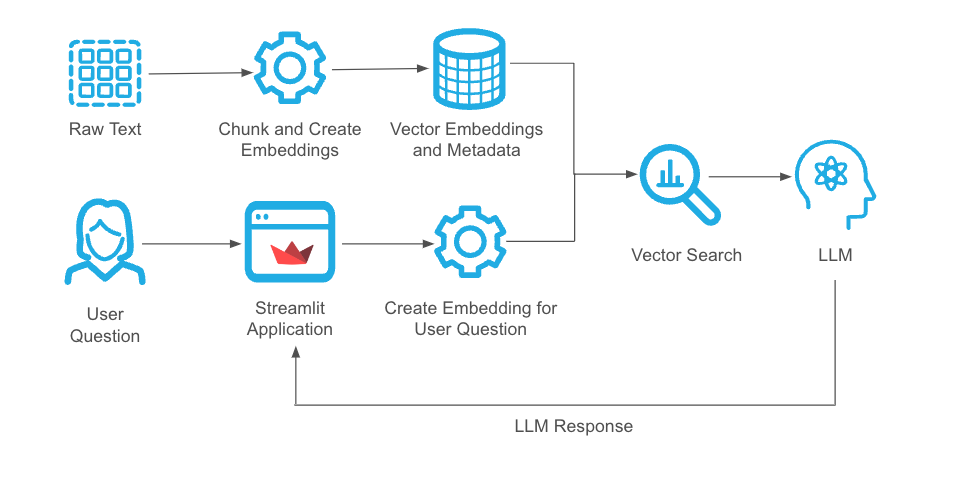
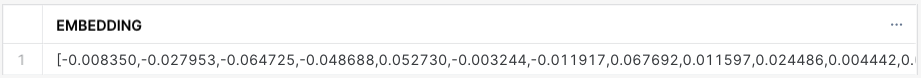
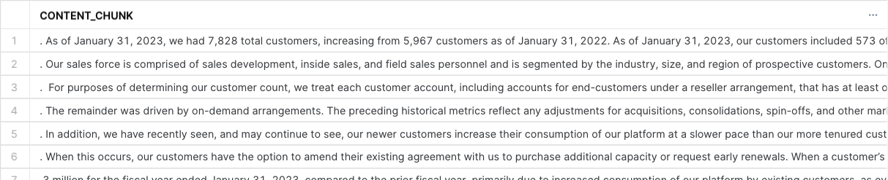
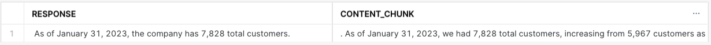
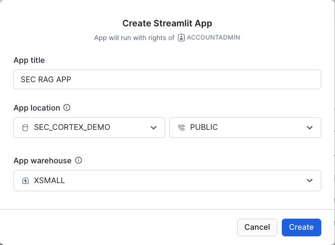
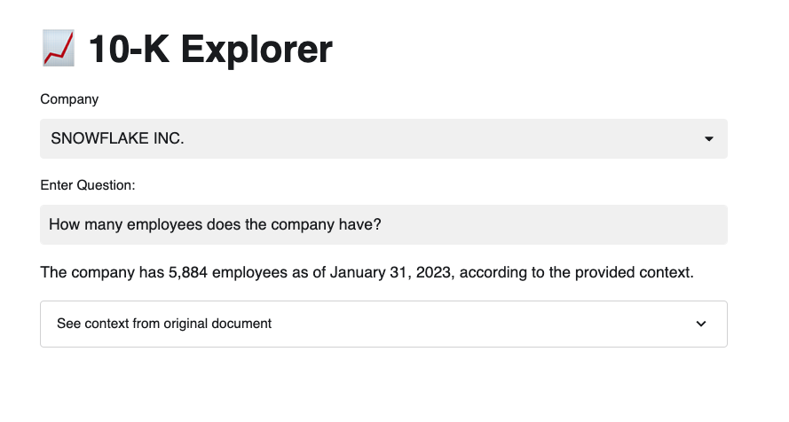

author: Jeremy Griffith
id: retrieval-augmented-generation-rag-on-unstructured-data-in-snowflake
summary: Quickly and easily build a retrieval augmented generation app using Snowflake and Streamlit. 
<!--- Categories below should be hyphenated, i.e., Getting-Started. Do not leave blank. Visit site for available categories. -->
categories: Solution-Examples, Data-Science-&-AI, Streamlit
environments: web
status: Published 
feedback link: https://github.com/Snowflake-Labs/sfguides/issues
tags: Getting Started, Data Science, Data Engineering, AI, Streamlit, RAG, Cortex

# Create a Retrieval Augmented Generation App Using Snowflake Cortex and Streamlit
<!-- ------------------------ -->
## Overview 
Duration: 2

Retrieval Augmentented Generation (RAG) is a powerful technique for improving the quality of responses from a Large Language Model (LLM). How RAG achieves these benefits is by retrieving information related to a user's query from a data store and feeding that information into the LLM prompt. This allows you to use the power of the LLM to understand the user's question, and give the LLM additional context to construct an accurate, fact-based response. 



### What You’ll Learn 
- How to use Cortex LLM functions in Snowflake.
- How to use the `VECTOR` column type and Snowflake's vector similarity functions to retreive relevant information from a Snowflake database table. 
- How to add content retrieved from a Snowflake database table to an LLM prompt to get a high-quality response driven by data in your Snowflake account. 

### What You’ll Need 
- Access to a Snowflake account or use of the [Snowflake free 30-day trial](https://trial.snowflake.com)
- A basic knowledge of SQL and Python

### What You’ll Build 
A Retrieval-Augmented Generation application with a front end using Streamlit. 

<!-- ------------------------ -->
## Prepare Snowflake Environemnt
Duration: 7

Before we get started using Snowflake Cortex, we'll find the data we'll be using from the Snowflake Marketplace, set up a compute warehouse, and create a database. 

### Get Data from Snowflake Marketplace
For this Quickstart, we'll be using the Cybersyn LLM Training Essentials dataset. You can get this free dataset from the [Snowflake Marketplace](https://app.snowflake.com/marketplace/listing/GZTSZ290BUX1X/cybersyn-inc-llm-training-essentials).

1. Click "GET" to make the dataset available in your account.
2. Call the database `LLM_TRAINING_ESSENTIALS` when creating the shared database in your account. 

### Create a Compute Warehouse
[Create a warehouse](https://docs.snowflake.com/en/user-guide/warehouses-tasks) in the Snowflake UI or using the following command:

```sql
use role accountadmin;
create warehouse rag_wh warehouse_size='MEDIUM';
grant usage on warehouse rag_wh to role accountadmin;
```

### Create Database
Create a database for our project. We'll use the name `SEC_CORTEX_DEMO`. Feel free to call yours whatever you'd like, but you might need to make some adjustments on future steps if you call it something different

```sql
create database sec_cortex_demo;
use database sec_cortex_demo;
```

<!-- ------------------------ -->
## Chunk and Embed Data
Duration: 35

In this step we will create a subset of our data and chunk and embed that data for use in our RAG application. Running embeddings for our entire dataset will take about 35 minutes, but we have some things for you to do while that's running. If you'd prefer, you can also choose to create embeddings for a smaller dataset, which will make this step take less time.

### Create Subset of Data
For this example, we'll use just the most recent 10-K report for every company in this dataset. In the next step, we will create text embeddings for this dataset. This will take about 30 minutes. If you're short on time, you can modify this query to create the dataset for a single company or a few companies by uncommenting and modifying this line: `-- and companies.company_name in ('SNOWFLAKE INC.')`. 

```sql
create or replace table sec_reports_base as 
SELECT
    txt.sec_document_id,
    companies.cik,
    txt.variable_name as document_type,
    companies.company_name,
    companies.sic_code_category,
    companies.sic_code_description,
    companies.country,
    txt.period_end_date,
    txt.value
FROM 
    llm_training_essentials.cybersyn.sec_report_text_attributes AS txt
    JOIN llm_training_essentials.cybersyn.sec_cik_index AS companies ON (companies.cik = txt.cik)
WHERE 
    1=1 
    and txt.period_end_date >= '2020-01-01'
    and document_type = '10-K Filing Text'
    -- and companies.company_name in ('SNOWFLAKE INC.')
qualify row_number() over (partition by companies.cik order by period_end_date desc) = 1;
```

### Create a User-Defined Table Function (UDTF) to Chunk Data
Each model has a context window that defines the maximum number of tokens that can be included in a prompt. These 10-K filings are too large to fit into the context window for the `llama2-70b-chat` model.  Chunking is a proces that allows us to break each of our 10-K reports into smaller pieces. For this, we'll use a Snowflake Table Function that Tom Christian outlined in his Medium Article called [Build End-to-End RAG Applications with Snowflake Cortex](https://medium.com/@thechosentom/rag-made-simple-with-snowflake-cortex-74d1df5143fd). 

```sql
create or replace function chunk_text(text varchar)
returns table(chunk varchar, start_index int)
language  python
runtime_version = '3.10'
handler = 'text_chunker'
packages=('pandas','langchain' )
as
$$
from langchain.text_splitter import RecursiveCharacterTextSplitter
import pandas as pd

class text_chunker:
    def process(self,text):        
        text_raw=[]
        text_raw.append(text) 
        
        text_splitter = RecursiveCharacterTextSplitter(
            separators = ["\n", "."], # Define an appropriate separator. New line is good typically!
            chunk_size = 1000, #Adjust this as you see fit
            chunk_overlap  = 200, #This lets text have some form of overlap. Useful for keeping chunks contextual
            length_function = len,
            add_start_index = True #Optional but useful if you'd like to feed the chunk before/after
        )
    
        chunks = text_splitter.create_documents(text_raw)
        df = pd.DataFrame(chunks, columns=['chunks','meta'])

        df['meta'] = df['meta'].apply(lambda x: x[1]['start_index']).astype(int)
        df['chunks'] = df['chunks'].apply(lambda x: x[1])
        
        yield from df.itertuples(index=False, name=None)
$$;
```

For the sake of not taking the contents of chunk out of context, the UDTF is set up so that each chunk has about 20% overlap with the prior chunk in the sequence. I encourage you to try different chunk lengths, overlaps, and separators depending on your use case.

### Chunk and Embed 10-K Reports
We will use the UDTF we created in the last step to break the 10-K reports into smaller parts. 

Additionally, we're using our first Snowflake Cortex function: `embed_text`! This function creates vector embeddings, which are a numerical representation of the meaning of the text in a chunk. These numerical representations allow us to retrieve appropriate information to pass to the LLM so it can formulate its response (the "Retrieval" part of Retrieval Augmented Generation). The first argument to this function is the embedding model we'll use (`e5-base-v2`), and the second argument is the text that we'd like to create to vectors. 

```sql
create or replace table content_chunks_10k as 
select 
    sec_document_id,
    document_type,
    company_name,
    sic_code_category,
    sic_code_description,
    country,
    period_end_date,
    chunk as content_chunk,
    snowflake.cortex.embed_text('e5-base-v2', content_chunk) embedding,
    start_index,
    row_number() over (partition by sec_document_id order by sec_document_id, start_index) as document_index_rownum,
    row_number() over (order by sec_document_id, start_index) as rownum
from 
    sec_reports_base,
    table(chunk_text(value)) --udtf call
where 
    length(content_chunk) <= 1000;
```

## Explore other Snowflake Cortex models
Duration: 10

While we're waiting for the previous step to complete, we can open a new Worksheet in Snowflake (Click the `+` sign by the tab bar) and explore some other Snowflake Cortex fucntions.

The first thing we can do is use the `COMPLETE` function to ask some questions. This will give us an idea of what the LLM already knows without the benefit of the data we're preparing for our RAG application.

We can ask the `llama2-70b-chat` model where Snowflake's headquarters is.
```sql
select snowflake.cortex.complete('llama2-70b-chat','Where is Snowflake''s headquarters?');
```

And we get the following response:
```
Snowflake's headquarters is located in Bozeman, Montana, USA. The company was founded in 2012 and was initially based in California, but it later relocated its headquarters to Bozeman in 2014. Bozeman is a small city located in the Rocky Mountains of southwestern Montana, and it has become a popular location for tech companies due to its proximity to nature, low cost of living, and high quality of life. Snowflake's headquarters is located in a modern office building in the heart of downtown Bozeman, and it features an open and collaborative workspace that reflects the company's values of innovation, simplicity, and customer obsession.
```

That answer is a little more chatty than I'd prefer, so we can also ask the LLM to be more concise.
```sql
select snowflake.cortex.complete('llama2-70b-chat','Where is Snowflake''s headquarters? Be concise.');
```

And now we get a response that's much more to the point:
```
Snowflake's headquarters is in Bozeman, Montana.
```

For our next question, we will ask the LLM how many customers Snowflake has.
```sql
select snowflake.cortex.complete('llama2-70b-chat','How many customers does Snowflake have?')
```

This query provides the following response:
```
Snowflake has not publicly disclosed the exact number of customers it has. However, the company has reported that it has thousands of customers across a wide range of industries, including financial services, healthcare, retail, and technology. In its most recent quarterly earnings report, Snowflake reported that it had 3,142 customers, which represents a 133% year-over-year increase. The company has also disclosed that it has over 100 customers that are using its platform to process more than $1 billion in annual revenue. It's worth noting that Snowflake's customer base is made up of both large enterprises and smaller businesses, and the company has been expanding its customer base across a range of industries and geographic regions.
 ```

This information is inaccurate and outdated -- and that's where RAG and our chunked and embedded data come in. 

## RAG in SQL
Duration: 8 

> aside positive
> 
>  Make sure the statement to create `content_chunks_10k` is complete before continuing.

Now we'll explore how Snowflake's `embed_text` and vector similarity functions will allow us to retrieve relevant information from our chunked and embedded table and feed it into our prompt to the LLM.

We already have all of the vector embeddings for every chunk of data in our `content_chunks_10k` table. In order to find relevant information related to our user's question, we need to embed that question first. 


### Embedding Our User's Question
```sql
set question = 'How many customers does the company have?';
select snowflake.cortex.embed_text('e5-base-v2', $question) as embedding;
```

What we get back is a numerical representation of the meaning of our request. This isn't that helpful to us or our end users, but it allows us to find content that's semantically similar to our question from our embedded content on the `content_chunks_10k` table. 



### Vector Similarity
Let's find the chunks of data from our `content_chunks_10k` table that can help answer our question using the `VECTOR_COSINE_DISTANCE` function.

```sql
select 
    content_chunk
from 
    content_chunks_10k 
where 
    company_name = 'SNOWFLAKE INC.'
order by 
    vector_cosine_distance(embedding, snowflake.cortex.embed_text('e5-base-v2', $question)) desc
limit 10;
```

This returns the 10 most relevant chunks of data that can help answer our question! The results at the top are the most similar to our question, and the similarity decreases as we go down the list. 



### Our first RAG Response
Now that we've explored how we can ask questions of an LLM, embed our user's questions, and find information in our database table that's related to that question, let's put it all together. 

The following code does a few things:
1. Embeds the user's question using the `EMBED_TEXT` function.
2. Finds the most similar chunk of information from our `content_chunks_10k` table.
3. Passes the user's question and the relevant chunk of content from our table to the Cortex `COMPLETE` function to get a final response. 

```sql
with context as (
    select 
        content_chunk,
        vector_cosine_distance(embedding, snowflake.cortex.embed_text('e5-base-v2', $question))
    from 
        content_chunks_10k 
    where 
        company_name = 'SNOWFLAKE INC.'
    order by 
        vector_cosine_distance(embedding, snowflake.cortex.embed_text('e5-base-v2', $question)) desc
    limit 1
)
select 
    snowflake.cortex.complete('llama2-70b-chat',
                              'Use the provided context to answer the question. Be concise. ' ||
                              '###
                               CONTEXT: ' ||
                              context.content_chunk ||
                              '###
                              QUESTION: ' || $question ||
                              'ANSWER: ') as response,
    context.content_chunk
from 
    context
;
```

This query returns an accurate response based on the 10-K report in our database, and also returns the actual chunk of the 10-K that informed the response. This information can help us verify the accuracy of the response as we develop our application and also help build trust with the end users. 



<!-- ------------------------ -->
## A RAG Application in Streamlit
Duration 5

Our final step is to create a Streamlit app with the logic we developed in SQL above. 

### Create Streamlit App
Our Streamlit app will be created using the Snowsight UI web editor. You can also develop Streamlit applications locally and deploy to Snowflake using the [SnowCLI](https://docs.snowflake.com/en/user-guide/snowsql) or by loading the file with the code to a stage and executing the `CREATE STREAMLIT` command ([docs](https://docs.snowflake.com/en/sql-reference/sql/create-streamlit)). 

1. Choose a database where your Streamlit app will be created or create new database. Depending on your privileges, you may need to grant permissions to create a Streamlit app on your database. You can do this by running the command `GRANT CREATE STREAMLIT ON SCHEMA sec_cortex_demo.public TO ROLE <role_name>`.
2. On the left navigation bar in your Snowflake account, choose "Streamlit." Press the `+ Streamilit App` button to create a new Streamlit app.  Here, you will select the database where you will create your app and the compute warehouse that you will use. 



### Paste Code Into Editor
You can copy and paste this code into the Streamlit Editor and click "Run" on the top right to refresh. We now have a front end for our application that will allow users without SQL skills to ask the same types of questions of our data that we were asking in SQL. 

```python
# Import python packages
import streamlit as st
from snowflake.snowpark.context import get_active_session
from snowflake.snowpark.functions import col, call_function

# Write directly to the app
st.title("	:chart_with_upwards_trend: 10-K Explorer")
session = get_active_session()

reports = session.table('sec_reports_base')
companies = reports.select(col('COMPANY_NAME')).distinct().sort('COMPANY_NAME')

selected_company = st.selectbox("Company", companies)

selected_document = reports.where(col('COMPANY_NAME') == selected_company)

question = st.text_input("Enter Question:")

if question: 
    
    question_response = session.sql(f"""
    with question as (
    select 
        '{question}' as question,
        snowflake.cortex.embed_text('e5-base-v2', question) as embedding
    ),
    context as ( 
        select 
            content_chunk as context,
            sec_document_id,
            start_index as document_index
        from 
            content_chunks_10k as content,
            question
        where 
            company_name = '{selected_company}'
        order by 
            vector_cosine_distance(content.embedding, question.embedding) desc
        limit 1
    )
    select 
        snowflake.cortex.complete('llama2-70b-chat',
                                  'Use only the context provided to answer the question.' ||
                                  '### ' ||  
                                  'Context: ' || context || 
                                  '### ' ||
                                  'Question: ' || question ||
                                  'Answer: ') as response,
        sec_document_id,
        document_index,
        context
    from 
        question,
        context
    """  
    ).collect()[0]

    st.write(question_response['RESPONSE'].replace("$","\$"))
    
    with st.expander("See context from original document", expanded=False):

        st.markdown(f'''
            **Document ID:** {question_response['SEC_DOCUMENT_ID']}  
            **Context Index in Document:** {question_response['DOCUMENT_INDEX']}  
            **Context from Document:**  
            {question_response['CONTEXT']}
        '''.replace("$","\$"))
```


The Streamlit app has a selectbox that allows the user to choose a company. The text that the user inputs is fed into the SQL statement that's calling the SQL that we created in the previous step. We also use an expander widget to allow the user to see the context from the original document if they wish. 

<!-- ------------------------ -->
## Conclusion
Duration: 1

You're done! You've created your first RAG application using Snowflake Cortex and Streamlit. Here are a few suggestions for what you can do next:

- Expermient with different [Cortex models](https://docs.snowflake.com/en/sql-reference/functions/complete-snowflake-cortex#arguments). One benefit of RAG is that you can often use smaller, more cost-effective models without a decrease in response quality. Models like `mistral-large`, `mistral-8x7b`, `mistral-7b`, and `gemma-7b` have larger context windows, so you can feed them more or larger chunks of data into the prompts. 
- Build a RAG application on your own data. 

### What we've covered
- Chunking and embedding data
- Snowflake Cortex LLM functions
- Vector similarity functions
- RAG in SQL
- RAG in Streamlit