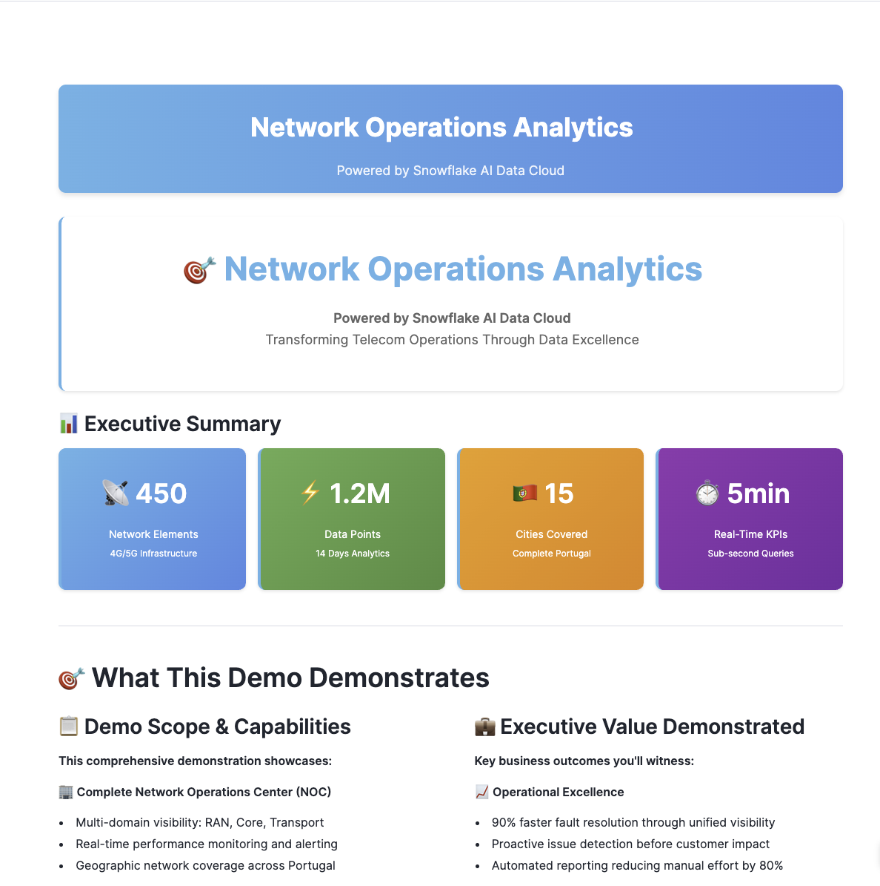
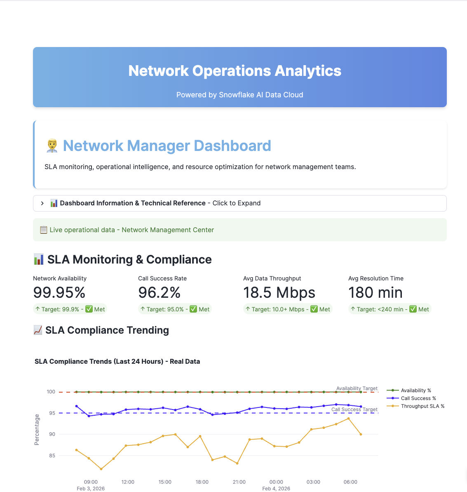

author: Rida Safdar
id: rida-test-guide
language: en
summary: This is a sample Snowflake Guide
categories: snowflake-site:taxonomy/solution-center/certification/quickstart
environments: web
status: Published
feedback link: https://github.com/Snowflake-Labs/sfguides/issues
fork repo link: <optional but modify to link to your repo>
open in snowflake: <optional but modify to link into the product>

# Snowflake Guide Template
<!-- ------------------------ -->
## Overview 

Please use [Snowflake Guide](https://www.snowflake.com/en/developers/guides/get-started-with-guides) as a guiding document for writing your own Snowflake Guide. <br>
This example guide has elements that you will use when writing your own guides, including: formatting, code snippet highlighting, video links, inserting photos, and more. 

It is important to include on the first page of your guide the following sections: 
- Prerequisites, 
- What you'll learn
- What you'll need
- What you'll build 

Remember, part of the purpose of a Snowflake Guide is that the reader will have **built** something by the end of the tutorial; this means that actual code needs to be included (not just pseudo-code).

The rest of this Snowflake Guide explains the steps of writing your own guide with some basic layout information.  
Detailed formatting options can be found in this [Snowflake Guide](https://www.snowflake.com/en/developers/guides/get-started-with-guides). 


### What You’ll Learn 
- The format for a guide (the sections, the metadata and basic markdown)
- How to include code snippets 
- How to hyperlink items
- Ways to include images and videos

### What You’ll Need 
- A [GitHub](https://github.com/) Account 
- [VSCode](https://code.visualstudio.com/download) Installed


### What You’ll Build 
- A Snowflake Guide in Markdown format

<!-- ------------------------ -->

## Creating Sections

A single sfguide consists of multiple steps or sections. 
These sections are defined in Markdown using Header tags.  Header 2 tag is `##`, Header 3 tag is `###` and so forth. 

```markdown
## Step 1 Title as H2 tag

All the content for the step goes here.

## Step 2 Title as H2 tag

### Subheader goes here as H3 tag.


```
>Please avoid going beyond H4 #### as it will not render on the page correctly!

<!-- ------------------------ -->

## Images and Videos

Ensure your videos are uploaded to the YouTube Channel (Snowflake Developer) before you start working on your guide.

You have the option to submit videos to Snowflake Corporate channel, Developers Channel or International Channel.
Use this link to [submit your videos](https://www.wrike.com/frontend/requestforms/index.html?token=eyJhY2NvdW50SWQiOjE5ODk1MzYsInRhc2tGb3JtSWQiOjExNDYyNzB9CTQ4NDU3Mjk1MjcxNjYJMTk3ZmNhNWQ1ODM5NTc1OGI2OWY5Mjc4Mzk4M2YwOGQ1Y2RiNGVlMGUzZDg3OTk3NzI3N2JkMTIyOGViZTdjMQ==)

### test images



Another test image



### Images
Image Guidelines: 
- Naming convention should be all lower case and include underscores (no hyphens)
- No special characters 
- File size should be less than 1MB. Gifs may be larger, however, should be optimized to prevent reduction of page load times
- Image file name should align to the name in .md file (this is case sensitive) 
- All images should be added to the 'assets' subfolder for your guide (please do not create additional subfolders within the 'assets' subfolder)
- No full resolution images; these should be optimized for web (recommended: tinypng) 
- Do no use HTML code for adding images


<!-- ------------------------ -->
## Conclusion And Resources

At the end of your Snowflake Guide, always have a clear call to action (CTA). This CTA could be a link to the docs pages, links to videos on youtube, a GitHub repo link, etc. 


### What You Learned
- Basics of creating sections
- adding formatting and code snippets
- Adding images and videos with considerations to keep in mind


