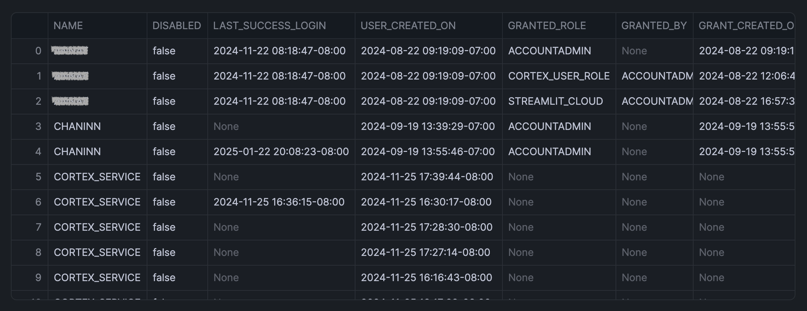
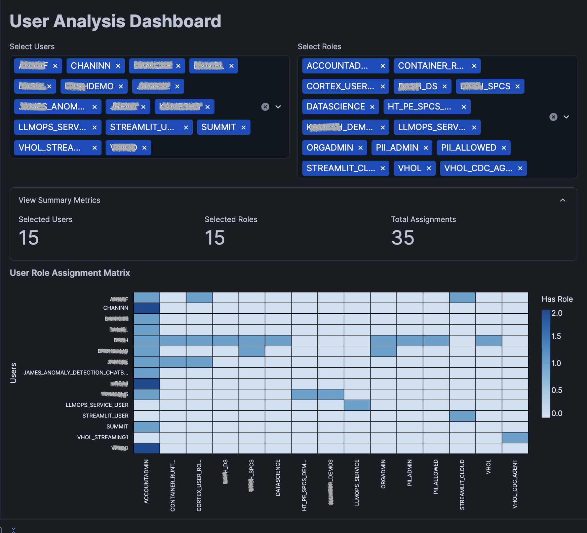
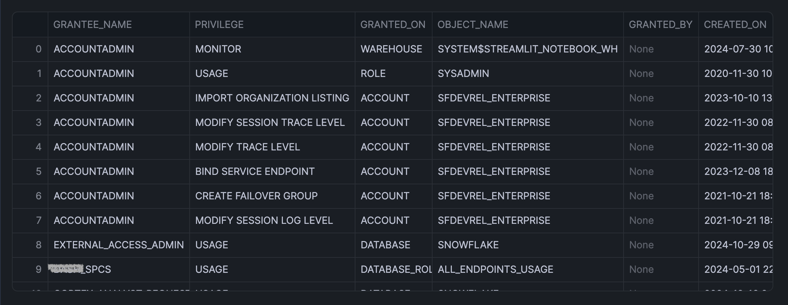
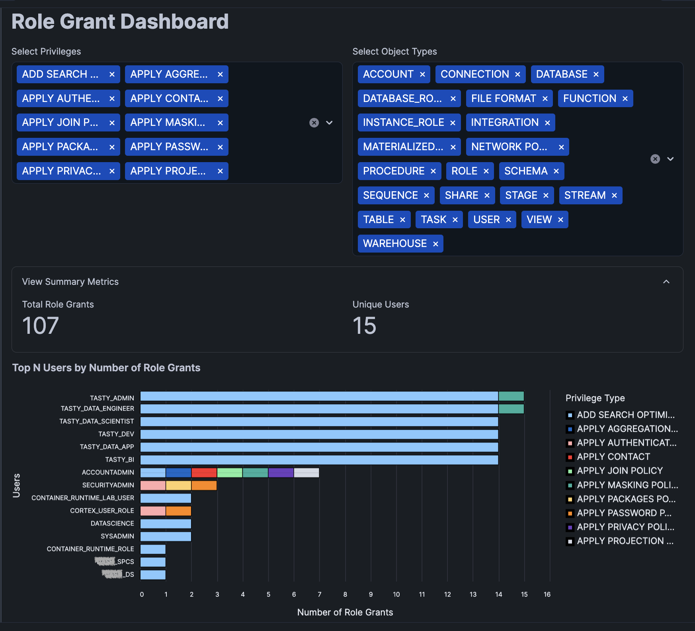

author: Chanin Nantasenamat
id: role-based-access-auditing
categories: snowflake-site:taxonomy/solution-center/certification/quickstart, snowflake-site:taxonomy/product/data-engineering
language: en
summary: Build a utility notebook to audit and report on user roles and privileges in Snowflake Notebooks. 
environments: web
status: Published
feedback link: https://github.com/Snowflake-Labs/sfguides/issues


# Build Role-Based Access Audit Dashboards in Snowflake Notebooks
<!-- ------------------------ -->
## Overview

Learn how to create interactive dashboards for auditing user roles and privileges in Snowflake using Streamlit. This guide walks you through building a utility notebook that helps to ensure adherence to security policies through visual analysis of user roles and privilege assignments.

### What You'll Learn
- How to query and analyze user role assignments
- How to examine role grant distributions
- How to create interactive visualizations with Streamlit and Altair
- How to build a role-based access audit dashboard

### What You'll Build
Two interactive dashboards on:
- User role analysis with heat map visualization
- Role grant analysis with bar charts

Here are some common features for these two dashboards:
- Dynamic filtering capabilities
- Real-time metric updates

### What You'll Need
- Access to a [Snowflake account](https://signup.snowflake.com/?utm_source=snowflake-devrel&utm_medium=developer-guides&utm_cta=developer-guides)
- Basic understanding of SQL and Python
- Familiarity with data visualization concepts

<!-- ------------------------ -->
## Setup

Firstly, to follow along with this quickstart, you can click on [Role_Based_Access_Auditing_with_Streamlit.ipynb](https://github.com/Snowflake-Labs/snowflake-demo-notebooks/blob/main/Role_Based_Access_Auditing_with_Streamlit/Role_Based_Access_Auditing_with_Streamlit.ipynb) to download the Notebook from GitHub. 

### Environment Setup
Snowflake Notebooks comes pre-installed with common Python libraries for data science and machine learning, including NumPy, Pandas, Altair, and more! If you need additional packages, simply click on the Packages dropdown in the top right to add them to your notebook.

Required libraries:
```python
import pandas as pd
import altair as alt
import streamlit as st
```

<!-- ------------------------ -->
## Implement User Role Analysis

### Query User Data
In this first use case, let's retrieve user details and role assignments using the following SQL query:

```sql
SELECT 
    u.name,
    u.disabled,
    u.last_success_login,
    u.created_on as user_created_on,
    g.role as granted_role,
    g.granted_by,
    g.created_on as grant_created_on
FROM 
    SNOWFLAKE.ACCOUNT_USAGE.USERS u
LEFT JOIN 
    SNOWFLAKE.ACCOUNT_USAGE.GRANTS_TO_USERS g
    ON u.name = g.grantee_name
WHERE 
    g.deleted_on IS NULL
ORDER BY 
    u.name, g.role;
```

This returns the following output:



Next, we'll convert the above SQL query output to a Pandas DataFrame (we'll also name this Python cell `df_user_role`, which we'll make a reference to shortly).

```
sql_user_role.to_pandas()
```

Next, we'll prepare the above DataFrame (`df_user_role`) for subsequent data visualization.

```
# Create user activity matrix
user_activity = (
    # Group by user and role, count occurrences
    df_user_role.groupby(['NAME', 'GRANTED_ROLE']) 
    .size()
    .reset_index()
    .pivot(index='NAME', columns='GRANTED_ROLE', values=0) 
    .fillna(0)
)

# Convert to long format for heatmap
user_activity_long = user_activity.reset_index().melt(
    id_vars=['NAME'],
    var_name='ROLE',
    value_name='HAS_ROLE'
)

# Add user status information
user_status = df_user_role[['NAME', 'DISABLED', 'LAST_SUCCESS_LOGIN']].drop_duplicates()
user_activity_long = user_activity_long.merge(
    user_status,
    on='NAME',  # Changed from left_on/right_on to simple on
    how='left'
)
```

### Create the User Role Dashboard

Finally, we'll use Streamlit to create a simple dashboard for user analysis. Note that we'll bring in the processed Pandas DataFrame (`user_activity_long`) from above into this app.

```python
import pandas as pd
import altair as alt
import streamlit as st

st.title("User Analysis Dashboard")

# Streamlit filters
col1, col2 = st.columns(2)
with col1:
    selected_users = st.multiselect(
        'Select Users',
        options=sorted(user_activity_long['NAME'].unique()),
        default=sorted(user_activity_long['NAME'].unique())
    )
with col2:
    selected_roles = st.multiselect(
        'Select Roles',
        options=sorted(user_activity_long['ROLE'].unique()),
        default=sorted(user_activity_long['ROLE'].unique())
    )

# Filter data based on selections
filtered_data = user_activity_long[
    user_activity_long['NAME'].isin(selected_users) & 
    user_activity_long['ROLE'].isin(selected_roles)
]

# Display summary metrics
with st.expander("View Summary Metrics", expanded=True):
    metric_col1, metric_col2, metric_col3 = st.columns(3)
    with metric_col1:
        st.metric("Selected Users", len(selected_users))
    with metric_col2:
        st.metric("Selected Roles", len(selected_roles))
    with metric_col3:
        st.metric("Total Assignments", len(filtered_data[filtered_data['HAS_ROLE'] > 0]))

# Create styled heatmap
heatmap = alt.Chart(filtered_data).mark_rect(
    stroke='black',
    strokeWidth=1
).encode(
    x=alt.X('ROLE:N', 
            title='Roles',
            axis=alt.Axis(
                labels=True,
                tickMinStep=1,
                labelOverlap=False,
                labelPadding=10
            )),
    y=alt.Y('NAME:N', 
            title='Users',
            axis=alt.Axis(
                labels=True,
                labelLimit=200,
                tickMinStep=1,
                labelOverlap=False,
                labelPadding=10
            )),
    color=alt.Color('HAS_ROLE:Q', 
                   title='Has Role',
                   scale=alt.Scale(scheme='blues')),
    tooltip=[
        alt.Tooltip('NAME:N', title='User'),
        alt.Tooltip('ROLE:N', title='Role'),
        alt.Tooltip('HAS_ROLE:Q', title='Has Role'),
        alt.Tooltip('DISABLED:N', title='Is Disabled'),
        alt.Tooltip('LAST_SUCCESS_LOGIN:T', title='Last Login')
    ]
).properties(
    title='User Role Assignment Matrix'
).configure_view(
    stroke=None,
    continuousHeight=400
).configure_axis(
    labelFontSize=10
)

# Display the chart
st.altair_chart(heatmap, use_container_width=True)

with st.expander("View DataFrame"):
    st.dataframe(filtered_data)
```

This code snippet generates the following Streamlit powered dashboard. Note how we can filter the data by adjusting the `st.selectbox()` drop-down widgets, which in turn is used to generate the displayed heatmap:



<!-- ------------------------ -->
## Implement Role Grant Analysis

### Analyze Role Grants

In this second use case, we'll now craft a SQL query to show all active privileges granted to roles, including what type of privilege was granted, what object it was granted on, the specific object name, who granted it and when it was created.

```
SELECT 
    grantee_name,
    privilege,
    granted_on,
    name as object_name,
    granted_by,
    created_on
FROM SNOWFLAKE.ACCOUNT_USAGE.GRANTS_TO_ROLES
WHERE deleted_on IS NULL;
```



Next, we'll convert the data to a Pandas Dataframe assigned to `df_role_grants`, which is also the cell name:.


```
sql_role_grants.to_pandas()
```

### Build Grant Analysis Dashboard

Finally, we'll use Streamlit to create a simple dashboard for role grant analysis.

Go ahead and adjust the select box widgets for **privileges** and **object types**.

```python
import pandas as pd
import altair as alt

st.title("Role Grant Dashboard")

# Create selectboxes for filtering
col1, col2 = st.columns(2)
with col1:
    selected_privilege = st.multiselect(
        'Select Privileges',
        options=sorted(df_role_grants['PRIVILEGE'].unique()),
        default=sorted(df_role_grants['PRIVILEGE'].unique())[:10]
    )

with col2:
    selected_granted_on = st.multiselect(
        'Select Object Types',
        options=sorted(df_role_grants['GRANTED_ON'].unique()),
        default=sorted(df_role_grants['GRANTED_ON'].unique())
    )

# Filter data
filtered_df = df_role_grants[
    df_role_grants['PRIVILEGE'].isin(selected_privilege) &
    df_role_grants['GRANTED_ON'].isin(selected_granted_on)
]

# Show summary metrics
with st.expander("View Summary Metrics", expanded=True):
    metric_col1, metric_col2 = st.columns(2)
    
    with metric_col1:
        st.metric("Total Role Grants", len(filtered_df))
    
    with metric_col2:
        st.metric("Unique Users", filtered_df['GRANTEE_NAME'].nunique())

# Create Top N user chart
top_N_chart = alt.Chart(filtered_df).mark_bar(
    stroke='black',
    strokeWidth=1
).encode(
    x=alt.X('count():Q', 
            title='Number of Role Grants',
            axis=alt.Axis(
                labels=True,
                tickMinStep=1,
                labelOverlap=False
            )),
    y=alt.Y('GRANTEE_NAME:N', 
            title='Users',
            sort='-x',
            axis=alt.Axis(
                labels=True,
                labelLimit=200,
                tickMinStep=1,
                labelOverlap=False,
                labelPadding=10
            )),
    color=alt.Color('PRIVILEGE:N', 
                   title='Privilege Type'),
    tooltip=[
        alt.Tooltip('GRANTEE_NAME:N', title='Users'),
        alt.Tooltip('count():Q', title='Total Grants'),
        alt.Tooltip('PRIVILEGE:N', title='Privilege Type'),
        alt.Tooltip('GRANTED_ON:N', title='Granted On')
    ]
).transform_window(
    rank='rank(count())',
    sort=[alt.SortField('count()', order='descending')]
).transform_filter(
    alt.datum.rank <= 20
).properties(
    title='Top N Users by Number of Role Grants'
).configure_view(
    stroke=None,
    continuousHeight=400
).configure_axis(
    labelFontSize=10
)

# Display chart
st.altair_chart(top_N_chart, use_container_width=True)
```

This should generate the following Streamlit app:



<!-- ------------------------ -->
## Conclusion And Resources

Congratulations! You've successfully built interactive role-based access audit dashboards using Snowflake and Streamlit. These tools enable you to visually analyze user roles and privileges, helping maintain robust security policies in your Snowflake environment.

### What You Learned
- Created an interactive user role analysis dashboard
- Built a comprehensive role grant visualization system
- Implemented dynamic filtering capabilities
- Generated real-time security metrics

### Related Resources

Articles:
- [Account Usage](https://docs.snowflake.com/en/sql-reference/account-usage)
- [Users View](https://docs.snowflake.com/en/sql-reference/account-usage/users)
- [Grants to Users](https://docs.snowflake.com/en/sql-reference/account-usage/grants_to_users)
- [Snowflake Notebooks Guide](https://docs.snowflake.com/en/user-guide/ui-snowsight/notebooks-use-with-snowflake)

Documentation:
- [Snowflake Documentation](https://docs.snowflake.com/)
- [Streamlit Documentation](https://docs.streamlit.io/)
- [Altair Documentation](https://altair-viz.github.io/user_guide/data.html)

Happy coding!
