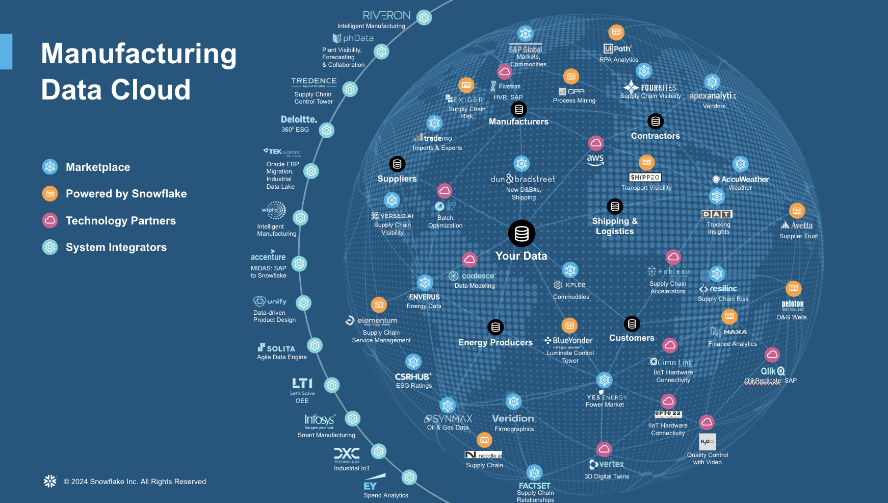
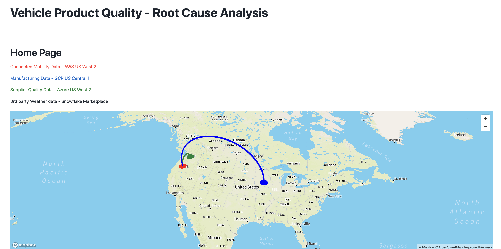
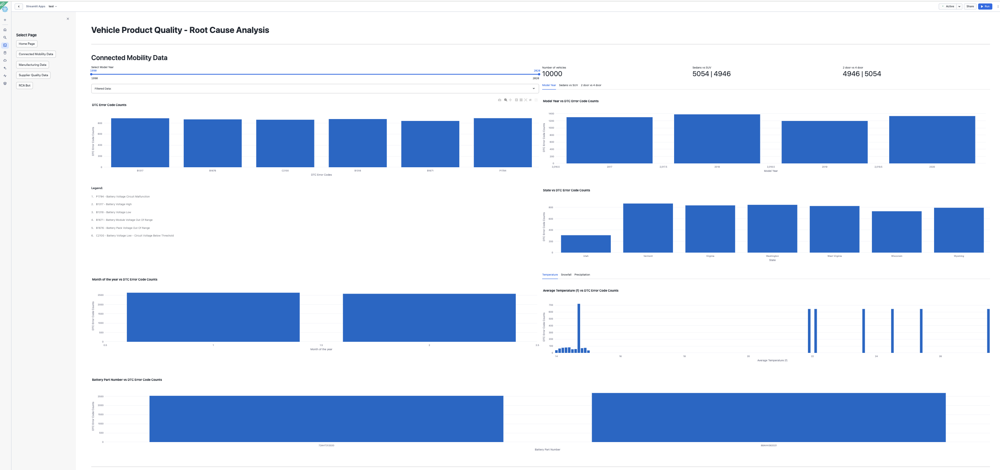
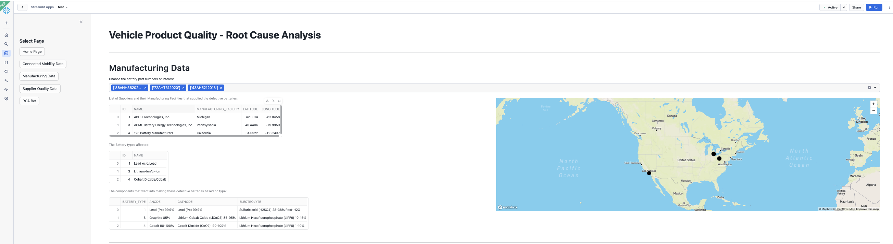
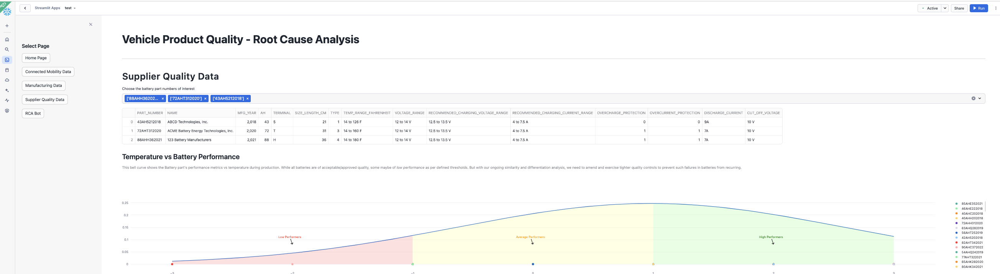
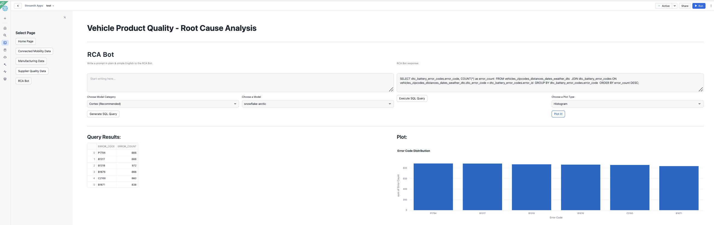

author: Kala Govindarajan
id: root-cause-analysis-for-vehicle-product-quality-with-snowflake
summary: 
categories: snowflake-site:taxonomy/solution-center/certification/quickstart, snowflake-site:taxonomy/product/ai, snowflake-site:taxonomy/industry/automotive
environments: web
language: en
status: Published 
feedback link: https://github.com/Snowflake-Labs/sfguides/issues
tags: Getting Started, Cortex, Data Science & Ai
fork repo link: https://github.com/Snowflake-Labs/sfguide-root-cause-analysis-for-vehicle-product-quality-with-snowflake


# Root Cause Analysis for Vehicle Product Quality with Snowflake
<!-- ------------------------ -->
## Overview 




In the automotive industry, OEMs often use a hybrid cloud strategy for data storage. For example, Connected Mobility data (vehicle and telematics) might reside in AWS's US-West-2 region, while parts manufacturing data is stored in GCP's US-Central-1. Additionally, Supplier Quality data could be hosted in yet another cloud or region, such as Azure US-West-2. This distribution is merely illustrative, emphasizing a strategy to avoid reliance on any single public cloud provider. However, this multi-cloud approach introduces several challenges, particularly for the customer. One notable challenge is conducting "Vehicle Quality Root Cause Analysis (RCA)."

Each vehicle generates extensive telemetry data from thousands of sensors, which the onboard diagnostics systems translate into Diagnostic Trouble Code (DTC) errors—alerts that appear on the dashboard as warnings. For this use case, an OEM begins with DTC error data as an entry point for Quality RCA. 


Here are some of the key questions that arise during this process:

Is this error code pointing towards a specific part? or is it affecting something fundamental?
Is this error code showing any pattern? Are all vehicles affected or a specific vehicle platform is affected?
What about a specific model year? or maybe a specific configuration within a platform such as sedan or suv?
Which regions are affected? All regions / specific regions?


In early 2023, Snowflake launched the Manufacturing Data Cloud to help customers simplify their data operations and management and unleash the power of AI to improve supply chain performance, power smart manufacturing, and implement quality control from connected products. Industry 4.0 technologies, including IIoT, machine learning, and advanced data analytics. One major challenge seen in Manufacturing operations is striving to deliver the highest quality during every stage of the production or assembly process. There is a strong desire to improve efficiency, accuracy, and consistency in identifying defects if any in the production process. By automating quality control, organizations aim to reduce human error, increase the speed of inspections, and ensure that products meet the desired standards.

The Cross-region data sharing from Snowflake offers a robust solution to the multi-cloud challenges by providing a unified, scalable, and secure data platform. By centralizing data storage and processing in Snowflake, OEMs can streamline the RCA process, enhance collaboration, and derive meaningful insights, ultimately leading to better decision-making and improved vehicle quality.


### Prerequisites
- A non-trial Snowflake account with access to a role that has the ACCOUNTADMIN role. If not, you will need to work with your admin to perform the initial environment setup.
- Git installed.

### What You’ll Learn 
- How to create an unified platform to carrry Vehicle Quality Root Cause Analysis
- How to perform advanced analytics with this centralized data to understand trends and patterns
- How to leverage Cortex AI to ask questions in Natural language against your data

### What You’ll Need 
- A [Snowflake](https://signup.snowflake.com/?utm_source=snowflake-devrel&utm_medium=developer-guides&utm_cta=developer-guides) account in a region where Snowflake Cortex and Arctic are available.
- Access to the ACCOUNTADMIN role. If not, you will need to work with your admin to perform the initial environment setup.
- Git installed.


### What You’ll Build 
- An integrated Data Platform to create an unified data layer that brings together data from various cloud platforms (e.g., AWS, GCP, Azure) where different types of vehicle-related data are stored.
- An Advanced Analytics Pipeline to reveal patterns and trends within the data, particularly focusing on Diagnostic Trouble Codes (DTC) and sensor data to proactively identify quality issues.
- Natural Language Querying Interface with Cortex AI to make data accessible and actionable by allowing end-users to ask questions in natural language.


<!-- ------------------------ -->
## Setup Environment

This section will walk you through creating various objects

#### High-Level Workflow


In a real-world situation with Snowflakes Data Sharing each of the data will be shared from a particular region and cloud provider. In this scenario for sake of simplicity we will assume the data is available in a single cloud provider, AWS S3 bucket. We will be downloading the data and storing in tables in a Snowflake account and use that for further analytics.

**Step 1**. - Clone [GitHub](https://github.com/Snowflake-Labs/sfguide-root-cause-analysis-for-vehicle-product-quality-with-snowflake) repository.

**Step 2**. - Run the code below code in Snowsight SQL Worksheet that sets up a database and warehouse.

Create a database that will be the centralized storage for all the sources of data.

```
USE ROLE SYSADMIN;
create database connected_mobility_rca;

CREATE OR REPLACE WAREHOUSE cnctd_mblty_wh WITH 
WAREHOUSE_TYPE = standard WAREHOUSE_SIZE = Medium
AUTO_SUSPEND = 5 AUTO_RESUME = True;
USE WAREHOUSE cnctd_mblty_wh;
```

Once the database and the warehouse are created, now let us proceed to the notebook execution where the data loading happens.


**Step 3**.
The Notebook is available to download from the [notebook](https://github.com/Snowflake-Labs/sfguide-root-cause-analysis-for-vehicle-product-quality-with-snowflake/tree/main/notebook) folder in the git repository.

Notebook Walkthrough : 

- First import essential packages are imported, including snowpark,streamlit and pandas for data handling.

- A Snowflake session is set up using get_active_session()

- In a SQL cell to create a CSVFORMAT file format and define an external stage named data_stage, which points to an S3 bucket containing CSV files. 

- The files corresponding to each feature is hosted in a single S3 Stage and we will fetch the data and load them into individual tables in Snowflake. In a real-world scenario, this will be hosted in different cloud providers in different regions.

- The directory table helps displaying the details about the files in the external stage for quick verification.
After verifying, for each CSV file (e.g., BATTERY_COMPONENTS.csv, BATTERY_SUPPLIER.csv), we then read the CSV and infer its schema.
Save the resulting DataFrame as a Snowflake table directly.

- You can choose to click Run All or run cell by cell in the notebook.

After successful completion of the data loading in the notebook, you are all set to carry advanced analytics in Streamlit in Snowflake App in next section.

<!-- ------------------------ -->
## Streamlit App

We will now build a quick multi-page Streamlit in Snowflake app. The app and necessary files are present in the cloned repository [streamlit folder](https://github.com/Snowflake-Labs/sfguide-root-cause-analysis-for-vehicle-product-quality-with-snowflake/tree/main/scripts/streamlit) in the git repository.

In a real-world scenario, the automobile organization ,supplier company and manufacturing company typically host their data in their own Snowflake accounts that is based on 3 different Cloud providers like AWS,Azure and GCP that is supported. 
We will carry the same assumption and the data and maps displyed in the apps will be in tune to that situation rather than the original data ingestion process which was based out of 1 cloud provider in 1 region.

### Homepage App

This page displays a map with the locations of data sources. It uses Pydeck for the visualization.



### Connected Mobility Data App



This page serves to display and analyze connected mobility data. Overall in this page the user can :

- Explore vehicle data, focusing on various aspects such as error codes, model years, and geographical locations.
- Fetch and display according to the filters on vehicle data, including various attributes like model year, vehicle configuration, and diagnostic trouble codes (DTC) are .

- Ability for the user to interact with the page through various controls, such as a slider to select the model year range. Based on the selected range, the data is filtered and displayed.

- Analyze additional metrics such as model year, vehicle configuration and others to mine trends and patterns.


### Manufacturing Data App



This page serves to display and analyze manufacturing data related to vehicle battery parts. This page provides insights into the suppliers, manufacturing facilities, battery types, and components involved in the production process. Let's break down its functionality:

- Provides the ability for the user to select battery part numbers of interest from a dropdown and analyze about battery part numbers, suppliers, types, and components.
- Analyze thelList of Suppliers and their Manufacturing Facilities that supplied the defective batteries.
- Visualize Supplier Locations on a map as scatter plot.
  
### Supplier Quality App




This page provides a detailed analysis of battery part numbers, their performance metrics, and the corresponding supplier information.  Let's break down its functionality:

- User can select battery part numbers of interest from a dropdown menu. fetch information about battery part numbers and their quality metrics.
- 
- Provide the ability to carry a comparative analysis by fetching data for all battery part numbers.
  
- A bell curve visualization is created to show the distribution of quality metrics against temperature. This helps in identifying performance issues related to specific battery parts.
  


### RCA Bot



This page provides a chat interface for users to input natural language queries and get corresponding SQL queries, which can then be executed to retrieve and visualize data. Here’s a detailed breakdown of its functionality:

- Leverage Cortex LLM Functions to perform text2sql. 

Some of the LLM options include:

- **snowflake-arctic**
- **mistral-large**
- **reka-flash**
- **mixtral-8x7b**
- **llama2-70b-chat**
- **mistral-7b**
- **gemma-7b**

- Users can input their queries in plain English, which will be converted into SQL queries by the chosen Cortex LLM upon clicking the "Generate SQL Query" button.
  
- Users can also plot the data for quick visualization 

<!-- ------------------------ -->
## Conclusion And Resources

Vehicle Quality Root Cause Analysis is a complex yet critical process for OEMs to ensure the reliability and safety of their vehicles. The Cross-region data sharing capability from Snowflake, offers a robust solution by providing a unified, scalable, and secure data platform. By centralizing data storage and processing in Snowflake, OEMs can streamline the RCA process, enhance collaboration, and derive meaningful insights, ultimately leading to better decision-making and improved vehicle quality.

### What You Learned
- How to create an unified platform to carrry Vehicle Quality Root Cause Analysis
- How to perform advanced analytics with this centralized data to understand trends and patterns
- How to leverage Cortex AI to ask questions in Natural language against your data


### Related Resources

- #### [Secure Data Sharing](https://docs.snowflake.com/en/user-guide/secure-data-sharing-across-regions-platforms)
- #### [Snowpark Cortex LLM](https://docs.snowflake.com/en/user-guide/snowflake-cortex/llm-functions)
