summary: Create predictive features with RudderStack and Snowflake without MLOps
id: rudderstack_predictions
categories: data-science-&-ai,Getting-Started
environments: web
status: Draft
feedback link: https://github.com/Snowflake-Labs/sfguides/issues
tags: Getting Started, Data Science, RudderStack, Machine Learning
author: RudderStack

# Build predictive features without MLOps using RudderStack and Snowflake
<!-- ------------------------ -->
## Overview
Duration: 1

Predictive features like future LTV and churn propensity can be game changing for a business. If your marketing, customer success, and other teams want to use them, though, your company often faces a binary choice: use a one-size-fits-all solution within an existing SaaS platform (i.e., marketing automation tool), or build out ML and MLOps capabilities internally.

Both options have significant drawbacks. First, templated SaaS-based solutions can't leverage all of your customer data and aren't configurable, which results in low accuracy and impact. On the other hand, hiring data scientists and setting up MLOps is expensive and complex.

Modern data teams need an option in the middle: the ability to deploy model templates on all of their customer data, but without additional tooling, processes and headcount.

With RudderStack Predictions and Snowflake, you can create predictive features directly in your warehouse, without the need to set up MLOps processes and infrastructure. Predictions leverages the full power of Snowpark to run ML models within your existing data engineering workflow.

In this quickstart we will go through the two ways you can build predictive features in RudderStack Predictions:

1. Set up automated features in the RudderStack UI
2. Code your own custom predictions

It's important to note that Predictions runs on top of RudderStack [Profiles](https://www.rudderstack.com/docs/profiles/overview/), a product that automates identity resolution and user feature development in Snowflake. 

Predictions leverages the Profiles identity graph to train and run ML models. Because Predictions is part of Profiles, project outputs include an identity graph, standard user featuers (i.e., `last_seen`) and predictive user features (i.e., `percentile_churn_score_30_days`). Both types of features are built using RudderStack data sources and standardized feature definitions.

For automated features, you perform the setup and run the jobs within the RudderStack UI. This process makes it easy for less technical users to implement basic predictive features. In this guide, we will show you how to set up an automated churn prediction feature.

Predictions also supports a code-based approach that gives technical users full control to define custom predictive features that match their unique business logic, which we will cover in the second part of the guide. 

<!-- ------------------------ -->
## Prerequisites
Duration: 10

For this quickstart you will need access to both RudderStack and Snowflake. If you do not have access, follow these links to create a free [RudderStack account](https://app.rudderstack.com/signup?type=freetrial) and [Snowflake account](https://signup.snowflake.com/).

Once you set up your RudderStack account, [reach out to our support team](mailto:support@rudderstack.com?subject=I%20would%20like%20access%20to%20your%20Predictions%20feature) to request access to our Predictions feature.

### Setting up Snowflake for Event Stream Data
Because Predictions is designed to run in a production environment, you need to perform some basic set up in Snowflake (and later, your RudderStack workspace) to simulate the pipelines you would run when collecting user event data. 

#### Create a New Role and User in Snowflake

In your Snowflake console, run the following commands to create the role `QUICKSTART`.

```sql
CREATE ROLE QUICKSTART;
```

Verify the role `QUICKSTART` was successfully created.

```sql
SHOW ROLES;
```

Create a new user QUICKSTART_USER with a password `<strong_unique_password>`.

```sql
CREATE USER QUICKSTART_USER PASSWORD = '<strong_unique_password>' DEFAULT_ROLE = 'QUICKSTART';
```

Verify the user `QUICKSTART_USER` was successfully created.

```sql
SHOW USERS;
```

#### Create RudderStack Schema and Grant Permissions to Role

Create a dedicated schema `_RUDDERSTACK` in your database.

**Replace `<YOUR_DATABASE>` in all queries with your actual database name.**

```sql
CREATE SCHEMA "<YOUR_DATABASE>"."_RUDDERSTACK";
```

Grant full access to the schema _RUDDERSTACK for the previously created role `QUICKSTART`.

```sql
GRANT ALL PRIVILEGES ON SCHEMA "<YOUR_DATABASE>"."_RUDDERSTACK" TO ROLE QUICKSTART;
```

#### Grant Permissions on the Warehouse, Database, Schema, and Table

Enable the user `QUICKSTART_USER` to perform all operations allowed for the role `QUICKSTART` (via the privileges granted to it).

```sql
GRANT ROLE QUICKSTART TO USER QUICKSTART_USER;
```

Run the following commands to allow the role `QUICKSTART` to look up the objects within your warehouse, database, schema, and the specific table or view:

```sql
GRANT USAGE ON WAREHOUSE "<YOUR_WAREHOUSE>" TO ROLE QUICKSTART;
GRANT USAGE ON DATABASE "<YOUR_DATABASE>" TO ROLE QUICKSTART;
GRANT USAGE ON SCHEMA "<YOUR_DATABASE>"."_RUDDERSTACK" TO ROLE QUICKSTART;
GRANT SELECT ON ALL TABLES IN SCHEMA "<YOUR_DATABASE>"."_RUDDERSTACK" TO ROLE  QUICKSTART;
GRANT SELECT ON FUTURE TABLES IN SCHEMA "<YOUR_DATABASE>"."_RUDDERSTACK" TO ROLE QUICKSTART;
GRANT SELECT ON ALL VIEWS IN SCHEMA "<YOUR_DATABASE>"."_RUDDERSTACK" TO ROLE QUICKSTART;
GRANT SELECT ON FUTURE VIEWS IN SCHEMA "<YOUR_DATABASE>"."_RUDDERSTACK" TO ROLE QUICKSTART;
```

**Replace `<YOUR_DATABASE>` with the exact Snowflake database name.**

### Importing RudderStack Event Data from the Snowflake Marketplace

To set up automated features, you will need RudderStack event data in your Snowflake warehouse. If you already use RudderStack and have the following tables (see below), you can skip to the [Profiles Schema and Permissions](#profiles-schema-and-permissions) section. For the purposes of following this guide, though, it is recommended that you use the provided sample data. 

- `TRACKS`
- `IDENTIFIES`
- `PAGES`
- `ORDER_COMPLETED`

#### Get Sample Data

If you are setting up RudderStack for the first time go to the [Snowflake Marketplace](https://app.snowflake.com/marketplace/listing/GZT0Z856CMJ/rudderstack-inc-rudderstack-event-data-for-quickstart) and add RudderStack Event Data for Quickstart to your Snowflake account for free. This will add a database with the needed tables to your Snowflake warehouse with no additional storage cost for you.

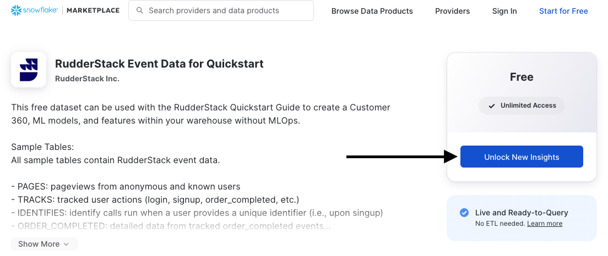

At the next screen open options and add role `QUICKSTART` to have access to this database.

#### Create Schema for Sample Data

The database with the sample data is read only so you will need to copy it to a new schema to be able to create a valid event stream pipeline (and run a Predictions job on the data). 

Create a new schema in the database you already set up. Name the schema "EVENTS".

```sql
CREATE SCHEMA "<YOUR_DATABASE>"."EVENTS";
```

Give permission to the `QUICKSTART` to create new tables in that schema.

```sql
GRANT ALL PRIVILEGES ON SCHEMA "<YOUR_DATABASE>"."EVENTS" FOR ROLE QUICKSTART;
```

Copy the sample data into the newly create schema.

```sql
CREATE TABLE "<YOUR_DATABASE>"."EVENTS"."TRACKS" AS SELECT * FROM "SNOWFLAKE_QUICKSTART"."PUBLIC"."TRACKS";
CREATE TABLE "<YOUR_DATABASE>"."EVENTS"."IDENTIFIES" AS SELECT * FROM "SNOWFLAKE_QUICKSTART"."PUBLIC"."IDENTIFIES";
CREATE TABLE "<YOUR_DATABASE>"."EVENTS"."PAGES" AS SELECT * FROM "SNOWFLAKE_QUICKSTART"."PUBLIC"."PAGES";
CREATE TABLE "<YOUR_DATABASE>"."EVENTS"."ORDER_COMPLETED" AS SELECT * FROM "SNOWFLAKE_QUICKSTART"."PUBLIC"."ORDER_COMPLETED";
```

Now you are ready to create a pipeline connection in RudderStack.

### Create JavaScript Source

RudderStack's Profiles and Predictions products require a warehouse destination with an active sync from a source (a data pipeline). Therefore we will create a JavaScript source that can send a test event to Snowflake.

After logging into RudderStack, navigate to the Directory from the sidebar on the left, then select the JavaScript source from the list of sources.

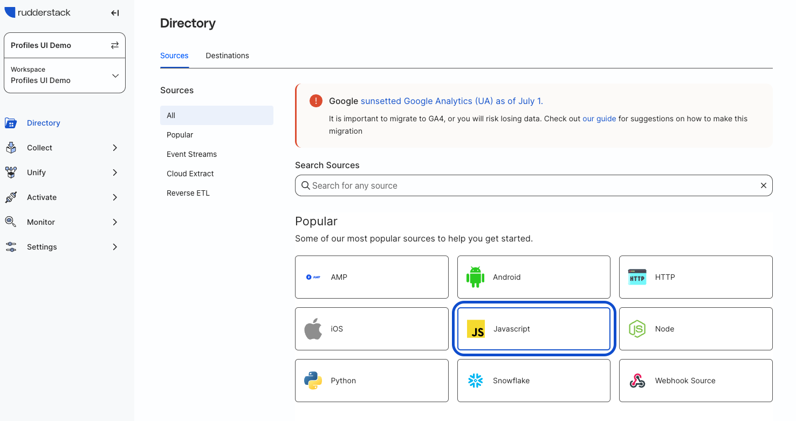

Enter "QuickStart Test Site" for the source name and click `Continue`. You have successfully added a source!

Note at the bottom of the JavaScript Source page is a `Write Key`. You will needs this for sending a test event after connecting the Snowflake destination.

### Create Snowflake Destination

Navigate to the "Overview" tab in the JavaScript source view and click on `Add Destination`.

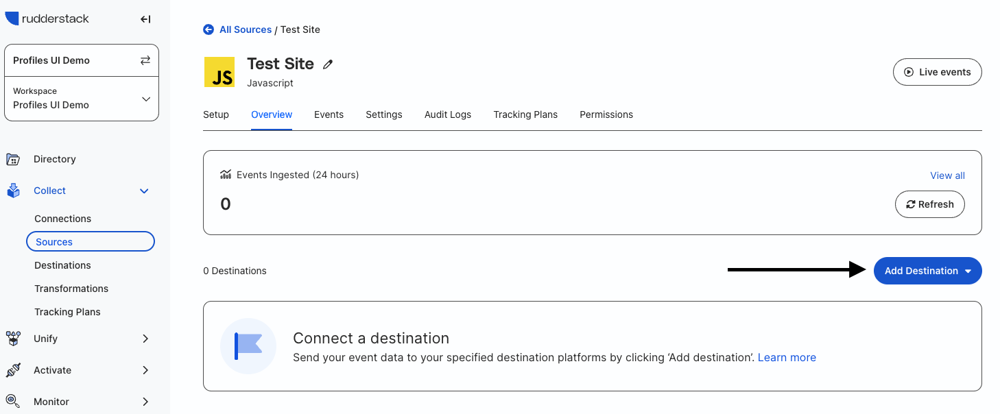

Select the Snowflake destination from the list, then on the next page give it the name "Snowflake QuickStart" and click `Continue`.

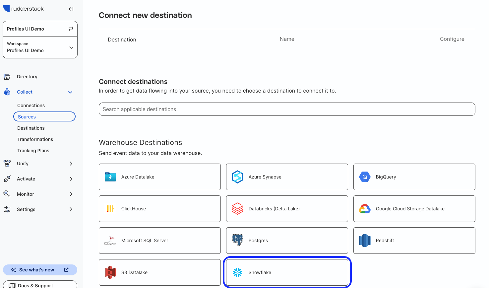

Add in your Snowflake connection credentials:

- **Account**: Your Account name
- **Database**: Your Database name that you used in the previous steps for `QUICKSTART`
- **Warehouse**: Your Warehouse that you granted usage to `QUICKSTART`
- **User**: `QUICKSTART_USER`
- **Role**: `QUICKSTART`
- **Password**: Password for `QUICKSTART_USER`
- **Namespace**: `EVENTS`

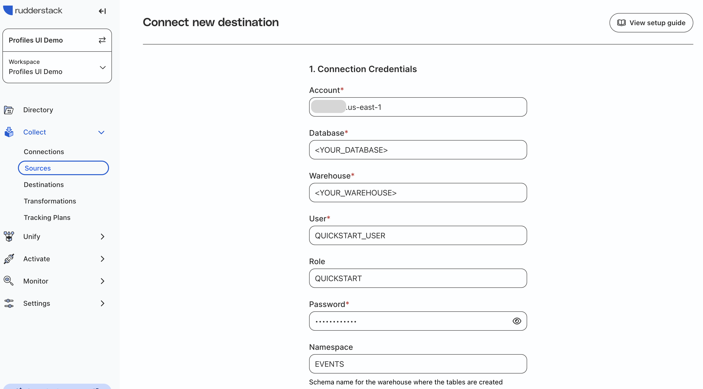

At the bottom under "Object Storage Configuration" toggle "Use RudderStack managed object storage" ON.

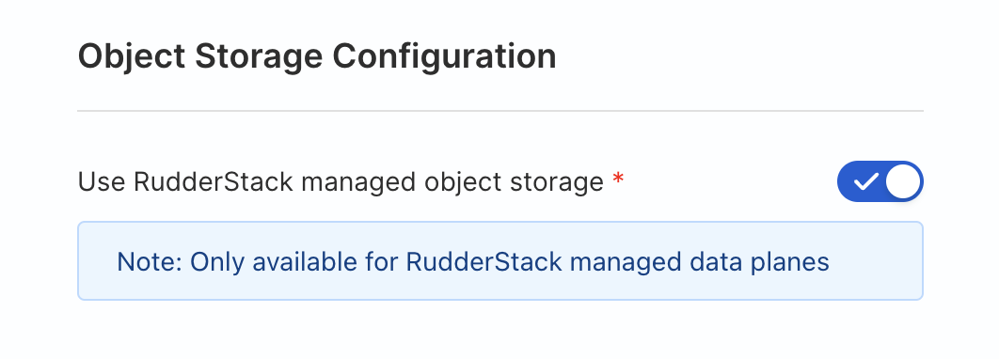

Leave the defaults for all other settings and click `Continue`. RudderStack will verify credentials and that it has the needed permissions.

You have now created a pipeline connection in RudderStack!

### Send Test Event

Now we are ready to send a test event.

We will use a test site to send a `connection_setup` event. This will not effect the sample data tables. But first we need to get a few pieces of configuration data from RudderStack:

- RudderStack Data Plane URL
- JavaScript Source Write Key

#### Data Plane URL

Go to the Connections page in the RudderStack app and copy the Data Plane URL at the top of the page.

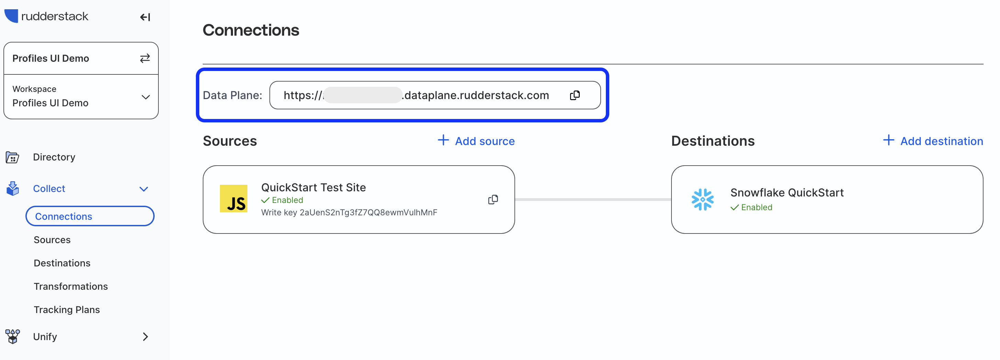

#### Write Key

Go into your JavaScript source in RudderStack and on the `Setup` tab scroll down and copy the write key.

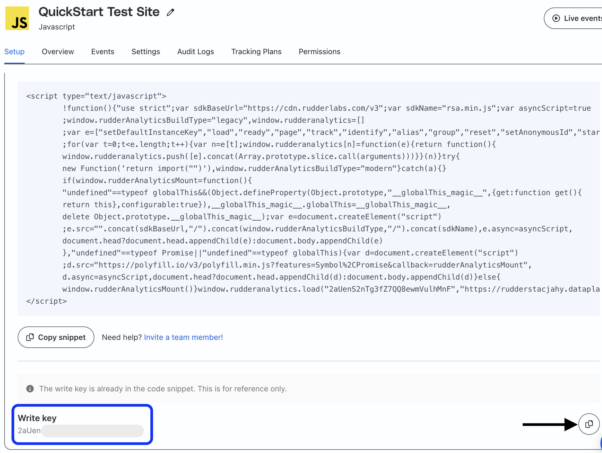

#### Test Event

Go to RudderStack's [test website](https://ryanmccrary.github.io/rudderstackdemo/) and copy your Data Plane URL and Write Key into the top fields and press `Submit`.

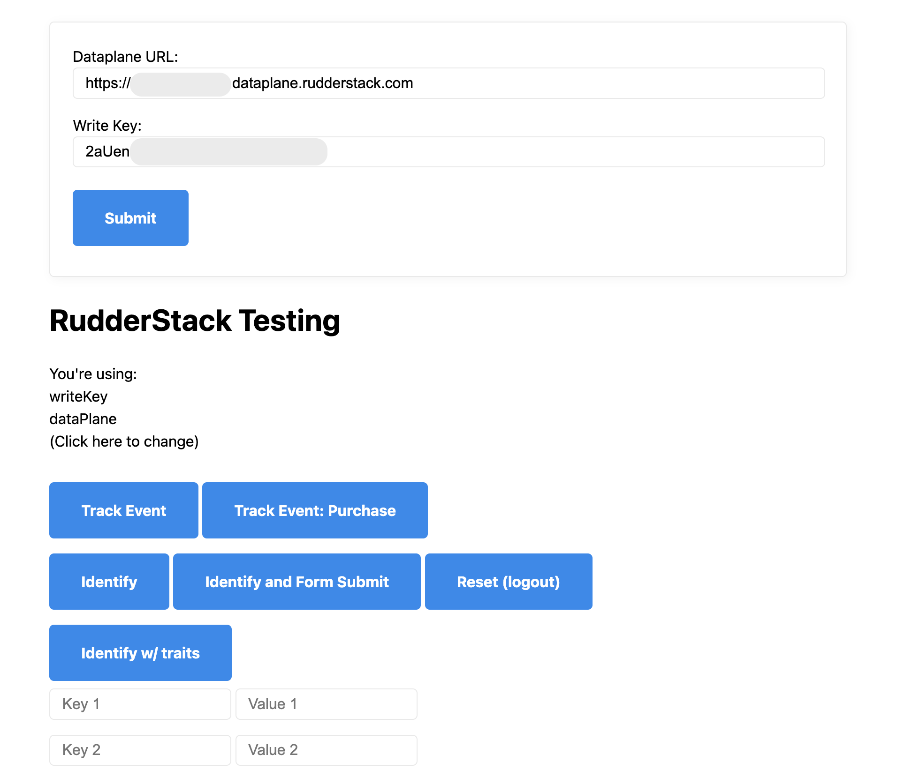

Enter `connection_setup` into the `event_name` field next to `Send Custom Event` and then click on `Send Custom Event`.

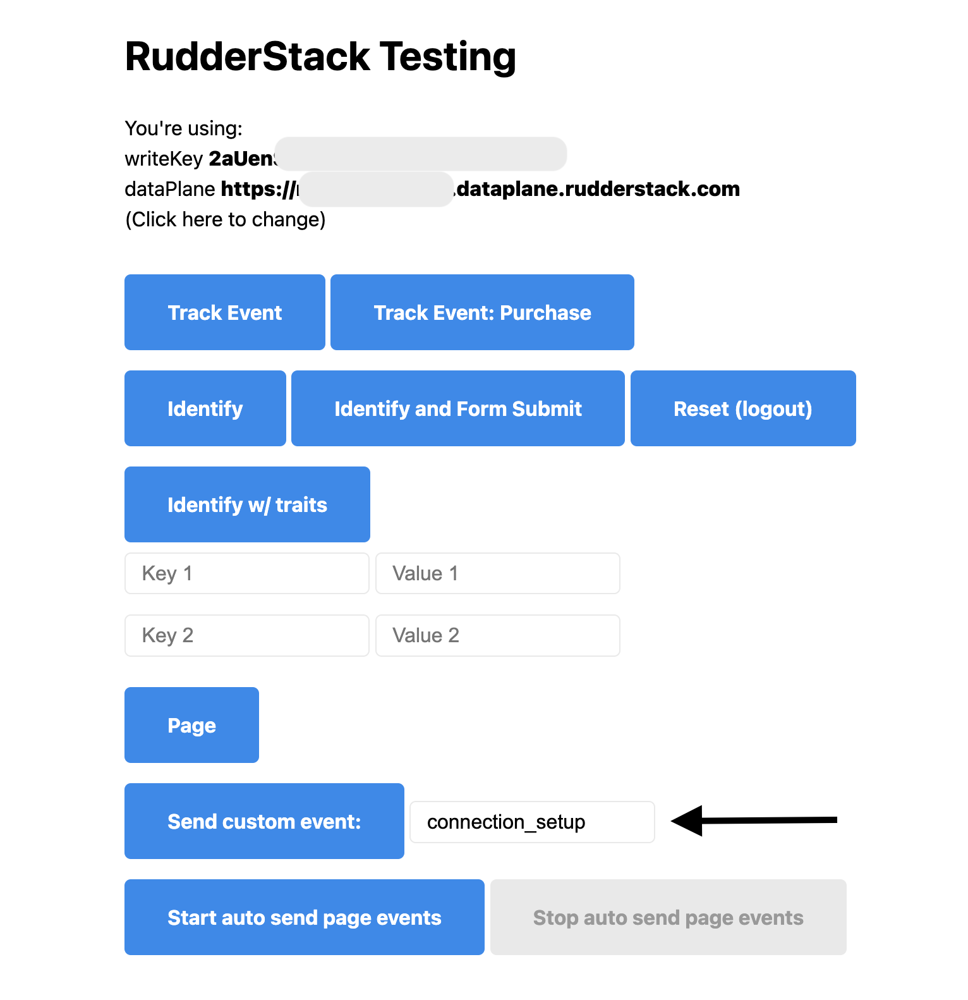

You can check the event using RudderStack's ["Live events" view](https://www.rudderstack.com/docs/dashboard-guides/live-events/) or check the `Syncs` tab in the Snowflake QuickStart destination.

**Note that the test event needs to be delivered to Snowflake to validate the pipeline.** If needed, you can run a manual sync by clicking "Sync now" in the Syncs tab of the Snowflake destination view in RudderStack. 

### Profiles Schema and Permissions

Remember that Predictions automatically runs a Profiles job to create an identity graph. In this step, we are going to create a new schema where the identity graph and the related tables and views will be generated. 

```SQL
CREATE SCHEMA "<YOUR_DATABASE>"."PROFILES";
```

Now we need to grant permissions to the `QUICKSTART` role.

Profiles will need the following permissions to run:

- Read access to all input tables to the model (already complete if you followed the previous setup steps)
- Write access to the schemas and common tables that the Profiles project creates.

For the write access run the following statements:

```sql
GRANT ALL PRIVILEGES ON SCHEMA PROFILES_QUICKSTART.PROFILES TO ROLE QUICKSTART;
GRANT SELECT ON ALL TABLES IN SCHEMA PROFILES_QUICKSTART.PROFILES TO ROLE QUICKSTART;
GRANT SELECT ON FUTURE TABLES IN SCHEMA PROFILES_QUICKSTART.PROFILES TO ROLE QUICKSTART;
GRANT SELECT ON ALL VIEWS IN SCHEMA PROFILES_QUICKSTART.PROFILES TO ROLE QUICKSTART;
GRANT SELECT ON FUTURE VIEWS IN SCHEMA PROFILES_QUICKSTART.PROFILES TO ROLE QUICKSTART;
```

You are now ready to run Profiles and Predictions projects in the RudderStack UI!

### Profiles CLI setup

Before you start building automated features, you need to perform some additional setup steps so that you can transition seamlessly from the UI-based workflow to the code-based workflow in the second part of the guide. 

To build custom features with code, you will need Python3 and the RudderStack Profiles CLI tool (`PB`, for Profiles Builder) installed on your machine. If you do not have `PB` installed, follow the instructions below. This includes authentication for your Snowflake environment. **Use the warehouse, database, and schema setup in the previous steps.** This authentication will be used for accessing your Snowflake warehouse and running Snowpark. For more information about Profiles CLI tool see [documentation](https://www.rudderstack.com/docs/profiles/get-started/profile-builder/).

#### Install Profile Builder Tool

Open a console window and install the Profile Builder `PB` tool.

```bash
pip3 install profiles-rudderstack
```

Check the version to make sure it is at least `0.10.5`

```bash
pb version
```

#### Install ML Dependency

In order to run ML models you will need the python package `profiles-multieventstream-features` installed. Run the following command to install it.

```bash
pip install git+https://github.com/rudderlabs/profiles-pycorelib
```

Now ensure you have the following python packages installed. These are required to use the `rudderstack-profiles-classifier` package to train classification models for predictive features.

```text
cachetools>=4.2.2
hyperopt>=0.2.7
joblib>=1.2.0
matplotlib>=3.7.1
seaborn>=0.12.0
numpy>=1.23.1
pandas>=1.4.3
PyYAML>=6.0.1
snowflake_connector_python>=3.1.0
snowflake-snowpark-python[pandas]>=0.10.0
scikit_learn>=1.1.1
scikit_plot>=0.3.7
shap>=0.41.0
platformdirs>=3.8.1
xgboost>=1.5.0
redshift-connector
```

#### Create Warehouse Connection

Initiate a warehouse connection:

```bash
pb init connection
```

Follow the prompts and enter the details for your Snowflake warehouse/database/schema/user.

```bash
Enter Connection Name: quickstart
Enter target:  (default:dev)  # Press enter, leaving it to default
Enter account: <YOUR_ACCOUNT>
Enter warehouse: <YOUR_WAREHOUSE>
Enter dbname: <YOUR_DATABASE>
Enter schema: PROFILES
Enter user: QUICKSTART_USER
Enter password: <password>
Enter role: QUICKSTART
Append to /Users/<user_name>/.pb/siteconfig.yaml? [y/N]
y
```

#### Enable ML Models

Finally we need to enable ML models within `siteconfig.yaml`.

Open the file `/Users/<user_name>/.pb/siteconfig.yaml` in a text editor.

At the bottom of the file there is a `py_models` section. Update it to look like this:

```yaml
py_models:
    enabled: true
    python_path: $(which python3)
    credentials_presets: null
    allowed_git_urls_regex: ""
```

### Snowpark

Predictive features utilizes Snowpark within your Snowflake environment. It uses the same authentication as Snowflake and is able to run jobs within Snowflake.

This will run python code in a virtual warehouse in Snowflake and will incur compute costs. These costs vary depending on the type of model and the quantity of data used in training and prediction. For more general information on Snowflake compute costs see [Understanding Compute Costs](https://docs.snowflake.com/en/user-guide/cost-understanding-compute).

<!-- ------------------------ -->
## Build Automated Features in the RudderStack UI - Setup
Duration: 5

Setting up automated features in the RudderStack UI is a straight-forward process. Predictive features are configured within a Profiles project and automatically added to the feature table output when the project is run.

Follow the steps below to set up a project and predictive features.

### Log into RudderStack

You can log-in [here](https://app.rudderstack.com/login).

### Navigate to Profiles Screen

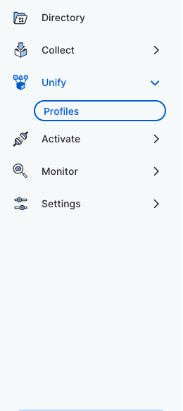

### Enter a Name and Description for the Profiles Project

Enter in a unique name and description for the Profiles Project where you will build your predictive features.


### Select Sources

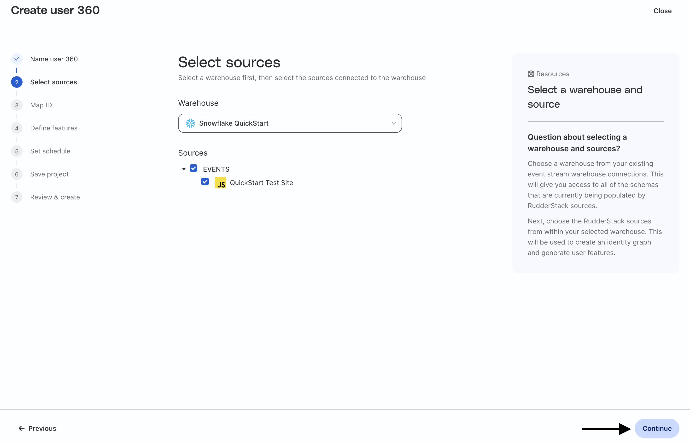

Select your Snowflake warehouse. If you do not have your Snowflake warehouse configured, please set up an event stream connection to Snowflake in RudderStack ([see details here](https://www.rudderstack.com/docs/destinations/warehouse-destinations/snowflake/)) and refer to the setup steps above.

Once you select your warehouse, you will be able to choose from RudderStack event sources that are connected to Snowflake. In this example, you can see that we are reading from JavaScript source we created. Because that source is writing to the same schema as the sample data, Profiles will use the `PAGES`, `TRACKS`, `IDENTIFIES`, and `ORDER_COMPLETED` tables from that schema to build automated and predictive features.

<!-- ------------------------ -->
## Map ID Fields
Duration: 5

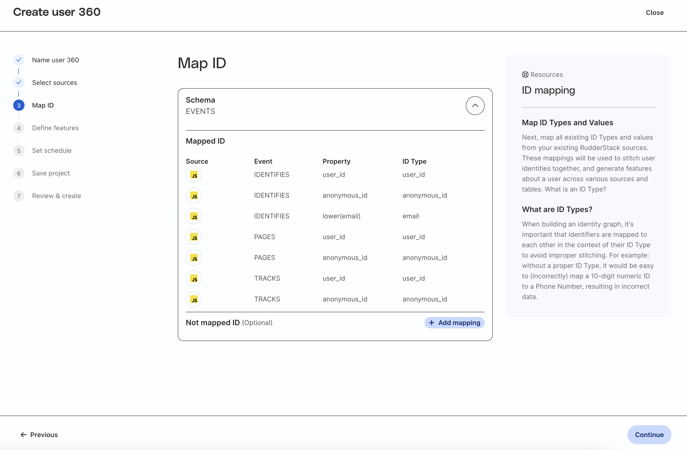

Map the fields from the source table(s) to the correct type of ID. The standard types of ID are:

- `user_id`
- `anonymous_id`
- `email`

**Note that for RudderStack event sources, standard ID column names will be mapped for you automatically**. If you have included additional identifiers in your payloads, you can map those custom column names to standard identifiers by clicking `Add mapping` at the bottom of the table.

### Map Order_Completed Table

Click on `Add mapping` and map the `USER_ID` and `ANONYMOUS_ID` columns to standard identifiers to include the `ORDER_COMPLETED` table as a source for the identity graph and user features. 

| Source | Event | Property | ID Type |
| ------ | ----- | -------- | ------- |
| QuickStart Test Site | ORDER_COMPLETED | USER_ID | user_id |
| QuickStart Test Site | ORDER_COMPLETED | ANONYMOUS_ID | anonymous_id |

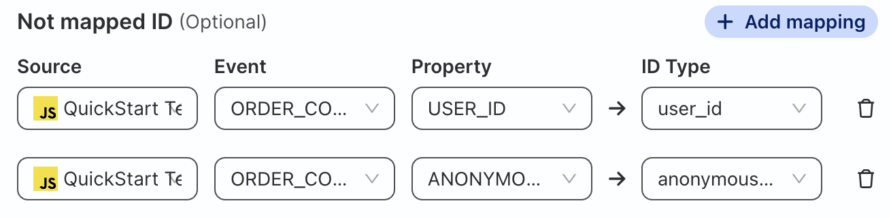

<!-- ------------------------ -->
## Create Default Features in the UI
Duration: 5

There are two types of automated features you can define in the UI:

1. Default features
2. Custom features

We will go over both types of features, but this guide will focus on the default features that are automatically generated.

### Setting up Default Features

Default features are features commonly used in Profiles projects. RudderStack provides a template library for these features to make them easy to add to your project. Templated features give you access to over 40 different standard and predictive features, which are generated in Snowflake automatically.

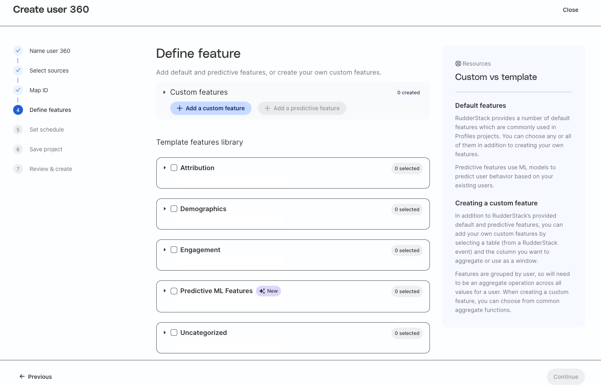

Default features are divided into 4 categories:

- **Attribution** - campaign, source, and churn features
- **Demographics** - user trait features
- **Engagement** - user activity features
- **Predictive ML Features** - predictive features

You can open the drop down menu for each category and select as many as you would like for your project.

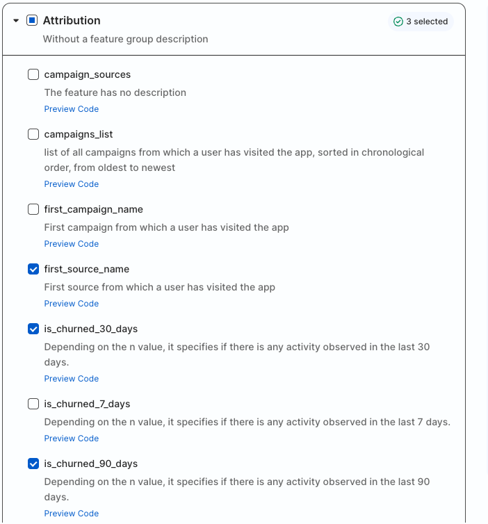

For this quickstart select:

- Attribution
  - `first_source_name`
  - `is_churned_30_days`
  - `is_churned_90_days`
- Demographics
  - `first_name`
  - `last_name`
  - `state`
- Engagement
  - `first_date_seen`
  - `last_date_seen`
  - `total_sessions_90_days`
  - `total_sessions_last_week`
- Predictive ML Features
  - `percentile_churn_score_30_days`

It is important to remember that RudderStack runs all of the feature-generation code transparently in Snowflake. For any of the default features, other than Predictive ML Features, you can click on `Preview Code` and get a yaml code snippet defining that feature (the yaml definition is used to generate SQL). This is helpful for technical users who want a deeper understanding of feature logic (and a running start for coding their own features).

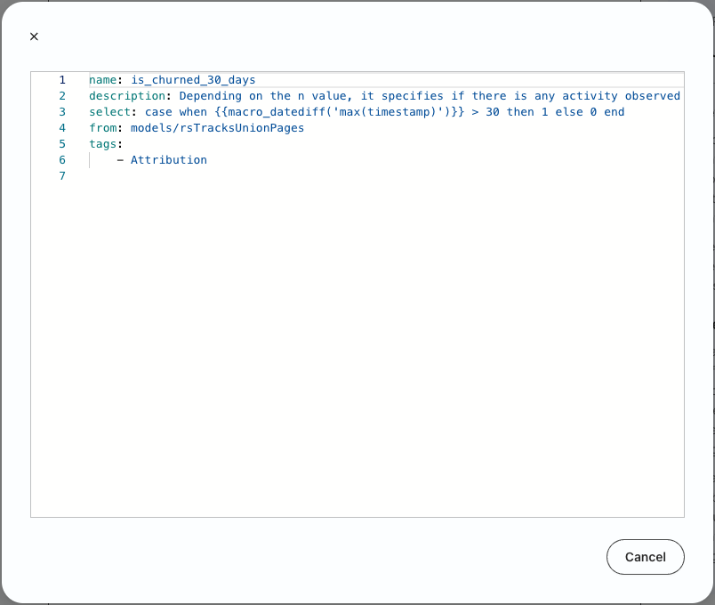

#### Churn definition

RudderStack Predictions automatically generates a binary churn value for every user based on inactivity over a 7, 30, or 90-day period.

For example, to calculate the `is_churned_7_days` value, RudderStack looks for any activity timestamp for a particular user in the `TRACKS` and `PAGES` tables  over the previous 7 day period. Practically, this means that RudderStack executes a 'max timestamp' query against those tables to see if users have viewed a page or performed other tracked actions (like clicks, form submits, add to carts, etc.) and then calculates the difference from today. If the query returns 7 or more, that means they haven't performed any activity over the last 7 days and their `is_churned_7_days` trait is set to `1`.

#### How Predictions models percentile churn scores

Using the standard definition (no activity over a defined period), RudderStack Predictions automatically runs a python-based churn model in Snowpark that predicts whether users will become inactive (churn) over the next 7, 30, or 90-day period. This model is trained on existing user data, using the Profiles identity graph, so it is recommended that you have a minimum of 5,000-10,000 unique users to achieve accurate output for business use cases.

**How Predictions automates ML with Snowpark**

Predictions streamlines integration with Snowpark by using the authentication from your existing Snowflake integration in RudderStack.

In order to run models in Snowpark, there is one additional set of permissions required. To run Predictions jobs, you must have permission to create stages within your schema. For more information see the `CREATE STAGE` [documentation](https://docs.snowflake.com/en/sql-reference/sql/create-stage#access-control-requirements).

Once permissions are granted, you will be able to run jobs that produce predictive features. **If you followed the steps in Prerequisites that permission has already been granted.**

<!-- ------------------------ -->
## Create Custom Features in the UI
Duration: 5

If a needed feature is not in the template library, you can define a custom feature in the UI. Custom features can be standard or predictive features.

### Add Custom Features

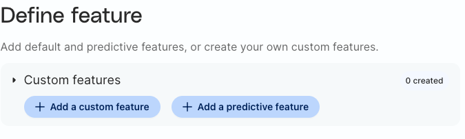

Click on `Add a custom feature` at the top of the page.

We will build an `average_order` feature with the following values:

| Field | Value |
| ---- | ---- |
| **Name** | average_order |
| **Description** | Average Order Size including shipping, taxes, and discounts |
| **Function Type** | AGGREGATE |
| **Function** | AVG |
| **Event** | EVENTS.ORDER_COMPLETED |
| **Property or Trait** | TOTAL |

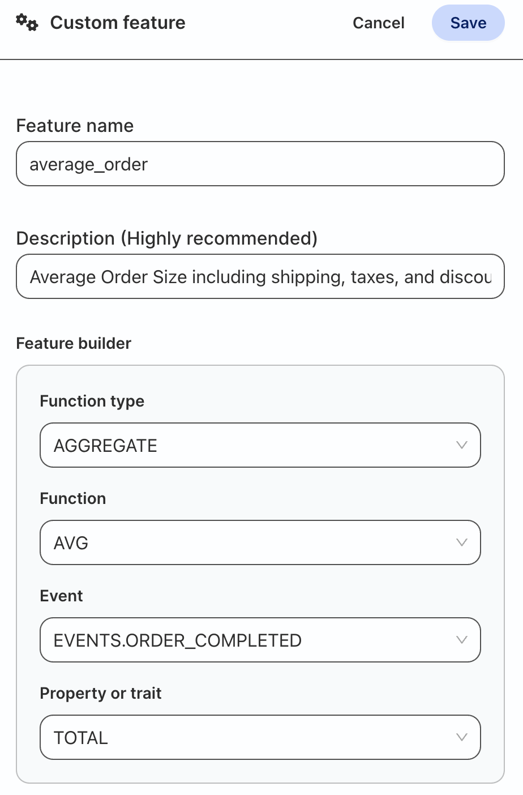

Once complete click `Save`. The custom feature will be added to the top of the page.

<!-- ------------------------ -->
## Set Schedule
Duration: 5

There are three options to set a schedule for how often the feature generation job runs:

- Basic
- Cron
- Manual

### Basic

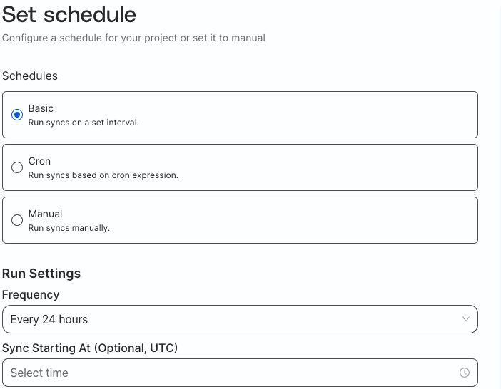

Schedule on a predetermined interval.

The frequency can be every:

- 30 minutes
- 1 hour
- 3 hours
- 6 hours
- 12 hours
- 24 hours

Then select a starting time for the initial sync

### Cron

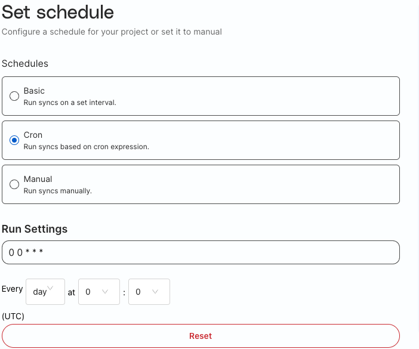

Schedule using cron expressions for more specific scheduling (i.e. Daily on Tuesdays and Thursdays).

If you are not familiar with cron expressions you can use the builder in the UI.

### Manual

Only run when manually triggered within the UI.

For this guide, select Manual.

<!-- ------------------------ -->
## Save, Review, and Create Project
Duration: 3

### Save Project

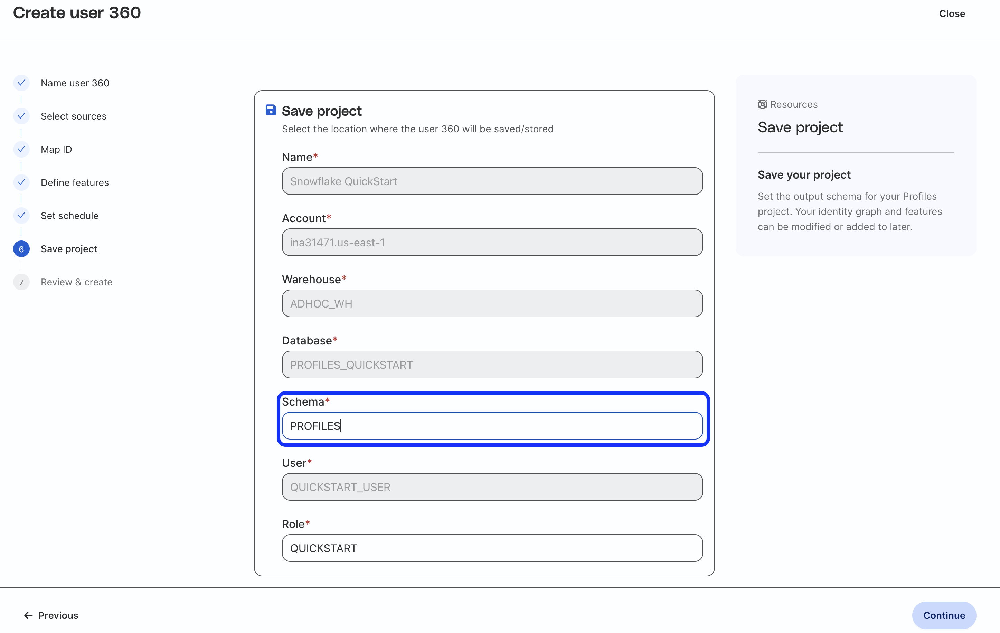

Fill in the Schema field with `PROFILES` (to match what we created earlier). This is where the feature table will be written to in Snowflake.

### Review and Create Project

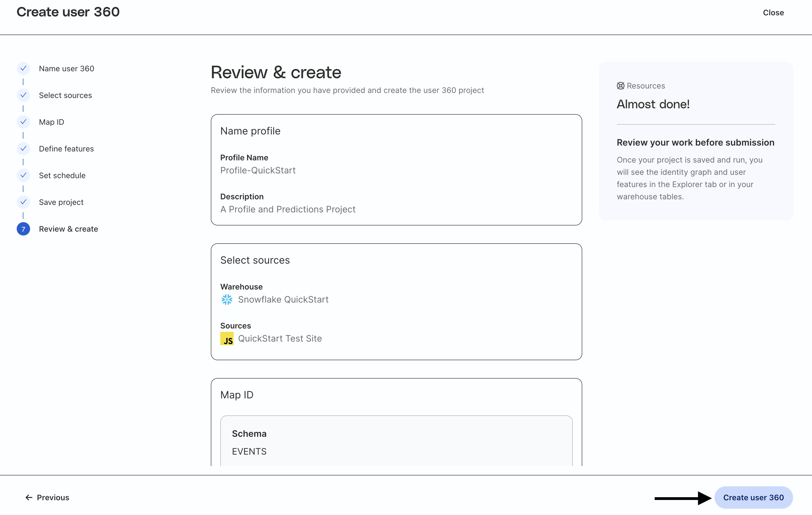

Finally review all the settings and when ready click `Create user 360`.

<!-- ------------------------ -->
## Review Created Features
Duration: 5

Once the initial project run is initiated, it may take up to 25-30 minutes to complete. Once the job is done, you are able to explore the data in RudderStack's UI, including model fit charts for predictive features and individual user records with all features.


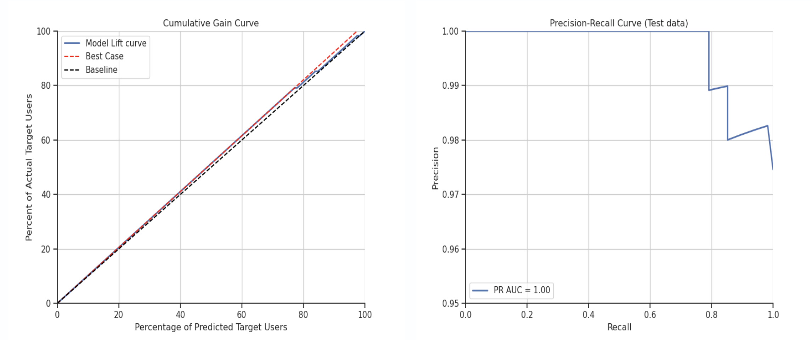
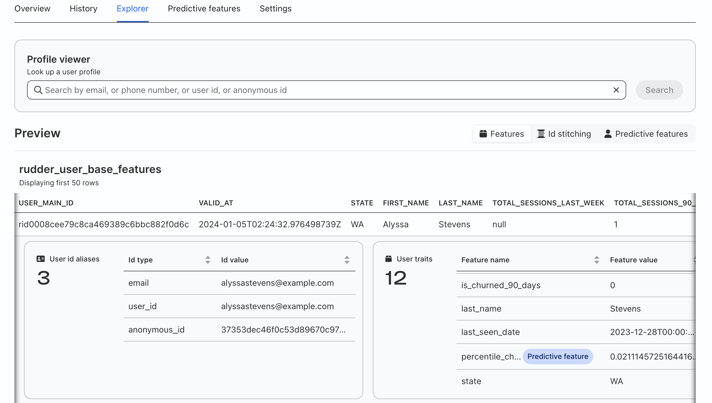

<!-- ------------------------ -->
## Code Your Own Custom Predictive Features
Duration: 15

### Use Case

While automated features are incredibly useful for quickly deploying activity-based churn scores, data teams inevitably want to go deeper and define custom predictions that match their unique business logic and KPIs.

Basic customization is possible in the UI as we covered above, but Predictions also supports a code-based workflow that gives technical users full control and complete customizability, as well as the ability to integrate the process into their existing development workflow.

For example, if you are an eCommerce company, it can be helpful to predict whether or not a user will make a purchase over a certain dollar amount, over the next `n` days.

RudderStack makes it easy to migrate from the UI-based workflow to the code-based workflow to build these more complex use cases. 

### Download Project Files

On the Profiles screen, find your project and click the "Download this Project" button in the upper right. This will download all the files for that Profiles project in a compressed (zip) file including the modeling files.

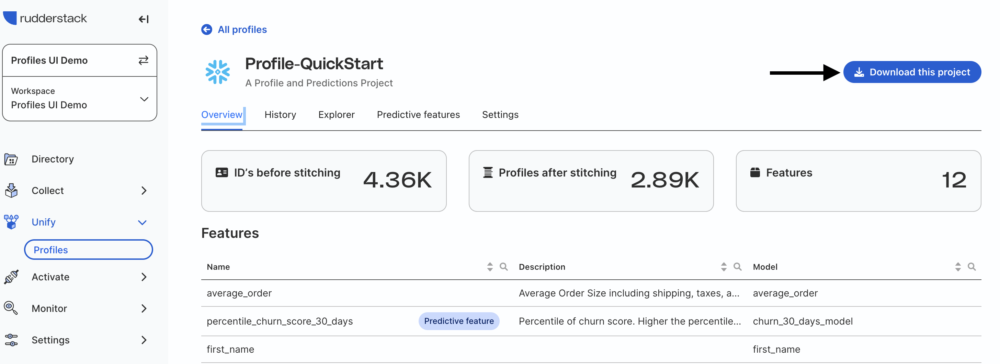

Inside the Profiles folder you will find `pb_project.yaml` and a `models` folder with `resources.yaml`.

```text
RudderStack QuickStart
├── pb_project.yaml
├── models
│   ├── resources.yaml
```

### pb_project.yaml

`pb_project.yaml` is the main configuration file for the Profiles project. The top section defines the `name`, `schema_version`, `connection`, and `model_folder` (where the files that define the details of the Profiles project can be found).

We need to update two of the values:

- `name` to `Profile-Quickstart` to match the name in the UI.
- `connection` to `QUICKSTART` to match the database connection we made in the Prerequisites section.

```yaml
name: Profile-QuickStart
schema_version: 49 # Or most recent version
connection: QUICKSTART
model_folders:
    - models
```

Below there is an `entities` section that defines our entities and what kinds of ID's make up that entity. An entity is a business concept or unit that will be used to build the identity graph and features. Projects can contain multiple entities like user, household, and organization.

For this project we have one entity called `user` with 5 different types of IDs. An ID type maps which ID fields can be joined together. For example if you have two tables with `user_id` columns called `id` and `userid`, by giving each the type `user_id` Profiles knows to join those tables on those columns.

These were the types that we mapped our ID fields to in the UI. Nothing needs to be updated in this section.

```yaml
entities:
    - name: user
      serve_traits:
        - id_served: user_id
        - id_served: anonymous_id
        - id_served: email
        - id_served: cart_token
        - id_served: user_main_id
```

Finally there is a `packages` section. This section allows you to import a Profiles project from GitHub and use the feature definitions from that project in this one. The project we are importing provides the definitions for the standard features we selected in the UI. Nothing needs to be updated in this section.

```yaml
packages:
    - name: base_features
      url: https://github.com/rudderlabs/rudderstack-profiles-multieventstream-features
      inputsMap: # These are the tables automatically mapping in the UI (TRACKS, PAGES, IDENTIFIES)
        rsIdentifies_1: inputs/rsIdentifies_1
        rsIdentifies_2: nil
        rsIdentifies_3: nil
        rsPages_1: inputs/rsPages_1
        rsPages_2: nil
        rsPages_3: nil
        rsTracks_1: inputs/rsTracks_1
        rsTracks_2: nil
        rsTracks_3: nil
      overrides: # By default all features are imported from the project, therefore the features we did not select need to be disabled
        - requested_enable_status: disabled
          models:
            - entity/user/active_days_in_past_365_days
            - entity/user/active_days_in_past_7_days
            - entity/user/avg_session_length_in_sec_365_days
            - entity/user/avg_session_length_in_sec_last_week
            - entity/user/avg_session_length_in_sec_overall
            - entity/user/campaign_sources
            - entity/user/campaigns_list
            - models/churn_7_days_model
            - models/churn_90_days_model
            - entity/user/country
            - entity/user/currency
            - entity/user/days_since_account_creation
            - entity/user/days_since_last_seen
            - entity/user/first_campaign_name
            - entity/user/is_churned_7_days
            - entity/user/last_campaign_name
            - entity/user/last_source_name
            - entity/user/max_timestamp_bw_tracks_pages
            - entity/user/mediums_list
            - entity/user/sources_list
            - entity/user/total_sessions_365_days
            - entity/user/total_sessions_till_date
```

### resource.yaml

`resources.yaml` contains two main sections: `inputs` and `var_groups`.

The `inputs` section defines what ID's are in each table and their mapping. Currently these are all the tables and mappings that were defined in the UI. These tables are used for creating an identity graph and all features related to it.

If you wanted to add another table in the future, the table and ID mappings would be added here. Below is an example of what it looks like using the `ORDER_COMPLETED` table we manually mapped in the UI. It consists of the following fields:

| Field | Description |
| ----- | ---------- |
| name  | alias for the table; the primary reference in the rest of the yaml files |
| table | `<SCHEMA>.<TABLE_NAME>` |
| select | column with ID |
| type | what kind of ID it is |
| entity | what entity the id should be mapped to |
| to_default_stitcher | `true` unless you decide you use a different ID stitcher |
| remapping | leave as `null` |

```yaml
- name: rs_EVENTS_ORDER_COMPLETED
  app_defaults:
    table: EVENTS.ORDER_COMPLETED
    ids:
        - select: USER_ID
          type: user_id
          entity: user
          to_default_stitcher: true
        - select: ANONYMOUS_ID
          type: anonymous_id
          entity: user
          to_default_stitcher: true
  remapping: null
```

The `var_groups` section is where custom features are defined, both custom features created in the UI and those added via code in this file. Custom features are organized into groups by entity (in our case only `user`). The entity is like the `group by` variable in a SQL query.

Below that custom features are defined in the `vars` subsection. Here is the `average_order` feature we created in the UI.

```yaml
- entity_var:
    is_feature: true
    name: average_order
    description: Average Order Size including shipping, taxes, and discounts
    select: AVG(TOTAL)
    from: inputs/rs_EVENTS_ORDER_COMPLETED

```

A name and description are need for the custom feature and then it is defined using declarative SQL syntax. This allows you to define the custom feature the same way you would if creating a new table with SQL.

### Creating a Custom Predictive Feature

Just like in the UI workflow, you must already have defined the feature you want to predict. Therefore we are going to add a new custom feature for large purchases in the last 90 days. **NOTE: currently predictive features can only be binary (i.e. 1/0)**

We will define a large order as any order with a `TOTAL` of > $100.

At the bottom of the `resources.yaml` add the name and definition for `large_purchase_last_90`.

```yaml
- entity_var:
  name: large_purchase_last_90
  description: Customer that made a purchase of >$100 in the last 90 days.
  select: CASE WHEN MAX(TOTAL) > 100 THEN 1 ELSE 0 END
  from: inputs/re_EVENTS_ORDER_COMPLETED
  where: DATEDIFF(days, TIMESTAMP, CURRENT_DATE) <= 90
```

You will notice that we are able to use SQL functions and key words in our definition. Specifically we are using a `CASE` statement in the select statement and are able to add a `where` statement and use the `DATEDIFF` function. We also used the alias for the `ORDER_COMPLETED` table in the `from` statement.

For more details on Profiles and project file structure, you can review the Profiles [documentation](https://www.rudderstack.com/docs/profiles/overview/).

### Organize the Project into Two Files (**OPTIONAL**)

Profiles does not need specific yaml files in the `models` folder in order to run. That allows you to organize your code as you feels is best. You can keep it all in one file or you can split it over multiple files.

We are going to split the `resources.yaml` file into `inputs.yaml` and `profiles.yaml`. Create the two yaml files. Then copy everything in the `inputs` section into `inputs.yaml` and `var_groups` into `profiles.yaml`.

Once you are done you can delete `resources.yaml`.

### Adding a Custom Predictive Feature

Now we are going to create 2 new custom predictive features from `large_purchase_last_90` called `likelihood_large_purchase_90` (raw score) and `percentile_large_purchase_90`(percentile score).

#### Add Python ML Requirement

In order to add custom predictive features we need to add the `profiles-pycorelib` package to our project requirements. At the bottom of `pb_project.yaml` add the following code to `pb_project.yaml`.

```yaml
python_requirements:
  - profiles-pycorelib==0.2.1
```

#### Create ml_models.yaml

Now we need to create a new file and name it `ml_models.yaml`. This file is where we will define our 2 new custom predictive features and how the ML model will be trained. The code for our new predictive features is below. We will go over the general structure, but details can be found in the comments in the code.

This file is organized by the predictive model created for predictive features, not the individual features. The top level consists of:

| Field/Section | Description |
| ------| ----------- |
| `name` | Name of the model (not feature) |
| `model_type` | `python_model`
| `model_spec` | All of the model specifications |

----

`model_spec` sections:

| Section | Description |
| ---- | ----------- |
| `train` | training configuration |
| `predict` | scoring configuration |

```yaml
models:
    - name: &model_name large_purchase_90_model
      model_type: python_model
      model_spec:
        occurred_at_col: insert_ts
        entity_key: user
        validity_time: 24h
        py_repo_url: git@github.com:rudderlabs/rudderstack-profiles-classifier.git # Model training and scoring repo

        train:
          file_extension: .json
          file_validity: 2160h # 90 days; when the model will be retrained
          inputs: &inputs
            - packages/base_features/models/rudder_user_base_features # location of the base features created in the UI
            - packages/large_purchase_last_90 # custom feature created in var_groups
            - models/average_order # custom feature we created in the UI
          config:
            data: &model_data_config
              package_name: feature_table
              label_column: large_purchase_last_90 # target feature
              label_value: 1 # target feature value predicting
              prediction_horizon_days: 90 # how far into the future
              features_profiles_model:  'rudder_user_base_features' #taken from inputs
              output_profiles_ml_model: *model_name
              eligible_users: 'large_purchase_last_90 is not null' # limit training data to those with non-null values
              inputs: *inputs
            preprocessing: &model_prep_config
              ignore_features: [first_name, last_name, state] # features we do not used in a model

        predict:
          inputs: *inputs # copy from train
          config:
            data: *model_data_config # copy from train
            preprocessing: *model_prep_config # copy from train
            outputs:
              column_names:
                percentile: &percentile percentile_large_purchase_90 # name of percentile feature
                score: &raw_score likelihood_large_purchase_90 # name of raw likelihood feature
              feature_meta_data: &feature_meta_data
                features:
                  - name: *percentile
                    description: 'Percentile of likelihood score. Higher the score the more likely to make a larger purchase'
                  - name: *raw_score
                    description: 'Raw likelihood score. Higher the score the more likely to make a larger purchase'

        <<: *feature_meta_data
```

### Compile and Run

Save all files. Now compile the project, this will make sure all SQL and python files are able to be created.

```bash
pb compile
```

Finally we will run the project. This will generate the same files as `compile` and then execute them in Snowflake. The first run can take at least 30 minutes because of training ML models.

```bash
pb run
```

<!-- ------------------------ -->
## Final Table
Duration: 1

The final predictive features can be found in your Snowflake environment together in the same table. The table will provide you with the unified user id, created by RudderStack, when the features are valid as of (i.e. when the model was last run to create these features), and model ID, and your predictive features.

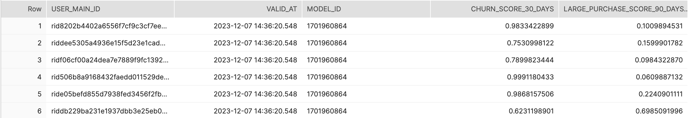

<!-- ------------------------ -->
## Conclusion
Duration: 1

In this quickstart we created a project that leveraged RudderStack data and the power of Snowpark to generate predictive features directly in the Snowflake environment.

All of this was accomplished without any additional MLOps infrastructure. Being able to create predictive features in a warehouse environment opens up ML modeling to Data Engineers, Analytical Engineers, and Data Analysts. It also allows businesses to significantly cut the time to data activation and positive ROI.
