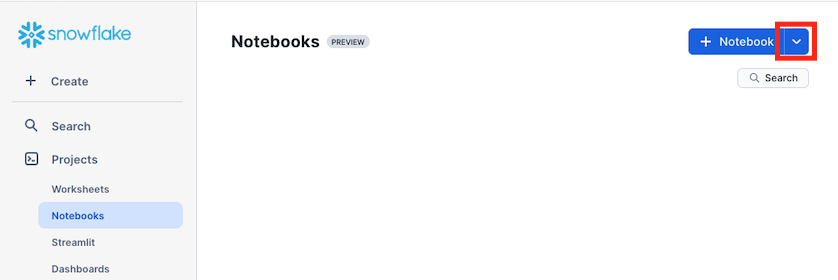
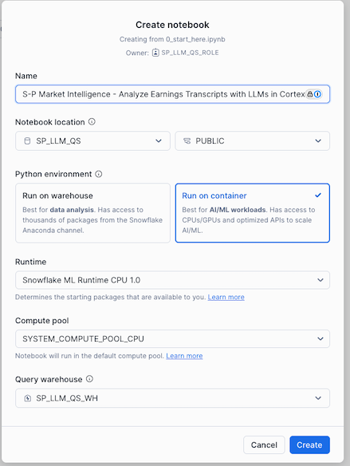

author: Mats Stellwall, Henry Chiang
id: s-and-p-market-intelligence-analyze-earnings-transcripts-in-cortex-ai
categories: snowflake-site:taxonomy/solution-center/certification/quickstart, snowflake-site:taxonomy/product/data-engineering, snowflake-site:taxonomy/snowflake-feature/transformation
language: en
summary: This guide will provide step-by-step details for building a data engineering pipeline with pandas on Snowflake 
environments: web
status: Published 
feedback link: https://github.com/Snowflake-Labs/sfguides/issues
fork repo link: https://github.com/Snowflake-Labs/sfguide-s-and-p-market-intelligence-analyze-earnings-transcripts-in-cortex-ai


# S&P Market Intelligence: Analyze Earnings Transcripts with LLMs in Cortex AI
<!-- ------------------------ -->
## Overview 
Earnings calls play a pivotal role in shaping investor perceptions. The quality of communication between executives and analysts can significantly influence company performance. On-topic and proactive executives, who deliver proactive presentations, anticipate market queries, and provide clear, on-topic answers to analysts’ questions—consistently outperform their peers. Conversely, off-topic and reactive executives, who fail to address analysts’ key inquiries during presentations, and provide off-topic responses—significantly underperform.

Executives' ability to anticipate investor concerns and maintain a focused dialogue fosters confidence and strategic communication. In contrast, failing to provide clarity when analysts seek additional information can lead to misalignment and breakdowns in transparency. A long (short) portfolio of on-topic and proactive (off-topic and reactive) generates +515bps of annualized alpha.

This QuickStart with its notebook serves as a introduction for the research detailed in Quantitative Research & Solutions’ recent publication, ["Questioning the Answers: LLM's enter the Boardroom."](https://www.spglobal.com/market-intelligence/en/news-insights/research/questioning-the-answers-llms-enter-the-boardroom) It analyses executive on-topicness and proactiveness using the analysts questions, executives answers and LLM answers. This research harnesses alpha using LLM tools, including vector embeddings, vector cosine similarity, and the LLM question answering. There is a longer version available upon request that also covers how to create the input data from the datasets described in section 2, please reach out to <QRS@spglobal.com> for access to the longer version.

Through this QuickStart, you will learn how to use [Snowflake Notebooks](https://docs.snowflake.com/user-guide/ui-snowsight/notebooks) and [Snowflake Cortex LLM functions](https://docs.snowflake.com/en/user-guide/snowflake-cortex/llm-functions) on earnings call using the [Machine Readable Transcripts](https://app.snowflake.com/marketplace/listing/GZT0Z8P3D2V/s-p-global-market-intelligence-machine-readable-transcripts) dataset from S&P Global Market Intelligence.

### What You’ll Learn

* how to use Snowflake Notebooks
* how to create and use vector embeddings on text data
* how to compare vector embeddings using similarity functions
* how to use generate prompts based on data and use it with Cortex COMPLETE

### What is Snowflake Cortex?

Snowflake Cortex is an intelligent, fully managed service that offers machine learning and AI solutions to Snowflake users. Snowflake Cortex capabilities include:

LLM Functions: SQL and Python functions that leverage large language models (LLMs) for understanding, querying, translating, summarizing, and generating free-form text.

ML Functions: SQL functions that perform predictive analysis such as forecasting and anomaly detection using machine learning to help you gain insights into your structured data and accelerate everyday analytics.

Learn more about [Snowflake Cortex](https://docs.snowflake.com/guides-overview-ai-features). 

### S&P Global Market Intelligence datasets

The ["Questioning the Answers: LLM's enter the Boardroom."](https://www.spglobal.com/market-intelligence/en/news-insights/research/questioning-the-answers-llms-enter-the-boardroom) research is using the datasets below from the Snowflake Marketplace. Access to those are not necessary for running this QuickStart, where we are using a sample dataset.

To reproduce the full research using the complete datasets then request access to those below using the links or contact <SnowflakeMarketplace@spglobal.com>.

|Name|Description |
|----|----|
|[ S&P Capital IQ Financials](https://app.snowflake.com/marketplace/listing/GZT0Z8P3D2N/s-p-global-market-intelligence-s-p-capital-iq-financials)|S&P Capital IQ Financials provides global standardized financial statement data for over 180,000 companies, including over 95,000 active and inactive public companies, and As Reported data for over 150,000 companies. S&P Capital IQ Standardized Financials allows you to extend the scope of your historical analysis and back-testing models with consistent data from all filings of a company's historical financial periods including press releases, original filings, and all restatements.|
|[Global Events](https://app.snowflake.com/marketplace/listing/GZT0Z8P3D38/s-p-global-market-intelligence-global-events)|The Global Events dataset provides details on upcoming and past corporate events such as earnings calls, shareholder/analyst meetings, expected earnings release dates and more. With deep history back to 2003, clients can leverage this dataset to derive signals and support trading models across asset classes, trading styles and frequencies. This dataset also helps in research & analysis, risk management & compliance, and trade surveillance workflows.|
|[Machine Readable Transcripts](https://app.snowflake.com/marketplace/listing/GZT0Z8P3D2V/s-p-global-market-intelligence-machine-readable-transcripts)|The Machine Readable Transcripts dataset aggregates data from earnings calls delivered in a machine-readable format for Natural Language Processing (NLP) applications with metadata tagging. Leverage Machine Readable Transcripts to keep track of event information for specific companies including dates, times, dial-in and replay numbers and investor relations contact information. Easily combine data from earnings, M&A, guidance, shareholder, company conference presentations and special calls with traditional datasets to develop proprietary analytics.|


### Prerequisites
* [Git](https://git-scm.com/book/en/v2/Getting-Started-Installing-Git) installed
    >
    >Clone or download the [git repo](https://github.com/Snowflake-Labs/sfguide-s-and-p-market-intelligence-analyze-earnings-transcripts-in-cortex-ai)
* A Snowflake account. If you do not have a Snowflake account, you can register for a [free trial account](https://signup.snowflake.com/?utm_source=snowflake-devrel&utm_medium=developer-guides&utm_cta=developer-guides).
* A Snowflake account login with a role that has the ability to create database, schema, tables, warehouse and notebooks. If not, you will need to register for a free trial or use a different role.

### What You’ll Build 

In this QuickStart we will analyse executive on-topicness and proactiveness using the analysts’ questions, executives’ answers and LLM answers with the help of Snowflake Cortex AI functions.

<!-- ------------------------ -->
## Setup The Environment

### Overview
This section covers cloning of the GitHub repository, creating the needed Snowflake objects (i.e role, warehouse, database, schema, etc..) and importing the notebook to be used.

### Clone The Git Repository
The very first step is to clone the [GitHub repository](https://github.com/Snowflake-Labs/sfguide-s-and-p-market-intelligence-analyze-earnings-transcripts-in-cortex-ai). This repository contains all the code you will need to successfully complete this QuickStart Guide.

Using HTTPS:

```shell
git clone https://github.com/Snowflake-Labs/sfguide-s-and-p-market-intelligence-analyze-earnings-transcripts-in-cortex-ai.git
```

OR, using SSH:

```shell
git clone git@https://github.com/Snowflake-Labs/sfguide-s-and-p-market-intelligence-analyze-earnings-transcripts-in-cortex-ai.git
```

You can also use the Git integration feature of Snowflake Notebooks, in order to do that you need to fork the [GitHub repository](https://github.com/Snowflake-Labs/sfguide-s-and-p-market-intelligence-analyze-earnings-transcripts-in-cortex-ai) to be allowed to commit changes. For instructions how to set up Git integration for your Snowflake account see [here](https://docs.snowflake.com/developer-guide/git/git-setting-up) and for using it with Snowflake Notebooks see [this page](https://docs.snowflake.com/en/user-guide/ui-snowsight/notebooks-snowgit). You can refer to [this video](https://www.youtube.com/watch?v=4GOa1eUccmQ) for a walkthrough on how you can set up Git integration and use it with Snowflake Notebooks.

### Create Database, Schema, Table And Warehouse To Be Used

Run the following SQL commands in a SQL worksheet to create the objects needed for running this QuickStart. You can also find the code in the [setup.sql](https://github.com/Snowflake-Labs/sfguide-s-and-p-market-intelligence-analyze-earnings-transcripts-in-cortex-ai/blob/main/setup.sql) file.

```SQL
USE ROLE ACCOUNTADMIN;

-- Create a specic role to use for this QuiCkStart
-- This is needed in order to use Notbokks with container runtimes
CREATE ROLE SP_LLM_QS_ROLE;

-- Grant the role to the current user
SET THIS_USER = CURRENT_USER();
grant ROLE SP_LLM_QS_ROLE to USER IDENTIFIER($THIS_USER);

-- Create a datbase where we will store the data and the notebook
CREATE OR REPLACE DATABASE SP_LLM_QS;

-- Create a Warehouse to use for executing SQL
CREATE WAREHOUSE IF NOT EXISTS SP_LLM_QS_WH;

-- Grant ownership and all priviligies on the database and warehouse to the new role
GRANT OWNERSHIP ON DATABASE SP_LLM_QS TO ROLE SP_LLM_QS_ROLE;
GRANT ALL PRIVILEGES ON DATABASE SP_LLM_QS TO ROLE SP_LLM_QS_ROLE;
GRANT OWNERSHIP ON ALL SCHEMAS IN DATABASE SP_LLM_QS TO ROLE SP_LLM_QS_ROLE;

GRANT OWNERSHIP ON WAREHOUSE SP_LLM_QS_WH TO ROLE SP_LLM_QS_ROLE;
GRANT ALL PRIVILEGES ON WAREHOUSE SP_LLM_QS_WH TO ROLE SP_LLM_QS_ROLE;

-- Use th role for the rest of this script
USE ROLE SP_LLM_QS_ROLE;
USE DATABASE SP_LLM_QS;
USE SCHEMA PUBLIC;


-- Create a file format to be used when loading the sample data
CREATE or REPLACE file format csvformat
	TYPE=CSV
    PARSE_HEADER = TRUE
    FIELD_DELIMITER='|'
    TRIM_SPACE=TRUE
    FIELD_OPTIONALLY_ENCLOSED_BY='"'
    REPLACE_INVALID_CHARACTERS=TRUE
    DATE_FORMAT=AUTO
    TIME_FORMAT=AUTO
    TIMESTAMP_FORMAT=AUTO;

-- Create a stage that reference a AWS s3 bucket that has the sample data file
CREATE or REPLACE stage sp_data_stage
  file_format = csvformat
  url = 's3://sfquickstarts/sfguide_s_and_p_market_intelligence_analyze_earnings_transcripts_in_cortex_ai/';

-- Verify that we can read the S3 bucket from snowflake
ls @sp_data_stage;

-- Create the table to load the data into
CREATE OR REPLACE TABLE SAMPLE_TRANSCRIPT ( 
    CALLDATE DATE , 
    ENTEREDDATE DATE , 
    FISCALYEARQUARTER VARCHAR , 
    CALENDARYEARQUARTER VARCHAR , 
    TRADINGITEMID NUMBER(38, 0) , 
    COMPANYID NUMBER(38, 0) , 
    COMPANYNAME VARCHAR , 
    HEADLINE VARCHAR , 
    TRANSCRIPTID NUMBER(38, 0) , 
    SPEAKERTYPENAME VARCHAR , 
    TRANSCRIPTPERSONNAME VARCHAR , 
    TRANSCRIPTPERSONID NUMBER(38, 0) , 
    PROID NUMBER(38, 1) , 
    TRANSCRIPTCOMPONENTTYPEID NUMBER(38, 0) , 
    TRANSCRIPTCOMPONENTTYPENAME VARCHAR , 
    TRANSCRIPTCOMPONENTID NUMBER(38, 0) , 
    COMPONENTORDER NUMBER(38, 0) , 
    SENTENCEORDER NUMBER(38, 0) , 
    COMPONENTTEXT VARCHAR , 
    PROCESSEDTEXT VARCHAR 
); 

-- Load the data
COPY INTO SAMPLE_TRANSCRIPT
  FROM @sp_data_stage
    MATCH_BY_COLUMN_NAME = CASE_INSENSITIVE;

-- Verify that we have data in our table
SELECT * FROM SAMPLE_TRANSCRIPT LIMIT 10;

```

### Create Snowflake Notebook

#### Navigate To Snowflake Notebooks

1. Navigate to the Notebooks section by clicking **Projects** and then **Notebooks**  

      
2. Click on the **down arrow* next to **+ Notebook**  

      
3. If you have set up a git integration, choose  **Create from repository**. If not, then choose **import .ipynb file**.

      

#### Import .ipynb File
1. Navigate to where you have cloned the [GitHub repository](https://github.com/Snowflake-Labs/sfguide-s-and-p-market-intelligence-analyze-earnings-transcripts-in-cortex-ai) and select **0_start_here.ipynb** and click **Open**  
  
2. Give the notebook a name, then select **SP_LLM_QS** and **PUBLIC** for **Notebook location**, **Run on Container**  for **Python Environment**, default for **Runtime** and **Compute Pool** and **SP_LLM_QS_WH** for **Query warehouse** and click **Create**  
  

<!-- ------------------------ -->
## Analyze Earnings Transcripts with LLMs in Cortex AI

During this step you will learn how to use Snowflake Cortex to analyse executive on-topicness and proactiveness using the analysts’ questions, executives’ answers and LLM answers.

This includes:
* Generate embeddings on call transcripts
* Compare similarities between questions and answers using cosine similarity
* Generate LLM based answers to questions using Cortex COMPLETE

Follow along and run each of the cells in [the Notebook](https://github.com/Snowflake-Labs/sfguide-s-and-p-market-intelligence-analyze-earnings-transcripts-in-cortex-ai/blob/main/0_start_here.ipynb).


<!-- ------------------------ -->
## Conclusion And Resources

Congratulations, you have successfully completed this QuickStart! Through this QuickStart, we were able to showcase how you can use [Snowflake Notebooks](https://docs.snowflake.com/user-guide/ui-snowsight/notebooks) and [Snowflake Cortex LLM functions](https://docs.snowflake.com/en/user-guide/snowflake-cortex/llm-functions) on earnings call using the [Machine Readable Transcripts](https://app.snowflake.com/marketplace/listing/GZT0Z8P3D2V/s-p-global-market-intelligence-machine-readable-transcripts) and additional dataset from S&P Global Market Intelligence.

### What You Learned

In this QuickStart you have learned how to use Snowflake Cortex to analyse executive on-topicness and proactiveness using the analysts’ questions, executives’ answers and LLM answers by:

- using Snowflake Notebooks to run the code
- create and use vector embeddings on text data
- use generate dynamic prompts based on data and use it with Cortex COMPLETE
- compare questions, answers and LLM answers using cosine similarity

### Related Resources

* [Source Code on GitHub](https://github.com/Snowflake-Labs/sfguide-s-and-p-market-intelligence-analyze-earnings-transcripts-in-cortex-ai)
* Access the research ["Questioning the Answers: LLM's enter the Boardroom."](https://www.spglobal.com/market-intelligence/en/news-insights/research/questioning-the-answers-llms-enter-the-boardroom)
* Request access to the longer version of the notebook via <QRS@spglobal.com>