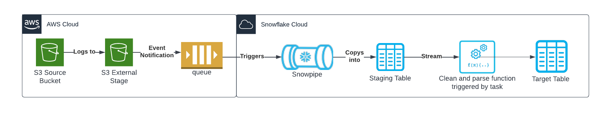
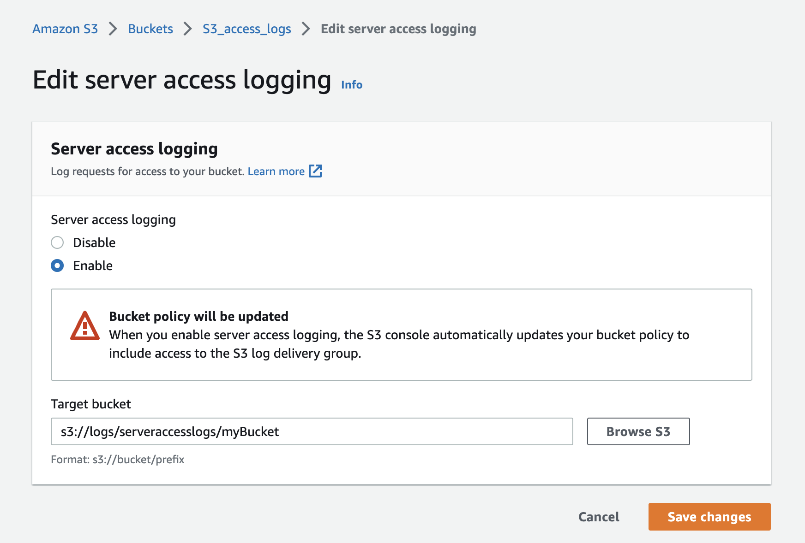
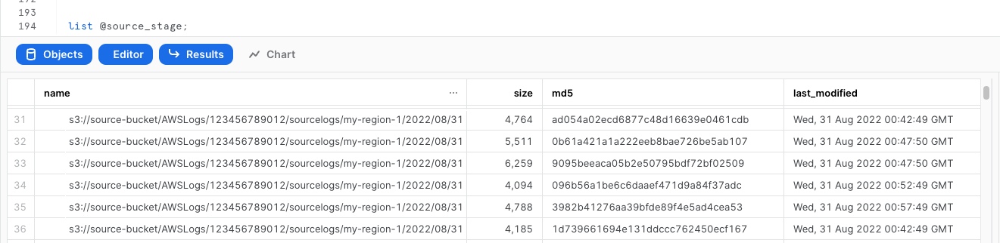
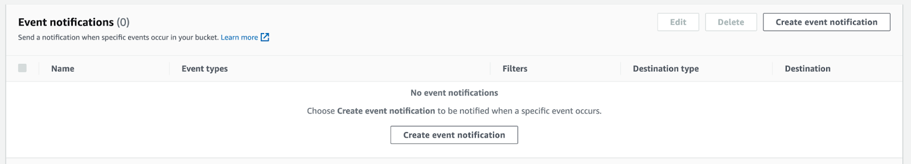
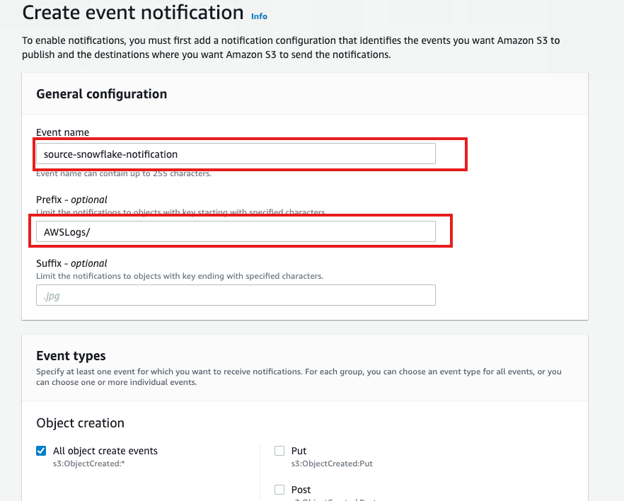
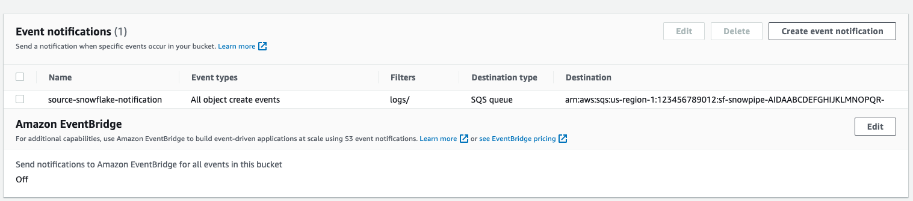

author: Jake Berkowsky
id: s3_access_log_ingestion
summary: This quickstart is a guide to ingesting and processing S3 Access Logs into snowflake. It provides detailed instructions for configuring an automated ingestion and processing pipeline as well as example queries for data loss prevention and incident response.
categories: Cybersecurity
environments: web
status: Published 
feedback link: https://github.com/Snowflake-Labs/sfguides/issues
tags: Cybersecurity, Data Loss Protection

# AWS S3 Access Logs Ingestion

## Overview 
Duration: 1

S3 access logging allows for auditing of operations preformed on objects in an S3 bucket. Like CloudTrail events, S3 access logs will provide information about accessed objects, actors preforming those actions and the actions themselves. S3 access logs contain additional fields and may log events not logged in CloudTrail. Importantly to note is that they are delivered on a best effort basis and may not contain every action. More information about S3 access logs and CloudTrail can be found in the [official documentation](https://docs.aws.amazon.com/AmazonS3/latest/userguide/logging-with-S3.html). 


This quickstart is a guide to ingesting and processing S3 Access Logs into snowflake. It provides detailed instructions for configuring an automated ingestion and processing pipeline as well as example queries for data loss prevention and incident response.

### Prerequisites
- AWS user with permission to create and manage IAM policies and roles
- Snowflake user with permission to create tables, stages, tasks, streams and storage integrations as well as setup snowpipe.
- An S3 Logging Bucket, preferably in the same region as your Snowflake target account.

### Architecture

S3 access logs are configured to log to a separate bucket which serves as a snowflake external stage. When log files are created, an event notification triggers and SQS queue which triggers Snowpipe to copy logs to a staging table. A stream of incoming 


## Enable S3 Access Logging
Duration: 5

See [here](https://docs.aws.amazon.com/AmazonS3/latest/userguide/enable-server-access-logging.html) for more detailed instructions.

1. In the Buckets list, choose the bucket you want to enable logs on

1. Look for the properties flag, in the server access logging area, select Edit.

1. Enable server access logging and choose a bucket/prefix for the target bucket



Note: S3 access logging may take some time to start creating records. 


## Create a storage integration in Snowflake
Duration: 3

*Replace \<RoleName\> with the desired name of the role you’d like snowflake to use ( this role will be created in the next step).  Replace \<BUCKET_NAME\>/path/to/logs/ with the path to your S3 Access logs as set in the previous step*

```sql
create STORAGE INTEGRATION s3_int_s3_access_logs
  TYPE = EXTERNAL_STAGE
  STORAGE_PROVIDER = S3
  ENABLED = TRUE
  STORAGE_AWS_ROLE_ARN = 'arn:aws:iam::<AWS_ACCOUNT_NUMBER>:role/<RoleName>'
  STORAGE_ALLOWED_LOCATIONS = ('s3://<BUCKET_NAME>/<PREFIX>/');

DESC INTEGRATION s3_int_s3_access_logs;
```
Take note of **STORAGE_AWS_IAM_USER_ARN** and **STORAGE_AWS_EXTERNAL_ID**


## Create role and policy in AWS
Duration: 5

*The following assumes a user with the ability to create and manage IAM logged into the AWS console or using the CLI.  A full explanation can be found in [this documentation](https://docs.snowflake.com/en/user-guide/data-load-s3-config.html)*

Open up Cloudshell in the AWS console by pressing the  icon on the right side of the top navigation bar or run the following commands in your terminal once configured to use the AWS CLI.

Export the following variables, replacing the values with your own

```bash
export BUCKET_NAME='<BUCKET_NAME>'
export PREFIX='<PREFIX>' # no leading or trailing slashes
export ROLE_NAME='<ROLE_NAME>'
export STORAGE_AWS_IAM_USER_ARN='<STORAGE_AWS_IAM_USER_ARN>'
export STORAGE_AWS_EXTERNAL_ID='<STORAGE_AWS_EXTERNAL_ID>'
```
Create a role for Snowflake to assume
```bash
aws iam create-role \
    --role-name "${ROLE_NAME}" \
    --assume-role-policy-document \
'{
    "Version": "2012-10-17",
    "Statement": [
        {
            "Sid": "",
            "Effect": "Allow",
            "Principal": {
                "AWS": "'${STORAGE_AWS_IAM_USER_ARN}'"
            },
            "Action": "sts:AssumeRole",
            "Condition": {
                "StringEquals": {
                    "sts:ExternalId": "'${STORAGE_AWS_EXTERNAL_ID}'"
                }
            }
        }
    ]
}'
```
Create an inline-policy to allow snowflake to add and remove files from S3

```bash
aws iam put-role-policy \
    --role-name "${ROLE_NAME}" \
    --policy-name "${ROLE_NAME}-inlinepolicy" \
    --policy-document \
'{
    "Version": "2012-10-17",
    "Statement": [
        {
            "Effect": "Allow",
            "Action": [
              "s3:PutObject",
              "s3:GetObject",
              "s3:GetObjectVersion",
              "s3:DeleteObject",
              "s3:DeleteObjectVersion"
            ],
            "Resource": "arn:aws:s3:::'${BUCKET_NAME}'/'${PREFIX}'/*"
        },
        {
            "Effect": "Allow",
            "Action": [
                "s3:ListBucket",
                "s3:GetBucketLocation"
            ],
            "Resource": "arn:aws:s3:::'${BUCKET_NAME}'",
            "Condition": {
                "StringLike": {
                    "s3:prefix": [
                        "'${PREFIX}'/*"
                    ]
                }
            }
        }
    ]
}'
```
You will now be able to see your role, policy and trust relationship in the console


## Prepare Snowflake to receive data
Duration: 6

This quickstart requires a warehouse to perform computation and ingestion. We recommend creating a separate warehouse for security related analytics if one does not exist. The following will create a medium sized single cluster warehouse that suspends after 1 minute of inactivity. For production workloads a larger warehouse will likely be required.

```sql
create warehouse security_quickstart with 
  WAREHOUSE_SIZE = MEDIUM 
  AUTO_SUSPEND = 60;
```

S3 Access logs are in a non-standard format which we will be parsing with a custom function later on. For now we will create a file format to import logs unparsed.

```sql
CREATE FILE FORMAT IF NOT EXISTS TEXT_FORMAT 
TYPE = 'CSV' 
FIELD_DELIMITER = NONE
SKIP_BLANK_LINES = TRUE
ESCAPE_UNENCLOSED_FIELD = NONE;
```


Create External Stage using the storage integration and test that snowflake can test files. Make sure you include the trailing slash if using a prefix.
```sql
create stage s3_access_logs
  url = 's3://<BUCKET_NAME>/<PREFIX>/'
  storage_integration = s3_int_s3_access_logs
;

list @s3_access_logs;
```


Create a table to store the raw logs
```sql
create table s3_access_logs_staging(
    raw TEXT,
    timestamp DATETIME
);
```

Create a stream on the table to track changes, this will be used to trigger processing later on

```sql
create stream s3_access_logs_stream on table s3_access_logs_staging;

```


Test Injection from External Stage
```sql
copy into s3_access_logs_staging from (
SELECT 
  STG.$1,
  current_timestamp() as timestamp 
FROM @s3_access_logs (FILE_FORMAT => TEXT_FORMAT) STG
);
```


Verify the logs were loaded properly
```sql
select * from public.s3_access_logs_staging limit 5;
```

## Setup Snowpipe for continuous loading
Duration: 5

The following instructions depend on a Snowflake account running on AWS. Accounts running on other cloud providers may invoke snowpipe from a rest endpoint.
[https://docs.snowflake.com/en/user-guide/data-load-snowpipe-rest.html](https://docs.snowflake.com/en/user-guide/data-load-snowpipe-rest.html)


Configure the Snowflake snowpipe
```sql
create pipe public.s3_access_logs_pipe auto_ingest=true as
  copy into s3_access_logs_staging from (
    SELECT 
      STG.$1,
      current_timestamp() as timestamp 
  FROM @s3_access_logs (FILE_FORMAT => TEXT_FORMAT) STG
)
;
```

Show pipe to retrieve SQS queue ARN 
```sql
show pipes;
```


Setup S3 bucket with following [AWS instructions](https://docs.aws.amazon.com/AmazonS3/latest/userguide/enable-event-notifications.html).

Target Bucket -> Open property -> Select “Create Event notification”



Fill out below items
- Name: Name of the event notification (e.g. Auto-ingest Snowflake).
- Prefix(Optional) :  if you receive notifications only when files are added to a specific folder (for example, logs/). 
- Events: Select the ObjectCreate (All) option.
- Send to: Select “SQS Queue” from the dropdown list.
- SQS: Select “Add SQS queue ARN” from the dropdown list.
- SQS queue ARN: Paste the SQS queue name from the SHOW PIPES output.




Event notification has been created


Refresh Snowpipe to retrieve unloaded files
```sql
alter pipe s3_access_logs_pipe refresh;
```
You can confirm also if snowpipe worked properly
```sql
select *
  from table(snowflake.information_schema.pipe_usage_history(
    date_range_start=>dateadd('day',-14,current_date()),
    date_range_end=>current_date(),
    pipe_name=>'public.s3_access_logs_pipe));
```

## Parse and transform the raw logs

Now that the raw data is loaded into Snowflake, we will create a custom python function to parse and clean up the raw logs.

Create a python user defined table function (UDTF) to process logs. This will return a table.

```sql
create or replace function parse_s3_access_logs(log STRING)
returns table (
    bucketowner STRING,bucket_name STRING,requestdatetime STRING,remoteip STRING,requester STRING,
    requestid STRING,operation STRING,key STRING,request_uri STRING,httpstatus STRING,errorcode STRING,
    bytessent BIGINT,objectsize BIGINT,totaltime STRING,turnaroundtime STRING,referrer STRING, useragent STRING,
    versionid STRING,hostid STRING,sigv STRING,ciphersuite STRING,authtype STRING,endpoint STRING,tlsversion STRING)
language python
runtime_version=3.8
handler='S3AccessLogParser'
as $$
import re
class S3AccessLogParser:
    def clean(self,field):
        field = field.strip(' " " ')
        if field == '-':
            field = None
        return field
        
    def process(self, log):
        pattern = '([^ ]*) ([^ ]*) \\[(.*?)\\] ([^ ]*) ([^ ]*) ([^ ]*) ([^ ]*) ([^ ]*) (\"[^\"]*\"|-) (-|[0-9]*) ([^ ]*) ([^ ]*) ([^ ]*) ([^ ]*) ([^ ]*) ([^ ]*) (\"[^\"]*\"|-) ([^ ]*)(?: ([^ ]*) ([^ ]*) ([^ ]*) ([^ ]*) ([^ ]*) ([^ ]*))?.*$'
        lines = re.findall(pattern,log,re.M)
        for line in lines:
            yield(tuple(map(self.clean,line)))
$$;
```

Test the parsing function if desired 
```sql
select parsed_logs.*
    from s3_access_logs_staging
    join table(parse_s3_access_logs(s3_access_logs_staging.raw)) parsed_logs;
```
Create table to hold the parsed logs

```sql
create or replace table s3_access_logs(
 bucketowner STRING,bucket_name STRING,requestdatetime STRING,remoteip STRING,requester STRING,
    requestid STRING,operation STRING,key STRING,request_uri STRING,httpstatus STRING,errorcode STRING,
    bytessent BIGINT,objectsize BIGINT,totaltime STRING,turnaroundtime STRING,referrer STRING, useragent STRING,
    versionid STRING,hostid STRING,sigv STRING,ciphersuite STRING,authtype STRING,endpoint STRING,tlsversion STRING
);
```

Create a scheduled task that processes logs from staging table as they are ingested a task and the stream created earlier. Will run every ten minutes if there are logs in the stream.

```sql
create or replace task s3_access_logs_transformation
warehouse = security_quickstart
schedule = '10 minute'
when
system$stream_has_data('s3_access_logs_stream')
as
insert into s3_access_logs (select parsed_logs.*
    from s3_access_logs_stream
    join table(parse_s3_access_logs(s3_access_logs_stream.raw)) parsed_logs
    where s3_access_logs_stream.metadata$action = 'INSERT'
);
--Task must be "resumed" after creation
alter task s3_access_logs_transformation resume;
```

After the task runs, very that the data was parsed. If you don't wish to wait either reduce the time specified in schedule or run the above `insert into` command manually.


## Query the data
Duration: 2

Create a workbook to query the new view. If desired, use the following to help get you started:

```sql
-- Investigate who deleted which object
SELECT RequestDateTime, RemoteIP, Requester, Key 
FROM s3_access_logs_db.mybucket_logs 
WHERE key = 'path/to/object' AND operation like '%DELETE%';

-- IPs by number of requests
select count(*),REMOTEIP from s3_access_logs group by remoteip order by count(*) desc;

-- IPs by traffic
SELECT 
    remoteip,
    SUM(bytessent) AS uploadTotal,
    SUM(objectsize) AS downloadTotal,
    SUM(ZEROIFNULL(bytessent) + ZEROIFNULL(objectsize)) AS Total
FROM s3_access_logs
group by REMOTEIP
order by total desc;

-- Access denied errors
SELECT * FROM s3_access_logs WHERE httpstatus = '403';
-- All actions for a specific user
SELECT * 
FROM s3_access_logs_db.mybucket_logs 
WHERE requester='arn:aws:iam::123456789123:user/user_name';

-- Show anonymous requests
SELECT *
FROM s3_access_logs
WHERE Requester IS NULL;
```

## Conclusion & next steps
Duration: 0

Having completed this quickstart you have successfully:
- Configured S3 access logging
- Created and configured an external stage using S3
- Ingested S3 access logs into Snowflake
- Created and configured a pipeline to automatically load data
- Created a scheduled task and function to automatically process data
- Explored sample queries to get insights out of your access logs

### Additional References
- [https://docs.snowflake.com/en/user-guide/data-load-s3-config.html](https://docs.snowflake.com/en/user-guide/data-load-s3-config.html)
- [https://docs.snowflake.com/en/user-guide/data-load-snowpipe-auto-s3.html#option-1-creating-a-new-s3-event-notification-to-automate-snowpipe](https://docs.snowflake.com/en/user-guide/data-load-snowpipe-auto-s3.html#option-1-creating-a-new-s3-event-notification-to-automate-snowpipe)
- [https://docs.aws.amazon.com/AmazonS3/latest/userguide/using-s3-access-logs-to-identify-requests.html](https://docs.aws.amazon.com/AmazonS3/latest/userguide/using-s3-access-logs-to-identify-requests.html)
