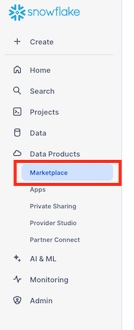
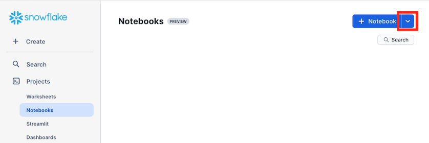
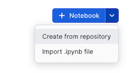
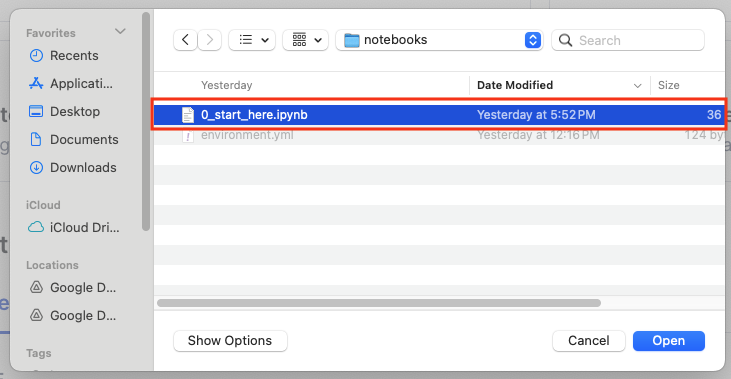
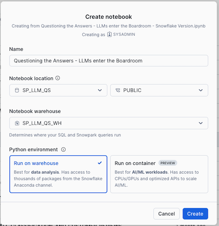
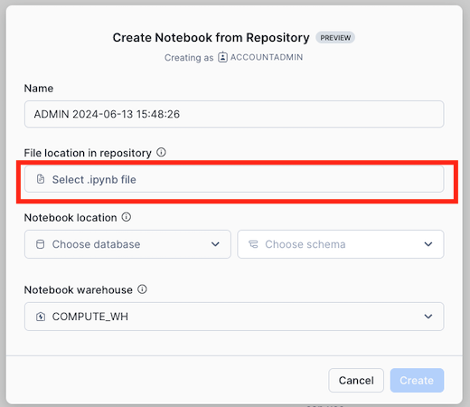
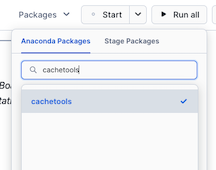
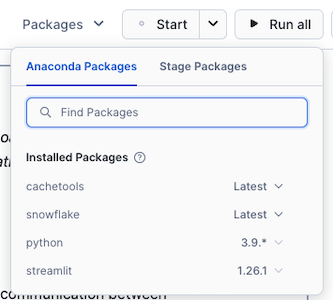

author: Mats Stellwall, Henry Chiang
id: s_and_p_market_intelligence_analyze_earnings_transcripts_in_cortex_ai
summary: This guide will provide step-by-step details for building a data engineering pipeline with pandas on Snowflake
categories: Getting-Started
environments: web
status: Published 
feedback link: https://github.com/Snowflake-Labs/sfguides/issues
tags: Getting Started, Data Science, Data Engineering 

# S&P Market Intelligence: Analyze Earnings Transcripts with LLMs in Cortex AI
<!-- ------------------------ -->
## Overview 

Earnings calls play a pivotal role in shaping investor perceptions. The quality of communication between executives and analysts can significantly influence company performance. Efficient Communicators—executives who deliver proactive presentations, anticipate market queries, and provide clear, on-topic answers to analysts’ questions—consistently outperform their peers. Conversely, Total Redirectors—executives who are reactive, fail to address analysts’ key inquiries during presentations, and provide off-topic responses—significantly underperform.

Executives' ability to anticipate investor concerns and maintain a focused dialogue fosters confidence and strategic communication. In contrast, failing to provide clarity when analysts seek additional information can lead to misalignment and breakdowns in transparency. A long (short) portfolio of Efficient Communicators (Total Redirectors) generates +515bps of annualized alpha.

The quickstart serves as a blueprint for the research detailed in Quantitative Research & Solutions’ recent publication, ["Questioninig the Answers: LLM's enter the Boardroom."](https://www.spglobal.com/market-intelligence/en/news-insights/research/questioning-the-answers-llms-enter-the-boardroom) It analyse executive on-topicness and proactiveness using the analysts questions, executives answers and LLM answers. This research harness alpha using LLM tools, including vector embeddings, vector cosine similarity, and the LLM quesiton answering.

Through this quickstart, you will learn how to use [Snowflake Notebooks](https://docs.snowflake.com/user-guide/ui-snowsight/notebooks) and [Snowflake Cortex LLM functions](https://docs.snowflake.com/en/user-guide/snowflake-cortex/llm-functions) on earnings call using the [Machine Readable Transcripts](https://app.snowflake.com/marketplace/listing/GZT0Z8P3D2V/s-p-global-market-intelligence-machine-readable-transcripts) dataset from S&P Global Market Intelligence.

### What You’ll Learn

* how to access S&P Market Intelligence datasets from the Marketplace
* how to use Snowflake Notebooks
* how to create and use vector embeddings on text data
* how to use genrate prompts based on data and use it with Cortex COMPLETE

### What is Snowflake Cortex?

Snowflake Cortex is an intelligent, fully managed service that offers machine learning and AI solutions to Snowflake users. Snowflake Cortex capabilities include:

LLM Functions: SQL and Python functions that leverage large language models (LLMs) for understanding, querying, translating, summarizing, and generating free-form text.

ML Functions: SQL functions that perform predictive analysis such as forecasting and anomaly detection using machine learning to help you gain insights into your structured data and accelerate everyday analytics.

Learn more about [Snowflake Cortex](https://docs.snowflake.com/guides-overview-ai-features). 

### S&P Global Market Intelligence datasets

This quickstart is using sample data from the following S&P Global Market Intelligence datasets.

|Name|Description |
|----|----|
|[S&P Dow Jones Indices via Xpressfeed](https://app.snowflake.com/marketplace/listing/GZT0Z8P3D9M/s-p-global-market-intelligence-s-p-dow-jones-indices-via-xpressfeed)|	The premium index benchmarking data from major index providers allows investors to track and simulate index performance, and are fully integrated and linked within the S&P Global Market Intelligence data ecosystem, so you can focus on your investment strategy. Premium index data available via Xpressfeed covers index returns (prices), as well as licensed index and their index constituent data all in one place.|
|[ S&P Capital IQ Financials](https://app.snowflake.com/marketplace/listing/GZT0Z8P3D2N/s-p-global-market-intelligence-s-p-capital-iq-financials)|	S&P Capital IQ Financials provides global standardized financial statement data for over 180,000 companies, including over 95,000 active and inactive public companies, and As Reported data for over 150,000 companies. S&P Capital IQ Standardized Financials allows you to extend the scope of your historical analysis and back-testing models with consistent data from all filings of a company's historical financial periods including press releases, original filings, and all restatements.|
|[Global Events](https://app.snowflake.com/marketplace/listing/GZT0Z8P3D38/s-p-global-market-intelligence-global-events)|The Global Events dataset provides details on upcoming and past corporate events such as earnings calls, shareholder/analyst meetings, expected earnings release dates and more. With deep history back to 2003, clients can leverage this dataset to derive signals and support trading models across asset classes, trading styles and frequencies. This dataset also helps in research & analysis, risk management & compliance, and trade surveillance workflows.|
|[GICS®](https://app.snowflake.com/marketplace/listing/GZT0Z8P3D3S/s-p-global-market-intelligence-gics®) |The GICS dataset includes global industry classifications for public companies, both current and historical. Leverage GICS, jointly developed by S&P Global and MSCI, for a complete, consistent set of global sector and industry definitions. GICS has become the standard widely recognized by market participants worldwide. The GICS methodology assigns each public company to a sub-industry and corresponding industry, industry group and sector, according to the definition of its principle business activity. The current GICS sectors include Energy, Materials, Industrials, Consumer Discretionary, Consumer Staples, Health Care, Financials, Information Technology, Communication Services, Utilities, and Real Estate.|
|[Compustat® Financials](https://app.snowflake.com/marketplace/listing/GZT0Z8P3D2R/s-p-global-market-intelligence-compustat®-financials)	|Compustat Financials provides standardized North American and global financial statements and market data for over 80,000 active and inactive publicly traded companies that financial professionals have relied on for over 50 years. Compustat allows investment professionals, academic researchers, and industry analysts to combine deep history with robust and consistent data standardization into their research and backtesting to produce valuable insights and generate alpha. With historical data for North America as far back as 1950 and point-in-time snapshots beginning in 1987, Compustat provides you with insight into company financial performance across many different economic cycles not available anywhere else.|


### Prerequisites
* [Git](https://git-scm.com/book/en/v2/Getting-Started-Installing-Git) installed
    > aside positive
    >
    >Clone or download the [git repo](https://github.com/Snowflake-Labs/sfguide-s-and-p-market-intelligence-analyze-earnings-transcripts-in-cortex-ai)
* A Snowflake account. If you do not have a Snowflake account, you can register for a [free trial account](https://signup.snowflake.com/).
* A Snowflake account login with a role that has the ability to create database, schema and tables. If not, you will need to register for a free trial or use a different role.
* Access to the [S&P Global Market Intelligence XXXX dataset](XXXXXXX) through Snowflake Marketplace

### What You’ll Build 
A Customer profile table using the Snowpark Pandas API and a serverless task that will run the feature engineering pipeline on a schedule.

<!-- ------------------------ -->
## Setup The Snowflake Environment
Duration: 10

### Overview
This section covers cloning of the GitHub repository and creating the needed Snowflake objects (i.e role, warehouse, database, schema, etc..)

### Clone The Git Repository
The very first step is to clone the [GitHub repository](https://github.com/Snowflake-Labs/sfguide-s-and-p-market-intelligence-analyze-earnings-transcripts-in-cortex-ai). This repository contains all the code you will need to successfully complete this QuickStart Guide.

Using HTTPS:

```shell
git clone https://github.com/Snowflake-Labs/sfguide-s-and-p-market-intelligence-analyze-earnings-transcripts-in-cortex-ai.git
```

OR, using SSH:

```shell
git clone git@https://github.com/Snowflake-Labs/sfguide-s-and-p-market-intelligence-analyze-earnings-transcripts-in-cortex-ai.git
```

You can also use the Git integration feature of Snowflake Notebooks, in order to do that you need to fork the [GitHub repository](https://github.com/Snowflake-Labs/sfguide-data-engineering-pipelines-with-pandas-on-snowflake) to be allowed to commit changes. For instructions how to set up Git integration for your Snowflake account see [here](https://docs.snowflake.com/developer-guide/git/git-setting-up) and for using it with Snowflake Notebooks see [this page](https://docs.snowflake.com/en/user-guide/ui-snowsight/notebooks-snowgit). You can refer to [this video](https://www.youtube.com/watch?v=4GOa1eUccmQ) for a walkthrough on how you can set up Git integration and use it with Snowflake Notebooks.

<!-- ------------------------ -->
## Setup Snowflake

Duration: 10

During this step you will verify that the [Snowflake Sample TPC-H dataset](https://docs.snowflake.com/en/user-guide/sample-data-tpch) is available in your account, and if not add the share.

### Create Database, Schema And Warehouse To Be Used

Run the following SQL commands in a SQL worksheet to create the [warehouse](https://docs.snowflake.com/en/sql-reference/sql/create-warehouse.html), [database](https://docs.snowflake.com/en/sql-reference/sql/create-database.html) and [schema](https://docs.snowflake.com/en/sql-reference/sql/create-schema.html) that will be used to store the Notebook and tables created by this QuickStart.

```SQL
USE ROLE ACCOUNTADMIN;

CREATE DATABASE IF NOT EXISTS SP_LLM_QS;

CREATE WAREHOUSE IF NOT EXISTS SP_LLM_QS_WH;

USE DATABASE SP_LLM_QS;

-- Create a network rule and a external access integration to allow to download NLTK additions
CREATE OR REPLACE NETWORK RULE githubusercontent_network_rule
 MODE = EGRESS
 TYPE = HOST_PORT
 VALUE_LIST = ('raw.githubusercontent.com');

CREATE OR REPLACE EXTERNAL ACCESS INTEGRATION SP_LLM_QS_NLTK_INTEGRATION
  ALLOWED_NETWORK_RULES= (GITHUBUSERCONTENT_NETWORK_RULE)
  ENABLED = TRUE;

```

### Request the S&P Global Market Intelligence QuickStart dataset
1. Navigate to the Snowflake Marketplace by clicking **Data Products** and then **Marketplkace**  
    
      
2. In the search bar enter **XXXXXXXX** and hit enter
3. In the result list click on **XXXXXXXX**
4. Xxxxxxxxx


### Create Snowflake Notebook

### Navigate To Snowflake Notebooks

1. Navigate to the Notebooks section by clicking **Projects** and then **Notebooks**  

      
2. Click on the **down arrow* next to **+ Notebook**  

      
3. If you have set up git integration choose  **Create from repository**. If not, then choose **import .ipynb file**.

      

### Import .ipynb File
1. Navigate to where you have cloned the [GitHub repository](https://github.com/Snowflake-Labs/sfguide-data-engineering-pipelines-with-pandas-on-snowflake) and select **0_start_here.ipynb** and click **Open**  
  
2. Give the notebook a name, then select **SP_LLM_QS** and **PUBLIC** for **Notebook location**, **SP_LLM_QS_WH** for **Notebook warehouse** and click **Create**  
  

### Create From Repository

If you have forked the [GitHub repository](https://github.com/Snowflake-Labs/sfguide-data-engineering-pipelines-with-snowpark-pandas) and create a Git integration to it in Snowflake you can open the notebook directly from the repository. See [here](https://docs.snowflake.com/en/developer-guide/git/git-overview) for instructions on how to set up Git integration.

1. In the **Create Notebook from Repository** dialog, click on **Select .ipynb file**  
  
2. In the **Select file from Git Repository** dialog, click on the repository integration you are using and select the notebook file and click **Select File**, if you do not see the file press **Fetch** to refresh with the latest changes from the repository  
3. Back to the **Create Notebook from Repository** dialog, give the notebook a name, then select **SP_LLM_QS**, **PUBLIC** for **Notebook location** and **SP_LLM_QS_WH** for **Notebook warehouse** and click **Create**  

### Add Required Python Libraries

Before you run the notebook you need to add the following Python libraries:
* cachetools
* snowflake

1. In the Notebook click on **Packages**  
2. Search for **cachetools** and select **cachetools** in the list  
  
3. Do the same for **snowflake**. When done you should have the same packages as the list below (the versions might differ)  
  


<!-- ------------------------ -->
## Analyze Earnings Transcripts with LLMs in Cortex AI
Duration: 30

During this step you will learn how to use Snowflake Cortex to:
* Generate embeddings on call transcripts
* Compare similarites between questions and answers using cosine similuarity
* Generate LLM based answers to questions using Cortex COMPLETE
* Compare  similarites between questions and LLM answers using cosine similuarity

Follow along and run each of the cells in [the Notebook](https://github.com/Snowflake-Labs/sfguide-s-and-p-market-intelligence-analyze-earnings-transcripts-in-cortex-ai/blob/main/notebooks/0_start_here.ipynb).


<!-- ------------------------ -->
## Conclusion And Resources
Duration: 4

Congratulations, you have successfully completed this quickstart! Through this quickstart, we were able to showcase how you can use [Snowflake Notebooks](https://docs.snowflake.com/user-guide/ui-snowsight/notebooks) and [Snowflake Cortex LLM functions](https://docs.snowflake.com/en/user-guide/snowflake-cortex/llm-functions) on earnings call using the [Machine Readable Transcripts](https://app.snowflake.com/marketplace/listing/GZT0Z8P3D2V/s-p-global-market-intelligence-machine-readable-transcripts) dataset from S&P Global Market Intelligence.

### What You Learned

- how to access S&P Market Intelligence datasets from the Marketplace
- how to use Snowflake Notebooks
- how to create and use vector embeddings on text data
- how to use genrate prompts based on data and use it with Cortex COMPLETE


### Related Resources

* [Source Code on GitHub](https://github.com/Snowflake-Labs/sfguide-s-and-p-market-intelligence-analyze-earnings-transcripts-in-cortex-ai)
* Access the reasearch ["Questioninig the Answers: LLM's enter the Boardroom."](https://www.spglobal.com/market-intelligence/en/news-insights/research/questioning-the-answers-llms-enter-the-boardroom)
