author: sfc-gh-drichert, sfc-gh-ahuck
id: sap_accounts_receivable_to_snowflake
summary: Extract SAP data using Azure Data Factory and transform accounts receivable data in Snowflake.
categories: SAP, Finance, AR
environments: web
status: Published 
feedback link: david.richert@snowflake.com
tags: Getting Started, Data Engineering, SAP, Finance, AR, Azure, Azure Data Factory, ADF, dbt, Tableau

# SAP Accounts Receivable to Snowflake using ADF
## Overview 
Duration: 1

This step-by-step shows you how to:
* Deploy an SAP ECC demo system in Azure using SAP CAL:

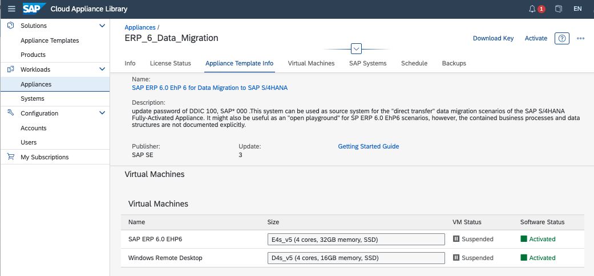

* Activate your Snowflake account:


* Extract and load Accounts Receivable data through 0fi_ar_4 extractor-->ODP API -->Azure Data Factory to Snowflake, full and delta:

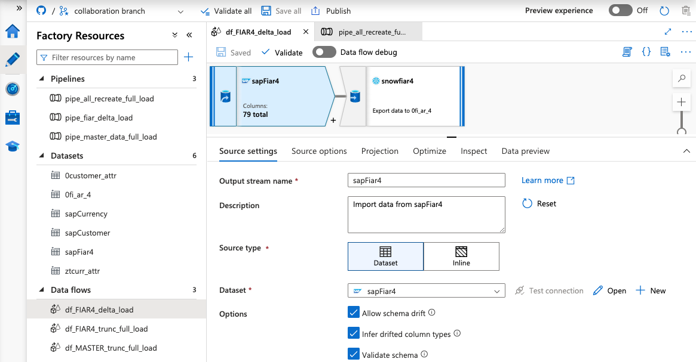


* Use pre-built [dbt CLI](https://docs.getdbt.com/dbt-cli/cli-overview) data flows to:
  * translate technical field names into business friendly terms
  * perform a currency conversion transform
  * combine customer master data with accounts documents.

This is a screen capture of DBT's auto-documentation of the data flow we will create:

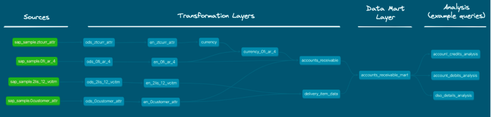

We provide a Tableau report to visualize the data regionally, per customer, per DSO, and per document number. 
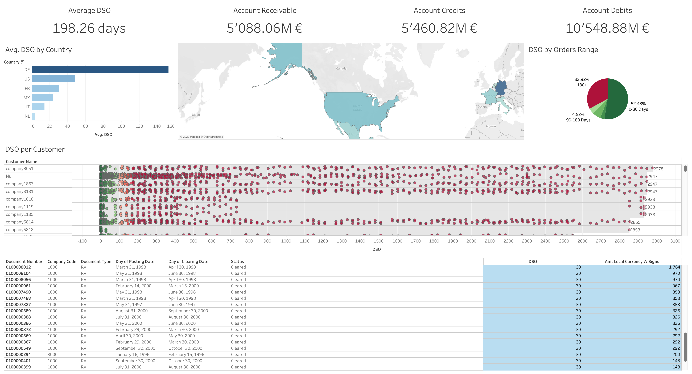
Let’s get started!

### What you need to have before starting the lab
Duration: 60

To participate in the virtual hands-on lab, attendees need the following:

* Admin rights to an Azure trial account
* [An SAP s- or p-user or linked Universal ID](https://blogs.sap.com/2020/01/17/creating-a-p-user-in-sap-cloud-platform-to-practise-sap-hana./) to log on to SAP's Cloud Appliance Library (cal.sap.com). 
* A credit card to add billing information to the Azure account 
* A Snowflake account with `ACCOUNTADMIN` access (you can get a [free Trial account here](https://signup.snowflake.com/))
* Familiarity with Snowflake and Snowflake objects (eg. through the [Zero-To-Snowflake hands-on-lab](https://quickstarts.snowflake.com/guide/getting_started_with_snowflake/index.html#0))
* [git](https://git-scm.com/book/en/v2/Getting-Started-Installing-Git) installed on your local machine
* [Tableau desktop](https://www.tableau.com/products/desktop/download) installed on your local machine (optional)

### What you will install during the lab
You will install [dbt CLI](https://docs.getdbt.com/dbt-cli/install/pip) during the lab.

The following will be installed or used in your Azure environment:
* SAP ECC
* a Windows virtual machine
* an Azure self-hosted integrated runtime on the virtual machine
* Azure Data Factory
* an Azure auto resolve integration runtime.
* ADLS Gen 2 storage

You will activate your Snowflake account.

### What you will learn

* How to deploye and activate an SAP test machine using SAP Computer Appliance Library.
* How to use Azure Data Factory to request data from SAP through the ODP API.
* How to install and run a pipelines using DBT & Snowflake.
* How to transform SAP data in Snowflake.

### What you will build
An Accounts Receivable pipeline for Financial Services from SAP ECC to Snowflake to Tableau.


<!-- ------------------------ -->

## Create Azure account & deploy SAP ERP
Duration: 120
<aside class="callout">
In the interest of getting data out of SAP for this lab, we will use Azure Data Factory's SAP CDC connector, but there are many other ways to do this, and we are not recommending this particular path. If you otherwise have access to the demo data in this lab, you can skip building the Azure and SAP environments and go directly to the sections of creating your Snowflake account and installing and configuring DBT. An example, one-off, file ingestion is provided for your convenience in the Appendix.
</aside>

In this section, we:
create and activate an Azure free-trial environment
access SAP Cloud Application Library (SAP CAL), choose a template and deploy:
* SAP ERP 6.0 EHP6
* Windows virtual machine
* Subnets

<aside class="callout">
I use an SAP ECC instance, but you can adapt this quickstart to use an S/4HANA instance.
</aside>

For full documentation on the Azure/SAP setup, check [here](https://learn.microsoft.com/en-us/azure/data-factory/sap-change-data-capture-introduction-architecture).

Alternatively, if you are on AWS, you can adapt from the following AWS lab: [SAP on AWS Beyond Lab](https://catalog.workshops.aws/sap-on-aws-beyond/en-US/01-preparation/60-sap-env).


<aside class="callout">
After this section you will set up the Snowflake account and Configure ADF. If you wish, you can configure Snowflake first.
</aside>

### Use SAP CAL to create SAP ERP
Prerequisites:
  * Admin rights on an [Azure account](https://learn.microsoft.com/en-us/training/modules/create-an-azure-account/)
  * Access to https://cal.sap.com
Use the following video to set up your Azure account and create an SAP instance in Azure through SAP CAL:

<video id="iORePziUMBk"></video>

Adjust the following resources in Usage + quotas in your Azure subscription, before deploying from SAP CAL. 
  * Total Regional vCPUs to `50`.
  * Standard ESv5 Family CPUs to `10` vCPU.
  * Standard DSv5 Family CPUs to `10` vCPU.

<aside class="callout">
IDES trial accounts have data in them, but are limited to 30 days. Development accounts tend not to have data in them, but the developer licenses are renewable.
</aside>

Deployment can easily take an **hour**, so now is a good time to go to the Snowflake section and follow the setup steps. When the instance is activated and Snowflake is configured, come back here and continue. 
### Test access to SAP
1. From  cal.sap.com > Appliances, select **Connect** next to your deployed appliance. 
1. Choose RDP > Connect User name: Administrator, Password is the Master one you entered for the appliance.
1. Double-click the **SAP Logon** icon.
1. Click **Log On**:
    * User: idadmin,
    * Password: ides123 (or check the Getting Started Guide for the SAP instance)

<aside class="callout">
Check that you have Accounting >  Financial Accounting > Accounts Receivable in the SAP menu. If you don't you may not have any data, and may have to terminate this instance and launch a new, different instance.
</aside>

## Create & configure Snowflake
Duration: 25 
1. Sign up for a Snowflake trial account at https://signup.snowflake.com/.
1. Login to your Snowflake trial account.  


1. Click [here](https://docs.snowflake.com/en/user-guide/snowflake-manager.html#quick-tour-of-the-web-interface) for a quick tour of the Snowflake's user interface, Snowsight.  
 

3. Create a database and a service accounts for dbt. Create a worksheet, copy the below, paste into the worksheet,  change the password and run it.

<aside class="callout">
Make sure you change the password before running the script!
</aside>

```sql
-------------------------------------------
-- create demo database
-------------------------------------------
USE ROLE accountadmin;
CREATE DATABASE IF NOT EXISTS sap_demo; 
-------------------------------------------
-- create virtual warehouse compute cluster
-------------------------------------------
USE ROLE sysadmin;
CREATE OR REPLACE WAREHOUSE sap_dbt_wh 
  WAREHOUSE_SIZE = 'MEDIUM' 
  AUTO_SUSPEND = 60 
  AUTO_RESUME = TRUE 
  MIN_CLUSTER_COUNT = 1 
  MAX_CLUSTER_COUNT = 3 
  INITIALLY_SUSPENDED = TRUE;
-------------------------------------------
-- role and user
-------------------------------------------
USE ROLE securityadmin;
CREATE OR REPLACE ROLE sap_dbt_role;
------------------------------------------- Please replace with your dbt user password
CREATE OR REPLACE USER sap_dbt_user default_role = sap_dbt_role default_warehouse = sap_dbt_wh PASSWORD = "sap_dbt123!";
-------------------------------------------
-- Grants
-------------------------------------------
GRANT ROLE sap_dbt_role TO USER  sap_dbt_user;
GRANT ROLE sap_dbt_role TO ROLE sysadmin;
GRANT ALL ON DATABASE sap_demo TO ROLE sap_dbt_role;
GRANT ALL ON ALL SCHEMAS IN DATABASE sap_demo  TO ROLE sap_dbt_role;
GRANT ALL ON ALL TABLES IN DATABASE sap_demo TO ROLE sap_dbt_role;
GRANT ALL ON FUTURE SCHEMAS IN DATABASE sap_demo TO ROLE sap_dbt_role;
GRANT ALL ON FUTURE TABLES IN DATABASE sap_demo TO ROLE sap_dbt_role;
GRANT ALL ON WAREHOUSE sap_dbt_wh TO ROLE sap_dbt_role;
```

As result of these steps, you will have:
*  one empty databases: `sap_demo`
*  one virtual warehouse: `sap_dbt_wh`
*  one role and one user: `sap_dbt_role` and `sap_dbt_user`

<!-- ------------------------ -->


## Create Azure Data Factory, runtimes & storage
In this section, we will set up:

* Azure Data Factory 
* a self-hosted Integrated Run-time (IR) for the SAP to ADF connection
* an Azure AutoResolveIR to connect to Snowflake 
* an ADLS Gen 2 storage area.

For more information on how to use Azure Data Factory, please see [here](https://learn.microsoft.com/en-us/azure/data-factory/). 
### Create Azure Data Factory
1. From the remote desktop Windows machine that was deployed by CAL, access https://portal.azure.com/#home and select Data Factories
1. Select **+ Create** and fill in the details.
1. Select **West Europe** for the region.
1. Review + create > Read the Terms > Create.
1. The system creates the Data Factory. 
1. Select Go to resource > Launch studio.

### Create self-hosted integration runtime
1. From Data Factory Studio select **Manage** from the left (Tool Box icon).
1. Select Integration runtimes > + New > Azure, Self-Hosted > Continue
1. Select Self-Hosted > Continue (yes, again...)
1. Name it `SapIR`.
1. Select **Create**.
1. Select **Option 1: Express setup** to install the IR on the remote desktop Windows machine
1. The executable downloads onto the remote machine. 
1. From the downloads, right-click on the executable, **run as Administrator**. The IR installs on the remote machine.
1. Install the [SAP NCo 3.0](https://support.sap.com/en/product/connectors/msnet.html) (`not 3.1`), with option Install assemblies to GAC.
1. Back in Home > Virtual Machines > ERP6... > Networking, add inbound port rule for `3200` and `3300`. See [Setup SHIR](https://learn.microsoft.com/en-us/azure/data-factory/sap-change-data-capture-shir-preparation) for more detailed information. 

### Create ADLS Gen 2 storage
1. From https://portal.azure.com/#home > Storage, select + Create.
1. Name it `azurestage`. 
1. Assign it to your subscription, sap resource group, and West Europe Region, with Standard performance, and Locally-redundant storage.
1. Select Create. Azure deploys the storage.
1. Go to Azure > Storage > `azurestage` > Data Protection, and turn *off* **Enable soft delete for blobs**.


## Configure linked & staging linked services
The following sections give the main steps to configure ADF. Otherwise, use the provided ADF ARM template to deploy.

### Create linked service to SAP
1. From Azure Data Factory, select **Manage** > Linked services > Create linked service.
1. Search for SAP CDC and select Continue.
1. Enter the following details:

    * Name: `ABA_ODP`, or the name of your SAP system.
    * Integration runtime: `SapIR`.
    * IP address of the SAP system. 
    <aside class="callout">
      You can get the ip address from Azure Home > Virtual Machines > Linux machine, or from SAP CAL.
    </aside>
    * System number: `00`
    * Client ID: `100`
    * Language: `en`
    * SNC mode: **Off**
    * User name: `idadmin`
    * Password: `ides123` (or check the Getting Started Guide for the SAP instance)
1. Select **Create**.
2. **Test connection**. If it fails, check that you installed `Nco 3.0` on the Windows virtural machine, and configured the in-bound rules ports 3200 or 3300 in Azure.

### Create staging linked service to storage
1. From Azure Data Factory Designer, select **Manage** > Linked services > Create linked service.
1. Search for Azure and select **Azure Data Lake Storage Gen2**.
1. Select Continue.
1. Name: `azurestage`. 
1. Select from Azure subscription.
1. Select the Storage account name, `azurestage`.

### Create linked service to Snowflake
1. From Azure Data Factory Designer, select **Manage** > Linked services > Create linked service.
1. Search for Snowflake and select **Continue**.
1. Connect via integration runtime, **AutoResolveIntegrationRuntime**.
1. Fill in the connection information to your Snowflake account.

## Create source & sink datasets
### Create fi_ar_4 source datset
1. From Azure Data Factory Designer, select **Author** 
2. Select Datasets and click on  **(...)** > New dataset
3. Search SAP CDC, Select and Continue.
1. Enter the following:
    * Name: `sapfi_ar_4`
    * Linked Service: `ABA_ODP`
    * Integration runtime: `SapIR`
    * ODP Context: **SAPI**
    * ODP Name: **0FI_AR_4**

    The dataset is created.
4. Select Preview data. The data appears:

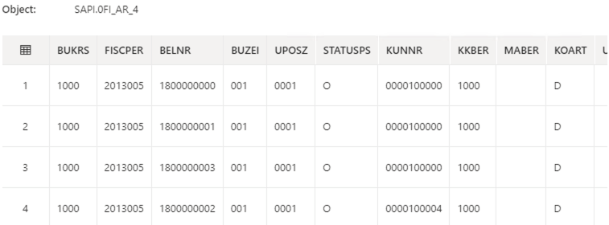


If the preview does not work, you may have to turn on the debugging.

### Create new data sources in SAP
Some tables may not be exposed to ODP in your trial system. Not to worry, you can use transaction **RSO2** and create new data sources. 
#### Expose customer & currency tables to ODP in SAP

1. From SAP GUI, enter transaction /nRSO2 (that's the letter O, not zero (0)).
    1. Create a new datasource
        * Select Master Data Attributes
        * Enter name for new data source, `ZTCURR`.
        * Select Create. 

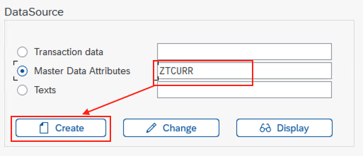

 1. A configuration window opens. Click on the loop next to **Applic. Component**.
    1. Select SAP-R/3 > 0CS > 0CS-IO (or your choice of component). 
    2. Double-click on **OCS-IO**. You return to the previous screen.
    1. Enter Currency for the short, medium, and long description.
    1. Enter `TCURR` in the View/Table.
    1. Click the diskette icon (save).
        1. Select Local Object. You may have to do this twice. The fields for TCURR appear.
    1. Repeat the above steps for Customer, naming the table `ZCUSTOMER_ATTR` and pointing to the table `KNA1`.

#### Create remaining source datasets
1. From Azure Data Factory, select **Author**.
2. Select Datasets and click on  **(...)** > New dataset
3. Search SAP CDC, Select and Continue
    * Name: `Currency`
    * Linked Service: `ABA_ODP`
    * Integration runtime: `SapIR`
    * ODP Context: **SAPI**
    * ODP Name: **ZTCURR**

    The dataset is created.
4. Select Preview data. The data appears.
1. Repeat the above for the customer data source.

### Create sink datasets
1. From Azure Data Factory, select **Author**.
2. Select Datasets and click on **(...)** > New dataset
1. Search Snowflake, Select and Continue
1. For table name, select edit. For Schema put `sap_raw`, for the name put `ztcurr_attr`.
1. Repeat the above steps for the sinks `0customer_attr` and `0fi_ar_4`.

## Create data flows
### Create df_FIAR4_trunc_full_load
1. From Azure Data Factory, select **Author** 
1. Select Dataflows and click on **(...)** > New dataflow. 
1. Name the dataflow df_FIAR4_trunc_full_load.
1. Select the box in the flow.
1. In Source settings tab:
   1.  name the Output stream name sapFiar4.
   1. Add the description: Import data from sapFiar4.
   1. Choose Dataset as the Source type.
   1. Choose sapFiar4 as the dataset. Toggle **Data flow debug** to test the connection.
   1. Select the options: Allow sehema drift, Infer drifted column types, and Validate schema
   1. Select Currency as a source
   1. Select the **+ button**, scroll to the bottom and choose **sink**.
1. In the Source options tab, choose **Full on every run** for the Run mode.
1. In the Projection tab, check the column names and type. 
1. Leave the defaults for the other tabs.
1. Click the + sign found to the lower right of the output stream, and choose **Sink**.
1. In the Sink tab:
    1. Name the Output stream name of the sink to snowFiar4.
    1. Add a description.
    1. Choose the 0fi_ar_4 dataset
    1. Select the optoins, Allow schema drift and Validate schema.
1. In the Settings tab:
    1. Select Allow insert
    1. Select the toggle Recreate Table.
1. In the Mapping tab:
    1.  Choose the options to Skip duplicate input columns and Skip duplicate output columns.
    1. Choose Auto mapping.

### Create df_MASTER_trunc_full_load
Follow the steps above, but create flows for sapCurrency -> ztcurr_attr, and sapCustomer -> 0custoemr_attr

### Create df_FIAR4_delta_load
Follow the steps above, but choose Incremental changes only in the source options for sapFiar4 as the datasource and 0fi_ar_4 as the sink. 

In the sink, make sure that all the options are selected and the key columns are mapped. 
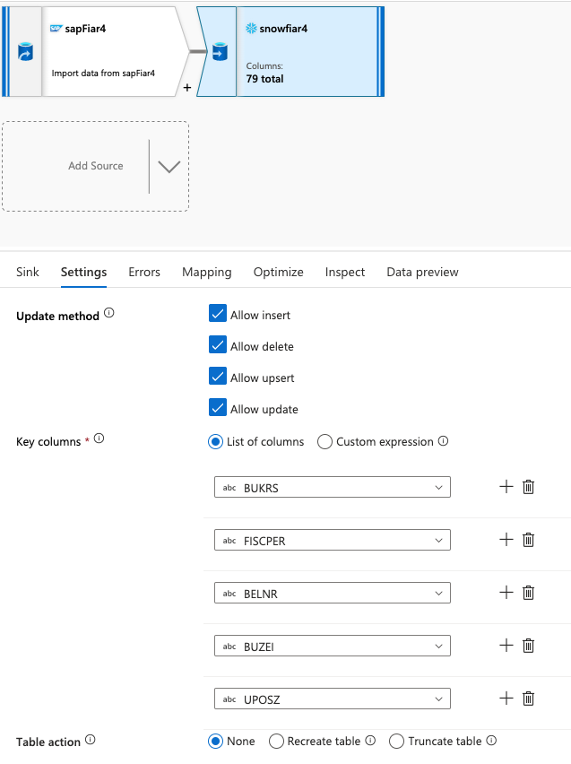

## Create & trigger pipeline 
Using a combination of the data flows, build pipelines. Here is an example of a full load pipeline:
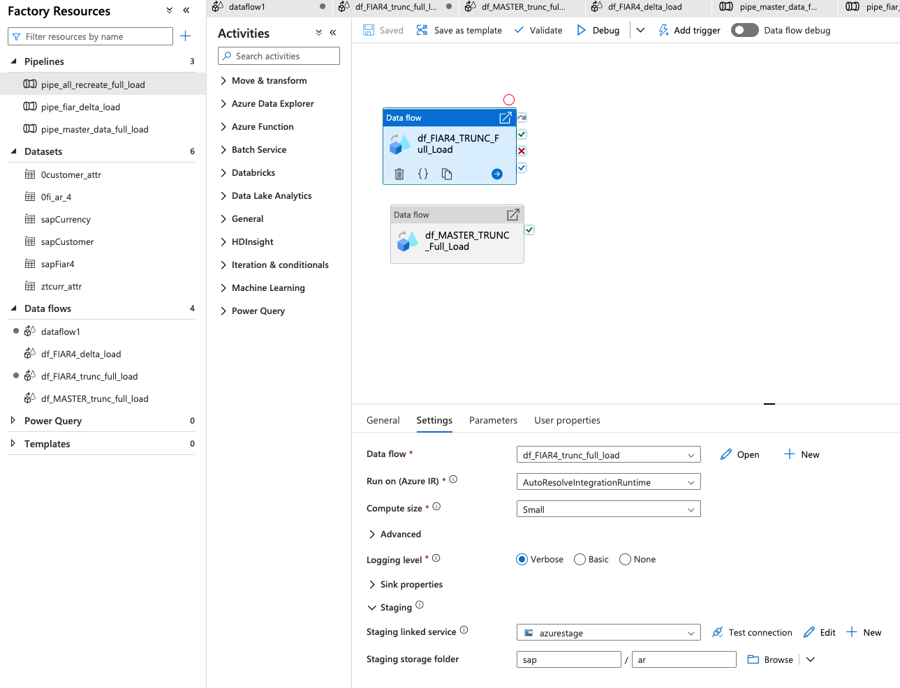

Notice, in Settings, the Compute Size (Small),  the staging linked service (azurestage) and the Staging storage folder (sap_/ar).

To trigger the pipeline:
From Data Factory > Author > Pipelines > pipe_all_recreate_full_load, select Add trigger > Trigger Now > OK.

Monitor the pipeline run. (My run, with a Small compute on the ADF side, took about five minutes.)

In Snowflake, you can also monitor the progress through Query History
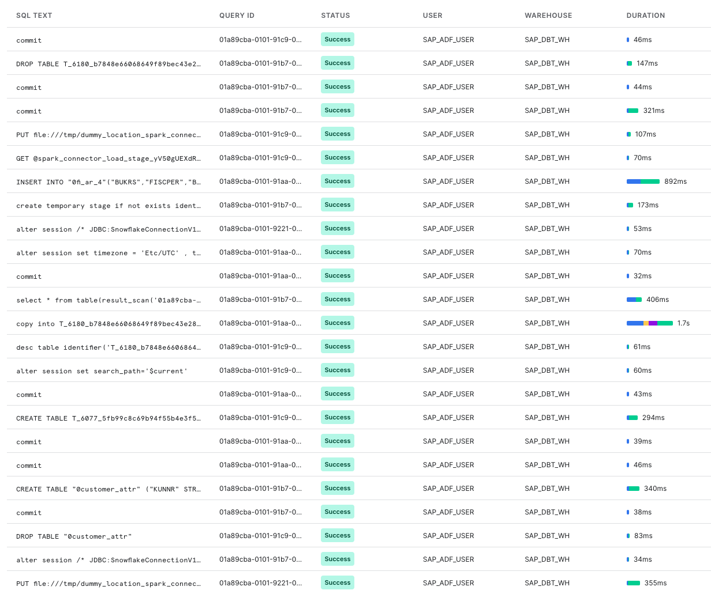

## Clone project, install dbt, python & packages
Duration: 60

### Clone the dbt project from git

1. Open a terminal on your local machine.

2. Make and navigate to the directory where you want the dbt project to reside, for example:

```sh
$ mkdir ~/dbt_projects
$ cd ~/dbt_projects
````
1. Within the above directory, run the following command to clone the project from github:
```sh
$ git clone https://github.com/Snowflake-Labs/sap-dbt-demo.git                       
```

1. Check that the project (a set of directories and files) has been downloaded:
```sh
 $ ls sap-dbt-demo
```
You should see the following directories and files:
```sh
Dockerfile		documentation		profiles.example.yml
README.md		generators		requirements.txt
analysis		macros			snapshots
data			models			tableau
dbt_project.yml		packages.yml		tests
```
### Install dbt & python

If you already have dbt installed, feel free to skip this step.

Install [dbt](https://www.getdbt.com/) using the following command that sources the right requirements.
Use the `requirements.txt` in the project directory which includes the most recent tested version of Snowflake compatible package.
```sh
$ cd ~/dbt_projects/sap-dbt-demo
$ pip3 install -r requirements.txt --upgrade
```
Verify that dbt was installed:
```sh
$ dbt --version
```

You will get a message similiar to the following (version might vary):
```sh
installed version: 1.0.1
   latest version: 1.0.1

Up to date!

Plugins:
  - snowflake: 1.0.0

```
<aside class="negative">
If you face any issues please refer to the official installation guide for dbt core.
</aside>

### Install additional dbt packages
Our project uses third-party modules. Install them using this command in the repository folder:
```bash
$ dbt deps
```
This creates a new folder `dbt_packages` directory in your project. 

Ok! let's get to configuring the project in the next section!


## Point dbt project to Snowflake
Duration: 5

1. To point dbt to your Snowflake instance, open file `~/.dbt/profiles.yml` in your prefered text editor 

```bash
Open  ~/.dbt/profiles.yml
```
2. Copy the text below and paste it into  profiles.yml:

```yaml
sap_dbt_lab:
  target: default
  outputs:
    default:
      type: snowflake
      account: <mysnowflakeacccount>
      
      user: sap_dbt_user
      password: <mysecretpassword>
      # If you want run an account with SSO uncomment following line and remove the password line
      # authenticator: externalbrowser
      
      role: sap_dbt_role
      warehouse: sap_dbt_wh
      database: sap_demo # Database must exist prior to running 
      schema: sap_raw
      threads: 8
```
3. Edit \<mysnowflakeacccount\> and replace it with your Snowflake account name (for example eu_demo123.eu-central-1, without the https:// and without .snowflakecomputing.com).
4. Edit \<mysecretpassword\> and replace it with the password you set for sap_dbt_user.
5. Save the file.

To learn more about the profiles.yml, see [here](https://docs.getdbt.com/dbt-cli/configure-your-profile).


Use this command to check the connection details, dependencies, and that all required databases exist:
```bash
$ dbt compile
```
Fix any errors thrown by this command.

OK! Now we are ready to run our data flow in the next section!

## Run dbt model
Duration: 2

`dbt run` executes compiled sql model files, in this case pulling data from the SAP_RAW schema and transforming it at various stages until we reach the datamart schema. Models are run in the order defined by the dependency graph generated during compilation. Intelligent multi-threading is used to minimize execution time without violating dependencies.

```bash
$ dbt run
```

Results look like this: 
```bash
13:48:47  2 of 13 START view model sap_l10_staging.ods_0fi_ar_4........................... [RUN]
13:48:47  3 of 13 START view model sap_l10_staging.ods_2lis_12_vcitm...................... [RUN]
13:48:47  4 of 13 START view model sap_l10_staging.ods_ztcurr_attr........................ [RUN]
13:48:47  1 of 13 START view model sap_l10_staging.ods_0customer_attr..................... [RUN]
13:48:50  4 of 13 OK created view model sap_l10_staging.ods_ztcurr_attr................... [SUCCESS 1 in 2.84s]
13:48:50  5 of 13 START view model sap_l15_semantic.en_ztcurr_attr........................ [RUN]
13:48:50  2 of 13 OK created view model sap_l10_staging.ods_0fi_ar_4...................... [SUCCESS 1 in 2.87s]
13:48:50  6 of 13 START view model sap_l15_semantic.en_0fi_ar_4........................... [RUN]
13:48:50  1 of 13 OK created view model sap_l10_staging.ods_0customer_attr................ [SUCCESS 1 in 2.87s]
13:48:50  7 of 13 START view model sap_l15_semantic.en_0customer_attr..................... [RUN]
13:48:50  3 of 13 OK created view model sap_l10_staging.ods_2lis_12_vcitm................. [SUCCESS 1 in 2.92s]
13:48:50  8 of 13 START view model sap_l15_semantic.en_2lis_12_vcitm...................... [RUN]
13:48:53  6 of 13 OK created view model sap_l15_semantic.en_0fi_ar_4...................... [SUCCESS 1 in 3.11s]
13:48:53  5 of 13 OK created view model sap_l15_semantic.en_ztcurr_attr................... [SUCCESS 1 in 3.15s]
13:48:53  9 of 13 START view model sap_l15_semantic.currency.............................. [RUN]
13:48:53  8 of 13 OK created view model sap_l15_semantic.en_2lis_12_vcitm................. [SUCCESS 1 in 3.07s]
13:48:53  7 of 13 OK created view model sap_l15_semantic.en_0customer_attr................ [SUCCESS 1 in 3.13s]
13:48:53  10 of 13 START view model sap_l20_transform.delivery_item_data.................. [RUN]
13:48:56  9 of 13 OK created view model sap_l15_semantic.currency......................... [SUCCESS 1 in 2.20s]
13:48:56  11 of 13 START view model sap_l15_semantic.currency_0fi_ar_4.................... [RUN]
13:48:56  10 of 13 OK created view model sap_l20_transform.delivery_item_data............. [SUCCESS 1 in 2.56s]
13:48:58  11 of 13 OK created view model sap_l15_semantic.currency_0fi_ar_4............... [SUCCESS 1 in 2.50s]
13:48:58  12 of 13 START view model sap_l20_transform.accounts_receivable................. [RUN]
13:49:00  12 of 13 OK created view model sap_l20_transform.accounts_receivable............ [SUCCESS 1 in 2.26s]
13:49:00  13 of 13 START table model sap_l30_mart.accounts_receivable_mart................ [RUN]
13:49:11  13 of 13 OK created table model sap_l30_mart.accounts_receivable_mart........... [SUCCESS 1 in 10.46s]
```


After the run your Snowflake Account should look like:


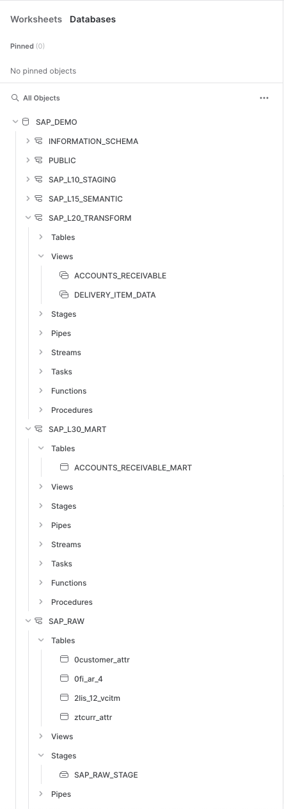


## Visualize your data flow!
Duration: 1

dbt automatically generates the model code, a DAG of your project, any tests you've added to a column, and enables you to annotate models, columns, and sources! This is critically important for lineage, impact analysis, troubleshooting, and just plain visibility into your project! 

To generate and serve your data flow:

1. From the terminal
```bash
$ dbt docs generate
```
2. Once the docs are generated, you will want to view them in the browser, so run this command:

```bash
$ dbt docs serve
```
This command can be rerun for every model and documentation change.

3. The browser window opens automatically. Otherwise navigate to [http://localhost:8080](http://localhost:8080)
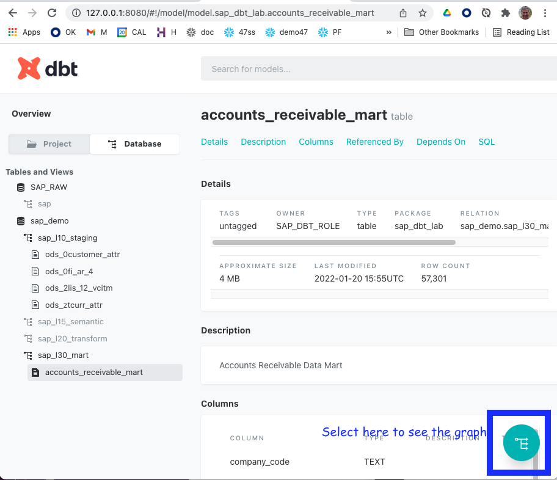

4. Select the data flow button in the bottom right to see the data flow:


You can access the lineage graph at any time using the graph button in the bottom right corner.
For more information see [here](https://docs.getdbt.com/docs/building-a-dbt-project/documentation)
## Track your DSO in Tableau
Duration: 5

Visualize your Days of Sales Outstanding (DSO) by geography and customer through this Tableau dashboard!


1. Launch Tableau Desktop. 
2. Navigate to `~/dbt_projects/sap-dbt-demo/tableau` and open `Account_Receivables.twbx_v1``

Alternatively you can launch from a command line:
/Applications/Tableau\ Desktop\ 2021.3.app/Contents/MacOS/Tableau -f ~/dbt_projects/sap-dbt-demo/tableau/Account_Receivables_v1.twbx

3. You are prompted for the password. Wait! You need to edit the connection first!

4. Select `Edit connection`  and adjust the connection settings to your instance:
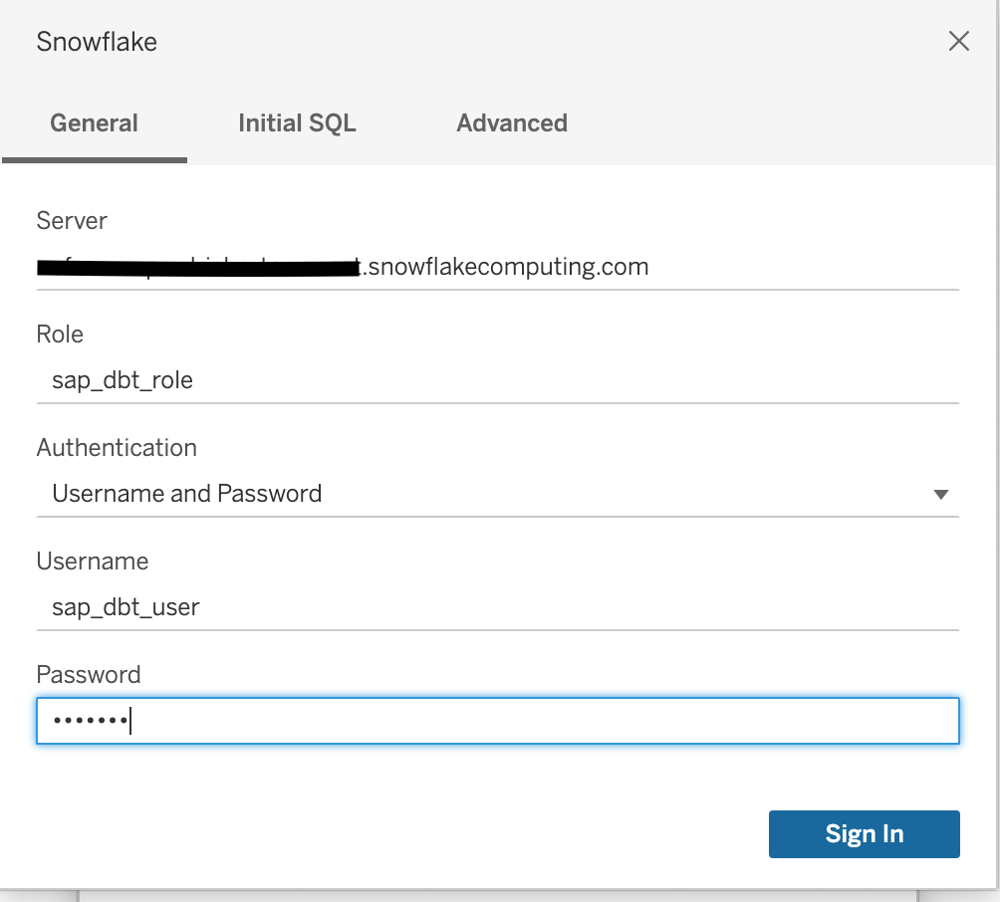
1. Select `Sign In`.

Once the connection is established you will be redirected to the main Dashboard visualizing the resulting data mart

<!-- ------------------------ -->

## Optional: Create Snowsight dashboard
Duration: 2

You can find some example queries in the analysis director of the project, for example for dso details analysis

```sql
SELECT 
  COMPANY_CODE
  , DOCUMENT_TYPE
  , DOCUMENT_NUMBER
  , POSTING_DATE
  , CLEARING_DATE
  , DEBIT_AMT_LOCAL_CURRENCY
  , STATUS
  , DSO 
FROM {{ ref('accounts_receivable_mart') }} 
WHERE DOCUMENT_TYPE='RV'
ORDER BY DEBIT_AMT_LOCAL_CURRENCY DESC;
```

## Conclusion
Duration: 1
Great job! This demo gives an example environment of how to transform SAP accounts receivable into a data mart.  

During this tutorial you learned following topics:
* Configuring your Snowflake account
* Installation and configuration of dbt
* Working with the dbt documentation
* Connecting a Tableau Dashboard
* Demonstrating SAP Accounts Receivable data


## Optional: Clean up environment

### Clean up Snowflake
Use the following commands in a Snowflake worksheet to permanently delete databases, warehouse, role and user.

```sql
USE ROLE accountadmin;
DROP DATABASE IF EXISTS sap_demo;
DROP WAREHOUSE IF EXISTS sap_dbt_wh;
DROP ROLE IF EXISTS sap_dbt_role;
DROP USER IF EXISTS sap_dbt_user;
```

### Clean up Local machine
1. Use pip uninstall to remove the dbt and packages. Run this before deleting the sap-dbt-demo directory if you want to delete the snowflake adapter and other directories, which are located under ~/anaconda/anaconda3/lib/python3.9/site-packages/dbt/.

```Bash
$ cd ~/dbt_projects/sap-dbt-demo
$ pip3 uninstall -r requirements.txt

Found existing installation: dbt-snowflake 1.0.0
Uninstalling dbt-snowflake-1.0.0:
  Would remove:
    ~/anaconda/anaconda3/lib/python3.9/site-packages/dbt/adapters/snowflake/*
    ~/anaconda/anaconda3/lib/python3.9/site-packages/dbt/include/snowflake/*
    ~/anaconda/anaconda3/lib/python3.9/site-packages/dbt_snowflake-1.0.0.dist-info/*
Proceed (Y/n)? Y
Successfully uninstalled dbt-snowflake-1.0.0
```
2. Removing the sap-dbt-demo package
To remove the demo package you can simply delete the directory `~/dbt_projects/sap-dbt-demo`

## Optional: SAP extractors
Duration: 15

There are [several tools on the market](https://medium.com/snowflake/if-extraction-from-sap-were-easy-b5f3d02f0ec9) to manage initial and delta extractions from SAP. This section simply gives a couple of example applications that extract data from SAP. 
<aside class="callout">
It is not required to perform the steps in the videos.
</aside>
### How to install Qlik Replicate to get data out of an SAP system:

<video id="EwhgASMXGR4"></video>

### How to use SNP Glue to get data out of an SAP systems:

<video id="PyybzHl6A3M"></video>

## [Appendix] Business Semantics
Duration: 10

All downstream descriptions and translation of the SAP columns are auto-generated. We used publicly available column information and consolidated them into a single machine-parsable csv file to generate the documentation. The used code can be found in the dbt project under the `/generators` folder.

To regenerate or extend the source documentation it is suggested to update the raw data and use the `generate_dbt_source.py` script. That script will lookup all available source tables and columns and add corresponding fields to the dbt documentation.

For further details on the available scripts please refer to the `README.md` in the generators folder or see the commented source code.

## Further reading

[SAP to Snowflake transformations](https://resources.snowflake.com/migration-guides/migrating-from-sap-to-snowflake)

[Connecting to SAP](https://medium.com/snowflake/if-extraction-from-sap-were-easy-b5f3d02f0ec9)

[Accelerating Data Teams with dbt Core & Snowflake](https://quickstarts.snowflake.com/guide/data_teams_with_dbt_core/index.html)

[Optimising hierarchical data in Snowflake](https://medium.com/@sasha.mitrovich/optimize-your-hierarchical-data-with-snowflake-part-one-508384b9b857)

[SAP currency conversion in Snowflake](https://medium.com/snowflake/curry-encies-never-tasted-so-good-36dcecfcd0bd)

 [How we (DBT) configure Snowflake by Fishtown Team](https://blog.getdbt.com/how-we-configure-snowflake/)

[Model Structure by GitLab team](https://about.gitlab.com/handbook/business-technology/data-team/platform/dbt-guide/#model-structure)
