author: Ivan Baranov
id: sas-to-snowflake-migration
summary: Migrate SAS Enterprise Guide projects, Data Integration Studio jobs, and BASE code to Snowflake using T1A Alchemist.
categories: getting-started, data-engineering, migrations, partner-integrations
environments: web
status: Published
feedback link: https://github.com/Snowflake-Labs/sfguides/issues
tags: SAS, Migration, T1A, Alchemist, Data Engineering, Snowpark, Notebooks
language: en

# SAS to Snowflake Migration

## 1. Introduction

This T1A Alchemist Quickstart Guide will demonstrate how to leverage Alchemist to accelerate the migration of your legacy SAS code to Snowflake. We'll be covering the 3 most frequently occurring types of SAS assets: 

- *SAS Enterprise Guide* projects
- *SAS Data Integration Studio* jobs
- *SAS BASE* code files

### Prerequisites

- Snowflake account (a free 30-day trial works perfectly)
- T1A Alchemist license (steps to obtain are outlined below)
- Basic familiarity with SQL and SAS concepts
- (Optional) Access to SAS tools:
    - SAS Enterprise Guide to preview the sample EG project and SAS BASE code
    - SAS Data Integration Studio to explore the sample job
    - SAS Studio to explore SAS BASE code

### What You'll Learn

By the end of this guide, you will know how to:

- Assess the scope and complexity of your SAS estate
- Convert SAS Enterprise Guide projects and SAS BASE code files to Snowflake-ready code
- Convert SAS Data Integration Studio jobs using a metadata-driven approach

## 2. Migration Overview

### Why migrate?

SAS has been at the core of enterprise data environments for decades. While it started as a statistical analysis platform, many organizations have come to rely on it far beyond analytics. It's common to find SAS powering full-scale data warehouses, complex ETL pipelines, and regulatory reporting workflows — often through tools like **SAS Data Integration Studio (SAS DI)** and **SAS Enterprise Guide (SAS EG)**. Over the years these environments have grown into mission-critical systems with hundreds or even thousands of jobs running daily.

However, maintaining a legacy SAS estate comes at a growing cost. Licensing is expensive, the talent pool is shrinking, and the platform was not designed for the modern cloud-native world. Snowflake offers a compelling alternative: near-unlimited scalability, separation of storage and compute, and all of that at pay-per-use pricing. Migrating to Snowflake lets your team consolidate data engineering, analytics, and data science workloads onto a single modern platform, while significantly reducing infrastructure overhead and operational complexity.

### Migration challenges: what to expect

Migrating from SAS to Snowflake might sound straightforward on the surface, given that SAS is just code and data flows. In reality, most organizations significantly underestimate the scope. Years of organic growth leave behind a tangled mess where the actual code is just the tip of the iceberg.

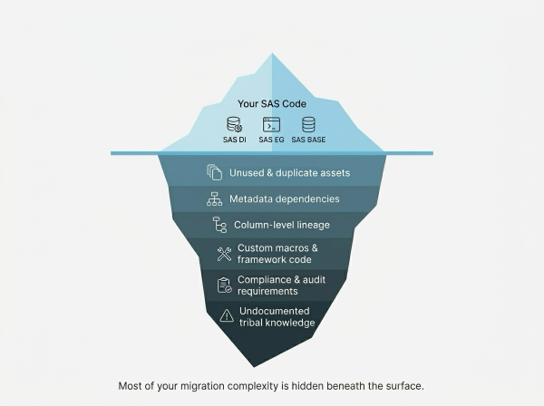

Beneath the surface lie hidden dependencies between jobs, undocumented macros, duplicate assets scattered across teams, and compliance constraints. Without full visibility into these layers, migration projects quickly spiral into missed deadlines and budget overruns. The bulk of the complexity of a migration project comes from uncovering the right scope for migration and coming up with a robust migration plan that takes all the different aspects into account.

> **The biggest risk in SAS migration isn't the code you can see — it's everything you can't. The right tools turn hidden complexity into a clear plan.**

Most of this hidden complexity can be uncovered and reduced with the right tooling. Rather than attempting to migrate everything at once, a structured approach lets you *filter out what's no longer needed*, *understand what remains*, and *convert only what matters*.

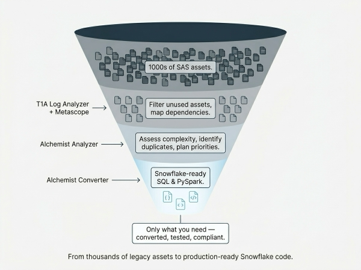

This is exactly the workflow that our toolkit is built around. **SAS Logs Analyzer** and **Metascope** help you see the full picture. **Alchemist Code Analyzer** tells you what you're actually dealing with. And **Alchemist Converter** turns it into production-ready Snowflake code.

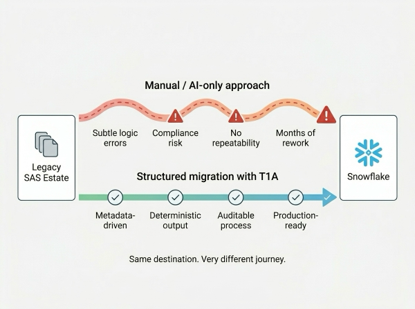

### Why not just use an AI?

With the rise of AI, it may be tempting to paste your SAS code into an LLM and ask for a translation. While LLMs are great for explaining code or quick prototyping, they often introduce subtle logic differences — a changed join order, unexpected null handling, slightly different rounding. In regulated industries, even minor deviations can mean a compliance violation. Additionally, with not a lot of SAS code available publicly, LLMs were not trained to understand it on a deep enough level - which leads to conversion mistakes.

> **LLMs can rewrite your code, but they can't guarantee consistency and compliance. Production migration demands repeatability and precision that pure AI alone cannot deliver.**

This is why Alchemist uses a combinaion of deterministic conversion logic and AI in a broader, structured conversion pipeline — not AI as the sole engine.

## 3. Prepare Your Environment

### Sign Up for Snowflake Trial

If you haven't already, register for a [Snowflake free 30-day trial](https://trial.snowflake.com/). The rest of the sections in this lab assume you are using a new Snowflake account created by registering for a trial.

After your first login, go to **Projects**, click **+ Add new**, and choose **SQL file**.

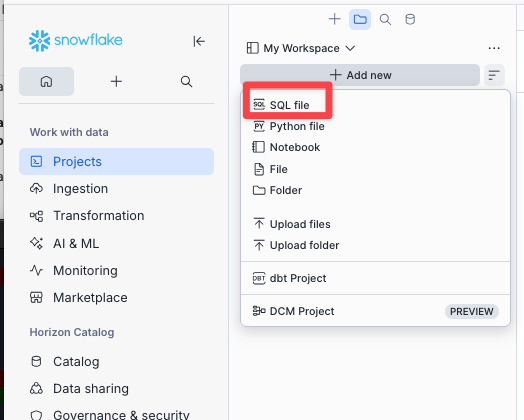

Paste and run the following to create the database all converted notebooks will use:

```sql
CREATE DATABASE IF NOT EXISTS LDEMO;
USE DATABASE LDEMO;
USE SCHEMA PUBLIC;
```

All three SAS libraries referenced in this lab (`LDEMO`, `LDEMODI`, `LMART`) map to `LDEMO.PUBLIC` — a single Snowflake database and schema is all you need.

### Sign Up for Alchemist Trial

Go to [app.getalchemist.io](https://app.getalchemist.io/), fill in your details, and submit the form. You will receive a license key by email within a few minutes — keep it to hand for the first run.

### Install Alchemist

Download the installer for your operating system from [getalchemist.io](https://getalchemist.io) and run it.

On **macOS**, add Alchemist to your PATH after installing:

```bash
export PATH="/Applications/Alchemist:$PATH"
```

To make this permanent, add the line above to your `~/.zshrc` or `~/.bash_profile`.

On **Windows**, the installer adds Alchemist to your PATH automatically. Open a new Command Prompt or PowerShell window after installation to pick up the change.

Verify the installation:

```bash
alchemist --version
```

On the first `alchemist` command that requires a license you will be prompted to enter the key from your registration email.

## 4. Explore SAS Artifacts

This tutorial uses three sample SAS artifacts that represent a typical insurance analytics estate.

- **`insurance.egp`** (EG Project) — end-to-end insurance workflow: risk tiering, premium ranking, claim enrichment, and adjuster reporting. Covers Sort, Query Builder, Rank, Transpose, Split, Append, and custom PROC SQL/DATA step tasks.
- **`quarterly_portfolio_review.sas`** (BASE Code) — parameterized quarterly review producing a multi-section ODS PDF: headline KPIs, policy mix, risk-band cross-tabs, and adjuster workload. Exercises PROC FORMAT, PROC SQL, PROC MEANS, PROC FREQ, PROC TABULATE, PROC SGPLOT, and ODS styling.
- **`di.spk`** (DI Job) — metadata-driven ETL that joins three operational tables into `MART.CLAIMS_ENRICHED`. Flow: Data Validation → SQL Join × 2 → Sort → Table Loader (Replace).

<!-- ------------------------ -->
## 5. Set Up the Lab

Create a working directory and download the sample SAS artifacts and configuration directly from this guide's published assets.

```bash
mkdir -p sas-to-snowflake-lab && cd sas-to-snowflake-lab

# Folder layout the convert commands expect
mkdir -p sas_artifacts/{enterprise_guide,data_integration,base_code} \
         data \
         output/{base_code,enterprise_guide,data_integration}

# Download lab files (alc_config.yml, SAS sources, sample CSVs)
BASE=https://raw.githubusercontent.com/ibaranov91/sfquickstarts/sas-to-snowflake-migration/site/sfguides/src/sas-to-snowflake-migration/assets
curl -sSL -o alc_config.yml                                         $BASE/alc_config.yml
curl -sSL -o sas_artifacts/enterprise_guide/insurance.egp           $BASE/eg_insurance.egp
curl -sSL -o sas_artifacts/data_integration/di.spk                  $BASE/di_insurance.spk
curl -sSL -o sas_artifacts/base_code/quarterly_portfolio_review.sas $BASE/quarterly_portfolio_review.sas
curl -sSL -o data/insurance_customers.csv                           $BASE/insurance_customers.csv
curl -sSL -o data/insurance_claims.csv                              $BASE/insurance_claims.csv
curl -sSL -o data/insurance_adjusters.csv                           $BASE/insurance_adjusters.csv
```

Two pieces of scaffolding worth understanding:

- **`alc_config.yml`** — picked up automatically by `alchemist` when run from this directory. It tells the converter to emit Jupyter notebooks (`output_format: ipynb`) instead of plain `.py` files, and maps the SAS librefs used in the samples (`LDEMO`, `LDEMODI`, `LMART`) all to `LDEMO.PUBLIC` in Snowflake.
- **`output/`** — three empty subfolders the convert commands write into. `alchemist convert -o` does not create the output directory itself, so they need to exist before you run it.

> **Note:** Alchemist performs static code analysis and does not require or process the CSV data — it only needs the SAS source files. The CSVs are loaded into Snowflake separately in step 7.1.

<!-- ------------------------ -->
## 6. Analyze SAS Artifacts

Before converting, run Alchemist Analyzer to get a breakdown of your SAS estate: file count, token volume, workload type mix, and the constructs that will need attention during conversion.

[In this video, you can see the capabilities of the Analyzer](https://www.youtube.com/watch?v=ZW_C88qXhFE)

### Analyze SAS BASE Code

```bash
alchemist analyze src ./sas_artifacts/base_code
```

The dashboard opens automatically at `http://127.0.0.1:10888`. The **Main** tab shows a project overview — token count, source file count, flagged tokens, and charts breaking down executable type and workload type.

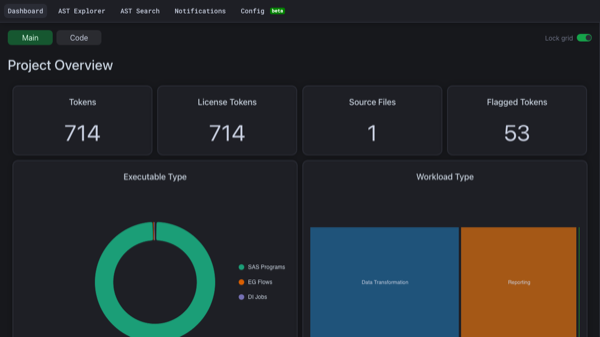

### Analyze an EG Project

```bash
alchemist analyze src ./sas_artifacts/enterprise_guide
```

When the source contains an EG project, the dashboard gains an **EG** tab alongside **Main**, showing the flow-level breakdown of tasks within each project.

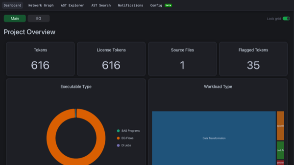

> **Note:** SPK files (SAS DI jobs) cannot be analyzed together with other file types in a single run. Analyze them separately: `alchemist analyze src ./sas_artifacts/data_integration`.

<!-- ------------------------ -->
## 7. SAS BASE Code

### 7.1 Import Source Data

The converted code reads from three tables — `INSURANCE_CUSTOMERS`, `INSURANCE_CLAIMS`, and `INSURANCE_ADJUSTERS`. Load them into Snowflake using the **Add Data** UI before running the converted code.

The CSV files are in the `data/` folder of the cloned repository.

Repeat the following steps for each of the three CSV files:

- In Snowsight under **Ingestion** select **Add Data**
- Choose **Load data into a Table**.
- Upload the CSV file from your local `data/` folder.
- Set the database to `LDEMO` and the schema to `PUBLIC`. The converted code references tables as `LDEMO.INSURANCE_*` so these names must match exactly.
- Use the filename as the table name: `insurance_customers`, `insurance_claims`, `insurance_adjusters`.

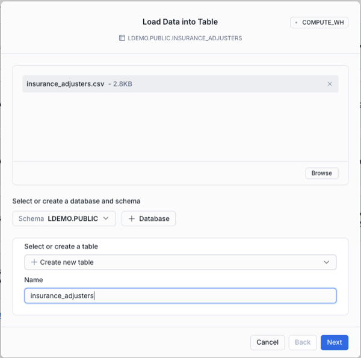

- On the next tab click "View options" and select "First line contains header" in the Header dropdown
- Let Snowflake infer the schema from the file, then confirm and **Load**

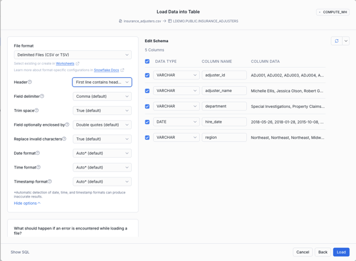

- After loading all 3 files your LDEMO.PUBLIC schema should look like that

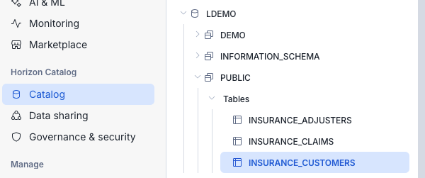

### 7.2 Convert

1. From your lab directory, run:

```bash
alchemist convert \
  -p insurance_review \
  -t spark \
  -o ./output/base_code \
  ./sas_artifacts/base_code
```

2. Open the converted notebook. Alchemist preserves the source-tree shape under your output directory, so the full path is:

    ```
    output/base_code/insurance_review_converted_files/Programs/sas_artifacts/base_code/quarterly_portfolio_review.ipynb
    ```

    Subsequent steps abbreviate this as `output/base_code/.../quarterly_portfolio_review.ipynb`.

3. Any construct Alchemist couldn't convert automatically is marked `# TODO:`. Reporting-only statements (`ODS`, `TITLE`, `FOOTNOTE`) can be deleted — they have no notebook equivalent.

### 7.3 Deploy

1. In Snowsight go to **Projects → Workspaces → + Add new → Notebook → Upload .ipynb file**. Select `output/base_code/.../quarterly_portfolio_review.ipynb`, name it, and click **Create**.

2. Click **Connect → + Create new service**, set **Idle timeout** to 30 minutes, and click **Create and connect**.

3. Add a **SQL cell** at the very top of the notebook:

```sql
USE DATABASE LDEMO;
USE SCHEMA PUBLIC;
```

4. In cell **"1. Imports"**, swap `SparkSession` for `snowpark_connect`:

```python
# Before
from pyspark.sql import SparkSession
from pyspark.sql.functions import desc, expr, when

# After
from snowflake import snowpark_connect
from pyspark.sql.functions import desc, expr, when
```

5. In cell **"2. Setup Spark session"**, replace the builder:

```python
# Before
spark = SparkSession.builder.config("spark.sql.ansi.enabled", True).getOrCreate()

# After
spark = snowpark_connect.server.init_spark_session()
```

6. Click **Run all**.

<!-- ------------------------ -->
## 8. EG Project

### 8.1 Convert

The sample project contains 15 task nodes across two parallel branches — a customer risk path and a claims enrichment path — that merge into a final reporting stage:

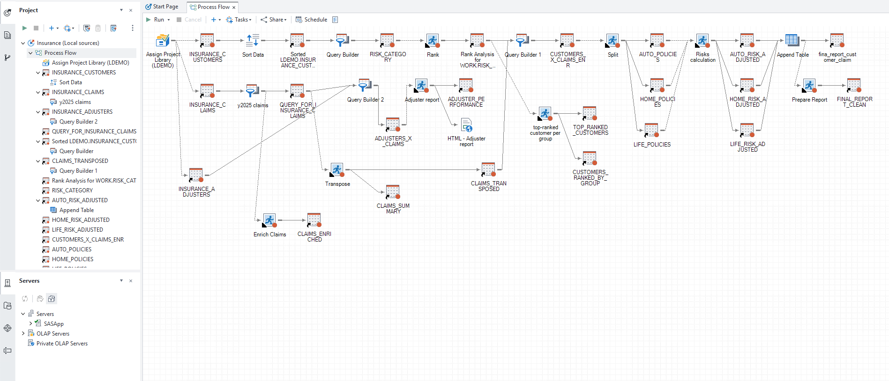

1. Run the converter:

```bash
alchemist convert \
  -p insurance_eg \
  -t spark \
  -o ./output/enterprise_guide \
  ./sas_artifacts/enterprise_guide
```

2. Open `output/enterprise_guide/.../insurance_Process_Flow.ipynb`. Delete the four cosmetic TODOs:

```python
# TODO: Unsupported node type <SASLibnameDef>     ← delete
# TODO: Unsupported node type <SASRunStatement>   ← delete
# TODO: Unsupported statement: TITLE              ← delete
# TODO: Unsupported statement: FOOTNOTE           ← delete
```

3. The Adjuster report task ends with `# TODO: Unsupported procedure PRINT`. Replace it with:

```python
df_adjuster_performance.show(20)
```

### 8.2 Deploy

The three source tables are already loaded in `LDEMO.PUBLIC` from step 7.1 — no additional data loading needed.

1. In Snowsight go to **Projects → Workspaces → Add new → Notebook → Upload .ipynb file**. Select `output/enterprise_guide/.../insurance_Process_Flow.ipynb`, name it `insurance_eg_flow`, and click **Create**.

2. Click **Connect** and select the compute service you already created.

3. Add a **SQL cell** at the very top:

```sql
USE DATABASE LDEMO;
USE SCHEMA PUBLIC;
```

4. In cell **"1. Imports"**, swap `SparkSession` for `snowpark_connect`:

```python
# Before
from pyspark.sql import SparkSession, Window
from pyspark.sql.functions import asc, col, desc, expr, row_number, when

# After
from snowflake import snowpark_connect
from pyspark.sql.functions import asc, col, desc, expr, row_number, when
from pyspark.sql import Window
```

5. In cell **"2. Setup Spark session"**, replace the builder:

```python
# Before
spark = SparkSession.builder.config("spark.sql.ansi.enabled", True).getOrCreate()

# After
spark = snowpark_connect.server.init_spark_session()
```

6. Click **Run all**.

<!-- ------------------------ -->
## 9. DI Job

### 9.1 Convert

1. Run the converter:

```bash
alchemist convert \
  -p insurance_di \
  -t spark \
  -o ./output/data_integration \
  ./sas_artifacts/data_integration
```

2. Open `output/data_integration/.../LOAD_CUSTOMER_RISK_MART.ipynb`. Find the `step2_Data_Validation` stub and replace it — the notebook will fail without this:

```python
# Before (stub — will crash at runtime)
def step2_Data_Validation(spark, df_input):
    # TODO: Unsupported Data/Data Validation transform <Data Validation> (node.sas_meta_id='A5JCJVA0.BW005NFI'). Convert manually or via a template.
    return (df_output1, df_output2)

# After
def step2_Data_Validation(spark, df_input):
    from pyspark.sql.functions import col
    df_output1 = df_input.filter(
        (col("CLAIM_AMOUNT") > 0) & col("ADJUSTER_ID").isNotNull()
    )
    df_output2 = df_input.subtract(df_output1)
    return (df_output1, df_output2)
```

### 9.2 Deploy

1. In Snowsight go to **Projects → Workspaces → + Add new → Notebook → Upload .ipynb file**. Select `output/data_integration/.../LOAD_CUSTOMER_RISK_MART.ipynb`, name it `load_customer_risk_mart`, and click **Create**.

2. Click **Connect** and select the compute service you already created.

3. Add a **SQL cell** at the very top:

```sql
USE DATABASE LDEMO;
USE SCHEMA PUBLIC;
```

4. In cell **"1. Imports"**, swap `SparkSession` for `snowpark_connect`:

```python
# Before
from pyspark.sql import SparkSession
from pyspark.sql.functions import asc, col, desc

# After
from snowflake import snowpark_connect
from pyspark.sql.functions import asc, col, desc
```

5. In cell **"2. Setup Spark session"**, replace the builder:

```python
# Before
spark = SparkSession.builder.config("spark.sql.ansi.enabled", True).getOrCreate()

# After
spark = snowpark_connect.server.init_spark_session()
```

6. Click **Run all**. Once complete, open **Database Explorer → LDEMO → PUBLIC → CLAIMS_ENRICHED** to verify the output.

<!-- ------------------------ -->
## 10. Conclusion

Congratulations — you have completed the full SAS-to-Snowflake migration workflow using T1A Alchemist.

### What you learned

- **Assess**: how to use Alchemist Analyzer to build a complete, dependency-aware picture of a SAS estate before writing a single line of SQL.
- **Convert**: how to migrate all three major SAS asset types (Enterprise Guide projects, Data Integration Studio jobs, and BASE code files) to Snowflake-ready SQL and Snowpark notebooks.

Validation of the converted code outside the scope of this guide, but T1A provides a dedicated validation framework that automatically compares the output of original SAS code against the converted Snowflake code — row by row, column by column — to confirm logical equivalence. This is especially important for regulated workloads where manual spot-checking is not sufficient.

### Why Alchemist

Manual SAS migration is slow, error-prone, and expensive. Alchemist shortens the cycle significantly by automating the parts that can be automated — syntax translation, dependency mapping, and notebook scaffolding — while keeping a human in the loop for the logic that requires review. Key advantages:

- **Repeatability**: the same pipeline produces consistent output across hundreds or thousands of assets.
- **Auditability**: every conversion decision is traceable, so compliance and QA teams can verify the migration rather than trust it.
- **AI with guardrails**: LLMs are used as one layer inside a structured pipeline, not as a free-form translator. This prevents the\ logic errors that plague purely generative approaches on regulated workloads.

### Next steps

- Explore the [T1A Alchemist documentation](https://docs.getalchemist.io) for advanced converter templates and batch-conversion workflows.
- Run Alchemist Analyzer against your own SAS estate to get a complexity and effort estimate before committing to a full migration project.
- Reach out to [T1A](https://www.getalchemist.io) if you need help scoping or accelerating a production migration.

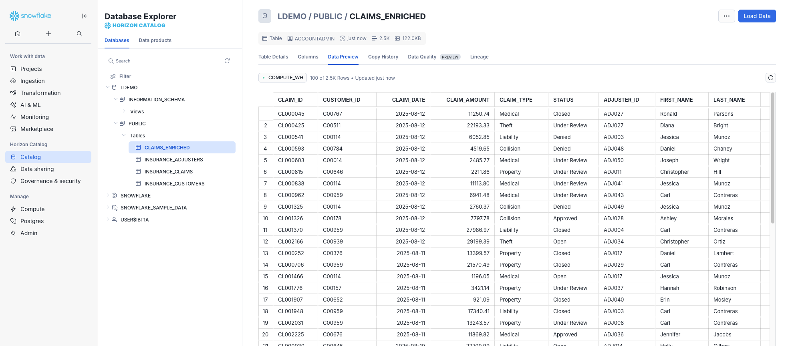
