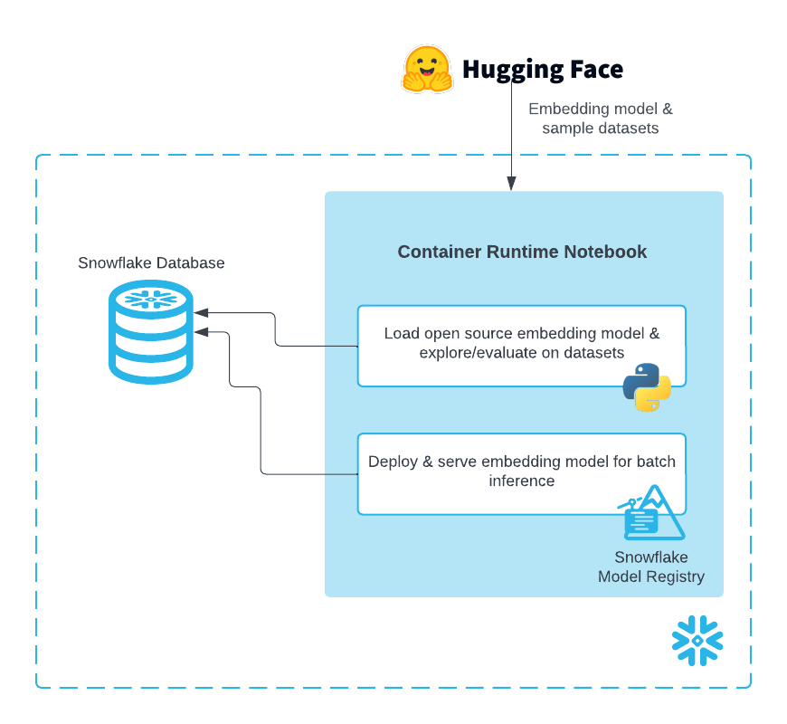
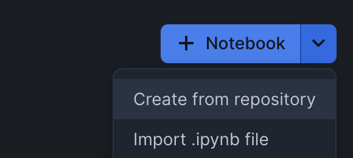
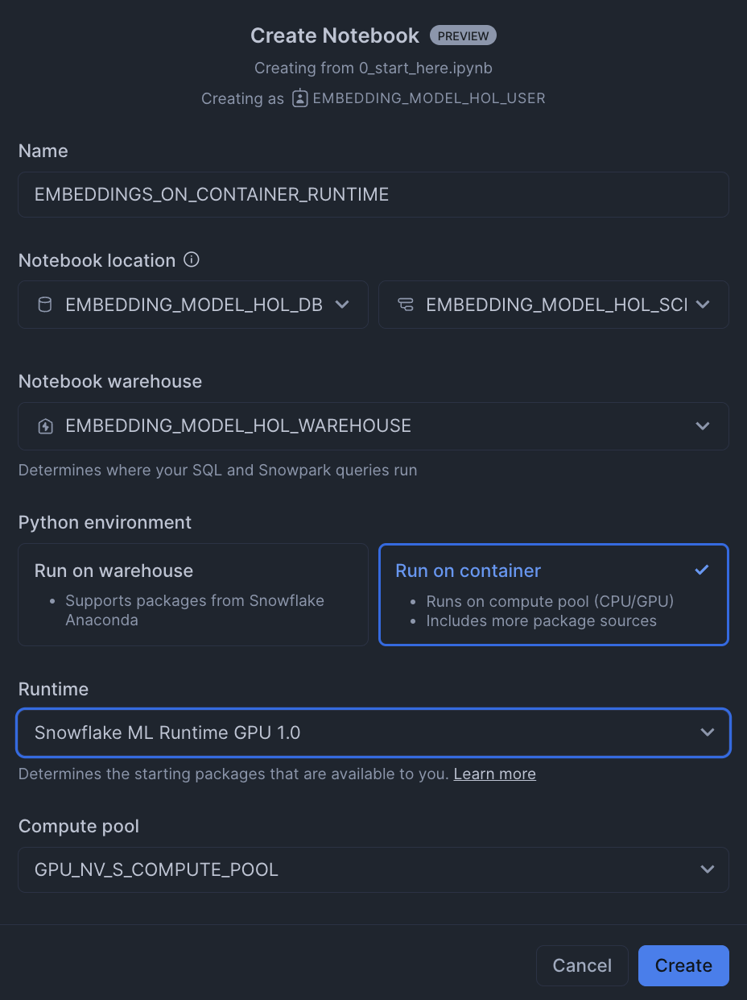
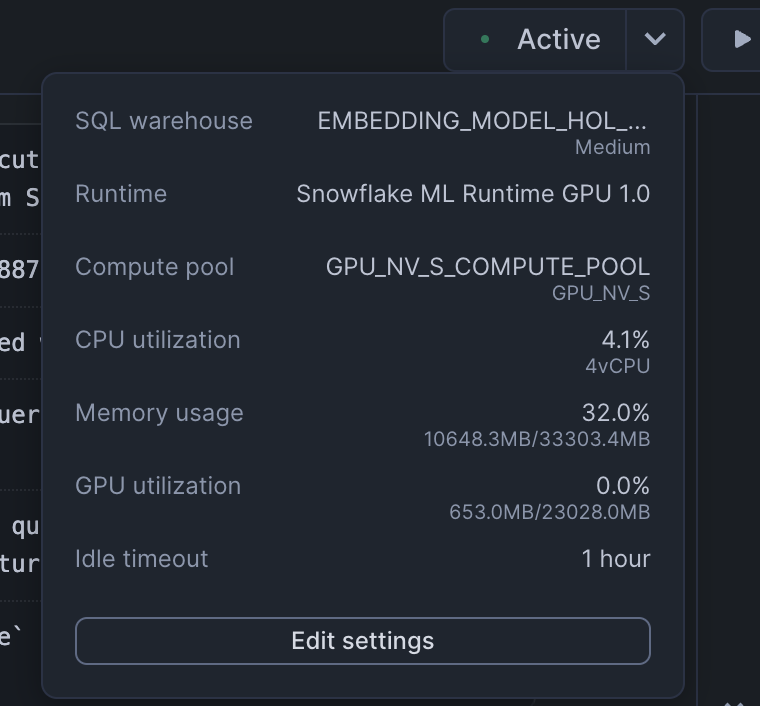
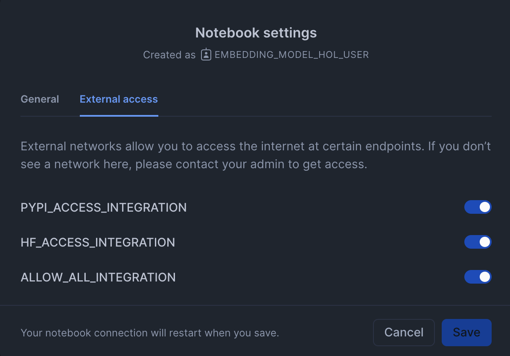
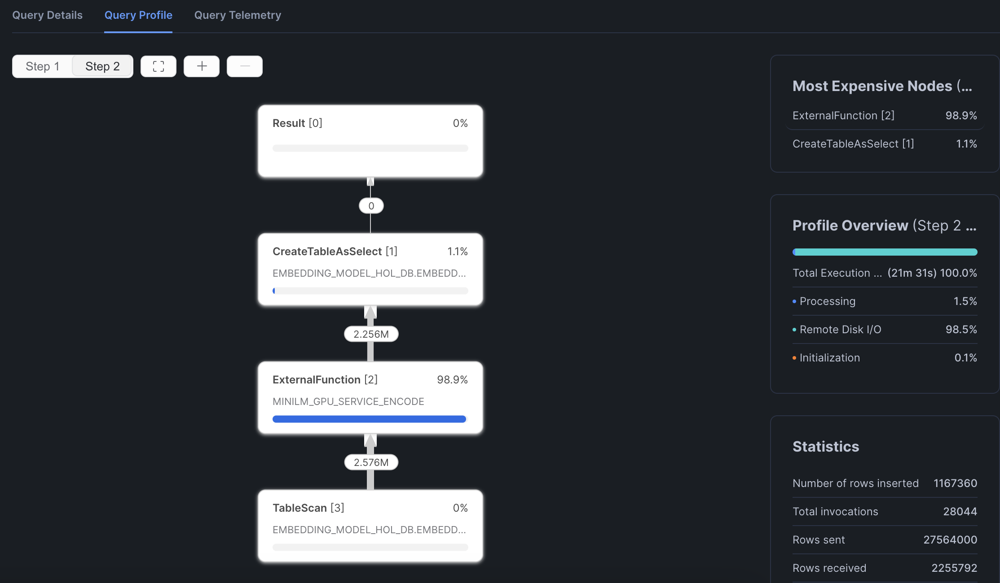

author: Sikha Das
id: scale-embeddings-with-snowflake-notebooks-on-container-runtime
categories: snowflake-site:taxonomy/solution-center/certification/quickstart, snowflake-site:taxonomy/solution-center/certification/certified-solution, snowflake-site:taxonomy/solution-center/includes/architecture, snowflake-site:taxonomy/product/data-engineering
language: en
summary: This guide will show you how to experiment with and scale embeddings generation in Snowflake Notebooks with Container Runtime 
environments: web
status: Published 
feedback link: https://github.com/Snowflake-Labs/sfguides/issues


# Scale Embeddings with Snowflake Notebooks on Container Runtime
<!-- ------------------------ -->
## Overview 


[Snowflake Notebooks in the Container Runtime](https://docs.snowflake.com/en/user-guide/ui-snowsight/notebooks-on-spcs) are a powerful IDE option for building ML workloads at scale. Container Runtime is a fully managed container environment that supports building and operationalizing a wide variety of resource-intensive ML workflows entirely within Snowflake. Using Snowflake Notebooks in Container Runtime gives you access to distributed processing on both CPUs and GPUs, optimized data loading from Snowflake, automatic lineage capture and Model Registry integration. Container Runtime also provides flexibility to leverage a set of preinstalled packages or the ability to pip install any open-source package of choice.  

This guide will show you how to experiment with and scale embeddings generation in Snowflake Notebooks on Container Runtime.

### Prerequisites
- A Snowflake Account. Sign up for a [30-day free trial](https://signup.snowflake.com/?utm_source=snowflake-devrel&utm_medium=developer-guides&utm_cta=developer-guides) account, if required. 
- Foundational knowledge of Data Science workflows
- (Optional) Completed [Getting Started with Snowflake Notebook Container Runtime](/en/developers/guides/notebook-container-runtime/)

### What You’ll Learn
- How to load an open source embedding model
- How to generate embeddings using GPU compute with Snowflake Notebooks on Container Runtime
- How to evalulate the embeddings for RAG
- How to store embeddings as a Vector Type in a Snowflake table
- How to log and deploy the open source embedding model using Model Registry and Model Serving in SPCS
- How to perform a large batch embeddings generation (inference) job using Model Serving in SPCS

### What You’ll Build 
You're a Data Scientist looking to experiment with an open source embedding model and evaluate a dataset with it before deciding to deploy it for a large batch embeddings generation (inference) job.

- In the first part of this Notebook, you will first load an embedding model and generate embeddings using a GPU on a sample dataset (~68K records). 

- In the second part, you will evaluate a sampled RAG dataset (100K records) that has various questions and associated context chunks ("labels"). After evaluation, you will deploy the embedding model and perform inference on the full RAG dataset (~10M context chunks).



<!-- ------------------------ -->
## Setup Your Account


Complete the following steps to setup your account:
- Navigate to Worksheets, click "+" in the top-right corner to create a new Worksheet, and choose "SQL Worksheet".
- Paste the [setup.sql](https://github.com/Snowflake-Labs/sfguide-scale-embeddings-with-snowflake-notebooks-on-container-runtime/blob/main/scripts/setup.sql) code in the worksheet.
- Run all commands to create Snowflake objects

```sql
USE ROLE ACCOUNTADMIN;
SET USERNAME = (SELECT CURRENT_USER());
SELECT $USERNAME;

-- Using ACCOUNTADMIN, create a new role for this exercise and grant to applicable users
CREATE OR REPLACE ROLE EMBEDDING_MODEL_HOL_USER;
GRANT ROLE EMBEDDING_MODEL_HOL_USER to USER identifier($USERNAME);

-- Next create a new database and schema,
CREATE DATABASE IF NOT EXISTS EMBEDDING_MODEL_HOL_DB;
CREATE SCHEMA IF NOT EXISTS EMBEDDING_MODEL_HOL_SCHEMA;

-- Create network rule and external access integration for pypi to allow users to pip install python packages within notebooks (on container runtimes)
CREATE NETWORK RULE IF NOT EXISTS pypi_network_rule
  MODE = EGRESS
  TYPE = HOST_PORT
  VALUE_LIST = ('pypi.org', 'pypi.python.org', 'pythonhosted.org',  'files.pythonhosted.org');

CREATE EXTERNAL ACCESS INTEGRATION IF NOT EXISTS pypi_access_integration
  ALLOWED_NETWORK_RULES = (pypi_network_rule)
  ENABLED = true;

-- Create network rule and external access integration for users to access data and models from Hugging Face
CREATE OR REPLACE NETWORK RULE hf_network_rule
  MODE = EGRESS
  TYPE = HOST_PORT
  VALUE_LIST = ('huggingface.co', 'www.huggingface.co', 'cdn-lfs.huggingface.co', 'cdn-lfs-us-1.huggingface.co');

CREATE EXTERNAL ACCESS INTEGRATION IF NOT EXISTS hf_access_integration
  ALLOWED_NETWORK_RULES = (hf_network_rule)
  ENABLED = true;

create or replace network rule allow_all_rule
  TYPE = 'HOST_PORT'
  MODE= 'EGRESS'
  VALUE_LIST = ('0.0.0.0:443','0.0.0.0:80');

CREATE OR REPLACE EXTERNAL ACCESS INTEGRATION allow_all_integration
  ALLOWED_NETWORK_RULES = (allow_all_rule)
  ENABLED = true;
  
GRANT USAGE ON INTEGRATION pypi_access_integration TO ROLE EMBEDDING_MODEL_HOL_USER;
GRANT USAGE ON INTEGRATION hf_access_integration TO ROLE EMBEDDING_MODEL_HOL_USER;
GRANT USAGE ON INTEGRATION allow_all_integration TO ROLE EMBEDDING_MODEL_HOL_USER;

-- Create a snowpark optimized virtual warehouse access of a virtual warehouse for newly created role
CREATE OR REPLACE WAREHOUSE EMBEDDING_MODEL_HOL_WAREHOUSE WITH
  WAREHOUSE_SIZE = 'MEDIUM';
  
GRANT USAGE ON WAREHOUSE EMBEDDING_MODEL_HOL_WAREHOUSE to ROLE EMBEDDING_MODEL_HOL_USER;

-- Create compute pool to leverage GPUs (see docs - https://docs.snowflake.com/en/developer-guide/snowpark-container-services/working-with-compute-pool)

--DROP COMPUTE POOL IF EXISTS GPU_NV_S_COMPUTE_POOL;

CREATE COMPUTE POOL IF NOT EXISTS GPU_NV_S_COMPUTE_POOL
    MIN_NODES = 4
    MAX_NODES = 4
    INSTANCE_FAMILY = GPU_NV_S;

-- Grant usage of compute pool to newly created role
GRANT OWNERSHIP ON COMPUTE POOL GPU_NV_S_COMPUTE_POOL TO ROLE EMBEDDING_MODEL_HOL_USER;

-- Grant ownership of database and schema to newly created role
GRANT OWNERSHIP ON DATABASE EMBEDDING_MODEL_HOL_DB TO ROLE EMBEDDING_MODEL_HOL_USER COPY CURRENT GRANTS;
GRANT OWNERSHIP ON ALL SCHEMAS IN DATABASE EMBEDDING_MODEL_HOL_DB  TO ROLE EMBEDDING_MODEL_HOL_USER COPY CURRENT GRANTS;

-- Grant usage back to ACCOUNTADMIN for visibility/usability
GRANT ALL ON DATABASE EMBEDDING_MODEL_HOL_DB TO ROLE ACCOUNTADMIN;
GRANT ALL ON ALL SCHEMAS IN DATABASE EMBEDDING_MODEL_HOL_DB  TO ROLE ACCOUNTADMIN;

-- Create image repository
CREATE IMAGE REPOSITORY IF NOT EXISTS my_inference_images;
GRANT OWNERSHIP ON IMAGE REPOSITORY my_inference_images TO ROLE EMBEDDING_MODEL_HOL_USER;

GRANT CREATE SERVICE ON SCHEMA EMBEDDING_MODEL_HOL_SCHEMA TO ROLE EMBEDDING_MODEL_HOL_USER;
```

<!-- ------------------------ -->
## Run the Notebook


- Download the notebook: [0_start_here](https://github.com/Snowflake-Labs/sfguide-scale-embeddings-with-snowflake-notebooks-on-container-runtime/blob/main/notebooks/0_start_here.ipynb)
- Change role to `EMBEDDING_MODEL_HOL_USER`
- Navigate to `Projects` > `Notebooks` in Snowsight
- Click `Import .ipynb` from the + Notebook dropdown

- Create a new notebok with the following settings:

- Click the three dots in the top right > `Notebook Settings`

- Enable external access integrations

- Run cells in the notebook!
> Once you reach the end, you'll kick off a batch embeddings inference job and will be able to see something like this in your query profile:


<!-- ------------------------ -->
## Conclusion And Resources


In conclusion, running Snowflake Notebooks on Container Runtime offers a robust and flexible infrastructure for managing large-scale, advanced data science and machine learning workflows directly within Snowflake. 

Within this Notebook, you:
- loaded an embedding model, generated embeddings using a GPU
- evaluated a dataset for a RAG solution 
- deployed the embedding model
- performed large scale batch inference
- saved results to a Snowflake table 

...and all without a lot of complex infrastructure setup and management!

Ready for more? After you complete this quickstart, you can try one of the following more advanced quickstarts:
- [Getting Started with Running Distributed PyTorch Models on Snowflake](/en/developers/guides/getting-started-with-running-distributed-pytorch-models-on-snowflake/).
- [Defect Detection Using Distributed PyTorch With Snowflake Notebooks](/en/developers/guides/defect-detection-using-distributed-pytorch-with-snowflake-notebooks/)

### Related Resources
- [Documentation: Container Runtime for ML](https://docs.snowflake.com/en/developer-guide/snowflake-ml/container-runtime-ml)
- [Documentation: Snowflake Model Registry](https://docs.snowflake.com/en/developer-guide/snowflake-ml/model-registry/overview)
- [Documentation: Model Serving in SPCS](https://docs.snowflake.com/en/developer-guide/snowflake-ml/model-registry/container)
- [Intro Quickstart: Getting Started with Snowflake Notebook Container Runtime](/en/developers/guides/notebook-container-runtime/)
- [Snowflake ML Webpage](/en/data-cloud/snowflake-ml/)
- [Fork Repo on GitHub](https://github.com/Snowflake-Labs/sfguide-scale-embeddings-with-snowflake-notebooks-on-container-runtime/tree/main)
- [Download Reference Architecture](https://quickstarts.snowflake.com/guide/scale-embeddings-with-snowflake-notebooks-on-container-runtime/img/d7e8912c0a95ae06.png?_ga=2.243977933.970314110.1758562613-1806211272.1741193538&_gac=1.82971236.1758675992.CjwKCAjwisnGBhAXEiwA0zEOR1sIXOVV_EsVJWwLfve5dvv0oNT7nVRSlx19ZM16B3Kj1k4neCKwLxoCf70QAvD_BwE)
- [Watch Demo](https://youtu.be/uvLiJtfNd-M?list=TLGGdqmu7qRGY9gyNDA5MjAyNQ)
