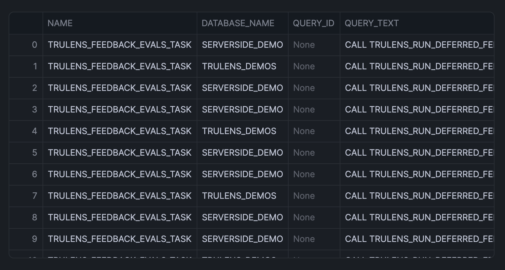
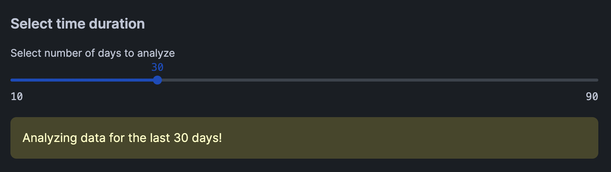
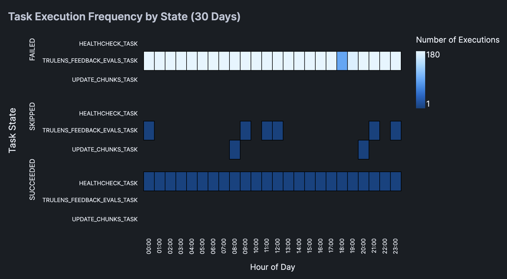
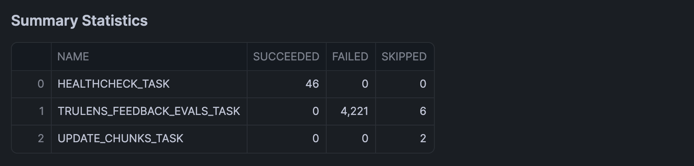

author: Chanin Nantasenamat
id: scheduled-query-report
categories: snowflake-site:taxonomy/solution-center/certification/quickstart, snowflake-site:taxonomy/product/analytics, snowflake-site:taxonomy/product/data-engineering
language: en
summary: Build an interactive report to analyze failed or long-running scheduled queries using Snowflake Notebooks with Streamlit integration.
environments: web
status: Published
feedback link: https://github.com/Snowflake-Labs/sfguides/issues


# Build an Interactive Scheduled Query Execution Report
<!-- ------------------------ -->
## Overview

Learn how to create an interactive report for monitoring and analyzing scheduled query executions in Snowflake. Using Snowflake Notebooks with Streamlit integration, you'll build a dashboard that provides insights into query performance, failure patterns, and execution timing.

### What You'll Learn
- How to retrieve and analyze scheduled query execution data
- Creating interactive visualizations with Streamlit in Snowflake Notebooks
- Building heatmaps to visualize query execution patterns
- Analyzing query performance and failure metrics

### What You'll Build
An interactive dashboard featuring:
- Time-based filtering of query execution data
- Heatmap visualization of query execution patterns
- Summary statistics for task execution states

### What You'll Need
- Access to a [Snowflake account](https://signup.snowflake.com/?utm_source=snowflake-devrel&utm_medium=developer-guides&utm_cta=developer-guides)
- Basic familiarity with SQL and Python
- Understanding of Snowflake tasks and scheduled queries

<!-- ------------------------ -->
## Setup

### Download the Notebook
Firstly, to follow along with this quickstart, you can click on [Scheduled_Query_Execution_Report.ipynb](https://github.com/Snowflake-Labs/snowflake-demo-notebooks/blob/main/Scheduled_Query_Execution_Report/Scheduled_Query_Execution_Report.ipynb) to download the Notebook from GitHub.

### Python Packages
Snowflake Notebooks comes pre-installed with common Python libraries for data science and machine learning, including numpy, pandas, matplotlib, and more! For additional packages, simply click on the Packages drop-down in the top right corner of your notebook.

<!-- ------------------------ -->
## Retrieve Query Execution Data

### Write the SQL Query
Create a query to fetch execution history from the `task_history` view (this SQL cell is named `sql_data`, which we'll call upon shortly):

```sql
SELECT 
    name,
    database_name,
    query_id,
    query_text,
    schema_name,
    scheduled_time,
    query_start_time,
    completed_time,
    DATEDIFF('second', query_start_time, completed_time) as execution_time_seconds,
    state,
    error_code,
    error_message
FROM snowflake.account_usage.task_history
WHERE scheduled_time >= DATEADD(days, -1, CURRENT_TIMESTAMP())
ORDER BY scheduled_time DESC;
```

This returns the following output:



### Convert to DataFrame
Transform the SQL results into a Pandas DataFrame, which we'll soon use in the query execution report app:

```python
sql_data.to_pandas()
```

## Build Query Execution Report

### Create Interactive Interface

Here, we'll create an interactive slider for dynamically selecting the number of days to analyze. This would then trigger the filtering of the DataFrame to the specified number of days.

```python
import pandas as pd
import streamlit as st
import altair as alt

# Create date filter slider
st.subheader("Select time duration")
days = st.slider('Select number of days to analyze', 
                 min_value=10, 
                 max_value=90, 
                 value=30, 
                 step=10)
```

This produces the following interactive slider widget that allow users to select the number of days:



### Data Preparation

Next, we'll reshape the data by calculating the frequency count by hour and task name, which will subsequently be used for creating the heatmap in the next step.

```python
# Filter data according to day duration
latest_date = pd.to_datetime(df['SCHEDULED_TIME']).max()
cutoff_date = latest_date - pd.Timedelta(days=days)
filtered_df = df[pd.to_datetime(df['SCHEDULED_TIME']) > cutoff_date].copy()
    
# Prepare data for heatmap
filtered_df['HOUR_OF_DAY'] = pd.to_datetime(filtered_df['SCHEDULED_TIME']).dt.hour
filtered_df['HOUR_DISPLAY'] = filtered_df['HOUR_OF_DAY'].apply(lambda x: f"{x:02d}:00")
    
# Calculate frequency count by hour and task name
agg_df = filtered_df.groupby(['NAME', 'HOUR_DISPLAY', 'STATE']).size().reset_index(name='COUNT')

st.warning(f"Analyzing data for the last {days} days!")
```

### Data Visualization

Now, we'll create a heatmap and display summary statistics table that will allow us to gain insights on the task name and their corresponding state (e.g. `SUCCEEDED`, `FAILED`, `SKIPPED`).

```python
chart = alt.Chart(agg_df).mark_rect(
    stroke='black',
    strokeWidth=1
).encode(
    x=alt.X('HOUR_DISPLAY:O', 
            title='Hour of Day',
            axis=alt.Axis(
                labels=True,
                tickMinStep=1,
                labelOverlap=False
            )),
    y=alt.Y('NAME:N', 
            title='',
            axis=alt.Axis(
                labels=True,
                labelLimit=200,
                tickMinStep=1,
                labelOverlap=False,
                labelPadding=10
            )),
    color=alt.Color('COUNT:Q', 
                    title='Number of Executions'),
    row=alt.Row('STATE:N', 
                title='Task State',
                header=alt.Header(labelAlign='left')),
    tooltip=[
        alt.Tooltip('NAME', title='Task Name'),
        alt.Tooltip('HOUR_DISPLAY', title='Hour'),
        alt.Tooltip('STATE', title='State'),
        alt.Tooltip('COUNT', title='Number of Executions')
    ]
).properties(
    height=100,
    width=450
).configure_view(
    stroke=None,
    continuousWidth=300
).configure_axis(
    labelFontSize=10
)

# Display the chart
st.subheader(f'Task Execution Frequency by State ({days} Days)')
st.altair_chart(chart)
```

Here's the resulting heatmap:



### Add Summary Statistics
Finally, we'll calculate the summary statistics of execution history using `groupby()` and `agg()` functions, which we'll display in a table format using `st.dataframe()`:

```python
st.subheader("Summary Statistics")
summary_df = filtered_df.groupby('NAME').agg({
    'STATE': lambda x: pd.Series(x).value_counts().to_dict()
}).reset_index()

# Format the state counts as separate columns
state_counts = pd.json_normalize(summary_df['STATE']).fillna(0).astype(int)
summary_df = pd.concat([summary_df['NAME'], state_counts], axis=1)

st.dataframe(summary_df)
```

And here's the DataFrame:


In the above example, we've incrementally built the query execution report in chunks. It should however be mentioned that instead, we could have also piece together all the code blocks mentioned above to generate the interactive query execution report in one run.           

## Conclusion And Resources

Congratulations! You've successfully built an interactive dashboard for analyzing scheduled query executions in Snowflake. This tool will help you monitor query performance and identify potential issues in your scheduled tasks.

### What You Learned
- Retrieved and analyzed query execution data from Snowflake
- Created an interactive time-based filter using Streamlit
- Built a heatmap visualization
- Generated summary statistics for task execution states

### Related Resources

Articles:
- [Account Usage Views](https://docs.snowflake.com/en/sql-reference/account-usage)
- [Task History View](https://docs.snowflake.com/en/sql-reference/account-usage/task_history)
- [Using Notebooks with Snowflake](https://docs.snowflake.com/en/user-guide/ui-snowsight/notebooks-use-with-snowflake)

Documentation:
- [Snowflake Documentation](https://docs.snowflake.com/)
- [Streamlit Documentation](https://docs.streamlit.io/)

Happy coding!
