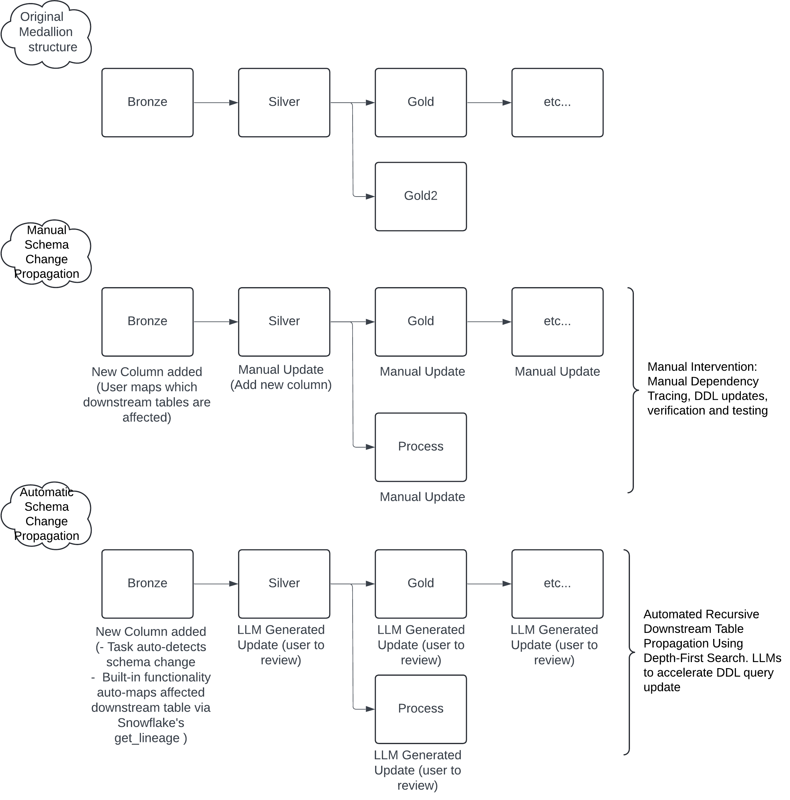
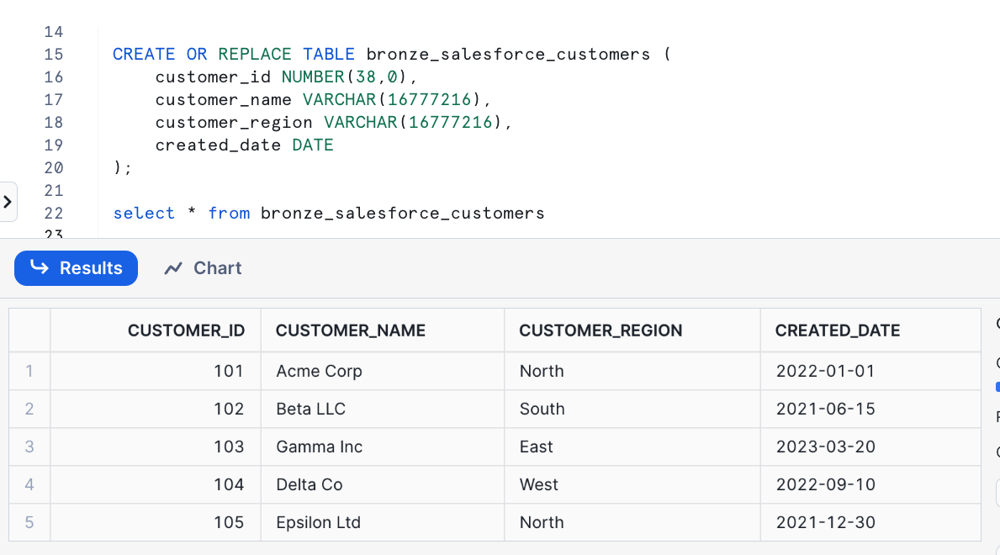
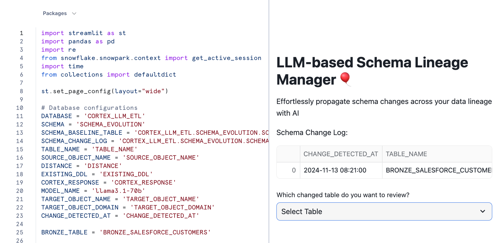
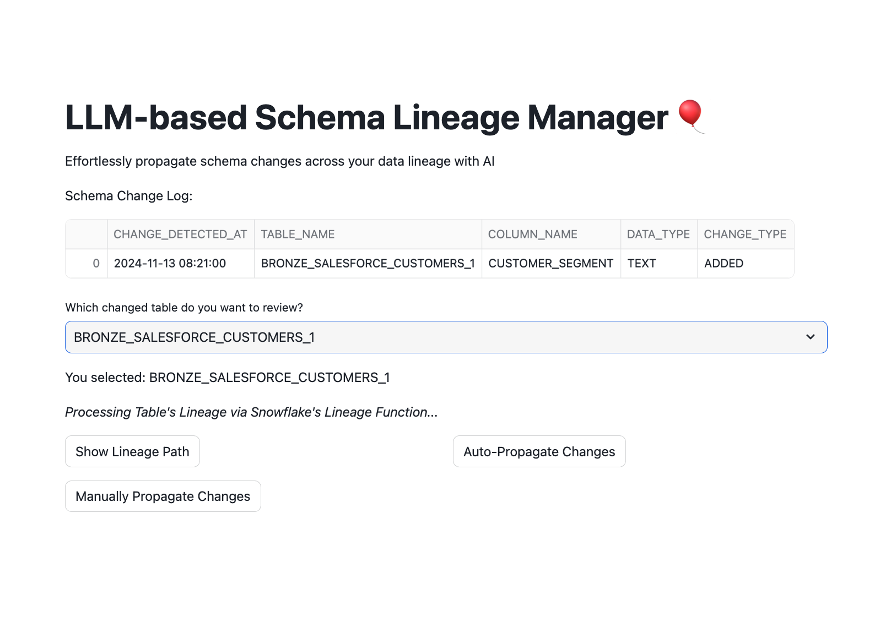
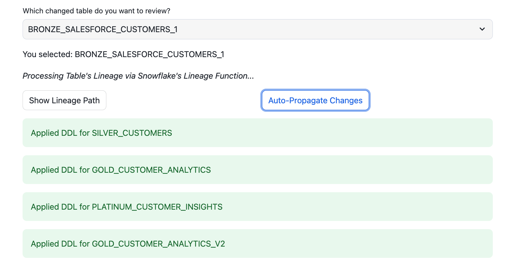
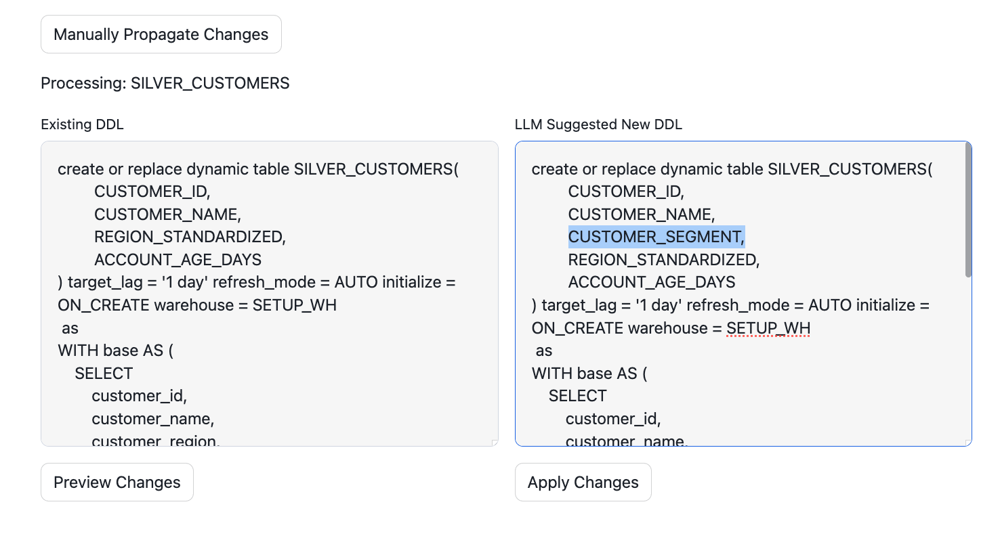
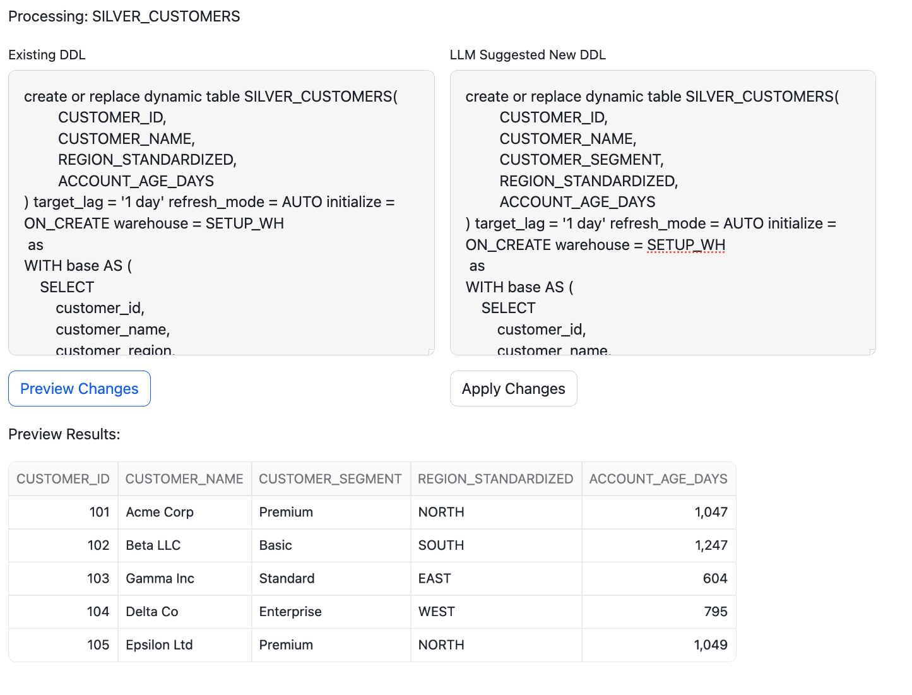
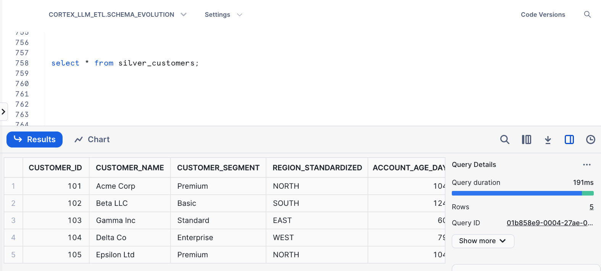

author: Haebichan Jung
summary: A ETL-LLM Integration Guide: Automate and Ensure Consistent Schema Change Propagation using AI 
id: schema-lineage-auto-propagation-llm
categories: snowflake-site:taxonomy/solution-center/certification/quickstart, snowflake-site:taxonomy/solution-center/certification/partner-solution, snowflake-site:taxonomy/product/ai, snowflake-site:taxonomy/product/data-engineering, snowflake-site:taxonomy/snowflake-feature/snowpark-container-services, snowflake-site:taxonomy/snowflake-feature/dynamic-tables
language: en
status: Published
Feedback Link: https://github.com/Snowflake-Labs/sfguides/issues


# A ETL-LLM Integration Guide: Automate and Ensure Consistent Schema Change Propagation using AI

<!-- ------------------------ -->

## Overview

Schema changes in upstream tables, like new fields from sources like Salesforce, must be carefully propagated to all downstream tables. Data Engineers manually tracking and updating each affected table is time-consuming and error-prone, often leading to broken pipelines and data inconsistencies. This guide leverages AI-powered automation to streamline schema propagation, ensuring accurate and consistent updates across data lineage, minimizing errors, and saving valuable time for data engineers.

### Prerequisites
- Familiarity with SQL and Snowflake
- Basic knowledge of data lineage concepts

### What You’ll Build
A powerful solution for automated schema propagation that combines Snowflake’s processing capabilities with the intelligence of LLMs, enabling end-to-end lineage management. By the end of this guide, you’ll have a framework that detects schema changes in upstream tables and ensures their propagation downstream with AI precision.

### What You’ll Need
- A [Snowflake](https://signup.snowflake.com/?utm_source=snowflake-devrel&utm_medium=developer-guides&utm_cta=developer-guides) Account
- Streamlit in Snowflake 

### What You’ll Learn
- How to create an LLM-powered lineage manager that autonomously handles schema evolution across downstream tables
- Leveraging LLMs to automatically assess and adapt DDL changes, simplifying complex workflows
- Using Snowflake tasks for continuous schema monitoring
- Building an intuitive UI with Streamlit for managing schema propagation


---

## Application Architecture 

This solution leverages the intelligence of LLMs to dynamically analyze and respond to schema changes, creating a seamless flow of information across your data pipeline. The architecture of this application includes:

1. **Upstream and Downstream Tables in Snowflake**: A series of tables that form a lineage, where updates in upstream tables must cascade downstream.
2. **LLM-Powered Schema Analysis**: The core engine uses LLMs to generate and apply appropriate DDL (Data Definition Language) modifications, ensuring the consistency of schema changes across all affected tables.
3. **Schema Change Monitor**: A Snowflake task that continuously tracks schema alterations in upstream tables and logs any detected changes.
4. **Streamlit-based UI**: Provides an accessible, intuitive interface to monitor and manage schema propagation, showcasing LLM-suggested DDL changes for review and approval.
5. **Automated Propagation Workflow**: Utilizes a directed graph traversal algorithm (DFS) to ensure the orderly propagation of changes across the entire data pipeline.

### Architecture Diagram


---

## Initial (Dynamic) Tables 

This section includes the setup of the initial tables, which represent different levels in the data lineage (Bronze, Silver, Gold, etc.) using Dynamic Tables. We also create a baseline schema to detect future changes.

The example below has this medallion structure:

Bronze -> Silver -> Gold -> Platinum
                 -> Gold2

```sql
CREATE DATABASE IF NOT EXISTS cortex_llm_etl;
CREATE SCHEMA IF NOT EXISTS schema_evolution;

CREATE OR REPLACE TABLE bronze_salesforce_customers (
    customer_id NUMBER(38,0),
    customer_name VARCHAR(16777216),
    customer_region VARCHAR(16777216),
    created_date DATE    
);

INSERT INTO bronze_salesforce_customers (customer_id, customer_name, customer_region, created_date)
VALUES
    (101, 'Acme Corp', 'North', '2022-01-01'),
    (102, 'Beta LLC', 'South', '2021-06-15'),
    (103, 'Gamma Inc', 'East', '2023-03-20'),
    (104, 'Delta Co', 'West', '2022-09-10'),
    (105, 'Epsilon Ltd', 'North', '2021-12-30');

CREATE OR REPLACE DYNAMIC TABLE silver_customers
WAREHOUSE = SETUP_WH
LAG = '1 day'
AS
WITH base AS (
    SELECT
        customer_id,
        customer_name,
        customer_region,
        created_date
    FROM bronze_salesforce_customers
)
SELECT
    customer_id,
    customer_name,
    UPPER(customer_region) AS region_standardized,  -- Standardize region to uppercase
    DATEDIFF('day', created_date, CURRENT_DATE) AS account_age_days  -- Calculate account age in days
FROM base
WHERE created_date IS NOT NULL;

CREATE OR REPLACE DYNAMIC TABLE gold_customer_analytics
WAREHOUSE = SETUP_WH
LAG = '1 day'
AS
WITH base AS (
    SELECT
        customer_id,
        customer_name,
        region_standardized,
        account_age_days
    FROM silver_customers
)
SELECT
    customer_id,
    customer_name,
    region_standardized,
    account_age_days,
    
    -- Derived field for customer lifetime category
    CASE 
        WHEN account_age_days < 365 THEN 'New'
        WHEN account_age_days BETWEEN 365 AND 730 THEN 'Loyal'
        ELSE 'Long-Term'
    END AS customer_lifetime_category  -- New derived column for analytics
FROM base;

CREATE OR REPLACE DYNAMIC TABLE gold_customer_analytics_v2
WAREHOUSE = SETUP_WH
LAG = '1 day'
AS
WITH base AS (
    SELECT
        customer_id,
        customer_name,
        region_standardized,
        account_age_days
    FROM silver_customers
)
SELECT
    customer_id,
    customer_name,
    region_standardized,
    account_age_days,
    
    -- New field for customer engagement level based on account age
    CASE 
        WHEN account_age_days < 180 THEN 'Newly Engaged'
        WHEN account_age_days BETWEEN 180 AND 540 THEN 'Moderately Engaged'
        ELSE 'Highly Engaged'
    END AS customer_engagement_level,
    
    -- Simple classification based on region for geographic grouping
    CASE
        WHEN region_standardized = 'NORTH' OR region_standardized = 'SOUTH' THEN 'Domestic'
        WHEN region_standardized = 'EAST' OR region_standardized = 'WEST' THEN 'International'
        ELSE 'Unknown'
    END AS geographic_category

FROM base;

CREATE OR REPLACE DYNAMIC TABLE platinum_customer_insights
WAREHOUSE = SETUP_WH
LAG = '1 day'
AS
WITH base AS (
    SELECT
        customer_id,
        customer_name,
        region_standardized,
        account_age_days,
        customer_lifetime_category
    FROM gold_customer_analytics
)
SELECT
    customer_id,
    customer_name,
    region_standardized,
    account_age_days,
    customer_lifetime_category,
    
    -- Derived field to indicate customer loyalty status
    CASE 
        WHEN customer_lifetime_category = 'Long-Term' THEN 'High Loyalty'
        WHEN customer_lifetime_category = 'Loyal' THEN 'Medium Loyalty'
        ELSE 'Low Loyalty'
    END AS customer_loyalty_status,
    
    -- Segmenting customers based on region for targeted marketing insights
    CASE 
        WHEN region_standardized = 'NORTH' THEN 'Northern Market'
        WHEN region_standardized = 'SOUTH' THEN 'Southern Market'
        WHEN region_standardized = 'EAST' THEN 'Eastern Market'
        WHEN region_standardized = 'WEST' THEN 'Western Market'
        ELSE 'Other Market'
    END AS market_segment,
    
    -- Assign a discount eligibility flag based on customer lifetime category and loyalty
    CASE 
        WHEN customer_lifetime_category = 'Long-Term' OR customer_loyalty_status = 'High Loyalty' THEN 'Eligible'
        ELSE 'Not Eligible'
    END AS discount_eligibility_flag,

    -- Customer engagement level based on age and loyalty, for example purposes
    CASE
        WHEN account_age_days > 730 AND customer_loyalty_status = 'High Loyalty' THEN 'Highly Engaged'
        WHEN account_age_days BETWEEN 365 AND 730 THEN 'Moderately Engaged'
        ELSE 'Newly Engaged'
    END AS engagement_level

FROM base;


```

<!-- ------------------------ -->
## Monitoring Task

In this part, you’ll create a Snowflake task to continuously monitor schema changes in upstream tables. When a change is detected, the task logs it in a schema change log and updates the schema baseline for consistency.

```sql
CREATE OR REPLACE TABLE schema_baseline (  
    table_name STRING,
    column_name STRING,
    data_type STRING
);

CREATE OR REPLACE TABLE schema_change_log (
    change_detected_at TIMESTAMP,
    table_name STRING,
    column_name STRING,
    data_type STRING,
    change_type STRING
);

CREATE OR REPLACE TASK schema_change_monitor
WAREHOUSE = SETUP_WH
SCHEDULE = 'USING CRON * * * * * UTC'  -- Runs every minute
AS
BEGIN
    INSERT INTO schema_change_log (change_detected_at, table_name, column_name, data_type, change_type)
    SELECT 
        CURRENT_TIMESTAMP AS change_detected_at,
        table_name,
        column_name,
        data_type,
        'ADDED' AS change_type
    FROM INFORMATION_SCHEMA.COLUMNS
    WHERE table_schema = 'SCHEMA_EVOLUTION'
      AND table_catalog = 'CORTEX_LLM_ETL'
      AND column_name NOT IN (SELECT column_name FROM schema_baseline)
      AND table_name != 'SCHEMA_CHANGE_LOG'
    ORDER BY TABLE_NAME;

    INSERT INTO schema_baseline (table_name, column_name, data_type)
    SELECT table_name, column_name, data_type
    FROM INFORMATION_SCHEMA.COLUMNS
    WHERE table_schema = 'SCHEMA_EVOLUTION'
      AND table_catalog = 'CORTEX_LLM_ETL'
      AND (table_name, column_name) NOT IN (SELECT table_name, column_name FROM schema_baseline)
    ORDER BY TABLE_NAME;
END;

ALTER TASK schema_change_monitor RESUME;
```

<!-- ------------------------ -->
## Upstream Schema Changes

In this part, simulate a schema change in the upstream table by adding a new column. This change will automatically be detected and logged, triggering downstream updates.

Currently, the unaltered upstream table looks like this: 


```sql
-- Alter table to add a new column
ALTER TABLE bronze_salesforce_customers 
ADD COLUMN customer_segment VARCHAR(16777216);

-- Set initial values for existing records
UPDATE bronze_salesforce_customers
SET customer_segment = CASE 
    WHEN customer_region = 'North' THEN 'Premium'
    WHEN customer_region = 'South' THEN 'Basic'
    WHEN customer_region = 'East' THEN 'Standard'
    WHEN customer_region = 'West' THEN 'Enterprise'
    ELSE 'Unknown'
END;
```
<!-- ------------------------ -->
## Snowflake in Streamlit Code 

With the groundwork laid, you’re ready to integrate the Streamlit-based UI for hands-on control of schema propagation. This UI, backed by LLMs, allows you to manage schema changes in a user-friendly environment. Users will be able to visualize lineage, apply or preview LLM-suggested DDL changes, and monitor the entire propagation process.

Below is the code you need to build this interface. Copy this entire code and Paste it onto your Streamlit in Snowflake App.

```python
import streamlit as st
import pandas as pd
import re
from snowflake.snowpark.context import get_active_session
import time
from collections import defaultdict

st.set_page_config(layout="wide")

# Database configurations
DATABASE = 'CORTEX_LLM_ETL'
SCHEMA = 'SCHEMA_EVOLUTION'
SCHEMA_BASELINE_TABLE = 'CORTEX_LLM_ETL.SCHEMA_EVOLUTION.SCHEMA_BASELINE'
SCHEMA_CHANGE_LOG = 'CORTEX_LLM_ETL.SCHEMA_EVOLUTION.SCHEMA_CHANGE_LOG'
TABLE_NAME = 'TABLE_NAME'
SOURCE_OBJECT_NAME = 'SOURCE_OBJECT_NAME'
DISTANCE = 'DISTANCE'
EXISTING_DDL = 'EXISTING_DDL'
CORTEX_RESPONSE = 'CORTEX_RESPONSE'
MODEL_NAME = 'llama3.1-70b'
TARGET_OBJECT_NAME = 'TARGET_OBJECT_NAME'
TARGET_OBJECT_DOMAIN = 'TARGET_OBJECT_DOMAIN'
CHANGE_DETECTED_AT = 'CHANGE_DETECTED_AT'

BRONZE_TABLE = 'BRONZE_SALESFORCE_CUSTOMERS'

# Initialize session
session = get_active_session()
st.title("LLM-based Schema Lineage Manager 🎈")
st.write("Effortlessly propagate schema changes across your data lineage with AI")


# Initialize all session state variables
if "current_index" not in st.session_state:
    st.session_state.current_index = 0
if "success_message_shown" not in st.session_state:
    st.session_state.success_message_shown = False
if "auto_propagate_done" not in st.session_state:
    st.session_state.auto_propagate_done = False
if "manual_propagate_active" not in st.session_state:
    st.session_state.manual_propagate_active = False
if "dfs_order" not in st.session_state:
    st.session_state.dfs_order = None
if "current_dfs_index" not in st.session_state:
    st.session_state.current_dfs_index = 0

# Function to visualize lineage path
def visualize_lineage_path(lineage_df):
    # Sort by distance for correct path order
    lineage_df = lineage_df.sort_values(by=DISTANCE)
    
    # Initialize paths dictionary to store each branch
    paths = {}
    
    # Iterate through each row and group by source object name
    for _, row in lineage_df.iterrows():
        source_name = row[SOURCE_OBJECT_NAME]
        target_name = row[TARGET_OBJECT_NAME]

        # Check if source already exists as a key in paths dictionary
        if source_name in paths:
            # Append new target if this is a continuation of an existing path
            paths[source_name].append(target_name)
        else:
            # Start a new path branch from this source
            paths[source_name] = [target_name]
    
    # Generate the lineage paths in the form of strings
    lineage_paths = []
    for source, targets in paths.items():
        path_string = f"{source} --> {' --> '.join(targets)}"
        lineage_paths.append(path_string)
    
    # Join paths with a double newline to clearly separate each distinct path
    return "\n\n".join(lineage_paths)


def fetch_schema_changes():
    query = f"SELECT * FROM {SCHEMA_CHANGE_LOG} ORDER BY {CHANGE_DETECTED_AT} DESC"
    return session.create_dataframe(session.sql(query).collect()).to_pandas()

# Function to get lineage information for a selected table
def return_lineage_query_for_changed_table(changed_table):
    lineage_query = f"""
    SELECT
        {DISTANCE},
        {SOURCE_OBJECT_NAME},
        {TARGET_OBJECT_NAME},
        {TARGET_OBJECT_DOMAIN}
    FROM TABLE (SNOWFLAKE.CORE.GET_LINEAGE('{DATABASE}.{SCHEMA}.{changed_table}', 'TABLE', 'DOWNSTREAM', 10))
    WHERE SOURCE_STATUS = 'ACTIVE' AND TARGET_STATUS = 'ACTIVE';
    """
    return lineage_query

# Function to clean LLM response
def clean_ddl_response(ddl_response):
    return re.sub(r'```', '', ddl_response).strip()

# Function to create LLM prompt with schema change log details
def create_llm_prompt(existing_table_ddl, schema_change_log_df, upstream_table_name, target_table_name, mode='apply'):
    # Convert schema change log information into a readable string format    
    schema_change_log_info = str(schema_change_log_df[0])

    if mode == 'apply':
        prompt = f"""
            This is the existing DDL for the target table `{target_table_name}`:

            {existing_table_ddl}

            Based on the schema changes detected in the upstream table `{upstream_table_name}`, shown below:

            {schema_change_log_info}

            Make the necessary modifications to the DDL for `{target_table_name}` to incorporate these changes from `{upstream_table_name}`. 
            Ensure that:
            1. The structure and formatting of the original DDL is preserved, including any `WITH` clauses, transformations, or filters.
            2. The newly added or modified columns are integrated into the DDL appropriately, reflecting only the specified changes.
            3. Only the final SQL query is returned as plain text—do not include explanations, comments, or extraneous characters.

            Return only the SQL query with the updated structure in plain text.
        """
    else:  # 'preview' mode for a SELECT preview query
        prompt = f"""
            This is the existing DDL for the target table `{target_table_name}`:

            {existing_table_ddl}

            Based on the schema changes detected in the upstream table `{upstream_table_name}`, shown below:

            {schema_change_log_info}

            Generate a `SELECT` query to preview the modified structure for `{target_table_name}`.
            Ensure that:
            1. The query mirrors the original DDL structure, incorporating any transformations or `WITH` clauses.
            2. The new columns from `{upstream_table_name}` are included only as specified in the schema change log.
            3. Only the final SQL query is returned as plain text—do not include explanations, comments, or extraneous characters.

            Return only the SQL query for the preview in plain text.
        """

    return prompt


# Generate modified DDL for preview table
def generate_preview_table_ddl(ddl_sql, preview_table_name="PREVIEW_LLM_TABLE"):
    modified_ddl = re.sub(r"(create or replace dynamic table\s+)(\w+)", f"\\1{preview_table_name}", ddl_sql, flags=re.IGNORECASE)
    return modified_ddl

# Function to apply changes automatically across all downstream tables
def auto_propagate_changes(lineage_df, upstream_table_name):
    for index, row in lineage_df.iterrows():
        target_table_name = row[TARGET_OBJECT_NAME]
        target_table_domain = row[TARGET_OBJECT_DOMAIN]
        
        # Fetch existing DDL for the current downstream table
        existing_table_ddl_query = f"SELECT GET_DDL('{target_table_domain}', '{target_table_name}') AS {EXISTING_DDL}"
        existing_table_ddl_df = session.create_dataframe(session.sql(existing_table_ddl_query).collect()).to_pandas()
        existing_table_ddl = existing_table_ddl_df[EXISTING_DDL].iloc[0]
        
        # Generate apply prompt
        apply_prompt = create_llm_prompt(existing_table_ddl, schema_change_log_df, upstream_table_name, target_table_name, mode='apply')                       
        
        # Get the LLM-suggested DDL
        apply_response = session.sql(f"SELECT snowflake.cortex.complete('{MODEL_NAME}', $${apply_prompt}$$)").collect()
        new_ddl_suggestion = clean_ddl_response(apply_response[0][0])

        # Apply the DDL directly
        try:
            session.sql(new_ddl_suggestion).collect()
            st.success(f"Applied DDL for {target_table_name}")
            time.sleep(2)  # Short pause to display success message
        except Exception as e:
            st.error(f"Error applying DDL to {target_table_name}: {e}")
            break  # Stop further propagation if an error occurs

# Load and display schema change log data
data = fetch_schema_changes()
st.write("Schema Change Log:")
data_container = st.empty()
data_container.dataframe(data)

schema_change_log_df = session.sql(f"SELECT * FROM {SCHEMA_CHANGE_LOG}").collect()

# Populate the selection list with unique table names
schema_change_log = session.create_dataframe(session.sql(f"SELECT * FROM {SCHEMA_CHANGE_LOG}").collect()).to_pandas()
changed_table_list = list(schema_change_log[TABLE_NAME].unique())
changed_table_list.insert(0, 'Select Table')
selected_source_object = st.selectbox('Which changed table do you want to review?', changed_table_list)

@st.cache_data
def cache_lineage_df(selected_source_object):    
    # Initialize lineage info
    lineage_query = return_lineage_query_for_changed_table(selected_source_object)
    lineage_df = session.sql(lineage_query).collect()

    return lineage_df

@st.cache_data
def cache_lineage_path(lineage_df):    

    lineage_pandas_df = session.create_dataframe(lineage_df).to_pandas()
    lineage_path = visualize_lineage_path(lineage_pandas_df)
    
    return lineage_path 


# Add these functions after your existing helper functions

def build_adjacency_list(lineage_df):
    """
    Build an adjacency list representation of the lineage graph from the lineage dataframe.
    """
    adj_list = defaultdict(list)
    for _, row in lineage_df.iterrows():
        source = row[SOURCE_OBJECT_NAME]
        target = row[TARGET_OBJECT_NAME]
        adj_list[source].append({
            'table_name': target,
            'domain': row[TARGET_OBJECT_DOMAIN],
            'distance': row[DISTANCE]
        })
    return adj_list

def get_dfs_order(adj_list, start_table):
    """
    Get the DFS traversal order of tables
    """
    visited = set()
    traversal_order = []
    
    def dfs(table):
        if table not in visited:
            visited.add(table)
            for target in adj_list[table]:
                traversal_order.append({
                    'source': table,
                    'target': target['table_name'],
                    'domain': target['domain']
                })
                dfs(target['table_name'])
    
    dfs(start_table)
    return traversal_order

# Modified auto_propagate_changes function
def auto_propagate_changes(lineage_df, upstream_table_name):
    # Convert lineage_df to pandas if it's not already
    lineage_pandas_df = session.create_dataframe(lineage_df).to_pandas() if not isinstance(lineage_df, pd.DataFrame) else lineage_df
    
    # Build adjacency list and get DFS order
    adj_list = build_adjacency_list(lineage_pandas_df)
    dfs_order = get_dfs_order(adj_list, upstream_table_name)
    
    # Process each table in DFS order
    for item in dfs_order:
        target_table_name = item['target']
        target_table_domain = item['domain']
        source_table = item['source']
        
        # Fetch existing DDL for the current downstream table
        existing_table_ddl_query = f"SELECT GET_DDL('{target_table_domain}', '{target_table_name}') AS {EXISTING_DDL}"
        existing_table_ddl_df = session.create_dataframe(session.sql(existing_table_ddl_query).collect()).to_pandas()
        existing_table_ddl = existing_table_ddl_df[EXISTING_DDL].iloc[0]
        
        # Generate apply prompt
        apply_prompt = create_llm_prompt(existing_table_ddl, schema_change_log_df, source_table, target_table_name, mode='apply')
        
        # Get the LLM-suggested DDL
        apply_response = session.sql(f"SELECT snowflake.cortex.complete('{MODEL_NAME}', $${apply_prompt}$$)").collect()
        new_ddl_suggestion = clean_ddl_response(apply_response[0][0])
        
        # Apply the DDL directly
        try:
            session.sql(new_ddl_suggestion).collect()
            st.success(f"Applied DDL for {target_table_name}")
            time.sleep(2)  # Short pause to display success message
        except Exception as e:
            st.error(f"Error applying DDL to {target_table_name}: {e}")
            break  # Stop further propagation if an error occurs

# Initialize additional session state variables
if "dfs_order" not in st.session_state:
    st.session_state.dfs_order = None
if "current_dfs_index" not in st.session_state:
    st.session_state.current_dfs_index = 0

# Update the main UI section where the buttons are defined
if selected_source_object != 'Select Table':
    st.write('You selected:', selected_source_object, '\n')

    # Initialize lineage info
    with st.write("_Processing Table's Lineage via Snowflake's Lineage Function..._")
    lineage_df = cache_lineage_df(selected_source_object)

    
    lineage, auto_propagation = st.columns(2)    
    
    # Option to display lineage path
    if lineage.button("Show Lineage Path"):        
        lineage_path = cache_lineage_path(lineage_df)
        st.write("Impacted Downstream Tables:")
        st.write(lineage_path)

    # Button for automatic downstream propagation
    if auto_propagation.button("Auto-Propagate Changes"):
        lineage_pandas_df = session.create_dataframe(lineage_df).to_pandas()
        auto_propagate_changes(lineage_pandas_df, selected_source_object)
        st.session_state.auto_propagate_done = True
        st.write("All tables in the lineage have been processed.")

    # Button to start manual propagation
    if st.button("Manually Propagate Changes") or st.session_state.manual_propagate_active:
        st.session_state.manual_propagate_active = True
        
        # Initialize DFS order if not already done
        if st.session_state.dfs_order is None:
            lineage_pandas_df = session.create_dataframe(lineage_df).to_pandas()
            adj_list = build_adjacency_list(lineage_pandas_df)
            st.session_state.dfs_order = get_dfs_order(adj_list, selected_source_object)
            st.session_state.current_dfs_index = 0
        
        # Check if we still have tables to process
        if st.session_state.current_dfs_index < len(st.session_state.dfs_order):
            current_item = st.session_state.dfs_order[st.session_state.current_dfs_index]
            target_table_name = current_item['target']
            target_table_domain = current_item['domain']
            source_table = current_item['source']
            
            st.write(f"Processing: {target_table_name}")

            # Fetch existing DDL for the current downstream table
            existing_table_ddl_query = f"SELECT GET_DDL('{target_table_domain}', '{target_table_name}') AS {EXISTING_DDL}"
            existing_table_ddl_df = session.sql(existing_table_ddl_query).collect()
            existing_table_ddl = existing_table_ddl_df[0][EXISTING_DDL]

            # Generate preview and apply prompts
            preview_prompt = create_llm_prompt(existing_table_ddl, schema_change_log_df, source_table, target_table_name, mode='preview')
            apply_prompt = create_llm_prompt(existing_table_ddl, schema_change_log_df, source_table, target_table_name, mode='apply')

            # LLM suggestions for DDL updates
            apply_response = session.sql(f"SELECT snowflake.cortex.complete('{MODEL_NAME}', $${apply_prompt}$$)").collect()
            new_ddl_suggestion = clean_ddl_response(apply_response[0][0])

            # Show DDL comparison side by side
            col1, col2 = st.columns(2)
            with col1:
                st.text_area("Existing DDL", value=existing_table_ddl, height=300, key=f"existing_ddl_{target_table_name}")
            with col2:
                edited_sql = st.text_area("LLM Suggested New DDL", value=new_ddl_suggestion, height=300, key=f"suggested_ddl_{target_table_name}")

            preview_button, apply_button = st.columns(2)

            # Preview button
            if preview_button.button("Preview Changes", key=f"preview_{st.session_state.current_dfs_index}"):
                preview_table_sql = generate_preview_table_ddl(edited_sql)
                try:
                    session.sql(preview_table_sql).collect()
                    st.write("Preview Results:")
                    st.write(session.sql("SELECT * FROM PREVIEW_LLM_TABLE").collect())
                except Exception as e:
                    st.error(f"Error executing preview: {e}")
                finally:
                    session.sql("DROP TABLE IF EXISTS PREVIEW_LLM_TABLE").collect()

            # Apply changes and proceed to the next table
            if apply_button.button("Apply Changes", key=f"apply_{st.session_state.current_dfs_index}"):
                try:
                    session.sql(edited_sql).collect()
                    st.success(f"Applied DDL for {target_table_name}")
                    st.session_state.success_message_shown = True
                except Exception as e:
                    st.error(f"Error applying DDL: {e}")

            # Automatically proceed to the next table after applying changes
            if st.session_state.success_message_shown:
                time.sleep(2)  # Short pause to show success message
                st.session_state.success_message_shown = False
                st.session_state.current_dfs_index += 1

                # Rerun if there are more tables to process; else end propagation
                if st.session_state.current_dfs_index < len(st.session_state.dfs_order):
                    st.rerun()
                else:
                    st.session_state.manual_propagate_active = False
                    st.session_state.dfs_order = None  # Reset DFS order
                    st.write("All tables in the lineage have been processed.")
        else:
            st.session_state.manual_propagate_active = False
            st.session_state.dfs_order = None  # Reset DFS order
            st.write("All tables in the lineage have been processed.")
```

<!-- ------------------------ -->
## Streamlit User Guide

### User Guide

1. **Initialize the Application**: Launch the Streamlit in Snowflake app in your Snowsight UI. Select `cortex_llm_etl` as the database and `schema_evolution` as your schema. Copy and past the streamlit code after clicking on `edit` button.


2. **Select a Table to Review**: Use the dropdown to select the upstream table where schema changes have been detected. It will take some time for Snowflake's lineage to run based on the complexity of your medallion structure. 


3. **View Lineage Path**: Click “Show Lineage Path” to view all downstream tables affected by changes in the selected table.


4. **Propagation Options**:

- Auto-Propagate: Automatically applies all changes through the lineage using Depth First Search Technique (DFS).
- Manual Propagation: Allows for a step-by-step review and approval of changes for each downstream table.


5. **Preview and Apply Changes**: When in manual mode, click "Preview Changes" to view the LLM-suggested DDL updates. Once satisfied, click “Apply Changes” to finalize them.



6. **Monitor Propagation**: The system tracks each step, providing success or error messages to keep users informed.

> Note: The LLM dynamically suggests DDL modifications for consistency across lineage. It uses metadata to assess how each downstream table should adapt, factoring in dependencies and transformations.


<!-- ------------------------ -->
## Observe the Results

To verify the propagated schema changes directly in Snowflake, you can query each downstream table:

1. Open your Snowflake worksheet.
2. Run a simple `SELECT *` query on the downstream tables to view the updated structures and ensure consistency across the lineage.
3. Optionally, review any new columns or data transformations to confirm that the changes align with the desired schema modifications.




This verification step provides confidence that the lineage propagation was executed accurately.


<!-- ------------------------ -->
## Conclusion and Resources

### What You Learned
In this guide, you implemented a powerful LLM-driven solution to automatically propagate schema changes across a data lineage in Snowflake. By combining Snowflake’s schema monitoring capabilities with Streamlit’s interactive interface and LLM intelligence, you’ve enabled efficient, automated schema consistency throughout your pipeline, ensuring data integrity with minimal manual intervention.

Summary:
- How to set up and configure a Snowflake environment to monitor and track schema changes.
- Building Snowflake tasks and tables to log and manage schema evolution.
- Leveraging an LLM to dynamically suggest and apply DDL modifications across downstream tables.
- Using Streamlit to interactively manage schema propagation, with both automatic and manual options.

### Resources
- [Snowflake Documentation](https://docs.snowflake.com/)
- [Introduction to Snowflake Data Engineering](/data-engineering/)
- [Streamlit Documentation](https://docs.streamlit.io/)
- [Getting Started with Snowflake Tasks](https://docs.snowflake.com/en/user-guide/tasks-intro.html)
- [Snowflake’s Get Lineage Function](https://docs.snowflake.com/en/sql-reference/functions/get_lineage-snowflake-core)
