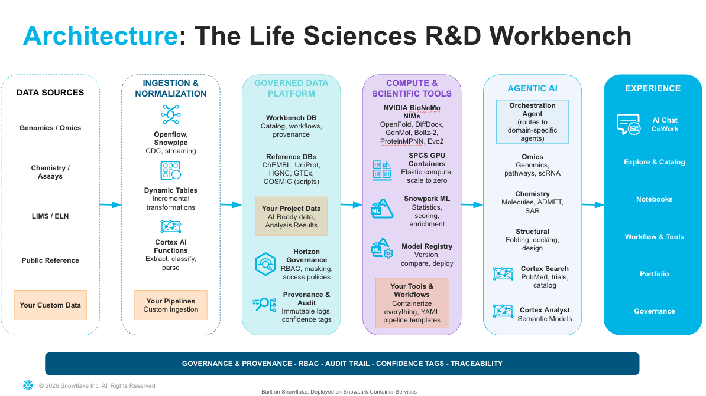

author: Deven Atnoor
id: scientific-workbench-for-life-sciences
language: en
summary: Build an enterprise AI workbench for life sciences R&D with Cortex Agents, NVIDIA BioNeMo NIMs, and Snowflake App Runtime.
categories: snowflake-site:taxonomy/solution-center/certification/quickstart,snowflake-site:taxonomy/product/ai,snowflake-site:taxonomy/snowflake-feature/snowpark-container-services,snowflake-site:taxonomy/snowflake-feature/cortex-llm-functions,snowflake-site:taxonomy/industry/healthcare-and-life-sciences
environments: web
status: Published
feedback link: https://github.com/Snowflake-Labs/sfguides/issues
fork repo link: https://github.com/Snowflake-Labs/sf-hcls-solutions

# Scientific Workbench for Life Sciences R&D

## Overview

The Scientific Workbench is an enterprise AI platform for life sciences research and development, built entirely on Snowflake. It brings together Cortex Agents, NVIDIA BioNeMo NIMs, Snowpark Python tools, and a Snowflake App Runtime (SAR) web application into a single governed environment where computational biologists, medicinal chemists, structural biologists, and clinical data scientists can run AI-driven discovery workflows.

By the end of this guide you will have a fully deployed Scientific Workbench with 28 agent-callable tools, a multi-agent Discovery Agent, 4 Cortex Analyst semantic views, reference datasets across 5 scientific domains, and a React web application — all running in your Snowflake account.



### Prerequisites

- Snowflake account (Enterprise edition or higher recommended)
- ACCOUNTADMIN access (for initial setup; can be reduced after deployment)
- [Snowflake CLI](https://docs.snowflake.com/en/developer-guide/snowflake-cli/index) (`snow`) installed
- NVIDIA API key from [build.nvidia.com](https://build.nvidia.com) (free tier available)
- Node.js 20+ and npm (for local development only)

### What You'll Learn

- How to deploy a multi-agent AI platform on Snowflake
- How to configure NVIDIA BioNeMo NIM tools for drug discovery
- How to set up role-based access control for scientific teams
- How to build and deploy a Snowflake App Runtime (SAR) web application
- How to run end-to-end drug discovery workflows through a conversational agent
- How to extend the platform with new tools and data sources

### What You'll Need

| Resource | Details |
|----------|---------|
| Storage (reference data) | ~40 GB |
| Storage (platform tables) | < 1 GB |
| Warehouses | 3 (XS, S, ML) with auto-suspend |
| Cortex Search | 2 services (catalog + tools) |
| Marketplace subscriptions | PubMed CKE, ClinicalTrials.gov CKE |
| GPU compute | None required (NVIDIA hosted API) |
| Monthly credits (estimate) | 500 - 1,000 |

### What You'll Build

- 28 agent-callable tools: 7 native Snowpark Python, 11 NVIDIA BioNeMo NIM wrappers, 3 search tools, 2 MONAI imaging tools, 3 Parabricks genomics tools, 2 multi-NIM pipelines
- 7 Cortex Agents: Genomics, Chemistry, Structural, Clinical, Workflow, Orchestrator, Discovery
- 4 Cortex Analyst semantic views: Clinical, Genomics, Compounds, Chemistry
- Reference data across 5 domains: Genomics (HGNC), ChEMBL (bioactivity), Clinical (ClinicalTrials.gov), Pathways (Reactome, MSigDB, GO), Protein (UniProt)
- A React web application deployed on Snowflake App Runtime

## Environment Setup

### Clone the Repository

```bash
git clone https://github.com/Snowflake-Labs/sf-hcls-solutions.git
cd sf-hcls-solutions/solutions/scientific-workbench
```

### Install Snowflake CLI

If you haven't already, install the Snowflake CLI:

```bash
pip install snowflake-cli
```

### Configure a Connection

Add a named connection for deployment. You need ACCOUNTADMIN role for the initial setup:

```bash
snow connection add \
  --connection-name workbench-deploy \
  --account <your-account> \
  --user <your-user> \
  --role ACCOUNTADMIN \
  --warehouse COMPUTE_WH
```

Test the connection:

```bash
snow connection test --connection workbench-deploy
```

### Obtain NVIDIA API Key

1. Go to [build.nvidia.com](https://build.nvidia.com) and create an account
2. Navigate to any BioNeMo NIM (e.g., Boltz-2) and click "Get API Key"
3. Copy the key — you'll provide it during deployment

### Quick Start (One Command)

The fastest path is the automated deploy script:

```bash
bash deploy.sh --connection workbench-deploy --nvidia-key <your-nvidia-key>
```

This runs all 7 phases automatically. If you prefer step-by-step deployment, follow Steps 3 through 7 below. If you used the one-command deploy, skip to Step 8.

For non-interactive environments (CI, automation):

```bash
SWB_ASSUME_YES=1 bash deploy.sh --connection workbench-deploy --nvidia-key <your-nvidia-key>
```

### Configuration File (Optional)

For repeatable deployments or custom naming, create a config file:

```bash
cp workbench.config.yaml.example workbench.config.yaml
```

The config file controls all deployment parameters. Every field is optional — deploy.sh auto-detects defaults if omitted. CLI flags always take precedence over config values.

```yaml
snowflake:
  # Snowflake CLI connection name from ~/.snowflake/config.toml
  connection: default

secrets:
  # NVIDIA API key from build.nvidia.com (for hosted NIM API calls)
  nvidia_api_key: ""
  # NGC API key from ngc.nvidia.com (for SPCS NIM container weight downloads)
  ngc_api_key: ""

databases:
  workbench: SCIENTIFIC_WORKBENCH      # Platform database
  reference: WORKBENCH_REFERENCE       # Read-only reference data
  projects: WORKBENCH_PROJECTS         # Per-project schemas

warehouses:
  xs: WORKBENCH_XS                     # Lightweight queries, admin tasks
  small: WORKBENCH_S                   # Tool execution, data loading
  ml: WORKBENCH_ML                     # Heavy ML workloads, large data scans

# Enable specific NIM containers on SPCS GPU compute pools
nim_services:
  boltz2: false                        # L40S GPU required
  genmol: false                        # A10G GPU sufficient
  diffdock: false                      # L40S GPU required
  rfdiffusion: false                   # L40S GPU required
  proteinmpnn: false                   # A10G GPU sufficient
  molmim: false                        # A10G GPU sufficient
  openfold2: false                     # A10G GPU sufficient
  openfold3: false                     # L40S GPU required
  msa_search: false                    # A10G + 500 GiB block volume

agents:
  deploy_legacy_sql: true              # Deploy agents via SQL scripts
  deploy_agent_studio: true            # Deploy agents via Agent Studio YAML

marketplace:
  pubmed_cke: false                    # Set true if PubMed CKE is subscribed
  clinicaltrials_cke: false            # Set true if ClinicalTrials.gov CKE is subscribed
```

Deploy with the config file:

```bash
bash deploy.sh --config workbench.config.yaml
```

Validate the config before deploying:

```bash
bash scripts/validate-config.sh
```

### deploy.sh Reference

The deploy script runs 7 phases in sequence. Use flags to skip or isolate phases:

| Flag | Effect |
|------|--------|
| `--connection NAME` | Snowflake CLI connection name (auto-detected if omitted) |
| `--config PATH` | Path to `workbench.config.yaml` |
| `--nvidia-key KEY` | NVIDIA API key (or `NVIDIA_API_KEY` env var) |
| `--ngc-key KEY` | NGC API key for SPCS NIMs (or `NGC_API_KEY` env var) |
| `--skip-prereqs` | Skip Phase 1 EAI/secret creation (if already done) |
| `--skip-data` | Skip Phase 2 reference data loading (~45 min saved) |
| `--skip-app` | Skip Phase 7 app deployment |
| `--skip-tests` | Skip post-deploy verification |
| `--backend-only` | Deploy only NVIDIA procedures, agents, and app |
| `--agents-app-only` | Resume at agents + app (skips infrastructure and data) |
| `--app-only` | Deploy only the SAR app (fastest redeploy) |
| `--mirror-nims` | Mirror NIM container images from nvcr.io (requires Docker + `--ngc-key`) |
| `--dry-run` | Print what would be executed without running |

**Deployment phases:**

| Phase | Name | Scripts | Duration |
|-------|------|---------|----------|
| 1 | Infrastructure | `00-prerequisites.sql` through `13-execute-tool-by-name.sql` (11 scripts) | 2-5 min |
| 1b | NIM Mirroring (opt-in) | Docker pull/tag/push of 9 NIM images | 60-120 min |
| 2 | Reference Data | `data/loaders/*.sql`, `data/synthetic/load_synthetic_data.sql` | 30-45 min |
| 3 | Tools | `tools/native/*.sql`, `tools/nvidia/*.sql`, `tools/search/*.sql`, `14-custom-tool-onboarding.sql` | 5-10 min |
| 3.5 | Notebooks | Upload `notebooks/*.ipynb` to workspace | 1-2 min |
| 4 | Agents | `engine/sql/agents/*.sql`, Agent Studio YAML specs | 3-5 min |
| 5 | Semantic Views | `data/semantic_views/*.sql`, workflow runner | 2-3 min |
| 6 | App Deployment | `snow app deploy` (Docker build + SPCS service) | 5-8 min |
| 7 | Verification | `tests/*.sql`, `CALL RUN_VALIDATION_TESTS()` | 1-2 min |

**Total fresh deployment: ~50-80 minutes** (without NIM mirroring). Subsequent deploys with `--app-only` take 5-8 minutes.

### Teardown

To remove the entire deployment:

```bash
bash scripts/teardown.sh --connection workbench-deploy -y
```

| Flag | Effect |
|------|--------|
| `-y` | Skip confirmation prompt |
| `--dry-run` | Print what would be dropped without executing |
| `--keep-data` | Drop platform objects but preserve WORKBENCH_REFERENCE data |

## Deploy Infrastructure

This step creates the Snowflake objects that the workbench runs on: databases, schemas, warehouses, compute pools, RBAC roles, external access integrations, and secrets.

### Phase 1: Run Infrastructure Scripts

If deploying manually (not using deploy.sh), execute these scripts in order using Snowsight or the Snowflake CLI:

| Order | Script | What It Creates |
|-------|--------|-----------------|
| 1 | `scripts/00-prerequisites.sql` | External access integrations (NVIDIA API, PDB, NIM runtime), secrets, network rules |
| 2 | `scripts/01-databases-and-schemas.sql` | SCIENTIFIC_WORKBENCH (6 schemas), WORKBENCH_REFERENCE (5 schemas), WORKBENCH_PROJECTS |
| 3 | `scripts/02-warehouses.sql` | WORKBENCH_XS, WORKBENCH_S, WORKBENCH_ML warehouses; NIM_GPU_A10G_POOL, NIM_GPU_L40S_POOL compute pools |
| 4 | `scripts/03-rbac.sql` | WORKBENCH_ADMIN, WORKBENCH_SCIENTIST, WORKBENCH_VIEWER roles with appropriate grants |
| 5 | `scripts/05-tool-registry.sql` | CATALOG.TOOLS table, CATALOG.ASSETS table, CATALOG.CHAT_SESSIONS table, REGISTER_TOOL and SEED_ASSETS procedures |

### Database Layout

After Phase 1, you have three databases:

```
SCIENTIFIC_WORKBENCH          -- Platform database
  CATALOG                     -- Tool registry, assets, agents, chat sessions
  WORKFLOWS                   -- Workflow templates and run history
  GOVERNANCE                  -- Promotion log, canary assertions
  PROVENANCE                  -- Provenance audit trail
  PROJECTS                    -- Shared project space

WORKBENCH_REFERENCE           -- Read-only reference data
  GENOMICS                    -- HGNC gene nomenclature
  CHEMBL                      -- Bioactivity measurements
  CLINICAL                    -- ClinicalTrials.gov
  PATHWAYS                    -- Reactome, MSigDB, GO
  PROTEIN                     -- UniProt entries

WORKBENCH_PROJECTS            -- Per-project schemas
  DEMO_NSCLC                  -- NSCLC patient cohort demo
  DEMO_COMPOUNDS              -- Compound screening demo
  DEMO_CLINICAL               -- Clinical trials demo
  DEMO_STRUCTURAL             -- Protein targets demo
```

### RBAC Roles

| Role | Purpose | Typical User |
|------|---------|-------------|
| WORKBENCH_ADMIN | Full access: manage tools, approve submissions, configure agents, share data | Platform administrators |
| WORKBENCH_SCIENTIST | Run tools, execute workflows, view all data, share results | Computational biologists, chemists |
| WORKBENCH_VIEWER | Read-only access to results and catalog | Managers, reviewers |

### Verify Infrastructure

```sql
-- Check databases exist
SHOW DATABASES LIKE 'SCIENTIFIC_WORKBENCH';
SHOW DATABASES LIKE 'WORKBENCH_REFERENCE';
SHOW DATABASES LIKE 'WORKBENCH_PROJECTS';

-- Check roles
SHOW ROLES LIKE 'WORKBENCH_%';

-- Check external access integrations
SHOW EXTERNAL ACCESS INTEGRATIONS LIKE 'NVIDIA_%';
```

## Deploy NIMs on SPCS

This optional step deploys NVIDIA BioNeMo NIM containers locally on Snowpark Container Services (SPCS) GPU compute pools. By default, all NIM tools call the NVIDIA hosted API — SPCS deployment provides an alternative for customers who need air-gapped operation or want to avoid per-call API costs.

### Prerequisites for SPCS NIMs

- Docker installed locally (for image mirroring)
- NGC API key from [ngc.nvidia.com](https://ngc.nvidia.com) (separate from the build.nvidia.com key)
- GPU compute pool quotas enabled in your account (A10G and/or L40S)

### GPU Requirements

Each NIM has specific GPU and storage requirements. SPCS nodes have a 93.13 GiB storage cap across all instance families.

| NIM | Container Image | Compressed Size | GPU | Memory | Status |
|-----|----------------|----------------|-----|--------|--------|
| Boltz-2 | `nvcr.io/nim/mit/boltz2:1.8.0` | 9.93 GiB | L40S 48 GiB | 32-90 GiB | Verified |
| GenMol | `nvcr.io/nim/nvidia/genmol:latest` | 9.44 GiB | A10G 24 GiB | 8-24 GiB | Template |
| DiffDock | `nvcr.io/nim/mit/diffdock:latest` | 15.33 GiB | L40S 48 GiB | 32-64 GiB | Template |
| RFdiffusion | `nvcr.io/nim/nvidia/rfdiffusion:2.3.0` | 16.37 GiB | L40S 48 GiB | 32-90 GiB | Template |
| ProteinMPNN | `nvcr.io/nim/nvidia/proteinmpnn:latest` | 8.60 GiB | A10G 24 GiB | 8-24 GiB | Template |
| MolMIM | `nvcr.io/nim/nvidia/molmim:latest` | 13.04 GiB | A10G 24 GiB | 16-48 GiB | Template |
| OpenFold2 | `nvcr.io/nim/nvidia/openfold2:latest` | 8-10 GiB | A10G 24 GiB | 16-48 GiB | Template |
| OpenFold3 | `nvcr.io/nim/nvidia/openfold3:latest` | 10.19 GiB | L40S 48 GiB | 32-90 GiB | Template |
| MSA-Search | `nvcr.io/nim/nvidia/msa-search:latest` | 8.64 GiB | A10G 24 GiB | 16-48 GiB | Special (needs block volume) |
| Evo2 | `nvcr.io/nim/nvidia/evo2:latest` | 15.25 GiB | H100/H200 | TBD | Blocked (needs measurement) |

### Compute Pools

The infrastructure scripts (Step 3) create two GPU compute pools:

```sql
-- Already created by 02-warehouses.sql:
-- NIM_GPU_A10G_POOL: GPU_NV_S (A10G 24 GiB) — GenMol, ProteinMPNN, MolMIM, OpenFold2
-- NIM_GPU_L40S_POOL: GPU_L40S_G1_16 (L40S 48 GiB) — Boltz-2, DiffDock, RFdiffusion, OpenFold3

-- Verify pools exist
SHOW COMPUTE POOLS LIKE 'NIM_GPU_%';
```

### Step 1: Mirror NIM Images

NIM containers must be mirrored from NVIDIA's NGC registry (`nvcr.io`) to your Snowflake image repository. This is required because SPCS pulls images from the Snowflake registry, not directly from external registries.

**Automated (via deploy.sh):**

```bash
bash deploy.sh --connection workbench-deploy \
  --nvidia-key <your-nvidia-key> \
  --ngc-key <your-ngc-key> \
  --mirror-nims
```

**Manual (per image):**

```bash
# Login to NGC registry
docker login nvcr.io -u '$oauthtoken' -p <your-ngc-key>

# Login to Snowflake image registry
snow spcs image-registry login --connection workbench-deploy

# Get your Snowflake registry URL
REPO_URL=$(snow sql --connection workbench-deploy \
  --query "SHOW IMAGE REPOSITORIES IN SCHEMA SCIENTIFIC_WORKBENCH.CATALOG" \
  --format json | python3 -c "
import json, sys
data = json.load(sys.stdin)
print([r['repository_url'] for r in data if 'nim_gpu_images' in r.get('repository_url','').lower()][0])
")

# Mirror Boltz-2 (example — repeat for each NIM)
docker pull nvcr.io/nim/mit/boltz2:1.8.0
docker tag nvcr.io/nim/mit/boltz2:1.8.0 $REPO_URL/boltz2:1.8.0
docker push $REPO_URL/boltz2:1.8.0
```

**Important — Apple Silicon users:** Docker on ARM Macs pulls the `arm64` variant by default. SPCS requires `amd64`. Pull by digest or use `--platform linux/amd64`:

```bash
docker pull --platform linux/amd64 nvcr.io/nim/mit/boltz2:1.8.0
```

Mirroring all 9 images takes 60-120 minutes depending on bandwidth.

### Step 2: Create SPCS Services

The service definitions are in `scripts/10-nim-spcs-services.sql`. Only Boltz-2 is uncommented (verified). To deploy it:

```sql
USE DATABASE SCIENTIFIC_WORKBENCH;
USE SCHEMA CATALOG;

CREATE SERVICE SCIENTIFIC_WORKBENCH.CATALOG.NIM_BOLTZ2_SVC
  IN COMPUTE POOL NIM_GPU_L40S_POOL
  FROM SPECIFICATION $$
spec:
  containers:
    - name: boltz2
      image: /SCIENTIFIC_WORKBENCH/CATALOG/NIM_GPU_IMAGES/boltz2:1.8.0
      env:
        NIM_HTTP_API_PORT: "8000"
        NIM_LOG_LEVEL: "INFO"
      secrets:
        - snowflakeSecret: SCIENTIFIC_WORKBENCH.CATALOG.NGC_API_KEY
          secretKeyRef: SECRET_STRING
          envVarName: NGC_API_KEY
      volumeMounts:
        - name: dshm
          mountPath: /dev/shm
      resources:
        requests:
          nvidia.com/gpu: 1
          memory: 32Gi
        limits:
          nvidia.com/gpu: 1
          memory: 90Gi
      readinessProbe:
        port: 8000
        path: /v1/health/ready
  endpoints:
    - name: boltz2
      port: 8000
      public: true
  volumes:
    - name: dshm
      source: memory
      size: 16Gi
  $$
  EXTERNAL_ACCESS_INTEGRATIONS = (NIM_RUNTIME_EAI)
  MIN_INSTANCES = 1
  MAX_INSTANCES = 1;
```

Key points about the service spec:
- **`/dev/shm` volume**: All PyTorch-based NIM containers require a shared memory volume. SPCS uses `source: memory` for this.
- **`NGC_API_KEY` secret**: Mounted as an environment variable for model weight downloads on first startup.
- **Readiness probe**: `/v1/health/ready` — the service reports READY only after weights are loaded.
- **Startup time**: ~7.5 minutes (3.5 min image pull + 4 min weight download). Add 11-15 minutes if the compute pool must provision a new node.

### Step 3: Verify Service Health

```sql
-- Check service status
SELECT SYSTEM$GET_SERVICE_STATUS('SCIENTIFIC_WORKBENCH.CATALOG.NIM_BOLTZ2_SVC');

-- View container logs
SELECT SYSTEM$GET_SERVICE_LOGS('SCIENTIFIC_WORKBENCH.CATALOG.NIM_BOLTZ2_SVC', 0, 'boltz2', 50);

-- Check endpoint URL
SHOW ENDPOINTS IN SERVICE SCIENTIFIC_WORKBENCH.CATALOG.NIM_BOLTZ2_SVC;
```

### Endpoint Path Reference

The hosted API and self-hosted containers use different URL structures. For the hosted API, the base is `https://health.api.nvidia.com`. For self-hosted containers (including SPCS), the base is `http://localhost:8000` (or the SPCS service DNS).

| NIM | Hosted API Path | Self-Hosted Container Path | Docs |
|-----|----------------|--------------------------|------|
| **Boltz-2** | `/v1/biology/mit/boltz2/predict` | `/biology/mit/boltz2/predict` | [build.nvidia.com/boltz2](https://build.nvidia.com/mit/boltz2) |
| **GenMol** | `/v1/biology/nvidia/genmol/generate` | `/biology/nvidia/genmol/generate` | [build.nvidia.com/genmol](https://build.nvidia.com/nvidia/genmol) |
| **DiffDock** | `/v1/biology/mit/diffdock` | `/biology/mit/diffdock` | [build.nvidia.com/diffdock](https://build.nvidia.com/mit/diffdock) |
| **RFdiffusion** | `/v1/biology/ipd/rfdiffusion/generate` | `/biology/ipd/rfdiffusion/generate` | [build.nvidia.com/rfdiffusion](https://build.nvidia.com/ipd/rfdiffusion) |
| **ProteinMPNN** | `/v1/biology/ipd/proteinmpnn/predict` | `/biology/ipd/proteinmpnn/predict` | [build.nvidia.com/proteinmpnn](https://build.nvidia.com/ipd/proteinmpnn) |
| **MolMIM** | `/v1/biology/nvidia/molmim/generate` | `/biology/nvidia/molmim/generate` | [build.nvidia.com/molmim](https://build.nvidia.com/nvidia/molmim) |
| **OpenFold2** | `/v1/biology/openfold/openfold2/predict-structure-from-msa-and-template` | `/biology/openfold/openfold2/predict-structure-from-msa-and-template` | [build.nvidia.com/openfold2](https://build.nvidia.com/openfold/openfold2) |
| **OpenFold3** | `/v1/biology/openfold/openfold3/predict` | `/biology/openfold/openfold3/predict` | [build.nvidia.com/openfold3](https://build.nvidia.com/openfold/openfold3) |
| **MSA-Search** | `/v1/biology/colabfold/msa-search/predict` | `/biology/colabfold/msa-search/predict` | [build.nvidia.com/msa-search](https://build.nvidia.com/colabfold/msa-search) |
| **Evo2** | `/v1/biology/arc/evo2-40b/generate` | `/biology/arc/evo2-40b/generate` | [build.nvidia.com/evo2](https://build.nvidia.com/arc/evo2-40b) |

The pattern: the self-hosted container path is the hosted path minus the `/v1` prefix. The hosted API requires a Bearer token (`Authorization: Bearer <NVIDIA_API_KEY>`); self-hosted containers do not require authentication.

To verify a container's actual endpoint after deployment, query its OpenAPI spec:

```bash
curl http://<service-endpoint>:8000/openapi.json | python3 -m json.tool | grep '"paths"' -A 20
```

### Cost Management

SPCS GPU services consume credits continuously while running. To manage costs:

```sql
-- Suspend a service (stops GPU billing)
ALTER SERVICE SCIENTIFIC_WORKBENCH.CATALOG.NIM_BOLTZ2_SVC SUSPEND;

-- Resume when needed
ALTER SERVICE SCIENTIFIC_WORKBENCH.CATALOG.NIM_BOLTZ2_SVC RESUME;
```

The compute pools have auto-suspend configured (300 seconds by default). However, auto-suspend only triggers after all services in the pool are suspended. Suspend services explicitly when not in use.

### Special Cases

- **MSA-Search**: Requires a 500 GiB+ block volume for reference sequence databases (~1.2 TB for full UniRef30/ColabFold). The service spec includes a `block` volume sourced from a stage.
- **Evo2**: The 40B parameter model's runtime footprint (~89 GiB) is close to the 93.13 GiB node storage cap. Do not deploy until measured on your target instance family. May require H100 80 GiB or H200 141 GiB VRAM.

## Load Reference Data

Phase 2 loads ~40 GB of reference data across 5 scientific domains. This is the longest phase (~30-45 minutes).

### Phase 2: Reference Data

```bash
# If deploying manually, run these scripts:
# scripts/04-reference-data.sql (schema setup)
# data/loaders/load_chembl.sql
# data/loaders/load_remaining.sql
# data/synthetic/load_synthetic_data.sql
```

### Data Domains

| Domain | Schema | Key Tables | Source | Rows (approx) |
|--------|--------|-----------|--------|---------------|
| Genomics | GENOMICS | HGNC_GENES | HGNC | 43,000 |
| Bioactivity | CHEMBL | ACTIVITIES, ASSAYS, MOLECULE_DICTIONARY, TARGET_DICTIONARY | ChEMBL | 2M+ |
| Clinical | CLINICAL | STUDIES, CONDITIONS, INTERVENTIONS | ClinicalTrials.gov | 500K+ |
| Pathways | PATHWAYS | PATHWAYS, PATHWAY_GENES, GENE_SETS, GENE_SET_MEMBERS, GO_ANNOTATIONS, GO_TERMS | Reactome, MSigDB, GO | 1M+ |
| Protein | PROTEIN | UNIPROT_ENTRIES | UniProt | 570K+ |

### Verify Data Loading

```sql
-- Check row counts across reference schemas
SELECT TABLE_SCHEMA, TABLE_NAME, ROW_COUNT
FROM WORKBENCH_REFERENCE.INFORMATION_SCHEMA.TABLES
WHERE TABLE_SCHEMA IN ('GENOMICS', 'CHEMBL', 'CLINICAL', 'PATHWAYS', 'PROTEIN')
  AND TABLE_TYPE = 'BASE TABLE'
ORDER BY TABLE_SCHEMA, TABLE_NAME;
```

## Register Tools

Phase 3 creates the 28 agent-callable tool procedures and registers them in the CATALOG.TOOLS table.

### Tool Taxonomy

The workbench supports four types of tools:

| Type | Runtime | Example | Count |
|------|---------|---------|-------|
| **Native** (Snowpark Python) | Warehouse | `validate_molecule`, `run_differential_expression` | 7 |
| **NIM Wrapper** (NVIDIA API) | Warehouse + NVIDIA hosted API | `run_boltz2`, `run_genmol`, `run_diffdock` | 11 |
| **Search** (Cortex Search / CKE) | Cortex Search service | `search_pubmed`, `search_clinical_trials` | 3 |
| **Pipeline** (multi-tool chain) | Warehouse | `run_drug_discovery_pipeline`, `run_msa_structure_pipeline` | 2 |
| **Imaging** (MONAI NIM) | Warehouse + NVIDIA hosted API | `run_monai_vista3d`, `run_monai_lung_nodule` | 2 |
| **Genomics** (Parabricks) | SPCS GPU (pending) | `run_parabricks_fq2bam`, `run_parabricks_deepvariant` | 3 |

### How Tools Are Structured

Every tool is a Snowflake stored procedure or function with a JSON annotation in its COMMENT field:

```sql
CREATE OR REPLACE PROCEDURE CATALOG.MY_TOOL(...)
RETURNS VARCHAR
LANGUAGE PYTHON
...
COMMENT = 'TOOL:{"display_name":"My Tool","description":"...","domains":"genomics","params":{...},"return_type":"VARCHAR","example":"CALL CATALOG.MY_TOOL(...)"}'
AS $$
...
$$;
```

The `REGISTER_TOOL` procedure adds the tool to `CATALOG.TOOLS`:

```sql
CALL CATALOG.REGISTER_TOOL(
  'my_tool',                                    -- name (unique)
  'My Tool',                                    -- display_name
  'Description of what the tool does.',         -- description
  'genomics,drug-discovery',                    -- domains (comma-separated)
  'procedure',                                  -- tool_type
  'SCIENTIFIC_WORKBENCH.CATALOG.MY_TOOL',       -- function_reference
  '{"param1":"STRING","param2":"INT"}',         -- parameters (JSON)
  'VARCHAR',                                    -- return_type
  'CALL CATALOG.MY_TOOL(''value'', 42)'         -- example_usage
);
```

### NVIDIA BioNeMo NIM Tools

These 11 tools call the NVIDIA hosted API via the `NVIDIA_API_EAI` external access integration:

| Tool | NIM Model | What It Does |
|------|-----------|-------------|
| `run_boltz2` | Boltz-2 | Protein structure prediction + binding affinity (pIC50) |
| `run_genmol` | GenMol | De novo drug-like molecule generation |
| `run_diffdock` | DiffDock | Small-molecule docking (binding pose prediction) |
| `run_proteinmpnn` | ProteinMPNN | Inverse folding (backbone to sequence design) |
| `run_rfdiffusion` | RFdiffusion | De novo protein backbone generation |
| `run_molmim` | MolMIM | Latent-space molecule optimization |
| `run_openfold2` | OpenFold2 | Single-chain protein structure prediction |
| `run_openfold3` | OpenFold3 | Multi-chain complex structure prediction |
| `run_msa_search` | MSA-Search | Multiple sequence alignment via ColabFold |
| `run_evo2` | Evo2 | DNA/RNA sequence generation (40B parameter model) |
| `run_drug_discovery_pipeline` | GenMol + DiffDock | End-to-end: generate, validate, dock, rank |

### Verify Tool Registration

```sql
SELECT tool_type, COUNT(*) AS count
FROM SCIENTIFIC_WORKBENCH.CATALOG.TOOLS
WHERE status = 'active'
GROUP BY tool_type
ORDER BY count DESC;

-- Expected: 28 total active tools
SELECT COUNT(*) AS total_active_tools
FROM SCIENTIFIC_WORKBENCH.CATALOG.TOOLS
WHERE status = 'active';
```

## Configure AI Services

Phase 4-6 sets up Cortex Search services, the governance framework, workflow engine, semantic views, and the agent layer.

### Cortex Search and Governance

| Script | What It Creates |
|--------|-----------------|
| `scripts/06-cortex-services.sql` | Cortex Search services for tool discovery and asset catalog |
| `scripts/07-governance.sql` | GOVERNANCE.PROMOTION_LOG, GOVERNANCE.CANARY_ASSERTIONS |
| `scripts/08-workflow-engine.sql` | WORKFLOWS.TEMPLATES, WORKFLOWS.RUNS, workflow execution procedures |

### Semantic Views (Cortex Analyst)

Four semantic views enable natural-language queries over structured data:

| Semantic View | Underlying Data | Example Query |
|--------------|----------------|---------------|
| `SV_CLINICAL` | DEMO_NSCLC patient cohort | "How many patients are in stage IIIA?" |
| `SV_GENOMICS` | Gene expression + pathways | "Which genes are upregulated in the NSCLC cohort?" |
| `SV_COMPOUNDS` | Compound IC50 assay results | "Show me compounds with IC50 below 100 nM against EGFR" |
| `SV_CHEMISTRY` | ChEMBL molecule reference | "List all approved kinase inhibitors" |

### Agent Architecture

The workbench uses a multi-agent architecture with specialized domain agents coordinated by an orchestrator:

```
                    DISCOVERY_AGENT
                    (user-facing)
                         |
               uses semantic views +
               search + code execution
                         |
                  ORCHESTRATOR_AGENT
                  (routes to domains)
                   /     |     \
        GENOMICS   CHEMISTRY  STRUCTURAL
         AGENT      AGENT      AGENT
           |          |          |
        5 tools    4 tools    9 tools
                         |
                   CLINICAL_AGENT
                   (4 semantic views)
```

Each domain agent has access only to its relevant tools. The ORCHESTRATOR_AGENT routes queries to the correct domain and synthesizes cross-domain results. The DISCOVERY_AGENT is the user-facing agent that also has direct access to semantic views and code execution.

### Verify Agent Configuration

```sql
-- Test the Discovery Agent with a simple query
SELECT SNOWFLAKE.CORTEX.DATA_AGENT_RUN(
  'SCIENTIFIC_WORKBENCH.CATALOG.DISCOVERY_AGENT',
  '{"query": "What tools are available for protein structure prediction?"}',
  TRUE
) AS response;
```

## Deploy the Application

Phase 7 deploys the React web application to Snowflake App Runtime (SAR).

### SAR Deployment

From the `app/` directory:

```bash
cd solutions/scientific-workbench/app
snow app deploy --connection workbench-deploy
```

This performs three steps:
1. Uploads source files to a Snowflake workspace
2. Builds a Docker container in the cloud (via SPCS build service)
3. Creates or upgrades the APPLICATION SERVICE

Build time is approximately 3-5 minutes. The output includes the app URL:

```
App ready at https://<hash>-<account>.snowflakecomputing.app
```

### Grant Access to Users

After deployment, grant access to the appropriate roles:

```sql
-- Scientists can use the app
GRANT USAGE ON APPLICATION SERVICE SCIENTIFIC_WORKBENCH_APP
  TO ROLE WORKBENCH_SCIENTIST;

-- Viewers get read-only access
GRANT USAGE ON APPLICATION SERVICE SCIENTIFIC_WORKBENCH_APP
  TO ROLE WORKBENCH_VIEWER;
```

### App Modules

The application includes 10 modules:

| Module | Path | Description |
|--------|------|-------------|
| Home | `/` | Dashboard with tool count, agent status, recent activity |
| Chat | `/chat` | Conversational interface to the Discovery Agent |
| Explore | `/explore` | Schema browser with column profiling and data preview |
| Experiments | `/experiments` | Workflow run history and results viewer |
| Asset Catalog | `/catalog` | Searchable catalog of all platform assets with data preview |
| Tools | `/tools` | Registry of all 28 agent-callable tools |
| Tool Onboard | `/tools/onboard` | Custom tool submission wizard |
| Governance | `/governance` | Promotion log, canary assertions, provenance trail |
| Notebooks | `/notebooks` | Snowflake notebook launcher |
| Share | `/share` | Cross-account data sharing (admin/scientist) |

### Verify Deployment

Open the app URL in your browser. You should see:
- Home page with "28 Active Tools" (or similar count)
- Chat page where you can talk to the Discovery Agent
- Tools page listing all registered tools

## Local Development

For development and testing, you can run the app locally against your Snowflake account.

### Setup

```bash
cd solutions/scientific-workbench/app
npm install
```

### Environment Variables

Create a `.env.local` file (or rely on `~/.snowflake/config.toml` default connection):

```bash
# Option 1: Key-pair auth (recommended)
SNOWFLAKE_ACCOUNT=<account>
SNOWFLAKE_USER=<user>
SNOWFLAKE_PRIVATE_KEY_PATH=~/.snowflake/rsa_key.p8
SNOWFLAKE_WAREHOUSE=WORKBENCH_XS
SNOWFLAKE_ROLE=WORKBENCH_ADMIN

# Option 2: config.toml (zero config — uses default connection)
# No env vars needed if ~/.snowflake/config.toml is configured

# Enable admin features in local dev
SWB_LOCAL_DEV_ADMIN=true
```

### Run the Dev Server

```bash
npm run dev
```

The app starts at `http://localhost:3000`. Hot reload is enabled — changes to pages and API routes take effect immediately.

### Key Differences from SPCS

| Aspect | Local Dev | SPCS (Deployed) |
|--------|-----------|-----------------|
| Auth | Password or config.toml | SPCS service token |
| Caller's rights | Not available (use SWB_LOCAL_DEV_ADMIN) | Reads sf-context-current-user-token header |
| URL | localhost:3000 | `<hash>-<account>.snowflakecomputing.app` |
| Secrets | Environment variables | `getSecret()` API from app.yml |

### Testing Changes

Before deploying, verify your changes build successfully:

```bash
npx tsc --noEmit       # Type checking
npx next build         # Full production build
```

Then deploy with `snow app deploy --connection workbench-deploy`.

## Run a Discovery Workflow

Now that the workbench is deployed, walk through an end-to-end drug discovery workflow.

### Open the Chat

Navigate to the Chat page in the web application. You'll see the Discovery Agent interface.

### Example: Multi-Step Drug Discovery

Try this prompt:

> Find compounds in ChEMBL that target EGFR with IC50 below 100 nM, validate their drug-likeness, and predict binding poses for the top 3 candidates against PDB structure 1M17.

The agent will:

1. Query the `SV_COMPOUNDS` semantic view to find EGFR compounds with IC50 < 100 nM
2. Call `validate_molecule` on each candidate (RDKit sanitization + PAINS/BRENK filters)
3. Call `run_diffdock` to dock the top 3 validated molecules against PDB 1M17
4. Return structured results with confidence scores and binding poses

### Example: Genomics Analysis

> Run differential expression analysis comparing Stage I vs Stage III patients in the NSCLC cohort, then perform pathway enrichment on the upregulated genes.

The agent will:

1. Call `run_differential_expression` on the NSCLC gene expression data
2. Filter for significantly upregulated genes (log2FC > 1, FDR < 0.05)
3. Call `run_pathway_enrichment` against MSigDB Hallmark gene sets
4. Return enriched pathways with Fisher exact test p-values

### Example: Protein Structure Prediction

> Predict the structure of the first 200 residues of human TP53 protein and assess confidence.

The agent will:

1. Look up the TP53 sequence (or ask you to provide it)
2. Call `run_openfold2` for single-chain structure prediction
3. Return the predicted structure with pLDDT confidence scores

### View Results

After each workflow, results are saved to output tables. View them in:
- **Experiments** page — workflow run history with parameters and status
- **Explore** page — browse the output table schema and preview rows
- **Asset Catalog** — newly created result tables appear as assets

## Extend the Platform

### Adding a New Native Tool

Create a Snowpark Python procedure in `SCIENTIFIC_WORKBENCH.CATALOG`:

```sql
CREATE OR REPLACE PROCEDURE CATALOG.MY_NEW_TOOL(
    "P_INPUT" VARCHAR,
    "P_OUTPUT_TABLE" VARCHAR
)
RETURNS VARCHAR
LANGUAGE PYTHON
RUNTIME_VERSION = '3.11'
PACKAGES = ('snowflake-snowpark-python')
HANDLER = 'run'
COMMENT = 'TOOL:{"display_name":"My New Tool","description":"What it does","domains":"genomics","params":{"input":"STRING","output_table":"STRING"},"return_type":"VARCHAR","example":"CALL CATALOG.MY_NEW_TOOL(input, output)"}'
AS $$
import json

def run(session, p_input: str, p_output_table: str) -> str:
    # Your tool logic here
    result = {"status": "success", "output_table": p_output_table}
    return json.dumps(result)
$$;
```

Register it:

```sql
CALL CATALOG.REGISTER_TOOL(
    'my_new_tool', 'My New Tool',
    'What it does',
    'genomics', 'procedure',
    'SCIENTIFIC_WORKBENCH.CATALOG.MY_NEW_TOOL',
    '{"input":"STRING","output_table":"STRING"}',
    'VARCHAR',
    'CALL CATALOG.MY_NEW_TOOL(''test'', ''RESULTS.OUTPUT'')'
);
```

Refresh the asset catalog:

```sql
CALL CATALOG.SEED_ASSETS();
```

### Adding a New NIM Wrapper

Follow the same pattern as existing NIM tools. Key requirements:

1. Add `EXTERNAL_ACCESS_INTEGRATIONS = (NVIDIA_API_EAI)` to the procedure
2. Add `SECRETS = ('nvidia_key' = SCIENTIFIC_WORKBENCH.CATALOG.NVIDIA_API_SECRET)`
3. Use the `_snowflake.get_generic_secret_string('nvidia_key')` API to read the key
4. Call the NIM endpoint via `requests.post()` with Bearer token auth

### Custom Tool Onboarding

Scientists can submit custom tools through the web application:

1. Navigate to **Tools > Onboard** in the app
2. Fill in the tool specification (name, description, parameters, code)
3. Submit for review
4. An admin reviews and approves/rejects via **Tools > Submissions**
5. Approved tools are automatically registered in the catalog

### Adding Reference Data

To add a new reference dataset:

1. Create a schema in WORKBENCH_REFERENCE (or use an existing one)
2. Load the data
3. Register it as an asset:

```sql
INSERT INTO SCIENTIFIC_WORKBENCH.CATALOG.ASSETS
    (asset_id, asset_name, asset_type, description, domain, schema_name, owner)
VALUES
    ('asset-data-WORKBENCH_REFERENCE.MY_SCHEMA.MY_TABLE',
     'MY_TABLE', 'dataset', 'Description of the dataset',
     'MY_SCHEMA', 'MY_SCHEMA', CURRENT_USER());
```

Or run `CALL CATALOG.SEED_ASSETS()` to auto-discover tables in registered schemas.

## Security Model

### Platform Roles and Hierarchy

The workbench uses three Snowflake database roles in a hierarchical inheritance chain:

```
SYSADMIN
  └── WORKBENCH_ADMIN       (full platform administration)
        └── WORKBENCH_SCIENTIST   (run tools, execute workflows, share results)
              └── WORKBENCH_VIEWER      (read-only access to results and catalog)
```

Each higher role inherits all privileges of the roles below it. WORKBENCH_ADMIN inherits SCIENTIST, which inherits VIEWER.

| Role | Can Do | Cannot Do |
|------|--------|-----------|
| **WORKBENCH_ADMIN** | Everything: manage tools, approve custom tool submissions, configure agents, share data cross-account, manage SPCS services, run governance procedures | N/A (full access) |
| **WORKBENCH_SCIENTIST** | Run all tools, execute workflows, view all data, create result tables, share results, write to provenance log, submit custom tools | Approve/reject tool submissions, manage compute pools, run governance procedures |
| **WORKBENCH_VIEWER** | Read catalog, view results, view tool registry, use XS warehouse | Run tools, execute workflows, create tables, share data |

### Access Control by Schema

| Database.Schema | ADMIN | SCIENTIST | VIEWER |
|----------------|-------|-----------|--------|
| SCIENTIFIC_WORKBENCH.CATALOG | Full DDL | SELECT + CALL procedures | SELECT only |
| SCIENTIFIC_WORKBENCH.RESULTS | Full DDL | SELECT + INSERT + CREATE TABLE | SELECT only |
| SCIENTIFIC_WORKBENCH.WORKFLOWS | Full DDL | SELECT + CALL procedures | No access |
| SCIENTIFIC_WORKBENCH.GOVERNANCE | Full DDL + procedures | SELECT only | No access |
| SCIENTIFIC_WORKBENCH.PROVENANCE | Full DDL | SELECT + INSERT | No access |
| WORKBENCH_REFERENCE.* | Full DDL | SELECT (read-only) | No access |
| WORKBENCH_PROJECTS.* | Full DDL | SELECT (read-only) | No access |

### Scientific Personas

In a typical deployment, the platform roles map to scientific personas. Assign users to the appropriate role based on their function:

| Persona | Snowflake Role | What They Do |
|---------|---------------|-------------|
| **Computational Biologist** | WORKBENCH_SCIENTIST | Differential expression analysis, pathway enrichment, survival analysis, gene symbol validation |
| **Medicinal Chemist** | WORKBENCH_SCIENTIST | Molecule generation (GenMol), optimization (MolMIM), validation (RDKit + PAINS), molecular descriptors |
| **Structural Biologist** | WORKBENCH_SCIENTIST | Protein structure prediction (Boltz-2, OpenFold2/3), backbone design (RFdiffusion), sequence design (ProteinMPNN), molecular docking (DiffDock) |
| **Clinical Data Scientist** | WORKBENCH_SCIENTIST | Cohort queries via semantic views, clinical trial search, patient outcome analysis |
| **AI Drug Discovery Scientist** | WORKBENCH_SCIENTIST | End-to-end pipelines, multi-tool workflows, agent-driven discovery |
| **Platform Administrator** | WORKBENCH_ADMIN | Tool onboarding, agent configuration, data sharing, governance, compute management |
| **Manager / Reviewer** | WORKBENCH_VIEWER | Review experiment results, browse catalog, audit provenance |

### Assigning Roles to Users

```sql
-- Grant a scientist role to a user
GRANT ROLE WORKBENCH_SCIENTIST TO USER jane_doe;

-- Grant admin role
GRANT ROLE WORKBENCH_ADMIN TO USER platform_admin;

-- Grant viewer role
GRANT ROLE WORKBENCH_VIEWER TO USER manager_smith;
```

Users switch to their workbench role in a Snowflake session:

```sql
USE ROLE WORKBENCH_SCIENTIST;
```

In the web application, caller's rights automatically detects the user's active role via the SPCS user token — no manual `USE ROLE` needed.

### Named Query Allowlist

The web application does not execute arbitrary SQL from the client. All queries go through a **named query registry** (`lib/named-queries.ts`) that maps query keys to pre-defined SQL templates:

- **Static queries** (no parameters): SQL is a compile-time constant — zero attack surface
- **Parameterized queries**: Parameters are validated with Zod schemas and used as bind variables (`?`) — no string interpolation

```
Client: { query: "column_info", params: { schema: "GENOMICS", table: "HGNC_GENES" } }
                                    |
                              resolveNamedQuery()
                                    |
Server: SELECT COLUMN_NAME, DATA_TYPE FROM INFORMATION_SCHEMA.COLUMNS
        WHERE TABLE_SCHEMA = ? AND TABLE_NAME = ?
        binds: ['GENOMICS', 'HGNC_GENES']
```

### Authorization Patterns

API routes use caller's rights to check the user's Snowflake role:

```typescript
// Check caller's role via SPCS user token
const [row] = await querySnowflake("SELECT CURRENT_ROLE() AS role", { callersRights: true })
const callerRole = String(row?.ROLE ?? "").toUpperCase()

if (!ALLOWED_ROLES.has(callerRole)) {
  return Response.json({ error: "Forbidden" }, { status: 403 })
}
```

| Endpoint | Required Role |
|----------|--------------|
| GET /api/tools/submissions | Any authenticated user |
| POST /api/tools/submissions (approve/reject) | WORKBENCH_ADMIN |
| POST /api/share (grant/create) | WORKBENCH_ADMIN or WORKBENCH_SCIENTIST |
| GET /api/chat/sessions | Scoped to CURRENT_USER() |

### External Access Integrations

| EAI | Purpose | Allowed Hosts |
|-----|---------|---------------|
| NVIDIA_API_EAI | NVIDIA BioNeMo NIM API calls | `integrate.api.nvidia.com`, `api.nvcf.nvidia.com` |
| PDB_API_EAI | RCSB Protein Data Bank lookups | `data.rcsb.org` |
| NIM_RUNTIME_EAI | SPCS NIM container weight downloads | `*.nvidia.com`, `*.nvcr.io` |

## Conclusion and Resources

Congratulations! You've deployed a complete Scientific Workbench for life sciences R&D on Snowflake. The platform provides:

- A multi-agent AI system with 28 tools spanning genomics, chemistry, structural biology, and clinical data
- NVIDIA BioNeMo NIM integration for state-of-the-art molecular and protein AI
- A governed, role-based environment with audit trails and provenance tracking
- A modern web application for interactive discovery workflows

### What You Learned

- Deploying a multi-database, multi-schema Snowflake platform with automated scripts
- Configuring NVIDIA BioNeMo NIMs as agent-callable tools
- Setting up Cortex Agents with domain-specific tool routing
- Building and deploying a Snowflake App Runtime (Next.js) application
- Extending the platform with new tools, data, and semantic views
- Implementing security patterns: named query allowlists, RBAC, caller's rights

### Related Resources

- [Snowflake Cortex Agents Documentation](https://docs.snowflake.com/en/user-guide/snowflake-cortex/cortex-agents)
- [Snowflake App Runtime Documentation](https://docs.snowflake.com/en/developer-guide/snowflake-app-runtime/about-snowflake-app-runtime)
- [NVIDIA BioNeMo Platform](https://www.nvidia.com/en-us/clara/bionemo/)
- [NVIDIA NIM API Catalog](https://build.nvidia.com/explore/healthcare)
- [Cortex Analyst (Semantic Views)](https://docs.snowflake.com/en/user-guide/snowflake-cortex/cortex-analyst)
- [Source Repository](https://github.com/Snowflake-Labs/sf-hcls-solutions)
