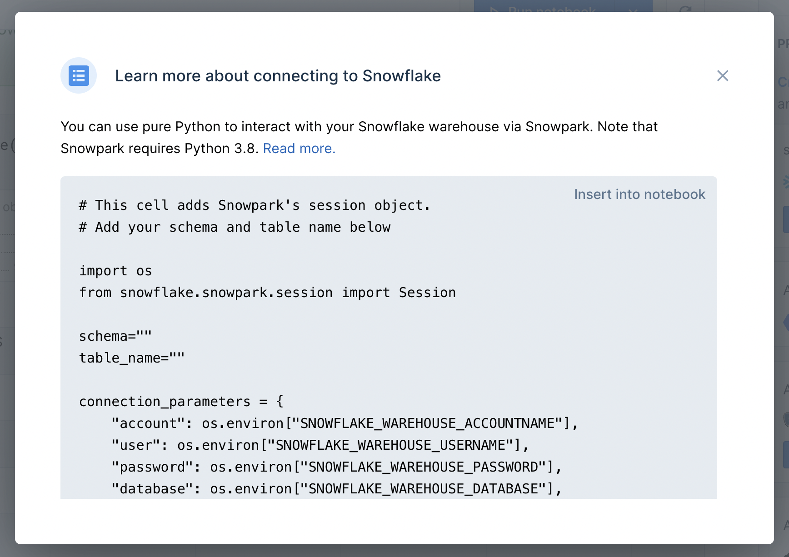
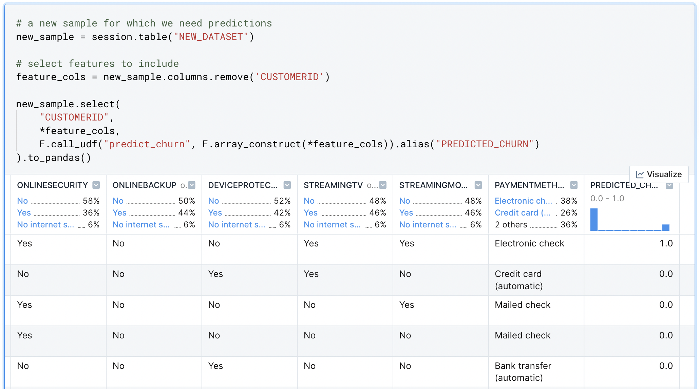

author: Allan Campopiano
id: seamless_ML_workflows_with_snowpark_and_deepnote
summary: Prototype your ML models in Deepnote's collaborative, multi-language notebook. Then, use Snowpark to productionize models without moving your data out of the warehouse or changing your code.
categories: data-science
environments: web
status: Draft
feedback link: [https://github.com/Snowflake-Labs/sfguides/issues](https://github.com/Snowflake-Labs/sfguides/issues)
tags: Data Science, Machine Learning, Notebooks, Snowflake, Snowpark, Deepnote, Python, Jupyter, EDA

# Seamless Machine Learning Workflows with Snowpark & Deepnote

<!-- ------------------------ -->

## Overview

Duration: 4

### What is Snowpark?

Machine learning workflows generally involve model prototyping, evaluation, and deployment. 
These typically require different languages, technologies, compute environments, 
and interfaces. **Snowpark for Python** brings these disparate 
components together under a single Python library—greatly 
simplifying end-to-end machine learning workflows. 

Snowpark provides a Python interface for interacting with data in 
the warehouse—without moving it to the client (i.e., the notebook). 
In addition, Snowpark allows data scientists to execute locally 
developed Python code directly in the warehouse. This means that 
model training (and returning predictions) can be executed from a 
notebook but run on the server (i.e., the warehouse)—without changing the user’s code.

### What is Deepnote?

A major aspect of any ML workflow is **exploratory data analysis (EDA)**. 
During model development, data scientists need rapid insights for the purposes of 
feature selection, feature engineering, and hyperparameter tuning. Deepnote’s 
collaborative data notebook is an interoperable Python and SQL environment 
that includes a suite of no-code tools to help with EDA. To learn more 
about how Deepnote helps with EDA and its tight integration with 
Snowflake, see [this](https://quickstarts.snowflake.com/guide/exploratory_data_analysis_with_snowflake_and_deepnote/#0) quickstart.

### Using Snowpark & Deepnote together

Deepnote and Snowpark solve the common pain points that 
data scientists experience when developing and deploying machine 
learning models. As shown in the image below, Snowpark and Deepnote 
work well together to accomplish transformation, EDA, and machine 
learning tasks.

In this quick-start guide, we will build a complete ML workflow with Deepnote and
Snowpark. Specifically, we will (1) prototype a churn prediction 
model using Deepnote’s EDA solutions and (2) use Snowpark to 
evaluate and deploy the model inside Snowflake’s DWH.


### Prerequisites

- Familiarity with basic Python and SQL
- Familiarity with data science notebooks (see [this guide](https://quickstarts.snowflake.com/guide/exploratory_data_analysis_with_snowflake_and_deepnote/#0) for an introduction to Deepnote)

### What You’ll Learn

Join us in this guide where we develop a churn prediction model using Scikit-learn. We will learn the following:

- How to build a generalizable ML workflow that covers model prototyping, model evaluation, and deployment.
- How to use Snowpark’s DataFrame API to examine data from your Snowflake warehouse without moving it to the notebook.
- How to train and deploy a classification model directly in the warehouse.

### What You’ll Need

- A free [Deepnote account](https://deepnote.com/sign-up?utm_source=ML_workflows_with_snowpark_&_deepnote&utm_medium=snowpark_quickstart).
- A [Snowflake account](https://signup.snowflake.com/) with admin access and [3rd party packages enabled](https://docs.snowflake.com/en/developer-guide/udf/python/udf-python-packages.html).
- The telecommunications parquet data file [here](https://drive.google.com/file/d/1ZIBz1hibyEv8DNBJj12vk52XRmCuK3q0/view?usp=share_link).

<!-- ------------------------ -->

## Setup a Snowflake integration inside Deepnote

Duration: 2

To connect a Snowflake database to a Deepnote project, open the Snowflake 
integration modal and supply the associated Snowflake credentials (i.e., 
account, username, password). Note that the connection parameters to 
Snowflake are stored in the notebook as Python environment variables but 
can only be viewed by the workspace Admin.


Note that once you are connected to Snowflake, you will be able to browse 
your schema directly from Deepnote and query your tables with [SQL blocks](https://deepnote.com/docs/sql-cells). 
For more detailed information on using Deepnote and Snowflake together, 
please see [this quickstart](https://quickstarts.snowflake.com/guide/exploratory_data_analysis_with_snowflake_and_deepnote/#0).

<!-- ------------------------ -->

## Initialize the Snowpark session

Duration: 2

After connecting your Snowflake integration, click the “How to use” button on 
the newly created integration in the right sidebar. As you can see in the 
image below, you can insert a snippet of code into the notebook to 
help you get started with Snowpark. This is simply boilerplate code 
that will help you to initialize your Snowpark session.



<!-- ------------------------ -->

## Using Snowpark’s DataFrame API

Duration: 3

Similar to Pandas and PySpark, Snowpark’s main abstraction is the DataFrame. 
The SQL commands and functions that you require for selecting, 
joining, and aggregating tables are methods on the DataFrame object. 
And since this can all be done in pure Python, this opens up new 
possibilities for interacting with your tables (e.g., using Python control structures). 
In addition, data scientists that prefer Python over SQL can still can have 
full control over the DWH.

For example, the following code snippet uses a standard Python *for loop* 
to remove spaces from the column names directly on a view. Snowpark’s 
session and DataFrame methods provide convenient access and manipulation 
of the data in the warehouse—including writing back to new tables as shown below.

```python
# create a temporary view on raw data to use for transformation
session.table("RAW_DATA").create_or_replace_temp_view('RAW_STAGE')
df_raw_stage = session.table("RAW_STAGE")

# loop through columns and rename them
for c in df_raw_stage.columns:
    df_raw_stage=df_raw_stage.rename(c, c.replace(' ', ''))

# write the new table to the warehouse
df_raw_stage.write.mode('overwrite').saveAsTable('RAW_STAGE')
```

To further highlight how the DataFrame object abstracts away common SQL tasks, 
here is an example of a two-way `GROUPBY` followed by an aggregation 
and sorting. The resulting `churn_exploration` object can be converted 
into an in-memory Pandas DataFrame with the `.to_pandas()` method. 

```python
churn_exploration = (
    dfJoin.group_by(["CONTRACT", "CHURNVALUE"])
    .count()
    .sort(["CONTRACT", "CHURNVALUE"])
)
```

It is important to note that Snowpark operations are executed 
lazily on the server, which reduces the amount of data transferred 
between your notebook and the Snowflake database.

<!-- ------------------------ -->

## Prototyping machine learning models

Duration: 4

After EDA, we enter a prototyping phase. Typically, this involves feature 
selection and generation, as well as training and evaluation of a model before 
productionizing it. One generalizable approach that is possible with 
Snowpark is to prototype your ML models in the notebook (perhaps on a sample of data), 
then, move that same code to the warehouse and run it on the full dataset.

In the snippet below, we have a function that trains a churn detection 
model as well as evaluates both the train and test sets. Interestingly, 
the function can be run using the notebook’s compute (in the client); however, 
it can also be registered to run in the warehouse by using Snowflake’s [stored procedures](https://docs.snowflake.com/en/sql-reference/stored-procedures-python.html).

```python
def train_churn_prediction_model(session: Session, features_table: str) -> Variant:

    from sklearn.model_selection import GridSearchCV
    from sklearn.model_selection import train_test_split
    from sklearn.metrics import confusion_matrix, classification_report
    from sklearn.ensemble import RandomForestClassifier
    from sklearn.compose import make_column_transformer
    from sklearn.preprocessing import OneHotEncoder
    from sklearn.preprocessing import MinMaxScaler
    from sklearn.pipeline import make_pipeline
    from sklearn.metrics import balanced_accuracy_score

    import os
    from joblib import dump

    # Load features
    df = session.table(features_table).to_pandas()

    # gather all categorial columns for preprocessing
    cat_vars=df.select_dtypes(include=['bool', 'object']).columns.to_list()
    cat_vars.remove('CUSTOMERID')

    # gather all numerical columns in case we want them for preprocessing
    num_vars = df.select_dtypes(exclude=['bool', 'object']).columns.to_list()
    num_vars.remove('CHURNVALUE');

    # all desired columns (removing ID and target column)
    x_cols=cat_vars+num_vars

    # split the data into train and test
    X_train, X_test, y_train, y_test = train_test_split(
        df[x_cols],
        df['CHURNVALUE'],
        test_size=0.2
    )

    # preprocessing columns
    col_trans = make_column_transformer(
        (OneHotEncoder(), cat_vars),
        #(MinMaxScaler(), num_vars),
        remainder='passthrough')

    #support_vect=svm.SVC(gamma = 'auto', probability=True)
    random_forest=RandomForestClassifier()

    # fit the model
    pipeline = make_pipeline(col_trans, random_forest)

    # Use GridSearch to find the best fitting model based on 10 folds
    model = GridSearchCV(pipeline, param_grid={}, cv=10)
    
    model.fit(X_train, y_train);

    # Upload trained model to a stage
    model_output_dir = '/tmp'
    model_file = os.path.join(model_output_dir, 'model.joblib')
    dump(model, model_file)

    # Let's first create a stage to store the artifacts.
    session.sql('create stage if not exists my_models').collect()
    session.file.put(model_file, "@my_models", overwrite=True)

    # Return model R2 score on train and test data.
    return {"R2 score on Train": model.score(X_train, y_train),"R2 score on Test": model.score(X_test, y_test)}

# call the function on the client (passing in the session object and dataset) 
train_churn_prediction_model(session,"TELCO_DATASET")

# returns model scores. For example,
{'R2 score on Train': 0.9976, 'R2 score on Test': 0.9968}
```

To run this same code in the warehouse, you must first register 
the function as a stored procedure. Then you can simply use `session.call()` 
to indicate that you want to run a specific stored procedure (in this case 
function called `train_churn_prediction_model`) in the warehouse.

```python
# create a stage location for the stored procedure
session.sql('create stage if not exists my_sprocs').collect()

# register the function and indicate the libraries and versions needed
session.sproc.register(
    func=train_churn_prediction_model, 
    name="train_churn_prediction_model", 
    packages=['snowflake-snowpark-python==0.7.0','scikit-learn==1.0.2','joblib'], 
    is_permanent=True, 
    stage_location="@my_sprocs",
    replace=True)

# call the function server side (in the warehouse)
print(session.call('train_churn_prediction_model','TELCO_DATASET'))

# returns model scores from the warehouse. For example,
{"R2 score on Test": 0.99685, "R2 score on Train": 0.9975625}
```

This demonstrates what makes Snowpark really shine for data scientists: take 
the same data science code and libraries that you use to initially develop 
you model, and then, without changing anything, run it directly in the 
warehouse—where your data live. No need to move data back and fourth 
(from client to server) or to change your code, languages, or interfaces.

<!-- ------------------------ -->

## Return predictions from the productionized model

Duration: 4

You may have noticed that the `train_churn_prediction_model` also saves the 
model object itself to a stage in Snowflake called `my_models` . This is 
a key technique that makes the client-side function also work on the 
serve side. Importantly, now that the model object lives in the warehouse, 
it is essentially deployed into production; it can be accessed from within 
the notebook, or from any other Python environment that is connected to 
the warehouse (think dashboards, apps, reports, etc).

Methods on the model object can be called using 
Snowflake’s [user-defined functions](https://docs.snowflake.com/en/developer-guide/udf/python/udf-python.html) (UDFs). 
Since we want to now return predictions from our model, we will have to 
call the model’s `predict()` method and pass it some new samples to 
classify. In the snippet below, we accomplish this by (1) creating a 
stage (location) for the UDF, (2) importing our previously created model, 
and (3) writing a function that will pass new data to the model’s `.predict()` method. 

```python
# Let's first create a stage to store the artifacts
session.sql('create stage if not exists my_udfs').collect()
session.clear_imports()
session.clear_packages()

# Add trained model as dependency
session.add_import('@my_models/model.joblib.gz')

# UDF definition 
@udf(name='predict_churn', packages=['pandas','joblib','scikit-learn==1.0.2'], is_permanent = True, stage_location = '@my_udfs', replace=True, session=session)
def predict_churn(args: list) -> float:

    import sys
    import pandas as pd
    from joblib import load

    IMPORT_DIRECTORY_NAME = "snowflake_import_directory"
    import_dir = sys._xoptions[IMPORT_DIRECTORY_NAME]

    model_file = import_dir + 'model.joblib.gz'
    model = load(model_file)

    feature_cols=['GENDER',
        'SENIORCITIZEN',
        'PARTNER',
        'DEPENDENTS',
        'TECHSUPPORT',
        'CONTRACT',
        'PAPERLESSBILLING',
        'MONTHLYCHARGES',
        'TOTALCHARGES',
        'TENUREMONTHS',
        'PHONESERVICE',
        'MULTIPLELINES',
        'INTERNETSERVICE',
        'ONLINESECURITY',
        'ONLINEBACKUP',
        'DEVICEPROTECTION',
        'STREAMINGTV',
        'STREAMINGMOVIES',
        'PAYMENTMETHOD']

    row = pd.DataFrame([args], columns=feature_cols)

    return model.predict(row)
```

Finally, you can call this UDF as a part of a `SELECT` statement. 
For every row in that statement, the `predict_churn` UDF will be 
called (this is what makes the UDF a [scalar function](https://docs.snowflake.com/en/developer-guide/udf/python/udf-python-introduction.html#what-is-a-python-udf)). For example, 
here we take a new set of data and pass each row to our classifier. The 
output is a rich DataFrame with the classifications returned in the `PREDICTED_CHURN` 
column. 



<!-- ------------------------ -->

## Conclusion

Duration: 1

Machine learning workflows generally involves model prototyping, evaluation, 
and deployment. These typically require different languages, technologies, 
compute environments, and interfaces. When we combine Snowpark with Deepnote, 
we satisfy these goals without sacrificing the workflows and tools that data 
scientists use. Further, computation can be directed client side (in the notebook) 
or server side (in the warehouse)—without moving data around or changing your code. 
This provides seamless flexibility and power when developing machine learning workflows.

### Related Resources
- [Deepnote's data science notebook](https://deepnote.com/sign-up?utm_source=ML_workflows_with_snowpark_&_deepnote&utm_medium=snowpark_quickstart)
- [Snowpark for Python Demos](https://github.com/Snowflake-Labs/snowpark-python-demos/blob/main/README.md)
- [Snowpark for Python Developer Guide](https://docs.snowflake.com/en/developer-guide/snowpark/python/index.html)

### What we've covered

We have built and deployed a churn detection model using Deepnote and Snowpark. 
We covered how to connect to Snowflake from Deepnote, and how you can use Snowpark 
to process data without transferring it to the notebook. In addition, we learned 
how Snowpark for Python can be used to training and deploy models directly in the 
Snowflake warehouse. These steps can be applied more generally to your other machine learning projects.