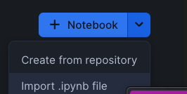
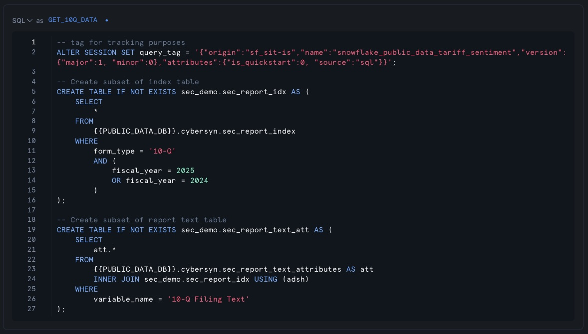
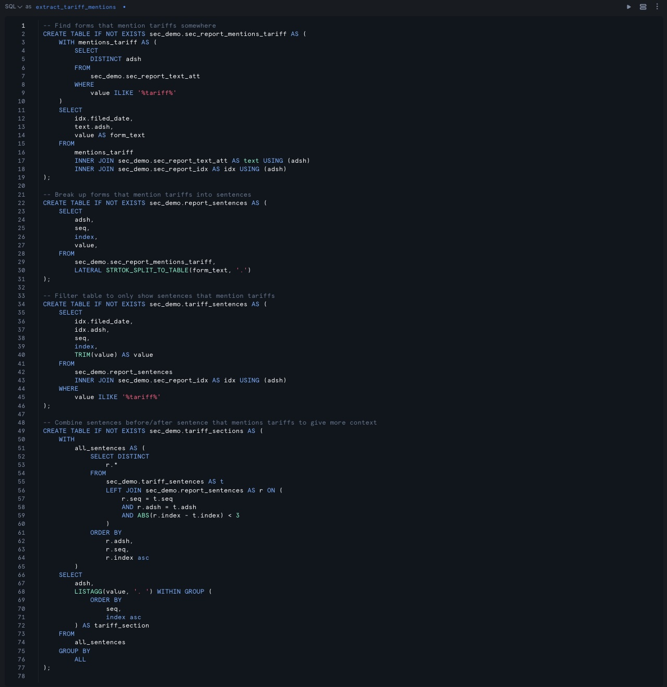
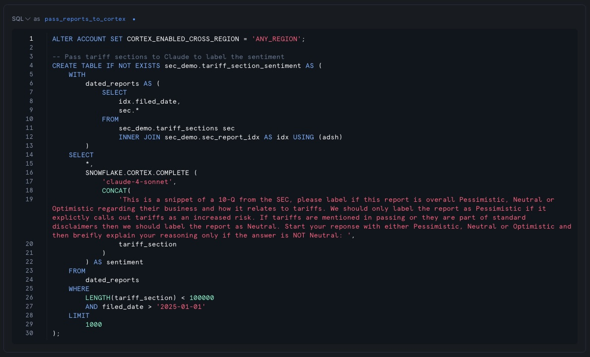
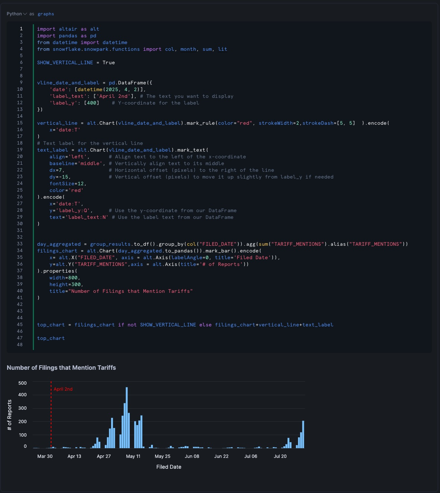
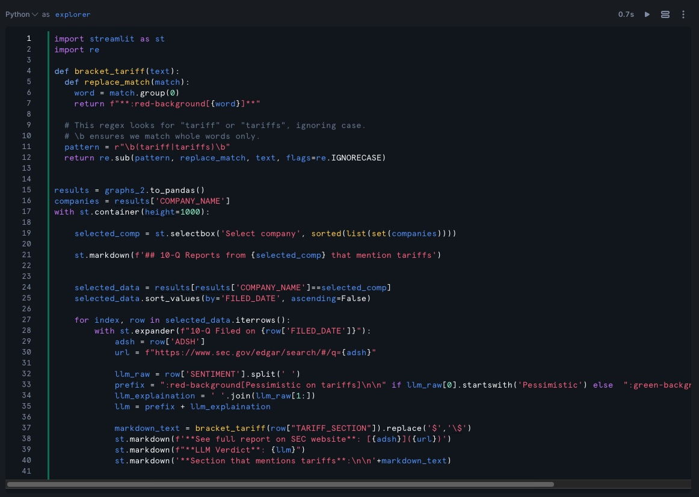
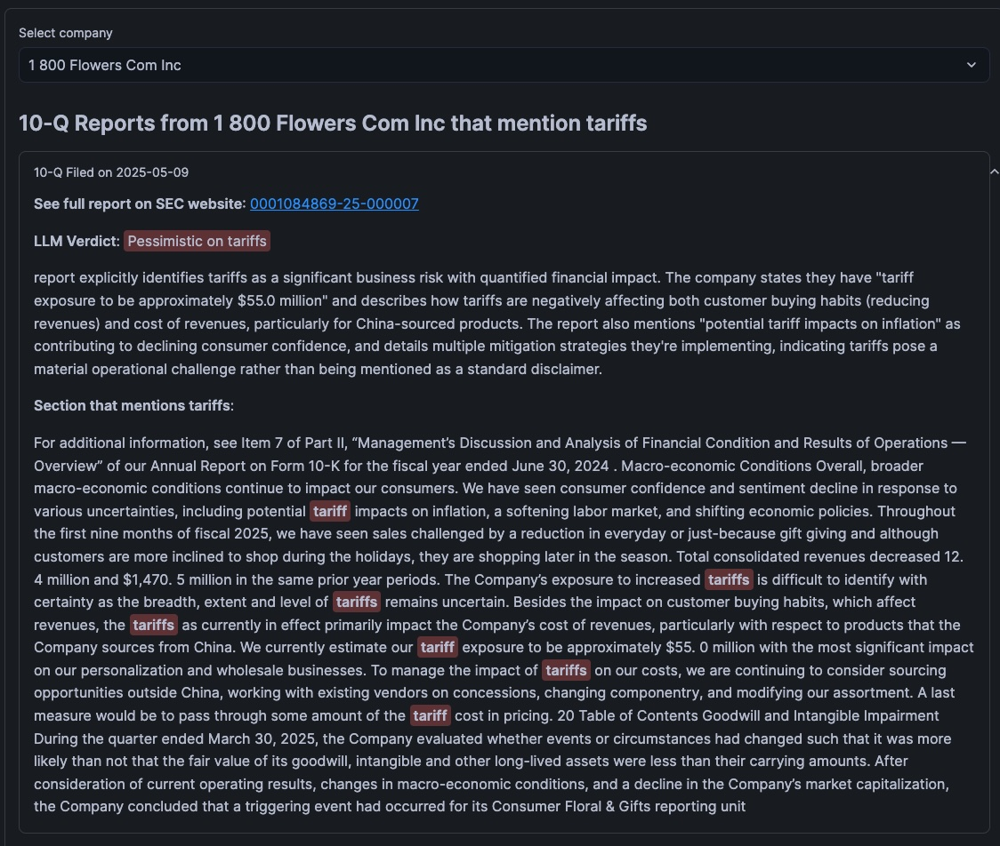

author: Hartland Brown
id: SFGUIDE-SEC-TARIFF-SENTIMENT
summary: This is a sample Snowflake Guide
categories: Getting-Started, data-science
environments: web
status: Published 
feedback link: https://github.com/Snowflake-Labs/sfguides/issues
tags: Getting Started, Data Science, Data Engineering, Tariff, Snowflake Public Data, Cortex, Sentiment

# Snowflake Public Data - SEC Tarrif Sentiment
<!-- ------------------------ -->
## Overview 
Duration: 1

### Snowflake Public Data - SEC Tarrif Sentiment

This demo was built to help showcase Snowflake's Public Data Products.
It leverages the SEC data of the catalog.

### Snowflake Public Data Products

In order to help customers experience the full power of their own data, Snowflake has curated hundreds of datasets that can be downloaded straight to your account from the Snowflake Marketplace!

The contents of these data sets cover a myriad of topics, from [US Real Estate](https://app.snowflake.com/marketplace/listing/GZTSZAS2KI6/snowflake-public-data-products-us-real-estate?originTab=provider&providerName=Snowflake%20Public%20Data%20Products&profileGlobalName=GZTSZAS2KCS) to information about Canada's GDP in the [Canadian Government Data](https://app.snowflake.com/marketplace/listing/GZTSZAS2KFB/snowflake-public-data-products-canadian-government?originTab=provider&providerName=Snowflake%20Public%20Data%20Products&profileGlobalName=GZTSZAS2KCS) listing.

A full list of Snowflake's data products can be browsed [here](https://data-catalog.snowflake.com/) and any of these data sets can be downloaded to your account from the [Marketplace Listing](https://app.snowflake.com/marketplace/listing/GZTSZ290BV255
)

### Why Snowflake Public Data Products

You can gain access to a suite of public domain datasets all in one location on the Snowflake Marketplace. Snowflake Public Data Products provide a foundational layer of data for any analysis.

### Unified Schema
We use a unified schema that balances flexibility for new data with consistency in core tables. This approach helps users who are familiar with Snowflake Datasets to quickly orient themselves to new datasets, which are built around the concepts of entities and timeseries.

### Dataset Joinability 
We create standardized index tables, including geography and company indices, that can be joined to all relevant Snowflake tables.

### Data Release
Snowflake consistently monitors each data source and updates the data product on Snowflake Marketplace automatically.
Point in Time History
History tables provide an auditable record of data changes over time.

### This Demo

The SEC Tarrif Sentiment Demo downloads and utilizes the [SEC Filings](https://app.snowflake.com/marketplace/listing/GZTSZAS2KH9/snowflake-public-data-products-sec-filings) dataset. 

### Prerequisites
- Familiarity with Snowflake Marketplace

### What You’ll Learn 
- How to access Snowflake's Public Data Listings
- How to sort through the SEC Listing for Tariff Data
- How to leverage Cortex to analyze sentiment of the SEC Tariff Data

### What You’ll Need 
- A [GitHub](https://github.com/) Account 
- A Snowflake Account

### What You’ll Build 
- An analysis of teriff sentiment based on Snowflake Public Data

<!-- ------------------------ -->
## Get Started/Download the Notebook
Duration: 2

To follow this quickstart please download the SEC_Tarrif_Demo.ipynb notebook from the [github repo](https://github.com/Snowflake-Labs/sfguide-sec-tariff-sentiment) and upload it into your snowflake environment.

<!-- ------------------------ -->
## Download the data
Duration: 2

To download the SEC Filings data you have two options

### Download from the listing
You can download the [SEC Filings](https://app.snowflake.com/marketplace/listing/GZTSZAS2KH9/snowflake-public-data-products-sec-filings) dataset from the listing.

### Run the notebook cell
You can alternatively run the "Download_SEC_Data" cell of the notebook

Once you have downloaded the data, please update the PUBLIC_DATA_DB variable in the PUBLIC_DB_NAME cell to the name you have given the downloaded database

> If you choose to run the "Download_SEC_Data" cell, please at least view the listing after this quickstart to familiarize yourself further with this and other Snowflake Public Data Sets
<!-- ------------------------ -->

## Filter the Data
Duration: 2

At this point we are going to go through two steps of filtering in order to minimize querried data, and sort for relevant tariff data. This helps to improve the performance of the LLM when analyzing sentiment.

### Get 10Q text
Please run the "GET_10Q_DATA" cell to sort out 10Q data for fiscal year 2024 and 2025 from the sec_report_index table

### Extract Mentions of Tariffs
Please run the "extract_tariff_mentions" cell, this will further filter the data to only include any rows that contain the word "tariff" in any text field

<!-- ------------------------ -->
## Query Cortex for sentiment
Duration: 2

Now we'll pass the data we've curated to Cortex with the goal of extracting each company's sentiment on Tariff's. The prompt below defines what we believe "Pessimistic", "Neutral", and "Optimistic" to mean and requests that cortex include the sentiment at the start of the response.

Please run the "pass_reports_to_cortex" cell of the notebook now.

### Analyze Results - Graphs
Duration: 2

Here we will analyze the sentiment that Cortex returns to us by first viewing the mention of tariffs over time.

Please run the "group_results" and "graphs" cells. This will result in the below graph displaying all found mentions of tariffs, with several substantial spikes over the last few months.

<!-- ------------------------ -->

### Analyze Results - By Company
Duration: 2

Finally, we'll take a look at the specific results retrieved from Cortex and browse each result by the company who filed the 10-Q to see what their sentiment is towards tariffs.

We are taking a look at 1-800 Flowers' sentiment towards tariffs in the filed report below. As you can see, Cortex has returned that the company is Pessimistic on tariffs, and cites that this is due to a high tariff exposure to the tune of around $55 million. Which has affected both customer purchases and their revenue, particulalry in regards to goods made in China.

<!-- ------------------------ -->

## Conclusion And Resources
Duration: 1

Thank you for taking the time to explore the Snowflake Public Data set and learn a bit about how these data sets can be leveraged! 

If you want to learn more about the many different free data sets that Snowflake has made available to you on the marketplace, you can find the listing here : [Snowflake Public Data Sets](https://app.snowflake.com/marketplace/listing/GZTSZ290BV255
)

### Related Resources
- [Fork the Repo](https://github.com/Snowflake-Labs/sfguide-sec-tariff-sentiment/tree/main)
- [Download Reference Architecture](https://www.snowflake.com/content/dam/snowflake-site/en/developers/solution-center/snowflake-public-data.jpg)
- [Watch the Demo](https://youtu.be/scmY5at0Fig?list=TLGG7_O_3yx38OoyNDA5MjAyNQ)
