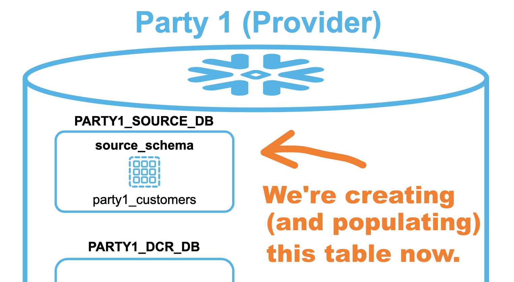
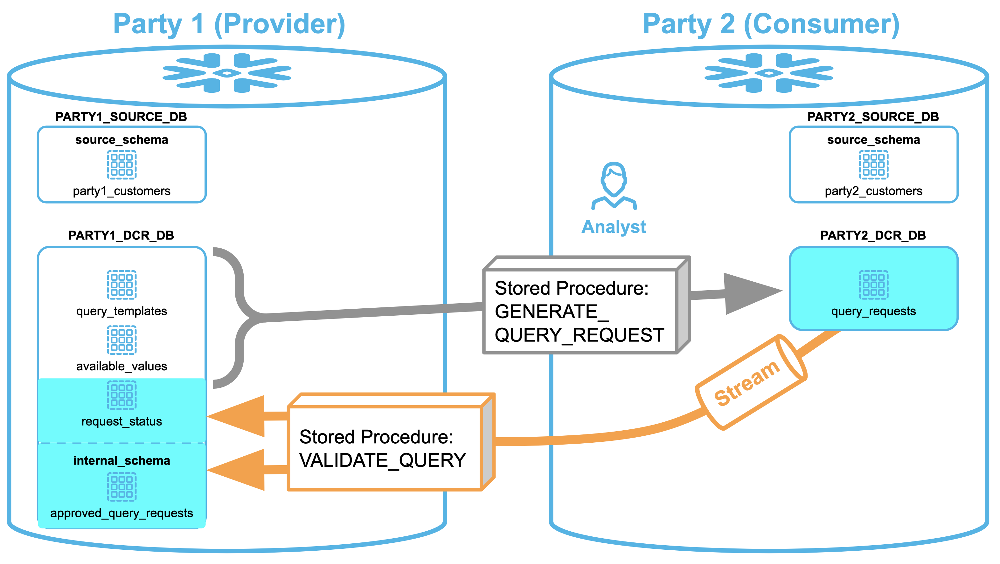

author: Rachel Blum
id: secure_your_data_with_projection_constraints
summary: Learn how to use projection constraints to secure your data
categories: Demos
environments: web
status: Published 
feedback link: https://github.com/Snowflake-Labs/sfguides/issues
tags: Getting Started, Data Clean Rooms, Data Engineering 

# Secure Your Data with Projection Constraints
<!-- ------------------------ -->
## Overview 
Duration: 2

Note: The Projection Constraint feature is currently in Private Preview.  Please contact your account team:
- If your organization has executed preview terms and you would like to have this preview feature enabled in your Snowflake instance
- If you have questions about the Public Preview and GA timelines

Data Clean Rooms (DCRs) are secure environments that enable multiple organizations (or divisions of an organization) to bring data together for joint analysis under defined guidelines and restrictions that keep the data secure.  These guidelines control what data comes into the clean room, how the data within the clean room can be joined with other data in the clean room, the kinds of analytics that can be performed on the clean room data, and what data - if any - can leave the clean room environment.  

Traditional DCR implementations require organizations to copy their data to a separate physical location.  Snowflake's DCR model, however, leverages [a unique architecture](https://www.snowflake.com/blog/distributed-data-clean-rooms-powered-by-snowflake/) that enables each organization to *maintain full control of their data* in their *own secure Snowflake account*.  In other words, two (or more) organizations can leverage Snowflake DCRs to join data without copying, moving, or sharing the underlying data, and to perform analyses on large amounts of data with high performance and scalability.

### Prerequisites
- Familiarity with Snowflake's [unique DCR architecture](https://www.snowflake.com/blog/distributed-data-clean-rooms-powered-by-snowflake/)
- Working knowledge with Git, Snowflake objects, and the [Snowflake Web UI](https://docs.snowflake.com/en/user-guide/ui-web.html)
- Clear understanding of how Snowflake [Secure Data Sharing](https://docs.snowflake.com/en/user-guide/data-sharing-intro.html) works

### What You’ll Learn 
- How to create and deploy a DCR environment between two Snowflake accounts
- How DCR query requests are initiated from one Snowflake account to another
- How DCR query requests are reviewed and approved (or declined)
- How approved DCR query requests are executed

### What You’ll Build 
This Quickstart lab will demonstrate how Snowflake's [unique DCR deployment architecture](https://www.snowflake.com/blog/distributed-data-clean-rooms-powered-by-snowflake/) works by walking you through the process of deploying a simple - yet powerful - two-party Snowflake DCR that joins data on PII fields without either party revealing that PII to the other.

### What You’ll Need 
- **Two** Snowflake accounts - either [Enterprise or Business Critical edition](https://docs.snowflake.com/en/user-guide/intro-editions.html) - that are deployed in the **same** [cloud provider and region](https://docs.snowflake.com/en/user-guide/intro-regions.html). I would **highly recommend** that you procure these as [Snowflake 30-day free trial accounts](https://docs.snowflake.com/en/user-guide/admin-trial-account.html) to make things easier for you - Simply go through the signup process twice on [signup.snowflake.com](https://signup.snowflake.com), making certain to select the **same cloud provider and region** for each (see screenshot below).  I also recommend selecting the same [Snowflake edition](https://docs.snowflake.com/en/user-guide/intro-editions.html) for both accounts as well.
- Logins to **both** of the Snowflake accounts which have [ACCOUNTADMIN role access](https://docs.snowflake.com/en/user-guide/security-access-control-considerations.html) (note that [Snowflake free trial accounts](https://docs.snowflake.com/en/user-guide/admin-trial-account.html) provide this automatically, which is why I recommend using them for this Quickstart).


### Attribution
The author wishes to recognize Michael Rainey and Rachel Blum as the original developers of the SQL code adapted for this Quickstart.

<!-- ------------------------ -->
## Getting Started
Duration: 32

### Watch The Video
Before going any further, please watch the following YouTube video where I provide a walk-through of Snowflake's DCR architecture, along with a demonstration of the clean room that you'll be building during this Quickstart.  This is your roadmap for the steps ahead, so please watch it now, and then refer back to it as you progress through this Quickstart.  
<video id="UI5na73_9cA"></video>

### Log Into Both Snowflake Accounts
The first task at hand is to log into each of the two Snowflake accounts that you'll be using for this Quickstart.  As mentioned earlier, the logins that you use for these Snowflake accounts must have [ACCOUNTADMIN role access](https://docs.snowflake.com/en/user-guide/security-access-control-considerations.html) and both accounts must be deployed in the **same** [cloud and region](https://docs.snowflake.com/en/user-guide/intro-regions.html). You should now log in to each account simultaneously using separate browser tabs or windows.

Positive
: You may use either the [classic Snowflake UI](https://docs.snowflake.com/en/user-guide/ui-using.html) or the [new Snowsight interface](https://docs.snowflake.com/en/user-guide/ui-web.html) for this Quickstart. I used Snowsight in [the YouTube video](https://www.youtube.com/watch?v=UI5na73_9cA) that you watched earlier, and for all of the screenshots in this Quickstart.

### Designate Party1 (Provider) And Party2 (Consumer) Accounts
As you noticed in [my YouTube video](https://www.youtube.com/watch?v=UI5na73_9cA), one of the Snowflake accounts was called "Party1" (the Provider account, with the rich CUSTOMER data) and the other was called "Party 2" (the Consumer account).  At this point you should designate each of your two accounts likewise.  Here's a suggestion: Since you probably logged into each Snowflake account using separate browser tabs or windows, I'll suggest that the one on the left of your screen should be Party1, and the one on your right Party2 (to keep consistent with the diagrams in the video).  Whatever works best for you though.

### Note Party1 (Provider) And Party2 (Consumer) Account Identifiers
Each Snowflake account is assigned [a unique identifier](https://docs.snowflake.com/en/user-guide/admin-account-identifier.html) (sometimes called a Locator) within its cloud provider and region.  If you took my recommendation to use [Snowflake 30-day free trial accounts](https://docs.snowflake.com/en/user-guide/admin-trial-account.html) then these will be a random combination of letters and numbers, such as "WN39195".  Please go ahead and determine your account identifers by opening a new worksheet and running the following command in each account's UI:
``` sql
select current_account();
```
Here's a screenshot of what it looks like when I did this for one of my accounts:


Be sure to note which account identifier corresponds to the Party1 and Party2 accounts as you'll need these later.

<!-- ------------------------ -->
## Party1 Setup, Part 1
Duration: 9

### Set Local Variables
Open a new worksheet in the **Party1** account's UI and rename it to `Party1 - Setup1`.  
Next, copy and paste the code below into this new worksheet:
``` sql
set (myusername, party1account, party2account) = (current_user(),current_account(),'Party2acctID');

select 'Current username: ' || $myusername || 
       ' Party1 Account: ' || $party1account ||
       ' Party2 Account: ' || $party2account "Status";
```
Now - before you run this piece of code - you'll need to replace `Party2acctID` with the Party 2 account identifier that you noted earlier.  _Then_ you can run the code!  

Here's a screenshot of what it looks like when I did this for my accounts:


Check the account identifiers that get echoed back to you for accuracy - they should match your notes.

Positive
: From here forward we'll be building the first part of the Party1 setup script.  So, you'll simply paste each of the code segments that appear below in your `Party1 - Setup1` worksheet and run them individually (this is done by selecting the newly-pasted code, then clicking the blue "Run" button in the upper-right corner).

### Roles and Privileges
These commands create the `party1_role` and assign it the appropriate privileges:
``` sql
-- Create roles
USE ROLE securityadmin;
CREATE OR REPLACE ROLE party1_role;
GRANT ROLE party1_role TO ROLE sysadmin;
GRANT ROLE party1_role TO USER identifier($myusername);

-- Grant privileges to roles
USE ROLE accountadmin;
GRANT CREATE DATABASE ON ACCOUNT TO ROLE party1_role;
GRANT CREATE SHARE ON ACCOUNT TO ROLE party1_role;
GRANT IMPORT SHARE ON ACCOUNT TO ROLE party1_role;
GRANT EXECUTE TASK ON ACCOUNT TO ROLE party1_role;
GRANT CREATE WAREHOUSE ON ACCOUNT TO ROLE party1_role;
```

### Sample Data and Virtual Warehouse
These commands create the `SNOWFLAKE_SAMPLE_DATA` database which will be used to populate `PARTY1_CUSTOMERS` table with synthetic data, along with Party1's [virtual warehouse](https://docs.snowflake.com/en/user-guide/warehouses.html).  Note that this [sample database](https://docs.snowflake.com/en/user-guide/sample-data-using.html) is typically already present in newly-created Snowflake accounts, but this script will create it if needed:
``` sql
-- Create SNOWFLAKE_SAMPLE_DATA Database (if needed) and grant privileges to appropriate roles
CREATE DATABASE if not exists SNOWFLAKE_SAMPLE_DATA FROM SHARE SFC_SAMPLES.SAMPLE_DATA;
GRANT IMPORTED PRIVILEGES ON DATABASE SNOWFLAKE_SAMPLE_DATA TO ROLE ACCOUNTADMIN;
GRANT IMPORTED PRIVILEGES ON DATABASE SNOWFLAKE_SAMPLE_DATA TO ROLE party1_role;

-- Create virtual warehouse
USE ROLE party1_role;
CREATE OR REPLACE WAREHOUSE party1_wh warehouse_size=xsmall;
USE WAREHOUSE party1_wh;
```

### Source Database and Synthetic Customer Data
We're now ready to create the `PARTY1_SOURCE_DB` database and `SOURCE_SCHEMA`, along with the `PARTY1_CUSTOMERS` table that we'll populate with synthetic data from the `SNOWFLAKE_SAMPLE_DATA` database:


``` sql
-- Create source database and schema, along with customer table populated with synthetic data
-- Note that this dataset has demographics included
CREATE OR REPLACE DATABASE party1_source_db;
CREATE OR REPLACE SCHEMA party1_source_db.source_schema;

CREATE OR REPLACE TABLE 
   party1_source_db.source_schema.party1_customers 
AS SELECT
   c.c_customer_sk customer_sk,
   c.c_customer_id customer_id,
   c.c_salutation salutation,
   c.c_first_name first_name,
   c.c_last_name last_name,
   c.c_email_address email_address,
   ca.ca_street_number street_number,
   ca.ca_street_name street_name,
   ca.ca_street_type street_type,
   ca.ca_city city,
   ca.ca_county county,
   ca.ca_state state,
   ca.ca_zip postal_code,
   CASE WHEN c.c_salutation IN ('Ms.','Miss', 'Mrs.') THEN 'F' WHEN c.c_salutation IN ('Mr.','Sir') THEN 'M' ELSE cd.cd_gender END gender, -- To correct obvious anomalies in the synthetic data
   cd.cd_marital_status marital_status,
   cd.cd_education_status education_status,
   cd.cd_purchase_estimate purchase_estimate,
   cd.cd_credit_rating credit_rating
FROM 
   snowflake_sample_data.tpcds_sf10tcl.customer c
INNER JOIN
   snowflake_sample_data.tpcds_sf10tcl.customer_address ca ON ca.ca_address_sk = c.c_current_addr_sk
INNER JOIN
   snowflake_sample_data.tpcds_sf10tcl.customer_demographics cd ON cd.cd_demo_sk = c.c_current_cdemo_sk
WHERE c.c_customer_sk between 1000 and 2500
;
```

### Clean Room Database
Our next task is to create the `PARTY1_DCR_DB` database, the `SHARED_SCHEMA` and `INTERNAL_SCHEMA`, and the `QUERY_TEMPLATES`, `AVAILABLE_VALUES`, `REQUEST_STATUS`, and `APPROVED_QUERY_REQUESTS` tables:

``` sql
-- Create clean room database
CREATE OR REPLACE DATABASE party1_dcr_db;

-- Create clean room shared schema and objects
CREATE OR REPLACE SCHEMA party1_dcr_db.shared_schema;

-- Create and populate query template table
CREATE OR REPLACE TABLE party1_dcr_db.shared_schema.query_templates
(
  query_template_name VARCHAR,
  query_template_text VARCHAR
);

INSERT INTO party1_dcr_db.shared_schema.query_templates
VALUES ('customer_overlap_count', $$SELECT @select_cols, COUNT(party2.customer_sk) cnt_customers FROM party1_source_db.source_schema.party1_customers party1 INNER JOIN party2_source_db.source_schema.party2_customers at(timestamp=>'@attimestamp'::timestamp_tz) party2 ON party1.email_address = party2.email_address WHERE exists (SELECT table_name FROM party2_source_db.information_schema.tables WHERE table_schema = 'SOURCE_SCHEMA' AND table_name = 'PARTY2_CUSTOMERS' AND table_type = 'BASE TABLE') GROUP BY @group_by_cols HAVING COUNT(party2.customer_sk) >= @threshold;$$);
INSERT INTO party1_dcr_db.shared_schema.query_templates
VALUES ('customer_overlap_enrich', $$SELECT party2.*, @select_cols FROM party2_source_db.source_schema.party2_customers at(timestamp=>'@attimestamp'::timestamp_tz) party2 LEFT OUTER JOIN party1_source_db.source_schema.party1_customers party1 ON party2.email_address = party1.email_address WHERE exists (SELECT table_name FROM party2_source_db.information_schema.tables WHERE table_schema = 'SOURCE_SCHEMA' AND table_name = 'PARTY2_CUSTOMERS' AND table_type = 'BASE TABLE');$$);

-- Create and populate available values table
CREATE OR REPLACE TABLE party1_dcr_db.shared_schema.available_values
(
  field_group VARCHAR,
  field_name VARCHAR,
  field_values VARCHAR
);

INSERT INTO party1_dcr_db.shared_schema.available_values VALUES ('PARTY1','CITY','');
INSERT INTO party1_dcr_db.shared_schema.available_values VALUES ('PARTY1','COUNTY','');
INSERT INTO party1_dcr_db.shared_schema.available_values VALUES ('PARTY1','STATE','');
INSERT INTO party1_dcr_db.shared_schema.available_values VALUES ('PARTY1','POSTAL_CODE','');
INSERT INTO party1_dcr_db.shared_schema.available_values VALUES ('PARTY1','EDUCATION_STATUS','');
INSERT INTO party1_dcr_db.shared_schema.available_values VALUES ('PARTY1','PURCHASE_ESTIMATE','');
INSERT INTO party1_dcr_db.shared_schema.available_values VALUES ('PARTY1','CREDIT_RATING','');

-- Create request status table
CREATE OR REPLACE TABLE party1_dcr_db.shared_schema.request_status
(
  request_id VARCHAR
  ,request_status VARCHAR
  ,target_table_name VARCHAR
  ,query_text VARCHAR
  ,request_status_ts TIMESTAMP_NTZ
  ,comments VARCHAR
  ,account_name VARCHAR
);

-- Create clean room internal schema and objects
CREATE OR REPLACE SCHEMA party1_dcr_db.internal_schema;

-- Create approved query requests table
CREATE OR REPLACE TABLE party1_dcr_db.internal_schema.approved_query_requests
(
  query_name VARCHAR,
  query_text VARCHAR
);
```

### Query Validation Stored Procedure
The [stored procedure](https://docs.snowflake.com/en/sql-reference/stored-procedures.html) that validates query requests is called `VALIDATE_QUERY`, and that's the next object we'll create.  You may remember this from the architecture diagram during the video: 

For the sake of simplicity - and since my goal was to convey a concept - the depiction here isn't rigorous.  Now that we're knee-deep in the code, I'd like to give you more color around what's _really_ going on.  It turns out that the `VALIDATE_QUERY` stored procedure fetches its data from the `QUERY_REQUESTS` table that gets _shared_ by Party2 to Party1 (and not directly from Party2's table).  Likewise, the [Table Stream](https://docs.snowflake.com/en/user-guide/streams.html) that it uses (called `PARTY2_NEW_REQUESTS`) is actually located in `PARTY1_DCR_DB.INTERNAL_SCHEMA`.  As I mentioned during the video, this table stream's job is to return only the requests that haven't yet been processed, and the stored procedure fetches from it by way of a view called `NEW_REQUESTS_ALL` (we'll create those in Part 2 of the Party1 setup, which is coming up).  

Again, my goal was to convey a concept, hence I elected to keep the diagram simple for the sake of simplicity.  I hope that you'll forgive me for glossing over those details.  In any case, you can now see _exactly_ what's going on by stepping through the code below!
```
-- Create query validation stored procedure
CREATE OR REPLACE PROCEDURE party1_dcr_db.internal_schema.validate_query(account_name VARCHAR)
RETURNS VARCHAR
LANGUAGE JAVASCRIPT
EXECUTE AS CALLER
AS
$$
// VALIDATE_QUERY - Michael Rainey and Rachel Blum
// Adapted for Quickstart by Craig Warman
// Snowflake Computing, MAR 2022
//
// This stored procedure validates a query submitted to the QUERY_REQUESTS table in a 
// simple two-party Snowflake Data Clean Room (DCR) deployment.   It is provided for 
// illustrative purposes only as part of the "Build A Data Clean Room in Snowflake"
// Quickstart lab, and MUST NOT be used in a production environment.
//

try {
  // Set up local variables
  var source_db_name = "party1_source_db";
  var dcr_db_internal_schema_name = "party1_dcr_db.internal_schema";
  var dcr_db_shared_schema_name = "party1_dcr_db.shared_schema";
  
  var minimum_record_fetch_threshold = 3;
  var completion_msg = "Finished query validation.";

  // Get parameters
  var account_name = ACCOUNT_NAME.toUpperCase();

  // Create a temporary table to store the most recent query request(s)
  // The tempoary table name is generated using a UUID to ensure uniqueness.
  // First, fetch a UUID string...
  var UUID_sql = "SELECT replace(UUID_STRING(),'-','_');";                 
  var UUID_statement = snowflake.createStatement( {sqlText: UUID_sql} );
  var UUID_result = UUID_statement.execute();
  UUID_result.next();
  var UUID_str = UUID_result.getColumnValue(1);

  // Next, create the temporary table...
  // Note that its name incorporates the UUID fetched above
  var temp_table_name = dcr_db_internal_schema_name + ".requests_temp_" + UUID_str;
  var create_temp_table_sql = "CREATE OR REPLACE TEMPORARY TABLE " + temp_table_name + " ( \
                                 request_id VARCHAR, select_column_list VARCHAR, at_timestamp VARCHAR, \
                                 target_table_name VARCHAR, query_template_name VARCHAR);";
  var create_temp_table_statement = snowflake.createStatement( {sqlText: create_temp_table_sql} );
  var create_temp_table_results = create_temp_table_statement.execute();

  // Finally, insert the most recent query requests into this tempoary table.
  // Note that records are fetched from the NEW_REQUESTS_ALL view, which is built on a Table Stream object.
  // This will cause the Tabe Stream's offset to be moved forward since a committed DML operation takes place here.
  var insert_temp_table_sql = "INSERT INTO " + temp_table_name + " \
                               SELECT request_id, select_column_list, at_timestamp, target_table_name, query_template_name \
                               FROM " + dcr_db_internal_schema_name + ".new_requests_all;";
  var insert_temp_table_statement = snowflake.createStatement( {sqlText: insert_temp_table_sql} );
  var insert_temp_table_results = insert_temp_table_statement.execute();

  // We're now ready to fetch query requests from that temporary table.
  var query_requests_sql = "SELECT request_id, select_column_list, at_timestamp::string, target_table_name, query_template_name \
                      FROM " + temp_table_name + ";";
  var query_requests_statement = snowflake.createStatement( {sqlText: query_requests_sql} );
  var query_requests_result = query_requests_statement.execute();

  // This loop will iterate once for each query request.
  while (query_requests_result.next()) {
	var timestamp_validated = false;
	var all_fields_validated = false;
	var query_template_validated = false;
	var approved_query_text = "NULL";
	var comments = "DECLINED";
	var request_status = "DECLINED";

    var request_id = query_requests_result.getColumnValue(1);
    var select_column_list = query_requests_result.getColumnValue(2);
    var at_timestamp = query_requests_result.getColumnValue(3);
    var target_table_name = query_requests_result.getColumnValue(4);
    var query_template_name = query_requests_result.getColumnValue(5);

    // Validate the AT_TIMESTAMP for this query request.
    // Note that it must specify a timestamp from the past.
    try {
      var timestamp_sql = "SELECT CASE (to_timestamp('" + at_timestamp + "') < current_timestamp) WHEN TRUE THEN 'Valid' ELSE 'Not Valid' END;"
      var timestamp_statement = snowflake.createStatement( {sqlText: timestamp_sql} );
      var timestamp_result = timestamp_statement.execute();
      timestamp_result.next();
      timestamp_validated = (timestamp_result.getColumnValue(1) == "Valid");
      if (!timestamp_validated) {
        comments = "DECLINED because AT_TIMESTAMP must specify a timestamp from the past.";
        }
    }
    catch (err) {
      timestamp_validated = false;
      comments = "DECLINED because AT_TIMESTAMP is not valid - Error message from Snowflake DB: " + err.message;
    } // Timestamp validation work ends here.

    if (timestamp_validated) {
	  // Validate the fields requested for the query.
	  // This is done by flatting the select_column_list CSV string into a table using Snowflake's SPLIT_TO_TABLE tabular function
	  // then executing a LEFT OUTER JOIN with the columns in the AVAILABLE_VALUES shared table.  The resulting list will indicate 
	  // which fields are valid (available) and which are not.  The requested query can be approved only if *all* columns in 
	  // select_column_list align with corresponding columns in the AVAILABLE_VALUES shared table.
	  var fields_validate_sql = "SELECT requested_column_name, \
										CASE WHEN (field_group IS NOT NULL) AND (field_name IS NOT NULL) THEN 'Available' ELSE 'Not Available' END AS requested_column_status \
								 FROM (SELECT TRIM(value) requested_column_name FROM TABLE(SPLIT_TO_TABLE('" + select_column_list + "',','))) requested_columns \
								 LEFT OUTER JOIN " + dcr_db_shared_schema_name + ".available_values \
								 ON UPPER(TRIM(requested_columns.requested_column_name)) = UPPER(CONCAT(TRIM(available_values.field_group),'.', TRIM(available_values.field_name)))";
	  var fields_validate_statement = snowflake.createStatement( {sqlText: fields_validate_sql} );
	  var fields_validate_result = fields_validate_statement.execute();

	  var returned_column_count = 0;
	  var valid_column_count = 0;
	  var status_list = "";
	  
      // This loop iterates once for each field returned by the query above.
      // It tallies up the number of requested fields, along with the total number of valid (available) fields.
	  while (fields_validate_result.next()) {
		var requested_column_name = fields_validate_result.getColumnValue(1);
		var requested_column_status = fields_validate_result.getColumnValue(2);
	    returned_column_count++;

        if (requested_column_status == "Available") {
          valid_column_count++; }
        else {
          if (status_list != "") {
            status_list += ", and "; }
          status_list += "field \"" + requested_column_name + "\" is not available";
        }
      } // Field loop ends here.
      
      // Check to see if the number of valid (available) fields matches the number of requested fields.
      // The requested query can be approved only if these counts match.  Also, at least one column must 
      // have been found to be valid.
      all_fields_validated = ((valid_column_count == returned_column_count) && (valid_column_count > 0));
      if (!all_fields_validated) {
        comments = "DECLINED because " + status_list;}
    } // Field validation work ends here.

    if (timestamp_validated && all_fields_validated) {
	  // Fetch the template requested for the query.
	  var query_template_sql = "SELECT query_template_text FROM " + dcr_db_shared_schema_name + ".query_templates \
								WHERE UPPER(query_template_name) = '" + query_template_name.toUpperCase() + "' LIMIT 1;";
	  var query_template_statement = snowflake.createStatement( {sqlText: query_template_sql} );
	  var query_template_result = query_template_statement.execute();
      query_template_result.next();
      var query_text = query_template_result.getColumnValue(1);

      query_template_validated = (query_text);
      
      if (!query_template_validated) {
        comments = "DECLINED because query template \"" + query_template_name + "\" does not exist.";}
      else {
        // At this point all validations are complete and the query can be approved.
        request_status = "APPROVED";
        comments = "APPROVED";     

        // First, build the approved query from the template as a CTAS...
        approved_query_text = "CREATE OR REPLACE TABLE " + target_table_name + " AS " + query_text;
        approved_query_text = approved_query_text.replace(/@select_cols/g, select_column_list);
        approved_query_text = approved_query_text.replace(/@group_by_cols/g, select_column_list);
        approved_query_text = approved_query_text.replace(/@threshold/g, minimum_record_fetch_threshold);
        approved_query_text = approved_query_text.replace(/@attimestamp/g, at_timestamp);
        approved_query_text = String.fromCharCode(13, 36, 36) + approved_query_text + String.fromCharCode(13, 36, 36);  // Wrap the query text so that it can be passed to below SQL statements 

        // Next, check to see if the approved query already exists in the internal schema APPROVED_QUERY_REQUESTS table...
        var approved_query_exists_sql = "SELECT count(*) FROM " + dcr_db_internal_schema_name + ".approved_query_requests \
                                         WHERE query_text = " + approved_query_text + ";";
		var approved_query_exists_statement = snowflake.createStatement( {sqlText: approved_query_exists_sql} );
		var approved_query_exists_result = approved_query_exists_statement.execute();
		approved_query_exists_result.next();
		var approved_query_found = approved_query_exists_result.getColumnValue(1);

        // Finally, insert the approved query into the internal schema APPROVED_QUERY_REQUESTS table if it doesn't already exist there.
        if (approved_query_found == "0") {
		  var insert_approved_query_sql = "INSERT INTO " + dcr_db_internal_schema_name + ".approved_query_requests (query_name, query_text) \
										   VALUES ('" + query_template_name + "', " + approved_query_text + ");";
		  var insert_approved_query_statement = snowflake.createStatement( {sqlText: insert_approved_query_sql} );
		  var insert_approved_query_result = insert_approved_query_statement.execute();
          }
      }
    } // Template work ends here.

	// Insert an acknowledgment record into the shared schema request_status table for the current query request.
	var request_status_sql = "INSERT INTO " + dcr_db_shared_schema_name + ".request_status \
								(request_id, request_status, target_table_name, query_text, request_status_ts, comments, account_name) \
							  VALUES (\
								'" + request_id + "', \
								'" + request_status + "', \
								'" + target_table_name + "',\
								" + approved_query_text + ", \
								CURRENT_TIMESTAMP(),\
								'" + comments + "',\
								'" + account_name + "');";
	var request_status_statement = snowflake.createStatement( {sqlText: request_status_sql} );
	var request_status_result = request_status_statement.execute();

  } // Query request loop ends here.
}
catch (err) {
  var result = "Failed: Code: " + err.code + "\n  State: " + err.state;
  result += "\n  Message: " + err.message;
  result += "\nStack Trace:\n" + err.stackTraceTxt;
  return result;
}
return completion_msg;
$$
;
```

### Row Access Policy
Our next-to-last task in this section is to deploy the `DCR_RAP` [Row Access Policy](https://docs.snowflake.com/en/user-guide/security-row-intro.html) that acts as a firewall to protect the `PARTY1_CUSTOMERS` data:

You may be wondering why we don't just use a Snowflake [Secure View](https://docs.snowflake.com/en/user-guide/views-secure.html) for this - It turns out that we certainly could've done that, but then we would lose the [reusability benefit](https://docs.snowflake.com/en/user-guide/security-row-intro.html#benefits) provided by Row Access Policies.  Let's suppose more tables (besides `PARTY1_CUSTOMERS`) needed to be shared - In that case we'd need to build unique secure views for each of those tables, whereas we only need **one** row access policy.  It's just a cleaner solution, in other words - and that's important when it comes to data security and governance.
```
-- Create and apply row access policy to customer source table
CREATE OR REPLACE ROW ACCESS POLICY party1_source_db.source_schema.dcr_rap AS (customer_sk number) returns boolean ->
    current_role() IN ('ACCOUNTADMIN','PARTY1_ROLE')
      or exists  (select query_text from party1_dcr_db.internal_schema.approved_query_requests where query_text=current_statement() or query_text=sha2(current_statement()));

ALTER TABLE party1_source_db.source_schema.party1_customers add row access policy party1_source_db.source_schema.dcr_rap on (customer_sk);
```

### Data Shares
We've now arrived at our final task, which is to create the outbound [Data Shares](https://docs.snowflake.com/en/user-guide/data-sharing-intro.html) from Party1 to the Party2 account:

```
-- Create outbound shares
CREATE OR REPLACE SHARE party1_dcr_share;
CREATE OR REPLACE SHARE party1_source_share;

-- Grant object privileges to DCR share
GRANT USAGE ON DATABASE party1_dcr_db TO SHARE party1_dcr_share;
GRANT USAGE ON SCHEMA party1_dcr_db.shared_schema TO SHARE party1_dcr_share;
GRANT SELECT ON TABLE party1_dcr_db.shared_schema.query_templates TO SHARE party1_dcr_share;
GRANT SELECT ON TABLE party1_dcr_db.shared_schema.available_values TO SHARE party1_dcr_share;
GRANT SELECT ON TABLE party1_dcr_db.shared_schema.request_status TO SHARE party1_dcr_share;

-- Grant object privileges to source share
GRANT USAGE ON DATABASE party1_source_db TO SHARE party1_source_share;
GRANT USAGE ON SCHEMA party1_source_db.source_schema TO SHARE party1_source_share;
GRANT SELECT ON TABLE party1_source_db.source_schema.party1_customers TO SHARE party1_source_share;

-- Add account to shares 
-- Note use of SHARE_RESTRICTIONS clause to enable sharing between Business Critical and Enterprise account deployments
use role accountadmin;
ALTER SHARE PARTY1_DCR_SHARE ADD ACCOUNTS = identifier($party2account) SHARE_RESTRICTIONS=false;
ALTER SHARE PARTY1_SOURCE_SHARE ADD ACCOUNTS = identifier($party2account) SHARE_RESTRICTIONS=false;
use role party1_role;
```
At this point we're ready to begin setting up the Party2 account!

<!-- ------------------------ -->
## Party2 Setup, Part 1
Duration: 8

### Set Local Variables
Open a new worksheet in the **Party2** account's UI and rename it to `Party2 - Setup1`.  
Next, copy and paste the code below into this new worksheet:
``` sql
set (myusername, party1account, party2account) = (current_user(),'Party1acctID',current_account());

select 'Current username: ' || $myusername || 
       ' Party1 Account: ' || $party1account ||
       ' Party2 Account: ' || $party2account "Status";
```
Be sure you replace `Party1acctID` with the Party1 account identifier that you noted earlier before you run this piece of code.  The "Status" that gets echoed back to you should be an exact duplicate of what you saw at the beginning of the `Party1 - Setup1` script.

### Roles and Privileges
These commands create the `party2_role` and assign it the appropriate privileges:
``` sql
-- Create roles
USE ROLE securityadmin;
CREATE OR REPLACE ROLE party2_role;
GRANT ROLE party2_role TO ROLE sysadmin;
GRANT ROLE party2_role TO USER identifier($myusername);

-- Grant privileges to roles
USE ROLE accountadmin;
GRANT CREATE DATABASE ON ACCOUNT TO ROLE party2_role;
GRANT CREATE SHARE ON ACCOUNT TO ROLE party2_role;
GRANT IMPORT SHARE ON ACCOUNT TO ROLE party2_role;
GRANT EXECUTE TASK ON ACCOUNT TO ROLE party2_role;
GRANT CREATE WAREHOUSE ON ACCOUNT TO ROLE party2_role;
```

### Sample Data and Virtual Warehouse
These commands create the `SNOWFLAKE_SAMPLE_DATA` database which will be used to populate `PARTY2_CUSTOMERS` table with synthetic data, along with Party2's [virtual warehouse](https://docs.snowflake.com/en/user-guide/warehouses.html).  As noted before, this [sample database](https://docs.snowflake.com/en/user-guide/sample-data-using.html) is typically already present in newly-created Snowflake accounts but this script will create it if needed:
``` sql
-- Create SNOWFLAKE_SAMPLE_DATA Database (if needed) and grant privileges to appropriate roles
CREATE DATABASE if not exists SNOWFLAKE_SAMPLE_DATA FROM SHARE SFC_SAMPLES.SAMPLE_DATA;
GRANT IMPORTED PRIVILEGES ON DATABASE SNOWFLAKE_SAMPLE_DATA TO ROLE ACCOUNTADMIN;
GRANT IMPORTED PRIVILEGES ON DATABASE SNOWFLAKE_SAMPLE_DATA TO ROLE party2_role;

-- Create virtual warehouse
USE ROLE party2_role;
CREATE OR REPLACE WAREHOUSE party2_wh warehouse_size=xsmall;
USE WAREHOUSE party2_wh;
```

### Source Database and Synthetic Customer Data
We're now ready to create the `PARTY2_SOURCE_DB` database and `SOURCE_SCHEMA`, along with the `PARTY2_CUSTOMERS` table that we'll populate with synthetic data from the `SNOWFLAKE_SAMPLE_DATA` database:


``` sql
-- Create source database and schema, along with customer table populated with synthetic data
-- Note that this dataset doesn't have any demographics - hence the need for encrichment from Party1's dataset
CREATE OR REPLACE DATABASE party2_source_db;
CREATE OR REPLACE SCHEMA party2_source_db.source_schema;

CREATE OR REPLACE TABLE 
   party2_source_db.source_schema.party2_customers 
AS SELECT
   c.c_customer_sk customer_sk,
   c.c_customer_id customer_id,
   c.c_salutation salutation,
   c.c_first_name first_name,
   c.c_last_name last_name,
   c.c_email_address email_address,
   ca.ca_street_number street_number,
   ca.ca_street_name street_name,
   ca.ca_street_type street_type,
   ca.ca_city city,
   ca.ca_county county,
   ca.ca_state state,
   ca.ca_zip postal_code
FROM 
   snowflake_sample_data.tpcds_sf10tcl.customer c
INNER JOIN
   snowflake_sample_data.tpcds_sf10tcl.customer_address ca ON ca.ca_address_sk = c.c_current_addr_sk
WHERE c.c_customer_sk between 2000 and 3500
;
```

### Clean Room Database
Our next task is to create the `PARTY2_DCR_DB` database, the `SHARED_SCHEMA` and `INTERNAL_SCHEMA`, and the `QUERY_REQUESTS` table:

Note that we'll also enable 14 days of change tracking on the `QUERY_REQUESTS` table for use by the `PARTY2_NEW_REQUESTS` [Table Stream](https://docs.snowflake.com/en/user-guide/streams.html) that we discussed earlier.
``` sql
-- Create clean room database
CREATE OR REPLACE DATABASE party2_dcr_db;

-- Create clean room shared schema and objects
CREATE OR REPLACE SCHEMA party2_dcr_db.shared_schema;

-- Create query requests table
CREATE OR REPLACE TABLE party2_dcr_db.shared_schema.query_requests
(
  request_id VARCHAR,
  target_table_name VARCHAR,
  query_template_name VARCHAR,
  select_column_list VARCHAR,
  at_timestamp VARCHAR,
  request_ts TIMESTAMP_NTZ
);

-- Enable change tracking on the query requests table 
-- This will be used by the PARTY1_DCR_DB.INTERNAL_SCHEMA.PARTY2_NEW_REQUESTS Table Stream 
ALTER TABLE party2_dcr_db.shared_schema.query_requests
SET CHANGE_TRACKING = TRUE   
    DATA_RETENTION_TIME_IN_DAYS = 14;

-- Create clean room internal schema
CREATE OR REPLACE SCHEMA party2_dcr_db.internal_schema;
```

### Query Generation Stored Procedure
The [stored procedure](https://docs.snowflake.com/en/sql-reference/stored-procedures.html) that a Party2 Analyst runs for generating query requests is called `GENERATE_QUERY_REQUESTS`, and that's the next object we'll create: 

As before - with the `VALIDATE_QUERY` stored procedure - the depiction here isn't rigorous.  In this case the `GENERATE_QUERY_REQUESTS` stored procedure doesn't fetch any data from the `QUERY_TEMPLATES` or `AVAILABLE_VALUES` tables.  What's actually happening is that the record this stored procedure inserts into the `QUERY_REQESTS` table references the template name that the Party2 analyst chose from those in the `QUERY_TEMPLATES` table, along with the attribute(s) s/he chose from those in the `AVAILABLE_VALUES` table.  

It's worth noting that this stored procedure doesn't validate the analyst's selections - that's done by the `VALIDATE_QUERY` stored procedure.  Instead, it simply inserts its record into the `QUERY_REQUESTS` table and then goes into a wait loop until it finds a corresponding acknowledgement record in the shared `REQUEST_STATUS` table.  Note that the loop will self-terminate if the time limit passed in via the `WAIT_MINUTES` parameter is exceeded.  This sort of wait loop construct certainly wouldn't be ideal for a production deployment, but it works just fine for a demo environment. 

Anyway, going back to my diagram there - I'll reiterate that my goal was to convey a concept, hence my election to include that line between the `GENERATE_QUERY_REQUEST` stored procedure and the `QUERY_TEMPLATES` and `AVAILABLE_VALUES` tables, even though the code doesn't actually do a direct fetch.  Well, not technically, at least.  So I beg your forgiveness once again in the hopes that you recognize the greater good that I was attempting to achieve!
```
-- Create query request generation stored procedure
CREATE OR REPLACE PROCEDURE party2_dcr_db.internal_schema.generate_query_request(target_table_name VARCHAR,query_template_name VARCHAR,select_column_list VARCHAR, at_timestamp VARCHAR, wait_minutes REAL)
  RETURNS VARCHAR
  LANGUAGE JAVASCRIPT
  EXECUTE AS CALLER
AS
$$
// GENERATE_QUERY_REQUEST - Michael Rainey and Rachel Blum
// Adapted for Quickstart by Craig Warman
// Snowflake Computing, MAR 2022
//
// This stored procedure generates query requests and submits them to the QUERY_REQUESTS 
// table in a simple two-party Snowflake Data Clean Room (DCR) deployment.   It is provided 
// for illustrative purposes only as part of the "Build A Data Clean Room in Snowflake"
// Quickstart lab, and MUST NOT be used in a production environment.
//

try {
  // Set up local variables
  var dcr_db_internal_schema_name = "party2_dcr_db.internal_schema";
  var dcr_db_shared_schema_name_in = "party1_dcr_db.shared_schema";
  var dcr_db_shared_schema_name_out = "party2_dcr_db.shared_schema";

  // Get parameters
  var select_column_list = SELECT_COLUMN_LIST;
  var target_table_name = TARGET_TABLE_NAME;
  var query_template_name = QUERY_TEMPLATE_NAME;
  var at_timestamp = AT_TIMESTAMP; 
  var wait_minutes = WAIT_MINUTES;

  var timeout = wait_minutes * 60 * 1000; // Note that this is specified in milliseconds, hence the need to multiply the WAIT_MINUTES parameter value accordingly
 
  // Fetch a UUID string for use as a Result ID.
  var UUID_sql = "SELECT replace(UUID_STRING(),'-','_');";                 
  var UUID_statement = snowflake.createStatement( {sqlText: UUID_sql} );
  var UUID_result = UUID_statement.execute();
  UUID_result.next();
  var request_id = UUID_result.getColumnValue(1);

  // Generate the request and insert into the QUERY_REQUESTS table.
  var insert_request_sql = "INSERT INTO " + dcr_db_shared_schema_name_out + ".query_requests \
							 (request_id, target_table_name, query_template_name, select_column_list, at_timestamp, request_ts) \
						   VALUES \
							 ( \
							   '" + request_id + "', \
							   \$\$" + target_table_name + "\$\$, \
							   \$\$" + query_template_name + "\$\$, \
							   \$\$" + select_column_list + "\$\$, \
							   \$\$" + at_timestamp + "\$\$, \
							   CURRENT_TIMESTAMP() \
							 );";

  var insert_request_statement = snowflake.createStatement( {sqlText: insert_request_sql} );
  var insert_request_result = insert_request_statement.execute();

	
  // Poll the REQUEST_STATUS table until the request is complete or the timeout period has expired.
  // Note that this is fine for an interactive demo but wouldn't be a good practice for a production deployment.
  var request_status_sql = "SELECT request_status, comments, query_text, target_table_name FROM " + dcr_db_shared_schema_name_in + ".request_status \
                            WHERE request_id = '" + request_id + "' ORDER BY request_status_ts DESC LIMIT 1;";
  var request_status_statement = snowflake.createStatement( {sqlText: request_status_sql} );

  var startTimestamp = Date.now();
  var currentTimestamp = null;
  do {
	  currentTimestamp = Date.now();
	  var request_status_result =  request_status_statement.execute();
  } while ((request_status_statement.getRowCount() < 1) && (currentTimestamp - startTimestamp < timeout));  


  // Exit with message if the wait time has been exceeded.
  if ((request_status_statement.getRowCount() < 1) && (currentTimestamp - startTimestamp >= timeout)) {
	  return "Unfortunately the wait time of " + wait_minutes.toString() + " minutes expired before the other party reviewed the query request.  Please try again.";
  }

  // Examine the record fetched from the REQUEST_STATUS table.
  request_status_result.next();
  var status = request_status_result.getColumnValue(1);
  var comments = request_status_result.getColumnValue(2);
  var query_text = request_status_result.getColumnValue(3);
  var target_table_name = request_status_result.getColumnValue(4);

  if (status != "APPROVED") {
	  return "The other party DID NOT approve the query request.  Comments: " + comments;
  }

  // The query request was approved.  
  // First, set context to the DCR internal schema...
  var use_schema_sql = "USE " + "SCHEMA " + dcr_db_internal_schema_name + ";";  // Have to separate "USE" and "SCHEMA" strings due to Snowsight bug.
  var use_schema_statement = snowflake.createStatement( {sqlText: use_schema_sql} );
  var use_schema_result = use_schema_statement.execute(); 

  // Then execute the approved query.
  var approved_query_statement = snowflake.createStatement( {sqlText: query_text} );
  var approved_query_result = approved_query_statement.execute();
  return "The other party APPROVED the query request.  Its results are now available this table: " + dcr_db_internal_schema_name.toUpperCase() + "." + target_table_name.toUpperCase();

} 
catch (err) {
    var result =  "Failed: Code: " + err.code + "\n  State: " + err.state;
    result += "\n  Message: " + err.message;
    result += "\nStack Trace:\n" + err.stackTraceTxt;
    return result;
}
$$
;

```

### Data Shares
Our final task is to create the outbound [Data Share](https://docs.snowflake.com/en/user-guide/data-sharing-intro.html) from Party2 to the Party1 account:

```
-- Create outbound share
CREATE OR REPLACE SHARE party2_dcr_share;

-- Grant object privileges to DCR share
GRANT USAGE ON DATABASE party2_dcr_db TO SHARE party2_dcr_share;
GRANT USAGE ON SCHEMA party2_dcr_db.shared_schema TO SHARE party2_dcr_share;
GRANT SELECT ON TABLE party2_dcr_db.shared_schema.query_requests TO SHARE party2_dcr_share;

-- Add account to share 
-- Note use of SHARE_RESTRICTIONS clause to enable sharing between Business Critical and Enterprise account deployments
use role ACCOUNTADMIN;
ALTER SHARE party2_dcr_share ADD ACCOUNTS = identifier($party1account) SHARE_RESTRICTIONS=false;
use role party2_role;
```
Now that we've completed initial setup on both the Party1 and Party2 accounts, we're ready to do the secondary setup steps on both accounts!

<!-- ------------------------ -->
## Party1 Setup, Part 2
Duration: 4

With the appropriate objects and data shares now in place, we can return to each of the two accounts and finalize our setup work based on the respective incoming shares.  Let's start off with the Party1 account.

### Set Local Variables
Open a new worksheet in the **Party1** account's UI and rename it to `Party1 - Setup2`.  
Next, copy and paste the code below into this new worksheet:
``` sql
set (myusername, party1account, party2account) = (current_user(),current_account(),'Party2acctID');

select 'Current username: ' || $myusername || 
       ' Party1 Account: ' || $party1account ||
       ' Party2 Account: ' || $party2account "Status";
```
Be sure you replace `Party2acctID` with the Party2 account identifier that you noted earlier before you run this piece of code.  The "Status" that gets echoed back to you should be an exact duplicate of what you saw at the beginning of the two other scripts that we've done so far.

### Create Database From Incoming Share
Our first task is to create the `PARTY2_DCR_DB` database based on the incoming share from the Party2 account, and then grant access priviliges to the `PARTY1_ROLE`:

``` sql
-- Create databases from incoming Party2 share and grant privileges
use role accountadmin;
set shareparty2dcr = concat($party2account,'.party2_dcr_share');
CREATE OR REPLACE DATABASE party2_dcr_db FROM SHARE identifier($shareparty2dcr);
GRANT IMPORTED PRIVILEGES ON DATABASE party2_dcr_db TO ROLE party1_role;
```

### Create Requests Stream and View
We're now ready to create that `PARTY2_NEW_REQUESTS` [Table Stream](https://docs.snowflake.com/en/user-guide/streams.html) that we discussed earlier during the `VALIDATE_QUERY` stored procedure setup.  You may remember that this table stream's job is to return the `QUERY_REQUESTS` table records that haven't yet been processed, and that the `VALIDATE_QUERY` stored procedure fetches from this table stream by way of a view called `NEW_REQUESTS_ALL`.  Let's go ahead and create those objects now:
``` sql
-- Create Table Stream on shared query requests table
use role party1_role;
CREATE OR REPLACE STREAM party1_dcr_db.internal_schema.party2_new_requests
ON TABLE party2_dcr_db.shared_schema.query_requests
  APPEND_ONLY = TRUE 
  DATA_RETENTION_TIME_IN_DAYS = 14;
  
-- Create view to pull data from the just-created table stream
CREATE OR REPLACE VIEW party1_dcr_db.internal_schema.new_requests_all
AS
SELECT * FROM
    (SELECT request_id, 
        select_column_list, 
        at_timestamp, 
        target_table_name, 
        query_template_name, 
        RANK() OVER (PARTITION BY request_id ORDER BY request_ts DESC) AS current_flag 
      FROM party1_dcr_db.internal_schema.party2_new_requests 
      WHERE METADATA$ACTION = 'INSERT' 
      ) a 
  WHERE a.current_flag = 1
;
```
Alright, the Party1 account is now officially set up!  Just a few more steps remain with the Party2 account and we'll be good to go...

<!-- ------------------------ -->
## Party2 Setup, Part 2
Duration: 3

### Set Local Variables
Open a new worksheet in the **Party2** account's UI and rename it to `Party2 - Setup2`.  
Next, copy and paste the code below into this new worksheet:
``` sql
set (myusername, party1account, party2account) = (current_user(),'Party1acctID',current_account());

select 'Current username: ' || $myusername || 
       ' Party1 Account: ' || $party1account ||
       ' Party2 Account: ' || $party2account "Status";
```
Be sure you replace `Party1acctID` with the Party1 account identifier that you noted earlier before you run this piece of code.  The "Status" that gets echoed back to you should be an exact duplicate of what you saw at the beginning of the three other scripts that we've done so far.

### Create Databases From Incoming Shares
Our first (and only) task is to create the `PARTY1_DCR_DB` and `PARTY1_SOURCE_DB` databases based on the incoming shares from the Party1 account, and then grant access priviliges to the `PARTY2_ROLE`:

``` sql
-- Create databases from incoming Party1 shares and grant privileges
use role accountadmin;
set shareparty1dcr = concat($party1account,'.party1_dcr_share');
set shareparty1source = concat($party1account,'.party1_source_share');
CREATE OR REPLACE DATABASE party1_dcr_db FROM SHARE identifier($shareparty1dcr);
GRANT IMPORTED PRIVILEGES ON DATABASE party1_dcr_db TO ROLE party2_role;

CREATE OR REPLACE DATABASE party1_source_db FROM SHARE identifier($shareparty1source);
GRANT IMPORTED PRIVILEGES ON DATABASE party1_source_db TO ROLE party2_role;
use role party2_role;
```
And with that both the Party1 and Party2 account setups are well and truly done!  Let's run the demo and see how the data clean room works!

<!-- ------------------------ -->
## Demo - Instructions
Duration: 2

It's now time to enjoy the fruits of your labor!  I'm going to walk you through the process of interacting with the clean room by having you generate query requests from the Party2 (Consumer) account, then switch context over to the Party1 (Provider) account to process those requests, then switch back to Party2 to view the results.  Along the way I'll have you stop to take a look at how data flows through the system so that you can solidify your understanding of how this data clean room works.

Now, the process that I'm going to walk you though aligns with what you saw in my video.  Please [click this link](https://youtu.be/UI5na73_9cA?t=264) to that video - which will open up in a new tab - and notice that I've fast-forwarded it to the point where we'll begin.

The instructions in the following sections are designed to align with the video, so here's my recommendation:
- Read through the first section in the next tab (it's called _Party1's Tables_)
- Play the video above until you reach the end of what you just read
- Pause the video
- Try it yourself with what you've just set up

... And then continue likewise for the remaining sections.  

Negative
: I would encourage you to resist the tempation to start skipping forward without taking the time to look at the corresponding video sections.  I've designed this Quickstart to work hand-in-hand with the video, which contains a lot of explanation that you'll miss if you skip over it now.

Alright, let's begin...

<!-- ------------------------ -->
## Demo - Party1 & Party2 Tables
Duration: 15

### Party1's Tables
We'll start off by having a look at the Party1 tables.  First, switch back to your **Party1** account's UI, then (assuming you're using our Snowsight UI) click on the "Databases" tab and expand the tree down through `PARTY1_SOURCE_DB` and `SOURCE_SCHEMA` to the `PARTY1_CUSTOMERS` table like so: (you'll notice I do this in the video as well)


Click the preview icon for the `PARTY1_CUSTOMERS` table, then scroll to the far right in the preview to observe some of the demographic attributes that Party1's customer dataset contains.

Next, have a look at these `PARTY1_DCR_DB` tables:
- `SHARED_SCHEMA.QUERY_TEMPLATES` - This contains two query templates
- `SHARED_SCHEMA.AVAILABLE_VALUES` - This contains seven available values that can be plugged into the query templates
- `SHARED_SCHEMA.REQUEST_STATUS` - This will be empty since no requests have been made
- `INTERNAL_SCHEMA.APPROVED_QUERY_REQUESTS` - This will be empty since no queries have been approved yet


### Party2's Tables
Next we'll have a look at the Party2 tables.  Switch back to your **Party2** account UI, then click on the "Databases" tab and expand the tree down through `PARTY2_SOURCE_DB` and `SOURCE_SCHEMA` to the `PARTY1_CUSTOMERS` table.  Click the preview icon for the `PARTY2_CUSTOMERS` table, then scroll to the far right in the preview to observe some that this dataset _lacks the rich demographic attributes_ that Party1's customer dataset contains.  

Positive
: This is our use case: To bring those attributes from Party1 over to Party2 where both parties _share the same customers_ **without** either party revealing its PII to the other.

Now, expand the `PARTY2_DCR_DB` database tree down through `SHARED_SCHEMA` and note that the `QUERY_REQUESTS` table is empty (since no requests have been made yet).


### Table Shared With Party1
Okay, let's have a look at the Party2 `QUERY_REQUESTS` table that was shared with Party1.  Switch back to your **Party1** account UI and expand your database tree down through `PARTY2_DCR_DB` and `SHARED_SCHEMA` to the `QUERY_REQUESTS` table.  The table will be empty when you preview it, since no requests have been made yet.


### Tables Shared With Party2
Finally, let's look at the tables that Party1 has shared with Party2.  Switch to your **Party2** account UI and expand your database tree down to have a look at these these `PARTY1_DCR_DB` tables:
- `SHARED_SCHEMA.QUERY_TEMPLATES` - This contains two query templates
- `SHARED_SCHEMA.AVAILABLE_VALUES` - This contains seven available values that can be plugged into the query templates
- `SHARED_SCHEMA.REQUEST_STATUS` - This will be empty since no requests have been made


Notice that if you attempt to preview the `PARTY1_SOURCE_DB.SOURCE_SCHEMA.PARTY1_CUSTOMERS` table you'll find that it comes back empty, even though we know that there is in fact plenty of data available in that table.  This is due to the `DCR_RAP` [Row Access Policy](https://docs.snowflake.com/en/user-guide/security-row-intro.html) that we deployed earlier - it acts as a firewall to protect the `PARTY1_CUSTOMERS` data, allowing through only data fetched by queries written to the `APPROVED_QUERY_REQUESTS` table.  


Now that we've reviewed all of the tables in both accounts, let's fire off some query requests and see the data clean room in action!

<!-- ------------------------ -->
## Demo - Query Requests
Duration: 18

### Set Local Variables
Open a new worksheet in the **Party1** account's UI and rename it to `Party1 - Demo`.  
Next, copy and paste the code below into this new worksheet:
``` sql
set (myusername, party1account, party2account) = (current_user(),current_account(),'Party2acctID');

select 'Current username: ' || $myusername || 
       ' Party1 Account: ' || $party1account ||
       ' Party2 Account: ' || $party2account "Status";
```
As always, be sure you replace `Party2acctID` with the Party2 account identifier that you noted earlier before you run this piece of code.  The "Status" that gets echoed back to you should be an exact duplicate of what you saw at the beginning of the two other scripts that we've done so far.

Now open a new worksheet in the **Party2** account's UI and rename it to `Party2 - Demo`.  
Next, copy and paste the code below into this new worksheet:
``` sql
set (myusername, party1account, party2account) = (current_user(),'Party1acctID',current_account());

select 'Current username: ' || $myusername || 
       ' Party1 Account: ' || $party1account ||
       ' Party2 Account: ' || $party2account "Status";
```
Again, be sure you replace `Party2acctID` with the Party1 account identifier that you noted earlier before you run this piece of code.  As always, the "Status" that gets echoed back to you should be an exact duplicate of what you saw at the beginning of the two other scripts that we've done so far.

### Overlapping Customer Counts
Our first query request will leverage the `CUSTOMER_OVERLAP_COUNT` query template.  Here's the full text of that template:

``` sql
SELECT @select_cols, COUNT(party2.customer_sk) cnt_customers 
FROM party1_source_db.source_schema.party1_customers party1 
INNER JOIN party2_source_db.source_schema.party2_customers at(timestamp=>'@attimestamp'::timestamp_tz) party2 
ON party1.email_address = party2.email_address 
WHERE exists 
   (SELECT table_name FROM party2_source_db.information_schema.tables 
   WHERE table_schema = 'SOURCE_SCHEMA' 
   AND table_name = 'PARTY2_CUSTOMERS' 
   AND table_type = 'BASE TABLE') 
GROUP BY @group_by_cols 
HAVING COUNT(party2.customer_sk) >= @threshold;
```
The purpose of this query is to return the count of overlapping customers between the Party1 and Party2 datasets.  Now, we're matching by email address (look at the `ON` clause beneath the `INNER JOIN`), but in a real-world scenario there would likely be a much more sophisticated identification scheme used for determining _households_ (such as a combination of name, physical address, postal code, phone numbers, email addresses, etc.)  However, for the sake of this demo we're just doing a simple match on email address.

Notice the `@select_cols` identifier in that query - that's where the Party2 analyst's selection of column names from the `AVAILABLE_VALUES` table will get plugged in.  If s/he selects multiple multiple column names then of course they'll be included as a comma-separated list.  Note also that these same column names will likewise be plugged in where the `@group_by_cols` identifier appears as well.

There's an interesting `@attimestamp` identifier present in this query - What's happening there is that a timestamp can be plugged in to ths query which leverages Snowflake's [Time Travel](https://docs.snowflake.com/en/user-guide/data-time-travel.html) capability to query data _as it was_ [at a particular point in time in the past](https://docs.snowflake.com/en/sql-reference/constructs/at-before.html).  This is done because we're operating in a _trustless environment_ - thus, not only are the parties agreeing to query templates and available values, but they also have the option to essentially pick an agreed-to point in time at which the data query will operate.  This is to prevent a scenario where Party1 could change their dataset to alter the amount of overlap.  Very cool!  (Side note: We won't leverage this capability during the demo - instead, we'll just pop in the current timestamp when we call the `GENERATE_QUERY_REQUEST` stored procedure - but it's nice to know that it's available if we should want to use it.)  It's also worth noting that Party1 could include a similar point-in-time construct for Party2's customer dataset as well.

Notice also that a `WHERE exists` clause is paired with a query back to `PARTY2_SOURCE_DB.INFORMATION_SCHEMA.TABLES` - Once again, this arises out of the _trustless environment_ whereby Party1 can ensure the `PARTY2_CUSTOMERS` table actually exists in the agreed-upon `SOURCE_SCHEMA` for the purpose of determining customer overlap.

Finally, notice the inclusion of an `@threshold` identifier.  In this case the `VALIDATE_QUERY` stored procedure that gets executed in Party1's account will insert a minimum number of records that the query must identify in order to return any data to Party2 - this is to prevent a _Thin-Slicing_ attack whereby a Party2 analyst reduces their customer dataset down to a minimal number of records in an attempt to isolate specific customer records in the Party1 dataset.  Party1 could potentially introduce "noise" into the return dataset to defend against this type of attack as well.  Again, we're not doing this sort of thing during our demo, but it most certainly could be done in a production deployment.

Positive
: Keep in mind that _both_ parties will have agreed to the content of these query templates before deploying the clean room environment, and could also add/modify templates along the way. Party1 maintains control of the templates, while Party2 can examine and select the query template(s) that they wish to use. Clearly the proper definition of these query templates is **key** to both the _security_ and _usability_ of the clean room.

Now that we've fully considered what the `CUSTOMER_OVERLAP_COUNT` query template contains, let's use it to request a query.  Paste this code into the `Party2 - Demo` worksheet in the **Party2** account UI:

``` sql
use role party2_role;
use warehouse PARTY2_WH;
call party2_dcr_db.internal_schema.generate_query_request(
	 'customer_counts',                   -- Destination table (in party2_dcr_db.internal_schema)
	 'customer_overlap_count',            -- Template name
	 $$party1.city,party1.postal_code$$,  -- Requested Party1 source columns
	 CURRENT_TIMESTAMP()::string,         -- Point in time at which data is queried
	 5);                                  -- Wait timeout (in minutes)
```
Here we're telling the `GENERATE_QUERY_REQUEST` stored procedure to do the following:
- Request execution of the `CUSTOMER_OVERLAP_COUNT` query template
- Ask for the result set to be grouped by `CITY` and `POSTAL_CODE` columns
- Use the current timestamp as the point in time at which the Party1 data is queried
- Wait up to 5 minutes for the request to be approved

That last item (the 5-minute wait) is done strictly for the purposes of a demo scenario (as discussed earlier).  Finally, should the query request be approved, the result set will be written to a table called `CUSTOMER_COUNTS` in `PARTY2_DCR_DB.INTERNAL_SCHEMA`.

Go ahead and execute these commands now, and note that it basically stays in an "Executing" state until either Party1 approves or denies the query request, or the 5 minute wait timeout expires.  

Now, paste this code into the `Party1 - Demo` worksheet in the **Party1** account UI:
``` sql 
use role party1_role;
use warehouse party1_wh;
call party1_dcr_db.internal_schema.validate_query($party2account);
```
Go ahead and execute these commands now.  It should return back fairly quickly with a simple "Finished query validation." message. 

Return back to the **Party2** UI and you should see that the `GENERATE_QUERY_REQUEST` stored procedure displays the following message:
```
The other party APPROVED the query request. Its results are now available this table: PARTY2_DCR_DB.INTERNAL_SCHEMA.CUSTOMER_COUNTS
```
Paste and execute this code into the `Party2 - Demo` worksheet in the **Party2** account UI:
``` sql 
select * from party2_dcr_db.internal_schema.customer_counts;
```
You should be able to observe the aggregate counts of common Party1 and Party2 customers grouped by `CITY` and `POSTAL_CODE`.

At this point you should have a look at the records in the following tables:
- `PARTY2_DCR_DB.SHARED_SCHEMA.QUERY_REQUESTS` - Contains the query request created by our execution of the Party2 `GENERATE_QUERY_REQUEST` stored procedure.
- `PARTY1_DCR_DB.SHARED_SCHEMA.REQUEST_STATUS` - Contains approve/decline acknowledgement from our execution of the Party1 `VALIDATE_QUERY` stored procedure.
- `PARTY1_DCR_DB.SHARED_SCHEMA.APPROVED_QUERY_REQUESTS` - Contains approve/decline acknowledgement from our execution of the Party1 `VALIDATE_QUERY` stored procedure.


### Customer Data Enrichment
Our next query request will leverage the `CUSTOMER_OVERLAP_ENRICH` query template.  Here's the full text of that template:

``` sql
SELECT party2.*, @select_cols 
FROM party2_source_db.source_schema.party2_customers at(timestamp=>'@attimestamp'::timestamp_tz) party2 
LEFT OUTER JOIN party1_source_db.source_schema.party1_customers party1 
ON party2.email_address = party1.email_address 
WHERE exists 
   (SELECT table_name FROM party2_source_db.information_schema.tables 
   WHERE table_schema = 'SOURCE_SCHEMA' 
   AND table_name = 'PARTY2_CUSTOMERS' 
   AND table_type = 'BASE TABLE');
```

The purpose of this query is to do an outer join of the the Party1 and Party2 customer datasets such that it returns the Party2 with selected Party1 customer demographic details _only_ in those cases were an overlap occurs.  Thus, the resulting dataset that Party2 receives will have been enriched with Party1 demographic data for their common customers, while NULL values will be present in the new columns for those customers that are unique to Party2.  Customers unique to Party1 won't be returned in the final dataset.

It's worth noting that this query doesn't do any sort of grouping, so there's no `@group_by_cols` identifier, nor is there an an `@threshold` identifier.  Those aren't required for the code to work, and they're not used for this particular query just for the sake of keeping the demo simple.

Let's go ahead and fire off a request to run the `CUSTOMER_OVERLAP_ENRICH` query template.  Paste this code into the `Party2 - Demo` worksheet in the **Party2** account UI:

``` sql
call party2_dcr_db.internal_schema.generate_query_request(
     'customer_details',
     'customer_overlap_enrich',
     $$party1.education_status,party1.purchase_estimate,party1.credit_rating$$,
     CURRENT_TIMESTAMP()::string,
     5);
```
Here we're telling the `GENERATE_QUERY_REQUEST` stored procedure to do the following:
- Request execution of the `CUSTOMER_OVERLAP_ENRICH` query template
- Ask for the result set include `EDUCATION_STATUS`, `PURCHASE_ESTIMATE` and `CREDIT_RATING` columns for overlapping customers
- Use the current timestamp as the point in time at which the Party1 data is queried
- Wait up to 5 minutes for the request to be approved
- Write the result table called `CUSTOMER_DETAILS` in `PARTY2_DCR_DB.INTERNAL_SCHEMA` (if the query request is approved).

Go ahead and execute this command now.  Next, return to the `Party1 - Demo` worksheet in the **Party1** account UI and re-execute the call to the `VALIDATE_QUERY` stored procedure that you used during the prior demo run:
``` sql 
call party1_dcr_db.internal_schema.validate_query($party2account);
```

It should return back fairly quickly with a simple "Finished query validation." message. 

Return back to the **Party2** UI and you should see that the `GENERATE_QUERY_REQUEST` stored procedure displays the following message:
```
The other party APPROVED the query request. Its results are now available this table: PARTY2_DCR_DB.INTERNAL_SCHEMA.CUSTOMER_DETAILS
```
Paste and execute this code into the `Party2 - Demo` worksheet in the **Party2** account UI:
``` sql 
select * from party2_dcr_db.internal_schema.customer_details;
```
You should be able to observe that the `CUSTOMER_DETAILS` table contains the original `PARTY2_CUSTOMERS` records, and that the `EDUCATION_STATUS`, `PURCHASE_ESTIMATE` and `CREDIT_RATING` columns are populated with values from corresponding `PARTY1_CUSTOMERS` records where overlap occurs between the two datasets.

As before, you may want to have a look at the records in the following tables:
- `PARTY2_DCR_DB.SHARED_SCHEMA.QUERY_REQUESTS` - Contains the query request created by our execution of the Party2 `GENERATE_QUERY_REQUEST` stored procedure.
- `PARTY1_DCR_DB.SHARED_SCHEMA.REQUEST_STATUS` - Contains approve/decline acknowledgement from our execution of the Party1 `VALIDATE_QUERY` stored procedure.
- `PARTY1_DCR_DB.SHARED_SCHEMA.APPROVED_QUERY_REQUESTS` - Contains approve/decline acknowledgement from our execution of the Party1 `VALIDATE_QUERY` stored procedure.

### Declined Query Example
Let's re-run a query request for the `CUSTOMER_OVERLAP_ENRICH` query template, but this time we'll ask for demographic attributes to be returned that _aren't_ listed in the `AVAILABLE_VALUES` table.  Paste this code into the `Party2 - Demo` worksheet in the **Party2** account UI:

``` sql
call party2_dcr_db.internal_schema.generate_query_request(
     'customer_details',
     'customer_overlap_enrich',
     $$party1.gender,party1.marital_status$$,
     CURRENT_TIMESTAMP()::string,
     5);
```
Here we're telling the `GENERATE_QUERY_REQUEST` stored procedure to do the following:
- Request execution of the `CUSTOMER_OVERLAP_ENRICH` query template
- Ask for the result set include `GENDER` and `MARITAL_STATUS` columns for overlapping customers
- Use the current timestamp as the point in time at which the Party1 data is queried
- Wait up to 5 minutes for the request to be approved
- Write the result table called `CUSTOMER_DETAILS` in `PARTY2_DCR_DB.INTERNAL_SCHEMA` (if the query request is approved).

Go ahead and execute this command now.  Next, return to the `Party1 - Demo` worksheet in the **Party1** account UI and re-execute the call to the `VALIDATE_QUERY` stored procedure that you used during the prior demo run:
``` sql 
call party1_dcr_db.internal_schema.validate_query($party2account);
```

It should return back fairly quickly with a simple "Finished query validation." message. 

Return back to the **Party2** UI and you should see that the `GENERATE_QUERY_REQUEST` stored procedure displays the following message:
```
The other party DID NOT approve the query request.  Comments: DECLINED because field "party1.marital_status" is not available, and field "party1.gender" is not available
```

Note that a similar result would occur if a request were made for non-existing columns or query templates.  

Let's suppose that the parties come to an agreement that `GENDER` and `MARITAL_STATUS` should be available.  This can be simulated by pasting and executing the following code into the `Party1 - Demo` worksheet in the **Party1** account UI:
``` sql 
INSERT INTO party1_dcr_db.shared_schema.available_values VALUES ('PARTY1','GENDER','');  
INSERT INTO party1_dcr_db.shared_schema.available_values VALUES ('PARTY1','MARITAL_STATUS','');
```
You should now observe an approval when you re-run the `GENERATE_QUERY_REQUEST` and `VALIDATE_QUERY` stored procedures.  It's worth taking a look the records in the tables below to see the records that were created as a result of this last demostration sequence:
- `PARTY2_DCR_DB.SHARED_SCHEMA.QUERY_REQUESTS` - Contains the query request created by our execution of the Party2 `GENERATE_QUERY_REQUEST` stored procedure.
- `PARTY1_DCR_DB.SHARED_SCHEMA.REQUEST_STATUS` - Contains approve/decline acknowledgement from our execution of the Party1 `VALIDATE_QUERY` stored procedure.
- `PARTY1_DCR_DB.SHARED_SCHEMA.APPROVED_QUERY_REQUESTS` - Contains approve/decline acknowledgement from our execution of the Party1 `VALIDATE_QUERY` stored procedure.

### You Did It!
You've successfully completed your walk-through of this two-party Snowflake DCR!

<!-- ------------------------ -->
## Reset / Drop
Duration: 2

Two options are offered here.  The first is for simply resetting the demo, which essentially restores the DCR to its original state (no query requests or approved queries).  The second is a full and complete drop of all objects associated with this Quickstart.  Both are detailed below. 

### Quick Reset
Open a new worksheet in the **Party1** account's UI and rename it to `Party1 - Reset`.  
Next, copy and paste the code below into this new worksheet:
``` sql
use role party1_role;
use warehouse PARTY1_WH;

delete from party1_dcr_db.internal_schema.approved_query_requests;
delete from party1_dcr_db.shared_schema.request_status;

DELETE FROM party1_dcr_db.shared_schema.query_templates; 
INSERT INTO party1_dcr_db.shared_schema.query_templates
VALUES ('customer_overlap_count', $$SELECT @select_cols, COUNT(party2.customer_sk) cnt_customers FROM party1_source_db.source_schema.party1_customers party1 INNER JOIN party2_source_db.source_schema.party2_customers at(timestamp=>'@attimestamp'::timestamp_tz) party2 ON party1.email_address = party2.email_address WHERE exists (SELECT table_name FROM party2_source_db.information_schema.tables WHERE table_schema = 'SOURCE_SCHEMA' AND table_name = 'PARTY2_CUSTOMERS' AND table_type = 'BASE TABLE') GROUP BY @group_by_cols HAVING COUNT(party2.customer_sk) >= @threshold;$$);
INSERT INTO party1_dcr_db.shared_schema.query_templates
VALUES ('customer_overlap_enrich', $$SELECT party2.*, @select_cols FROM party2_source_db.source_schema.party2_customers at(timestamp=>'@attimestamp'::timestamp_tz) party2 LEFT OUTER JOIN party1_source_db.source_schema.party1_customers party1 ON party2.email_address = party1.email_address WHERE exists (SELECT table_name FROM party2_source_db.information_schema.tables WHERE table_schema = 'SOURCE_SCHEMA' AND table_name = 'PARTY2_CUSTOMERS' AND table_type = 'BASE TABLE');$$);

DELETE FROM party1_dcr_db.shared_schema.available_values;
INSERT INTO party1_dcr_db.shared_schema.available_values VALUES ('PARTY1','CITY','');
INSERT INTO party1_dcr_db.shared_schema.available_values VALUES ('PARTY1','COUNTY','');
INSERT INTO party1_dcr_db.shared_schema.available_values VALUES ('PARTY1','STATE','');
INSERT INTO party1_dcr_db.shared_schema.available_values VALUES ('PARTY1','POSTAL_CODE','');
INSERT INTO party1_dcr_db.shared_schema.available_values VALUES ('PARTY1','EDUCATION_STATUS','');
INSERT INTO party1_dcr_db.shared_schema.available_values VALUES ('PARTY1','PURCHASE_ESTIMATE','');
INSERT INTO party1_dcr_db.shared_schema.available_values VALUES ('PARTY1','CREDIT_RATING','');
```
Executing all of the commands in this worksheet will reset the Party1 DCR environment.

Next, open a new worksheet in the **Party2** account's UI and rename it to `Party2 - Reset`, then copy and paste the code below into this new worksheet:
``` sql
use role party2_role;
use warehouse PARTY2_WH;

drop table if exists party2_dcr_db.internal_schema.customer_counts;
drop table if exists party2_dcr_db.internal_schema.customer_details;
delete from party2_dcr_db.shared_schema.query_requests;
```
Executing all of the commands in this worksheet will reset the Party2 DCR environment.

Note: Be sure to run *both* the Party1 and Party2 reset sequences.  It is not advisable to run one without the other.

### Drop All Quickstart Objects
Warnings: 
- This is a full and complete drop of all objects associated with this Quickstart.  
- If you run the following commands then the DCR environment can be re-built by running through both parts of the Setup sequence for Party1 and Party2 accounts (basically you would start all over again).
- Be sure to run this drop sequence in *both* the Party1 and Party2 account environments.  Don't run this on only one of the accounts, in other words.
- Once you finish running the drop sequence you *must* log out of the Party1 and Party2 accounts.  If you don't, you will eventually get this error:  "The role activated in this session no longer exists. Login again to create a new session."

Execute the commands below on *both* the Party1 and Party2 account deployments:
``` sql
use role accountadmin;
drop share if exists party1_source_share;
drop share if exists party1_dcr_share;
drop share if exists party2_dcr_share;
drop database if exists party1_dcr_db;
drop database if exists party2_dcr_db;
drop database if exists party1_source_db;
drop database if exists party2_source_db; 
drop role if exists party1_role;
drop role if exists party2_role;
drop warehouse if exists party1_wh;
drop warehouse if exists party2_wh;
use role sysadmin;
```
Again, be sure to log out of the Party1 and Party2 accounts after executing these commands.

<!-- ------------------------ -->
## Conclusion
Duration: 1

Congratulations!  You've just deployed a simple - yet powerful - two-party Snowflake DCR that joins data on PII fields without either party revealing that PII to the other.  And by doing so you've gotten a first-hand look at Snowflake's [unique DCR deployment architecture](https://www.snowflake.com/blog/distributed-data-clean-rooms-powered-by-snowflake/).

### What You’ve Learned 
- How to create and deploy a DCR environment between two Snowflake accounts
- How DCR query requests are initiated from one Snowflake account to another
- How DCR query requests are reviewed and approved (or declined)
- How approved DCR query requests are executed

### Next Steps
I'd like to recommend some further reading for you:
- Blog Post: [Enabling the Future of Cross-Cloud Data Collaboration with Snowflake Data Clean Rooms and NBCUniversal](https://www.snowflake.com/blog/enabling-the-future-of-cross-cloud-data-collaboration-with-snowflake-data-clean-rooms-and-nbcuniversal/)
- Blog Post: [The Snowflake Media Data Cloud Enables Disney Advertising Sales’ Innovative Clean Room Data Solution](https://www.snowflake.com/blog/the-snowflake-media-data-cloud-powers-disneys-innovative-advertising-platform/)
- Article: [Using A Data Clean Room For Business Growth](https://www.snowflake.com/trending/data-clean-room-for-business-growth)
- Webinar: [Secure Data Sharing with Data Clean Rooms in the Data Cloud](https://resources.snowflake.com/webinars-thought-leadership/secure-data-sharing-with-data-clean-rooms-in-the-data-cloud)
- Solution Brief: [Monetize Your First-Party Data Using Snowflake Data Clean Rooms](https://resources.snowflake.com/solution-briefs/monetize-your-first-party-data-using-snowflake-data-clean-rooms)

<!-- ------------------------ -->
## Appendix: Scripts
The following scripts contain all of the commands that were utilized in this Quickstart.  

### Attribution
The Quickstart author wishes to recognize Michael Rainey and Rachel Blum as the original developers of these scripts.  

### Party1 Setup, Part 1
Worksheet in the Party1 account named `Party1 - Setup1`:
``` sql
/* Party1 account setup #1 */
-- Note: Replace 'Party2acctID' as appropriate for your specific deployment
set (myusername, party1account, party2account) = (current_user(),current_account(),'Party2acctID');

select 'Current username: ' || $myusername || 
       ' Party1 Account: ' || $party1account ||
       ' Party2 Account: ' || $party2account "Status";

-- Create roles
USE ROLE securityadmin;
CREATE OR REPLACE ROLE party1_role;
GRANT ROLE party1_role TO ROLE sysadmin;
GRANT ROLE party1_role TO USER identifier($myusername);

-- Grant privileges to roles
USE ROLE accountadmin;
GRANT CREATE DATABASE ON ACCOUNT TO ROLE party1_role;
GRANT CREATE SHARE ON ACCOUNT TO ROLE party1_role;
GRANT IMPORT SHARE ON ACCOUNT TO ROLE party1_role;
GRANT EXECUTE TASK ON ACCOUNT TO ROLE party1_role;
GRANT CREATE WAREHOUSE ON ACCOUNT TO ROLE party1_role;

-- Create SNOWFLAKE_SAMPLE_DATA Database (if needed) and grant privileges to appropriate roles
CREATE DATABASE if not exists SNOWFLAKE_SAMPLE_DATA FROM SHARE SFC_SAMPLES.SAMPLE_DATA;
GRANT IMPORTED PRIVILEGES ON DATABASE SNOWFLAKE_SAMPLE_DATA TO ROLE ACCOUNTADMIN;
GRANT IMPORTED PRIVILEGES ON DATABASE SNOWFLAKE_SAMPLE_DATA TO ROLE party1_role;

-- Create virtual warehouse
USE ROLE party1_role;
CREATE OR REPLACE WAREHOUSE party1_wh warehouse_size=xsmall;
USE WAREHOUSE party1_wh;

-- Create source database and schema, along with customer table populated with synthetic data
-- Note that this dataset has demographics included
CREATE OR REPLACE DATABASE party1_source_db;
CREATE OR REPLACE SCHEMA party1_source_db.source_schema;

CREATE OR REPLACE TABLE 
   party1_source_db.source_schema.party1_customers 
AS SELECT
   c.c_customer_sk customer_sk,
   c.c_customer_id customer_id,
   c.c_salutation salutation,
   c.c_first_name first_name,
   c.c_last_name last_name,
   c.c_email_address email_address,
   ca.ca_street_number street_number,
   ca.ca_street_name street_name,
   ca.ca_street_type street_type,
   ca.ca_city city,
   ca.ca_county county,
   ca.ca_state state,
   ca.ca_zip postal_code,
   CASE WHEN c.c_salutation IN ('Ms.','Miss', 'Mrs.') THEN 'F' WHEN c.c_salutation IN ('Mr.','Sir') THEN 'M' ELSE cd.cd_gender END gender, -- To correct obvious anomalies in the synthetic data
   cd.cd_marital_status marital_status,
   cd.cd_education_status education_status,
   cd.cd_purchase_estimate purchase_estimate,
   cd.cd_credit_rating credit_rating
FROM 
   snowflake_sample_data.tpcds_sf10tcl.customer c
INNER JOIN
   snowflake_sample_data.tpcds_sf10tcl.customer_address ca ON ca.ca_address_sk = c.c_current_addr_sk
INNER JOIN
   snowflake_sample_data.tpcds_sf10tcl.customer_demographics cd ON cd.cd_demo_sk = c.c_current_cdemo_sk
WHERE c.c_customer_sk between 1000 and 2500
;

-- Create clean room database
CREATE OR REPLACE DATABASE party1_dcr_db;

-- Create clean room shared schema and objects
CREATE OR REPLACE SCHEMA party1_dcr_db.shared_schema;

-- Create and populate query template table
CREATE OR REPLACE TABLE party1_dcr_db.shared_schema.query_templates
(
  query_template_name VARCHAR,
  query_template_text VARCHAR
);

DELETE FROM party1_dcr_db.shared_schema.query_templates;  -- Run this if you change any of the below queries
INSERT INTO party1_dcr_db.shared_schema.query_templates
VALUES ('customer_overlap_count', $$SELECT @select_cols, COUNT(party2.customer_sk) cnt_customers FROM party1_source_db.source_schema.party1_customers party1 INNER JOIN party2_source_db.source_schema.party2_customers at(timestamp=>'@attimestamp'::timestamp_tz) party2 ON party1.email_address = party2.email_address WHERE exists (SELECT table_name FROM party2_source_db.information_schema.tables WHERE table_schema = 'SOURCE_SCHEMA' AND table_name = 'PARTY2_CUSTOMERS' AND table_type = 'BASE TABLE') GROUP BY @group_by_cols HAVING COUNT(party2.customer_sk) >= @threshold;$$);
INSERT INTO party1_dcr_db.shared_schema.query_templates
VALUES ('customer_overlap_enrich', $$SELECT party2.*, @select_cols FROM party2_source_db.source_schema.party2_customers at(timestamp=>'@attimestamp'::timestamp_tz) party2 LEFT OUTER JOIN party1_source_db.source_schema.party1_customers party1 ON party2.email_address = party1.email_address WHERE exists (SELECT table_name FROM party2_source_db.information_schema.tables WHERE table_schema = 'SOURCE_SCHEMA' AND table_name = 'PARTY2_CUSTOMERS' AND table_type = 'BASE TABLE');$$);

-- Create and populate available values table
CREATE OR REPLACE TABLE party1_dcr_db.shared_schema.available_values
(
  field_group VARCHAR,
  field_name VARCHAR,
  field_values VARCHAR
);

DELETE FROM party1_dcr_db.shared_schema.available_values;  -- Run this if you change any of the below available values
INSERT INTO party1_dcr_db.shared_schema.available_values VALUES ('PARTY1','CITY','');
INSERT INTO party1_dcr_db.shared_schema.available_values VALUES ('PARTY1','COUNTY','');
INSERT INTO party1_dcr_db.shared_schema.available_values VALUES ('PARTY1','STATE','');
INSERT INTO party1_dcr_db.shared_schema.available_values VALUES ('PARTY1','POSTAL_CODE','');
--INSERT INTO party1_dcr_db.shared_schema.available_values VALUES ('PARTY1','GENDER','');  -- Uncomment if you wish to add this as an available value
--INSERT INTO party1_dcr_db.shared_schema.available_values VALUES ('PARTY1','MARITAL_STATUS','');  -- Uncomment if you wish to add this as an available value
INSERT INTO party1_dcr_db.shared_schema.available_values VALUES ('PARTY1','EDUCATION_STATUS','');
INSERT INTO party1_dcr_db.shared_schema.available_values VALUES ('PARTY1','PURCHASE_ESTIMATE','');
INSERT INTO party1_dcr_db.shared_schema.available_values VALUES ('PARTY1','CREDIT_RATING','');

-- Create request status table
CREATE OR REPLACE TABLE party1_dcr_db.shared_schema.request_status
(
  request_id VARCHAR
  ,request_status VARCHAR
  ,target_table_name VARCHAR
  ,query_text VARCHAR
  ,request_status_ts TIMESTAMP_NTZ
  ,comments VARCHAR
  ,account_name VARCHAR
);

-- Create clean room internal schema and objects
CREATE OR REPLACE SCHEMA party1_dcr_db.internal_schema;

-- Create approved query requests table
CREATE OR REPLACE TABLE party1_dcr_db.internal_schema.approved_query_requests
(
  query_name VARCHAR,
  query_text VARCHAR
);

-- Create query validation stored procedure
CREATE OR REPLACE PROCEDURE party1_dcr_db.internal_schema.validate_query(account_name VARCHAR)
RETURNS VARCHAR
LANGUAGE JAVASCRIPT
EXECUTE AS CALLER
AS
$$
// VALIDATE_QUERY - Michael Rainey and Rachel Blum
// Adapted for Quickstart by Craig Warman
// Snowflake Computing, MAR 2022
//
// This stored procedure validates a query submitted to the QUERY_REQUESTS table in a 
// simple two-party Snowflake Data Clean Room (DCR) deployment.   It is provided for 
// illustrative purposes only as part of the "Build A Data Clean Room in Snowflake"
// Quickstart lab, and MUST NOT be used in a production environment.
//

try {
  // Set up local variables
  var source_db_name = "party1_source_db";
  var dcr_db_internal_schema_name = "party1_dcr_db.internal_schema";
  var dcr_db_shared_schema_name = "party1_dcr_db.shared_schema";
  
  var minimum_record_fetch_threshold = 3;
  var completion_msg = "Finished query validation.";

  // Get parameters
  var account_name = ACCOUNT_NAME.toUpperCase();

  // Create a temporary table to store the most recent query request(s)
  // The tempoary table name is generated using a UUID to ensure uniqueness.
  // First, fetch a UUID string...
  var UUID_sql = "SELECT replace(UUID_STRING(),'-','_');";                 
  var UUID_statement = snowflake.createStatement( {sqlText: UUID_sql} );
  var UUID_result = UUID_statement.execute();
  UUID_result.next();
  var UUID_str = UUID_result.getColumnValue(1);

  // Next, create the temporary table...
  // Note that its name incorporates the UUID fetched above
  var temp_table_name = dcr_db_internal_schema_name + ".requests_temp_" + UUID_str;
  var create_temp_table_sql = "CREATE OR REPLACE TEMPORARY TABLE " + temp_table_name + " ( \
                                 request_id VARCHAR, select_column_list VARCHAR, at_timestamp VARCHAR, \
                                 target_table_name VARCHAR, query_template_name VARCHAR);";
  var create_temp_table_statement = snowflake.createStatement( {sqlText: create_temp_table_sql} );
  var create_temp_table_results = create_temp_table_statement.execute();

  // Finally, insert the most recent query requests into this tempoary table.
  // Note that records are fetched from the NEW_REQUESTS_ALL view, which is built on a Table Stream object.
  // This will cause the Table Stream's offset to be moved forward since a committed DML operation takes place here.
  var insert_temp_table_sql = "INSERT INTO " + temp_table_name + " \
                               SELECT request_id, select_column_list, at_timestamp, target_table_name, query_template_name \
                               FROM " + dcr_db_internal_schema_name + ".new_requests_all;";
  var insert_temp_table_statement = snowflake.createStatement( {sqlText: insert_temp_table_sql} );
  var insert_temp_table_results = insert_temp_table_statement.execute();

  // We're now ready to fetch query requests from that temporary table.
  var query_requests_sql = "SELECT request_id, select_column_list, at_timestamp::string, target_table_name, query_template_name \
                      FROM " + temp_table_name + ";";
  var query_requests_statement = snowflake.createStatement( {sqlText: query_requests_sql} );
  var query_requests_result = query_requests_statement.execute();

  // This loop will iterate once for each query request.
  while (query_requests_result.next()) {
	var timestamp_validated = false;
	var all_fields_validated = false;
	var query_template_validated = false;
	var approved_query_text = "NULL";
	var comments = "DECLINED";
	var request_status = "DECLINED";

    var request_id = query_requests_result.getColumnValue(1);
    var select_column_list = query_requests_result.getColumnValue(2);
    var at_timestamp = query_requests_result.getColumnValue(3);
    var target_table_name = query_requests_result.getColumnValue(4);
    var query_template_name = query_requests_result.getColumnValue(5);

    // Validate the AT_TIMESTAMP for this query request.
    // Note that it must specify a timestamp from the past.
    try {
      var timestamp_sql = "SELECT CASE (to_timestamp('" + at_timestamp + "') < current_timestamp) WHEN TRUE THEN 'Valid' ELSE 'Not Valid' END;"
      var timestamp_statement = snowflake.createStatement( {sqlText: timestamp_sql} );
      var timestamp_result = timestamp_statement.execute();
      timestamp_result.next();
      timestamp_validated = (timestamp_result.getColumnValue(1) == "Valid");
      if (!timestamp_validated) {
        comments = "DECLINED because AT_TIMESTAMP must specify a timestamp from the past.";
        }
    }
    catch (err) {
      timestamp_validated = false;
      comments = "DECLINED because AT_TIMESTAMP is not valid - Error message from Snowflake DB: " + err.message;
    } // Timestamp validation work ends here.

    if (timestamp_validated) {
	  // Validate the fields requested for the query.
	  // This is done by flatting the select_column_list CSV string into a table using Snowflake's SPLIT_TO_TABLE tabular function
	  // then executing a LEFT OUTER JOIN with the columns in the AVAILABLE_VALUES shared table.  The resulting list will indicate 
	  // which fields are valid (available) and which are not.  The requested query can be approved only if *all* columns in 
	  // select_column_list align with corresponding columns in the AVAILABLE_VALUES shared table.
	  var fields_validate_sql = "SELECT requested_column_name, \
										CASE WHEN (field_group IS NOT NULL) AND (field_name IS NOT NULL) THEN 'Available' ELSE 'Not Available' END AS requested_column_status \
								 FROM (SELECT TRIM(value) requested_column_name FROM TABLE(SPLIT_TO_TABLE('" + select_column_list + "',','))) requested_columns \
								 LEFT OUTER JOIN " + dcr_db_shared_schema_name + ".available_values \
								 ON UPPER(TRIM(requested_columns.requested_column_name)) = UPPER(CONCAT(TRIM(available_values.field_group),'.', TRIM(available_values.field_name)))";
	  var fields_validate_statement = snowflake.createStatement( {sqlText: fields_validate_sql} );
	  var fields_validate_result = fields_validate_statement.execute();

	  var returned_column_count = 0;
	  var valid_column_count = 0;
	  var status_list = "";
	  
      // This loop iterates once for each field returned by the query above.
      // It tallies up the number of requested fields, along with the total number of valid (available) fields.
	  while (fields_validate_result.next()) {
		var requested_column_name = fields_validate_result.getColumnValue(1);
		var requested_column_status = fields_validate_result.getColumnValue(2);
	    returned_column_count++;

        if (requested_column_status == "Available") {
          valid_column_count++; }
        else {
          if (status_list != "") {
            status_list += ", and "; }
          status_list += "field \"" + requested_column_name + "\" is not available";
        }
      } // Field loop ends here.
      
      // Check to see if the number of valid (available) fields matches the number of requested fields.
      // The requested query can be approved only if these counts match.  Also, at least one column must 
      // have been found to be valid.
      all_fields_validated = ((valid_column_count == returned_column_count) && (valid_column_count > 0));
      if (!all_fields_validated) {
        comments = "DECLINED because " + status_list;}
    } // Field validation work ends here.

    if (timestamp_validated && all_fields_validated) {
	  // Fetch the template requested for the query.
	  var query_template_sql = "SELECT query_template_text FROM " + dcr_db_shared_schema_name + ".query_templates \
								WHERE UPPER(query_template_name) = '" + query_template_name.toUpperCase() + "' LIMIT 1;";
	  var query_template_statement = snowflake.createStatement( {sqlText: query_template_sql} );
	  var query_template_result = query_template_statement.execute();
      query_template_result.next();
      var query_text = query_template_result.getColumnValue(1);

      query_template_validated = (query_text);
      
      if (!query_template_validated) {
        comments = "DECLINED because query template \"" + query_template_name + "\" does not exist.";}
      else {
        // At this point all validations are complete and the query can be approved.
        request_status = "APPROVED";
        comments = "APPROVED";     

        // First, build the approved query from the template as a CTAS...
        approved_query_text = "CREATE OR REPLACE TABLE " + target_table_name + " AS " + query_text;
        approved_query_text = approved_query_text.replace(/@select_cols/g, select_column_list);
        approved_query_text = approved_query_text.replace(/@group_by_cols/g, select_column_list);
        approved_query_text = approved_query_text.replace(/@threshold/g, minimum_record_fetch_threshold);
        approved_query_text = approved_query_text.replace(/@attimestamp/g, at_timestamp);
        approved_query_text = String.fromCharCode(13, 36, 36) + approved_query_text + String.fromCharCode(13, 36, 36);  // Wrap the query text so that it can be passed to below SQL statements 

        // Next, check to see if the approved query already exists in the internal schema APPROVED_QUERY_REQUESTS table...
        var approved_query_exists_sql = "SELECT count(*) FROM " + dcr_db_internal_schema_name + ".approved_query_requests \
                                         WHERE query_text = " + approved_query_text + ";";
		var approved_query_exists_statement = snowflake.createStatement( {sqlText: approved_query_exists_sql} );
		var approved_query_exists_result = approved_query_exists_statement.execute();
		approved_query_exists_result.next();
		var approved_query_found = approved_query_exists_result.getColumnValue(1);

        // Finally, insert the approved query into the internal schema APPROVED_QUERY_REQUESTS table if it doesn't already exist there.
        if (approved_query_found == "0") {
		  var insert_approved_query_sql = "INSERT INTO " + dcr_db_internal_schema_name + ".approved_query_requests (query_name, query_text) \
										   VALUES ('" + query_template_name + "', " + approved_query_text + ");";
		  var insert_approved_query_statement = snowflake.createStatement( {sqlText: insert_approved_query_sql} );
		  var insert_approved_query_result = insert_approved_query_statement.execute();
          }
      }
    } // Template work ends here.

	// Insert an acknowledgment record into the shared schema request_status table for the current query request.
	var request_status_sql = "INSERT INTO " + dcr_db_shared_schema_name + ".request_status \
								(request_id, request_status, target_table_name, query_text, request_status_ts, comments, account_name) \
							  VALUES (\
								'" + request_id + "', \
								'" + request_status + "', \
								'" + target_table_name + "',\
								" + approved_query_text + ", \
								CURRENT_TIMESTAMP(),\
								'" + comments + "',\
								'" + account_name + "');";
	var request_status_statement = snowflake.createStatement( {sqlText: request_status_sql} );
	var request_status_result = request_status_statement.execute();

  } // Query request loop ends here.
}
catch (err) {
  var result = "Failed: Code: " + err.code + "\n  State: " + err.state;
  result += "\n  Message: " + err.message;
  result += "\nStack Trace:\n" + err.stackTraceTxt;
  return result;
}
return completion_msg;
$$
;

-- Create and apply row access policy to customer source table
CREATE OR REPLACE ROW ACCESS POLICY party1_source_db.source_schema.dcr_rap AS (customer_sk number) returns boolean ->
    current_role() IN ('ACCOUNTADMIN','PARTY1_ROLE')
      or exists  (select query_text from party1_dcr_db.internal_schema.approved_query_requests where query_text=current_statement() or query_text=sha2(current_statement()));

ALTER TABLE party1_source_db.source_schema.party1_customers add row access policy party1_source_db.source_schema.dcr_rap on (customer_sk);

-- Create outbound shares
CREATE OR REPLACE SHARE party1_dcr_share;
CREATE OR REPLACE SHARE party1_source_share;

-- Grant object privileges to DCR share
GRANT USAGE ON DATABASE party1_dcr_db TO SHARE party1_dcr_share;
GRANT USAGE ON SCHEMA party1_dcr_db.shared_schema TO SHARE party1_dcr_share;
GRANT SELECT ON TABLE party1_dcr_db.shared_schema.query_templates TO SHARE party1_dcr_share;
GRANT SELECT ON TABLE party1_dcr_db.shared_schema.available_values TO SHARE party1_dcr_share;
GRANT SELECT ON TABLE party1_dcr_db.shared_schema.request_status TO SHARE party1_dcr_share;

-- Grant object privileges to source share
GRANT USAGE ON DATABASE party1_source_db TO SHARE party1_source_share;
GRANT USAGE ON SCHEMA party1_source_db.source_schema TO SHARE party1_source_share;
GRANT SELECT ON TABLE party1_source_db.source_schema.party1_customers TO SHARE party1_source_share;

-- Add account to shares 
-- Note use of SHARE_RESTRICTIONS clause to enable sharing between Business Critical and Enterprise account deployments
use role accountadmin;
ALTER SHARE PARTY1_DCR_SHARE ADD ACCOUNTS = identifier($party2account) SHARE_RESTRICTIONS=false;
ALTER SHARE PARTY1_SOURCE_SHARE ADD ACCOUNTS = identifier($party2account) SHARE_RESTRICTIONS=false;
use role party1_role;

```

### Party1 Setup, Part 2
Worksheet in the Party1 account named `Party1 - Setup2`:
``` sql
/* Party1 account setup #2 */
-- Note: Replace 'Party2acctID' as appropriate for your specific deployment
set (myusername, party1account, party2account) = (current_user(),current_account(),'Party2acctID');

select 'Current username: ' || $myusername || 
       ' Party1 Account: ' || $party1account ||
       ' Party2 Account: ' || $party2account "Status";

-- Create databases from incoming Party2 share and grant privileges
use role accountadmin;
set shareparty2dcr = concat($party2account,'.party2_dcr_share');
CREATE OR REPLACE DATABASE party2_dcr_db FROM SHARE identifier($shareparty2dcr);
GRANT IMPORTED PRIVILEGES ON DATABASE party2_dcr_db TO ROLE party1_role;

-- Create table stream on shared query requests table
use role party1_role;
CREATE OR REPLACE STREAM party1_dcr_db.internal_schema.party2_new_requests
ON TABLE party2_dcr_db.shared_schema.query_requests
  APPEND_ONLY = TRUE 
  DATA_RETENTION_TIME_IN_DAYS = 14;
  
-- Create view to pull data from the just-created table stream
CREATE OR REPLACE VIEW party1_dcr_db.internal_schema.new_requests_all
AS
SELECT * FROM
    (SELECT request_id, 
        select_column_list, 
        at_timestamp, 
        target_table_name, 
        query_template_name, 
        RANK() OVER (PARTITION BY request_id ORDER BY request_ts DESC) AS current_flag 
      FROM party1_dcr_db.internal_schema.party2_new_requests 
      WHERE METADATA$ACTION = 'INSERT' 
      ) a 
  WHERE a.current_flag = 1
;
```

### Party1 Demo
Worksheet in the Party1 account named `Party1 - Demo`:
``` sql
/* Party1 DCR demo */
-- Note: Replace 'Party2acctID' as appropriate for your specific deployment
set (myusername, party1account, party2account) = (current_user(),current_account(),'Party2acctID');

select 'Current username: ' || $myusername || 
       ' Party1 Account: ' || $party1account ||
       ' Party2 Account: ' || $party2account "Status";

use role party1_role;
use warehouse party1_wh;

-- Call validate query request stored procedure with party2 account locator
call party1_dcr_db.internal_schema.validate_query($party2account);

--Uncomment if you wish to add these as available values:
--INSERT INTO party1_dcr_db.shared_schema.available_values VALUES ('PARTY1','GENDER','');  
--INSERT INTO party1_dcr_db.shared_schema.available_values VALUES ('PARTY1','MARITAL_STATUS','');
```

### Party1 Reset
Worksheet in the Party1 account named `Party1 - Reset`:
``` sql
use role party1_role;
use warehouse PARTY1_WH;

delete from party1_dcr_db.internal_schema.approved_query_requests;
delete from party1_dcr_db.shared_schema.request_status;

DELETE FROM party1_dcr_db.shared_schema.query_templates; 
INSERT INTO party1_dcr_db.shared_schema.query_templates
VALUES ('customer_overlap_count', $$SELECT @select_cols, COUNT(party2.customer_sk) cnt_customers FROM party1_source_db.source_schema.party1_customers party1 INNER JOIN party2_source_db.source_schema.party2_customers at(timestamp=>'@attimestamp'::timestamp_tz) party2 ON party1.email_address = party2.email_address WHERE exists (SELECT table_name FROM party2_source_db.information_schema.tables WHERE table_schema = 'SOURCE_SCHEMA' AND table_name = 'PARTY2_CUSTOMERS' AND table_type = 'BASE TABLE') GROUP BY @group_by_cols HAVING COUNT(party2.customer_sk) >= @threshold;$$);
INSERT INTO party1_dcr_db.shared_schema.query_templates
VALUES ('customer_overlap_enrich', $$SELECT party2.*, @select_cols FROM party2_source_db.source_schema.party2_customers at(timestamp=>'@attimestamp'::timestamp_tz) party2 LEFT OUTER JOIN party1_source_db.source_schema.party1_customers party1 ON party2.email_address = party1.email_address WHERE exists (SELECT table_name FROM party2_source_db.information_schema.tables WHERE table_schema = 'SOURCE_SCHEMA' AND table_name = 'PARTY2_CUSTOMERS' AND table_type = 'BASE TABLE');$$);

DELETE FROM party1_dcr_db.shared_schema.available_values;
INSERT INTO party1_dcr_db.shared_schema.available_values VALUES ('PARTY1','CITY','');
INSERT INTO party1_dcr_db.shared_schema.available_values VALUES ('PARTY1','COUNTY','');
INSERT INTO party1_dcr_db.shared_schema.available_values VALUES ('PARTY1','STATE','');
INSERT INTO party1_dcr_db.shared_schema.available_values VALUES ('PARTY1','POSTAL_CODE','');
INSERT INTO party1_dcr_db.shared_schema.available_values VALUES ('PARTY1','EDUCATION_STATUS','');
INSERT INTO party1_dcr_db.shared_schema.available_values VALUES ('PARTY1','PURCHASE_ESTIMATE','');
INSERT INTO party1_dcr_db.shared_schema.available_values VALUES ('PARTY1','CREDIT_RATING','');
```

### Party2 Setup, Part 1
Worksheet in the Party1 account named `Party2 - Setup1`:
``` sql
/* Party2 account setup #1 */
-- Note: Replace 'Party1acctID' as appropriate for your specific deployment
set (myusername, party1account, party2account) = (current_user(),'Party1acctID',current_account());

select 'Current username: ' || $myusername || 
       ' Party1 Account: ' || $party1account ||
       ' Party2 Account: ' || $party2account "Status";

-- Create roles
USE ROLE securityadmin;
CREATE OR REPLACE ROLE party2_role;
GRANT ROLE party2_role TO ROLE sysadmin;
GRANT ROLE party2_role TO USER identifier($myusername);

-- Grant privileges to roles
USE ROLE accountadmin;
GRANT CREATE DATABASE ON ACCOUNT TO ROLE party2_role;
GRANT CREATE SHARE ON ACCOUNT TO ROLE party2_role;
GRANT IMPORT SHARE ON ACCOUNT TO ROLE party2_role;
GRANT EXECUTE TASK ON ACCOUNT TO ROLE party2_role;
GRANT CREATE WAREHOUSE ON ACCOUNT TO ROLE party2_role;

-- Create SNOWFLAKE_SAMPLE_DATA Database (if needed) and grant privileges to appropriate roles
CREATE DATABASE if not exists SNOWFLAKE_SAMPLE_DATA FROM SHARE SFC_SAMPLES.SAMPLE_DATA;
GRANT IMPORTED PRIVILEGES ON DATABASE SNOWFLAKE_SAMPLE_DATA TO ROLE ACCOUNTADMIN;
GRANT IMPORTED PRIVILEGES ON DATABASE SNOWFLAKE_SAMPLE_DATA TO ROLE party2_role;

-- Create virtual warehouse
USE ROLE party2_role;
CREATE OR REPLACE WAREHOUSE party2_wh warehouse_size=xsmall;
USE WAREHOUSE party2_wh;

-- Create source database and schema, along with customer table populated with synthetic data
-- Note that this dataset doesn't have any demographics - hence the need for encrichment from Party1's dataset
CREATE OR REPLACE DATABASE party2_source_db;
CREATE OR REPLACE SCHEMA party2_source_db.source_schema;

CREATE OR REPLACE TABLE 
   party2_source_db.source_schema.party2_customers 
AS SELECT
   c.c_customer_sk customer_sk,
   c.c_customer_id customer_id,
   c.c_salutation salutation,
   c.c_first_name first_name,
   c.c_last_name last_name,
   c.c_email_address email_address,
   ca.ca_street_number street_number,
   ca.ca_street_name street_name,
   ca.ca_street_type street_type,
   ca.ca_city city,
   ca.ca_county county,
   ca.ca_state state,
   ca.ca_zip postal_code
FROM 
   snowflake_sample_data.tpcds_sf10tcl.customer c
INNER JOIN
   snowflake_sample_data.tpcds_sf10tcl.customer_address ca ON ca.ca_address_sk = c.c_current_addr_sk
WHERE c.c_customer_sk between 2000 and 3500
;

-- Create clean room database
CREATE OR REPLACE DATABASE party2_dcr_db;

-- Create clean room shared schema and objects
CREATE OR REPLACE SCHEMA party2_dcr_db.shared_schema;

-- Create query requests table
CREATE OR REPLACE TABLE party2_dcr_db.shared_schema.query_requests
(
  request_id VARCHAR,
  target_table_name VARCHAR,
  query_template_name VARCHAR,
  select_column_list VARCHAR,
  at_timestamp VARCHAR,
  request_ts TIMESTAMP_NTZ
);

-- Enable change tracking on the query requests table 
-- This will be used by the PARTY1_DCR_DB.INTERNAL_SCHEMA.PARTY2_NEW_REQUESTS Table Stream 
ALTER TABLE party2_dcr_db.shared_schema.query_requests
SET CHANGE_TRACKING = TRUE   
    DATA_RETENTION_TIME_IN_DAYS = 14;

-- Create clean room internal schema
CREATE OR REPLACE SCHEMA party2_dcr_db.internal_schema;

-- Create query request generation stored procedure
CREATE OR REPLACE PROCEDURE party2_dcr_db.internal_schema.generate_query_request(target_table_name VARCHAR,query_template_name VARCHAR,select_column_list VARCHAR, at_timestamp VARCHAR, wait_minutes REAL)
  RETURNS VARCHAR
  LANGUAGE JAVASCRIPT
  EXECUTE AS CALLER
AS
$$
// GENERATE_QUERY_REQUEST - Michael Rainey and Rachel Blum
// Adapted for Quickstart by Craig Warman
// Snowflake Computing, MAR 2022
//
// This stored procedure generates query requests and submits them to the QUERY_REQUESTS 
// table in a simple two-party Snowflake Data Clean Room (DCR) deployment.   It is provided 
// for illustrative purposes only as part of the "Build A Data Clean Room in Snowflake"
// Quickstart lab, and MUST NOT be used in a production environment.
//

try {
  // Set up local variables
  var dcr_db_internal_schema_name = "party2_dcr_db.internal_schema";
  var dcr_db_shared_schema_name_in = "party1_dcr_db.shared_schema";
  var dcr_db_shared_schema_name_out = "party2_dcr_db.shared_schema";

  // Get parameters
  var select_column_list = SELECT_COLUMN_LIST;
  var target_table_name = TARGET_TABLE_NAME;
  var query_template_name = QUERY_TEMPLATE_NAME;
  var at_timestamp = AT_TIMESTAMP; 
  var wait_minutes = WAIT_MINUTES;

  var timeout = wait_minutes * 60 * 1000; // Note that this is specified in milliseconds, hence the need to multiply the WAIT_MINUTES parameter value accordingly
 
  // Fetch a UUID string for use as a Result ID.
  var UUID_sql = "SELECT replace(UUID_STRING(),'-','_');";                 
  var UUID_statement = snowflake.createStatement( {sqlText: UUID_sql} );
  var UUID_result = UUID_statement.execute();
  UUID_result.next();
  var request_id = UUID_result.getColumnValue(1);

  // Generate the request and insert into the QUERY_REQUESTS table.
  var insert_request_sql = "INSERT INTO " + dcr_db_shared_schema_name_out + ".query_requests \
							 (request_id, target_table_name, query_template_name, select_column_list, at_timestamp, request_ts) \
						   VALUES \
							 ( \
							   '" + request_id + "', \
							   \$\$" + target_table_name + "\$\$, \
							   \$\$" + query_template_name + "\$\$, \
							   \$\$" + select_column_list + "\$\$, \
							   \$\$" + at_timestamp + "\$\$, \
							   CURRENT_TIMESTAMP() \
							 );";

  var insert_request_statement = snowflake.createStatement( {sqlText: insert_request_sql} );
  var insert_request_result = insert_request_statement.execute();

	
  // Poll the REQUEST_STATUS table until the request is complete or the timeout period has expired.
  // Note that this is fine for an interactive demo but wouldn't be a good practice for a production deployment.
  var request_status_sql = "SELECT request_status, comments, query_text, target_table_name FROM " + dcr_db_shared_schema_name_in + ".request_status \
                            WHERE request_id = '" + request_id + "' ORDER BY request_status_ts DESC LIMIT 1;";
  var request_status_statement = snowflake.createStatement( {sqlText: request_status_sql} );

  var startTimestamp = Date.now();
  var currentTimestamp = null;
  do {
	  currentTimestamp = Date.now();
	  var request_status_result =  request_status_statement.execute();
  } while ((request_status_statement.getRowCount() < 1) && (currentTimestamp - startTimestamp < timeout));  


  // Exit with message if the wait time has been exceeded.
  if ((request_status_statement.getRowCount() < 1) && (currentTimestamp - startTimestamp >= timeout)) {
	  return "Unfortunately the wait time of " + wait_minutes.toString() + " minutes expired before the other party reviewed the query request.  Please try again.";
  }

  // Examine the record fetched from the REQUEST_STATUS table.
  request_status_result.next();
  var status = request_status_result.getColumnValue(1);
  var comments = request_status_result.getColumnValue(2);
  var query_text = request_status_result.getColumnValue(3);
  var target_table_name = request_status_result.getColumnValue(4);

  if (status != "APPROVED") {
	  return "The other party DID NOT approve the query request.  Comments: " + comments;
  }

  // The query request was approved.  
  // First, set context to the DCR internal schema...
  var use_schema_sql = "USE " + "SCHEMA " + dcr_db_internal_schema_name + ";";  // Have to separate "USE" and "SCHEMA" strings due to Snowsight bug.
  var use_schema_statement = snowflake.createStatement( {sqlText: use_schema_sql} );
  var use_schema_result = use_schema_statement.execute(); 

  // Then execute the approved query.
  var approved_query_statement = snowflake.createStatement( {sqlText: query_text} );
  var approved_query_result = approved_query_statement.execute();
  return "The other party APPROVED the query request.  Its results are now available this table: " + dcr_db_internal_schema_name.toUpperCase() + "." + target_table_name.toUpperCase();

} 
catch (err) {
    var result =  "Failed: Code: " + err.code + "\n  State: " + err.state;
    result += "\n  Message: " + err.message;
    result += "\nStack Trace:\n" + err.stackTraceTxt;
    return result;
}
$$
;

-- Create outbound share
CREATE OR REPLACE SHARE party2_dcr_share;

-- Grant object privileges to DCR share
GRANT USAGE ON DATABASE party2_dcr_db TO SHARE party2_dcr_share;
GRANT USAGE ON SCHEMA party2_dcr_db.shared_schema TO SHARE party2_dcr_share;
GRANT SELECT ON TABLE party2_dcr_db.shared_schema.query_requests TO SHARE party2_dcr_share;

-- Add account to share 
-- Note use of SHARE_RESTRICTIONS clause to enable sharing between Business Critical and Enterprise account deployments
use role ACCOUNTADMIN;
ALTER SHARE party2_dcr_share ADD ACCOUNTS = identifier($party1account) SHARE_RESTRICTIONS=false;
use role party2_role;
```

### Party2 Setup, Part 2
Worksheet in the Party2 account named `Party2 - Setup2`:
``` sql
/* Party2 account setup #1 */
-- Note: Replace 'Party1acctID' as appropriate for your specific deployment
set (myusername, party1account, party2account) = (current_user(),'Party1acctID',current_account());

select 'Current username: ' || $myusername || 
       ' Party1 Account: ' || $party1account ||
       ' Party2 Account: ' || $party2account "Status";

-- Create databases from incoming Party1 shares and grant privileges
use role accountadmin;
set shareparty1dcr = concat($party1account,'.party1_dcr_share');
set shareparty1source = concat($party1account,'.party1_source_share');
CREATE OR REPLACE DATABASE party1_dcr_db FROM SHARE identifier($shareparty1dcr);
GRANT IMPORTED PRIVILEGES ON DATABASE party1_dcr_db TO ROLE party2_role;

CREATE OR REPLACE DATABASE party1_source_db FROM SHARE identifier($shareparty1source);
GRANT IMPORTED PRIVILEGES ON DATABASE party1_source_db TO ROLE party2_role;
use role party2_role;
```

### Party2 Demo
Worksheet in the Party2 account named `Party2 - Demo`:
``` sql
/* Party2 DCR demo */
-- Note: Replace 'Party1acctID' as appropriate for your specific deployment
set (myusername, party1account, party2account) = (current_user(),'Party1acctID',current_account());

select 'Current username: ' || $myusername || 
       ' Party1 Account: ' || $party1account ||
       ' Party2 Account: ' || $party2account "Status";

use role party2_role;
use warehouse PARTY2_WH;

// Generate a request for overlapping customer counts by city and postal code
call party2_dcr_db.internal_schema.generate_query_request(
	 'customer_counts',                   -- Destination table (in party2_dcr_db.internal_schema)
	 'customer_overlap_count',            -- Template name
	 $$party1.city,party1.postal_code$$,  -- Requested Party1 source columns
	 CURRENT_TIMESTAMP()::string,         -- Point in time at which data is queried
	 5);                                  -- Wait timeout (in minutes)

// Call VALIDATE_QUERY stored procedure from Party1 account

// Check the results
select * from party2_dcr_db.internal_schema.customer_counts;


// Generate a request for customer data enrichment
call party2_dcr_db.internal_schema.generate_query_request(
     'customer_details',
     'customer_overlap_enrich',
     $$party1.education_status,party1.purchase_estimate,party1.credit_rating$$,
	 CURRENT_TIMESTAMP()::string,
     5);

// Call VALIDATE_QUERY stored procedure from Party1 account

// Check the results
// Note that columns EDUCATION_STATUS, PURCHASE_ESTIMATE, and CREDIT_RATING have now been populated from Party1 data
select * from party2_dcr_db.internal_schema.customer_details;


// Generate a request for customer data enrichment with the GENDER and MARITAL_STATUS
// Note that these are not approved values, so the request will be declined.
call party2_dcr_db.internal_schema.generate_query_request(
     'customer_details',
     'customer_overlap_enrich',
     $$party1.gender,party1.marital_status$$,
	 CURRENT_TIMESTAMP()::string,
     5);

-- Note - You can address this on Party1's side by running these commands to insert GENDER and MARITAL_STATUS
-- into the AVAILABLE_VALUES table:
-- INSERT INTO party1_dcr_db.shared_schema.available_values VALUES ('PARTY1','GENDER','');  -- Uncomment if you wish to add this as an available value
-- INSERT INTO party1_dcr_db.shared_schema.available_values VALUES ('PARTY1','MARITAL_STATUS','');  -- Uncomment if you wish to add this as an available value
-- The re-run the above query request.

// Call VALIDATE_QUERY stored procedure from Party1 account

// Check the results
// Note that columns GENDER and MARITAL_STATUS have now been populated from Party1 data
select * from party2_dcr_db.internal_schema.customer_details;
```

### Party2 Reset
Worksheet in the Party2 account named `Party2 - Reset`:
``` sql
/* Party2 DCR demo reset */
use role party2_role;
use warehouse PARTY2_WH;

drop table if exists party2_dcr_db.internal_schema.customer_counts;
drop table if exists party2_dcr_db.internal_schema.customer_details;
delete from party2_dcr_db.shared_schema.query_requests;
```


